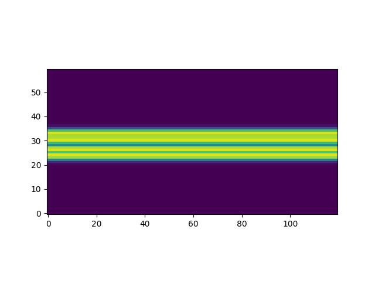
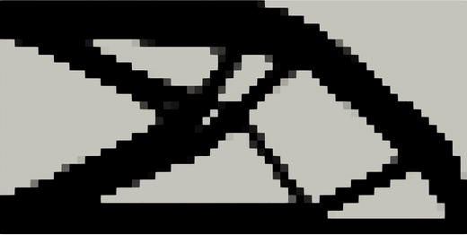

---
# Ensure that this title is the same as the one in `myst.yml`
title: Pipeline-level differentiable programming for the real world
abstract: |
  The tools enabling automatic differentiation are increasingly being adopted beyond machine learning to tackle optimization problems in various scientific and engineering contexts. These tools have catalyzed the development of differentiable simulators, solvers, 3D renderers, and other powerful components, under the umbrella of differentiable programming. However, building pipelines that propagate gradients effortlessly across components introduces unique challenges. Real-world pipelines often span diverse technologies, frameworks, computing environments, and skillsets. We argue for the need to support automatic differentiation on a system level to enable further growth of scientific progress. To that end, we present Tesseract, a software ecosystem that provides pipeline-level automatic differentiation at scale, and demonstrate its utility on a parameteric topology optimisation use case.
---

## Introduction

Countless problems in science and engineering can be framed as tuning tasks, where parameters of a complex process &mdash; such as a physical simulation or a lab experiment &mdash; are iteratively tuned to maximize an objective. For such tasks, differentiable programming (DP) has emerged as a powerful tool, due to its ability to automate and accelerate gradient-based operations, enabling "differentiable physics" by codifying the use of gradient information to optimize, correct, or control physical systems. At the core of DP is the technique known as automatic differentiation (autodiff, AD) to compute partial derivatives of computer programs without the need to spell out explicit forms of said derivatives. Autodiff techniques enjoy great success in the fields of artificial intelligence and machine learning (ML) thanks to proliferation of deep learning software frameworks such as TensorFlow, JAX, and PyTorch [@baydin2018automatic]. However, applications of AD in differentiable physics are largely untested at industrial scale, and ML frameworks are rarely designed for, nor tested on, practical science and engineering _systems_ (as opposed to single components). We believe this is a big limitation, and it is a barrier to the emerging method called Simulation Intelligence (SI) [@lavin2022simulationintelligence], where components from numerical simulation, scientific computing, and machine learning are combined to accelerate discoveries and designs.

Recognising the need for a robust system-level software support of Autodiff-capable pipelines, we put forth the design, implementation, and validation of a novel system engineering approach to AD-driven physics: "Differentiable Physics Programming" (DPP). DPP resolves the above challenges via autodiff-native software containerization and dataflow-based orchestration, built to be highly modular and interoperable with physics simulation tools and engineering data types, namely computational fluid dynamics (CFD) and computer-aided engineering (CAE) broadly. Such a system enables scientists and engineers of diverse backgrounds to build complex workflows centered around simulation and data-driven surrogate models, and propagate gradients throughout the entire workflow, thus unleashing the potential of AD on end-to-end applications.

To demonstrate DPP in action we leverage Tesseract, a software ecosystem that provides pipeline-level AD at real-world scale. We give an overview of Tesseract's software design and functionality, and demonstrate its intended use on a non-trivial problem of the minimization of compliance of a parametric structure made of a linear elastic material. Our aim in developing Tesseract is present the community with tools necessary to scale up the capabilities of autodiff-native scientific workflows, and to build the community that fosters the development of such workflows.

## The state of pipeline-level differentiable programming

Building pipelines that propagate gradients effortlessly across components introduces unique challenges. Real-world pipelines often span diverse technologies, frameworks, computing environments (local vs. distributed clusters; CPU vs. GPU), and teams with varying expertise. Additionally, legacy systems and non-differentiable components often need to coexist with modern AD-enabled frameworks.

To the best of our knowledge, modern scientific computing tools do not provide native support for service-level AD, limiting all autodiff processing to a single component. However it is certainly possible to combine multiple tools to create AD-capable components that can communicate over network. Typically such solution would involve an AD-native framework (e.g., JAX, TensorFlow, PyTorch, Julia) and a service layer that exposes gradient-specific endpoints. Service layer can be implemented using general-purpose web application frameworks (e.g. Flask or Django) or specialised serving solutions (e.g. Ray Serve, AWS SageMaker, Goolge Vertex AI). Crucially, there is no standardized gradient APIs, no REST/gRPC protocols to follow, so all of these solutions for service-level AD require large effort to define AD-relevant endpoints, input and output schemas. Additionally, it is necessary to factor in orchestration of distributed gradient calculation jobs and workflows.

We are not the first to recognise this gap, and there are several examples in academic literature of proposed solutions for distributed AD. @baker2021peering proposed a technique for distributed training of deep neural networks that leverages
the outer-product structure of the gradient of a network layer. @rush2024federated adopted AD to the context of federated learning of ML models. @tang2023auto considered the problem of differentiating computations expressed in relational databases. Notwithstanding these selected examples, even experimental support for pipeline-level AD is nascent, and it is remarkable that recent surveys on the state of AD do not consider it being an important research direction (@van2018automatic, @baydin2018automatic).

## Tesseracts enable differentiable physics programming at scale

### What is a Tesseract

Tesseracts enable complex scientific workflows at scale. They are components that allow scientists to expose experimental, research-grade software to the world. They are self-contained, self-documenting, and self-executing, via command line and HTTP. They are designed to be easy to create, easy to use, and easy to share, including in a production environment. Crucially, Tesseracts provide built-in support for propagating gradient information at the level of individual components, making it easy to build complex, diverse software pipelines that can be optimized end-to-end.

This functionality is implemented in Tesseract Core, the foundational library for defining and serving autodiff-capable components as containerized services. In its simplest form, every Tesseract has a single entrypoint `apply`, which wraps a software functionality of the user’s choice. Other API functions of a Tesseract relate to the operation implemented in `apply`, for example `input_schema` returns expected input structure and types, `jacobian` implements a derivative, and so forth. A Tesseract is created and distributed as Docker image, and exposes CLI and HTTP interfaces for communication. 

To support native integration into JAX-based pipelines, we introduce Tesseract-JAX, which wraps Tesseract Core components as JAX-compatible primitives. This allows users to compose, differentiate, and jit-compile pipelines involving Tesseracts using standard JAX transformations like `grad`, `jit` and `vmap`.

An overview of Tesseract creation process is depicted on @fig:tesseract-create-serve We invite interested readers to explore Tesseract API and usage patterns via its [official documentation](https://docs.pasteurlabs.ai/projects/tesseract-core/latest/). There is also a forum for questions and discussions at https://si-tesseract.discourse.group/ .

:::{figure} tesseract-scipy-1.png
:label: fig:tesseract-create-serve
:scale: 50%
The process of defining, creating, and serving a Tesseract.
:::

### Scientific pipelines with Tesseract

Since all Tesseracts can be seen as standalone and stateless components that expose a handful of endpoints with fixed schemas, it is trivial to build pipelines connecting multiple Tesseracts, thus creating complex workflows. Multi-step computational workflows are very common across various branches of science. For example, a CAE pipeline might include steps for generating geometry, meshing, simulation. Typical machine learning pipelines include steps for data preprocessing, postprocessing, dataset split, training, and validation of a trained model. Data processing pipelines replace error-prone manual workflows with a structured, automated solution, improving reproducibility, quality, scalability, and collaboration.

Several demonstrations of such pipelines already exist in Tesseract ecosystem:

- **[4D-Variational data assimilation for a chaotic dynamical system](https://github.com/pasteurlabs/tesseract-core/blob/7106bf39ae1e07f092e821741aea2b6a02a6d4f4/demo/data-assimilation-4dvar/demo.ipynb).** Using Tesseract Core, we hand-implement a data assimilation pipeline for a chaotic dynamical system. It exploits auto-differentiation capabilities of JAX to backpropagate gradients through the data generating process for efficient solution of the 4D-Variational problem.

- **[Gradient-based optimization of a differentiable CFD simulation](https://github.com/pasteurlabs/tesseract-jax/blob/a2f5a91e7d6f0381723dc99a47f5f08d3e76475b/examples/cfd/demo.ipynb).** Uses Tesseract-JAX to automatically register Tesseracts as JAX-compatible functions, and performs optimization over them. Tesseract-JAX is an extension that makes Tesseracts look and feel like regular JAX primitives, and makes them jittable, differentiable, and composable. @fig:tesseract-pipeline illustrates the process of working with Tesseract-JAX, and more information can be found in the [project's documentation](https://docs.pasteurlabs.ai/projects/tesseract-jax/latest/).

:::{figure} tesseract-scipy-2.png
:label: fig:tesseract-pipeline
:scale: 50%
The process of defining multi-tesseract pipelines with Tesseract-JAX.
:::

### Case study: Parametric shape optimization with differentiable FEM simulation

:::{figure} illustration.png
:label: fig:illustration
Data flow through a Tesseract-based pipeline for parametric shape optimization. Involves two separate Tesseracts: one for computing a signed distance field (SDF) from a parametric geometry, and another for computing the compliance of a structure given a density field via finite element analysis.
:::

As a concrete demonstration for how the Tesseract ecosystem enables differentiable physics programing, we present a novel [case study](optimize.ipynb) showcasing parametric end-to-end shape optimization of a geometric model with respect to its physical properties.

The core idea is to construct a parametric geometry using a standard 3D geometry library. We then compute an SDF (signed distance field) and apply a sigmoid function to transform it into a density field. The density field is then fed into a finite element solver, which then computes the compliance. Since the mapping from the design space parameters to the SDF is not implemented in way that enables automatic differentiation, we implement a custom AD endpoint using finite differences. Using Tesseract Core we implement the parameter-to-SDF-field function and the density field to compliance function as Tesseract components. We then leverage Tesseract-JAX and use the standard gradient computation function from JAX to compute the total gradient of the compliance with respect to the design parameters.

| Parametric Optimization (Ours) | Free Form Topology Optimization (jax-fem example) |
|-------------------------|---------------------------------|
|  |          |

We compare our solution with the free form topology optimization solution that is implemented in the jax-fem library [@xue2023jax]. We observe that our solution constructs a structure that is strikingly similar to the free form topology optimization solution, even though in our case the design space is parametrized by a small number of parameters.

Doing the above in a world without Tesseract would be significantly more difficult, for a number of reasons:

- **Heterogeneity of gradient computation**: In this pipeline some components rely on automatic differentiation, while others rely on finite differences. With Tesseracts and Tesseract-JAX, we can define the AD endpoints for each component and then use the standard gradient computation function from JAX to compute the total gradient of the compliance with respect to the design parameters.

- **Modularity**: The components of the pipeline are implemented as Tesseract components, which allows us to easily swap out components and reuse them in other pipelines. For example, we could replace the design space Tesseract relying on PyVista with a design space Tesseract relying on OpenSCAD.

- **Dependency management**: Tesseract components are containerized, which allows us to easily manage dependencies and ensure that the pipeline runs in a consistent environment, which greatly simplifies working with heavyweight scientific software like differentiable finite element solvers or graphics processing libraries.

- **Computing resources**: Tesseract components can be run on different computing resources, which allows us to easily scale the pipeline and run it on different machines. For example, we are able to run the finite element solver on a GPU machine and the design space Tesseract on a separate CPU node.

## Related work

Tesseracts offer a unique combination of containerised runtime for scientific computing and native AD capabilities. Considered separately, both these areas are rich with existing tools and frameworks.

**Containerised runtime.** There are several projects that provide containerisedruntime infrastructure for scientific computations. Some, including MLServer [@MLServer], BentoML [@BentoML], or Triton Inference Server [@Triton_Inference_Server], target primarily machine learning workloads. Other projects, such as UM-Bridge [@UMBridge] or Singularity [@kurtzer2017singularity], cover a broader scope of scientific domains. A key feature that separates Tesseract ecosystem from these project is its strong focus on gradient computation, and batteries-included approach to the entire SI component lifecycle.

**Automatic differentiation.** Given how critical is automatic differentiation (AD) to modern scientific workflows [@baydin2018automatic], it is not surprising that there is a wide range of software tools providing AD capabilities. Major deep learning frameworks PyTorch [@paszke2017automatic] and TensorFlow [@abadi2016tensorflow] both implement AD and make extensive use of it for training of ML models. AD is also one of the main features of JAX, a Python library for high performance numerical computing [@jax2018github], and its implementation in JAX strongly influenced design of Tesseract's API. Crucially, the majority of these frameworks support AD on a program level, and pipeline-scale AD is not nearly as common. While composite solutions are possible (e.g. combining AD-capable backend with an HTTP service), to the best of our knowledge Tesseract is the first software project that natively supports AD on the component level.

## Future work

The Tesseract ecosystem already supports a wide range of scientific and engineering workflows. However, not all of the envisioned use cases are sufficiently supported with tooling, non-trivial validation and demonstration, and documentation. We are actively working on several key directions to improve Tesseract's applicability and usability in real-world scenarios:

**Distributed and cloud-native automatic differentiation.** That is, gradient-based workflows that span multiple machines and heterogeneous environments, including HPC clusters and cloud platforms. This involves enabling remote gradient execution, efficient recomputation strategies, and distributed pipeline orchestration.

**Cross-framework integration.** Many scientific pipelines today mix components from different programming ecosystems. Tesseracts enable end-to-end gradient propagation across JAX, PyTorch, Julia, and other tools—treating them as composable, AD-aware Tesseract components.

**Wrapping simulations behind unified, differentiable interfaces.** Similar to frameworks like OpenAI Gymnasium, Tesseracts can serve as wrappers for expensive simulations—e.g., CFD solvers, structural mechanics codes—that expose unified APIs along with gradient endpoints. This makes it easy to use classical simulation software within differentiable optimization or reinforcement learning pipelines.

**Interoperability in CAE and beyond.** Many domain-specific tools in CAE are poorly integrated with AD tooling. Tesseracts are a natural fit to provide robust support for meshing, geometry processing, and legacy formats in differentiable workflows, allowing users to plug in existing CAE pipelines without compromising engineering efficiency.

**Pipeline-level DPP for real-world applications.** Ultimately, we aim to demonstrate the real-world viability of DPP across full scientific workflows. This includes hybrid pipelines that blend simulation and machine learning (e.g., surrogate modeling, control, inverse design), and stress-testing DPP tooling under realistic constraints.

These directions aim to establish Tesseract as a foundation for scalable, interoperable infrastructure for DPP—making it easier to prototype, deploy, and share gradient-based pipelines across scientific and engineering domains.

## Conclusions

Tesseract projects are born out of realisation that modern autodiff tooling is limited in its scaling capabilities. Tesseracts demonstrate how this gap can be addressed by elevating the concept of gradient tracking to a system level. We hope the community will recognise this need, and leverage Tesseract concept to improve efficiency and scalability of scientific data pipelines.

