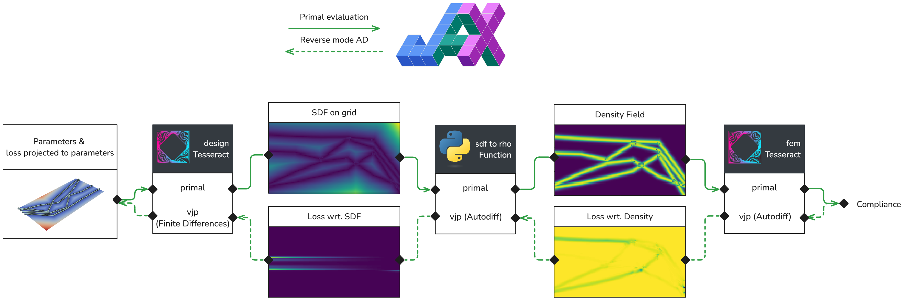

---
# Ensure that this title is the same as the one in `myst.yml`
title: Pipeline-level differentiable programming for the real world
abstract: |
  TBD
---

## Introduction
Countless problems in science and engineering can be framed as tuning tasks, where parameters of a complex process &mdash; such as a physical simulation or a lab experiment &mdash; are iteratively tuned to maximize an objective. For such tasks, differentiable programming (DP) has emerged as a powerful tool, due to its ability to automate and accelerate gradient-based operations, enabling "differentiable physics" by codifying the use of gradient information to optimize, correct, or control physical systems. At the core of DP is the technique known as automatic differentiation (autodiff, AD) to compute partial derivatives of computer programs without the need to spell out explicit forms of said derivatives. Autodiff techniques enjoy great success in the fields of artificial intelligence and machine learning (ML) thanks to proliferation of deep learning software frameworks such as TensorFlow, JAX, and PyTorch [@baydin2018automatic].

However, applications of AD in differentiable physics are largely untested at industrial scale, and ML frameworks are rarely designed for nor tested on practical science and engineering _systems_ (as opposed to single components). Building pipelines that propagate gradients effortlessly across components introduces unique challenges. Real-world pipelines often span diverse technologies, frameworks (e.g., JAX, TensorFlow, PyTorch, Julia), computing environments (local vs. distributed clusters; CPU vs. GPU), and teams with varying expertise. Additionally, legacy systems and non-differentiable components often need to coexist with modern AD-enabled frameworks.

Recognising the need for a robust system-level software support of Autodiff-capable pipelines, we put forth the design, implementation, and validation of a novel system engineering approach to AD-driven physics: "Differentiable Physics Programming" (DPP). DPP resolves the above challenges via autodiff-native software containerization and dataflow-based orchestration, built to be highly modular and interoperable with physics simulation tools and engineering data types, namely computational fluid dynamics (CFD) and computer-aided engineering (CAE) broadly. Such a system enables scientists and engineers of diverse backgrounds to build complex workflows centered around simulation and data-driven surrogate models, and propagate gradients throughout the entire workflow, thus unleashing the potential of AD on end-to-end applications.

To demonstrate the DPP system in action we leverage Tesseract, a software ecosystem that provides pipeline-level AD and unlocks DPP at scale. We give an overview of Tesseract's software design and functionality, and demonstrate its intended use on a non-trivial problem of the minimization of compliance of a parametric structure made of a linear elastic material. Our aim in developing Tesseract is present the community with tools necessary to scale up the capabilities of Autodiff-native scientific workflows.

## What is a Tesseract
We have designed Tesseract to enable complex scientific workflows at scale. Tesseracts are components that allow scientists to expose experimental, research-grade software to the world. They are self-contained, self-documenting, and self-executing, via command line and HTTP. They are designed to be easy to create, easy to use, and easy to share, including in a production environment. Crucially, Tesseracts provide built-in support for propagating gradient information at the level of individual components, making it easy to build complex, diverse software pipelines that can be optimized end-to-end.

In its simplest form, every Tesseract has a single entrypoint `apply`, which wraps a software functionality of the user’s choice. Other API functions of a Tesseract all build on `apply`, for example `input_schema` returns expected input structure and types, `jacobian` implements a derivative, and so forth. Tesseract is created and distributed as Docker image, and exposes CLI and HTTP interfaces for communication. A overview of Tesseract creation process is depicted on @fig:tesseract-create-serve We invite interested readers to explore Tesseract API and usage patterns via its [official documentation](https://docs.pasteurlabs.ai/projects/tesseract-core/latest/).

:::{figure} tesseract-scipy-1.png
:label: fig:tesseract-create-serve
The process of defining, creating, and serving a Tesseract.
:::

## Scientific pipelines with Tesseracts

Since all Tesseracts can be seen as standalone and stateless components that expose HTTP endpoints, it is possible to build complex pipelines connecting multiple Tesseracts, thus creating complex workflows. Multi-step computational workflows are very common across various branches of science. For example, a CAE pipeline might include steps for generating geometry, meshing, simulation. Typical machine learning pipelines include steps for data preprocessing, dataset split, training, and validation of a trained model. Data processing pipelines is a powerful approach that replaces error-prone manual workflow with a structured, automated solution, improving reproducibility, quality, scalability, and collaboration.

Several examples of such pipelines already exist in Tesseract ecosystem, including a [data assimilation pipeline for a chaotic Lorenz 96 model](https://docs.pasteurlabs.ai/projects/tesseract-core/latest/content/demo/data-assimilation-4dvar.html), and a [gradient-based optimization of a CFD simulation](https://docs.pasteurlabs.ai/projects/tesseract-jax/latest/demo_notebooks/cfd.html). While the former example orchestrates the pipeline evaluation manually, the latter uses Tesseract-JAX to automatically register Tesseracts as JAX-compatible functions. Tesseract-JAX is an extension the core Tesseract project that makes Tesseracts look and feel like regular JAX primitives, and makes them jittable, differentiable, and composable. @fig:tesseract-pipeline illustrates the process of working with Tesseract-JAX, and more information can be found in the [project's documentation](https://docs.pasteurlabs.ai/projects/tesseract-jax/latest/).

:::{figure} tesseract-scipy-2.png
:label: fig:tesseract-pipeline
The process of defining multi-tesseract pipelines with Tesseract-JAX.
:::

## Use case: Parametric Topology Optimization

As a proof of concept of Tesseract's ability to simplify differentiable physics programing, we present a [case study](optimize.ipynb) of parametric topology optimization. The idea is to construct a parametric geometry using a standard 3D geometry library. We then compute a SDF (signed distance field) and apply a sigmoid function to transform it into a density field. The density field is then fed into a finite element solver, which then computes the compliance. Since the mapping from the design space parameters to the SDF field is not implemented in way that enables automatic differentiation, we implement a custom AD endpoint using finite differences. Using tesseract-core we implement the parameter to sdf field function and the density field to compliance function as tesseract components. We then leverage tesseract-jax and use the standard gradient computation function from jax to compute the total gradient of the compliance with respect to the design parameters. 

| Parametric Optimization (Ours) | Free Form Topology Optimization |
|-------------------------|---------------------------------|
|  |          |

We compare our solution with the free form topology optimization solution that is implemented in the jax-fem library [@xue2023jax]. We can observe that our solution constructs a structure that is suprisingly similar to the free form topology optimization solution, even though in our case the design space is parametrized by a small number of parameters. Doing the above without using Tesseract is challenging due to the following reasons:

- **Hetereogeneity of gradient computation**: In this pipeline some components rely on automatic differentiation, while others rely on finite differences. With tesseracts and tesseract-jax we can define the AD endpoints for each component and then use the standard gradient computation function from JAX to compute the total gradient of the compliance with respect to the design parameters.

- **Modularity**: The components of the pipeline are implemented as tesseract components, which allows us to easily swap out components and reuse them in other pipelines. For example, we could replace the design space tesseract relying on PyVista with a design space tesseract relying on OpenSCAD.

- **Dependency management**: Tesseract components are containerized, which allows us to easily manage dependencies and ensure that the pipeline runs in a consistent environment. 

- **Computing ressources**: Tesseract components can be run on different computing resources, which allows us to easily scale the pipeline and run it on different machines. For example, we could run the finite element solver on a GPU machine and the design space tesseract on a CPU.

## Related work

Tesseract offers a unique combination of containerised runtime for scientific computing and native AD capabilities. Considered separately, both these areas are rich with existing tools and frameworks.

**Containerised runtime.** There are several projects that provide containerisedruntime infrastructure for scientific computations. Some, including MLServer [@MLServer], BentoML [@BentoML], or Triton Inference Server [@Triton_Inference_Server], target primarily machine learning workloads. Other projects, such as UM-Bridge [@UMBridge] or Singularity [@kurtzer2017singularity], cover a broader scope of scientific domains. A key feature that separates Tesseract ecosystem from these project is its strong focus on gradient computation.

**Automatic differentiation.** Given how critical is automatic differentiation (AD) to modern scientific workflows [@baydin2018automatic], it is not surprising that there is a wide range of software tools providing AD capabilities. Major deep learning frameworks PyTorch [@paszke2017automatic] and TensorFlow [@abadi2016tensorflow] both implement AD and make extensive use of it for training of ML models. AD is also one of the main features of JAX, Python library for high performance numerical computing [@jax2018github], and its implementation in JAX strongly influenced design of Tesseract's API. Crucially, the majority of these frameworks support AD on a program level, and component-scale AD is not nearly as common. While composite solutions are possible (e.g. combining AD-capable backend with an HTTP service), to the best of our knowledge Tesseract is the first software project that natively supports AD on the component level.

## Conclusions

----- What comes below is the example, to use for markup nits

