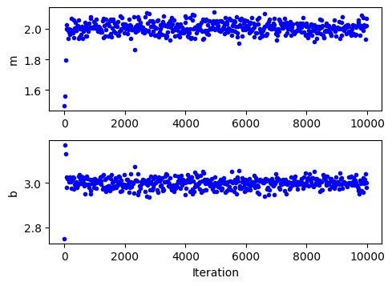
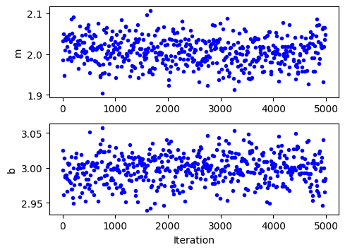
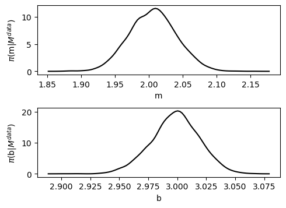
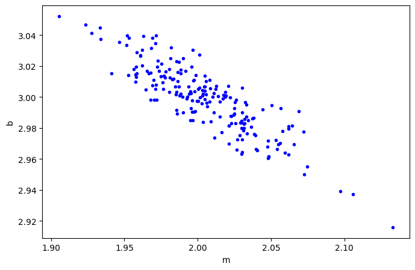
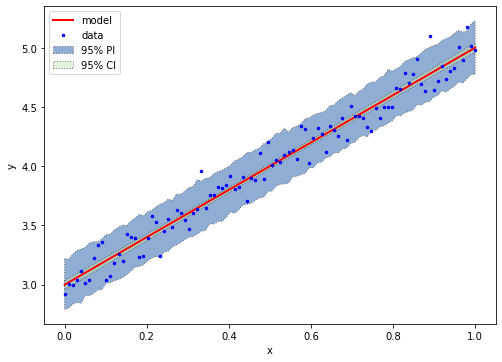
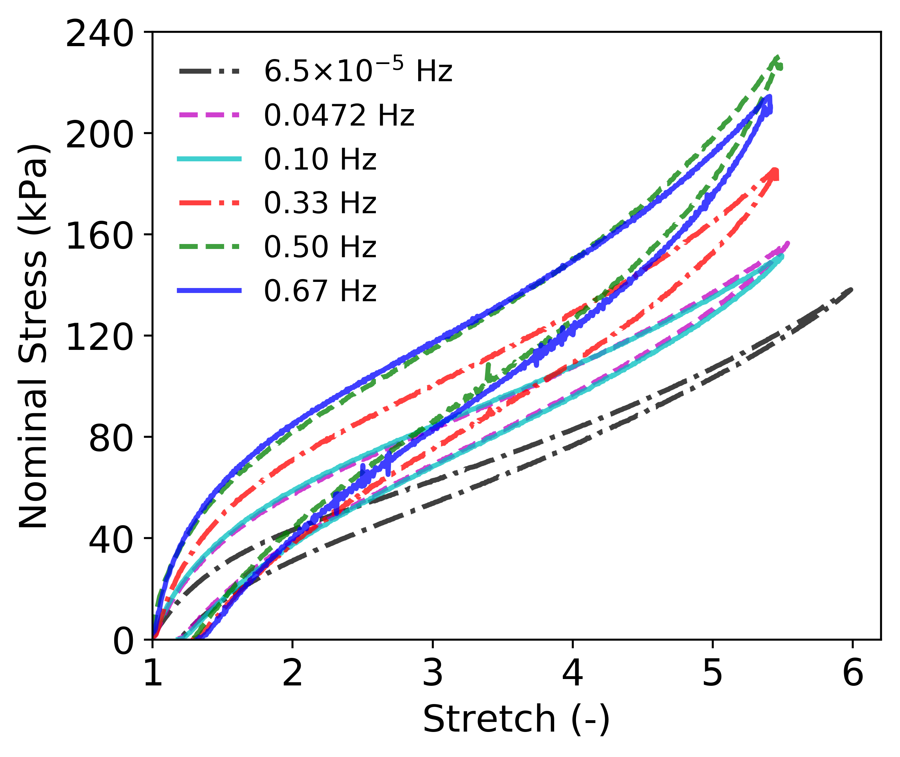
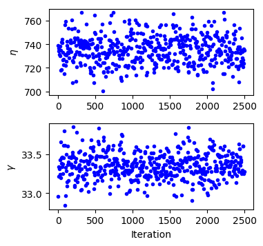
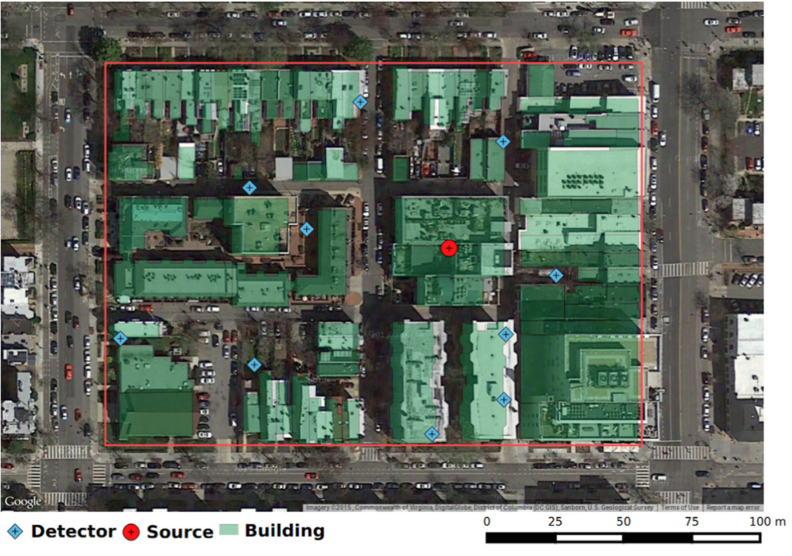
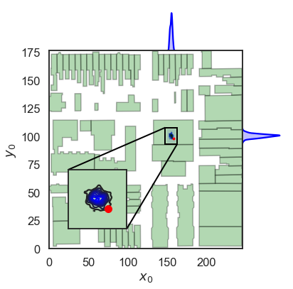

:author: Paul R. Miles
:email: prmiles@ncsu.edu
:institution: Department of Mathematics, North Carolina State University, Raleigh, NC 27695

:author: Ralph C. Smith
:email: rsmith@ncsu.edu
:institution: Department of Mathematics, North Carolina State University, Raleigh, NC 27695
:corresponding:

:bibliography: mybib

--------------------------------------------------------
Parameter Estimation Using the Python Package pymcmcstat
--------------------------------------------------------

.. class:: abstract

   A Bayesian approach to solving inverse problems provides insight regarding model limitations as well as the underlying model and observation uncertainty.  In this paper we introduce pymcmcstat, which provides a wide variety of tools for estimating unknown parameter distributions.  For scientists and engineers familiar with least-squares optimization, this package provides a similar interface from which to expand their analysis to a Bayesian framework.  This package has been utilized in a wide array of scientific and engineering problems, including radiation source localization and constitutive model development of smart material systems.

.. class:: keywords

   Markov Chain Monte Carlo (MCMC), Delayed Rejection Adaptive Metropolis (DRAM), Parameter Estimation, Bayesian Inference

Introduction
------------

Many scientific problems require calibration of model parameters.  This process typically involves comparing a model with a set of data, where the data either comes from experimental observations or high-fidelity simulations.  The model parameters are calibrated in a manner such that the model fits the data; i.e., observations are used to inversely determine the model inputs that led to that output.  A common example of this procedure is least-squares optimization, which is used in a wide variety of scientific disciplines.  Least-squares and many other methods exist for solving these inverse problems, but an important question to ask is whether or not they account for the underlying uncertainty.

Uncertainty exists in all areas of scientific research and it arises for various reasons.  A familiar source of uncertainty in data is simply a certain amount of random noise.  Alternatively, uncertainty also occurs due to missing physics in the model or from lack of knowledge.  Modeling scientific and engineering problems presents many challenges and often times requires compromise.  No model ever fully captures the physics; however, the model may still be useful for different applications :cite:`box1976science`.  With that in mind, we now highlight an approach to inverse problems that helps address uncertainty in the development of scientific and engineering models.

To quantify the uncertainty in our modeling problem, we utilize Bayesian inference.  The key point in this approach stems from the interpretation of the parameters within the model.  A Bayesian approach treats these unknown model parameters as random variables; i.e., they have an underlying probability distribution that can be used to describe them.  This contrasts a frequentist approach which assumes the parameters are unknown but have a fixed value.  The goal of Bayesian model calibration is to infer the parameter distributions.  This approach to inverse problems provides insight into model limitations as well as an accurate estimation of the underlying model and observation uncertainty.  A brief summary is provided in the next section, and more details regarding these methods can be found elsewhere :cite:`smith2014uncertainty`.

The Python package pymcmcstat :cite:`miles2019pymcmcstat` provides a robust platform for performing Bayesian model calibration.  Procedurally, the user provides data, defines model parameters and settings, and sets up simulation options.  As many intended users may be unfamiliar with Bayesian methods, the default package behavior requires minimal knowledge of statistics.  In fact, like many optimization problems, the user's main responsibility is to provide a sum-of-squares error function, which will become clear throughout the examples in this paper.

Within pymcmcstat, we use Markov Chain Monte Carlo (MCMC) methods to solve the Bayesian inverse problem :cite:`smith2014uncertainty`.  As many Python packages currently exist for performing MCMC simulations, we had several goals in developing this code.  To our knowledge, no current package contains the :math:`n`-stage delayed rejection algorithm, so pymcmcstat was intended to fill this gap.  Delayed rejection may be an unfamiliar concept, so more details are provided in the discussion of Metropolis algorithms in a later section.  Furthermore, many researchers in our community have extensive experience using the MATLAB toolbox `mcmcstat <https://mjlaine.github.io/mcmcstat/>`_ [#]_.  Our implementation provides a similar user environment, while exploiting Python structures.  We hope to decrease dependence on MATLAB in academic communities by advertising comparable tools in Python.

.. [#] https://mjlaine.github.io/mcmcstat/

This package has been applied to a wide variety of engineering problems, including constitutive model development of smart material systems as well as radiation source localization.  Several example problems will be presented later on, but first we will outline the package methodology.

Methodology
-----------
Knowledge of Bayesian statistics is important to understanding the theory, but it is not necessarily required information for using pymcmcstat.  We provide a brief overview of the Bayesian approach and then explain the key terms that impact the user by going through a basic example.

Bayesian Framework
~~~~~~~~~~~~~~~~~~
The goal of Bayesian inference is to estimate the posterior densities :math:`\pi(q|F^{obs}(i))`, which quantify the probability of parameter values given a set of observations.  From Bayes' relation

.. math::
    :label: eqnbayes

    \pi(q|F^{obs}(i)) = \frac{\mathcal{L}(F^{obs}(i)|q)\pi_0(q)}{\int_{\mathbb{R}^p}\mathcal{L}(F^{obs}(i)|q)\pi_0(q)dq},

we observe that the posterior is proportional to the likelihood and prior functions.  The function :math:`\mathcal{L}(F^{obs}(i)|q)` describes the likelihood of the observations given a parameter set, and any information known *a priori* about the parameters is defined in the prior distribution :math:`\pi_0(q)`.  The denominator ensures that the posterior integrates to unity.  Note, the integral in the denominator involves integrating over :math:`\mathbb{R}^p`, where :math:`p` is the number of model parameters.

The pymcmcstat package is designed to work with statistical models of the form

.. math::

    F^{obs}(i) = F(i; q) + \epsilon_i,\; \text{where}\; \epsilon_i\sim\mathit{N}(0, \sigma^2).

We expect the observations :math:`F^{obs}(i)` (experimental data or high-fidelity simulations) to equal the model response :math:`F(i; q)` plus independent and identically distributed error :math:`\epsilon_i` with mean zero and observation error variance :math:`\sigma^2`.  A direct result of assuming a statistical model of this nature is that the likelihood function becomes

.. math::
    :label: eqnlikelihood

    \mathcal{L}(F^{obs}(i)|q) = \exp\Big(-\frac{SS_q}{2\sigma^2}\Big),

where :math:`SS_q=\sum_{i=1}^{N_{obs}}[F^{obs}(i) - F(i, q)]^2` is the sum-of-squares error (:math:`N_{obs}` is the number of data points).  This is consistent with the observations being independent and identically distributed with :math:`F^{obs}(i)\sim\mathit{N}(F(i;q), \sigma^2)`.  As the observation error variance :math:`\sigma^2` is unknown in many cases, we will often include it as part of the inference process.

Direct evaluation of (:ref:`eqnbayes`) is often computationally untenable due to the integral in the denominator.  To avoid the issues that arise due to quadrature, we alternatively employ Markov Chain Monte Carlo (MCMC) methods.  In MCMC, we use sampling based Metropolis algorithms :cite:`metropolis1953equation` whose stationary distribution is the posterior density :math:`\pi(q|F^{obs}(i))`.  What this means is that we sample parameter values, evaluate the numerator of Bayes' equation (:ref:`eqnbayes`), and accept or reject parameter values using a Metropolis algorithm.  More details regarding Metropolis algorithms are provided in a later section.

Basic Example
~~~~~~~~~~~~~
At the end of the day, many users do not need to know the statistical background, but they can still appreciate the information gained from using the Bayesian approach.  Below we outline the key components of pymcmcstat and explain their relationship to the Bayesian approach described above.  Procedurally, to calibrate a model using pymcmcstat, the user will need to provide the following pieces:

1. Import and initialize MCMC object.
2. Add data to the simulation - :math:`F^{obs}(i)`. These may be either experimental measurements or high-fidelity model results.
3. Define model function: The user needs to define a model of the form :math:`F(i, q)`; i.e., a model that depends on a set of parameters :math:`q`.  Strictly speaking the model can be created in any language the user desires so long as it can be called within your Python script.  For example, if your model code is written in C++ or Fortran, this is easily done using `ctypes <https://docs.python.org/3/library/ctypes>`_ [#]_.  Note, the model does not need to be a separate :code:`def` statement, but can be included directly in the sum-of-squares function.
4. Define sum-of-squares function - :math:`SS_q`.  The sum-of-squares error between the model and data will be used in evaluating the likelihood function :math:`\mathcal{L}(F^{obs}(i)|q)`.
5. Define model settings and simulation options.  More details regarding these features will be provided in subsequent sections.
6. Add model parameters - :math:`q`. The user must specify the parameters in the model that need to be calibrated as well as define any limits regarding potential values those parameters can have.  By defining parameter minimum and/or maximum limits, the user has specified the prior function :math:`\pi_0(q)`.  By default, pymcmcstat assumes a uniform distribution for all parameters; i.e., there is equal probability of the parameter being a particular value between the minimum and maximum limit.
7. Execute simulation.
8. Analyze parameter chains.  The chains reflect the sampling history of the MCMC simulation.

.. [#] https://docs.python.org/3/library/ctypes

Let's walk through a basic example to see how all these pieces work together.  To start, we will generate some fictitious data,

.. code-block:: python

    import numpy as np
    x = np.linspace(0, 1, num=100)
    y = 2.0*x + 3.0 + 0.1*np.random.standard_normal(
                            x.shape)

Note, we assume data where observations :code:`y` have been made at independent points :code:`x`, which are uniformly distributed between 0 and 1.  The observations follow a linear trend with slope 2 and offset 3.  To make the data realistic we add random noise to the observations of the form :math:`\epsilon_i\sim\mathit{N}(0, \sigma^2)`.  In this case we define the observation error standard deviation to be :math:`\sigma=0.1`.

In this case we know what the model should be because we used it to generate the data.  We want to fit a linear model (i.e., :math:`F(i,q=[m,b])=mx_i+b`) to the observations.  To calibrate this model with pymcmcstat, the basic implementation is as follows:

.. code-block:: python

    # import and initialize
    from pymcmcstat.MCMC import MCMC
    mcstat = MCMC()
    # Add data
    mcstat.data.add_data_set(x, y)
    # Define sum of squares function
    def ssfun(q, data):
        m, b = q  # slope and offset
        x = data.xdata[0]
        y = data.ydata[0]
        # Evaluate model
        ymodel = m*x + b
        res = ymodel - y
        return (res ** 2).sum(axis=0)
    # Define model settings
    mcstat.model_settings.define_model_settings(
        sos_function=ssfun)
    # Define simulation options
    mcstat.simulation_options.define_simulation_options(
        nsimu=10.0e3)  # No. of MCMC simulations
    # Add model parameters
    mcstat.parameters.add_model_parameter(
        name='m',
        theta0=2.)  # initial value
    mcstat.parameters.add_model_parameter(
        name='b',
        theta0=2.75,  # initial value
        minimum=-5,  # lower limit
        maximum=5)  # upper limit
    # Run simulation
    mcstat.run_simulation()

We can check the results of the MCMC simulation by displaying the chain statistics.  Note, we typically remove the first part of the sampling chain as it may not have converged to the correct posterior depending on the initial value.

.. code-block:: python

    # Extract results
    results = mcstat.simulation_results.results
    chain = results['chain']
    burnin = int(chain.shape[0]/2)
    # display chain statistics
    mcstat.chainstats(chain[burnin:, :], results)

This will output to your display

.. code-block:: python

    name  : mean    std     MC_err  tau     geweke
    m     : 2.0059  0.0348  0.0015  7.1351  0.9912
    b     : 2.9983  0.0206  0.0009  7.9169  0.9962

Recall that the data was generated with a slope of 2 and offset of 3, so the algorithm appears to be converging to the correct values.  Additional items displayed include normalized batch mean standard deviation (:code:`MC_err`), autocorrelation time (:code:`tau`), and Geweke's convergence diagnostic (:code:`geweke`) :cite:`brooks1998assessing`.

A typical part of analyzing the results is to visualize the sampling history of the MCMC process.  This is accomplished by using pymcmcstat's :code:`plot_chain_panel` method.

.. code-block:: python

    mcpl = mcstat.mcmcplot  # initialize plotting methods
    mcpl.plot_chain_panel(chain, names)

    Parameter chains obtained with all 10,000 realizations of the linear model. :label:`figbasiccpfull`

    Parameter chains obtained with the final 5,000 realizations of the linear model. :label:`figbasiccp`

Figure :ref:`figbasiccpfull` shows the full parameter chains for all 10,000 MCMC simulations.  The algorithm takes a few simulations to reach the correct distribution, which is clearly seen by the jump at the beginning.  This is why we typically remove the first part of the chain to allow for burn-in.  We make another plot, except this time we have removed the first part of the chain.

.. code-block:: python

    mcpl.plot_chain_panel(chain[burnin:,:], names)

Figure :ref:`figbasiccp` shows the burned-in parameter chains based on the final 5,000 MCMC simulations.  We observe that the distribution of parameter values appears to be consistent for the entire range of sampling shown, which supports the conclusion that we have converged to the posterior distribution.  To visualize the distribution, we use the :code:`plot_density_panel` method.

.. code-block:: python

    mcpl.plot_density_panel(chain[burnin:,:], names)

Figure :ref:`figbasicdp` shows the marginal posterior parameter densities.  The densities are generated using a Kernel Density Estimation (KDE) algorithm based on the parameter chains shown in Figure :ref:`figbasiccp`.  The distributions appear to be nominally Gaussian in nature; however, that is not a requirement when running MCMC.  One more chain diagnostic that we commonly consider is with regard to parameter correlation.  We visualize the parameter correlation using the :code:`plot_pairwise_correlation_panel` method.

.. code-block:: python

    mcpl.plot_pairwise_correlation_panel(
          chain[burnin:, :], names)

Figure :ref:`figbasicpc` shows the pairwise parameter correlation based on the sample history of the MCMC simulation.  Essentially, we take the points from the chain seen in Figure :ref:`figbasiccp` and plot the matching points for :math:`m` and :math:`b` against one another.  As seen in Figure :ref:`figbasicpc`, there appears to be a negative correlation between the two parameters; however, it is not particularly strong.  The MCMC approach has no issues with correlated parameters, so these results are fine.  Where you have to be careful is when the pairwise correlation shows a nearly single-valued relationship of some kind.  By single-valued, we mean that the value of one parameter can be used to directly determine the other, e.g., if the pairwise correlation revealed a completely straight line.

    Marginal posterior parameter densities for linear model. :label:`figbasicdp`

    Pairwise correlation between sampling points for linear model. :label:`figbasicpc`

Now that we have distributions for the parameters, we want to know how that uncertainty propagates through the model.  Within pymcmcstat, the user has the ability to generate credible and prediction intervals.  Credible intervals represent the distribution of the model output based simply on propagating the uncertainty from the parameter distributions.  In contrast, prediction intervals also include uncertainty that arises due to observation errors :math:`\epsilon_i`.  The following example code can be used to generate and plot credible and prediction intervals using pymcmcstat

.. code-block:: python

    def modelfun(pdata, theta):
        m, b = theta
        x = pdata.xdata[0]
        y = m*x + b
        return y

    mcstat.PI.setup_prediction_interval_calculation(
        results=results,
        data=mcstat.data,
        modelfunction=modelfun,
        burnin=burnin)
    mcstat.PI.generate_prediction_intervals(
      calc_pred_int=True)
    # plot prediction intervals
    fg, ax = mcstat.PI.plot_prediction_intervals(
                adddata=True,
                plot_pred_int=True)
    ax[0].set_ylabel('y')
    ax[0].set_xlabel('x')

The procedure takes a subsample of the MCMC chain, evaluates the model for each sampled parameter set, and sorts the output to generate a distribution.

Figure :ref:`figbasicpi` shows the 95% credible and prediction intervals.  We observe that the credible intervals are fairly narrow, which is not surprising given the small amount of uncertainty in the parameter values (standard deviations of 0.03 and 0.02 for :math:`m` and :math:`b`, respectively).  This is not always the case, especially in instances where there is unknown or missing physics in the model.  However, we generated fictitious data using the model, so these results are reasonable.  Prediction intervals quantify the probability of observing future numerical predictions or experimental observations because they include both parameter and observation uncertainty.  For a 95% prediction interval, we expect a future observation to fall within that region 95% of the time.  As a general check, we note that approximately 95% of the data appears to be inside the prediction interval shown in Figure :ref:`figbasicpi`, which is consistent with what we expect.

    95% credible and prediction intervals for linear model. :label:`figbasicpi`

This concludes the basic example and highlights the workflow of how pymcmcstat could be used for a scientific problem.  Note, this example highlighted a linear model; however, the algorithm is also applicable to nonlinear models, examples of which are discussed in subsequent sections.

Metropolis Algorithms
---------------------
For those unfamiliar with Metropolis algorithms, we have provided a brief overview of the procedure.  For each step of the MCMC simulation, a new set of parameter values are proposed :math:`q^*`.  We accept or reject :math:`q^*` based on comparison with results obtained with the previous parameter set :math:`q^{k-1}`.  To do this we calculate the acceptance ratio

.. math::
    :label: eqnacceptratio

    \alpha = \frac{\mathcal{L}(F^{obs}(i)|q^*)\pi_0(q^*)}{\mathcal{L}(F^{obs}(i)|q^{k-1})\pi_0(q^{k-1})}.

We observe that (:ref:`eqnacceptratio`) compares the unscaled posterior probabilities.  Essentially, we are computing whether :math:`q^*` or :math:`q^{k-1}` is more likely.  For uniform prior distributions, this simplifies to comparing the likelihood function.  For the Gaussian likelihood function (:ref:`eqnlikelihood`), a smaller sum-of-squares error implies a larger likelihood.  So, if the error is reduced by evaluating the model with :math:`q^*`, the acceptance ratio will have a value :math:`\alpha > 1`.  In that case we accept the parameters and set :math:`q^k=q^*`.  In contrast, if the error increases (i.e., the likelihood decreases), the acceptance ratio becomes :math:`\alpha < 1`.  Rather than outright reject parameter sets that increase error, we conditionally accept :math:`q^*` if :math:`\alpha > \mathit{U}(0, 1)` (random value from a uniform distribution between 0 and 1).  In this way we will often accept values that yield similar errors because the acceptance ratio will be closer to 1.  Otherwise, we define the next simulation parameter set to be equal to the previous; i.e., :math:`q^k=q^{k-1}`.

Candidates, :math:`q^*`, are generated by sampling from a proposal distribution, which accounts for parameter correlation.  In an ideal case one can adapt the proposal distribution as information is learned about the posterior distribution from accepted candidates.  This is referred to as adaptive Metropolis (AM) and it is implemented in pymcmcstat using the algorithm presented in :cite:`haario2001adaptive`.  Another desirable feature in Metropolis algorithms is to include delayed rejection (DR), which helps to stimulate mixing within the sampling chain.  Good mixing simply means that the simulation is switching between points frequently and not stagnating on a single value; i.e., :math:`q^k=q^{k-1}` for many simulations in a row.  This has been implemented using the algorithm presented in :cite:`haario2006dram`.  A summary of the Metropolis algorithms available inside pymcmcstat is presented in Table :ref:`tabmetalg`.

.. raw:: latex

   \begin{table}[!t]
     \centering
     \caption{Metropolis algorithms available in pymcmcstat. \DUrole{label}{tabmetalg}}
     \begin{tabular}{ll}
     \hline \hline
     \multicolumn{2}{c}{{\bf Algorithm}}\tabularnewline
     \hline
     MH & Metropolis-Hastings\tabularnewline
     AM & Adaptive Metropolis\tabularnewline
     DR & Delayed Rejection\tabularnewline
     DRAM & DR + AM\tabularnewline
     \hline \hline
     \end{tabular}
   \end{table}

Options and Settings
--------------------
Below we provide a brief summary of common features and explanations of how a user might implement them for a particular problem.  As shown in the basic example, the user must define the options before running the simulation.  The following code segment shows several additional simulation features that a user might find useful.

.. code-block:: python

    mcstat.simulation_options.define_simulation_options(
        nsimu=10.0e3,  # No. of MCMC simulations
        method='dram',  # Metropolis algorithm
        updatesigma=True,  # Update obs. error var.
        savedir='mcmc_chains',  # Output dir.
        save_to_bin=True,  # Save chains to binary
        save_to_txt=True,  # Save chains to text
        savesize=int(1.0e3),  # Saving intervals
        waitbar=False,  # Display progress bar
        verbosity=0,  # Level of display while running
        )

The list of available Metropolis algorithms is found in Table :ref:`tabmetalg`, and the user can change it via the :code:`method` keyword argument.  To update the observation error variance, :math:`\sigma^2`, one sets :code:`updatesigma=True`.  The ability to update :math:`\sigma^2` is a direct result of the form of the likelihood function, and the reader is referred to :cite:`smith2014uncertainty` for more details.

Several arguments relate to the ability to save results into a running log file.  As the simulation runs, it periodically appends the sampling chain to a file.  In this case, it will create binary (:code:`save_to_bin=True`) and text (:code:`save_to_txt=True`) files in a directory (:code:`savedir='mcmc_results'`) and append the latest set of chain values every 1,000 simulations (:code:`savesize=int(1.0e3)`).  This can be extremely useful when running simulations over a long period of time.  The user can run diagnostics on the latest set of chain results while the simulation is still running.  For more details regarding this feature please see the tutorial on using `Chain Log Files <https://nbviewer.jupyter.org/github/prmiles/pymcmcstat/blob/master/tutorials/saving_to_log_files/Chain_Log_Files.ipynb>`_ [#]_.

.. [#] https://nbviewer.jupyter.org/github/prmiles/pymcmcstat/blob/master/tutorials/saving_to_log_files/Chain_Log_Files.ipynb

A progress bar will be displayed while the simulation runs; however, it is easily turned off by setting :code:`waitbar=False`.  Similarly, the program displays certain features depending on the level of :code:`verbosity` specified.  Setting :code:`verbosity=0` suppresses all text output display.  More information will be presented as you increase the value of :code:`verbosity`.

Additional options are available for specifying the initial parameter covariance matrix (proposal distribution), adaptation interval, stages of delayed rejection, as well as outputting results to a JSON file.  For more details regarding the options available in pymcmcstat, the reader is referred to the pymcmcstat `documentation <https://pymcmcstat.readthedocs.io/en/latest/>`_ [#]_ and `tutorials <https://nbviewer.jupyter.org/github/prmiles/pymcmcstat/blob/master/tutorials/index.ipynb>`_ [#]_.  Next, we will outline some specific scientific problems in which pymcmcstat has been utilized to gain insight regarding model limitations in light of uncertainty.

.. [#] https://pymcmcstat.readthedocs.io/
.. [#] https://nbviewer.jupyter.org/github/prmiles/pymcmcstat/blob/master/tutorials/index.ipynb

Case Studies
------------
Viscoelastic Modeling of Dielectric Elastomers
~~~~~~~~~~~~~~~~~~~~~~~~~~~~~~~~~~~~~~~~~~~~~~
Dielectric elastomers are a type of smart material commonly implemented within an adaptive structure, which provide unique capabilities for control of a structure's shape, stiffness, and damping :cite:`smith2005smart`.  These capabilities make them suitable for a wide variety of applications, including robotics, flow control, and energy harvesting :cite:`lines2001principles`, :cite:`cattafesta2011actuators`.  Accurately modeling this material presents many challenges in light of its viscoelastic behavior.  Viscoelastic materials exhibit a time-dependent strain response, which can vary significantly with the rate at which the material is being deformed :cite:`rubinstein2003polymer`.  To help visualize this behavior, Figure :ref:`figfinalcycles` shows uni-axial experimental data for the elastomer Very High Bond (VHB) 4910.  This highlights how as the material is deformed (i.e., stretch) you see a different stress response depending on the rate of deformation (i.e., stretch rate).  Furthermore, at each rate you see two lines.  The upper line reflects the material stress response as it is being loaded and the lower line is the stress as it is being relaxed.  The gap between loading and relaxing is called hysteresis and is commonly seen in viscoelastic materials like this.  For more details regarding the experimental procedure used to generate this data, the reader is referred to :cite:`miles2015bayesian`.

    Experimental data for VHB 4910.  The frequencies refer to different rates of deformation, or in this case different stretch rates, :math:`\dot{\lambda}`. :label:`figfinalcycles`

A variety of models can be used when modeling the behavior of these materials, but the details are beyond the scope of this paper.  We implement a model of the form :math:`F(i; q)` to predict the nominal stress response during the loading and unloading of the material.  The model depends on the parameter set

.. math::
    :label: eqnviscpar

    q = [G_c, G_e, \lambda_{max}, \eta, \gamma],

where each parameter helps describe a certain aspect of the physics that we are interested in modeling.  Details regarding these models can be found in :cite:`davidson2013nonaffine` and :cite:`miles2015bayesian`.  We calibrate the model with respect to the experimental data collected at :math:`\dot{\lambda}=0.67` Hz as shown in Figure :ref:`figfinalcycles`.

We can perform the MCMC simulation using the basic procedure previously outlined.  For this particular case study, we wish to point out several specific devices that were used, and a full implementation of the code for this problem can be found in the `Viscoelasticity Tutorial <https://nbviewer.jupyter.org/github/prmiles/pymcmcstat/blob/master/tutorials/viscoelasticity/viscoelastic_analysis_using_ctypes.ipynb>`_ [#]_.  To begin, we point out the potential advantages of using pymcmcstat in conjunction with models written in faster computing languages.

.. [#] https://nbviewer.jupyter.org/github/prmiles/pymcmcstat/blob/master/tutorials/viscoelasticity/viscoelastic_analysis_using_ctypes.ipynb

In any sampling based method, computational efficiency is extremely important, and most of your computational time will be spent in evaluating the model.  We note that computational performance can be significantly improved by writing the model functions in C++ or Fortran.  You can easily call these functions by utilizing the `ctypes package <https://docs.python.org/3/library/ctypes>`_, and an example of how to do this with pymcmcstat can be found in the `Viscoelasticity Tutorial <https://nbviewer.jupyter.org/github/prmiles/pymcmcstat/blob/master/tutorials/viscoelasticity/viscoelastic_analysis_using_ctypes.ipynb>`_.  For example, the elastomer model implemented here was written in both Python and C++.  The average run time for a single model evaluation using C++ was approximately 0.09 ms whereas the Python implementation took over 8 ms.  This particular model is reasonably fast in both languages, but we wished to point out the advantage of using more efficient code for the model evaluation.

Another item that commonly arises in model calibration is that not all your parameters are identifiable.  Determination of identifiable parameters is typically done using some type of sensitivity analysis, which is beyond the scope of this paper.  For this example, let us suppose that the first three parameters in :math:`q` have known, fixed values and therefore should not be included in the sampling chain of the MCMC simulation.  As they are fixed values, one could simply hard code the parameters into the sum-of-squares function like this

.. code-block:: python

    def ssfun(q, data):
        # Assign model parameters
        Gc, Ge, lam_max = 7.55, 17.7, 4.83
        eta, gamma = q
        # evaluate elastomer model
        ...

This solution is not ideal as you may later decide to include those parameters as part of the calibration.  To accommodate models with fixed parameters, pymcmcstat allows the user to specify whether or not to include parameters in the sampling process.  This is accomplished by specifying :code:`sample=False` as follows

.. code-block:: python

    # define model parameters
    mcstat.parameters.add_model_parameter(
        name='$G_c$',
        theta0=7.55,
        sample=False)
    mcstat.parameters.add_model_parameter(
        name='$G_e$',
        theta0=17.7,
        sample=False)
    mcstat.parameters.add_model_parameter(
        name='$\\lambda_{max}$',
        theta0=4.83,
        sample=False)
    mcstat.parameters.add_model_parameter(
        name='$\\eta$',
        theta0=708)
    mcstat.parameters.add_model_parameter(
        name='$\\gamma$',
        theta0=31)

This now allows the user to define their sum-of-squares function without hard coded values for the first three parameters.

.. code-block:: python

    def ssfun(q, data):
        # Assign model parameters
        Gc, Ge, lam_max, eta, gamma = q
        # evaluate elastomer model
        ...

    Parameter chains obtained with :math:`2.5\times10^3` realizations of the elastomer model. :label:`figcpvisc`

The final item for this case study relates to assessing chain convergence.  Previously, we outlined a variety of plotting methods available for looking at the sampling history and parameter correlation.  We also mentioned various statistical measures, such Geweke's convergence diagnostic and autocorrelation time.  The chain panel shown in Figure :ref:`figcpvisc` appears to be converged, but there is a possibility that the algorithm is stuck in a local minimum.  If you run the simulation longer, then you may see a jump in the chain as it finds another local minimum.  For a more rigorous assessment of chain convergence, the user can generate multiple sets of chains and use Gelman-Rubin diagnostics :cite:`gelman1992inference`.  An example of how to generate multiple chains with pymcmcstat can be found in the `Running Parallel Chains Tutorial <https://nbviewer.jupyter.org/github/prmiles/pymcmcstat/blob/master/tutorials/running_parallel_chains/running_parallel_chains.ipynb>`_ [#]_, which also includes information on how to calculate Gelman-Rubin diagnostics.

.. [#] https://nbviewer.jupyter.org/github/prmiles/pymcmcstat/blob/master/tutorials/running_parallel_chains/running_parallel_chains.ipynb

Radiation Source Localization
~~~~~~~~~~~~~~~~~~~~~~~~~~~~~
Efficient and accurate localization of special nuclear material (SNM) in urban environments is a vitally important task to national security and presents many unique computational challenges. A realistic problem requires accounting for radiation transport in 3D, using representative nuclear cross-sections for solid materials, and simulating the expected interaction with a network of detectors.  This is a non-trivial task that highlights the importance of surrogate modeling when high-fidelity models become computationally intractable for sampling based methods.  For the purpose of this example, we will highlight some previous research that utilizes a ray-tracing approach in 2D.  We simulate a 250m :math:`\times` 178m block of downtown Washington D. C. as shown in Figure :ref:`figurbanenv`.

   Simulated 250m :math:`\times` 178m block of downtown Washington D.C. :label:`figurbanenv`

We implement a highly simplified radiation transport model which ignores scattering.  The model accounts for signal attenuation that is caused by distance as well as interference from buildings that are in the path between the source and detector location.  This ray tracing model is implemented in the Python package `gefry3 <https://github.com/jasonmhite/gefry3>`_ [#]_.  Additional details regarding this research can be found in :cite:`hite2019bayesian`.

.. [#] https://github.com/jasonmhite/gefry3

As with the viscoelasticity case study, we only highlight several key features for solving this problem with pymcmcstat.  The complete code can be found in the `Radiation Source Localization Tutorial <https://nbviewer.jupyter.org/github/prmiles/pymcmcstat/blob/master/tutorials/radiation_source_localization/radiation_source_localization.ipynb>`_ [#]_.  The first item we wish to highlight is the ability to pass additional information into the sum-of-squares function by utilizing the :code:`user_defined_object` feature of the data structure.

.. [#] https://nbviewer.jupyter.org/github/prmiles/pymcmcstat/blob/master/tutorials/radiation_source_localization/radiation_source_localization.ipynb

.. code-block:: python

    # setup data structure for dram
    mcstat.data.add_data_set(
        x=np.zeros(observations.shape),
        y=observations,
        user_defined_object=[
            model,
            background,
        ],
    )

In this case, we have created an object which is a list with two elements: 1) the radiation transport model and 2) the background radiation.  These items are easily accessed within the sum-of-squares function.

.. code-block:: python

    # Radiation Sum of Squares Function
    def radiation_ssfun(theta, data):
        x, y, I = theta
        model, background = data.user_defined_object[0]
        output = model((x, y), I) + background
        res = data.ydata[0] - output
        ss = (res ** 2).sum(axis = 0)
        return ss

A Bayesian approach to source localization provides us with several very practical results.  Firstly, there are multiple regions of the domain that will yield comparable detector measurements, so assigning probabilities to various locations is more realistic than a single point estimate.  If one can infer regions of higher probability, it can then motivate the placement of new detectors in the domain or possibly allow for a team with handheld detectors to complete the localization process.  Given the challenges of modeling the radiation transport physics, it is extremely useful to visualize the potential source locations in light of the underlying uncertainty.  Figure :ref:`figxymarg` shows the marginal posterior densities, where it is clearly seen that the posteriors are very close to the true source location.  We note that this plot was generated using the mcmcplot package :cite:`mcmcplot2019v0.0.1`, and the required code can be found in the previously referenced `Radiation Source Localization Tutorial <https://nbviewer.jupyter.org/github/prmiles/pymcmcstat/blob/master/tutorials/radiation_source_localization/radiation_source_localization.ipynb>`_.

   Marginal posteriors from MCMC simulation presented in urban environment.  Actual source location is denoted by the red circle. :label:`figxymarg`

This is a very simplified case, but it highlights another unique problem in which pymcmcstat can be used to gain insight regarding uncertainty.

Concluding Remarks
------------------
The pymcmcstat package presents a robust platform from which to perform a wide array of Bayesian inverse problems using the Delayed Rejection Adaptive Metropolis (DRAM) algorithm.  In this paper we have provided a basic description of Markov Chain Monte Carlo (MCMC) methods and outlined a general example of how to implement pymcmcstat.  Furthermore, we highlighted aspects of two distinct areas of scientific study where MCMC methods provided enhanced understanding of the underlying physics.

To improve the overall usefulness of the pymcmcstat package, we will expand its functionality to allow for user-defined likelihood and prior functions (currently limited to Gaussian).  We designed the package to serve as a Python alternative for the MATLAB toolbox `mcmcstat <https://mjlaine.github.io/mcmcstat/>`_, so it is important to maintain the features of the original user interface for ease of transition from one platform to another.  Overall, the package is applicable to a wide variety of scientific problems, and provides a nice interface for users who are potentially new to Bayesian methods.

Acknowledgments
---------------

This research was supported by the Department of Energy National Nuclear Security Administration (NNSA) under the Award Number DE-NA0002576 through the Consortium for Nonproliferation Enabling Capabilities (CNEC).  Additional support was provided by the Air Force Office of Scientific Research (AFOSR) through Award Number FA9550-15-1-0299.

References
----------
