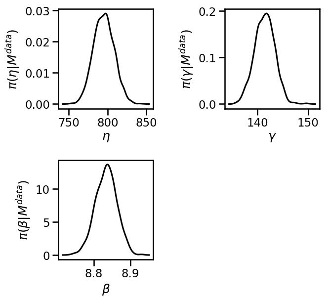
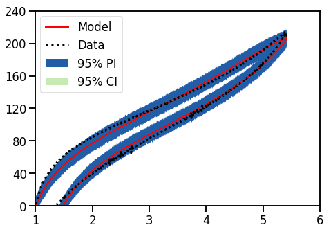
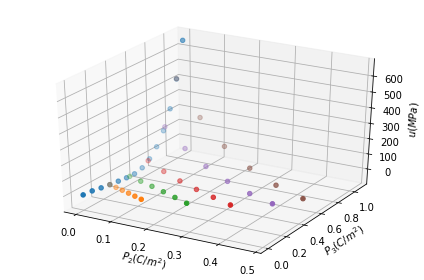
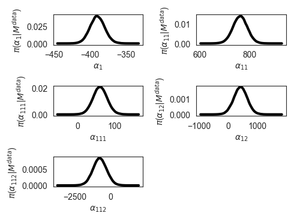
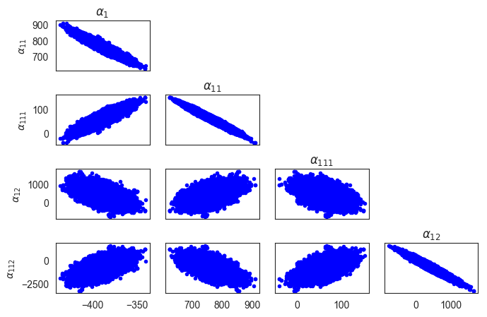

:author: Paul R. Miles
:email: prmiles@ncsu.edu
:institution: Department of Mathematics, North Carolina State University, Raleigh, NC 27695

:author: Ralph C. Smith
:email: rsmith@ncsu.edu
:institution: Department of Mathematics, North Carolina State University, Raleigh, NC 27695
:corresponding:

:bibliography: mybib

--------------------------------------------------------
Parameter Estimation Using the Python Package pymcmcstat
--------------------------------------------------------

.. class:: abstract

   A Bayesian approach to solving inverse problems provides insight regarding model limitations as well as the underlying model and observation uncertainty.  In this paper we introduce pymcmcstat, which provides a wide variety of tools for estimating unknown parameter distributions.  For scientists and engineers familiar with least-squares optimization, this package provides a similar interface from which to expand their analysis to a Bayesian framework.  This package has been utilized in a wide array of scientific and engineering problems, including radiation source localization and constitutive model development of smart material systems.

.. class:: keywords

   Markov Chain Monte Carlo (MCMC), Delayed Rejection Adaptive Metropolis (DRAM), Parameter Estimation, Bayesian Inference

Introduction
------------

Many scientific problems require calibration of model parameters.  This process typically involves comparing a model with a set of data, where the data either comes from experimental observations or high-fidelity simulations.  The model parameters are calibrated in a manner such that the model fits the data; i.e., observations are used to inversely determine the model inputs that led to that output.  A common example of this procedure is least-squares optimization, which is used in a wide variety of scientific disciplines.  Least-squares and many other methods exist for solving these inverse problems, but an important question to ask is whether or not they account for the underlying uncertainty.

Uncertainty exists in all areas of scientific research and it arises for various reasons.  A familiar source of uncertainty in data is simply a certain amount of random noise.  Alternatively, uncertainty also occurs due to missing physics in the model or from lack of knowledge.  Modeling scientific and engineering problems presents many challenges and often times requires compromise.  No model ever fully captures the physics; however, the model may still be useful for different applications :cite:`box1976science`.  With that in mind, we now highlight an approach to inverse problems that helps address uncertainty in the development of scientific and engineering models.

To quantify the uncertainty in our modeling problem, we utilize Bayesian inference.  The key point in this approach stems from the interpretation of the parameters within the model.  A Bayesian approach treats these unknown model parameters as random variables; i.e., they have an underlying probability distribution that can be used to describe them.  This contrasts a frequentist approach which assumes the parameters are unknown but have a fixed value.  The goal of Bayesian model calibration is to infer the parameter distributions.  This approach to inverse problems provides insight into model limitations as well as an accurate estimation of the underlying model and observation uncertainty.  A brief summary is provided in the next section, and more details regarding these methods can be found elsewhere :cite:`smith2014uncertainty`.

The Python package pymcmcstat :cite:`miles2019pymcmcstat` provides a robust platform for performing Bayesian model calibration.  Procedurally, the user provides data, defines model parameters and settings, and sets up simulation options.  As many intended users may be unfamiliar with Bayesian methods, the default package behavior requires minimal knowledge of statistics.  In fact, like many optimization problems, the user's main responsibility is to provide a sum-of-squares error function, which will become clear throughout the examples in this paper.

Within pymcmcstat, we use Markov Chain Monte Carlo (MCMC) methods to solve the Bayesian inverse problem :cite:`smith2014uncertainty`.  As many Python packages currently exist for performing MCMC simulations, we had several goals in developing this code.  To our knowledge, no current package contains the :math:`n`-stage delayed rejection algorithm, so pymcmcstat was intended to fill this gap.  Delayed rejection may be an unfamiliar concept, so more details are provided in the discussion of Metropolis algorithms in the next section.  Furthermore, many researchers in our community have extensive experience using the MATLAB toolbox `mcmcstat <https://mjlaine.github.io/mcmcstat/>`_.  Our implementation provides a similar user environment, while exploiting Python structures.  We hope to decrease dependence on MATLAB in academic communities by advertising comparable tools in Python.

This package has been applied to a wide variety of engineering problems, including constitutive model development of smart material systems as well as radiation source localization.  Several example problems will be presented later on, but first we will outline the package methodology.

Methodology
-----------
Knowledge of Bayesian statistics is important to understanding the theory, but it is not necessarily required information for using pymcmcstat.  We provide a brief overview of the Bayesian approach and then explain then key terms that impact the user.

The goal of Bayesian inference is to estimate the posterior densities :math:`\pi(q|F^{obs}(i))`, which quantify the probability of parameter values given a set of observations.  From Bayes' relation

.. math::
    :label: eqnbayes

    \pi(q|F^{obs}(i)) = \frac{\mathcal{L}(F^{obs}(i)|q)\pi_0(q)}{\int_{\mathbb{R}^p}\mathcal{L}(F^{obs}(i)|q)\pi_0(q)dq},

we observe that the posterior is proportional to the likelihood and prior functions.  The function :math:`\mathcal{L}(F^{obs}(i)|q)` describes the likelihood of the observations given a parameter set, and any information known *a priori* about the parameters is defined in the prior distribution :math:`\pi_0(q)`.  The denominator ensures that the posterior integrates to unity.  Note, the integral in the denominator involves integrating over :math:`\mathbb{R}^p`, where :math:`p` is the number of model parameters.

The pymcmcstat package is designed to work with statistical models of the form

.. math::

    F^{obs}(i) = F(i; q) + \epsilon_i,\; \text{where}\; \epsilon_i\sim\mathit{N}(0, \sigma^2).

We expect the observations :math:`F^{obs}(i)` (experimental data or high-fidelity simulations) to equal the model response :math:`F(i; q)` plus independent and identically distributed error :math:`\epsilon_i` with mean zero and observation error variance :math:`\sigma^2`.  A direct result of assuming a statistical model of this nature is that the likelihood function becomes

.. math::
    :label: eqnlikelihood

    \mathcal{L}(F^{obs}(i)|q) = \exp\Big(-\frac{SS_q}{2\sigma^2}\Big),

where :math:`SS_q=\sum_{i=1}^{N_{obs}}[F^{obs}(i) - F(i, q)]^2` is the sum-of-squares error (:math:`N_{obs}` is the number of data points).  This is consistent with the observations being independent and normally distributed with :math:`F^{obs}(i)\sim\mathit{N}(F(i;q), \sigma^2)`.  As the observation error variance :math:`\sigma^2` is unknown in many cases, we will often include it as part of the inference process.

Direct evaluation of (:ref:`eqnbayes`) is often computationally untenable due to the integral in the denominator.  To avoid the issues that arise due to quadrature, we alternatively employ Markov Chain Monte Carlo (MCMC) methods.  In MCMC, we use sampling based Metropolis algorithms :cite:`metropolis1953equation` whose stationary distribution is the posterior density :math:`\pi(q|F^{obs}(i))`.  What this means is that we sample parameter values, evaluate the numerator of Bayes' equation (:ref:`eqnbayes`), and accept or reject parameter values using a Metropolis algorithm.  A basic description of the Metropolis approach is outlined in a later section as well as a list of available algorithms within pymcmcstat.

Basic Example
-------------
At the end of the day, many users do not need to know the statistical background, but they can still appreciate the information gained from using the Bayesian approach.  Below we outline the key components of pymcmcstat and explain their relationship to the Bayesian approach described above.  Procedurally, to calibrate a model using pymcmcstat, the user will need to provide the following pieces:

1. Import and initialize MCMC object.
2. Add data to the simulation - :math:`F^{obs}(i)`. These may be either experimental measurements or high-fidelity model results.
3. Define model function: The user needs to define a model of the form :math:`F(i, q)`; i.e., a model that depends on a set of parameters :math:`q`.  Strictly speaking the model can be created in any language the user desires so long as it can be called within your Python script.  For example, if your model code is written in C++ or Fortran, this is easily done using the `ctypes package <https://docs.python.org/3/library/ctypes.html>`_.  Note, the model does not need to be a separate :code:`def` statement, but can be included directly in the sum-of-squares function.
4. Define sum-of-squares function - :math:`SS_q`.  The sum-of-squares error between the model and data will be used in evaluating the likelihood function :math:`\mathcal{L}(F^{obs}(i)|q)`.
5. Define model settings and simulation options.  More details regarding these features will be provided in subsequent sections.
6. Add model parameters - :math:`q`. The user must specify the parameters in the model that need to be calibrated as well as define any limits regarding potential values those parameters can have.  By defining parameter minimum and/or maximum limits, the user has specified the prior function :math:`\pi_0(q)`.  By default, pymcmcstat assumes a uniform distribution for all parameters; i.e., there is equal probability of the parameter being a particular value between the minimum and maximum limit.
7. Execute simulation.
8. Analyze parameter chains.  The chains reflect the sampling history of the MCMC simulation.

Let's walk through a basic example to see how all these pieces work together.  To start, we will generate some fictitious data,

.. code-block:: python

    import numpy as np
    x = np.linspace(0, 5, num=100)
    y = 2.0*x + 3.0 + 0.1*np.random.standard_normal(
                            x.shape)

Note, we assume data where observations :code:`y` have been made at independent points :code:`x`, which are uniformly distributed between 0 and 5.  The observations follow a linear trend with slope 2 and offset 3.  To make the data realistic we add random noise to the observations of the form :math:`\epsilon_i\sim\mathit{N}(0, \sigma^2)`.  In this case we define the observation error standard deviation to be :math:`\sigma=0.1`.

In this case we know what the model should be because we used it to generate the data.  We want to fit a linear model (i.e., :math:`F(i,q=[m,b])=mx_i+b`) to the observations.  To calibrate this model with pymcmcstat, the basic implementation is as follows:

.. code-block:: python

    # import and initialize
    from pymcmcstat.MCMC import MCMC
    mcstat = MCMC()
    # Add data
    mcstat.data.add_data_set(x, y)
    # Define sum of squares function
    def ssfun(q, data):
        m, b = q  # slope and offset
        x = data.xdata[0]
        y = data.ydata[0]
        # Evaluate model
        ymodel = m*x + b
        res = ymodel - y
        return (res ** 2).sum(axis=0)
    # Define model settings
    mcstat.model_settings.define_model_settings(
        sos_function=ssfun)
    # Define simulation options
    mcstat.simulation_options.define_simulation_options(
        nsimu=10.0e3)  # No. of MCMC simulations
    # Add model parameters
    mcstat.parameters.add_model_parameter(
        name='m',
        theta0=2.)  # initial value
    mcstat.parameters.add_model_parameter(
        name='b',
        theta0=2.75,  # initial value
        minimum=-5,  # lower limit
        maximum=5)  # upper limit
    # Run simulation
    mcstat.run_simulation()

We can check the results of the MCMC simulation by displaying the chain statistics.  Note, we typically remove the first part of the sampling chain as it may not have converged to the correct posterior depending on the initial value.  Details regarding chain diagnostics will be discussed in a later section.

.. code-block:: python

    # Extract results
    results = mcstat.simulation_results.results
    chain = results['chain']
    burnin = int(chain.shape[0]/2)
    # display chain statistics
    mcstat.chainstats(chain[burnin:, :], results)

This will output to your display

.. code-block:: python

    name  : mean    std     MC_err  tau     geweke
    m     : 2.0059  0.0348  0.0015  7.1351  0.9912
    b     : 2.9983  0.0206  0.0009  7.9169  0.9962

Recall that the data was generated with a slope of 2 and offset of 3, so the algorithm appears to be converging to the correct values.

A typical part of analyzing the results is to visualize the sampling history of the MCMC process.  This is accomplished by using pymcmcstat's :code:`plot_chain_panel` method.

.. code-block:: python

    mcpl = mcstat.mcmcplot  # initialize plotting methods
    mcpl.plot_chain_panel(chain, names)

.. figure:: figures/basic_cp_full.png

    Parameter chains obtained with all 10,000 realizations of the linear model. :label:`figbasiccpfull`

.. figure:: figures/basic_cp.png

    Parameter chains obtained with the final 5,000 realizations of the linear model. :label:`figbasiccp`

Figure :ref:`figbasiccpfull` shows the full parameter chains for all 10,000 MCMC simulations.  The algorithm takes a few simulations to reach the correct distribution, which is clearly seen by the jump at the beginning.  This is why we typically remove the first part of the chain to allow for burn-in.  We make another plot, except this time we have removed the first part of the chain.

.. code-block:: python

    mcpl.plot_chain_panel(chain[burnin:,:], names)

Figure :ref:`figbasiccp` shows the burned-in parameter chains based on the final 5,000 MCMC simulations.  We observe that the distribution of parameter values appears to be consistent for the entire range of sampling shown, which supports the conclusion that we have converged to the posterior distribution.  To visualize the distribution, we use the :code:`plot_density_panel` method.

.. code-block:: python

    mcpl.plot_density_panel(chain[burnin:,:], names)

Figure :ref:`figbasicdp` shows the marginal posterior parameter densities.  The densities are generated using a Kernel Density Estimation (KDE) algorithm based on the parameter chains shown in Figure :ref:`figbasiccp`.  One more chain diagnostic that we commonly consider is with regard to parameter correlation.  We visualize the parameter correlation using the :code:`plot_pairwise_correlation_panel` method.

.. code-block:: python

    mcpl.plot_pairwise_correlation_panel(
          chain[burnin:, :], names)

Figure :ref:`figbasicpc` shows the pairwise parameter correlation based on the sample history of the MCMC simulation.  Essentially, we take the points from the chain seen in Figure :ref:`figbasiccp` and plot the matching points for :math:`m` and :math:`b` against one another.  As seen in Figure :ref:`figbasicpc`, there appears to be a negative correlation between the two parameters; however, it is not particularly strong.  The MCMC approach has no issues with correlated parameters, so these results are fine.  Where you have to be careful is when the pairwise correlation shows a nearly single-valued relationship of some kind.  By single-valued, we mean that the value of one parameter can be used to directly determine the other, e.g., if the pairwise correlation revealed a completely straight line.

.. figure:: figures/basic_dp.png

    Marginal posterior parameter densities for linear model. :label:`figbasicdp`

.. figure:: figures/basic_pc.png

    Pairwise correlation between sampling points for linear model. :label:`figbasicpc`

Now that we have distributions for the parameters, we want to know how that uncertainty propagates through the model.  Within pymcmcstat, the user has the ability to generate credible and prediction intervals.  Credible intervals represent the distribution of the model output based simply on propagating the uncertainty from the parameter distributions.  In contrast, prediction intervals also include uncertainty that arises due to observation errors :math:`\epsilon_i`.  The following example code can be used to generate and plot credible and prediction intervals using pymcmcstat

.. code-block:: python

    def modelfun(pdata, theta):
        m, b = theta
        x = pdata.xdata[0]
        y = m*x + b
        return y

    mcstat.PI.setup_prediction_interval_calculation(
        results=results,
        data=mcstat.data,
        modelfunction=modelfun,
        burnin=burnin)
    mcstat.PI.generate_prediction_intervals(
      calc_pred_int=True)
    # plot prediction intervals
    fg, ax = mcstat.PI.plot_prediction_intervals(
                adddata=True,
                plot_pred_int=True)
    ax[0].set_ylabel('y')
    ax[0].set_xlabel('x')

The procedure takes a subsample of the MCMC chain, evaluates the model for each sampled parameter set, and sorts the output to generate a distribution.

Figure :ref:`figbasicpi` shows the 95% credible and prediction intervals.  We observe that the credible intervals are fairly narrow, which is not surprising given the small amount of uncertainty in the parameter values (standard deviations of 0.03 and 0.02 for :math:`m` and :math:`b`, respectively).  This is not always the case, especially in instances where there is unknown or missing physics in the model.  However, we generated fictitious data using the model, so these results are reasonable.  Prediction intervals quantify the probability of observing future numerical predictions or experimental observations because they include both parameter and observation uncertainty.  For a 95% prediction interval, we expect a future observation to fall within that region 95% of the time.  As a general check, we note that approximately 95% of the data appears to be inside the prediction interval shown in Figure :ref:`figbasicpi`, which is consistent with what we expect.

.. figure:: figures/basic_pi.png

    95% credible and prediction intervals for linear model. :label:`figbasicpi`

This concludes the basic example and highlights the workflow of how pymcmcstat could be used for a scientific problem.  Note, this example highlighted a linear model; however, the algorithm is also applicable to nonlinear models, examples of which are discussed in subsequent sections.  For more details regarding the options available in each step, the reader is referred to the pymcmcstat `documentation <https://pymcmcstat.readthedocs.io/en/latest/>`_ and `tutorials <https://nbviewer.jupyter.org/github/prmiles/pymcmcstat/blob/master/tutorials/index.ipynb>`_.

Simulation Options
------------------

For those unfamiliar with Metropolis algorithms, the key takeaway is that a set of parameters :math:`q^*` is accepted if the value of :math:`\mathcal{L}(F^{obs}(i)|q^*)\pi_0(q*)` is greater than the value using the previous parameter set :math:`q^{k-1}`.

In an ideal case one can adapt the proposal distribution as information is learned about the posterior distribution from accepted candidates.  This is referred to as adaptive Metropolis (AM) and it is implemented in pymcmcstat using the algorithm presented in :cite:`haario2001adaptive`.  Another desirable feature in Metropolis algorithms is to include delayed rejection (DR), which helps to stimulate mixing within the sampling chain.  This has been implemented using the algorithm presented in :cite:`haario2006dram`.  A summary of the Metropolis algorithms available inside pymcmcstat is presented in Table :ref:`tabmetalg`.

.. raw:: latex

   \begin{table}[!b]
     \centering
     \begin{tabular}{ll}
     \hline \hline
     \multicolumn{2}{c}{{\bf Algorithm}}\tabularnewline
     \hline
     MH & Metropolis-Hastings\tabularnewline
     AM & Adaptive Metropolis\tabularnewline
     DR & Delayed Rejection\tabularnewline
     DRAM & DR + AM\tabularnewline
     \hline \hline
     \end{tabular}

     \caption{Metropolis algorithms available in pymcmcstat. \DUrole{label}{tabmetalg}}

   \end{table}

Smart Material Systems
----------------------
Many smart material systems depend on robust constitutive relations for applications in robotics, flow control, and energy harvesting :cite:`lines2001principles`, :cite:`cattafesta2011actuators`.  To fully characterize the material or system behavior, uncertainty in the model must be accurately represented.  By using experimental data in conjunction with pymcmcstat, we can estimate the model parameter distributions and visualize how that uncertainty propagates through the system.  We will consider specific examples in viscoelastic modeling of dielectric elastomers and also continuum approximations of ferroelectric monodomain crystal structures.

Viscoelastic Modeling of Dielectric Elastomers
~~~~~~~~~~~~~~~~~~~~~~~~~~~~~~~~~~~~~~~~~~~~~~
Dielectric elastomers as part of adaptive structures provide unique capabilities for control of a structure's shape, stiffness, and damping :cite:`smith2005smart`.  Many of these materials exhibit viscoelastic behavior, which varies significantly with the rate of deformation :cite:`rubinstein2003polymer`.  Figure :ref:`figfinalcycles` shows uni-axial experimental data for the elastomer Very High Bond (VHB) 4910, which highlights how the hysteretic behavior increases with the rate of deformation.  For more details regarding the experimental procedure used to generate this data, the reader is referred to :cite:`miles2015bayesian`.

.. figure:: figures/final_cycle_for_each_rate.png

    Experimental data for VHB 4910.  The frequencies refer to different rates of deformation, or in this case different stretch rates, :math:`\dot{\lambda}`. :label:`figfinalcycles`

A variety of models can be used when modeling the behavior of these materials, but for the purpose of this demonstration we will focus on a nonaffine hyperelastic :cite:`davidson2013nonaffine` and integer-order linear viscoelastic representation :cite:`miles2015bayesian`.  The model calibration is performed with respect to the experimental data collected at :math:`\dot{\lambda}=0.67` Hz as shown in Figure :ref:`figfinalcycles`.

We can perform the MCMC simulation using the basic procedure previously outlined.  However, in many instances it is useful to be able to pass additional information into the sum-of-squares function.  This can be accomplished by utilizing the :code:`user_defined_object` feature of the data structure.  For our elastomer problem, we want to pass in two additional elements, 1) a function that describes the deformation, and 2) the number of terms to use in evaluating the model.

.. code-block:: python

    mcstat.data.add_data_set(
	x=x,
	y=y,
	user_defined_object=dict(
		stretch_function=stretch_function,
                num=400)

The information defined in the data structure can be accessed in the sum-of-squares function

.. code-block:: python

    def ssfun(thetavec, data):
    	# extract elements from data structure
    	time = data.xdata[0]
    	ydata = data.ydata[0]
	udo = data.user_defined_object[0]
    	stretch_function = udo['stretch_function']
    	num = udo['num']
    	# compute total stress
    	teval = np.linspace(time[0], time[-1],
		 num=num).reshape(num,)
    	modelraw = elastomer_model(
        	    thetavec, teval, stretch_function)
    	model = interp1d(teval,
                     modelraw.reshape(teval.shape),
                     kind='linear')
    	# compute sum-of-squares error
    	res = ydata - model(time).reshape(ydata.shape)
    	return ss = (res ** 2).sum(axis=0)

The function is evaluated at a subset of times and then interpolated to the points where experimental data exists.  This speeds up the model evaluation with a limited decrease in accuracy as it is reasonable to assume linear behavior within the time intervals specified.  We note that computational performance can be significantly improved by writing the model functions in C++ or Fortran.  You can easily call these functions by utilizing the `ctypes package <https://docs.python.org/3/library/ctypes.html>`_ and an example of how to do this with pymcmcstat can be found in the `Viscoelasticity Example <https://nbviewer.jupyter.org/github/prmiles/pymcmcstat/blob/master/tutorials/viscoelasticity/viscoelastic_analysis_using_ctypes.ipynb>`_ tutorial.

Most models are comprised of multiple parameters, not all of which should be included as part of the calibration.  To simplify the interface, the user  can pass fixed values into the function.  For our example, there are a total of six parameters - 3 hyperelastic (:math:`G_c, G_e, \lambda_{max}`) and 3 viscoelastic (:math:`\eta, \gamma, \beta`).  We do not want to sample the hyperelastic model parameters, so we simply set :code:`sample=False` when adding these terms to the parameter structure.

.. code-block:: python

    # define model parameters
    mcstat.parameters.add_model_parameter(
        name='$G_c$',
        theta0=lstheta0['Gc'],
        sample=False)
    mcstat.parameters.add_model_parameter(
        name='$G_e$',
        theta0=lstheta0['Ge'],
        sample=False)
    mcstat.parameters.add_model_parameter(
        name='$\\lambda_{max}$',
        theta0=lstheta0['lam_max'],
        sample=False)
    mcstat.parameters.add_model_parameter(
        name='$\\eta$',
        theta0=lstheta0['eta'],
        minimum=bounds['eta'][0],
        maximum=bounds['eta'][1])
    mcstat.parameters.add_model_parameter(
        name='$\\gamma$',
        theta0=lstheta0['gamma'],
        minimum=bounds['gamma'][0],
        maximum=bounds['gamma'][1])
    mcstat.parameters.add_model_parameter(
        name='$\\beta$',
        theta0=lstheta0['beta'],
        minimum=bounds['beta'][0],
        maximum=bounds['beta'][1])

We note that the :code:`lstheta0` and :code:`bounds` are simply dictionaries containing the results of a least-squares optimization and user-defined parameter bounds, respectively.  The values can be put directly in the parameter structure or referenced in any manner that the user prefers.

Figure :ref:`figcpvisc` shows the burned-in parameter values sampled during the MCMC process.  By "burn-in" we mean that we have sampled the values sufficiently such that the chains have converged to the posterior densities.  We remove the first part of the sampling chain to allow for burn-in and take the remaining portion to be the posterior distribution.  Given the consistent behavior of the sampling chain, we can be reasonably confident that the chains have converged to the posterior densities.  In Figure :ref:`figdpvisc`, we have plotted the posterior distributions using a kernel density estimator (KDE).  The distributions appear to be nominally Gaussian in nature; however, that is not a requirement when running MCMC.  For a more rigorous assessment of chain convergence, the user can generate multiple sets of chains and use Gelman-Rubin diagnostics :cite:`gelman1992inference`.  An example of how to generate multiple chains with pymcmcstat can be found in the `Running Parallel Chains <https://nbviewer.jupyter.org/github/prmiles/pymcmcstat/blob/master/tutorials/running_parallel_chains/running_parallel_chains.ipynb>`_ tutorial.

.. figure:: figures/ionv_cp.png
    :figclass: tb

    Parameter chains obtained with :math:`5\times10^3` realizations of the elastomer model. :label:`figcpvisc`

    Marginal posterior densities obtained using the parameter chains shown in Figure :ref:`figcpvisc`. :label:`figdpvisc`

In many problems it is of interest to observe how uncertainty propagates through the model to affect the output.  By sampling from the parameter posterior distributions, we can evaluate the model and construct credible intervals.  Similarly, we generate prediction intervals by also propagating the uncertainty associated with the observation error variance through the model.  Figure :ref:`figpivisc` shows the mean model response, experimental data, and 95% prediction and credible intervals.  We note that the credible intervals are too small to be observed at this scale.  As a sanity check, we verify the reasonableness of assuming a Gaussian likelihood function in (:ref:`eqnlikelihood`) by observing that the correct percentage of measured data appears to be contained within the 95% prediction interval.

    Propagation of uncertainty through elastomer model yields 95% prediction and credible intervals. :label:`figpivisc`

Regarding the amount of uncertainty observed in Figure :ref:`figpivisc`, it is important to note several items.  First, the amount of uncertainty in the output is large enough such that there are large regions of overlap in the loading and unloading parts of the cycle near the point of maximum extension.  Secondly, this volume of uncertainty  spans beyond the limits of experimental data collected at slower rates, meaning the model's ability to predict material behavior at other rates is limited.  This result motivated the investigation of a fractional-order viscoelastic model :cite:`mashayekhi2018fractional`.

Monodomain Crystal Structure Modeling in Ferroelectric Ceramics
~~~~~~~~~~~~~~~~~~~~~~~~~~~~~~~~~~~~~~~~~~~~~~~~~~~~~~~~~~~~~~~

Ferroelectric materials are used in a wide variety of engineering applications, necessitating methodologies that can account for uncertainty across multi-scale physics models.  Bayesian statistics allow us to quantify model parameter uncertainty associated with approximating lattice strain and full-field electron density from density functional theory (DFT) calculations as a homogenized, electromechanical continuum.

Consider the 6th order Landau function, :math:`u(q, {\bf P})`, where :math:`q = [\alpha_{1},\alpha_{11}, \alpha_{111},\alpha_{12},\alpha_{112},\alpha_{123}]`. The Landau energy is a function of 3-dimensional polarization space, :math:`{\bf P}=[P_1, P_2, P_3]`. For the purpose of this example, we consider the case where :math:`P_1 = 0`.  We are often interested in using information calculated from DFT calculations in order to inform our continuum approximations, such as our Landau function. For this example, we will assume we have a set of energy DFT calculations corresponding to different values of :math:`P_2` and :math:`P_3` as seen in Figure :ref:`figdftdata`. For more details regarding this research, the reader is referred to :cite:`miles2018analysis` and :cite:`leon2018analysis`.

    Stored energy density for various points in :math:`P_2-P_3` space as found using DFT. :label:`figdftdata`

We run a total of :math:`5\times10^5` MCMC simulations and remove the first half for burn-in.  Figure :ref:`figmonodp` shows the resulting posterior distributions, which appear to be nominally Gaussian.  A simple chain diagnostic that is often useful to consider is a pairwise correlation plot.  Figure :ref:`figmonopairs` shows the pairwise correlation with respect to each sampled parameter.  We observe fairly strong correlation between several of the Landau energy parameters, such as between :math:`\alpha_1` and :math:`\alpha_{11}`.  Correlated parameters occur frequently in many models, but there is nothing in the MCMC algorithm that prohibits such behavior.  In contrast, if we observe a very tight correlation that is nearly single-valued, this may imply that the parameters are not uniquely identifiable.  This highlights the importance of performing sensitivity analysis in conjunction with the parameter estimation.

    Marginal posterior densities of Landau energy parameters calibrating using DFT data shown in Figure :ref:`figdftdata`. :label:`figmonodp`

   Pairwise correlation from MCMC simulation.  Strong correlation is observed
   between several of the Landau parameters, which supports the results
   from the sensitivity analysis discussed in :cite:`leon2018analysis`. :label:`figmonopairs`

The user can evaluate the MCMC chains using a variety of statistical and diagnostic tools.  The simplest method to display a summary of chain metrics is to execute

.. code-block:: python

    burnin = int(chain.shape[0]/2)  # half of chain
    mcstat.chainstats(chain[burnin:,:], results)

which will display

::

    ---------------------
    name           :       mean        std ...
    $\alpha_{1}$   :  -389.7189    10.3126 ...
    $\alpha_{11}$  :   762.3086    29.3550 ...
    $\alpha_{111}$ :    60.7729    19.5034 ...
    $\alpha_{12}$  :   421.1136   233.7327 ...
    $\alpha_{112}$ :  -758.5364   481.1972 ...
    ---------------------

Not shown here are the outputs for normalized batch mean standard deviation (:code:`MC_err`), autocorrelation time (:code:`tau`), and Geweke's convergence diagnostic (:code:`geweke`) :cite:`brooks1998assessing`.  The chain metrics will be returned in a dictionary if the optional argument :code:`returnstats=True` is included when executing :code:`chainstats`.

Radiation Source Localization
-----------------------------
Efficient and accurate localization of special nuclear material (SNM) in urban environments is a vitally important task to national security and presents many unique computational challenges. A realistic problem requires accounting for radiation transport in 3D, using representative nuclear cross-sections for solid materials, and simulating the expected interaction with a network of detectors.  This is a non-trivial task that highlights the importance of surrogate modeling when high-fidelity models become computationally intractable for sampling based methods.  For the purpose of this example, we will highlight some previous research that utilizes a ray-tracing approach in 2D.  We simulate a 250m :math:`\times` 178m block of downtown Washington D. C. as shown in Figure :ref:`figurbanenv`.

.. figure:: figures/dc_environment.png
   :figclass: tb

   Simulated 250m :math:`\times` 178m block of downtown Washington D.C. :label:`figurbanenv`

We implement a highly simplified radiation transport model which ignores scattering.  The model accounts for signal attenuation that is caused by distance as well as interference from buildings that are in the path between the source and detector location.  This ray tracing model is implemented in the Python package `gefry3 <https://github.com/jasonmhite/gefry3>`_.  Additional details regarding this research can be found in :cite:`hite2019bayesian`.

A Bayesian approach to source localization provides us with several very practical results.  Firstly, there are multiple regions of the domain that will yield comparable detector measurements, so assigning probabilities to various locations is more realistic than a single point estimate.  If one can infer regions of higher probability, it can then motivate the placement of new detectors in the domain or possibly allow for a team with handheld detectors to complete the localization process.  Given the challenges of modeling the radiation transport physics, it is extremely useful to visualize the potential source locations in light of the underlying uncertainty.  Figure :ref:`figxymarg` shows the marginal posterior densities, where it is clearly seen that the posteriors are very close to the true source location.

.. figure:: figures/x_vs_y_2d.png
   :figclass: tb

   Marginal posteriors from MCMC simulation presented in urban environment.  Actual source location is denoted by the red circle. :label:`figxymarg`

Concluding Remarks
------------------
In this paper we have demonstrated several distinct areas of scientific study where MCMC methods provide enhanced understanding of the underlying physics.  The pymcmcstat package presents a robust platform from which to perform a wide array of Bayesian inverse problems using the Delayed Rejection Adaptive Metropolis (DRAM) algorithm.

Several examples were highlighted that demonstrated using pymcmcstat to calibrate different smart material systems.  For the dielectric elastomer VHB 4910, we calibrated the viscoelastic parameters and propagated the uncertainty through the model to generate credible and prediction intervals.  This provided insight regarding model limitations and led to the implementation of the fractional-order approach.  In consideration of ferroelectric materials, we used results obtained from high-fidelity DFT calculations to calibrate our Landau energy continuum approximation.  Given the multi-scale nature of this problem, accurate quantification of model parameter uncertainty is crucial.  Furthermore, observation of the pairwise correlation plot revealed that several parameters were strongly correlated.

With regarding to radiation transport, a Bayesian approach to parameter estimation provides extensive information about possible source locations with the resulting posterior distributions.  The posteriors illuminate the probability of potential source locations, which can be used to motivate future detector placement.  In practice, isolating the source location to within the span of a few buildings is an extremely useful result as at that point a team with handheld detectors can likely complete the localization process.

To improve the overall usefulness of the pymcmcstat package, we will expand its functionality to allow for user-defined likelihood and prior functions (currently limited to Gaussian).  We designed the package to serve as a Python alternative for the MATLAB toolbox `mcmcstat <https://mjlaine.github.io/mcmcstat/>`_, so it is important to maintain the features of the original user interface for ease of transition from one platform to another.  Overall, the package is applicable to a wide variety of scientific problems, and provides a nice interface for users who are potentially new to Bayesian methods and Python.

Acknowledgments
---------------

This research was supported by the Department of Energy National Nuclear Security Administration (NNSA) under the Award Number DE-NA0002576 through the Consortium for Nonproliferation Enabling Capabilities (CNEC).  Additional support was provided by the Air Force Office of Scientific Research (AFOSR) through Award Number FA9550-15-1-0299.

References
----------
