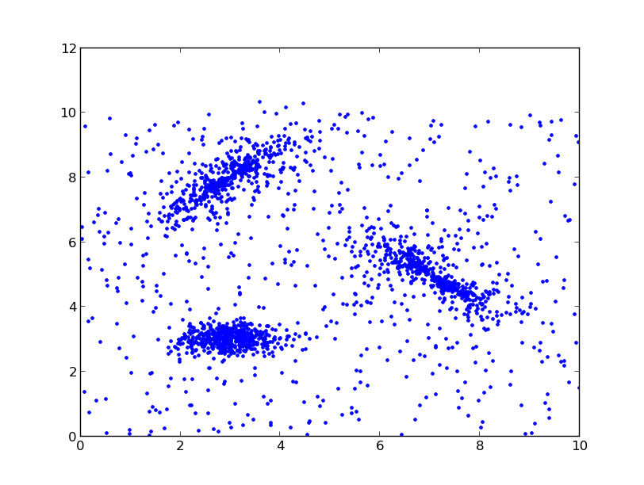
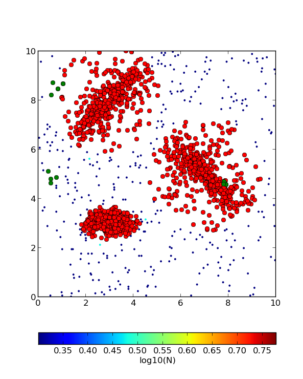
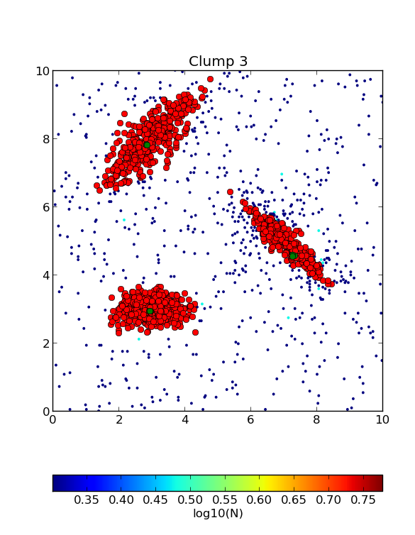
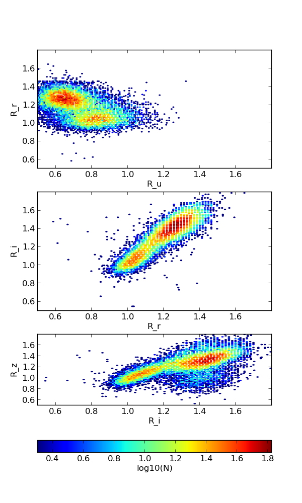
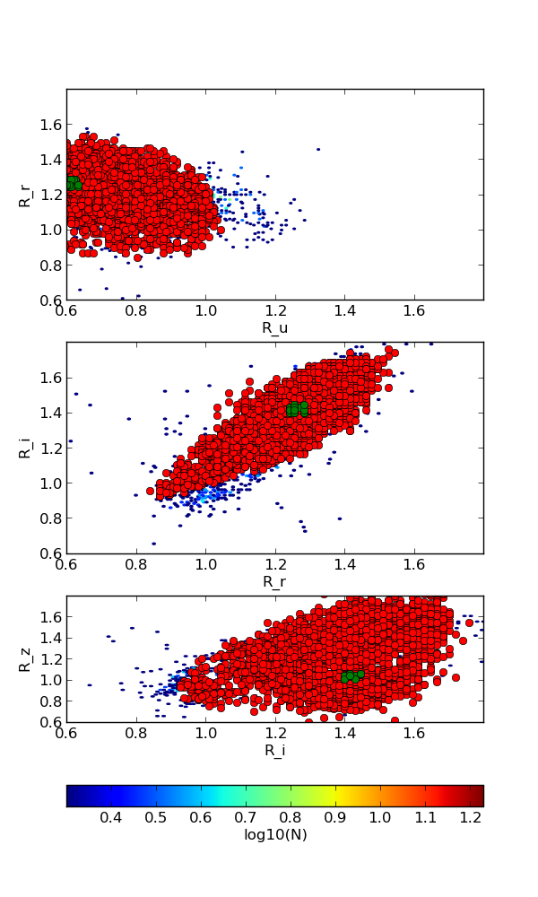
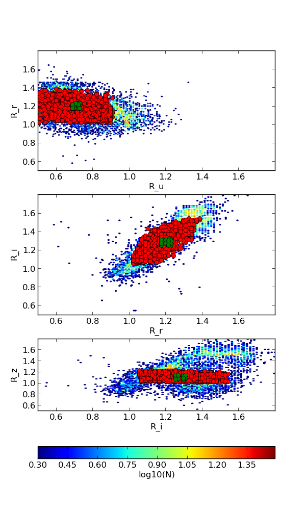

:author: Pedro Henrique Hasselmann
:email: hasselmann@on.br
:institution: Observatorio Nacional, Rio de Janeiro, Brazil

:author: Jorge Márcio Carvano
:email: carvano@on.br
:institution: Observatorio Nacional, Rio de Janeiro, Brazil

:author: Daniela Lazzaro
:email: lazzaro@on.br
:institution: Observatorio Nacional, Rio de Janeiro, Brazil

-------------------------------------------------------------
Adapted G-mode Clustering Method applied to Asteroid Taxonomy
-------------------------------------------------------------

.. class:: abstract

   The original G-mode was a clustering method developed by A. I. Gavrishin in the 70's for geochemical classification of rocks, 
   but was also applied to asteroid photometry, cosmic rays, lunar sample and planetary science spectroscopy data. 
   In this work, we used an adapted version to classify the asteroid photometry from SDSS Moving Objects Catalog. 
   The method works by identifying normal distributions in a multidimensional space of variables. 
   The identification starts by locating a set of points with smallest mutual distance in the sample, 
   which is a problem when data is not planar. Here we present a modified version of the G-mode algorithm,
   which was previously written in FORTRAN 77, in Python 2.7 and using NumPy, SciPy and Matplotlib packages. 
   The NumPy was used for array and matrix manipulation and Matplotlib for plot control. 
   The Scipy had a import role in speeding up G-mode, ``Scipy.spatial.distance.mahalanobis`` was chosen as distance estimator and 
   ``Numpy.histogramdd`` was applied to find the initial seeds from which clusters are going to evolve. 
   Scipy was also used to quickly produce dendrograms showing the distances among clusters.

   Finally, results for Asteroids Taxonomy and tests for different sample sizes and implementations are presented.

.. class:: keywords

   clustering, taxonomy, asteroids, statistics, multivariate data, scipy, numpy

Introduction
------------

The clusters can be identified using the G-mode multivariate clustering method, designed by A. I. Gavrishin and Coradini [Cor76]_. 
The algorithm was originally written in FORTRAN V by Cor77_ to classify geochemical samples [Cor76_, Bia80_], but is also applicable to a wide range of astrophysical fields, 
as Small Solar System Bodies [Bar87_, Bir96_, Ful08_, Per10_], disk-resolved remote sensing [Pos80_, Tos05_, Cor08_, Ley10_, Tos10_], cosmic rays [Gio81]_ and quasars [Cor83]_. 
In 1987, Bar87_ used original G-mode implementation to classify measurements of asteroids made by the Eight-Color Asteroid Survey [Zel85]_ and 
IRAS geometric albedos [Mat86]_ to produce a taxonomic scheme. Using a sample of 442 asteroids with 8 variables, they recognized 18 classes using a confidence level
of 97.7 %. Those classes were grouped to represent the asteroid taxonomic types. G-mode also identified that just 3 variables
were enough to characterize the asteroid taxonomy.  

The G-mode classifies *N* elements into *Nc* unimodal clusters containing *Na* elements each. Elements are described by *M* variables. 
This method is unsupervised, which allows an automatic identification of clusters without any *a priori* knowledge of sample distribution. 
For that, user must control only one critical parameter for the classification, the confidence levels :math:`q_{1}` or
its corresponding critical value :math:`G_{q1}`. Smaller this parameter get, more clusters are resolved and smaller their spreads are.

So, we choose this method to classify the asteroid observations from Sloan Digital Sky Moving Object Catalog, 
the largest data set on photometry containing around 400,000 moving object entries, 
due to its previous success on asteroid taxonomy, unsupervision and lower number of input parameters. 
However, we were aware the computational limitation we were going to face, since the method never was applied to samples larger than 10,000 elements [Ley10]_
and its last implementation was outdated. Therefore, the G-mode used here follows an adapted version of the original method published by Gav92_, 
briefly described by Ful00_ and reviewed by Tos05_ . 
Median central tendency and absolute deviation estimators, a faster initial seed finder and statistical whitening were introduced to produce a more 
robust set of clusters and optimize the processing time. The coding was performed using Python 2.7 with support of Matplotlib, NumPy and SciPy packages [*]_. 
The algorithm can be briefly summarized by two parts: the first one is the cluster recognition and 
the second evaluates each variable in the classification process. Each one are going to be described in the following sections. 

.. [*] The codebase_ is hosted through GitHub_ .

.. _codebase: http://github.com/pedrohasselmann/GmodeClass
.. _GitHub: http://github.com/pedrohasselmann
 
Recognition Of The Unimodal Clusters
------------------------------------

The first procedure can be summarized by the following topics and code snippets:

- *The data is arranged in N X M matrix*. All variables are ``Scipy.cluster.vq.whiten`` , 
  which means they are divided by their absolute deviation to scale all them up. 
  This is a important measure when dealing with percentage variables, such as geometric albedos.

- *Initial seed of a forming cluster is identified*. 
  At the original implementation, the G-mode relied on a force-brute algorithm to find the three closest elements as initial seed, 
  which required long processing time. Therefore, in this version, the initial seeds are searched recursively using ``Numpy.histogramdd`` , which
  speeds up the output:

  .. code-block:: python

      ###### barycenter.py ######

      def boolist(index, values, lim):
          if all([boo(item[0],item[1]) \
             for item in izip(values,lim)]):
             return index

       def pairwise(iterable):
           """s -> (s0,s1), (s1,s2), (s2, s3), ..."""
           a, b = tee(iterable)
           next(b, None)
           return izip(a, b)

       def volume(lst):
           p = 1
           for i in lst: p *= i[1] - i[0]
           return p
    
       def barycenter_density(data, grid, upper, \
           lower, dens, nmin):
   
           from numpy import histogramdd, array, \
           unravel_index, amax
   
           rng   = range(data.shape[1])
       
           nbin = map(int,array([grid]*data.shape[1]))
       
           hist, edges = histogramdd( \
           data,bins=nbin,range=tuple(zip(lower, upper))
                                     \ )
       
           limits = array( \ 
           [list(pairwise(edges[i])) for i in rng])
       
           ind = unravel_index(argmax(hist), hist.shape) 

           zone = array([limits[i,j] \
                  for i, j in izip(rng, ind)])
       
           density = amax(hist) / volume(zone)
       
           if density > dens and amax(hist) > nmin:
              zone = zone.T
              return barycenter_density(data, grid, \
                     zone[1], zone[0], density, nmin)
           else:
              return filter(lambda x: x != None, \
                     imap(lambda i, y: \
                     boolist(i,y,zone), \
                     xrange(data.shape[0]), data))

The function above divides the variable hyperspace into large sectors, and just in the most crowded sector the initial seed is searched for. 
Recursively, the most crowded sector is once divided as long as the density grows up. 
When density decreases or the minimal number of points set by the user is reached, the procedure stops. 
The initial seed is chosen from the elements of the most crowded sector. 
In the end, starting central tendency :math:`\mu_{i}` and standard deviation :math:`\sigma_{i}` are estimated from the initial seed. 
If any standard deviation is zero, the value is replaced by the median uncertainty of the variable.                 

- *Z² criterion*. In the next step, the Mahalanobis distance (``Scipy.spatial.distance.mahalanobis``) between 
  the tested cluster and all elements are computed:
  
  .. math::

     \overrightarrow{Z^{2}}_{j}=(\overrightarrow{\chi_{j}}-\overrightarrow{\mu})^{T}S^{-1}(\overrightarrow{\chi_{j}}-\overrightarrow{\mu})

  where :math:`\chi_{j}`  is the jth element and ``S`` is covariance matrix of the tested cluster.

- *Hypothesis Testing*. The Z² estimator follows a :math:`\chi^{2}` distribution, but for sake of simplification, 
  Z² can be transformed to Gaussian estimator ``G`` if the degree of freedom :math:`\vec{f}` is large enough, which is satisfied for most of samples. 
  Now, the critical value :math:`G_{q1}` in hypothesis testing are given as multiples of :math:`\sigma` , simplifying its interpretation. 
  Therefore, the vectorized transformation [Abr72]_ can be written:

  .. math:: 

     \vec{G_{j}}=\sqrt{2\cdot\vec{Z^{2}}}-\sqrt{2\cdot\frac{\vec{f}}{N}-1}
 

  while the elements of the vector degree of freedom are given by:
   
  .. math::

     f_{k}=N\cdot\frac{M}{\sum_{s=1}^{M}r_{ks}^{2}}
 
  for :math:`f_{k} > 100` , where :math:`r_{ks}^{2}` is the correlation coefficient. For :math:`30 < f_{k} < 100` , the ``G`` parameter becomes: 

  .. math::

     \vec{G_{j}}=\frac{\left(\frac{Z^{2}}{\vec{f}}\right)^{1/3}-(1-\frac{2}{9}\cdot\frac{\vec{f}}{N})}{\sqrt{\frac{2}{9}\cdot\frac{\vec{f}}{N}}}
 
  Then the null hypothesis :math:`\chi_{ij} = \mu_{i}` is tested with a statistical significance of :math:`P(G_{j} \leq G_{q_{1},f})` for a :math:`\chi_{j}`
  to belong to a tested class, i.e., a class contains the :math:`\chi_{j}` element if its estimator :math:`G_{j}` satisfies :math:`G_{j} \leq G_{q_{1}}` .

- :math:`\mu_{i}` *and* :math:`\sigma_{i}` *are redefined on each iteration*. The iteration is executed until the *Na*
  and correlation matrix *R* become unchanged. Once the first unimodal cluster is formed, its members are removed from sample and 
  the above procedure is applied again until all the sample is depleted, no more initial seeds are located or the condition ``N > M-1``
  is not satisfied anymore. If a initial seed fails to produce a cluster, its elements are also excluded from the sample.

As soon as all unimodal clusters are found and its central tendency and absolute deviation are computed, the method goes to the next stage: 
to measure the hyper-dimension distance between classes and evaluate the variable relevance to the classification.

Variable Evaluation and Distance Matrix
---------------------------------------
 
This part of the method is also based on Z² criterion, but now the objects of evaluation are the clusters identified on the previous stage. 
The variables are tested for their power to discriminate clusters against each other. For this purpose, the elements of the :math:`Nc \times Nc`
(*Nc*, the number of classes) symmetric matrices of Gc estimators are computed for each variable i as follows:

.. math::

   Gc_{i}(a,b)=\sqrt{2\left[Z_{i}^{2}(a,b)+Z_{i}^{2}(b,a)\right]}-\sqrt{2\left(N_{a}+N_{b}\right)-1}
 
where *Na* and *Nb* are respectively the number of members in the a-th and b-th class, while :math:`Z_{i}^{2}(a,b)` and :math:`Z_{i}^{2}(b,a)` 
are a reformulation of Z² estimator, now given by:

.. math::

   Z_{i}^{2}(a,b)=\sum_{j=1}^{N_{b}}Z_{ijb}^{2}=\sum_{j=1}^{N_{b}}\frac{\left(\chi_{ijb}-\mu_{i,a}\right)^{2}}{\sigma_{i,a}^{2}}
 
:math:`Z_{i}^{2}(b,a)` can be found just by  permuting the equation indices.

The :math:`Gc_{i}` matrix gives the efficiency of variable i to resolve the clusters, thus the smaller are its element values, less separated are the classes. 
To discriminate the redundant variables, all the elements of :math:`Gc_{i}` matrix are tested against the null hypothesis :math:`\mu_{i,a} = \mu_{i,b}` , 
and if all of them does not satisfies :math:`Gc_{i}(a,b) < G_{q_{1}}`, the method is iterated again without the variable *i*. 
The method is repeated until stability is found on the most suitable set of meaningful variables for the sample.

The :math:`Nc \times Nc` symmetric Distance Matrix between clusters with respect to all meaningful variables is also calculated. 
The same interpretation given to :math:`G_{i}`  matrices can be used here: higher D²(a,b) elements, more distinct are the clusters from each other.
D²(a,b) matrix is used to produce a ``Scipy.cluster.hierarchy.dendrogram`` , which graphically shows the relation among all clusters.

Robust Median Statistics
------------------------

Robust Statistics seeks alternative estimators which are not excessively affected by outliers or departures from an assumed sample distribution. 
For central tendency estimator : math:`\mu_{i}`, the median was chosen over mean due to its breakdown point of 50 % against 0% for mean. 
Higher the breakdown point, the estimator is more resistant to variations due to errors or outliers. 
Following a median-based statistics, the Median of Absolute Deviation (MAD) was selected to represent the standard deviation estimator :math:`\sigma`. 
The MAD is said to be conceived by Gauss in 1816 [Ham74]_ and can be expressed as:

.. math::
 
   MAD(\chi_{i})=med\left\{ |\chi_{ji}-med\left(\chi_{i}\right)|\right\} 
 
To be used as a estimator of standard deviation, the MAD must be multiplied by a scaling factor K, which adjusts the value for a assumed distribution. 
For Gaussian distribution, which is the distribution assumed for clusters in the G-mode, ``K = 1.426`` . Therefore:

.. math::

   \sigma_{i}=K\cdot MAD
 
To compute the Mahalanobis distance is necessary to estimate the covariance matrix.
MAD is expanded to calculate its terms:

.. math::

   S_{ik}=K^{2}\cdot med\left\{ |\left(\chi_{ji}-med\left(\chi_{i}\right)\right)\cdot\left(\chi_{jk}-med\left(\chi_{k}\right)\right)|\right\} 
 
The correlation coefficient :math:`r_{s,k}` used in this G-mode version was proposed by She97_ to be a median counterpart to 
Pearson correlation coefficient, with breakpoint of 50%, similar to MAD versus standard deviation. 
The coefficient is based on linear data transformation and depends on MAD and the deviation of each element from the median:        

.. math::

   r_{i,k}=\frac{med^{2}|u|-med^{2}|v|}{med^{2}|u|+med^{2}|v|}

where

.. math::

   u=\frac{\chi_{ij}-med\left(\chi_{s}\right)}{\sigma_{i}}+\frac{\chi_{kj}-med\left(\chi_{k}\right)}{\sigma_{k}}

.. math::

   v=\frac{\chi_{ij}-med\left(\chi_{m}\right)}{\sigma_{i}}-\frac{\chi_{kj}-med\left(\chi_{n}\right)}{\sigma_{k}}
 
The application of median statistics on G-mode is a departure from the original concept of the method. 
The goal is producing more stable classes and save processing time from unnecessary successive iterations.

Code Structure, Input And Output
--------------------------------

The ``GmodeClass`` package, hosted in GitHub_ ,  is organized in a object-oriented structure. The code snippets
below show how main class and its objects are implemented, explaining what each one does, 
and also highlighting its dependences:

.. code-block:: python

   ################# Gmode.py #################

   # modules: kernel.py, eval_variables.py, 
   # plot_module.py, file_module.py, gmode_module.py
   
   def main():
       # dependencies: optparse
       # Import shell commands
   
   class Gmode:
         
         def __init__(self):
         # Make directory where tests are hosted.
         
         def Load(self):     
         # Make directory in /TESTS/ where test's plots, 
         # lists and logs are kept.
         # This object is run when 
         # __init__() or Run() is called. 
         
         def LoadData(self, file):
         # dependencies: operator
         # Load data to be classified.
         
         def Run(self, q1, sector, ulim, minlim):
         # dependencies: kernel.py
         # Actually run the recognition procedure.
         # returns self.cluster_members, self.cluster_stats
         
         def Evaluate(self, q1):
         # dependencies: eval_variables.py
         # Evaluate the significance of each variable and
         # produce the distance matrices.
         # returns self.Gc and self.D2
         
         def Extension(self, q1):
         # dependencies: itertools
         # Classify data elements excluded 
         # from the main classification. 
         # Optional feature.
         # modify self.cluster_members
         
         def Classification(self):
         # Write Classification into a list.
         
         def ClassificationPerID(self):
         # dependencies: gmode_module.py
         # If the data elements are 
         # measurements of group of objects, 
         # organize the classification into 
         # a list per Unique Identification.
         
         def WriteLog(self):
         # dependencies: file_module.py
         # Write the procedure log with informations about 
         # each cluster recognition,
         # variable evaluation and distance matrices.
         
         def Plot(self, lim, norm, axis):
         # dependencies: plot_module.py
         # Save spectral plots for each cluster.
         
         def Dendrogram(self):
         # dependencies: plot_module.py
         # Save scipy.cluster.hierarchy.dendrogram figure.
         
         def TimeIt(self):
         # dependencies time.time
         # Time, in minutes, the whole procedure 
         # and save into the log.

   if __name__ == '__main__':
  
      gmode  = Gmode()
      load   = gmode.LoadData()
      run    = gmode.Run()
      ev     = gmode.Evaluate()
      ex     = gmode.Extension()   # Optional.
      col    = gmode.ClassificationPerID()
      end    = gmode.TimeIt()
      classf = gmode.Classification()
      log    = gmode.WriteLog()
      plot   = gmode.Plot()
      dendro = gmode.Dendrogram()

Originally, G-mode relied on a single parameter, the confidence level *q1*, to resolve cluster from a sample. 
However, tests on simulated sample and asteroid catalogs (More in next sections), plus changes on initial seed finder, 
revealed that three more parameters were necessary for high quality classification.
Thus, the last code version ended up with the following input parameters:

- :math:`q_{1}` or :math:`G_{q_{1}}` ( ``--q1``, ``self.q1``) : Confidence level or critical value. Must be inserted in multiple of :math:`\sigma` .
  Usually it assumes values between 1.5 and 3.0 .

- ``Grid`` (``--grid``, ``-g``, ``self.grid``) : Number of times which ``barycenter.barycenter_density()`` will divide each variable up on each iteration,
  according to the borders of the sample. Values between 2 and 4 are preferable.

- ``Minimum Deviation Limit`` (``--mlim``, ``-m``, ``self.mlim``) : Sometimes the initial seeds starts with zeroth deviation, thus this singularity is corrected
  replacing all deviation by the minimum limit when lower than it. This number is given in fraction of median error of each variable.
  
- ``Upper Deviation Limit`` (``--ulim``, ``-u``, ``self.ulim``) : This parameter is important when the clusters have high degree of superposition. 
  The upper limit is a restriction which determines how much a cluster might grow up. 
  This value is given in fraction of total standard deviation of each variable.

The output is contained in a directory created in ``/TESTS/`` and organized in a series of lists and plots. 
On the directory ``/TESTS/.../maps/`` , there are on-the-fly density distribution plots showing the *locus* of each cluster in sample.
On ``/TESTS/.../plots/`` , a series of variable plots permits the user to verify each cluster profile.
On the lists ``clump_xxx.dat`` , ``gmode1_xxx.dat`` , ``gmode2_xxx.dat`` and ``log_xxx.dat`` the informations about cluster statistics, 
classification per each data element, classification per unique ID and report of the formation of clusters and distance matrices are gathered.
Working on ``Python IDLE`` or ``IPython``, once ``Gmode.Run()`` was executed, users might call ``self.cluster_members`` to get a ``list`` of sample indexes
organized into each cluster they are members of. The ``self.cluster_stats`` returns a ``list`` with each cluster statistics.
``Gmode.Evaluate()`` gives the ``self.Gc`` matrix and ``self.D2`` distance matrix among clusters. 

Users must be aware that input data should be formatted on columns in this order: measurement designation, unique identification, variables, errors.
If errors are not available, its values should be replaced by ``0.0`` and ``mlim`` parameter might not be used. There is no limit on data size, however
the processing time is very sensitive to the number of identified cluster, which may slow down the method for a bigger number.
For example, with 20,000 elements and 41 clusters, the G-mode takes around to 2 minutes for whole procedure (plots creation not included) when executed in a
Intel Core 2 Quad 2.4 GHz with 4 Gb RAM.

Our implementation also allows to ``import Gmode`` and use it in ``Python IDLE`` or through shell command, like the example::

   python Gmode.py --in path/to/file \
   --q1 2.0 -g 3 -u 0.5 -m 0.5

Finally, since the plot limits, normalization and axis are optimized to asteroid photometry, 
users on shell are invited to directly change this parameters in ``config.cfg``.
If data is not normalized thus ``norm = None``.
More aesthetic options are going to be implemented in future versions. 

Code Testing
------------

.. table:: Gaussian Distributions in Simulated Sample. :label:`tabgauss`

   +-----------+-----------+------------+-----+------------+------------+
   | Gaussians | C.T. [*]_ |  S.D. [*]_ |  N  | N-Original | N-Adapted  |
   +-----------+-----------+------------+-----+------------+------------+
   |     1     |    (3,3)  | (0.5,0.25) | 500 | 471 (5.8%) | 512 (2.4%) |
   +-----------+-----------+------------+-----+------------+------------+
   |     2     |    (3,8)  | (0.7,0.7)  | 500 | 538 (7.6%) | 461 (7.8%) |
   +-----------+-----------+------------+-----+------------+------------+
   |     3     |    (7,5)  | (0.7,0.7)  | 500 | 585 (17%)  | 346 (30.8%)|
   +-----------+-----------+------------+-----+------------+------------+

.. [*] Central Tendency.
.. [*] Standard Deviation.

   
   Simulated Sample of 2000 points. 
   Blue dots represent the bidimensional elements and the clusters are three Gaussian distributions composed of random points. :label:`figsimul`

   
   Red filled circles are the elements of clusters identified by Original G-mode. The green filled circles represent the initial seed. 
   Classification made by :math:`q_{1} = 2.2 \sigma`. :label:`figorig`

 
   Clusters identified by Adapted G-mode. Labels are the same as previous graphics. 
   Classification made by :math:`q_{1} = 2.2 \sigma`. :label:`figadapted`

   
For testing the efficiency of the Adapted G-mode version, a bidimensional sample of 2000 points was simulated using ``Numpy.random``. 
The points filled a range of 0 to 10. Three random Gaussian distributions containing 500 points each (``Numpy.random.normal``), 
plus 500 random points (``Numpy.random.rand``) composed the final sample (Figure :ref:`figsimul`). 
These Gaussians were the aim for the recognition ability of clustering method, while the random points worked as background noise.
Then, simulated sample was classified using the Original [Gav92]_ and Adapted G-mode version. 
The results are presented in Table :ref:`tabgauss` and figures below.

Comparing results from both versions is noticeable the differences of how each version identify clusters. 
Since the initial seed in the Original G-mode starts from just the closest points, 
there is no guarantee that initial seeds will start close or inside clusters. 
The Original version is also limited for misaligned-axis clusters, due to the use of normalized euclidean distance estimator, 
that does not have correction for covariance. This limitation turn impossible the identification of misaligned clusters without including 
random elements in, as seen in Figure :ref:`figorig` .

The Adapted version, otherwise, seeks the initial seed through densest regions, thus ensuring its start inside or close to clusters. 
Moreover, by using the Mhalonobis distance as estimator, the covariance matrix is taken into account, which makes a more precise 
identification of cluster boundaries (Figure :ref:`figadapted`). Nevertheless, Adapted G-mode has tendency to undersize the number of elements on 
the misaligned clusters. For cluster number 3 in Table :ref:`tabgauss` , a anti-correlated gaussian distribution, the undersizing reaches 30.8%. 
If the undersizing becomes too large, its possible that “lost elements” are identified as new cluster. 
Therefore, may be necessary to group clusters according to its d²(a,b) distances.

Sloan Digital Sky Survey Moving Objects Catalog 4
---------------------------------------------------------------------------

SDSS Moving Objects Catalog 4th (SDSSMOC4) release is now the largest photometric data set of asteroids [Ive01_, Ive10_], 
containing 471,569 detections of moving objects, where 202,101 are linked to 104,449 unique objects. 
It has a system of five magnitudes in the visible [Fuk96]_ , providing measurements and corresponding uncertainties. 
As the photometric observations are obtained almost simultaneously, rotational variations can be discarded for most of the asteroids. 
The SDSS-MOC4 magnitudes employed here are first converted to normalized reflected intensities [1]_ [Lup99]_. 
Thereby solar colors were obtained from Ive01_ and extracted from asteroid measurements. A middle band called *g'* was chosen as reference [Car10]_, 
thus being discarded from the classification procedure.

.. [1] http://ned.ipac.caltech.edu/help/sdss/dr6/photometry.html

In what follows, all observations of non-numbered asteroids, with uncertainties in each filter greater than the 3rd quartile, have been excluded. 
Moreover, all detections 15 degrees from the Galactic Plane and with :math:`|DEC| < 1.26` were eliminated due to inclusion of sources in crowded stellar regions, 
which have a high possibility of misidentification [2]_ . Finally, the sample contained 21,419 detections linked to 17,027 asteroids.

.. [2] http://www.astro.washington.edu/users/ivezic/sdssmoc/sdssmoc.html

Preliminary Results on Asteroid Photometric Classification
----------------------------------------------------------

   
   Density distributions of reflected intensities measured from asteroid observations by SDSSMOC4. The colors correspond to degrees of point agglomeration. :label:`fig0`
   

   Density distributions with the third cluster identified by G-mode without upper limit. The cluster is marked by red filled circles.
   Classification made with :math:`q_{1} = 1.5 \sigma` and ``minlim = 0.5``. :label:`figvec`
   

   Density distributions with the third cluster identified by G-mode with upper limit. The cluster is marked by red filled circles. 
   Classification made with :math:`q_{1} = 1.5 \sigma`, ``minlim = 0.5`` and ``upperlim = 0.5``. :label:`figupper`

When looking at the density distributions (Figure :ref:`fig0`) it is possible to notice two large agglomerations with accentuated superposition between them.
Previous photometry-based taxonomic systems [Tho84_, Bar87_] were developed over smaller samples, with less than 1,000 asteroids, thus overlay was not a huge problem.
Those two groups are the most common asteroid types *S* (from Stone) and *C* (from Carbonaceous). A important indicative that  a classification method is working for
asteroid taxonomy is at least the detachment of both groups. Nonetheless, even though both groups are being identified in the first and second clusters
when SDSSMOC4 sample is classified, the third cluster was engoulfing part of members left from both groups and other smaller groups mingled
among them (Figure :ref:`figvec`). This behavior was interrupting the capacity of the method to identify smaller clusters.
Therefore, to deal with that, a upper deviation limit was introduced to halt the cluster evolution, thus not permiting clusters to become comparable in sample size. 
Figure :ref:`figupper` is a example of a cluster recognized with upper deviation limit on, showing that third cluster is not getting into a large size anymore,
allowing other cluster to be identified. This specific test resulted into 58 cluster recognitions, most of them lower than 100 members.
Thus, the upper limit parameter turned up useful for sample with varied degrees of superposition.

Conclusions
-----------

Along this paper a refined version of a clustering method developed in the 70's was presented. 
The Adapted G-mode used Mahalonobis distance as estimator to better recognize misaligned clusters, and used ``Numpy.histogramdd`` to faster locate
initial seeds. Robust median statistics was also implemented to more precisely estimate central tendency and standard deviation, and
take less iteration to stabilize clusters.

Tests with simulated samples showed a quality increase and successfulness in the recognition of clusters among random points. 
However, tests with asteroid sample indicated that for presence of superposition is necessary introduction of one more parameter.
Therefore, users must previously inspected their samples before enabling upper limit parameter.

Finally, the Adapted G-mode is available for anyone through GitHub_ . The codebase_ has no restriction on sample or variable size. 
Users must only fulfill the requirements related to installed packages and data format.

Acknowledgements
----------------

The authors acknowledge the following Brazilian foundations for science support, CAPES, FAPERJ and CNPq, for several grants and fellowships.

References
----------

.. [Abr72] Abramowitz, M. & Stegun, I. A. 
           *Handbook of Mathematical Functions Handbook of Mathematical Functions*. New York: Dover, 1972.

.. [Ham74] Hampel, F. R. 
           *The Influence Curve and its Role in Robust Estimation*. Journal ofthe American Statistical Association, 1974, 69, 383-393.

.. [Cor76] Coradini, A.; Fulchignoni, M. & Gavrishin, A. I. 
           *Classification of lunar rocks and glasses by a new statistical technique*. The Moon, 1976, 16, 175-190.

.. [Cor77] Coradini, A.; Fulchignoni, M.; Fanucci, O. & Gavrishin, A. I. 
           *A FORTRAN V program for a new classification technique: the G-mode central method*. Computers and Geosciences, 1977, 3, 85-105.

.. [Bia80] Bianchi, R.; Coradini, A.; Butler, J. C. & Gavrishin, A. I. 
           *A classification of lunar rock and glass samples using the G-mode central method*. Moon and Planets, 1980, 22, 305-322.

.. [Pos80] Poscolieri, M. 
           *Statistical reconstruction of a Martian scene - G-mode cluster analysis results from multispectral data population*. 
           Societa Astronomica Italiana, 1980, 51, 309-328.

.. [Gio81] Giovannelli, F.; Coradini, A.; Polimene, M. L. & Lasota, J. P. 
           *Classification of cosmic sources - A statistical approach*. Astronomy and Astrophysics, 1981, 95, 138-142.

.. [Cor83] Coradini, A.; Giovannelli, F. & Polimene, M. L. 
           *A statistical X-ray QSOs classification International*. Cosmic Ray Conference, 1983, 1, 35-38.

.. [Tho84] Tholen, D. J. 
           *Asteroid taxonomy from cluster analysis of Photometry*. Arizona Univ., Tucson., 1984.

.. [Zel85] Zellner, B.; Tholen, D. J. & Tedesco, E. F. 
           *The eight-color asteroid survey - Results for 589 minor planets*. Icarus, 1985, 61, 355-416.

.. [Mat86] Matson, D. L.; Veeder, G. J.; Tedesco, E. F.; Lebofsky, L. A. & Walker, R. G. 
           *IRAS survey of asteroids*. Advances in Space Research, 1986, 6, 47-56.

.. [Bar87] Barucci, M. A.; Capria, M. T.; Coradini, A. & Fulchignoni, M. 
           *Classification of asteroids using G-mode analysis*. Icarus, 1987, 72, 304-324.

.. [Gav92] Gavrishin, A. I.; Coradini, A. & Cerroni, P. 
           *Multivariate classification methods in planetary sciences*. Earth Moon and Planets, 1992, 59, 141-152.

.. [Bir96] Birlan, M.; Barucci, M. A. & Fulchignoni, M. 
           *G-mode analysis of the reflection spectra of 84 asteroids*. Astronomy and Astrophysics, 1996, 305, 984-+.

.. [Fuk96] Fukugita, M.; Ichikawa, T.; Gunn, J. E.; Doi, M.; Shimasaku, K. & Schneider, D. P. 
           *The Sloan Digital Sky Survey Photometric System*. Astrophisical Journal, 1996, 111, 1748-+.

.. [She97] Shevlyakov, G. L. 
           *On robust estimation of a correlation coefficient*. Journal of Mathematical Sciences, Vol. 83, No. 3, 1997.
 
.. [Lup99] Lupton, R. H.; Gunn, J. E. & Szalay, A. S. 
           *A Modified Magnitude System that Produces Well-Behaved Magnitudes, Colors, and Errors Even for Low Signal-to-Noise Ratio Measurements*. 
           Astrphysical Journal, 1999, 118, 1406-1410.
           
.. [Ful00] Fulchignoni, M.; Birlan, M. & Antonietta Barucci, M. 
           *The Extension of the G-Mode Asteroid Taxonomy*. Icarus, 2000, 146, 204-212.

.. [Ive01] Ivezić, v. Z.; Tabachnik, S.; Rafikov, R.; Lupton, R. H.; Quinn, T.; Hammergren, M.; Eyer, L.; Chu, J.; Armstrong, J. C.; Fan, X.; Finlator, K.; 
           Geballe, T. R.; Gunn, J. E.; Hennessy, G. S.; Knapp, G. R.; Leggett, S. K.; Munn, J. A.; Pier, J. R.; Rockosi, C. M.; Schneider, D. P.; 
           Strauss, M. A.; Yanny, B.; Brinkmann, J.; Csabai, I.; Hindsley, R. B.; Kent, S.; Lamb, D. Q.; Margon, B.; McKay, T. A.; Smith, J. A.; Waddel, P.; York, D. G. & the SDSS Collaboration.
           *Solar System Objects Observed in the Sloan Digital Sky Survey Commissioning Data*. Astrophysical Journal, 2001, 122, 2749-278.

.. [Tos05] Tosi, F.; Coradini, A.; Gavrishin, A. I.; Adriani, A.; Capaccioni, F.; Cerroni, P.; Filacchione, G. & Brown, R. H. 
           *G-Mode Classification of Spectroscopic Data*. Earth Moon and Planets, 2005, 96, 165-197.

.. [Cor08] Coradini, A.; Tosi, F.; Gavrishin, A. I.; Capaccioni, F.; Cerroni, P.; Filacchione, G.; Adriani, A.; Brown, R. H.; Bellucci, G.; 
           Formisano, V.; D'Aversa, E.; Lunine, J. I.; Baines, K. H.; Bibring, J.-P.; Buratti, B. J.; Clark, R. N.; Cruikshank, D. P.; Combes, M.; 
           Drossart, P.; Jaumann, R.; Langevin, Y.; Matson, D. L.; McCord, T. B.; Mennella, V.; Nelson, R. M.; Nicholson, P. D.; Sicardy, B.; Sotin, C.; 
           Hedman, M. M.; Hansen, G. B.; Hibbitts, C. A.; Showalter, M.; Griffith, C. & Strazzulla, G. 
           *Identification of spectral units on Phoebe*. Icarus, 2008, 193, 233-251.

.. [Ful08] Fulchignoni, M.; Belskaya, I.; Barucci, M. A.; de Sanctis, M. C. & Doressoundiram, A. Barucci, M. A.,
           *Transneptunian Object Taxonomy*. The Solar System Beyond Neptune, 2008, 181-192.

.. [Per10] Perna, D.; Barucci, M. A.; Fornasier, S.; DeMeo, F. E.; Alvarez-Candal, A.; Merlin, F.; Dotto, E.; Doressoundiram, A. & de Bergh, C. 
           *Colors and taxonomy of Centaurs and trans-Neptunian objects*. Astronomy and Astrophysics, 2010, 510, A53+.

.. [Ive10] Ivezic, Z.; Juric, M.; Lupton, R. H.; Tabachnik, S.; Quinn, T. & Collaboration, T. S. 
           *SDSS Moving Object Catalog V3.0*. 
           NASA Planetary Data System, 2010, 124.

.. [Ley10] Leyrat, C.; Fornasier, S.; Barucci, A.; Magrin, S.; Lazzarin, M.; Fulchignoni, M.; Jorda, L.; Belskaya, I.; Marchi, S.; Barbieri, C.; Keller, U.; Sierks, H. & Hviid, S. 
           *Search for Steins surface inhomogeneities from OSIRIS Rosetta images*. 
           Planetary and Space Science, 2010, 58, 1097-1106.

.. [Tos10] Tosi, F.; Turrini, D.; Coradini, A. & Filacchione, G. 
           *Probing the origin of the dark material on Iapetus*. Monthly Notices of the Royal Astronomical Society, 2010, 403, 1113-1130.
           
.. [Car10] Carvano, J. M.; Hasselmann, P. H.; Lazzaro, D. & Mothé-Diniz, T. 
           *SDSS-based taxonomic classification and orbital distribution of main belt asteroids*. 
           Astronomy and Astrophysics, 2010, 510, A43+.

