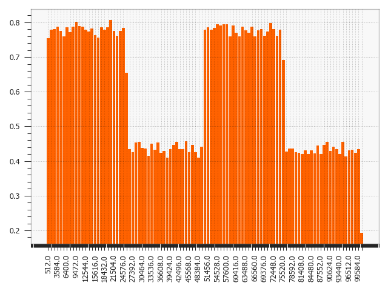
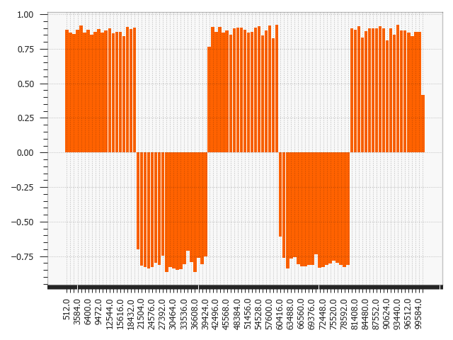
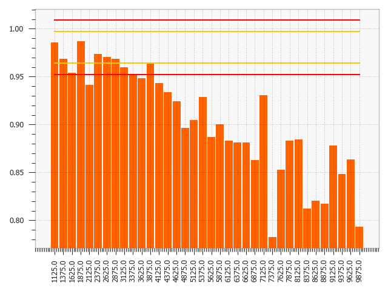

:author: Simon Brugman
:email: simon.brugman@ing.com
:institution: ING Analytics Wholesale Banking

:author: Tomas Sostak
:email: tomas.sostak@vinted.com
:institution: Vinted

:author: Pradyot Patil
:email: pradyot.patil@ing.com
:institution: ING Analytics Wholesale Banking

:author: Max Baak
:email: max.baak@ing.com
:institution: ING Analytics Wholesale Banking

:bibliography: references

---------------------------------------------------
popmon analysis package for dataset shift detection
---------------------------------------------------

.. class:: abstract

   ``popmon`` is an open-source Python package
   to check the stability of a tabular dataset.
   ``popmon`` creates histograms of features binned in time-slices, and compares the stability of its profiles and distributions
   using statistical tests, both over time and with respect to a reference dataset.
   It works with numerical, ordinal and categorical features, on both pandas and Spark dataframes,
   and the histograms can be higher-dimensional, e.g. it can also track correlations between sets of features.
   ``popmon`` can automatically detect and alert on changes observed over time, such as trends, shifts, peaks, outliers, anomalies, changing correlations, etc.,
   using monitoring business rules that are either static or dynamic.
   ``popmon`` results are presented in a self-contained report.

.. class:: keywords

   dataset shift detection, population shift, covariate shift, histogramming, profiling

Introduction
------------

Tracking model performance is crucial to guarantee that a model behaves
as designed initially. Model performance depends directly on the data
used for training and the data predicted on. Changes in the
latter (e.g. certain word frequency, user demographics, etc.) can affect
the performance and make predictions unreliable.

Given that input data often change over time, it is important to track
changes in both input distributions and delivered predictions
periodically, and to act on them when they are significantly different
from past instances – e.g. to diagnose and retrain an incorrect model in production.
Predictions may be far ahead in time, so the performance can only be
verified later, for example in one year. Taking action at that point
might already be too late.

To make monitoring both more consistent and semi-automatic, ING Bank has
created a generic Python package called ``popmon``. ``popmon`` monitors
the stability of data populations over time and detects dataset shifts,
based on techniques from statistical process control and the dataset
shift literature.

``popmon`` employs so-called dynamic monitoring rules to flag and alert
on changes observed over time. Using a specified reference dataset, from
which observed levels of variation are extracted automatically,
``popmon`` sets allowed boundaries on the input data. If the reference
dataset changes over time, the effective ranges on the input data can
change accordingly. Dynamic monitoring rules make it easy to detect
which (combinations of) features are most affected by changing
distributions.

.. figure:: logo.png
   :name: fig:logo
   :scale: 60%

   The ``popmon`` package logo

``popmon`` is light-weight. For example, only one line is required to
generate a stability report.

.. code-block:: python

   report = popmon.df_stability_report(
        df,
        time_axis="date",
        time_width="1w",
        time_offset="2022-1-1"
   )
   report.to_file("report.html")

The package is built on top of Python’s scientific computing ecosystem
(numpy, scipy :cite:`harris2020array, 2020SciPy-NMeth`) and
supports pandas and Apache Spark dataframes
:cite:`reback2020pandas, mckinney-proc-scipy-2010, zaharia2016apache`.
This paper discusses how ``popmon`` monitors for dataset changes. The
``popmon`` code is modular in design and user configurable. The project
is available as open-source software. [1]_

.. [1]
   See https://github.com/ing-bank/popmon for code, documentation,
   tutorials and example stability reports.

Related work
~~~~~~~~~~~~

Many concept drift algorithms exist that follow a similar
structure :cite:`lu2018learning`, using various data
structures and algorithms at each step :cite:`dasu2006information, qahtan2015pca`.
However, few are readily available to use in production. ``popmon`` offers both a
framework that generalizes pipelines needed to implement those
algorithms, and default data drift pipelines, built on histograms with
statistical comparisons and profiles (see Sec. `data representation`_).

Other families of tools have been developed that work on individual data points,
for model explanations (e.g. SHAP
:cite:`lundberg2017unified`, feature attributions
:cite:`sturmfels2020visualizing`), rule-based data
monitoring :cite:`Gong_Great_Expectations` and outlier
detection (e.g.
:cite:`rabanser2019failing, lopez2017revisiting`).

``alibi-detect`` :cite:`klaise2020monitoring, alibi-detect`
is somewhat similar to ``popmon``. This is an open-source Python library
that focuses on outlier, adversarial and drift detection. It allows for
monitoring of tabular, text, images and time series data, using both
online and offline detectors. The backend is implemented in TensorFlow
and PyTorch. Much of the reporting functionality, such as feature
distributions, are restricted to the (commercial) enterprise version
called ``seldon-deploy``. Integrations for model deployment are
available based on Kubernetes. The infrastructure setup thus is more
complex and restrictive than for ``popmon``, which can run on any
developer's machine.

Contributions
~~~~~~~~~~~~~

The advantage of ``popmon``'s dynamic monitoring rules over
conventional static ones, is that little prior knowledge is required of
the input data to set sensible limits on the desired level of stability.
This makes ``popmon`` a scalable solution over multiple datasets.

To the best of our knowledge, no other monitoring tool exists that suits
our criteria to monitor models in production for dataset shift. In
particular, no other, light-weight, open-source package is available
that performs such extensive stability tests of a pandas or Spark
dataset.

We believe the combination of wide applicability, out-of-the-box performance,
available statistical tests, and configurability makes ``popmon`` an ideal
addition to the toolbox of any data scientist or machine learning
engineer.

.. figure:: overview.pdf
   :alt: Step-by-step overview of ``popmon``'s pipeline as described in section `approach`_ onward.
   :scale: 50%

   :label:`overview` Step-by-step overview of ``popmon``\ ’s pipeline as described in section `approach`_ onward.

Approach
--------

``popmon`` tests the dataset stability and reports the results through a
sequence of steps (Fig. :ref:`overview`):

#. The data are represented by histograms of features, binned in
   time-slices (Sec. `data representation`_).

#. The data is arranged according to the selected reference type
   (Sec. `comparisons`_).

#. The stability of the profiles and distributions of those histograms
   are compared using statistical tests, both with respect to a
   reference and over time. It works with numerical, ordinal,
   categorical features, and the histograms can be higher-dimensional,
   e.g. it can also track correlations between any two features (Sec. `comparisons`_).

#. ``popmon`` can automatically flag and alert on changes observed over
   time, such as trends, anomalies, changing correlations, etc, using
   monitoring rules (Sec. `alerting`_).

#. Results are reported to the user via a dedicated, self-contained
   report (Sec. `reporting`_).

Dataset shift
-------------

In the context of supervised learning, one can distinguish dataset shift
as a shift in various distributions:

#. Covariate shift: shift in the independent variables (:math:`p(x)`).

#. Prior probability shift: shift in the target variable (the class,
   :math:`p(y)`).

#. Concept shift: shift in the relationship between the independent and
   target variables (i.e. :math:`p(x | y)`).

Note that there is a lot of variation in terminology used, referring to
probabilities prevents this ambiguity. For more information on dataset
shift see Quinonero-Candela et al.
:cite:`quinonero2008dataset`.

``popmon`` is primarily interested in monitoring the distributions of
features :math:`p(x)` and label :math:`p(y)`, for trained classifiers,
the data in deployment ideally resembles the training data. However, the package
can be used more widely, for instance by monitoring interactions between
features and the label, or the distribution of model predictions.

Temporal representation
-----------------------

``popmon`` requires features to be distributed as a function of time
(bins), which can be provided in two ways:

#. **Time axis**. Two-dimensional (or higher) distributions are
   provided, where the first dimension is time and the second is the
   feature to monitor. To get time slices, the time column needs to be
   specified, e.g. “date”, including the bin width, e.g. one week
   (“1w”), and the offset, which is the lower edge of one time-bin, e.g.
   a certain start date (“2022-1-1”).

#. **Ordered data batches**. A set of distributions of features is
   provided, corresponding to a new batch of data. This batch is
   considered a new time-slice, and is stitched to an existing set of
   batches, in order of incoming batches, where each batch is assigned a
   unique, increasing index. Together the indices form an artificial,
   binned time-axis.

Data representation
-------------------

``popmon`` uses histogram-based monitoring to track potential dataset
shift and outliers over time, as detailed in the next subsection.

In the literature, alternative data representations are also employed,
such as kdq-trees :cite:`dasu2006information`. Different
data representations are in principle compatible with the ``popmon``
pipeline, as it is similarly structured to alternative methods
(see :cite:`lu2018learning`, c.f. Fig 5).

Dimensionality reduction techniques may be used to transform the input
dataset into a space where the distance between instances are more
meaningful for comparison, before using ``popmon``, or in-between steps.
For example a linear projection may be used as a preprocessing step, by
taking the principal components of PCA as in
:cite:`qahtan2015pca`. Machine learning classifiers or
autoencoders have also been used for this
purpose :cite:`lipton2018detecting, rabanser2019failing` and
can be particularly helpful for high-dimensional data such as images or
text.

Histogram-based monitoring
~~~~~~~~~~~~~~~~~~~~~~~~~~

There are multiple reasons behind the histogram-based monitoring
approach taken in ``popmon``.

Histograms are small in size, and thus are efficiently stored and
transferred, regardless of the input dataset size. Once data
records have been aggregated feature-wise, with a minimum number of
entries per bin, they are typically no longer privacy sensitive.

``popmon`` is primarily looking for changes in data distributions.
Solely monitoring the (main) profiles of a distribution, such as the
mean, standard deviation and min and max values, does not necessarily
capture the changes in a feature’s distribution. Well-known examples of
this are Anscome’s Quartet :cite:`anscome` and the
dinosaurs datasets :cite:`matejka2017same`, where – between
different datasets – the means and correlation between two features are
identical, but the distributions are different. Histograms of the
corresponding features (or feature pairs), however, do capture the
corresponding changes.

Implementation
~~~~~~~~~~~~~~

For the creation of histograms from data records the open-source
``histogrammar`` package has been adopted. ``histogrammar`` has been
implemented in both Scala and Python
:cite:`jim_pivarski_2021_4660177, jim_pivarski_2016_61418`,
and works on Spark and pandas dataframes respectively. The two
implementations have been tested extensively to guarantee compatibility.
The histograms coming out of ``histogrammar`` form the basis of the
monitoring code in ``popmon``, which otherwise does not require input
dataframes. In other words, the monitoring code itself has no Spark or
pandas data dependencies, keeping the code base relatively simple.

Histogram types
~~~~~~~~~~~~~~~

Three types of histograms are typically used:

-  **Normal histograms**, meant for numerical features with known, fixed
   ranges. The bin specifications are the lowest and highest expected
   values and the number of (equidistant) bins.

-  **Categorical histograms**, for categorical and ordinal features,
   typically boolean or string-based. A categorical histogram accepts
   any value: when not yet encountered, it creates a new bin. No bin
   specifications are required.

-  **Sparse histograms** are open-ended histograms, for numerical
   features with no known range. The bin specifications only need the
   bin-width, and optionally the origin (the lower edge of bin zero,
   with a default value of zero). Sparse histograms accept any value.
   When the value is not yet encountered, a new bin gets created.

For normal and sparse histograms reasonable bin specifications can be
derived automatically. Both categorical and sparse histograms are
dictionaries with histogram properties. New (index, bin) pairs get
created whenever needed. Although this could result in out-of-memory
problems, e.g. when histogramming billions of unique strings, in
practice this is typically not an issue.

Features may be transformed into a representation with a lower number
of distinct values, e.g. via embedding or substrings; or one selects the
top-:math:`n` most frequently occurring values.

Open-ended histograms are ideal for monitoring dataset shift and
outliers: they capture any kind of (large) data change. When there is a
drift, there is no need to change the low- and high-range values. The
same holds for outlier detection: if a new maximum or minimum value is
found, it is still captured.

Dimensionality
~~~~~~~~~~~~~~

A histogram can be multi-dimensional, and any combination of types is
possible. The first dimension is always the time axis, which is always
represented by a sparse histogram. The second dimension is the feature
to monitor over time. When adding a third axis for another feature, the
heatmap between those two features is created over time. For example,
when monitoring financial transactions: the first axis could be time,
the second axis client type, and the third axis transaction amount.

Usually one feature is followed over time, or at maximum two. The
synthetic datasets in section `synthetic datasets`_ contain
examples of higher-dimensional histograms for known interactions.

Additivity
~~~~~~~~~~

Histograms are additive. As an example, a batch of data records arrives
each week. A new batch arrives, containing timestamps that were missing
in a previous batch. When histograms are made of the new batch, these
can be readily summed with the histograms of the previous batches. The
missing records are immediately put into the right time-slices.

It is important that the bin specifications are the same between
different batches of data, otherwise their histograms cannot be summed
and comparisons are impossible.

Limitations
~~~~~~~~~~~

There is one downside to using histograms: since the data get aggregated
into bins, and profiles and statistical tests are obtained from the
histograms, slightly lower resolution is achieved than on the full
dataset. In practice, however, this is a non-issue; histograms work
great for data monitoring.

Comparisons
-----------

In ``popmon`` the monitoring of data stability is based on statistical
process control (SPC) techniques. SPC is a standard method to manage the
data quality of high-volume data processing operations, for example in a
large data warehouse :cite:`english`. The idea is as
follows. Most features have multiple sources of variation from
underlying processes. When these processes are stable, the variation of
a feature over time should remain within a known set of limits. The
level of variation is obtained from a reference dataset, one that is
deemed stable and trustworthy.

For each feature in the input data (except the time column), the
stability is determined by taking the reference dataset – for example
the data on which a classification model was trained – and contrasting
each time slot in the input data.

The comparison can be done in two ways:

#. **Comparisons**: statistically comparing each time slot to the
   reference data (for example using Kolmogorov-Smirnov, :math:`\chi^2`
   testing, or the Pearson correlation).

#. **Profiles**: for example, tracking the mean of a distribution over
   time and contrasting this to the reference data. Similar analyses can
   be done for other summary statistics, such as the median, min, max or
   quantiles. This is related to the CUsUM technique :cite:`page1954continuous`,
   a well-known method in SPC.

Reference types
~~~~~~~~~~~~~~~

Consider :math:`X` to be an N-dimensional dataset representing our
reference data, and :math:`X'` to be our incoming data. A covariate
shift occurs when :math:`p(X) \neq p(X')` is detected.
Different choices for :math:`X` and :math:`X'` may detect different
types of drift (e.g. sudden, gradual, incremental). :math:`p(X)` is
referred to as the reference dataset.

Many change-detection algorithms use a window-based solution that
compares a static reference to a test window :cite:`dasu2006information`,
or a sliding window for both, where the reference is dynamically
updated :cite:`qahtan2015pca`. A static reference is a
wise choice for monitoring of a trained classifier: the performance of such a
classifier depends on the similarity of the test data to the training
data. Moreover, it may pick up an incremental departure (trend) from the initial
distribution, that will not be significant in comparison to the adjacent
time-slots. A sliding reference, on the other hand, is updated with more
recent data, that incorporates this trend. Consider the case where contains a
price field that is yearly indexed to the inflation, then using a static
reference may alert purely on the change in trend.

The reference implementations are provided for common scenarios, such as
working with a fixed dataset, batched dataset or with streaming data.
For instance, a fixed dataset is common for exploratory data analysis
and one-off monitoring, whereas batched or streaming data is more common
in a production setting.

The reference may be static or dynamic. Four different reference types
are possible:

#. **Self-reference**. Using the full dataset on which the stability
   report is built as a reference. This method is static: each time slot
   is compared to all the slots in the dataset. This is the default
   reference setting.

#. **External reference**. Using an external reference set, for example
   the training data of your classifier, to identify which time slots
   are deviating. This is also a static method: each time slot is
   compared to the full reference set.

#. **Rolling reference**. Using a rolling window on the input dataset,
   allowing one to compare each time slot to a window of preceding time
   slots. This method is dynamic: one can set the size of the window and
   the shift from the current time slot. By default the 10 preceding
   time slots are used.

#. **Expanding reference**. Using an expanding reference, allowing one
   to compare each time slot to all preceding time slots. This is also a
   dynamic method, with variable window size, since all available
   previous time slots are used. For example, with ten available time
   slots the window size is 9.

Statistical comparisons
~~~~~~~~~~~~~~~~~~~~~~~

Users may have various reasons to prefer a two-sample test over another.
The appropriate comparison depends on our confidence in the reference
dataset :cite:`richardson2022loss`, and certain tests may be
more common in some fields. Many common tests are
related :cite:`dasu2006information`, e.g. the :math:`\chi^2`
function is the first-order expansion of the KL distance function.

Therefore, ``popmon`` provides an extensible framework that allows users
to provide custom two-sample tests using a simple syntax, via the
registry pattern:

.. code-block:: python

   @Comparisons.register(key="jsd", description="JSD")
   def jensen_shannon_divergence(p, q):
        m = 0.5 * (p + q)
        return (
            0.5 *
            (kl_divergence(p, m) + kl_divergence(q, m))
        )

Most commonly used test statistics are implemented, such as the Population-Stability-Index and the Jensen-Shannon
divergence. The implementations of the :math:`\chi^2` and Kolmogorov-Smirnov tests account for statistical fluctuations
in both the input and reference distributions. For example, this is relevant when comparing adjacent, low-statistics time slices.

Profiles
~~~~~~~~

Tracking the distribution of values of interest over time is achieved
via profiles. These are function of the input histogram. Metrics may be
defined for all dimensions (e.g. count, correlations), or specifically
for say 1D numerical histograms (e.g. quantiles). Extending the existing set of
profiles is possible via a syntax similar as above:

.. code-block:: python

   @Profiles.register(
        key=["q5", "q50", "q95"],
        description=[
            "5% percentile",
            "50% percentile (median)",
            "95% percentile"
        ],
        dim=1,
        type="num"
   )
   def profile_quantiles(values, counts):
       return logic_goes_here(values, counts)

Denote :math:`x_i(t)` as the profile :math:`i` of feature :math:`x` at
time :math:`t`, for example the 5% quantile of the histogram of incoming
transaction amounts in a given week. Identical bin specifications are
assumed between the reference and incoming data. :math:`\bar{x}_i` is
defined as the average of that metric on the reference data, and
:math:`\sigma_{x_i}` as the corresponding standard deviation.

The normalized residual between the incoming and reference data, also
known as the “pull” or “Z-score”, is given by:

.. math:: \mathrm{pull}_i(t) = \frac{x_i(t) - \bar{x}_i}{\sigma_{x_i}}\,.

When the underlying sources of variation are stable, and assuming the
reference dataset is asymptotically large and independent from the
incoming data, :math:`\mathrm{pull}_i(t)` follows a normal distribution centered
around zero and with unit width, :math:`N(0, 1)`, as dictated by the
central limit theorem :cite:`Fischer2011`.

In practice the criteria for normality are hardly ever met, typically
resulting in a wider distribution with larger tails, yet approximately
normal behaviour is exhibited. Chebyshev’s
inequality :cite:`chebyshev1867valeurs` guarantees that, for
a wide class of distributions, no more than :math:`1/k^2` of the
distribution’s values can be :math:`k` or more standard deviations away
from the mean. For example, a minimum of 75% (88.9%) of values must lie
within two (three) standard deviations of the mean. These boundaries
reoccur in Sec. `dynamic monitoring rules`_.

Alerting
--------

For alerting, ``popmon`` uses traffic-light-based monitoring rules,
raising green, yellow or red alerts to the user. Green alerts signal the
data are fine, yellow alerts serve as warnings of meaningful
deviations, and red alerts need critical attention. These monitoring
rules can be static or dynamic, as explained in this section.

Static monitoring rules
~~~~~~~~~~~~~~~~~~~~~~~

Static monitoring rules are traditional data quality rules. Denote
:math:`x_{i}(t)` as metric :math:`i` of feature :math:`x` at time
:math:`t`, for example the number of NaNs encountered in feature
:math:`x` on a given day. As an example, the following traffic lights
might be set on :math:`x_{i}(t)`:

.. math::

   TL(x_{i}, t) = \begin{cases}
           \mathrm{Green}, & \text{if }x_{i}(t) \le 1\\
           \mathrm{Yellow}, & \text{if }1 < x_{i}(t) \le 10\\
           \mathrm{Red}, & \text{if }x_{i}(t) > 10
           \end{cases}

The thresholds of this monitoring rule are fixed, and considered static
over time. They need to be set by hand, to sensible values. This
requires domain knowledge of the data and the processes that produce it.
Setting these traffic light ranges is a time-costly process when
covering many features and corresponding metrics.

Dynamic monitoring rules
~~~~~~~~~~~~~~~~~~~~~~~~

Dynamic monitoring rules are complementary to static rules. The levels
of variation in feature metrics are assumed to have been measured on the
reference data. Per feature metric, incoming data are compared against
the reference levels. When (significantly) outside of the known bounds,
instability of the underlying sources is assumed, and a warning gets
raised to the user.

``popmon``'s dynamic monitoring rules raise traffic lights to the user
whenever the normalized residual :math:`\mathrm{pull}_i(t)` falls outside
certain, configurable ranges. By default:

.. math::

   TL(\mathrm{pull}_i, t) = \begin{cases}
           \mathrm{Green},  & \text{if }|\mathrm{pull}_i(t)| \le 4\\
           \mathrm{Yellow}, & \text{if }4 < |\mathrm{pull}_i(t)| \le 7\\
           \mathrm{Red},    & \text{if }|\mathrm{pull}_i(t)| > 7
           \end{cases}

If the reference dataset is changing over time, the effective ranges on
:math:`x_{i}(t)` can change as well. The advantage of this approach over
static rules is that significant deviations in the incoming data can be
flagged and alerted to the user for a large set of features and
corresponding metrics, requiring little (or no) prior knowledge of the
data at hand. The relevant knowledge is all extracted from the reference
dataset.

With multiple feature metrics, many dynamic monitoring tests can get
performed on the same dataset. This raises the multiple comparisons
problem: the more inferences are made, the more likely erroneous red
flags are raised. To compensate for a large number of tests being made,
typically one can set wider traffic light boundaries, reducing the
false positive rate. [2]_ The boundaries control the size of the
deviations - or number of red and yellow alerts - that the user would
like to be informed of.

.. [2]
   Alternatively one may apply the Bonferroni correction to counteract
   this problem :cite:`bonferroni1936teoria`.

Reporting
---------

.. figure:: report_overview.png

   A snapshot of part of the HTML stability report. It shows the aggregated traffic light overview.
   This view can be used to prioritize features for inspection.

``popmon`` outputs monitoring results as HTML stability reports. The
reports offer multiple views of the data (histograms and heatmaps), the
profiles and comparisons, and traffic light alerts. There are several
reasons for providing self-contained reports: they can be opened in the
browser, easily shared, can be stored as artifacts, and tracked using
tools such as MLFlow. The reports also have no need for an advanced
infrastructure setup, and are possible to create and view in many
environments: from a local machine, a (restricted) environment, to public
cloud. If, however, a certain dashboarding tool is available, then the
metrics computed by ``popmon`` are exposed and can be exported into
other databases, for example Kibana. One downside of producing self-contained reports is
that they can get large as the plots are pre-computed and embedded. This
may be mitigated by replacing the plots with interactive visualizations
(e.g. using Bokeh or plotly express).

Note that multiple reference types can be used in the same stability
report. For instance, ``popmon``\ ’s default reference pipelines always
include a rolling comparison with window size 1, i.e. comparing to the
preceding time slot.

Synthetic datasets
------------------

In the literature synthetic datasets are commonly used to test the
effectiveness of dataset shift monitoring approaches
:cite:`lu2018learning`. Since the generation process
controls when and how the shift happens, one can test the detection for
all kinds of shifts. ``popmon`` has been tested on multiple of such
artificial datasets: Sine1, Sine2, Mixed, Stagger, Circles, LED, SEA and
Hyperplane
:cite:`pesaranghader2018reservoir, street2001streaming, fan2004systematic`.
These dataset cover myriad dataset shift characteristics: sudden and
gradual drifts, order of the relation (dependency of the label on just
one, or multiple features), binary and multiclass labels and containing
unrelated features. The dataset descriptions and sample ``popmon``
configurations are available in the code repository.

    :label:`pearson1` *LED*: Pearson correlation compared with previous histogram. The shifting points are correctly identified at every 5th of the dataset. Similar patterns are visible for other comparisons, e.g. :math:`\chi^2`.

    *Sine1*: The dataset shift around data point 20.000, 40.000, 60.000 and 80.000 are clearly visible.

The reports generated by ``popmon`` are capturing features and time bin where
the dataset shift is occurring for all tested datasets. Interactions between features
and the label can be used for feature selection, in addition to monitoring the individual
feature distributions. The sudden and gradual drifts are clearly visible
using a rolling reference, see Fig. :ref:`pearson1` for examples.
The drift in the Hyperplane dataset, incremental and gradual, is not expected to be detected
using a rolling or self-reference. Moreover, the dataset is synthesized so that the distribution of
the features and the class balance does not change :cite:`fan2004systematic`.

    :label:`hyperplanephik` *Hyperplane*: The incremental drift compared to the reference dataset is observed for the PhiK correlation between the predictions and the label.

The process to monitor this dataset could be set up in multiple ways, one of which is described here.
A logistic regression model is trained on the first 10% of the data, which is also used as static reference.
The predictions of this model are added to the dataset, simulating a machine learning model in production.
``popmon`` is able to pick up the divergence between the predictions and the class label, as depicted
in Figure :ref:`hyperplanephik`.

Conclusion
----------

This paper has presented ``popmon``, an open-source Python package to
check the stability of a tabular dataset. Built around histogram-based
monitoring, it runs on a dataset of arbitrary size, supporting both pandas and
Spark dataframes. Using the variations observed in a reference dataset,
``popmon`` can automatically detect and flag deviations in incoming
data, requiring little prior domain knowledge. As such, ``popmon`` is a
scalable solution that can be applied to many datasets. By default its
findings get presented in a single HTML report. This makes ``popmon``
ideal for both exploratory data analysis and as a monitoring tool for
machine learning models running in production.
We believe the combination of out-of-the-box performance and presented features makes ``popmon`` an
excellent addition to the data practitioner's toolbox.

Acknowledgements
----------------

We thank our colleagues from the ING Analytics Wholesale Banking team
for fruitful discussions, all past contributors to ``popmon``, and in
particular Fabian Jansen and Ilan Fridman Rojas for carefully reading
the manuscript. This work is supported by ING Bank.

