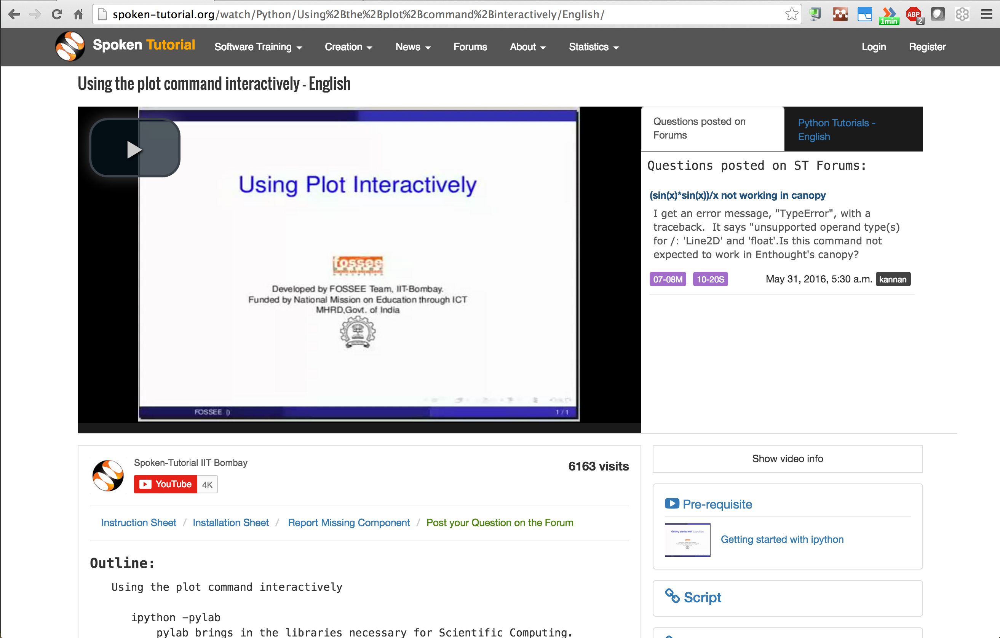
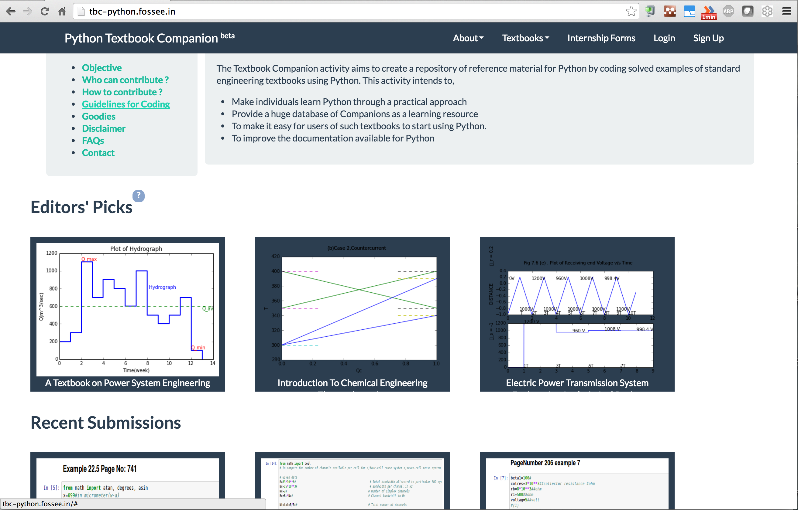
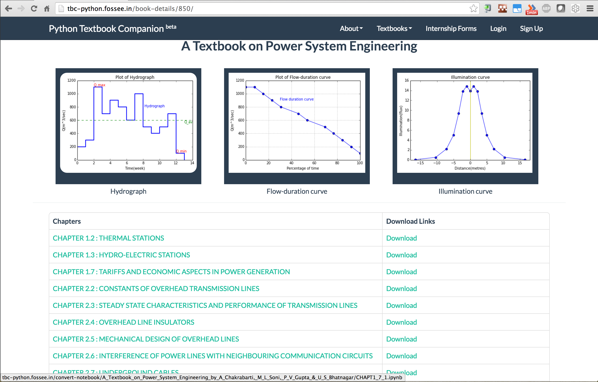
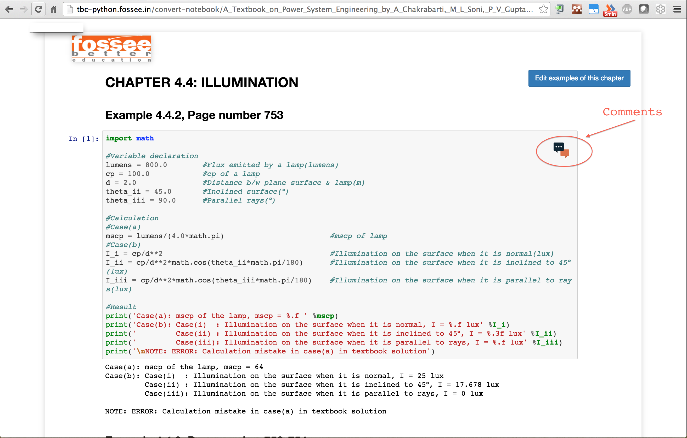
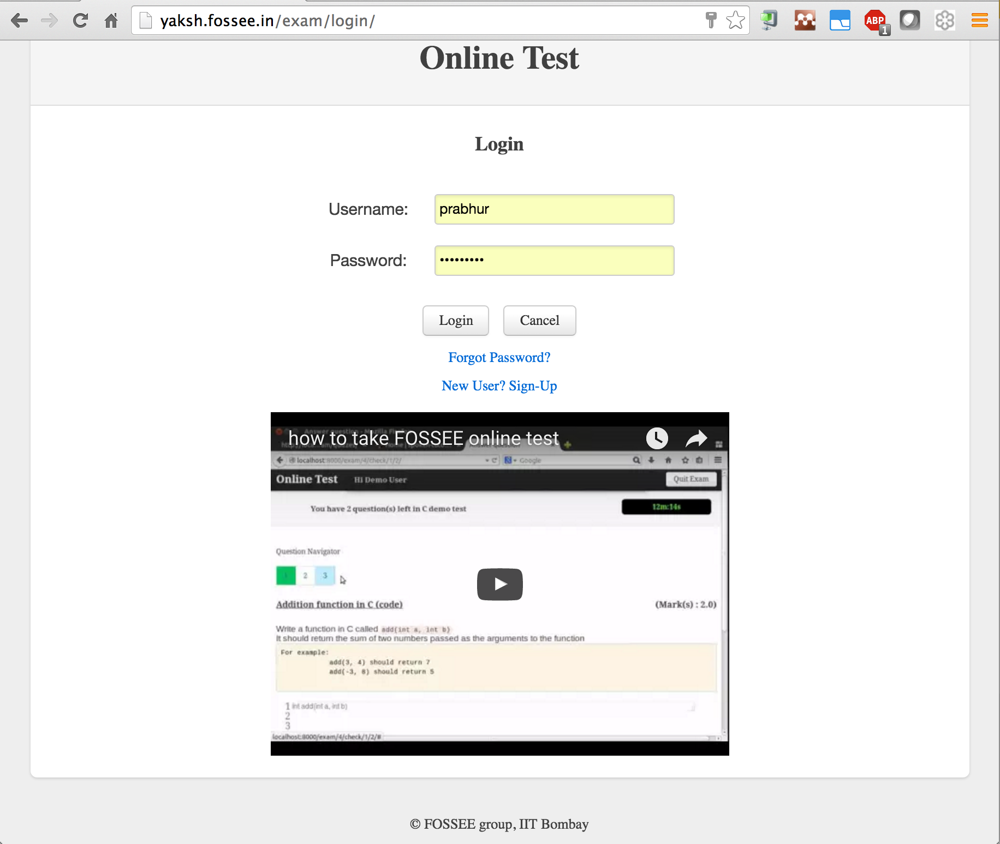
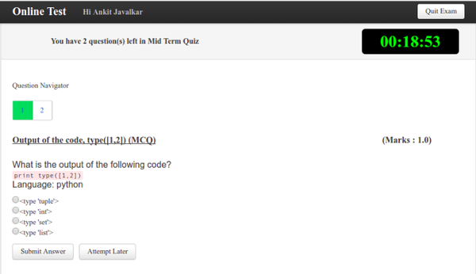
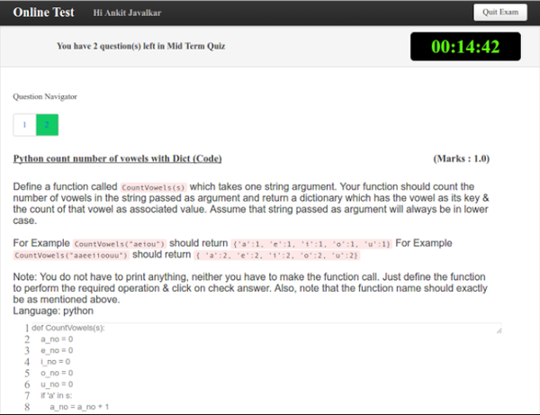
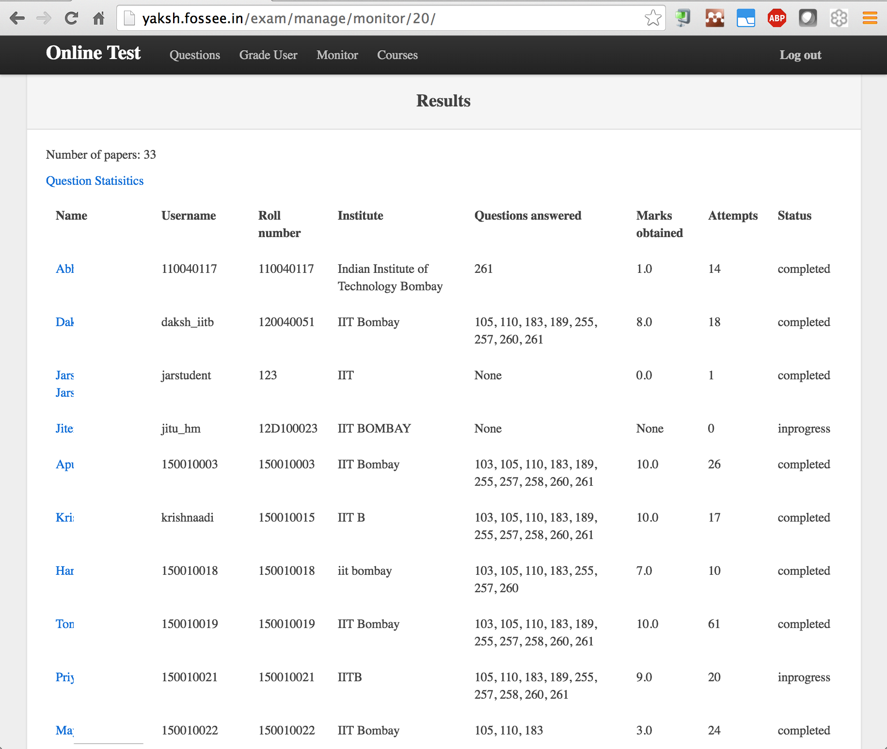

:author: Prabhu Ramachandran
:email: prabhu@aero.iitb.ac.in
:institution: Department of Aerospace Engineering
:institution: IIT Bombay, Mumbai, India
:corresponding:

--------------------------
The FOSSEE Python Project
--------------------------

.. class:: abstract

    The FOSSEE (Free Open Source Software for Science and Engineering
    Education) project (http://fossee.in) is a project funded by the Ministry
    of Human Resources and Development, MHRD, (http://mhrd.gov.in) of the
    Government of India.  The FOSSEE project is based out of IIT Bombay and
    has for its goal to eliminate the use of proprietary tools in the college
    curriculum.  FOSSEE promotes various open source packages.  Python is one
    of them.

    In this paper, the Python-related activities and initiatives of FOSSEE are
    discussed.  The important activities include, the creation of
    spoken-tutorials on Python, the creation of over 400+ IPython-based
    textbook companions, an online testing tool for a variety of programming
    languages, a course akin to software carpentry at IIT Bombay, the
    organization of the SciPy India conference, and finally spreading the
    adoption of Python in schools and colleges.

Introduction
-------------

The FOSSEE project (http://fossee.in) started in 2009 with the goal to try
help minimize the use of proprietary software in the college curriculum in
India.  The project is funded by the Ministry of Human Resources and
Development, MHRD, (http://mhrd.gov.in) of the Government of India.  FOSSEE is
part of the MHRD's National Mission on Education through ICT (NMEICT).  The
NMEICT project started in 2009 as as initiative to improve the quality of
education in India.  As part of this project there have been several
initiatives.  One sterling example is the NPTEL project which provides content
for over 900 courses at the graduate and post-graduate level (400 web-based
and 500 video-based) online.  These are proving to be extremely useful all
over the country.  Other projects include the Spoken Tutorial project
(http://spoken-tutorial.org) which has also been previously presented at
SciPy 2014.  FOSSEE is one such project that is the outcome of the NMEICT
funding.

The FOSSEE project is based out of IIT Bombay and promotes the use of various
open source packages in order to help eliminate the use of proprietary
packages in the curriculum.  A large number of colleges tend to unecessarily
purchase commercial licenses when they really do not need it.  The difficulty
with using commercial packages to teach basic concepts and computational
techniques is well known:

- The packages are typically expensive, the money could be better spent on
  equipment.  This is especially relevant in India.

- Students cannot legally take the software with them home or after they
  complete their course.

- Academic licenses are not enough as the students end up becoming dependent
  on the packages after the leave the institution and this limits them.

In order to help reduce the dependence on commercial packages, the FOSSEE
project's efforts are focused towards training students and teachers to use
FOSS tools for their curricular activities.  This also requires development
efforts in order to either enhance existing projects or fill in any areas
where FOSS tools are lacking.  There are about 10+ PIs actively involved in
various sub-projects.  Some of the most active projects are Scilab, Python,
eSim (an EDA tool), OpenFOAM, and Osdag (open source design of steel
structures).

After the initial efforts in 2009 and 2010 we found that some of our
initiatives worked and scaled up well whereas others did not.  As a result,
all of the FOSSEE sub-projects follow a similar structure.  Typically
each sub-project produces the following output:

- Generates "spoken-tutorials" that new users can use to self-learn a
  particular software package.

- Organize a crowd-sourced development of "textbook companions" for popular
  textbooks used in the curriculum.  A textbook companion is created when
  every solved example in a text is solved using a particular open source
  software package like Scilab or Python.

- Support user questions on a forum for the packages that are promoted.

- Develop new software that is useful in a particular domain.

- Support hardware interfacing to encourage open experimentation.

- Migrate labs that use proprietary packages and help them switch to a FOSS
  equivalent.

- Conduct workshops and conferences to spread the word and teach students and
  teachers.

Some of these are project specific.  For example, the Scilab project is able
to help with lab migrations as Scilab is a close equivalent to Matlab and this
makes it easier for people to switch to it from Matlab.  Kannnan Moudgalya's
paper in 2014 [kmm14]_ discusses in detail the approach and design decisions
made by the FOSSEE and spoken-tutorials projects.  In particular the paper
discusses spoken tutorials, textbook companions, and lab migrations.  In this
paper we focus on the Python-specific activities that are of potential direct
interest to the SciPy community.  The FOSSEE Python group
website [FOSSEE-Python]_ also has more information.

Spoken-tutorials
----------------

When the project started in 2009, we tried to conduct many live workshops but
this proved to be too time consuming and did not scale.  There are more than
3000 colleges in the country and live workshops cannot reach all of these
institutions.  At this time it was felt that preparing self-learning material
that students can learn on their own was much more effective and scalable.  A
sister project, the spoken-tutorial project (http://spoken-tutorial.org)
pioneered the generation and dissemination of spoken-tutorials.  A spoken
tutorial is basically a carefully designed screencast for a roughly 10 minute
duration or less.  Any screencast cannot qualify as a spoken-tutorial.
Notably, a spoken tutorial should be made such that a newbie can understand
it.  The spoken-tutorial project ensures that all new tutorials undergo a
novice check to make sure that this is indeed the case.  A spoken tutorial
also requires a carefully written script.  This allows a spoken tutorial to be
dubbed into multiple languages.  A series of spoken tutorials can thus be used
to effectively teach a programming language or software package.

The spoken tutorial project has trained over a million students and teachers
on a variety of software packages.  The project hosts over 700 individual
spoken-tutorials.  Over 20 different Indian languages are supported.  Some
languages have better representation than others.

As part of the Python initiative we have created about 40 spoken tutorials to
teach non-CSE undergraduate students how to use Python for their curricular
computational tasks.  A new set of around 50 tutorials is currently being
recorded.  The spoken tutorials include tutorials on starting with IPython,
plotting with matplotlib, etc.  Currently these are only available in `English
<http://spoken-tutorial.org/tutorial-search/?search_language=English&search_foss=Python&page=1>`_.

Fig. :ref:`fig:py-st` shows a typical Python spoken tutorial.  It shows the
main screencast video.  Below the video is an outline of the tutorial.
Information on installation and other instructions is also listed.  Users can
also easily navigate to prerequisite tutorials.  In addition, users can post
their questions on the forum.

   An example of a Python spoken tutorial.  The video can be viewed, an
   outline of the material is available below the video.  An instruction sheet
   and installation sheet is also available.  Prerequisite videos are listed
   and users can also post questions on a forum. :label:`fig:py-st`

These spoken tutorials can be accessed by anyone and can also be downloaded
into a self-contained CD by users.  Around 40000 users have gone over this
material.

The FOSSEE team generates the spoken tutorials and the spoken tutorial team
coordinates the conduct of workshops where students use this material to teach
themselves Python.  FOSSEE staff also supports by attending to user questions
that may arise during these workshops and also during the stand-alone use of
spoken tutorials.

Textbook companions
--------------------

One oft quoted problem with FOSS tools is the lack of documentation.  Good
quality documentation is not easy to write and requires both expertise as well
as the ability to explain things at the level of the user.  This is often
difficult for a developer who knows almost everything about the package.  On
the other hand it is not always easy for an inexperienced user to write
documentation.

Textbook companions offer an interesting approach to this task.  As discussed
in detail in [kmm14]_, textbook companions are created by writing Python code
for every solved example in a textbook.  Students create these textbook
companions which are then reviewed by either teachers or reviewers at FOSSEE.
This task scales very well as students are eager to take up the task. Students
are given an honorarium and a certificate after their textbooks pass a review.
Currently, there are over 530 Scilab textbook companions [STC]_ created. The
Python project has 395 completed books with over 225 textbooks in progress.
The Python companions are hosted online at http://tbc-python.fossee.in

The Python Textbook Companions (PTC's) are submitted in the form of Jupyter
notebooks.  This is important for several reasons:

- Jupyter  notebooks allow us to put together, formatted HTML, code, and the
  results in one self-contained file.
- IPython notebooks are easy to render and a HTML listing can be generated.
- The file can also be hosted online and interactively used.
- The huge popularity of the notebook makes this a very useful resource.

The FOSSEE group has also customized the generated HTML such that users can
leave comments on the IPython notebooks.  This is done by linking disqus
comments to each rendered notebook.  The disqus API is then queried for any
new comments each day and contributors are sent a consolidated email about any
potential comments for them to address.  This feature is relatively new and
needs more user testing.

The submission process and hosting of the IPython notebooks is done using a
Django_ web application that can be seen at http://tbc-python.fossee.in.  The
code for the interface is also available from github
(https://github.com/FOSSEE/Python-TBC-Interface).  Once a textbook is reviewed
it is also committed to a git repository on github:
https://github.com/FOSSEE/Python-Textbook-Companions.

The process works as follows:

 1. The student picks a few possible textbooks that has not been completed and
    informs the textbook companion coordinator.
 2. Once a particular book is assigned to the contributor, the student submits
    one sample chapter which is reviewed by the coordinator.
 3. The student then completes the entire book.  Each chapter is submitted as
    a separate IPython notebook.
 4. The student also uploads a few screenshots of their favorite notebooks
    that are displayed.
 5. The submitted code is reviewed and any corrections are made by the
    contributor.
 6. The notebooks are then committed to the git repository.
 7. The committed notebooks are automatically picked up by the TBC web
    application.

After the textbook is reviewed and accepted the student is sent an honorarium
for their work.  Fig. :ref:`fig:tbc-main` shows the main Python TBC interface
with information about the project and the editor's picks.

   The Django application which hosts the Python textbook
   companions. :label:`fig:tbc-main`

Fig. :ref:`fig:tbc-text` shows a typical textbook.  The Jupyter notebooks for
each chapter can be viewed or downloaded.  More information on the book itself
can be seen including an ISBN search link for the student to learn more about
a book, a link to the actual IPython notebook on github and other details are
also available.  The entire book can be downloaded as a ZIP file.

   A typical textbook is shown.  The figure shows some screenshots to pique
   the interest of the casual reader.  The Jupyter notebook corresponding to
   each chapter is listed and can be viewed or
   downloaded. :label:`fig:tbc-text`

Upon clicking a chapter, a typical rendered HTML file is seen.  This is seen
in Fig. :ref:`fig:tbc-render`.  A button to edit the chapter is seen, this
will fire up a tmpnb_ instance which allows users to easily modify and run the
code.  This makes it extremely convenient to view, modify, copy, and learn the
created content.  In the figure, one can see an icon for entering comments.
This links a disqus comment field at the bottom of the page.  This lists all
current comments and allows users to submit new comments on the particular
chapter.

   A typical textbook chapter being rendered.  The button to edit examples of
   the chapter fires up a tmpnb_ instance so users can edit the code and try
   their changes. :label:`fig:tbc-render`

A large number of solved examples are indeed quite simple but there are
several that are fairtly involved.  Some of the submitted textbook companions
are very well made.  These are highlighted in the editor's pick section.

We are yet to formally announce and advertise about the textbook companions
for Python facility.  Once announced, we would then start to analyze the usage
and popularity of this resource.  We are planning to popularize these more in
the future.  It is still unclear as to how different people are using the
notebooks.  We do have very good feedback from the contributors
[testimonials]_ to the project.  Many of them have enjoyed creating these
notebooks and have benefitted by this effort.  Some contributor comments are
quoted in [kmm14]_.

.. _tmpnb:  https://github.com/jupyter/tmpnb
.. _Django: https://www.djangoproject.com/

SDES course
------------

Initially the Python group focussed on teaching Python at various colleges.
It was soon felt that this was not enough.  Students needed to learn how to
use Unix shells effectively, use version control, a bit of LaTeX, good
software development practices in addition to Python.  In order to fill this
need a course was designed in late 2009.  The course is titled Software
Development techniques for Engineers and Scientists (SDES).  This course takes
inspiration from the Software Carpentry Course material [SWC]_.  However, the
course is tailored for undergraduate students.  Two courses at IIT Bombay were
also created so students could take this as part of their course-work.

The course starts with teaching students on how to use Unix command line tools
to carry out common (mostly text processing) tasks.  The course then goes on
to teach students how to automate typical tasks using basic shell-scripting.
The students are then taught version control.  The course originally used
mercurial_, however, this has changed to git_.  The students are then taught
basic and advanced Python.  The emphasis is on typical engineering/numerical
computations such as those that involve (basic) manipulation of large arrays
in an efficient manner.  Good programming style is discussed along with
debugging and test driven development.  They also learn LaTeX and document
creation with reStructuredText_.  The course material is available from
github, at http://github.com/FOSSEE/sees.

As part of the evaluation students pick a software project and attempt to
apply all that they have learned.  Students are also given many programming
assignments to test their ability to program.  We have built a very convenient
online testing tool called Yaksh that is discussed in a subsequent section for
this task.  This makes online tests fun and very helpful for instructors to
assess student's understanding.

.. _mercurial: https://www.mercurial-scm.org
.. _git: https://git-scm.com/
.. _reStructuredText: http://docutils.sourceforge.net/rst.html

The course has been offered twice and will be offered in the fall of 2016.
The course has been well received by students and is quite popular.  We
restrict the number of students to about 60 each time.  During the last
delivery we felt that the student projects were not done well enough.  A more
aggressive and systematic approach is needed to push students to work
consistently over the duration of the course, rather than in the last minute.
We also find that it is difficult for students and instructors to pick
meaningful projects that are neither too trivial or too difficult.  We plan to
push students a bit more aggressively to work systematically on their
projects.  We plan to use git logs to assess team contribution and systematic
work.  Instead of always picking new projects, we are thinking of giving
students a pool of existing projects and ask them to improve them.

While teaching this course is fun and is very useful, it does take a lot of
effort and a good team of TAs is necessary.  Fortunately, the FOSSEE Python
team helps in this regard.

Online test tool: Yaksh
------------------------

Assessing the programming skills of students is a very important task during
training.  This is necessary both from the perspective of effective teaching
as well as learning.  For an instructor, testing early and often is helpful
because it provides immediate feedback on which students need help and which
of them are doing well.  For students, doing well in a test gives them
confidence and doing poorly teaches them where they should concentrate harder
or get help.  Unfortunately, assessment is not usually a pleasant task.
Assessment is doubly important when learning a programming language as in
India there are students who learn how to program but never write more than a
few lines of code.  Programming requires practice and encouraging students to
program is very important.

For FOSSEE this is also important from the perspective of being able to
certify students.  The Spoken Tutorial team conducts a large number of
workshops all over the country and it would be good if the tests required that
students be able to write simple programs at least.

In 2011, I saw Chris Boesch run a very `interesting programming contest
<http://singpath.com>`_ at PyCon APAC 2011.  The contest was entirely online,
and users could submit their code and got instant feedback.  The system was
built on top of GAE.  This made testing programming fun and interesting.  I
along with the FOSSEE team built a Django_ application for this.  The package
is called Yaksh_, is Open Source, and the sources are available at
http://github.com/FOSSEE/online_test.  The initial version of Yaksh was used
to administer programming quizzes for an online teacher training course in
late 2011.  More than 600 simultaneous users used this during an online course
we taught.  This work was presented at SciPy India 2011 [PR11].

Yaksh provides a simple interface for an instructor to create a question paper
with mutiple-choice questions (MCQ) as well as full-fledged programming
questions.  A programming question consists of a problem statement and the
user writes the code on the interface.  This code is immediately checked
against several test cases and any failures are reported directly to the user
by providing a suitable traceback.  By design, a programming question can be
answered many times until the user gets it completely correct.  This
encourages students to try and submit their answers.  An MCQ can only be
answered once for obvious reasons.

We find that the approach of allowing multiple submissions and providing
instant feedback instead of the traditional approach where a student would
upload the answers on an interface and obtain the grades later to be much more
effective.  Instant feedback makes the process fun for the student.  The
ability to submit multiple times gives them comfort in that they know that
they can gradually fix their code.  This makes students less anxious.  They
also immediately know that their answer is correct if they get it right.  This
makes a significant difference.

Yaksh also provides a convenient monitoring interface for the instructor which
provides at a glance information on the students' performance.  Each
submission of a student is logged and can be seen by the moderator.  This is
extremely useful for an instructor.

Yaksh works best with Python since we have used it mostly for Python tests but
does support multiple other programming languages like C, C++, Java, Bash and
Scilab.

Yaksh sandboxes the user code and runs the code as "nobody" when configured to
do so.  The code execution can also be performed in a docker container.  This
minimizes any damage a student can do.  Since all answers are logged before
execution, it is easy to find out if a student has been malicious -- this has
never happened in our use of Yaksh.

   The Yaksh application login screen with a video on how one can use
   it. :label:`fig:yaksh-login`

   The interface for a multiple-choice question on
   yaksh. :label:`fig:yaksh-mcq`

   The interface for a programming question on yaksh. :label:`fig:yaksh-code`

   The moderator interface for monitoring student progress during an exam on
   yaksh. :label:`fig:yaksh-monitor`

Fig. :ref:`fig:yaksh-login` shows the login screen for Yaksh, which features a
small video that demonstrates how the interface can be used.
Fig. :ref:`fig:yaksh-mcq` shows the interface for an MCQ and
Fig. :ref:`fig:yaksh-code` shows the interface for a programming question.

Fig. :ref:`fig:yaksh-monitor` shows a typical moderator interface while
monitoring a running quiz.  The interface shows the number of questions each
student has completed.  On clicking on a user, all the answers they have
submitted are visible.

Installation and running a demo
~~~~~~~~~~~~~~~~~~~~~~~~~~~~~~~~~

Yaksh is a Python package and is distributed on PyPI_.  Yaksh can be installed
with pip as follows::

  $ pip install yaksh

For the latest development version::

  $ pip install \
  git+https://github.com/FOSSEE/online_test.git#egg=yaksh

To setup a demo instance on can run ::

  $ yaksh create_demo

This creates a new demo Django project called ``yaksh_demo`` with a demo
database and a couple of users added.  One is a moderator and other is an
examinee.  It also loads a few simple demo questions and a quiz.  One can then
simply run::

  $ yaksh run_demo
  $ sudo yaksh run_code_server

This starts up a server on the ``localhost`` and also runs the code evaluator
as nobody.  The server is tested to work on Linux and OS X but not on Windows
although technically it should not be difficult to do this.  Note that a
malicious user could fork bomb the machine in this case as the service is
still running on the machine.  Resource limiting is possible but not currently
implemented.

The above instructions are only for a demo and are not suitable for a
production installation as a sqlite database is used in the demo case.  More
detailed instructions for a production installation are available in the
online test repository on github.

Design overview
~~~~~~~~~~~~~~~~

In order to create a quiz the teacher/instructor (also called the moderator)
must first create a course.  Users can login and register for the course with
the instructor's approval.  The moderator can add any number of questions to
yaksh through the online interface.  These can be either MCQ questions or
programming questions.  The programming questions will require a set of test
cases.  In the case of a Python programming question, a simple question could
be of the form::

  Write a function called factorial(n) which takes
  a single integer argument and returns the
  factorial of the number given.

The question will also be accompanied with a few test cases of the form::

  assert factorial(0) == 1
  assert factorial(1) == 1
  assert factorial(5) == 120

As many questions as desired may be created.  For other languages assertions
are not easily possible but standard input/output based questions are easily
handled.  More sophisticated test support is also possible (for example we
could easily support some form of assertions for C/C++ if we use a template to
generate the files).  The architecture of yaksh will support this fairly
easily.

Questions could also be imported from a Python script.  The interface lets
users export and import questions.  The moderator then creates a quiz and an
associated question paper.  A quiz may have a pre-requisite quiz and can have
a passing criterion.  Quizzes have active durations and each question paper
will have a particular time within which it must be completed.  For example
one could conduct a 15 minute quiz with a 30 minute activity window.  The
students can be allowed to attempt the quiz either once or multiple times as
desired.  This is often useful when teaching new users.  Questions are
automatically graded.  A user either gets the full marks or zero if the tests
fail.  In the future we will also support partial grading depending on the
number of test cases the code passes.

In terms of the internal design, yaksh is fairly simple.

- The Django app manages the questions, quizzes, users etc.

- A separate code-server process runs as "nobody" to limit the amount of
  damage malicious code could have.  This process runs an XML/RPC server.  The
  Django app creates an XML/RPC ``ServerProxy`` instance and invokes the code
  server with the user code and any additional data (like the test cases
  etc.).  This is executed by the server process.

- Unfortunately, XML/RPC can only handle 2 simultaneous connections.  We thus
  need a "farm" of these code servers and a manage a pool of these servers.
  The Django app then connects to any available server and executes the code.

- In order to prevent issues with infinite loops, we use the ``signal`` module
  to send ``SIGALRM`` in a finite amount of time (that is configurable).  The
  default is 2 seconds but this can be easily configured.  This works very
  well.

The code server can be easily run within a docker container and this is also
supported by Yaksh.  Some documentation for this is also provided in the
`production README
<https://github.com/FOSSEE/online_test/blob/master/README_production.md>`_.

In addition to these features yaksh also has an experimental web-API that
allows an instructor to utilize yaksh from their own web sites or HTML
documents.  An instructor could create questions and a question paper from the
yaksh interface but have users take the test on say an Jupyter notebook
interface.  This is still being developed but a proof of concept is already
available.  In order to do this, a user could simply add ``yaksh.js`` to their
HTML and call a few API methods to fetch as well as submit user answers.

.. _PyPI: http://pypi.python.org
.. _Yaksh: https://github.com/FOSSEE/online_test

Some experiences using yaksh
~~~~~~~~~~~~~~~~~~~~~~~~~~~~~~

We have used yaksh while delivering the SDES course at IIT Bombay.  This has
worked quite well and is well received by students.  Yaksh has also been used
for a large online course with over 600 participants and worked quite well.
This was however done in 2011 and thereafter we have used yaksh for smaller
classes.

Recently I used yaksh to teach first year undergraduate students Python as
part of a data analysis and interpretation course.  Many students were new to
programming and I learned a lot about how well this could work.

Yaksh definitely made it much easier to assess the understanding of students.
I had originally not given the students tests but gave them my Jupyter
notebooks as well as given them exercises.  I had assumed that they would
follow the material since it was done slowly in class.  This was not the case.
I tried giving them a take-home assignment using Yaksh where they would solve
simple problems (many taken from the exercise problems I had already given
them).  To my surprise, many of them were struggling badly.  Even the good
students were not able to finish all problems.  This made me realize that they
needed a lot more practice.  As a result, we ended up conducting 7 different
quizzes with a few problems each.  Towards the end when some students were
still struggling I conducted a special class where I created a long-running
quiz. I identified around 20 poorly performing students and had them come to a
special class and solve 10 problems using yaksh over the course of 2 hours.
The monitoring facility was immensely useful as I could walk over to a
struggling student and provide assistance or point a TA in their direction.
Yaksh proved extremely useful.  It was also fun for the students who all
seemed to like the experience.  The understood the importance of actually
programming versus learning the language syntax.

In the future one should ensure that students are tested from the get-go
rather than towards the end.  This would result in a much smoother experience.

Future plans
~~~~~~~~~~~~~

Yaksh will continue to be improved based on our usage and that of others.  We
encourage the community to try it out and let us know about issues.
Internally, our future goals are:

- Clean up and come up with a stable web-API.
- Support the use of Jupyter notebooks for tests.
- Add more language support.
- Integrate Yaksh into the spoken-tutorial website in order to help them test
  students with code.

Scipy India
------------

The Python FOSSEE group has also been organizing the SciPy India conference
since 2009.  We have organized 7 conferences thus far.  The conferences have
traditionally been held in December.  The conferences are largely funded by
the FOSSEE project.  The project staff manage the local organization almost
completely.  The conference website is at http://scipy.in

We have an attendance of around 200 people each year.  A large number of these
are new users.  The conference is typically well received and many people are
aware of the SciPy community through these efforts.  Each year we invite a
leading expert in the community to keynote at the conference.  The first
conference had Travis Oliphant keynote and the conference in 2015 had Andreas
Kloeckner as the keynote.  We also invite several other important speakers.
Jarrod Millman and Dr. Ajith Kumar were also invited speakers at the 2015
conference.  The Table :ref:`tab:scipy` provides more information on the
number of participants and the keynote speakers at SciPy India each year.

.. table:: SciPy India conference information. :label:`tab:scipy`

    ===== ==================  ============= =================================
    Year  Venue               Participants  Keynote/Invited speakers
    ===== ==================  ============= =================================
    2009  Technopark,          150          Travis Oliphant, Jarrod Millman
          Tiruvananthapuram,                David Cournapeau, Chris Burns
          Kerala
    2010  IIIT Hyderabad       200          Perry Greenfield, Fernando Perez,
                                            John Hunter, Stefan va der Walt,
                                            Satrajit Ghosh
    2011  IIT Bombay           180          Eric Jones, Gael Varoquaux,
                                            Emmanuelle Gouillart, Mateusz P
    2012  IIT Bombay           200          Ole Nielsen, Ajith Kumar,
                                            Kannan Moudgalya
    2013  IIT Bombay           180          Ondrej Certik, Ajith Kumar
    2014  IIT Bombay           170          Romain Guillebert, Ajith Kumar,
                                            Prof. Kannan, Prof. Phatak
    2015  IIT Bombay           190          Andreas Klockner, Jarrod M,
                                            Ajith Kumar
    ===== ==================  ============= =================================

Future plans
------------

The Python group plans to build on the existing work.  We will continue to
generate textbook companions, provide support for the workshops conducted by
the spoken-tutorial team, and continue to work on the Yaksh interface.
The existing Python spoken tutorials will be updated and new ones will be
created as required.  These spoken tutorials will also be dubbed to other
Indian languages.

In addition we plan to promote the use of Python in the CBSE school
curriculum.  The CBSE board has already included Python as an alternative to
C++ in the 11th and 12th grade exams.  Unfortunately, there is quite a bit of
resistance towards this as many teachers are unfamiliar with Python.  We plan
to support schools in this initiative over the next year.  We will continue to
use textbook companions for the school initiative as well and also create
specific spoken tutorials for the school curriculum.

Conclusions
------------

The FOSSEE Python group has helped spread the use of Python.  The group has
also helped the other sister FOSSEE groups with respect to any Python related
support when possible.  It is our hope that the code and other material that
we have generated is also of use to the wider community across the world.

Acknowledgments
----------------

We are grateful to MHRD for their continued support of FOSSEE.  Our thanks to
the PIs of the FOSSEE project and also Asokan Pichai who helped shape the
FOSSEE project over the first few years.  This work would not be possible
without the work of the FOSSEE staff members involved in this project.  The
past and present members of the project are listed here:
http://python.fossee.in/about/

References
-----------

.. [kmm14] Kannan Moudgalya, Campaign for IT literacy through FOSS and Spoken
    Tutorials, Proceedings of the 13th Python in Science Conference, SciPy,
    July 2014.

.. [FOSSEE-Python] FOSSEE Python group website.  http://python.fossee.in, last
    seen on June 2nd 2016.

.. [STC] Scilab Team at FOSSEE, Scilab textbook companions,
    http://scilab.in/Textbook_Companion_Project, May 2016.

.. [SWC] Greg Wilson.  Software Carpentry, http://software-carpentry.org,
    Seen on May 2016.

.. [PR11] Prabhu Ramachandran.  FOSSEE: Python and Education, Python
    for science and education, Scipy India 2011, 4th-11th December 2011,
    Mumbai India.

.. [testimonials] Python texbook companion testimonials.
    http://python.fossee.in/testimonials/1/ Seen on Jun 1, 2016
