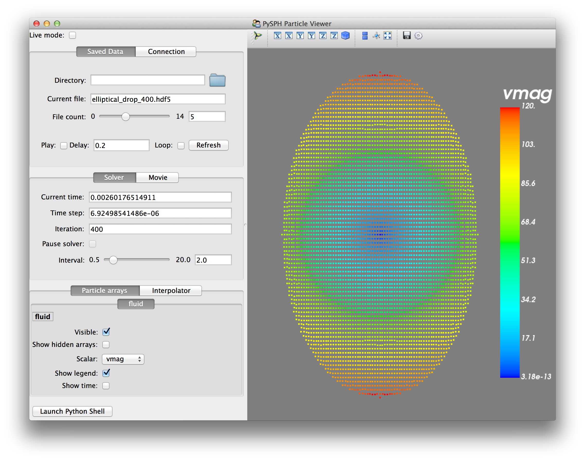

:author: Prabhu Ramachandran
:email: prabhu@aero.iitb.ac.in
:institution: Department of Aerospace Engineering
:institution: IIT Bombay, Mumbai, India
:corresponding:
:bibliography: references

----------------------------------------------------------------------------------------
PySPH: a reproducible and high-performance framework for smoothed particle hydrodynamics
----------------------------------------------------------------------------------------

.. class:: abstract

    Smoothed Particle Hydrodynamics (SPH) is a general purpose technique to
    numerically compute the solutions to partial differential equations.  The
    method is grid-free and uses particles to discretize the various
    properties of interest.  The method is Lagrangian and particles are moved
    with the local velocity.

    PySPH is an open source framework for Smoothed Particle Hydrodynamics.  It
    is implemented in a mix of Python and Cython.  It is designed to be easy
    to use on multiple platforms, high-performance and support parallel
    execution.  Users write pure-Python code and HPC code is generated on the
    fly, compiled, and executed.  PySPH supports OpenMP and MPI for
    distributed computing.  This is transparent to the user.  PySPH is also
    designed to make it easy to perform reproducible research.  In this paper
    we discuss the design and implementation of PySPH.

Background and Introduction
----------------------------

SPH (Smoothed Particle Hydrodynamics) is a general purpose technique to
numerically compute the solutions to partial differential equations.  The
method is grid-free and uses particles to discretize the various properties of
interest.  The method is Lagrangian and particles are moved with the local
velocity.  The method was originally developed for astrophysical problems
:cite:`lucy77`, :cite:`monaghan77` (compressible gas-dynamics) but has since
been extended to simulate incompressible fluids
:cite:`sph:fsf:monaghan-jcp94`, solid mechanics :cite:`sph-elastic:gray:2001`,
free-surface problems :cite:`sph:fsf:monaghan-jcp94` and a variety of other
problems.  Monaghan :cite:`monaghan-review:2005`, provides a good review of
the method.

The SPH method is relatively easy to implement.  This has resulted in a large
number of schemes and implementations proposed by various researchers.  It is
often difficult to reproduce published results due to the variety of
implementations.  While a few standard packages like (SPHysics
:cite:`sphysics`, DualSPHysics :cite:`dualsphysics`, JOSEPHINE
:cite:`josephine-sph:cpc:2015`, GADGET-2 :cite:`gadget2-springel:mnras:2005`
etc.)  exist, they are usually tailor-made for particular applications and are
not general purpose.  They are all implemented in FORTRAN (77 or 90) or C.
They do not have a convenient Python interface.

Our group has been developing PySPH (http://pysph.bitbucket.org) over the last
5 years.  PySPH is open source, and distributed under the new BSD license.
Our initial implementation was based on Cython :cite:`behnel2010cython` and
also featured some parallelization using MPI.  This was presented at SciPy
2010 :cite:`PR-pysph-scipy-2010`.  Unfortunately, this previous version of
PySPH, proved difficult to use as users were forced to implement most of their
code in Cython.  This was not a matter of simply writing a few high
performance functions in Cython.  Our library is object oriented and
supporting a new SPH formulation would require subclassing one or more classes
and this would need to be done with Cython.  Our type system also ended up
becoming more rigid because if we desired performance as well as a general
purpose code, all the types needed to be pre-defined.  In addition, writing
all this in Cython meant that users had to manage compilation and linking the
Cython code during development.  This was not pleasant.

It was felt that we might as well have implemented it all in C++ and exposed a
Python interface to that.  A traditional compiled language has more developer
tooling around it.  For example debugging, performance tuning, profiling would
all be easier if everything were written in C or C++.  Unfortunately, such a
mixed code-base would not be as easy to use, extend or maintain as a largely
pure Python library.  In our experience, a pure Python library is a lot easier
for say an undergraduate student to grasp and use over a C/C++ code.  Others
are also finding this to be true :cite:`py:nature:2015`.  Many of the top US
universities are teaching Python as their first language
:cite:`py:teaching-us`. This means that a Python library would also be easier
for relatively inexperienced programmers.  It is also true that a Python
library would be easier and shorter to write for the other
non-high-performance aspects (which is often a significant amount of code).
So it seemed that our need for performance was going against our desire for an
easy to use Python library that could be used by programmers who were not
C/C++ developers.

In early 2013, we redesigned PySPH so that users were able to implement an
entire simulation using pure Python.  This was done by auto-generating HPC
code from the pure Python code that users provided.  This version ended up
being faster than our original Cython implementation!  Since we were
auto-generating code, with a bit of additional effort it was possible to
support OpenMP as well.  The external user API did not change so users did not
have to modify their code at all to benefit from this development.  PySPH has
thus matured into an easy to use, yet high-performance framework where users
can develop their schemes in pure Python and yet obtain performance close to
that of a lower-level language implementation.  PySPH has always supported
running on a cluster of machines via MPI.  This is seamless and a serial
script using PySPH can be run with almost no changes using MPI.

PySPH features a reasonable test-suite and we use continuous integration
servers to test it on Linux and Windows.  Our documentation is hosted on
http://pysph.readthedocs.org.  The framework supports several of the standard
SPH algorithms.  A suite of about 30 examples are provided and are shipped as
part of the sources and installed when a user does a pip install for example.
The examples are written in a way that makes it easy to extend and also
perform comparisons between schemes.  These features make PySPH well suited
for reproducible numerical work.  In fact one of our recent papers was written
such that every figure in the paper is automatically generated using PySPH.

In this paper we discuss the use, design, and implementation of PySPH.  In the
next section we provide a high-level overview of the SPH method.

Smoothed Particle Hydrodynamics
-------------------------------

The SPH method works by approximating the identity:

.. math::

   f(x) = \int f(x') \delta (x-x') dx',

where, :math:`\delta` is the Dirac Delta distribution.  This identity is
approximated using:

.. math::
   :label: eq:delta-approx

   f(x) \approx \int f(x') W (x-x', h) dx',

where :math:`W` is a smooth and compact function and is called the kernel.  It
is an approximate Dirac delta distribution that is parametrized on the
parameter :math:`h` and :math:`W \rightarrow \delta` as :math:`h\rightarrow
0`.  :math:`h` is called the smoothing length or smoothing radius of the
kernel.  The kernel typically will need to satisfy a few properties notably
its area should be unity and if it is symmetric, it can be shown that the
approximation is at least second order in :math:`h`.  The above equation can
be discretized as,

.. math::
   :label: eq:sph-discr

   f(x) \approx \langle f(x) \rangle = \sum_{j \in \mathcal{N}(x)} W(x-x_j, h) f(x_j) \Delta x_j,

where :math:`x_j` is the position of the particle :math:`j`, :math:`\Delta
x_j` is the volume associated with this particle.  :math:`\mathcal{N}(x)` is the
set of particle indices that are in the neighborhood of :math:`x`.  In SPH
each particle carries a mass :math:`m` and associated density :math:`\rho`
with it and the particle volume is typically chosen as
:math:`\Delta x_j = m_j/\rho_j`.  This results in the following SPH
approximation for a function,

.. math::
   :label: eq:sph-approx

   <f(x)> = \sum_{j \in \mathcal{N}(x)} \frac{m_j}{\rho_j} W(x-x_j, h) f(x_j).

Derivatives of functions at a location :math:`x_i` are readily approximated by
taking the derivative of the smooth kernel.  This results in,

.. math::
   :label: eq:deriv-sph-approx

   \frac{\partial f_i}{\partial x_i} = \sum_{j \in \mathcal{N}(x)}
        \frac{m_j}{\rho_j} (f_j - f_i) \frac{\partial W_{ij}}{\partial x_i}.

Here :math:`W_{ij} = W(x_i - x_j)`.  Similar discretizations exist for the
divergence and curl operators.  Given that derivatives can be approximated one
can solve differential equations fairly easily.  For example the conservation
of mass equation for a fluid can be written as,

.. math::
   :label: eq:cons-mass

   \frac{d \rho}{dt} = - \rho \nabla \cdot \vec{v},

where :math:`v` is the velocity of the fluid and the LHS is the material or
total derivative of the density.  The equation :ref:`eq:cons-mass` is in a
Lagrangian form, in that it represents the rate of change of density as one is
moving locally with the fluid.  If an SPH discretization of this equation were
performed we would get,

.. math::
   :label: eq:sph-continuity

   \frac{d \rho_i}{d t} =  -\rho_i \sum_{j \in \mathcal{N}(x)}
   \frac{m_j}{\rho_j} \vec{v}_{ji} \cdot \nabla_i W_{ij},

where :math:`\vec{v}_{ji} = \vec{v}_j - \vec{v}_i`.  This equation is typical
of most SPH discretizations.  SPH can therefore be used to discretize any
differential equation.  This works particularly well for a variety of
continuum mechanics problems.  Consider the momentum equation for an inviscid
fluid,

.. math::
   :label: eq:momentum

   \frac{d \vec{u}}{dt} = - \frac{1}{\rho} \nabla p

A typical SPH discretization of this could be written as,

.. math::
   :label: eq:sph-momentum

   \frac{d \vec{u_i} }{dt} = -\sum_j m_j \left ( \frac{p_j}{\rho_j^2} +
   \frac{p_i}{\rho_i^2} \right) \nabla W_{ij}

More details of these and various other equations can be seen in the review by
Monaghan :cite:`monaghan-review:2005`.  It is easy to see that equations
:ref:`eq:sph-continuity` and :ref:`eq:sph-momentum` are ordinary differential
equations that govern the rate of change of the density and velocity of a
fluid particle.  In principle one can integrate these ODEs to obtain the flow
solution given a suitable initial condition and appropriate boundary
conditions.

Numerical implementation
-------------------------

As discussed in the previous section, in an SPH scheme, the field properties
are first discretized into particles carrying them.  Partial differential
equations are reduced to a system of coupled ordinary differential equations
and discretized using an SPH approximation.  This results in a system of ODEs
for each particle.  These ODEs need to be integrated in time along with
suitable boundary and initial conditions in order to solve a particular
problem.  To summarize, a typical SPH computation proceeds as follows,

- Given an initial condition, the field variables are discretized into
  particles carrying the various properties.
- Depending on the scheme used to integrate the ODEs, the RHS of the ODEs
  needs to be computed (see equations :ref:`eq:sph-continuity` and
  :ref:`eq:sph-momentum`).  These RHS terms are called "accelerations" or
  "acceleration terms".
- Once the RHS is computed the ODE can be integrated using a suitable scheme
  and the fluid properties are found at the next timestep.

The RHS is typically computed as follows:

- Initalize the particle accelerations (i.e. the RHS terms).
- For each particle in the flow, compute the neighbors of the particle which
  will influence the particle.
- For each neighbor compute the acceleration due to that particle and
  increment the acceleration.

Given the total accelerations, the ODEs can be readily integrated with a
variety of schemes.  Any general purpose abstraction of the SPH method must
hence provide functionality to:

1. Easily discretize properties into particles.  This is easily done with
   ``numpy`` arrays representing the property values in Python.
2. Given a particle, compute the neighbors that influence the particle.  This
   is typically called Nearest Neighbor Particle Search (NNPS) in the
   literature.
3. Define the interactions between the particles, i.e. an easy way to specify
   the inter particle accelerations.
4. A way to specify how to integrate the ODEs.

Of the above, the NNPS algorithm is usually a well-known algorithm.  For
incompressible flows where the smoothing radius of the particles, :math:`h`,
is constant, a simple bin-based linked list implementation is standard.  For
cases where :math:`h` varies, a tree-based algorithm is typically used.  Users
usually do not need to experiment or modify these algorithms.

The PySPH framework
-------------------

PySPH allows a user to specify the inter-particle interactions as well as the
ODE integration in pure Python with a rather simple and low-level syntax.
This is described in greater detail further below.  As discussed in the
introduction, with older versions of PySPH as discussed in
:cite:`PR-pysph-scipy-2010`, these interactions would all need to be written
in Cython.  This was not very easy or convenient.  It was also rather
limiting.

The current version of PySPH supports the following:

- Define a complete SPH simulation entirely in Python.
- High-performance code is generated from this high-level Python code
  automatically and called.  The performance of this code is comparable to
  hand-written FORTRAN solvers.
- PySPH can use OpenMP seamlessly.  Users do not need to modify their code at
  all to use this.  This works on Linux, OSX, and Windows and
  produces good scale-up.
- PySPH also works with MPI and once again this is transparent to the user in
  that the user does not have to change code to use multiple machines.  This
  feature requires mpi4py_ and Zoltan_ to be installed.
- PySPH provides a built-in 3D viewer for the particle data generated.  The
  viewer requires Mayavi_ :cite:`it:mayavi:cise:gael2011` To be installed.
- PySPH is also free and currently hosted at http://pysph.bitbucket.org

In the following subsection we provide a high-level overview of PySPH and how
it can be used by a user.  Subsequent subsections discuss the design and
implementation in greater detail.

.. _mpi4py: http://mpi4py.scipy.org
.. _Zoltan: http://www.cs.sandia.gov/zoltan/
.. _Mayavi: http://code.enthought.com/projects/mayavi

High-level overview
~~~~~~~~~~~~~~~~~~~

PySPH is tested to work with Python-2.6.x to 2.7.x and also with Python
3.4/3.5.  PySPH is a typical Python package and can be installed fairly easily
by running::

  $ pip install pysph

PySPH will require a C++ compiler.  On Linux, this is trivial to get and
usually probably pre-installed.  On OS X clang will work as will gcc (which
can be easily installed using brew_). On Windows the Visual C++ Compiler for
Python will need to be installed.  Detailed instructions for all these are
available from the `PySPH documentation`_.

If one wishes to use OpenMP,

- On Linux one needs to have libgomp installed.
- On OS X one needs to install OpenMP for clang or one could use GCC which
  supports Openmp.
- On Windows, just having the Visual C++ computer for Python will work.

If one wishes to use MPI for distributed computing, one must install Zoltan_
which is typically easy to install.  PySPH provides a simple script for this.
mpi4py_ is also needed in this case.

PySPH also provides an optional 3D viewer and this depends on Mayavi_.

In summary, PySPH is easy to install if one has a C++ compiler installed.
MPI support is a little involved due to the requirement to install Zoltan_.

.. _brew: http://brew.sh/
.. _PySPH Documentation: http://pysph.readthedocs.io

Once PySPH is installed an executable called ``pysph`` is available.  This is
a convenient entry point for various tasks.  Running ``pysph -h`` will provide
a listing of these possible tasks.

The test suite can be run using::

  $ pysph test

This uses nose_ internally and can be passed any arguments that nosetests
accepts.

PySPH installs about 30 useful examples along with the sources and any of
these examples can be readily run.  For example::

  $ pysph run
  1. cavity
     Lid driven cavity using the Transport Velocity
     formulation. (10 minutes)
  2. couette
     Couette flow using the transport velocity
     formulation (30 seconds).
  [...]
  6. elliptical_drop
     Evolution of a circular patch of incompressible
     fluid. (60 seconds)
  [...]
  Enter example number you wish to run:

Will provide a listing of the examples prompting for a particular one to run.
Each example also provides a convenient time estimate if it were to be run in
serial.  The example number can be provided at the prompt or if one knows the
example to run one may directly specify it::

  $ pysph run elliptical_drop

This example will accept a large number of command line arguments.  So one
could also do::

  $ pysph run elliptical_drop -h

to find out the possible arguments.

``pysph run`` will execute the standard example.  Note that internally this is
somewhat equivalent to running::

  $ python -m "pysph.examples.elliptical_drop"

The example may therefore be imported in Python and also extended by users.
This is by design.

When the example is run using ``pysph run``, the example documentation is
first printed and then the example is run.  The example will typically dump
the output of the computations to a directory called ``example_name_output``,
in the above case this would be ``elliptical_drop_output``.  This output can
be viewed using the Mayavi viewer.  This can be done using::

  $ pysph view elliptical_drop_output

This will start up the viewer with the saved files dumped in the directory.
Figure :ref:`fig:pysph-viewer` provides a very convenient interface to view
the data.  On the right side, one has a standard Mayavi widget which also
features a Mayavi icon on the toolbar.  Running this will open the Mayavi UI
with which one can easily change the visualization.  On the left pane there
are three sub panels.  On the top one can see a slider for the file
count. This can be used to move through the simulation in time.  This can be
also animated by checking the "Play" checkbox which will iterate over the
files.  The "Directory" button allows one to view data from a different output
directory.  Hitting the refresh button will rescan the directory to check for
any new files.  This makes it convenient to visualize the results from a
running simulation.  The "Connection" tab can be used when the visualization
is in "Live mode" when it can connect to a running simulation and view the
data live.  While this is very cool in principle, it is seldom used in
practice as it is a lot more efficient to just view the dumped files and the
"Refresh" button is convenient.  Regardless, it does show another feature of
PySPH in that one can actually pause a running simulation and query it if
needed.  Below this pane is a "Solver" pane which shows the various solver
parameters of interest.  The "Movie" tab allows a user to dump screenshots and
easily produce a movie if needed.  At the bottom of the interface are two
panels called "Particle arrays" and "Interpolator".  The particle arrays lists
all the particles and different scalar properties associated with the SPH
simulation.  Right at the bottom is a button to launch a Python shell.  This
can be used for advanced scripting and is seldom used by beginners.  This
entire viewer is written using about 1024 lines of code and ships with PySPH.

   The viewer provides a convenient interface to view data dumped by
   simulations. :label:`fig:pysph-viewer`

PySPH output can be dumped either in the form of ``.npz`` files (which are
generated by NumPy_) or HDF5 files if h5py_ is installed.  These files can be
viewed using other tools or with Python scripting if desired.  The HDF5 in
particular can be viewed more easily.  In addition, the ``pysph dump_vtk``
command can be used to dump VTK output files that can be used to visualize the
output using any tool that supports VTK files like ParaView etc.  This can use
either Mayavi or can use pyvisfile_ which has no dependency on VTK.  The data
files can be loaded in Python very easily, for example:

.. code-block:: python

    from pysph.solver.utils import load
    data = load('elliptical_drop_100.hdf5')
    # if one has only npz files the syntax is the same.
    data = load('elliptical_drop_100.npz')

This provides a dictionary from which one can obtain the particle arrays and
solver data:

.. code-block:: python

    particle_arrays = data['arrays']
    solver_data = data['solver_data']

``particle_arrays`` is a dictionary of all the PySPH particle arrays.
One can obtain the PySPH particle array, ``fluid``, like so:

.. code-block:: python

    fluid = particle_arrays['fluid']
    p = fluid.p

Here ``p`` is a NumPy array of the pressure of each particle.  Particle arrays
are described in greater detail in the following sections.  Our intention here
is to show that the dumped data can be very easily loaded back into Python if
desired.

.. _nose: https://pypi.python.org/pypi/nose
.. _NumPy: http://numpy.scipy.org
.. _h5py: http://www.h5py.org
.. _pyvisfile: http://mathema.tician.de/software/pyvisfile

As discussed earlier PySPH supports OpenMP and MPI.  To use multiple cores on
a computer one can simply run an example or script as::

  $ pysph run elliptical_drop --openmp

This will use OpenMP transparently and should work for all the PySPH
examples.  PySPH will honor the ``OMP_NUM_THREADS`` environment variable to
pick the number of threads.  If PySPH is installed with MPI support through
Zoltan, then one may run for example::

  $ mpirun -np 4 pysph run dam_break_3d

This will run the ``dam_break_3d`` example with 4 processors.  The amount of
scale-up depends on the size of the problem and the network.  OpenMP will
scale fairly well for moderately sized problems.  Note that for a general
PySPH script written by the user, the command to run would simply be::

  $ mpirun -np 4 python my_script.py

This provides a very high-level introduction to PySPH in general.  The next
section discusses some essential software engineering in brief.  This is
followed by details on the underlying design of PySPH.

Essential software engineering
~~~~~~~~~~~~~~~~~~~~~~~~~~~~~~~

PySPH follows several of the standard software development practices that most
modern open source implementations follow.  For example:

- Our sources are hosted on bitbucket (http://pysph.bitbucket.org).  We are
  thinking of shifting to github because github has much better integration
  with continuous integration services and this is a rather frustrating pain
  point with bitbucket.
- The new-style BSD license is used for the software.
- We use pull-requests to review all new features of bug fixes.  At this point
  there is only a single reviewer (the author) but this should hopefully
  increase over time.
- PySPH has a reasonable set of unit tests and functional tests.  Each time a
  bug is found, a test case is first created (when possible or reasonable),
  and then fixed.  nose_ is used for discovering and executing tests.  One of
  our functional tests runs one time step of every single example that ships
  with PySPH.  tox_ based tests are also supported.  This makes it easy to
  test on Python 2.6, 2.7 and 3.x.
- We use continuous integration services from http://shippable.com for Linux,
  http://appveyor.com for Windows and http://codeship.com for faster Linux
  builds.
- Our documentation is generated using Sphinx and hosted online on
  http://pysph.readthedocs.io.
- Releases are pushed to pypi.
- The `pysph-users mailing list
  <https://groups.google.com/forum/#!forum/pysph-users>`_ is also available
  where users can post their questions.  Unfortunately, the response time is
  currently slow as the author does not have the time for this but we are
  hoping this will improve as more graduate students start getting involved
  with PySPH.

These greatly improve the quality, reliability and usability of the software
and also encourage open collaboration.

.. _tox: https://pypi.python.org/pypi/tox

Design overview
~~~~~~~~~~~~~~~~

- General approach and high level objects.

High performance
~~~~~~~~~~~~~~~~~

- How HPC code is generated
- The (ab)use of Mako templates

Parallel processing
~~~~~~~~~~~~~~~~~~~

- Cython/OpenMP related tricks and issues
- Parallel implementation details

Reproducibility
~~~~~~~~~~~~~~~~

- Extensible and OO API
- Shipping examples with the sources
- Reusable examples
- Automation support

Future plans
-------------

In the future, we hope to develop the following features for PySPH:

- A GPU backend which should allow effective utilization of GPUs with minimal
  changes to the API.
- Cleanup and potential generalization of the parallel code.
- Implement more SPH schemes.
- Better support for variable :math:`h`.
- Cleanup of many of the current equations implemented.
- Support for implicit SPH schemes and other related particle methods.
- Advanced algorithms for adaptive resolution.

Conclusions
-----------

In this paper a broad overview of the SPH method was provided.  The background
and context of the PySPH package was discussed.  A very high-level description
of the PySPH features were provided followed by an overview of the design.
From the description it can be seen that PySPH provides a powerful API and
allows users to focus on the specifics of the SPH scheme which they are
interested in.  By abstracting out the high-performance aspects even
inexperienced programmers can use the high-level API and produce useful
simulations that run quickly and scale fairly well with multiple cores and
processors.  The paper also discusses how PySPH facilitates reproducible
research.

Acknowledgements
-----------------

I would like to thank Kunal Puri, Chandrashekhar Kaushik, Pankaj Pandey and
the other PySPH developers and contributors for their work on PySPH.  I thank
the department of aerospace engineering, IIT Bombay for their continued
support, excellent academic environment and academic freedom that they have
extended to me over the years.
