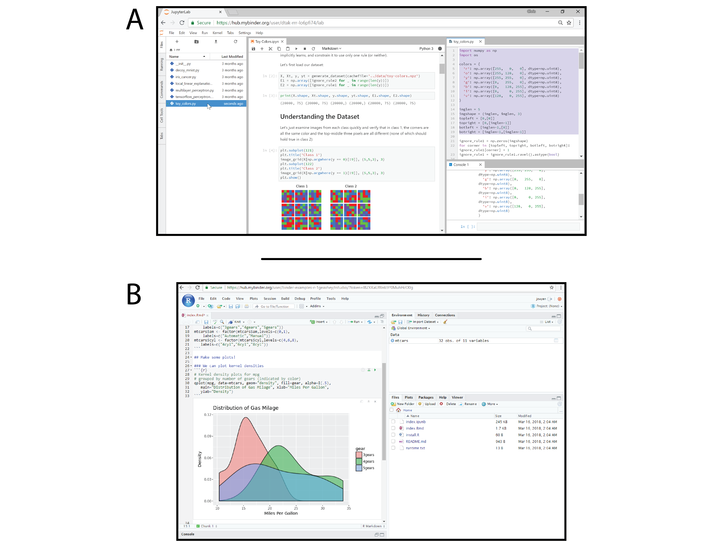
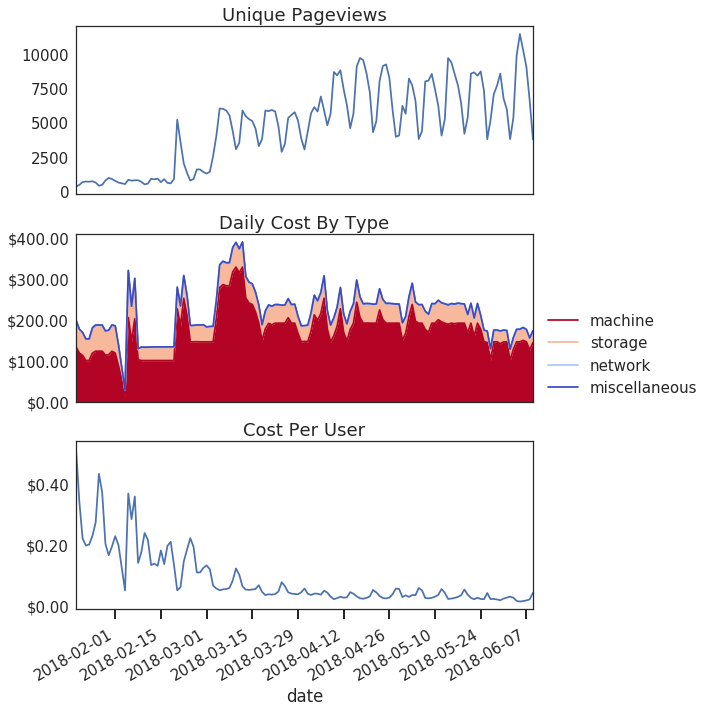

:author: Project Jupyter
:email:
:institution: Project Jupyter
:equal-contributor:

:author: Matthias Bussonnier
:email:
:institution: UC Berkeley
:equal-contributor:

:author: Jessica Forde
:email:
:institution: Project Jupyter
:equal-contributor:

:author: Jeremy Freeman
:email:
:institution:
:equal-contributor:

:author: Brian Granger
:email:
:institution: Cal Poly, San Luis Obispo
:equal-contributor:

:author: Tim Head
:email: tim@wildtreetech.com
:institution: Wild Tree Tech, Switzerland
:equal-contributor:

:author: Chris Holdgraf
:email: choldgraf@berkeley.edu
:institution: UC Berkeley
:corresponding:

:author: Kyle Kelley
:email:
:institution: Netflix
:equal-contributor:

:author: Gladys Nalvarte
:email:
:institution: Simula Research Lab
:equal-contributor:

:author: Andrew Osheroff
:email:
:institution:
:equal-contributor:

:author: M Pacer
:email: mpacer.phd@gmail.com
:institution: Netflix
:equal-contributor:

:author: Yuvi Panda
:email:
:institution: UC Berkeley
:equal-contributor:

:author: Fernando Perez
:email:
:institution: UC Berkeley
:equal-contributor:

:author: Benjamin Ragan-Kelley
:email: benjaminrk@gmail.com
:institution: Simula Research Lab
:equal-contributor:

:author: Carol Willing
:email: willingc@gmail.com
:institution: Cal Poly, San Luis Obispo
:equal-contributor:
:bibliography: binderbib

:video: https://youtu.be/KcC0W5LP9GM

===================================================================================
Binder 2.0 - Reproducible, interactive, sharable environments for science at scale
===================================================================================

.. class:: abstract

   Binder is an open source web service that lets users create sharable,
   interactive, reproducible environments in the cloud. It is powered by other
   core projects in the open source ecosystem, including JupyterHub and
   Kubernetes for managing cloud resources. Binder works with pre-existing
   workflows in the analytics community, aiming to create interactive versions
   of repositories that exist on sites like GitHub with minimal extra effort
   needed. This paper details several of the design decisions and goals that
   went into the development of the current generation of Binder.

.. class:: keywords

   cloud computing, reproducibility, binder, mybinder.org, shared computing,
   accessibility, kubernetes, dev ops, jupyter, jupyterhub, jupyter notebooks, github,
   publishing, interactivity

Binder is a free, open source, and massively publicly available tool
for easily creating sharable, interactive, reproducible environments in the
cloud.

The scientific community is increasingly unified around reproducibility.
A survey in 2016 of 1,576 researchers reported that 90% of respondents believed
there exists a reproducibility crisis in the scientific community.
A majority of respondents also reported difficulty
reproducing the work of colleagues :cite:`Baker2016-gp`. Similar results have
been reported in the cell biology community
:cite:`The_American_Society_for_Cell_Biology_undated-yv` and the machine
learning community :cite:`Pineau2017-sb`.
Making research reproducible requires pursuing two sub-goals, both of which are
difficult to achieve:

- **technical reproducibility**:

  making reproducible scientific results possible at all
- **practical reproducibility**:

  enabling others to reproduce results without difficulty

Both technical and practical reproducibility depend upon the software and
technology available to researchers at any moment in time. With the growth in
open source tools for data analysis, as well as the “data heavy” approach many
fields are adopting, these problems become more complex yet more tractable
than ever before.

Fortunately, as the problem has grown more complex, the open source community has
risen to meet the challenge. Tools for packaging analytics environments into
“containers” allow others to re-create the computational environments needed to
run analyses and evaluate results. Online communities make it easier to share
and discover scientific results. A myriad of open source tools are
freely available for doing analytics in open and transparent ways. New paradigms
for writing code and displaying results in rich, engaging formats allow results
to live next to the prose that explains their purpose.

However, manual implementation of this processes is complex, and
reproducing the full stack of another person’s work is too labor intensive and
error-prone for day-to-day use. A recent study of scientific
repositories found that citation of "both visualization tools as well as
common software packages (such as MATLAB) was a widespread failure" :cite:`Stodden2018-fy`.
As a result, the technical barriers limit practical reproducibility.
To lower the technical barriers of sharing computational work,
we introduce Binder 2.0, a tool that we believe makes reproducibility
more practically possible.

An overview of Binder
---------------------

Binder consists of a set of tools for creating sharable, interactive, and
deterministic environments that run on personal computers and cloud resources.
It manages the technical complexity around:

* creating containers to capture a code repository and its technical environment;
* generating user sessions that run the environment defined in those containers; and
* providing links that users can share with others to allow them to interact
  with these environments.

Binder is built on modern-day tools from the open source community and is
itself fully open source for others to use.

You can access a public deployment of Binder at `mybinder.org <https://mybinder.org>`_,
a web service that the Binder and JupyterHub teams run as a
demonstration of the BinderHub technology and as digital public infrastructure
for those who wish to share Binder links so that others may interact with
their code repositories. It is meant to
be a testing ground for different use cases in the Binder ecosystem as well as a public
service for the scientific and educational community.
`mybinder.org <https://mybinder.org>`_ serves nearly 9,000 daily sessions,
and has already been used for reproducible publishing [#]_,
sharing interactive course materials [#]_,
at the university and high-school level, creating interactive package documentation
in Python [#]_ with Sphinx Gallery, and sharing interactive content
that requires a language-specific kernel in order to run [#]_.

.. [#] https://github.com/minrk/ligo-binder
.. [#] https://www.inferentialthinking.com/chapters/01/3/plotting-the-classics.html
.. [#] https://sphinx-gallery.readthedocs.io/en/latest/advanced_configuration.html#binder-links
.. [#] http://greenteapress.com/wp/think-dsp/

   Two example user interfaces that users can run within Binder.
   Because BinderHub uses a JupyterHub for hosting all user sessions, one can specify an
   environment that serves any Jupyter-supported user interface, provided that it can run
   via the browser. A. Examining image data from Ross et al. on Binder with JupyterLab :cite:`Ross2017-ff`.
   JupyterLab provides access to the file system (left column), a notebook interface (middle column),
   as well as traditional script files and interactive kernels (right column).
   B. An RStudio interface running the modern RStudio and ``tidyverse`` stack.
   In both cases, users can explore the code
   and make their own modifications from within the Binder session, without any
   need to manually install dependencies.

Binder continues in the tradition of promoting "the complete software
development environment and the complete set of instructions which generated
the figures" :cite:`Buckheit1995-ox` by effortlessly providing these tools to the general
public in the cloud. The first iteration of Binder was released in 2016 :cite:`Freeman2016-jt`
and provided a prototype that managed reproducible user environments in the cloud.
In the years since, there have been several advances in technology for managing
cloud resources, serving interactive user environments, and creating reproducible containers for
analytics. Binder 2.0 utilizes these new tools, and it is more scalable and maintainable,
is easier to deploy, and supports more analytic and scientific workflows than
before. While previous work has specified methods or file formats
for the sharing of research :cite:`Buckheit1995-ox` :cite:`Gentleman2007-cz`
:cite:`Liang2015-ay`, Binder only requires configuration files typically seen in contemporary software
development. Related online platforms for reproducibility also have specific
front ends for presenting research and commands for running code :cite:`Anjos2017-vb`
:cite:`Liang2015-ay` :cite:`Stodden2012-sd`, while Binder flexibly allows users to interact with
a repository using modern data science tools such as RStudio, Jupyter Notebok,
and JupyterLab. By containerizing the environment and using these front-end
data science tools, Binder prioritizes an interactive user experience so that
"someone else can discover it for themselves" :cite:`Somers2018-bj`.

At the highest level, Binder is a particular combination of open source
tools to achieve the goal of sharable, reproducible environments. This paper
lays out the technical vision of Binder 2.0, including the guiding principles
and goals behind each piece of technology it uses. It also discusses the guiding
principles behind the *new* open source technology that the project has created.

Guiding Principles of Binder
----------------------------

Several high-level project goals drive the development of Binder 2.0. These are outlined below:

**Deployability**. Binder is driven by open source technology, and the BinderHub
server should be deployable by a diverse representation of people in the scientific,
publishing, and data analytic communities. This often means that it must be
maintained by people without an extensive background in cloud management and
dev-ops skills. BinderHub (the underlying technology behind Binder) should thus
be deployable on a number of cloud frameworks, and with minimal technical skills
required.

**Maintainability**. Deploying a service on cloud resources is important but
happens less frequently than *maintaining* those cloud resources all day, every
day. Binder is designed to utilize modern-day tools in cloud orchestration and
monitoring. These tools minimize the time that individuals must spend ensuring
that the service performs as expected. Recognizing the importance of
maintainability, the Binder team continues to work hard to document effective
organizational and technical processes around running a production
BinderHub-powered service such as `mybinder.org <https://mybinder.org>`_. The goal of the project is to
allow a BinderHub service to be run without specialized knowledge or extensive
training in cloud orchestration.

**Pluggability**. Binder’s goal is to make it easier to adopt and interact
with existing tools in the open source ecosystem. As such, Binder is designed
to work with a number of open source packages, languages, and user interfaces.
In this way, Binder acts as glue to bring together pieces of the open source
community, and it easily plugs into new developments in this space.

**Accessibility**. Binder should be as accessible as possible to members of
the open source, scientific, educational, and data science communities. By
leveraging pre-existing workflows in these communities rather than requiring
people to adopt new ones, Binder increases its adoption and user acceptance.
Input and feedback from members of those communities guide future development
of the technology. As a key goal, Binder should support pre-existing scientific
workflows and improve them by adding sharability, reproducibility, and interactivity.

**Usability**. Finally, the Binder team wants simplicity and fast interaction to
be core components of the service. Minimizing the number of steps towards making
your work sharable via Binder helps provide an effective user experience.  Consumers
of shared work must be able to quickly begin using the Binder repository that
another person has put together. To achieve these goals, creating multiple ways
in which people can use Binder’s services is key. For example, easily sharing
a link to the full Binder interface and offering a public API endpoint to
request and interact with a kernel backed by an arbitrary environment increase
usability.

In the following sections, we describe the three major technical components that
the Jupyter and Binder teams have developed for the Binder project—JupyterHub, repo2docker, and BinderHub.
All are open source, and rely heavily on other tools in the open source ecosystem.
We'll discuss how each feeds into the principles we’ve outlined above.

Scalable interactive user sessions
----------------------------------
Binder runs as either a public or a private web service, and it needs to handle
potentially large spikes in user sessions as well as sustained user activity
over several minutes of time. It also needs to be deployable on a number of
cloud providers in order to avoid locking in the technology to the offerings
of a single cloud service. To accomplish this Binder uses a deployment of
JupyterHub that runs on Kubernetes, both of which contribute to BinderHub's
scalability and maintainability.

JupyterHub, an open source tool from the Jupyter community, provides a
centralized resource that serves interactive user sessions. It allows
definition of  a computational environment (e.g. a Docker image) that runs
the Jupyter notebook server. A core principle of the Jupyter project is to be
language- and workflow-agnostic, and JupyterHub is no exception. JupyterHub can
be used to run dozens of languages served with a variety of user interfaces,
including Jupyter Notebooks :cite:`Bussonnier2018-kc`, JupyterLab
:cite:`Project_Jupyter_Contributors2017-yi`,
RStudio :cite:`Project_Juptyer_Contributors2017-ra`, Stencila :cite:`RK_Min2018-eq`,
and OpenRefine :cite:`Head2018-jf`.

Another key benefit of JupyterHub is that it is straightforward to run on
Kubernetes, a modern-day open source platform for orchestrating computational
resources in the cloud. Kubernetes can be deployed on most major cloud providers,
self-hosted infrastructure (such as OpenStack deployments), or even on an
individual laptop or workstation. For example, Google Cloud Platform, Microsoft
Azure, and Amazon AWS each have managed Kubernetes clusters that run with minimal
user intervention. Thus, it is straightforward to deploy JupyterHub on any
major cloud provider.

Kubernetes is designed to be relatively self-healing, often automatically resolving
problems that would normally disrupt the service. It also has a declarative
syntax for defining the cloud resources that are needed to run a web service.
Thus, maintainers can update a JupyterHub running on Kubernetes with minimal
changes to configuration files for the deployment, providing the flexibility to
configure the JupyterHub as needed, without requiring a lot of hands-on
intervention and tinkering.

Finally, Kubernetes is both extremely scalable and battle-tested because
it was originally developed to run Google's web services. A cloud orchestration
tool that can handle the usage patterns of a service like GMail can almost
certainly handle the analytics environments that are served with Binder. In
addition, by using Kubernetes, Binder (with JupyterHub) leverages the power of
Kubernetes' strong open source community. As more companies, organizations, and
universities adopt and contribute to the tool, the Binder community will
benefit from these advances.

There are several use-cases of JupyterHub being used for shared, interactive
computing. For example, UC Berkeley hosts a Foundations in Data Science :cite:`Berkeley_Division_of_Data_Sciences_undated-nz`
course that serves nearly 1,000 interactive student sessions simultaneously.
The Wikimedia foundation also uses JupyterHub to facilitate users accessing
the Wikipedia dataset :cite:`Wikimedia_undated-si`, allowing them to run bots and
automate the editing process with a Jupyter interface. Finally, organizations
such as the Open Humans Project provide a JupyterHub for their community
:cite:`Open_Humans_Foundation_undated-ov` to analyze, explore, and discover interesting
patterns in a shared dataset.

Deterministic environment building - Repo2Docker
------------------------------------------------

Docker :cite:`Docker_Inc_undated-ai` is extremely flexible, and has been used throughout the scientific and
data science community for standardizing environments that are sharable with
other people. A Docker image contains nearly all of the pieces necessary to
re-run an analysis. This provides the right balance between flexibility (e.g.
a Docker image can contain basically any environment) and being lightweight to
deploy and store in the cloud. JupyterHub can serve an arbitrary environment to
users based off of a Docker image, but how is this image created in the first
place?

While it is possible (and common) to hand-craft a Docker image using a set of
instructions called a Dockerfile, this step requires a considerable amount of
knowledge about the Docker platform, making it a high barrier to the large
majority of scientists and data analysts. Binder’s goal is to operate with many
different workflows in data analytics, and requiring the use of a Dockerfile to
define an environment is too restrictive.

At the same time, the analytics community already makes heavy use of online code
repositories, often hosted on websites such as GitHub :cite:`GitHub_undated-wa`
or Bitbucket :cite:`Atlassian_undated-ra`. These sites are home to tens of
thousands of repositories containing the computational work for research,
education, development, and general communication. Best practices in development
already dictate storing the requirements needed (in text files such as ``environment.yml``)
along with the code itself (which often lives in document structures such as Jupyter
Notebooks or RMarkdown files). As a result, in many cases the repository already
contains all the information needed to build the required environment.

Binder’s solution to this is a lightweight tool called “repo2docker” :cite:`Project_Jupyter_Contributors2017-no`.
It is an open source command line tool that converts code repositories into a Docker
image suitable for running with JupyterHub. Repo2docker:

1. is called with a single argument, a path to a git repository, and optionally
   a reference to a git branch, tag, or commit hash. The repository can either
   be online (such as on GitHub or GitLab) or local to the person’s computer.
2. clones the repository, then checks out the reference that it has been passed
   (or defaults to “master”).
3. looks for one or more “configuration” files that are used to define the
   environment needed to run the code inside the repository. These are generally
   files that *already exist* in the data science community. For example, if it
   finds a ``requirements.txt`` file, it assumes that the user wants a Python
   installation and installs everything inside the file. If it finds an ``install.R``
   file, it assumes the user wants RStudio available, and pre-installs all the
   packages listed inside.
4. constructs a ``Dockerfile`` that builds the environment specified by the
   configuration files, and that is meant to be run via a Jupyter notebook server.
5. builds an image from this ``Dockerfile``, and then registers it online with a
   Docker repository of choice.

Repo2docker aims to be flexible in the analytics workflows it supports, and it
minimizes the amount of effort needed to support a *new* workflow. A core
building block of repo2docker is the “Build Pack” - a class that defines all
of the operations needed to construct the environment needed for a particular
analytics workflow. These Build Packs have a ``detect`` method that returns True
when a particular configuration file is present (e.g. ``requirements.txt`` will
trigger the Python build pack). They also have a method called ``get_assemble_scripts``
that inserts the necessary lines into a Dockerfile to support this workflow.

For example, below we show a simplified version of the Python build pack in
``repo2docker``. In this case, the ``detect`` method looks for a ``requirements.txt`` file and,
if it exists, triggers the ``get_assemble_scripts`` method, which inserts
lines into the Dockerfile that install Python and pip. Binder uses ``repo2docker``
to build repository images dynamically.

.. code-block:: python

   class PythonBuildPack(CondaBuildPack):
     """Setup Python for use with a repository."""

     def __init__(self):
       ...

     def get_assemble_scripts(self):
       """Return build-steps specific to this repo."""
       assemble_scripts = super().get_assemble_scripts()
       # KERNEL_PYTHON_PREFIX is the env with the kernel
       # whether it's distinct from the notebook
       # or the same.
       pip = '${KERNEL_PYTHON_PREFIX}/bin/pip'

       # install requirements.txt in the kernel env
       requirements_file = self.binder_path(
        'requirements.txt')
       if os.path.exists(requirements_file):
         assemble_scripts.append((
             '${NB_USER}',
             '{} install --no-cache-dir -r "{}"'.format(
                pip, requirements_file)
         ))
       return assemble_scripts

     def detect(self):
       """Check if repo builds w/ Python buildpack."""
       requirements_txt = self.binder_path(
        'requirements.txt')
       return os.path.exists(requirements_txt)

Repo2docker also supports more generic configuration files that are applied
regardless of the particular Build Pack that is detected. For example, a file
called “postBuild” will be run from the shell after all dependencies are
installed. This is often used to pre-compile code or download datasets from the web.

Finally, in the event that a particular setup is not natively supported,
repo2docker will also build a Docker image from a plain ``Dockerfile``.
This means users are never blocked by the design of repo2docker.

By modularizing the environment generation process in this fashion, it is
possible to mix and match environments that are present in the final image.
Repo2docker’s goal is to allow for a fully composable analytics environment.
If a researcher requires Python 2, 3, RStudio, and Julia, simultaneously for
their work, repo2docker should enable this.

.. figure:: images/binder_main_ui.png
   :align: center

   The BinderHub user interface. Users input a link to a public git
   repository. Binder will check out this repository and build the environment
   needed to run the code inside. It then provides you a link that can be shared
   with others so that they may run an interactive session that runs the
   repository’s code.

In addition, by capturing pre-existing workflows rather than requiring data
analysts to adopt new ones, there is a minimal energy barrier towards using
repo2docker to deterministically build images that run a code repository. For
example, if the following ``requirements.txt`` file is present in a repository,
repo2docker will build an image with Python 3 and the packages pip installed.

.. code-block:: bash

   $ cat requirements.txt
   numpy
   scipy
   matplotlib

While the following file name/content will install RStudio with these
R commands run before building the Docker image.:

.. code-block:: bash

   $ cat binder/install.R
   install.packages("ggplot2")

   $ cat binder/runtime.txt
   r-2017-10-24

In this case, the date specified in ``runtime.txt`` instructs repo2docker to
use a specific MRAN repository :cite:`Microsoft_undated-gd` date. In addition,
note that these files exist in a folder called ``binder/`` (relative to the
repository root). If repo2docker discovers a folder of this name, it will build
the environment from the contents of this folder, ignoring any configuration files
that are present in the project’s root. This allows users to dissociate the
configuration files used to build the package from those used to share a Binder
link.

.. figure:: images/binderhub_diagram.png
   :align: center
   :figclass: w

   The BinderHub architecture for interactive GUI sessions. Users
   connect to the Binder UI via a public URL. All computational infrastructure
   is managed with a Kubernetes deployment (light green) managing several pods
   (dark green) that make up the BinderHub service. Interactive user pods
   (blue squares) are spawned and managed by a JupyterHub.

By facilitating the process by which researchers create these reproducible images,
repo2docker addresses the “works for me” problem that is common when sharing code.
There are no longer breaking differences in the environment of two users if
they are running code from the same image generated by repo2docker. Additionally,
researchers can use repo2docker to confirm that all of the information needed to
recreate their analysis is contained within their configuration files, creating
a way to intuitively define “recipes” for reproducing one’s work.

A web-interface to user-defined kernels and interactive sessions - BinderHub
----------------------------------------------------------------------------

JupyterHub can serve multiple interactive user sessions from pre-defined Docker
images in the cloud. Repo2docker generates Docker images from the files in a git
repository. BinderHub is the glue that binds these two open source tools together.
It uses the building functionality of repo2docker, the kernel and user-session
hosting of JupyterHub, and a Docker registry that connects these two processes
together. BinderHub defines two primary patterns of interaction with this process:
sharable, interactive, GUI-based sessions; and a REST API for building, requesting,
and interacting with user-defined kernels.

The BinderHub User Interface
~~~~~~~~~~~~~~~~~~~~~~~~~~~~

The primary pattern of interaction with BinderHub for an author is via its “build
form” user interface. This form lets users point BinderHub to a public git
repository. When the form is filled in and the “launch” button is clicked,
BinderHub takes the following actions:

1. **Check out the repository** at the version that is specified.
2. **Check the latest commit hash**. BinderHub compares the version specified in
   the URL with the versions that have been previously
   built for this repository in the registry (if a branch is given, BinderHub
   checks the latest commit hash on this branch).
3. If the version has *not* been built, **launch a repo2docker process** that builds
   and registers an image from the repository, then returns a reference to the
   registered image.
4. **Create a temporary JupyterHub user account** for the visitor, with a private token.
5. **Launch a JupyterHub user session** that sources the repo2docker
   image in the registry. This session will serve the environment needed to run
   the repository, along with any GUI that the user specifies.
6. **Clean up the user session**. Once the user departs, Binder destroys
   the temporary user ID for the user's unique session, as well as their temporary
   files from their interactive session (steps 4 and 5). The Docker image for the
   repository persists, and will be used in subsequent launch attempts (as long as
   the repository commit hash does not change).

Once a repository has been built with BinderHub, authors can then share a URL
that triggers this process. URLs for BinderHub take the following form:

.. code-block:: bash

   <bhub-url>/v2/<repoprovider>/<org>/<reponame>/<ref>

For example, the URL for the ``binder-examples`` repository
that builds a Julia environment is

.. code-block:: bash

   mybinder.org/v2/gh/binder-examples/julia-python/master

When a user clicks on this link, they will be taken to a brief loading page
as a user session that serves this repository is created. Once this process
is finished, they can immediately start interacting with the environment that
the author has created.

The BinderHub REST API
~~~~~~~~~~~~~~~~~~~~~~

While GUIs are preferable for most human interaction with a BinderHub,
there are also situations when a programmatic or text-based interaction is
preferable. For example, someone may wish to use BinderHub to request arbitrary
kernels that power computations underlying a completely different GUI. For
these use cases, BinderHub also provides a REST API that controls all of the
steps described above.

BinderHub currently provides a single REST endpoint that allows users to
programmatically build and launch Binder repositories. It takes the following
form:

.. code-block:: bash

   <bhub-url>/build/<provider>/<spec>

This follows a similar pattern to BinderHub's sharable URLs. For example, the following API
request results in a Binder environment for the JupyterLab example
repository on `mybinder.org <https://mybinder.org>`_:

.. code-block:: bash

   mybinder.org/build/gh/binder-examples/jupyterlab/master

Accessing this endpoint will trigger the following events:

1. Check if the image for this URL exists in the BinderHub cached image registry.
   If yes, launch it.
2. If it doesn’t exist in the image registry, check if a build is currently
   running. If there is **not**, then start a build process. If there **is**,
   then attach to the pre-existing build process.
3. Stream logs from the build process to the user.
4. If the build succeeds, contact the JupyterHub API, telling it to launch a user
   server with the environment that has just been built.
5. Once the server is launched, display a message showing the URL where they
   can connect to the notebook server (and thus connect with the Jupyter
   Notebook Server REST API).

Information about the process above is streamed to the user via a persistent
HTTP connection with structured JSON messages via the EventStream protocol. Here's an example of the output for
the above build::

    data: {"phase": "built",
           "imageName": "gcr.io/binder-prod/r2d-051...",
           "message": "Found built image, launching..."}

    data: {"phase": "launching", "message": "Launching...}

    data: {"phase": "ready",
           "message": "server running at <POD-URL>",
           "url": "<POD-URL>",
           "token": "<POD-TOKEN>"}

In this case, the user can then access the value in ``url:`` to use their
Binder session (either via their browser, or programmatically via the notebook
server REST API served at this URL).

.. figure:: images/nteract_ui.png
   :align: center

   play.nteract.io :cite:`Nteract_contributors2016-dg` is a GUI front-end that connects to the
   ``mybinder.org`` REST API. When a user opens the page, it requests a kernel
   from mybinder.org according to the environment chosen in the top-right menu.
   Once mybinder.org responds that it is ready, users can execute code that
   will be sent to their Binder kernel, with results displayed on the right.

There are already several examples of services that use BinderHub’s REST API
to run webpages and applications that utilize arbitrary kernel execution. For
example, thebelab :cite:`Min_undated-qd` makes it possible to deploy HTML with code blocks
that are powered by a BinderHub kernel. The website creator can define the environment
needed to run code on the page, and the end user can generate interactive code output
once they visit the webpage. There are also several
applications that use BinderHub’s kernel API to power their computation. For
example, the nteract :cite:`Nteract_contributors2016-dg` project uses BinderHub to
run an interactive code sandbox that serves an nteract interface and can be
powered by arbitrary kernels served by BinderHub.

BinderHub is permissively licensed and intentionally modular in order to
serve  as many use cases as possible. Our goal is to provide the tools to
allow any person or organization to provide arbitrary, user-defined kernels
that run in the cloud. The Binder team runs one such service as a proof-of-concept
of the technology, as well as digital public infrastructure that can be used to share
interactive code repositories. This service runs at the URL `mybinder.org <https://mybinder.org>`_
and will be discussed in the final section.

Mybinder.org: Maintaining and sustaining a public service
---------------------------------------------------------

In addition to providing a showcase for the technical components of the
BinderHub, repo2docker, and JupyterHub architecture,
the Binder project is also a case study in the maintenance and deployment of an
open-source service. Managing and providing a site such as `mybinder.org <https://mybinder.org>`_
is not trivial, with challenges in team operations, maintaining service stability without
any full-time staff, and exploring models for keeping the project financially sustainable
over time. This final section describes recent efforts to address some of these questions,
and to explore possible outcomes for others.

The Binder team (and thus `mybinder.org <https://mybinder.org>`_) runs on a model of transparency and
openness in the tools it creates as well as the operations of `mybinder.org <https://mybinder.org>`_.
The Binder team has put together several group processes and documentation to
facilitate maintaining this public service, and to provide a set of resources
for others who wish to do the same. For example, the Binder Site Reliability Guide [#]_
is continuously updated with team knowledge, incident reports, helper scripts, and a description of the
technical deployment at `mybinder.org <https://mybinder.org>`_. There are also several data streams that
the Binder team routinely makes available for others who are interested in
deploying and maintaining a BinderHub service. For example, the Binder Billing [#]_ repository shows all of the cloud
hardware costs for the last several months of `mybinder.org <https://mybinder.org>`_ operation. In addition,
the Binder Grafana board [#]_ shows a high-level view of the status of the BinderHub, JupyterHub, and Kubernetes processes
underlying the service.

.. [#] http://mybinder-sre.readthedocs.io/en/latest/
.. [#] https://github.com/jupyterhub/binder-billing
.. [#] https://grafana.mybinder.org

Cost of running the public Binder service
~~~~~~~~~~~~~~~~~~~~~~~~~~~~~~~~~~~~~~~~~

The Binder team has designed the public service to be as cost effective as possible.
`mybinder.org <https://mybinder.org>`_ restricts users to one CPU and two GB of RAM. We save a great deal
by not providing users with persistent storage across sessions. Users can only
access public git repositories and are restricted in the kinds of network I/O
that can take place. In addition, a BinderHub deployment efficiently uses its
resources in order to avoid over-provisioning cloud resources.

   Cloud computing costs for running ``mybinder.org`` in 2018. The x axis shows
   one point per day. The number of daily unique users has consistently grown over this time,
   while modifications to the BinderHub codebase (as well as the cloud
   resources used) have kept costs relatively flat. As a result, ``mybinder.org``
   currently operates at about 3 cents per user per day.

The decision to avoid the notion of a user "identity" in particular has strong
effects on the cost of running a BinderHub server. Because users do not require
persistent storage (e.g. the content of any changes they make to Jupyter
Notebooks throughout a session), a significant cost of running a JupyterHub
is avoided. In addition,
a BinderHub deployment can efficiently use the resources available to it in
order to avoid over-provisioning cloud resources as much as possible.

Currently, the hosting bill for `mybinder.org <https://mybinder.org>`_ runs at a cost of
around $180 per day and around 7,000 users per day. This
comes out to around :math:`\frac{180 \times30}{7000 \times30} \approx 3` cents per
user. The `mybinder.org <https://mybinder.org>`_ team publishes its daily hosting costs in a public
repository on GitHub :cite:`JupyterHub2018-ek`.
It hopes that this serves to encourage other organizations to deploy BinderHub
for their own purposes, since it is possible to do so in a cost-effective
manner.

Finally, because Kubernetes is an open source system for managing containers, it has been deployed
on a number of cloud providers as well as on self-owned hardware and virtual machines.
While `mybinder.org <https://mybinder.org>`_ currently runs on the Google Cloud Platform,
a BinderHub can run on any typical deployment of Kubernetes with minimal hardware requirements.
This flexibility helps avoid vendor lock-in and is crucial for an
open source tool such as BinderHub and JupyterHub.
It also makes it possible for `mybinder.org <https://mybinder.org>`_ (or other BinderHub
deployments) to seek the most cost-effective option for its needs.

Models for sustainability
~~~~~~~~~~~~~~~~~~~~~~~~~

The Binder team is exploring multiple models
for sustaining the public digital infrastructure of `mybinder.org <https://mybinder.org>`_, the team required to operate it, and the
broader Binder ecosystem. At its current rate, the annual hosting cost of
`mybinder.org <https://mybinder.org>`_ is around :math:`\$180 \times 365 \approx \$66,000`, an amount that could be sustainable with
a grant-funded model. Operating and supporting the public digital infrastructure of `mybinder.org <https://mybinder.org>`_
requires several staff members distributed globally to provide reasonable coverage
across time zones for user support and incident response. This means salary costs will
require a significant amount of funding.

The Binder team is actively exploring a
*federation model* for BinderHub servers. Other organizations, companies, or
universities can deploy their own BinderHubs for their own users or students,
either on their own hardware or on cloud providers such as Google, Amazon, or
Microsoft. These organization-specific deployments could require authentication
or provide access to more complex cloud resources. In this case, `mybinder.org <https://mybinder.org>`_
could serve as a hub that connects this federated network of BinderHubs together,
directing the user to an organization-specific BinderHub provided that they
have the proper credentials on their machine.

The future of Binder
--------------------

This paper outlines the technical infrastructure underlying `mybinder.org <https://mybinder.org>`_ and
the BinderHub open source technology, including the guiding design principles
and goals of the project. Binder is designed to be modular, to adapt itself to
pre-existing tools and workflows in the open source community, and to be
transparent in its development and operations.

Each of the tools described above is open source and permissively licensed, and
we welcome the contributions and input from others in the open source community.
In particular, we are excited to pursue Binder’s development in the following
scenarios:

1. **Reproducible publishing**. One of the core benefits of BinderHub is that
   it can generate deterministic environments that are linked to a code repository
   stored in a long-term archive like Zenodo [#]_.
   This makes it useful for generating
   static representations of the environment needed to reproduce a scientific result.
   Binder has already been used alongside scientific publications
   (:cite:`LIGO_Scientific_Collaboration_undated-xy, Ross2017-ff`,
   :cite:`Cornish2018-mo`, :cite:`Holdgraf2017-so`, :cite:`Rein2016-rd`,
   :cite:`Neyrinck2018-xy`) to provide an interactive and reproducible document
   with minimal added effort. In the future, the Binder project hopes to partner
   with academic publishers and professional societies to incorporate these
   reproducible environments into the publishing workflow.

   .. [#] https://zenodo.org

2. **Education and interactive materials**. Binder’s goal is to lower the barrier
   to interactivity, and to allow users to utilize code that is hosted in repository
   providers such as GitHub. Because Binder runs as a free and public service,
   it could be used in conjunction with academic programs to provide interactivity
   when teaching programming and computational material. For example, the Foundations
   in Data Science course at UC Berkeley already utilizes mybinder.org to provide
   free interactive environments for its open source textbook. The Binder team hopes
   to find new educational uses for the technology moving forward.
3. **Access to complex cloud infrastructure**. While mybinder.org provides users
   with restricted hardware for cost-savings purposes, a BinderHub can be deployed
   on any cloud hardware that is desired. This opens the door for using BinderHub
   as a shared, interactive gateway that provides access to an otherwise inaccessible
   dataset or computational resource. For example, the GESIS Institute for Social
   Sciences provides a JupyterHub and BinderHub :cite:`GESIS_Leibniz_Institute_for_the_Social_Sciences_undated-sn`
   for their users at the university. The Binder team hopes to find new cases where
   BinderHub can be used as an entrypoint to provide individuals access to more
   sophisticated resources in the cloud.

Binder is a free, open source, and massively publicly available tool for
easily creating sharable, interactive, reproducible environments in the cloud.
The Binder team is excited to see the Binder community continue to evolve and
utilize BinderHub for new uses in reproducibility and interactive computing.
