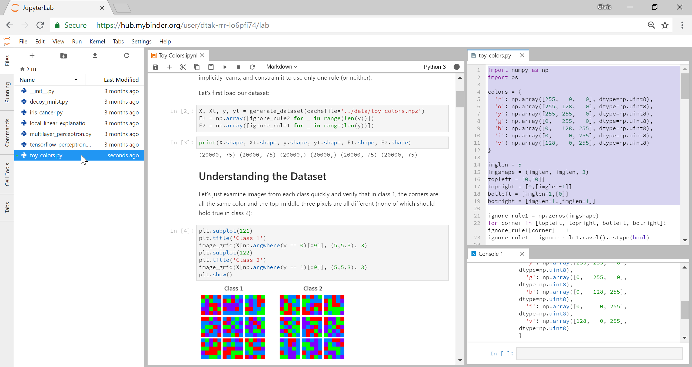
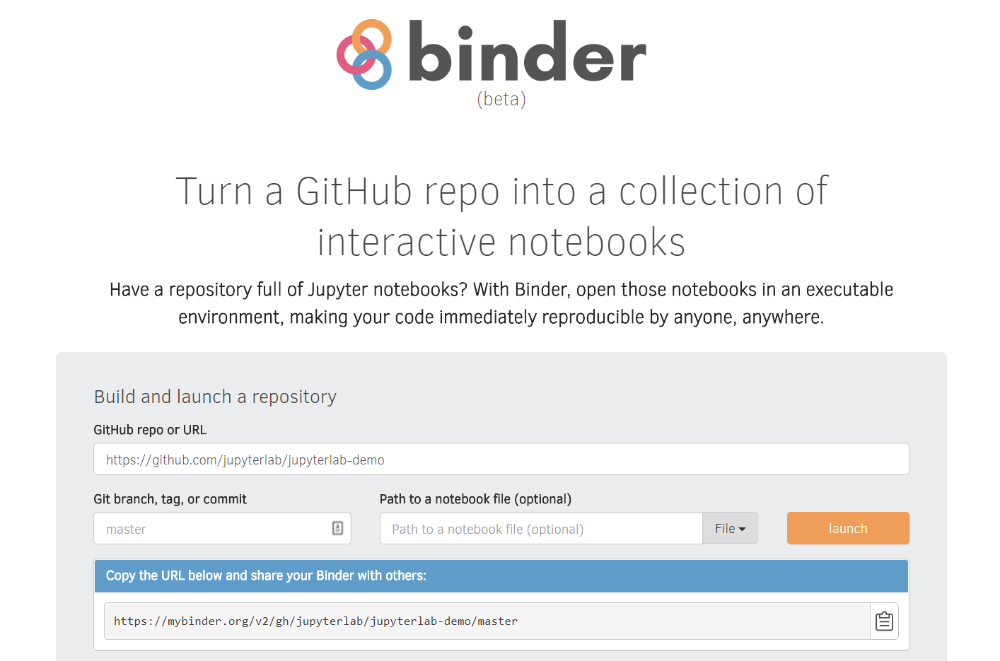
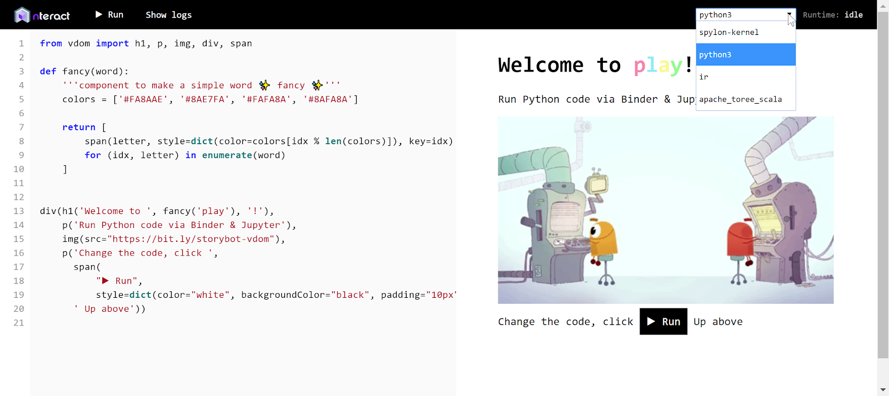
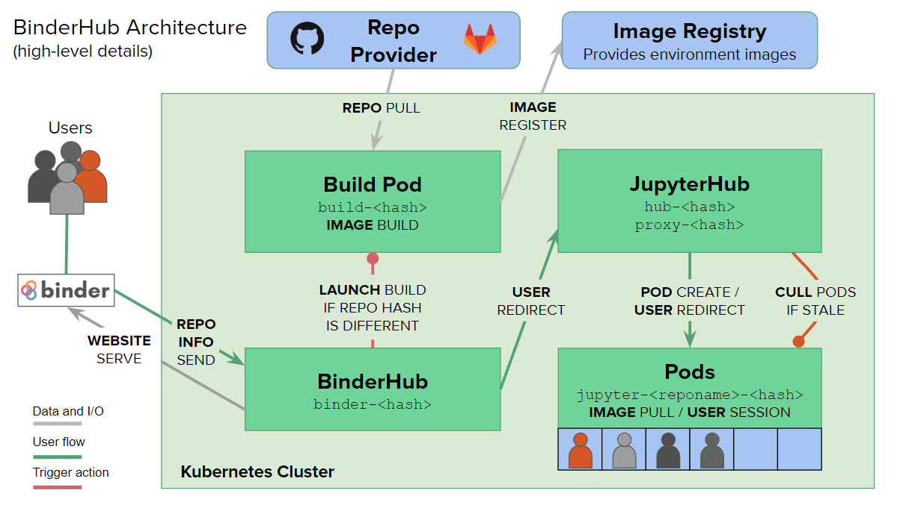

:author: Project Jupyter
:email:
:institution: Project Jupyter
:equal-contributor:

:author: Matthias Bussonnier
:email:
:institution:
:equal-contributor:

:author: Jessica Forde
:email:
:institution:
:equal-contributor:

:author: Tim Head
:email:
:institution:
:equal-contributor:

:author: Chris Holdgraf
:email: choldgraf@berkeley.edu
:institution: Berkeley Institute for Data Science, UC Berkeley
:corresponding:

:author: M Pacer
:email:
:institution:
:equal-contributor:

:author: Yuvi Panda
:email:
:institution:
:equal-contributor:

:author: Benjamin Regan Kelley
:email:
:institution:
:equal-contributor:

:author: Carol Willing
:email:
:institution:
:equal-contributor:

===================================================================================
Binder 2.0 - Reproducible, interactive, shareable environments for science at scale
===================================================================================

.. class:: abstract

   Binder is an open-source web service that lets users create sharable,
   interactive, reproducible environments in the cloud. It is powered by
   other core projects in the open-source ecosystem, including JupyterHub
   and Kubernetes for managing cloud resources. Binder works with pre-existing
   workflows in the analytics community, aiming to create interactive versions
   of repositories that exist on sites like GitHub with minimal extra effort
   needed. This paper details several of the design decisions and goals that
   went into the development of the current generation of Binder.

.. class:: keywords

   cloud computing, reproducibility, binder, mybinder.org, shared computing,
   accessibility, kubernetes, dev ops, jupyter, jupyter notebooks, github,
   publishing, interactivity

Binder is the first free, open-source, and massively publicly-available tool
for easily creating sharable, interactive, reproducible environments in the
cloud.

Core goals of the scientific community are making work reproducible and
enabling others to reproduce results. Both goals are difficult to achieve
and depend upon the software and technology available to researchers at any
moment in time. With the growth in open-source tools for data analysis, as
well as the “data heavy” approach many fields are adopting, these problems
become both more complex yet more achievable than ever before. Tools for
packaging analytics environments into “containers” that others can use to
re-create the computational environment needed to run analysis code, online
communities for sharing and discovering scientific results, and a myriad of
open-source tools are available for doing analytics in open and transparent
ways.

However, manual implementation of this process is very complex, and
reproducing the full stack of another person’s work is too labor intensive,
as well as error-prone, for day-to-day use. As a result, while reproducibility
is *technically* possible, it is not yet *practically* possible. This paper
introduces Binder 2.0, a tool that takes us one step closer towards workflows
that make computational work practical to share.

Binder consists of a set of tools for creating sharable, interactive, and
deterministic environments that run on personal computers and cloud resources.
It manages the technical complexity around:

* creating containers to capture a code repository and its technical environment;
* generating user sessions that run the environment defined in those containers; and
* providing links that users can share with others to allow them to interact
  with these environments.

Binder is built on modern-day tools from the open-source community, and is
itself fully open-source for others to use.

   Examining image data from Ross et al. on Binder with JupyterLab [Ross17]_.
   JupyterLab is one of the three user interfaces available to Binder users.
   In this example, we use JupyterLab to view additional image data in a code
   console. Note that this modification to the code can be made without requiring
   the user to install dependencies.

The first iteration of Binder was released in 2016, and provided a prototype
that managed reproducible user environments in the cloud. In the years since,
there have been several advances in technology for managing cloud resources,
serving interactive user environments, and creating reproducible containers for
analytics. Binder 2.0 utilizes these new tools, and is more scalable, maintainable,
is easier to deploy, and supports more analytic and scientific workflows than
before.

At the highest level, Binder is a particular combination of open-source
tools to achieve the goal of sharable, reproducible environments. This paper
lays out the technical vision of Binder 2.0, including the guiding principles
and goals behind each piece of technology it uses. It also discusses the guiding
principles behind the *new* open-source technology that the project has created.

Guiding Principles of Binder
----------------------------

Several high-level project goals drive the development of Binder 2.0. These are outlined below:

**Deployability**. Binder is driven by open-source technology, and the BinderHub
server should be deployable by a diverse representation of people in the scientific,
publishing, and data analytic communities. This often means that it must be
maintained by people without an extensive background in cloud management and
dev-ops skills. BinderHub (the underlying technology behind Binder) should thus
be deployable on a number of cloud frameworks, and with minimal technical skills
required.

**Maintainability**. Deploying a service on cloud resources is important but
happens less frequently than *maintaining* those cloud resources all day, every
day. Binder is designed to utilize modern-day tools in cloud orchestration and
monitoring. These tools minimize the time that individuals must spend ensuring
that the service performs as expected. Recognizing the importance of
maintainability, the Binder team continues to work hard to document effective
organizational and technical processes around running a production
BinderHub-powered service such as `mybinder.org`. The goal of the project is to
allow a BinderHub service to be run without specialized knowledge or extensive
training in cloud orchestration.

**Pluggability**. Binder’s goal is to make it easier to adopt and interact
with existing tools in the open-source ecosystem. As such, Binder is designed
to work with a number of open-source packages, languages, and user interfaces.
In this way, Binder acts as glue to bring together pieces of the open-source
community, and easily plugs into new developments in this space.

**Accessibility**. Binder should be as accessible as possible to members of
the open source, scientific, educational, and data science communities. By
leveraging pre-existing workflows in these communities rather than requiring
people to adopt new ones, Binder increases its adoption and user acceptance.
Input and feedback from members of those communities guide future development
of the technology. As a key goal, Binder should support pre-existing scientific
workflows, and improve them by adding shareability, reproducibility, and interactivity.

**Usability**. Finally, the Binder team wants simplicity and fast interaction to
be core components of the service. Minimizing the number of steps towards making
your work shareable via Binder provides an effective user experience.  Consumers
of shared work must be able to quickly begin using the Binder repository that
another person has put together. To achieve these goals,creating multiple ways
in which people can use Binder’s services is key. For example, easily sharing
a link to the full Binder interface and offering a public API endpoint to
request and interact with a kernel backed by an arbitrary environment increase
usability.

In the following sections, we describe the three major technical components of
the Binder project—JupyterHub, repo2docker, and BinderHub—and discuss how each
feeds into the principles we’ve outlined above.

Scalable interactive user sessions (JupyterHub on Kubernetes)
-------------------------------------------------------------
Binder runs as either a public or a private web service, and needs to handle
potentially large spikes in user sessions, as well as sustained user activity
over several minutes of time. It also needs to be deployable on a number of
cloud providers in order to avoid locking in the technology to the offerings
of a single cloud service.

JupyterHub, an open-source tool from the Jupyter community, provides a
centralized resource that serves interactive user sessions. It allows
definition of  a computational environment (e.g. a Docker image) that runs
the Jupyter notebook server. A core principle of the Jupyter project is to be
language- and workflow-agnostic, and JupyterHub is no exception. JupyterHub can
be used to run dozens of languages served with a variety of user interfaces,
including `Jupyter Notebooks <https://github.com/binder-examples/multi-language-demo>`_,
`Jupyter Lab <https://github.com/binder-examples/jupyterlab>`_,
`RStudio <https://github.com/binder-examples/r>`_, `Stencila <https://github.com/minrk/jupyter-dar>`_,
`OpenRefine <https://github.com/betatim/openrefineder/>`_, and
Pachyderm <TODO PACHYDERM LINK>.

.. figure:: images/rstudio_ui.png
   :align: center

   An RStudio interface being served on ``mybinder.org``. Because BinderHub
   uses a JupyterHub for hosting all user sessions, one can specify an
   environment that serves any user interface, provided that it can run
   via the browser.

Another key benefit of JupyterHub is that it is straightforward to run on
Kubernetes, a modern-day open-source platform for orchestrating computational
resources in the cloud. Kubernetes can be deployed on most major cloud providers,
self-hosted infrastructure (such as OpenStack deployments) or even on an
individual laptop or workstation. For example, Google Cloud Platform, Microsoft
Azure, and Amazon AWS each have managed Kubernetes clusters that run with minimal
user intervention. As such, it is straightforward to deploy JupyterHub on any
major cloud provider.

Kubernetes is designed to be relatively self-healing, and has a declarative
syntax for defining the cloud resources that are needed to run a web service.
As such, maintainers can update a JupyterHub running on Kubernetes with minimal
changes to configuration files for the deployment, providing the flexibility to
configure the JupyterHub as-needed, without requiring a lot of hands-on
intervention and tinkering.

Finally, because Kubernetes was initially designed to run Google’s web
services, it is both extremely scalable and battle-tested. A cloud orchestration
tool that can handle the usage patterns of a service like GMail can almost
certainly handle the analytics environments that are served with Binder. In
addition, by using Kubernetes, Binder (and JupyterHub) leverage the power of
its strong open-source community. As more companies, organizations, and
universities adopt and contribute to the tool, the Binder community will
benefit from these advances.

There are several use-cases of JupyterHub being used for shared, interactive
computing. For example, UC Berkeley hosts a "`Foundation in Data Science <http://data8.org>`_"
course that serves nearly 1,000 interactive student sessions simultaneously.
The Wikimedia foundation also uses `JupyterHub to facilitate users accessing
the Wikipedia dataset <http://paws.wmflabs.org>`_, allowing them to run bots and
automate the editing process with a Jupyter interface. Finally, organizations
such as the Open Humans Project provide a `JupyterHub for their community
<https://notebooks.openhumans.org>`_ to analyze, explore, and discover interesting
patterns in a shared dataset.

Deterministic environment building - Repo2Docker
------------------------------------------------

Docker is extremely flexible, and has been used throughout the scientific and
data science community for standardizing environments that are shareable with
other people. A Docker image contains nearly all of the pieces necessary to
re-run an analysis. This provides the right balance between flexibility (e.g.
a Docker image can contain basically any environment) and being lightweight to
deploy and store in the cloud. JupyterHub can serve an arbitrary environment to
users based off of a Docker image, but how is this image created in the first
place?

While it is possible (and common) to hand-craft a Docker image using a set of
instructions called a Dockerfile, this step requires a considerable amount of
knowledge about the Docker platform, making it a high barrier to the large
majority of scientists and data analysts. Binder’s goal is to operate with many
different workflows in data analytics, and requiring the use of a Dockerfile to
define an environment is too restrictive.

At the same time, the analytics community already makes heavy use of online code
repositories, often hosted on websites such as `GitHub <https://github.com/>`_
or `Bitbucket <https://bitbucket.org/>`_. These sites are home to tens of
thousands of repositories containing the computational work for research,
education, development, and general communication. Best-practices in development
already dictate storing the requirements needed (in text files such as ``environment.yml``)
along with the code itself (which often lives in document structures such as Jupyter
Notebooks or RMarkdown files). As a result, in many cases the repository already
contains all the information needed to build the required environment.

Binder’s solution to this is a lightweight tool called “repo2docker”. It is an
open-source command line tool that converts code repositories into a Docker
image suitable for running with JupyterHub. Repo2docker does the following things:

1. Is called with a single argument, a path to a git repository, and optionally
   a reference to a git branch, tag, or commit hash. The repository can either
   be online (such as on GitHub or GitLab) or local to the person’s computer.
2. Clones the repository, then checks out the reference that it has been passed
   (or defaults to “master”).
3. Looks for one or more “configuration” files that are used to define the
   environment needed to run the code inside the repository. These are generally
   files that *already exist* in the data science community. For example, if it
   finds a “requirements.txt” file, it assumes that the user wants a Python
   installation and installs everything inside the file. If it finds an “install.R”
   file, it assumes the user wants RStudio available, and pre-installs all the
   packages listed inside.
4. Constructs a Dockerfile that builds the environment specified by the =
   configuration files, and that is meant to be run via a Jupyter notebook server.
5. Builds an image from this Dockerfile, and then registers it online to a
   Docker repository of choice.

Repo2docker aims to be flexible in the analytics workflows it supports, and
minimizes the amount of effort needed to support a *new* workflow. A core
building block of repo2docker is the “Build Pack” - a class that defines all
of the operations needed to construct the environment needed for a particular
analytics workflow. These Build Packs have a ``detect`` method that returns True
when a particular configuration file is present (e.g. “requirements.txt” will
trigger the Python build pack). They also have method called ``get_assemble_scripts``
that inserts the necessary lines into a Dockerfile to support this workflow.

For example, below we show a simplified version of the Python build pack. In
this case, the ``detect`` method looks for a ``requirements.txt`` file and,
if it exists, triggers the ``get_assemble_scripts`` method, which inserts
lines into the Dockerfile that install Python and pip.

.. code-block:: python

   class PythonBuildPack(CondaBuildPack):
     """Setup Python for use with a repository."""

     def __init__(self):
       ...

     def get_assemble_scripts(self):
       """Return series of build-steps specific to this repository."""
       assemble_scripts = super().get_assemble_scripts()
       # KERNEL_PYTHON_PREFIX is the env with the kernel,
       # whether it's distinct from the notebook or the same.
       pip = '${KERNEL_PYTHON_PREFIX}/bin/pip'

       # install requirements.txt in the kernel env
       requirements_file = self.binder_path('requirements.txt')
       if os.path.exists(requirements_file):
           assemble_scripts.append((
               '${NB_USER}',
               '{} install --no-cache-dir -r "{}"'.format(pip, requirements_file)
           ))
       return assemble_scripts

     def detect(self):
       """Check if current repo should be built with the Python buildpack."""
       requirements_txt = self.binder_path('requirements.txt')
       return os.path.exists(requirements_txt)

Repo2docker also supports more generic configuration files that are applied
regardless of the particular Build Pack that is detected. For example, a file
called “postBuild” will be run from the shell _after_ all dependencies are
installed. This is often used to pre-compile code or download datasets from the web.

Finally, in the event that a particular setup is not natively supported,
repo2docker will also build a Docker image from a plain ``Dockerfile``.
This means users are never blocked by the design of repo2docker.

By modularizing the environment generation process in this fashion, it is
possible to mix and match environments that are present in the final image.
Repo2docker’s goal is to allow for a fully composable analytics environment.
If a researcher requires Python 2, 3, RStudio, and Julia, simultaneously for
their work, repo2docker should enable this.

   The BinderHub user interface. Users input a link to a public git
   repository. Binder will check out this repository and build the environment
   needed to run the code inside. It then provides you a link that can be shared
   with others so that they may run an interactive session that runs the
   repository’s code.

In addition, by capturing pre-existing workflows rather than requiring data
analysts to adopt new ones, there is a minimal energy barrier towards using
repo2docker to deterministically build images that run a code repository. For
example, if the following ``requirements.txt`` file is present in a repository,
repo2docker will build an image with Python 3 and the packages pip-installed.

.. code-block:: bash

   /requirements.txt
      numpy
      scipy
      matplotlib

While the following file name/content will install RStudio with these
R commands run before building the Docker image.:

.. code-block:: bash

   binder/install.R
       install.packages("ggplot2")

   binder/runtime.txt
       r-2017-10-24

In this case, the date specified in ``runtime.txt`` instructs repo2docker to
use a specific `MRAN repository <https://mran.microsoft.com/>`_ date. In addition,
note that these files exist in a folder called ``binder/`` (relative to the
repository root). If repo2docker discovers a folder of this name, it will build
the environment from the contents of this folder, ignoring any “configuration files”
that are present in the project’s root. This allows users to dissociate the
configuration files used to build the package from those used to share a Binder
link.

By facilitating the process by which researchers create these reproducible images,
repo2docker addresses the “works for me” problem that is common when sharing code.
There are no longer breaking differences in the environment of two users if
they’re running code from the same image generated by repo2docker. Additionally,
researchers can use repo2docker to confirm that all of the information needed to
recreate their analysis is contained within their configuration files, creating
a way to intuitively define “recipes” for reproducing one’s work.

A web-interface to user-defined kernels and interactive sessions (BinderHub)
----------------------------------------------------------------------------

JupyterHub can serve multiple interactive user sessions from pre-defined Docker
images in the cloud. Repo2docker generates Docker images from the files in a git
repository. BinderHub is the glue that binds these two open-source tools together.
It uses the building functionality of repo2docker, the kernel and user-session
hosting of JupyterHub, and a Docker registry that connects these two processes
together. BinderHub defines two primary patterns of interaction with this process:
sharable, interactive, GUI-based sessions; and a REST API for building, requesting,
and interacting with user-defined kernels.

   `play.nteract.io <play.nteract.io>`_ is a GUI frontend that connects to the
   ``mybinder.org`` REST API. When a user opens the page, it requests a Kernel
   from mybinder.org according to the environment chosen in the top-right menu.
   Once mybinder.org responds that it is ready, users can execute code that
   will be sent to their Binder kernel, with results displayed to the right.

The primary pattern of interaction with BinderHub for an author is via its “build
form” user interface. This form lets users point BinderHub to a public git
repository. When the form is filled in and the “launch” button is clicked,
BinderHub takes the following actions:

1. Check out the repository at the version that is specified.
2. Compare the version specified in the URL with the versions that have been
   built for this repository in the registry (if a branch is given, BinderHub
   checks the latest commit hash)
3. If the version has *not* been built, launch a repo2docker process that builds
   and registers an image from the repository, then returns a reference to the
   registered image.
4. Create a temporary JupyterHub user account for the visitor, with a private token.
5. Launch an interactive JupyterHub user session that sources the repo2docker
   image in the registry. This session will serve the environment needed to run
   the repository, along with any GUI that the user specifies.
6. Once the user departs, destroy the temporary user ID as well as any remnants
   of their interactive session.

Once a repository has been built with BinderHub, authors can then share a URL
that triggers this process. URLs for BinderHub take the following form:

.. code-block:: bash

   <bhub-url>/v2/<repoprovider>/<org>/<reponame>/<ref>

For example, here is the URL for the ``binder-examples`` repository
that builds a Julia environment:

.. code-block:: bash

   https://mybinder.org/v2/gh/binder-examples/julia-python/master

When a user clicks on this link, they’ll be taken to a brief loading page
as a user session that serves this repository is created. Once this process
is finished, they can immediately start interacting with the environment that
the author has created.

While GUIs are preferable for most human interaction with a BinderHub,
there are also moments when a programmatic or text-based interaction is
preferable. For example, if someone wishes to use BinderHub to request arbitrary
kernels that power computations underlying a completely different GUI. For
these use-cases, BinderHub also provides a REST API that controls all of the
steps described above.

XXX TODO IF WE HAVE SPACE

There are already several examples of services that use BinderHub’s REST API
to run webpages and applications that utilize arbitrary kernel execution. For
example, ``thebelab`` makes it possible to deploy static websites with code blocks
that are powered by a BinderHub kernel. The author can define the environment
needed to run code on the static page, and interactive code output can be
generated by the user once they visit the webpage. There are also several
applications that use BinderHub’s kernel API to power their computation. For
example, the `nteract <https://play.nteract.io>`_ project uses BinderHub to
run an interactive code sandbox that serves an nteract interface and can be
powered by arbitrary kernels served by BinderHub.

BinderHub is permissively-licensed and intentionally modular in order to
serve  as many use-cases as possible. Our goal is to provide the tools to
allow any person or organization to provide arbitrary, user-defined kernels
that run in the cloud. The Binder team runs one-such service as a proof-of-concept
of the technology, as well as a public service that can be used to share
interactive code repositories. This service runs at the URL ``https://mybinder.org``,
and will be discussed in the final section.

   The BinderHub architecture for interactive GUI sessions. Users
   connect to the Binder UI via a public URL. All computational infrastructure
   is managed with a Kubernetes deployment (light green) managing several pods
   (dark green) that make up the BinderHub service. Interactive user pods
   (blue squares) are spawned and managed by a JupyterHub.

Mybinder.org
------------

You can access a public deployment of BinderHub at ``mybinder.org``.
This a web service that the Binder and JupyterHub team run both as a
demonstration of the BinderHub technology, as well as a free public service
for those who wish to share Binder links so that others may interact with
their code repositories. ``mybinder.org`` runs on Kubernetes, allowing it
to plug into a variety of other open-source tools for managing cloud
infrastructure.

The Binder team (and thus mybinder.org) runs on a model of transparency and
openness in the tools it creates as well as the operations of mybinder.org.
The Binder team has put together several group process and documentation to
facilitate maintaining this public service, and to provide a set of resources
for others who wish to do the same. There are also several data streams that
the Binder team routinely makes available for others who are interested in
deploying and maintaining a BinderHub service. For example, the `Binder Billing
<https://github.com/jupyterhub/binder-billing>`_ repository shows all of the cloud
hardware costs for the last several months of mybinder.org operation. In addition,
the `Binder Grafana board <https://grafana.mybinder.org>`_ shows a high-level
view of the status of the BinderHub, JupyterHub, and Kubernetes processes
underlying the service.

``mybinder.org`` is also meant to be a testing ground for different use-cases
in the Binder ecosystem. By running as a free, public service, we hope that
members of the community will find new and interesting applications for Binder.
For example, ``mybinder.org`` has already been used for `reproducible publishing
<https://github.com/minrk/ligo-binder>`_, sharing `interactive course materials
<https://www.inferentialthinking.com/chapters/01/3/plotting-the-classics.html>`_
at the university and high-school level, creating `interactive package documentation
in Python <https://sphinx-gallery.readthedocs.io/en/latest/advanced_configuration.html#binder-links>`_
with Sphinx Gallery, and sharing `interactive content <http://greenteapress.com/wp/think-dsp/>`_
that requires a language-specific kernel in order to run.

Mybinder.org is currently funded through a grant from the Moore foundation, and
the team is actively exploring new models for keeping the service running sustainably.
The public service currently restricts the hardware available to users in several
ways in order to keep costs down. For example, users are only given access to one
CPU, two gigabytes of RAM, can only access public git repositories, and are
restricted in the kinds of network I/O that can take place. The Binder team hopes
that other organizations, companies, or universities will deploy their own
BinderHubs for their own users, potentially powered by more complex hardware
or more permissive environments.

The future of binder
--------------------

This paper outlines the technical infrastructure underlying ``mybinder.org`` and
the BinderHub open-source technology, including the guiding design principles
and goals of the project. Binder is designed to be modular, to adapt itself to
pre-existing tools and workflows in the open-source community, and to be
transparent in its development and operations.

Each of the tools described above is open-source and permissively-licensed, and
we welcome the contributions and input from others in the open-source community.
In particular, we are excited to pursue Binder’s development in the following
scenarios:

1. **Reproducible publishing**. One of the core benefits of BinderHub is that
   it can generate deterministic environments that are linked to a code repository
   stored in a long term archive like Zenodo. This makes it useful for generating
   static representations of the environment needed to reproduce a scientific result.
   Binder has already been used alongside scientific publications <TODO CITATION>
   to provide an interactive and reproducible document with minimal added effort.
   In the future, the Binder project hopes to partner with academic publishers
   and professional societies to incorporate these reproducible environments into
   the publishing workflow.
2. **Education and interactive materials**. Binder’s goal is to lower the barrier
   to interactivity, and to allow users to utilize code that is hosted in repository
   providers such as GitHub. Because Binder runs as a free and public service,
   it could be used in conjunction with academic programs to provide interactivity
   when teaching programming and computational material. For example, the Foundations
   in Data Science course at UC Berkeley already utilizes mybinder.org to provide
   free interactive environments for its open-source textbook. The Binder team hopes
   to find new educational uses for the technology moving forward.
3. **Access to complex cloud infrastructure**. While mybinder.org provides users
   with restricted hardware for cost-savings purposes, a BinderHub can be deployed
   on any cloud hardware that is desired. This opens the door for using BinderHub
   as a shared, interactive sandbox that provides access to an otherwise inaccessible
   dataset or computational resource. For example, the GESIS Institute for Social
   Sciences provides a `JupyterHub and BinderHub <https://notebooks.gesis.org/>`_
   for their users at the university. The Binder team hopes to find new cases where
   BinderHub can be used as an entrypoint to provide individuals access to more
   sophisticated resources in the cloud <TODO DESCRIBE A VISION FOR HOW PEOPLE
   USE BINDER>.

Binder is the first free, open-source, and massively publicly-available tool for
easily creating sharable, interactive, reproducible environments in the cloud.
The Binder team is excited to see the Binder community continue to evolve and
utilize BinderHub for new uses in reproducibility and interactive computing.

References
----------

.. [Ross17] Ross AS, Hughes MC, Doshi-Velez F. Right for the Right
            Reasons: Training Differentiable Models by Constraining
            their Explanations. Proceedings of the Twenty-Sixth
            International Joint Conference on Artificial Intelligence.
            2017. p. Pages 2662–2670.
            http://paperpile.com/b/FMgQkX/7HDA9
