:author: Willy Menacho
:email: wmenachon2@fcpn.edu.bo
:institution: Instituto de Investigaciones Físicas.
:institution: Carrera de Física, Universidad Mayor de San Andrés. Campus Universitario Cota Cota. La Paz, Bolivia

:author: Gonzalo Marcelo Ramírez-Ávila
:email: mramirez@fcpn.edu.bo
:institution: Instituto de Investigaciones Físicas.
:institution: Carrera de Física, Universidad Mayor de San Andrés. Campus Universitario Cota Cota. La Paz, Bolivia

:author: Horacio V. Guzman
:email: horacio.guzman@ijs.si
:institution: Department of Theoretical Physics
:institution: Jožef Stefan Institute, Jamova 39, 1000 Ljubljana, Slovenia
:institution: Instituto de Investigaciones Físicas.
:institution: Carrera de Física, Universidad Mayor de San Andrés. Campus Universitario Cota Cota. La Paz, Bolivia
:orcid: 0000-0003-2564-3005
:corresponding:

:bibliography: references

========================================================================================================================
pyDAMPF: a Python package for modeling mechanical properties of hygroscopic materials under interaction with a nanoprobe
========================================================================================================================

.. class:: abstract

   pyDAMPF is a tool oriented to the Atomic Force Microscopy (AFM) community, which allows the simulation of the physical properties of materials under variable relative humidity (RH). In particular, pyDAMPF is mainly focused on the mechanical properties of polymeric hygroscopic nanofibers that play an essential role in designing tissue scaffolds for implants and filtering devices. Those mechanical properties have been mostly studied from a very coarse perspective reaching a micrometer scale. However, at the nanoscale, the mechanical response of polymeric fibers becomes cumbersome due to both experimental and theoretical limitations. For example, the response of polymeric fibers to RH demands advanced models that consider sub-nanometric changes in the local structure of each single polymer chain. From an experimental viewpoint, choosing the optimal cantilevers to scan the fibers under variable RH is not trivial.

   In this article, we show how to use pyDAMPF to choose one optimal nanoprobe for planned experiments with a hygroscopic polymer. Along these lines, We show how to evaluate common and non-trivial operational parameters from an AFM cantilever of different manufacturers. Our results show in a stepwise approach the most relevant parameters to compare the cantilevers based on a non-invasive criterion of measurements. The computing engine is written in Fortran, and wrapped into Python. This aims to reuse physics code without losing interoperability with high-level packages. We have also introduced an in-house and transparent method for allowing multi-thread computations to the users of the pyDAMPF code, which we benchmarked for various computing architectures (PC, Google Colab and an HPC facility) and results in very favorable speed-up compared to former AFM simulators.

.. class:: keywords

   Materials science, Nanomechanical properties, AFM, f2py, multi-threading CPUs, numerical simulations, polymers

Introduction and Motivation
===========================

This article provides an overview of pyDAMPF, which is a BSD licensed, Python and Fortran modeling tool that enables AFM users to simulate the interaction between a probe (cantilever) and materials at the nanoscale under diverse environments. The code is packaged in a bundle and hosted on GitHub at (https://github.com/govarguz/pyDAMPF).

Despite the recent open-source availability of dynamic AFM simulation packages :cite:`dForce,Veda`, a broad usage for the assessment and planning of experiments has yet to come. One of the problems is that it is often hard to simulate several operational parameters at once. For example, most scientists evaluate different AFM cantilevers before starting new experiments. A typical evaluation criterion is the maximum exerted force that prevents invasivity of the nanoprobe into the sample. The variety of AFM cantilevers depends on the geometrical and material characteristics used for its fabrication. Moreover, manufacturers’ nanofabrication techniques may change from time to time, according to the necessities of the experiments, like sharper tips and/or higher oscillation frequencies. From a simulation perspective, evaluating observables for reaching optimal results on upcoming experiments is nowadays possible for *tens* or *hundreds* of cantilevers. On top of other operational parameters in the case of dynamic AFM like the oscillation amplitude :math:`A_0`, set-point :math:`A_{sp}`, among other materials expected properties that may feed simulations and create simulations batches of easily *thousands* of cases. Given this context, we focus this article on choosing a cantilever out of an initial pyDAMPF database of 30. In fact, many of them are similar in terms of spring constant :math:`k_c`, cantilever volume :math:`V_c` and also Tip’s radius :math:`R_T`. Then we focus on seven archetypical and distinct cases/cantilevers to understand the characteristics of each of the parameters specified in the manufacturers’ datasheets, by evaluating the maximum (peak) forces.

We present four scenarios comparing a total of seven cantilevers and the same sample, where we use as a test-case Poly-Vinyl Acetate (PVA) fiber. The first scenario (Figure :ref:`fig1a`) illustrates the difference between air and a moist environment. On the second one, a cantilever, only very soft and stiff cantilever spring constants are compared (see Figure :ref:fig1b`). At the same time, the different volumes along the 30 cantilevers are depicted in Figure :ref:`fig1c`. A final and mostly very common comparison is scenario 4, by comparing one of the most sensitive parameters to the force of the tip’s radii (see Figure :ref:`fig1d`).

The quantitative analysis for these four scenarios is presented and also the advantages of computing several simulation cases at once with our in-house development. Such a comparison is performed under the most common computers used in science, namely, personal computers (PC), cloud (Colab) and supercomputing (small Xeon based cluster). We reach a Speed-up of :math:`~` 20 over the former implementation :cite:`dForce`.

Another novelty of pyDAMPF is the detailed :cite:`Sader` calculation of the environmental-related parameters, like the quality factor :math:`Q`.

Here, we summarize the main features of pyDAMPF are:

- Highly efficient structure in terms of time-to-result, at least one order of magnitude faster than existing approaches.

- Easy to use for scientists without a computing background, in particular in the use of multi-threads.

- It supports the addition of further AFM cantilevers and parameters into the code database.

- Allows an interactive analysis, including a graphical and table-based comparison of results through Jupyter Notebooks.

The results presented in this article are available as `Google Colaboratory notebook <https://colab.research.google.com/drive/1ZM_aQsuYWUD2gnhcIhngpypJ6m1MbFxE?usp=sharing>`__, which facilitates to explore pyDAMPF and these examples.

Methods
=======

Processing inputs
-----------------

pyDAMPF counts with an initial database of 30 cantilevers, which can be extended at any time by accessing to the file *cantilevers_data.txt* then, the program inputs_processor.py reads the cantilever database and asks for further physical and operational variables, required to start the simulations. This will generate *tempall.txt*, which contains all cases *e.g.* 30 to be simulated with pyDAMPF

.. code-block:: python

    def inputs_processor(variables,data):
	a,b = np.shape(data)
	final = gran_permutador( variables, data)
	f_name = ' tempall.txt'
	np.savetxt(f_name,final)
	directory = os.getcwd()
	shutil.copy(directory+'/tempall.txt',directory+'
		/EXECUTE_pyDAMPF/')
	shutil.copy(directory+'/tempall.txt',directory+'
		/EXECUTE_pyDAMPF/pyDAMPF_BASE/nrun/')

The variables inside the argument of the function *inputs_processor* are interactively requested from a shell command line. Then the file *tempall.txt* is generated and copied to the folders that will contain the simulations.

Execute pyDAMPF
---------------

For execution in a single or multi-thread way, we require first to wrap our numeric core from Fortran to Python by using f2py :cite:`f2py`. Namely, the file *pyDAMPF.f90* within the folder *EXECUTE_pyDAMPF*.

Compilation with f2py
~~~~~~~~~~~~~~~~~~~~~

This step is only required once and depends on the computer architecture the code for this reads::

  f2py -c --fcompiler=gnu95 pyDAMPF.f90 -m mypyDAMPF

This command-line generates mypyDAMPF.so, which will be automatically located in the simulation folders.

Once we have obtained the numerical code as Python modules, we need to choose the execution mode, which can be serial or parallel. Whereby parallel refers to multi-threading capabilities only within this first version of the code.

Serial method
~~~~~~~~~~~~~

This method is completely transparent to the user and will execute all the simulation cases found in the file *tempall.txt* by running the script *inputs_processor.py*. Our in-house development creates an individual folder for each simulation case, which can be executed in one thread.

.. code-block:: python

    def serial_method(tcases, factor, tempall):
        lst = gen_limites(tcases, factor)
	change_dir()
	for i in range(1,factor+1):
		direc = os.getcwd()
		direc2 = direc+'/pyDAMPF_BASE/'
		direc3 = direc+'/SERIALBASIC_0/'+str(i)+'/'
		shutil.copytree ( direc2,direc3)
	os.chdir ( direc+'/SERIALBASIC_0/1/nrun/')
	exec(open('generate_cases.py').read())

As arguments, the serial method requires the total number of simulation cases obtained from *tempall.txt*. In contrast, the *factor* parameter has, in this case,a default value of 1.

Parallel method
~~~~~~~~~~~~~~~

The parallel method uses more than one computational thread. It is similar to the serial method; however, this method distributes the total load along the available threads and executes in a parallel-fashion. This method comprises two parts: first, a function that takes care of the bookkeeping of cases and folders:

.. code-block:: python

    def Parallel_method(tcases, factor, tempall):
	lst = gen_limites(tcases, factor)
	change_dir()
	for i in range(1,factor+1):
	    lim_inferior=lst[i-1][0]
	    lim_superior=lst[i-1][1]
	    direc =os.getcwd()
	    direc2 =direc+'/pyDAMPF_BASE/'
	    direc3 =direc+'/SERIALBASIC_0/'+str(i)+'/'
	    shutil.copytree ( direc2,direc3)
	    factorantiguo = ' factor=1'
	    factornuevo='factor='+str(factor)
	    rangoantiguo = '( 0,paraleliz)'
	    rangonuevo='('+str(lim_inferior)+','
	    		+str(lim_superior)+')'
	    os.chdir(direc+'/PARALLELBASIC_0/'+str(i))
	    pyname =' nrun/generate_cases.py'
	    newpath=direc+'/PARALLELBASIC_0/'+str(i)+'/'
	    		+pyname
	    reemplazo(newpath,factorantiguo,factornuevo)
	    reemplazo(newpath,rangoantiguo,rangonuevo)
	    os.chdir(direc)

This part generates serial-like folders for each thread’s number of cases to be executed.

The second part of the parallel method will execute pyDAMPF, which contains at the same time two scripts. One for executing pyDAMPF in a common *UNIX* based desktop or laptop. While the second is a python script that generated *SLURM* code to launch jobs in HPC facilities.

- Execution with *SLURM*

It runs pyDAMPF in different threads under the *SLURM* queuing system.

.. code-block:: python

    def cluster(factor):
        for i in range(1,factor+1):
	    with open('jobpyDAMPF'+str(i)+'.x','w') 
	    		as ssf :
	        ssf.write('#/bin/bashl|n ')
		ssf.write('#SBATCH--time=23:00:00
	\n')
		ssf.write('#SBATCH--constraint=
	epyc3\n')
		ssf.write('\n')
		ssf.write('ml Anaconda3/2019.10\n')
		ssf.write('\n')
		ssf.write('ml foss/2018a\n')
		ssf.write('\n')
		ssf.write('cd/home/$<USER>/pyDAMPF/
	EXECUTE_pyDAMPF/PARALLELBASIC_0/'+str(i)+'/nrun
	\n')
		ssf.write('\n')
		ssf.write('echo$pwd\n')
		ssf.write('\n')
		ssf.write('python3 generate_cases.py
	\n')
		ssf.close();
	    os.system(sbatch jobpyDAMPF)'+str(i)+'
	.x;')
	    os.system(rm jobpyDAMPF)'+str(i)+'.x;')

The above script generates *SLURM* jobs for a chosen set of threads; after launched, those jobs files are erased in order to improve bookkeeping.

- Parallel execution with *UNIX* based Laptops or Desktops

Usually, microscopes (AFM) computers have no SLURM pre-installed; for such a configuration, we run the following script:

.. code-block:: python

    def compute(factor):
	direc = os.getcwd()
	for i in range(1,factor+1):
	    os.chdir(direc+'/PARALLELBASIC_0/'+
	    		str(i)+'/nrun')
	    os.system('python3 generate_cases.py
	    		&')
	    os.chdir(direc)

This function allows the proper execution of the parallel case without a queuing system and where a slight delay might appear from thread to thread execution.

Analysis
--------

Graphically
~~~~~~~~~~~

-  With static graphics, as shown in Figures :ref:`fig2a`, :ref:`fig3a`, :ref:`fig4a` and :ref:`fig5`.

::

         python3 Graphical_analysis.py

-  With interactive graphics, as shown in Figure :ref:`fig6a`.

::

         pip install plotly

::

         jupyter notebook Graphical_analysis.ipynb

Quantitatively
~~~~~~~~~~~~~~

-  With static data table:

::

         python3 Quantitative_analysis.py

-  With interactive tables

   *Quantitative_analysis.ipynb* uses a minimalistic dashboard application for tabular data visualization `tabloo <https://github.com/bluenote10/tabloo>`__ with easy installation.:

::

         pip install tabloo

::

         jupyter notebook Quantitative_analysis.ipynb

Results and discussions
=======================

In Figure :ref:`fig1a`, we show four scenarios to be tackled in this test-case for pyDAMPF. As described in the introduction, the first scenario (Figure :ref:`fig1a`), compares between air and moist environment, the second tackles soft and stiff cantilevers(see Figure :ref:`fig1b`), next is Figure Figure :ref:`fig1c`, with the cantilever volume comparison and the force the tip’s radio (see Figure :ref:`fig1d`). Further details of the cantilevers depicted here are included in Table :ref:`tab1`.

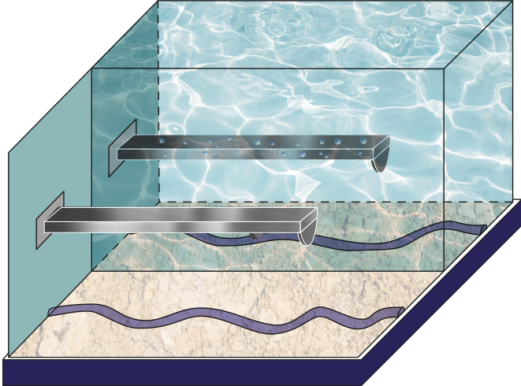

    Schematic of the tip-sample interface comparing air at a given Relative Humidity with air. :label:`fig1a`

.. figure:: casob.png

    Schematic of the tip-sample interface comparing a hard (stiff) cantilever with a soft cantilever. :label:`fig1b`

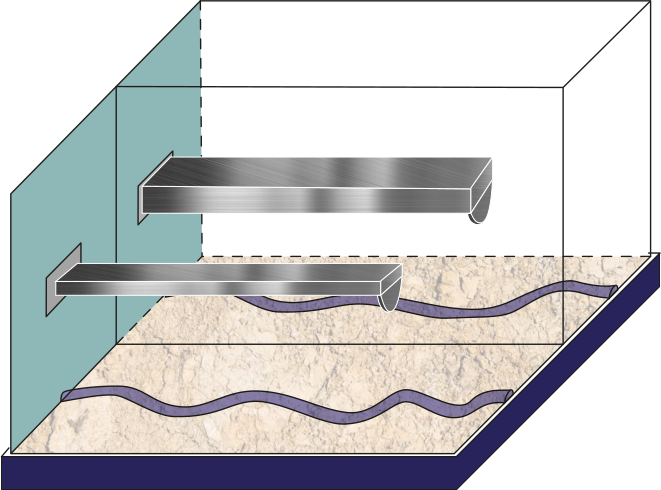

    Schematic of the tip-sample interface comparing a cantilever with a high volume compared with a cantilever with a small volume. :label:`fig1c`

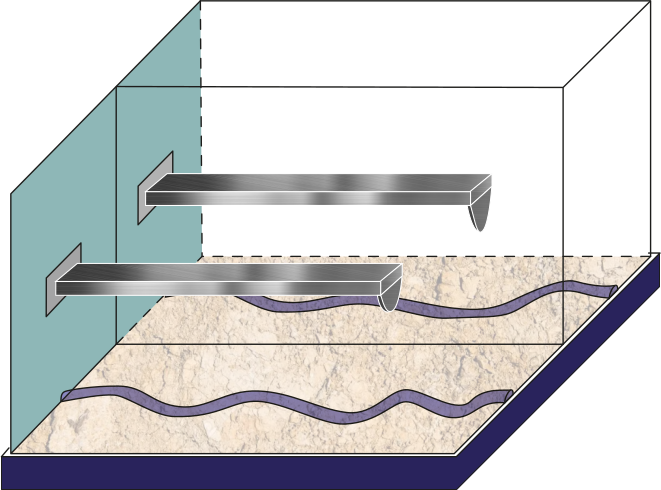

    Schematic of the tip-sample interface comparing a cantilever with a wide tip with a cantilever with a sharp tip. :label:`fig1d`

The AFM is widely used for mechanical properties mapping of matter :cite:`GarciaRev2021`. Hence, the first comparison of the four scenarios points out to the force response versus time according to a Hertzian interaction :cite:`GuzmanScalingBJON2015`. In Figure :ref:`fig2a`, we see the humid air (RH = 60.1%) changes the measurement conditions by almost 10%. Using a stiffer cantilever (:math:`k_c=2.7 [N/m]`) will also increase the force by almost 50% from the softer one (:math:`k_c=0.8 [N/m]`), see Figure :ref:`fig2b`. Interestingly, the cantilever’s volume, a smaller cantilever, results in the highest force by almost doubling the force by almost five folds of the smallest volume (Figure :ref:`fig2c`). Finally, the Tip radius difference between 8 and 20 nm will impact the force in roughly 40 pN (Figure :ref:`fig2d`).

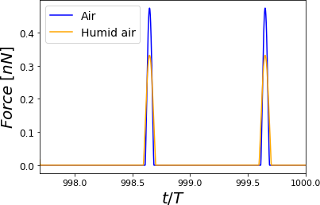

    Time-varying force for PVA at RH = 60.1% for different cantilevers. The simulations show elastic (Hertz) responses. For each curve, the maximum force value is the peak force. Two complete oscillations are shown corresponding to air at a given Relative Humidity with air. The simulations were performed for :math:`A_{sp}/A_{0}` = 0.8 . :label:`fig2a`

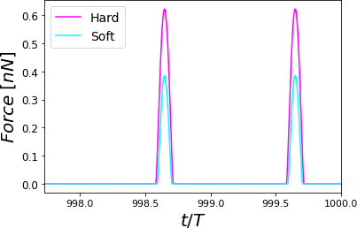

    Time-varying force for PVA at RH = 60.1% for different cantilevers. The simulations show elastic (Hertz) responses. For each curve, the maximum force value is the peak force. Two complete oscillations are shown corresponding to a hard (stiff) cantilever with a soft cantilever. The simulations were performed for :math:`A_{sp}/A_{0}` = 0.8 . :label:`fig2b`

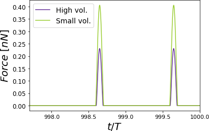

    Time-varying force for PVA at RH = 60.1% for different cantilevers. The simulations show elastic (Hertz) responses. For each curve, the maximum force value is the peak force. Two complete oscillations are shown corresponding to a cantilever with a high volume compared with a cantilever with a small volume. The simulations were performed for :math:`A_{sp}/A_{0}` = 0.8 . :label:`fig2c`

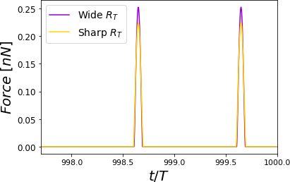

    Time-varying force for PVA at RH = 60.1% for different cantilevers. The simulations show elastic (Hertz) responses. For each curve, the maximum force value is the peak force. Two complete oscillations are shown corresponding to a cantilever with a wide tip with a cantilever with a sharp tip. The simulations were performed for :math:`A_{sp}/A_{0}` = 0.8 . :label:`fig2d`

Now, if we consider literature values for different RH :cite:`Modul1, Modul2`, we can evaluate the Peak or Maximum Forces. This force in all cases depicted in Figure :ref:`fig3a` shows a monotonically increasing behavior with the higher Young modulus. Remarkably, the force varies in a range of 25% from dried PVA to one at RH = 60.1% (see Figure :ref:`fig3a`).

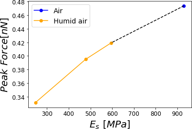

    Peak force reached for a PVA sample subjected to different relative humidities 0.0%, 29.5%, 39.9% and 60.1% corresponding to air at a given Relative Humidity with air. The simulations were performed for :math:`A_{sp}/A_{0}` = 0.8 . :label:`fig3a`

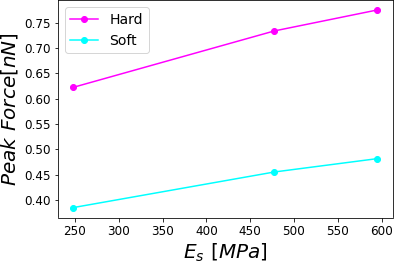

    Peak force reached for a PVA sample subjected to different relative humidities 0.0%, 29.5%, 39.9% and 60.1% corresponding to a hard (stiff) cantilever with a soft cantilever. The simulations were performed for :math:`A_{sp}/A_{0}` = 0.8 . :label:`fig3b`

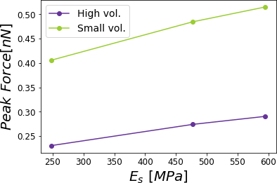

    Peak force reached for a PVA sample subjected to different relative humidities 0.0%, 29.5%, 39.9% and 60.1% corresponding to a cantilever with a high volume compared with a cantilever with a small volume. The simulations were performed for :math:`A_{sp}/A_{0}` = 0.8 . :label:`fig3c`

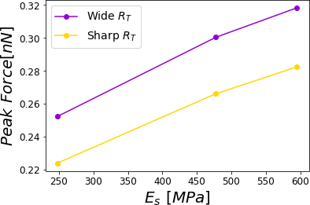

    Peak force reached for a PVA sample subjected to different relative humidities 0.0%, 29.5%, 39.9% and 60.1% corresponding to a cantilever with a wide tip with a cantilever with a sharp tip. The simulations were performed for :math:`A_{sp}/A_{0}` = 0.8 . :label:`fig3d`

In order to properly describe operational parameters in dynamic AFM we analyze the peak force dependence with the set-point amplitude :math:`A_{sp}`. In Figure :ref:`fig4a`, we have the comparison of peak forces for the different cantilevers as a function of :math:`A_{sp}`. The sensitivity of the peak force is higher for the type of cantilevers with varying :math:`k_c` and :math:`V_c`. Nonetheless, the peak force dependence given by the Hertzian mechanics has a dependence with the square root of the tip radius, and for those Radii on Table :ref:`tab1` are not influencing the force much. However, they could strongly influence resolution :cite:`GuzmanScalingBJON2013`.

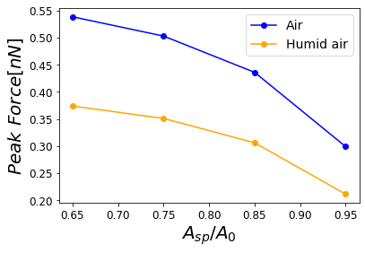

    Dependence of the maximum force on the set-point amplitude corresponding to air at a given Relative Humidity with air. :label:`fig4a`

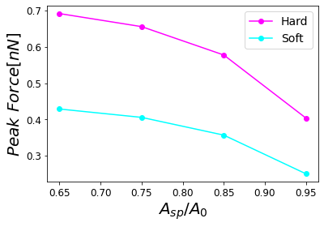

    Dependence of the maximum force on the set-point amplitude corresponding to a hard (stiff) cantilever with a soft cantilever. :label:`fig4b`

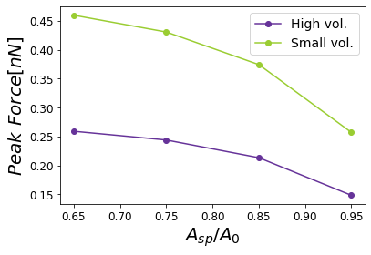

    Dependence of the maximum force on the set-point amplitude corresponding to a cantilever with a high volume compared with a cantilever with a small volume. :label:`fig4c`

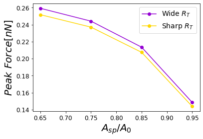

    Dependence of the maximum force on the set-point amplitude corresponding to a cantilever with a wide tip with a cantilever with a sharp tip. :label:`fig4d`

Figure :ref:`fig5` shows the dependence of the peak force as a function of :math:`k_c`, :math:`V_c`, and :math:`R_T`, respectively, for all the cantilevers listed in Table :ref:`tab1`; constituting a graphical summary of the seven analyzed cantilevers for completeness of the analysis.

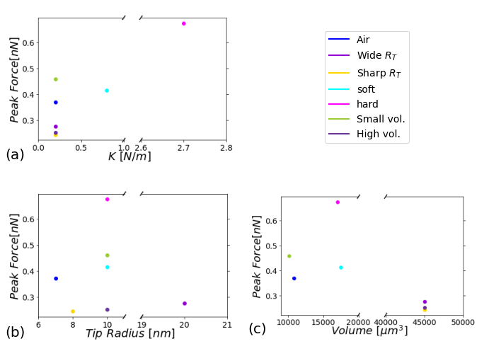

    Dependence of the maximum force with the most important characteristics of each cantilever, filtering the cantilevers used for the scenarios , the figure shows maximum force dependent on the: (a)  force constant k, (b)  cantilever tip radius, and (c) cantilever volume, respectively. The simulations were performed for $A_{sp}/A_{0}$ = 0.8. :label:`fig5`

Another way to summarize the results in AFM simulations if to show the Force vs. Distance curves (see Fig. :ref:`fig6a`), which in these case show exactly how for example a stiffer cantilever may penetrate more into the sample by simple checking the distance cantilever *e* reaches. On the other hand, it also jumps into the eyes that a cantilever with small volume *f* has less damping from the environment and thus it also indents more than the ones with higher volume. Although these type of plots are the easiest to make, they carry lots of experimental information. In addition, pyDAMPF can plot such 3D figures interactively that enables a detailed comparison of those curves.

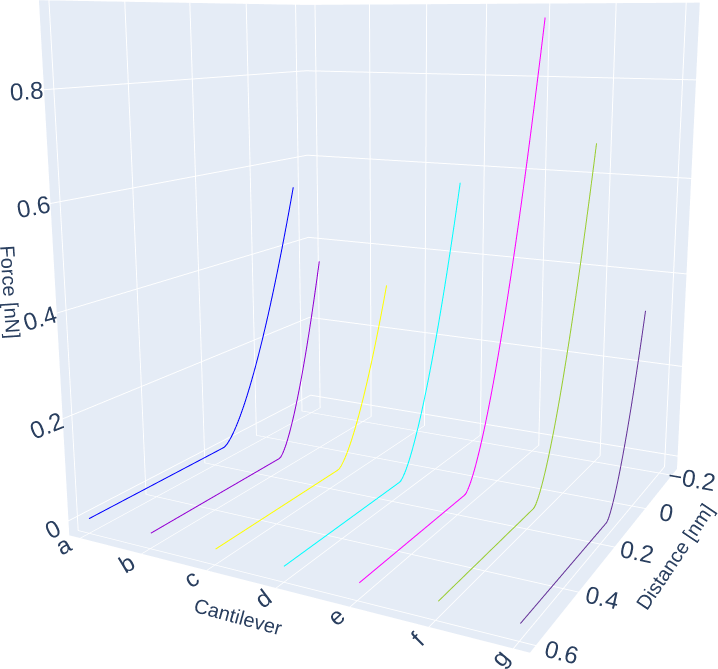

    Three-dimensional plots of the various cantilevers provided by the manufacturer and those in the pyDAMPF database that establish a given maximum force at a given distance between the tip and the sample for a PVA polymer subjected to RH= 0\% with E = 930 [MPa]. :label:`fig6a`

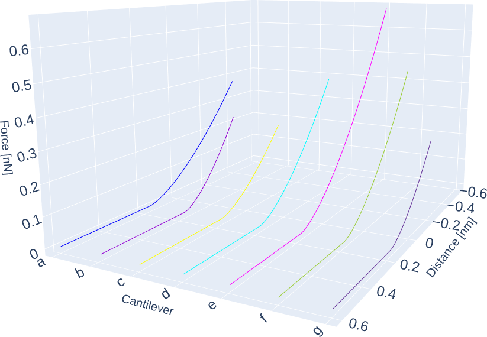

    Three-dimensional plots of the various cantilevers provided by the manufacturer and those in the pyDAMPF database that establish a given maximum force at a given distance between the tip and the sample for a PVA polymer subjected to  RH = 60.1\% with E = 248.8 [MPa]. :label:`fig6b`

As we aim a massive use of pyDAMPF, we also perform the corresponding benchmarks on four different computing platforms, where two of them resembles the standard PC or Laptop found at the labs, and the other two aim to cloud and HPC facilities, respectively (see Table :ref:`tab2` for details).

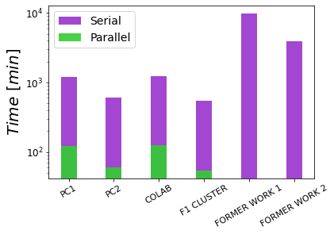

    Comparison of times taken by both the parallel method and the serial method. :label:`fig7a`

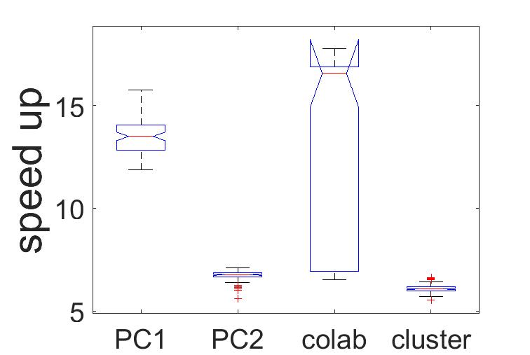

    Speed up parallel method. :label:`fig7b`

Figure :ref:`fig7a` shows the average run time for the serial and parallel implementation. Despite a slightly higher performance for the case of the HPC cluster nodes, a high-end computer (PC 2) may also reach similar values, which is our current goal. Another striking aspect observed by looking at the speed-up, is the maximum and minimum run times, which notoriously show the on-demand character of cloud services. As their maxima and minima show the highest variations.

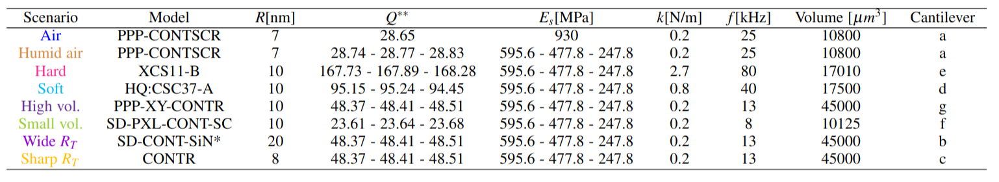

    Data used for Figs. :ref:`fig2a`, :ref:`fig3a` and :ref:`fig4a` with an :math:`A_0=10[nm]` . Observe that the quality factor and Young's modulus have three different values respectively for RH1 = 29.5\%, RH2 = 39.9\% y RH3 = 60.1\%. :math:`^{**}` The values presented for Quality Factor :math:`Q` were calculated at  `Google Colaboratory notebook Q calculation <https://colab.research.google.com/drive/1O1xjLfmMoL6J4EwVods95zfelzr8GDUQ?usp=sharing>`__, using the method proposed by :cite:`Sader, Sader2`. :label:`tab1`

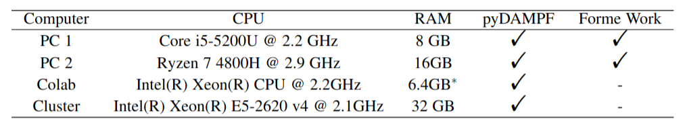

    Computers used to run pyDAMPF and Former work :cite:`dForce`, :math:`^{*}` the free version of Colab provides this capability, there are two paid versions which provide much greater capacity, these versions known as Colab Pro and Colab Pro+ are only available in some countries. :label:`tab2`

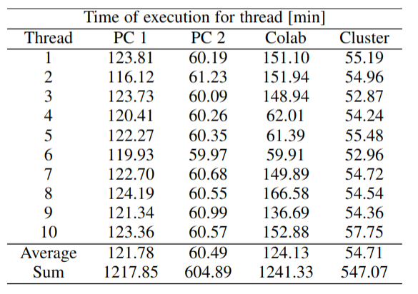

    Execution times per computational thread, for each computer. Note that each 	Thread consists of 9 simulation cases, with a sum time showing the total of 90 cases for evaluating 3 different Young moduli and 30 cantilevers at the same time. :label:`tab3`

To calculate the speed up we use the following equation:

.. math:: S = \frac{t_{total}}{t_{thread}} %= \frac{Case_{time}}{Thread_{average}}

Where :math:`S` is the speed up , :math:`t_{Thread}` is the execution time of a computational thread, and :math:`t_{Total}` is the sum of times, shown in the table :ref:`tab3`. For our calculations we used the highest, the average and the lowest execution time per thread.

Limitations
============

The main limitation of dynamic AFM simulators based in continuum modeling is that sometimes a molecular behavior is overlooked. Such a limitation comes from the multiple time and length scales behind the physics of complex systems, as it is the case of polymers and biopolymers. In this regard, several efforts on the multiscale modeling of materials have been proposed, joining mainly efforts to stretch the multiscale gap :cite:`GuzmanCPC2019`. We also plan to do so, within a current project, for modeling the polymeric fibers as molecular chains and providing "feedback" between models from a top-down strategy. Code-wise, the implementation will be also gradually improved. Nonetheless, to maintain scientific code is a challenging task. In particular without the support for our students once they finish their thesis. In this respect, we will seek software funding and more community contributions.

Future work
============
There are several improvements that are planned for pyDAMPF.

-  We plan to include a link to molecular dynamics simulations of polymer chains in a multiscale like approach.

-  We plan to use experimental values with less uncertainty to boost    semi-empirical models based on pyDAMPF.

-  The code is still not very clean and some internal cleanup is necessary. This is especially true for the Python backend which may require a refactoring.

-  Some AI optimization was also envisioned, particularly for optimizing criteria and comparing operational parameters.

Conclusions
============

In summary, pyDAMPF is a highly efficient and adaptable simulation tool aimed at analyzing, planning and interpreting dynamic AFM experiments.

It is important to keep in mind that pyDAMPF uses cantilever manufacturers information to analyze, evaluate and choose a certain nanoprobe that fulfills experimental criteria. If this will not be the case, it will advise the experimentalists on what to expect from their measurements and the response a material may have. We currently support multi-thread execution using in-house development. However, in our outlook, we plan to extend the code to GPU by using transpiling tools, like compyle :cite:`compyleScipy2019`, as the availability of GPUs also increases in standard workstations. In addition, we have shown how to reuse a widely tested Fortran code :cite:`GuzmanACSnano2013` and wrap it as a python module to profit from pythonic libraries and interactivity via Jupyter notebooks. Implementing new interaction forces for the simulator is straightforward. However, this code includes the state-of-the-art contact, viscous, van der Waals, capillarity and electrostatic forces used for physics at the interfaces. Moreover, we plan to implement soon semi-empirical analysis and multiscale modeling with molecular dynamics simulations.

Acknowledgments
===============

H.V.G thanks the financial support by the Slovenian Research Agency (Funding No. P1-0055). We gratefully acknowledge the fruitful discussions with Tomas Corrales and our joint Fondecyt Regular project 1211901.

