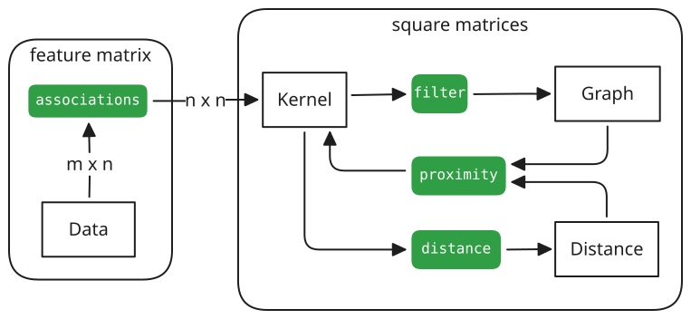
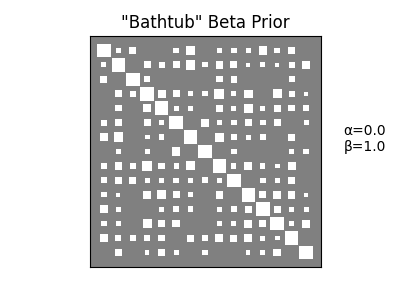

```{raw:typst}
#import "@preview/booktabs:0.0.4": *
#show: booktabs-default-table-style
```

## Background

Reconstructing networks of relatedness from binary co-occurrence data is of interest in a surprising breadth of scientific contexts, such as: document-term matrices in NLP, infection records in epidemiology, maintenance tags in manufacturing knowledge systems, and buyer carts in collaborative filtering.
Despite this ubiquity, practitioners across these communities often rely on ad hoc assumptions and techniques for relation detection.
Building consensus is made more difficult by a lack of shared tooling or benchmarks for assessing reconstruction accuracy.
Not only are there relatively few resources (and even fewer standard practices) around measuring uncertainty in structure recovery [@Networkreconstructionvia_Peixoto2024], but there is an increasing need for careful specificity around the exact kind of relational structure being recovered, and how transformations lose (or invent) information for analyses [@WhyHowWhen_Torres2021].
What results from current practices around projecting bipartite "co-occurrences" into a feature relation graph is often called a "hairball", requiring significant edge reduction and careful filtering to assess underlying structures.

This paper outlines three recently developed parts of a broader ecosystem developed to assist practitioners in applying best practices for "trimming" these hairballs, _and_ to promote shared benchmarking for researchers that develop these techniques for them. 


## Consistent API for Inferring Relationships (`affinis`)

One of the core difficulties of consistent network analysis comes from managing all of the various forms networks can take in data structures.
Libraries like [NetworkX](https://networkx.org/documentation/stable/) from [](https://doi.org/10.25080/tcwv9851) create labeled property graph structures, which is a pattern followed by many libraries in other languages as well (e.g. Rust's [`petgraph`](https://github.com/petgraph/petgraph)).  
However, a good deal of efficiency (as well as compatibility with other data science and machine learning workflows) can be gained by representing graphs as matrices.
[`scipy.sparse.csgraph`](https://docs.scipy.org/doc/scipy/reference/sparse.csgraph.html#module-scipy.sparse.csgraph) is a key example of this, which exploits the natural sparsity of adjacency matrix representations to achieve very fast graph algorithm implementations (which are the basis for many other libraries).
Another example is [`CSRGraph`](https://github.com/VHRanger/CSRGraph), which adds the capability for random walks to be sampled from the sparse graph matrices.

Because the matrix forms are so useful, difficulty arises when users are constantly needing to transform their graph representation of choice to-and-from the sparse formats.
Furthermore, there are a number of cases where graph matrices create related matrices that _aren't graphs_, but might be interpreted as such due to shape collision in workflows.
Our library `affinis` works as a systematic set of tools to consistently transform between _observational_ data on nodes (represented as binary feature activations), and the various forms of square matrices encountered when analyzing the way these features are _related_ to each other (or not).
Much of the difficulty of "straightening out" what a given feature or square matrix represents comes from lack of clarity over the differences between them, and how they relate to one-another.

Graph-related matrices can come in a number of forms: 

- Data (e.g. bipartite, feature/design matrix, observations, node activations)
- Graph (e.g. adjacency, discrete Laplacian),
- Kernel (e.g. heat, forest accessibility, page-rank),
- Distance (e.g. shortest-path lengths, generalized euclidean)

For each of these, there are methods to transform between them, each with their own peculiarities and trade-offs.
`affinis` is a centralized place that has assembled a wide variety of methods, enabling consistent, rapid experimentation and comparison between each on a per-dataset level. 

:::{figure}
:label: fig:affinis-overview


Overview of `affinis` computational submodules (shown shaded in green), and how they transform between the matrix representations of data or feature relationships.  
:::


:::{aside}

`affinis` has been published to the PyPI repository, and can be installed using `pip`:

```shell
pip install affinis
```
The source repository can be accessed from the [`usnistgov` Github repository](https://github.com/usnistgov/affinis)  
:::

### Feature Relationships from Binary Data (`associations`)

The primary function of `affinis` is to provide a consistent interface for feature relationship discovery, along the _entire lifecycle_ of a binary or bipartite dataset.
While it's true that many relationship-detection and edge filtering routines use a "graph" (e.g. in the form of an adjacency matrix) as input, and returning a filtered graph as output, others use observation-level information from an original feature matrix.
`affinis.associations` maintains a consistent API from observation data to feature relatedness measures.
All functions in this module take in data as boolean design matrices (`observations x features`), and return a feature relatedness measure (`features x features`), i.e.,
$f(X): \mathbb{B}^{m\times n} \rightarrow \mathbb{R}^{n\times n}$

This API is enforced _at runtime_ using array shape and dtype information via [`jaxtyping`](https://github.com/patrick-kidger/jaxtyping) with [`beartype`](https://github.com/beartype/beartype).
This contract with the user should greatly improve data pipeline reliability and reduce the possibility for hidden failures in analysis.
The functions currently implemented (and their primary use as documented) are: 

Marginal counts
: _methods:_ `coocur_prob`, `ochiai` [@Measuresecologicalassociation_Janson1981], `mutual_information`, `yule_y`, `yule_q`, `odds_ratio` [@MethodsMeasuringAssociation_Yule1912]
  \
  This class of association measures are derived from marginal counts alone.
  The do not use underlying structural information between features, but only *how* observations are able to be counted/combined for statistical aggregation. The majority rely on observational units being *additive*, such that we can apply an inner product $X^TX$ on them.

Bipartite projection
: _methods:_ `hyperbolic_project` [@Scientificcollaborationnetworks._Newman2001], `resource_project` [@Bipartitenetworkprojection_Zhou2007]
  \
  While marginal methods could also be seen as linear bipartite projections, these take advantage of the bipartite structure of $X$. Individual observations (rows) get re-weighted based on their sparsity.

Backboning
: _methods:_ `high_salience_skeleton` [@Robustclassificationsalient_Grady2012], `doubly_stochastic_filter` [@twostagealgorithm_Slater2009]
  \
  Bipartite projections are notorious for becoming "hairballs" (with lots of edge noise). This class of methods try filter out edges using principled (often statistical) techniques, but only filter post-projection.

Probabilistic graphical models (PGM)
: _methods:_ `chow_liu` [@Approximatingdiscreteprobability_Chow1968], `forest_pursuit` [@sexton2025measuring]
  \
  By assuming an underlying generative model, these methods can filter edge noise, while possibly making use of observation-level sample information.


Forest Pursuit, listed as a PGM, is of particular interest, since `affinis` contains the first reference implementation of this algorithm.
Forest Pursuit was recently proposed in @sexton2025measuring, and attempts to combine the local/additivity assumptions of the marginal methods, while _also_ directly recovering an underlying network of _conditionally dependent_ pairs of nodes (as with a probabilistic graphical model). 
_Forest Pursuit_ replaces the inner product "counts" with an operator that treats observations as samples from a random spanning forest distribution (meaning that each observation is a result of a "spreading process").
This puts it somewhere between the previously discussed association measures (computationally) and the backboning/dependency-recovery methods (theoretically), while providing exceptional scalability, accuracy, and thresholding stability.

A comparison of several methods applied to an example feature matrix can be seen in @fig:assoc-example.


:::{figure}
:label: fig:assoc-example


Comparison of methods for edge estimation from bipartite projection. 
:::

Finally, this module has added special functionality in each method for basic additive smoothing under a beta prior. 
Referring back to @fig:affinis-overview, many of the functions here are used to create _kernels_ (i.e. positive semi-definite matrices of similarity between features/nodes).
However, if two nodes are never "observed together", having an undefined or "zero" similarity can be a significant issue for the quality of predictions and analysis downstream [@SpeechLanguageProcessing_Jurafsky2025].
This brings problems with it, if unobserved combinations are receiving probability 0., even when they should still be considered _possible_ with sufficient sampling.[^1]
As the thinking goes, just because you've never seen something, doesn't make it _impossible_, just improbable. 
_How improbable_ depends on your priors.


The ability to provide your priors is available in nearly all `affinis.associations` functions via the `pseudocts` parameter.
The simplest way to "smooth" your results is to add at least one observation of each possible kind to your dataset: two trials, i.e., one success and one failure. 
Add them to your overall counts to get a smoothed probability (Laplace smoothing) with `pseudocts=1.`

Of course, you might not want these "pseudo-counts" to be worth as much as the "real" observations. 
Adding `pseudocts=0.5` would be using a Jeffrey's Prior. 

:::{figure}
:align: center


Three common additive-smoothing settings, with parameter option. 

:::

It turns out that these are all special cases of a beta-binomial distribution, with a symmetric prior. 

Of course, there's no reason to necessarily stick to a symmetric prior. 
`affinis` allows for tuples `(a,b)` as pseudocount parameters, so that you can deal with smoothing differently at the low and high ends of your association scales. 

With parameters `(a,b)`, the posterior expected value of the association measure will be 

$$
P = \frac{\textrm{successes}+a}{\textrm{trials}+a+b}
$$

We also provide a convenience to enforce `a+b=1`, which ensures the prior expected value is `a`, and when used for sampling purposes can prefer values of 0 or 1 (i.e. a bathtub prior). 
This is done with the `zero-sum` option, like so: 

```python
affinis.associations.forest_pursuit(X, pseudocts=('zero-sum',0.1))
```

Of course, all of this assumes that we can represent a given measure as a probability in the form (successes/trials).
While most can (even atypical ones like cosine similarity in `affinis.associations.ochiai`) a few do not have a form that is easily representable as a ratio (like `affinis.associations.hyperbolic_project`). 


:::{image}
:no-pdf: true


:::

### Visualization (`plots`)

Often when comparing the ability of an association measure to recover _structure_ from a set of binary variable observations, it's not necessarily important to see the _values_ of the association, but instead _which relationships_ are strong _relative_ to the overall set. 

Colors (like we have used above) can be somewhat hard to parse, so another option is to represent association strength with **size**. 
This intuition leads to what is commonly called a _Hinton diagram_.
See #fig:assoc-example for a comparison of the Hinton diagrams for an example feature matrix, along with resulting feature relationship measures from `affinis.associations`. 
Size reflects normalized weight, while color can be used for the sign (positive vs negative). 


Unlike the commonly-used method for creating Hinton diagrams from the [Matplotlib documentation](https://matplotlib.org/stable/gallery/specialty_plots/hinton_demo.html), our custom implementation in `affinis.plots.hinton` uses a cached axis to automatically scale `matplotlib.pyplot.scatter` markers based on the user's current DPI and axis dimensions.
This lets us take advantage of vectorized C/C++ routines, and subsequently plot Hinton diagrams for much _larger_ matrices.   

Finally, because the change in relative matrix weights over time is often important to observe, we have added a callback capability to `hinton` additionally provides an `update_from` convenience parameter to assist with animation.
It accepts an existing `matplotlib.collections.PathCollection` container (such as a previous frame's scatterplot markers), which it will then modify in-place, rather than creating a new plot. 


### Kernels (`proximity`, `distance`, & `filter`)

These three submodules deal with transformations _between_ square matrices, based on commonly-needed workflows in network analysis:

- Graphs are typically sparser than metrics/proximities, and can be created by _filtering_ edges. 
- Distances between nodes can be created from graphs, but also by inverting similarities/kernels.
- Kernels can be computed from graphs or from inverting distances  

Those workflows motivate the following submodules, which can be extended in an on-going manner: 

`proximity`
: _methods:_ `bilinear_kern`, `forest`, `forest_correlation` [@Semisupervisedlearning_Avrachenkov2017], `sinkhorn` [@Sinkhorndistanceslightspeed_Cuturi2013]
  \
  Includes the widely applicable (but under-represented) _forest accessibilities_ kernel. Also includes a tool for Sinkhorn-Knopp iterations, which performs iterated proportional fitting to project a square matrix to its nearest doubly stochastic counterpart (removing node-degree correlations), and an inverse of the bilinear distance operation recover a kernel.

`filter`
: _methods:_ `threshold_value`, `threshold_connected`
  \
  Allows users to threshold kernels by value over which an edge "exists" and below which it doesn't. For unsupervised edge thresholding, users may also threshold as much as possible before breaking graph connectivity.

`distance`
: _methods:_ `bilinear_dists`, `adjusted_forest_dists`, `generalized_graph_dists`
  \
  From a given kernel, we are able to turn them into Euclidean distance metrics using the bilinear form. Forest kernels each have corresponding distances using this identity, as well.

We will note that `affinis.proximity` is not an exhaustive catalog of existing kernels on graphs [@SimilaritiesgraphsKernels_Avrachenkov2019], but does provide an interface to a few versatile functions for estimating and modifying kernels.

For instance, while not provided natively in more common graph theory libraries, the forest kernel (based on work by [Chebotarev & Shamis (2002)](https://doi.org/10.1016/S1571-0653(04)00058-7) and @Semisupervisedlearning_Avrachenkov2017) is a parameterized form of an inverse regularized Laplacian: 

$$ Q_{\beta} = \left( I+\beta L \right)^{-1} $$

Entries in this proximity matrix turn out to be the probability that a node ends up sharing a tree with another node, in a randomly sampled spanning forest of the graph (hence the name). 
Since $I+\beta L$ is positive definite (non-singular), the inversion is guaranteed to exist, and will be provably _doubly stochastic_.
These properties make it widely usable for many network analysis tasks. 
See the references above for numerous applications of this kernel, its derived distances, and the underlying _Matrix Forest Theorem_, which plays a key role in the inference performed by `forest_pursuit`.
Our implementation is slightly more efficient than using basic `np.linalg.inverse` and similar when inverting the regularized Laplacian: we directly interface with `dpotrf` and `dpotri` LAPACK routines via Scipy, for Cholesky inversion with cached indexing for positive definite matrices (like the regularized Laplacian).

Alternatively, an analyst might approximate a matrix with similar stochastic properties while avoiding matrix inversion altogether, via the Sinkhorn-Knopp algorithm (`sinkhorn`).  
It's also the basis for the `doubly_stochastic_filter` discussed above.


For our `filter` module, we have found Numpy's [masked arrays](https://numpy.org/doc/stable/reference/maskedarray.generic.html) to be particularly useful for retaining index and value information.
For unsupervised "minimum-connected" thresholding, `affinis` has implemented a fast routine for removing edges until the graph is about to become disconnected (using a binary search and breadth-first connectivity checks). 


Interestingly, in the limit of $\beta\rightarrow\infty$, the `distance.adjusted_forest_dists` will tend toward the Commute-time kernel (i.e. effective resistances)[@Semisupervisedlearning_Avrachenkov2017]. 
`generalized_graph_dists` also have this property, though in this diagonally-normalized case, the lower limit $\beta\rightarrow 0^+$ will also converge to a scalar multiple of the _shortest path distances_. 
In this way, the forest distances can be thought of as a smooth interpolation from the shortest paths to the effective resistances. 


## Reproducibility & Community Benchmarking (`MENDR`)


To enable broad cross-disciplinary participation and development toward improved network recovery from sparse/bipartite data, we propose a synthetically generated set of challenge problems, which we dub "MENDR": **M**easurement **E**rror in **N**etwork **D**iffusion \& **R**econstruction


:::{aside}
Repository to reproduce our synthetic data generation can be found here: 
[`usnistgov/mendr`](https://github.com/usnistgov/mendr)
:::

The core purpose of this collection is to provide a way for the network reconstruction community to benchmark their algorithms, and find more specific success/failure patterns among algorithm types.

### Dataset Overview

To reflect common node-activation mechanisms, we first generate a set of "ground truth" graphs from a pre-determined set of graph types: 

- **BL**: block network
- **TR**: tree network
- **SC**: Scale-free (Barabasi-Albert, $m\in \{1,2\}$)

Then, for each graph $G$, a number of random walks with a randomly chosen number of node-to-node "jumps" (starting at randomly chosen "root" nodes) are sampled using the `CSRGraph` library for scalability and memory efficiency.  
The data $X$ is generated as a one-walk-per-row, one-node-per column binary matrix.
The goal of a given challenge is to recover the ground truth graph $G$, _using only the data_ $X$.

Every pair of $\{G,X\}$ can be given a unique ID in MENDR.
For human readability, we create an ID that starts with its graph-type code, followed the number of nodes $n$, and the seed that generated the random sample, e.g:

```
BL-N030S01
BL-N030S02
...
TR-N100S10
TR-N100S11
...
```
The parameters not included in the design are sampled randomly, using distributions detailed in @tbl:mendr-design


 :::{table}
:label: tbl:mendr-design

|parameters             | values                           |
| :-                    |:-:                               | 
| random graph **kind** | BL, TR, SC                |
| network **$n$-nodes** | 10,30,100,300                    |
| random **walks**      | 1 sample $m\sim\text{NegBinomial}(2,\tfrac{1}{n})+10$|
| random walk **jumps** | 1 sample $j\sim\text{Geometric}(\tfrac{1}{n})+5$     | 
| random walk **root**  | 1 sample $n_0 \sim \text{Multinomial}(n,1)$|
| random **seed**       |  1, 2, ... ,  30                 |

Experiment Settings (`MENDR` Dataset) {#tbl-mendr}
:::

### Serialization

Graph serialization is a long-standing issue in the network analysis community, since there are ambiguities in how (un)directed graphs, multi-graphs, hypergraphs, etc., are stored with respect to the data formats available.
To reduce confusion and align directly with the input required by `affinis` tools, we have chosen to serialize the MENDR datasets as `json`, containing two sparse array serializations and a list of visited nodes.
Each json entry has attributes that directly correspond to instantiation parameters of sparse `COO` arrays from the [`pydata/sparse`](https://sparse.pydata.org/en/stable/) library.
An example of this serialization scheme is shown in @mendr-io


:::{figure}
:label: mendr-io

```yaml
SerialRandWalks:             # BL-N030S01
  graph:                     # SparseGraph
    format: COO
    shape: [30, 30]
    data_types:
      indices_0: [0, 0, 1, 1, 2, 3,  ...]
      indices_1: [4, 18, 25, 28, 24, 22, ...]
      values: 1
  jumps:
    - [0, 18, 24, ...]
    - [22, 27, 22, ... ]
    - ...
  activations:
    format: COO
    shape: [53, 30]
    data_types:
      indices_0: [0, 0, 0, 0, 0, 0, ...]
      indices_1: [0, 2, 4, 6, 10, 17, ...]
      values: 1
```

Example serialization of MENDR dataset `BL-N030S01`. Rendered here in (abbreviated) YAML for readability. 
:::

This data format schema is available as an importable python object, created using the json serialization tool [`pyserde`](https://github.com/yukinarit/pyserde).
In addition to `sparse.COO` (and `CSR`), we have provided support for serialization of NetworkX graphs, `CSRGraph` arrays, and Scipy sparse arrays/matrices.

```python
from mendr.io import SerialSparse, SerialRandWalks
from pyserde.json import to_json

experiment = SerialRandWalks(
    SerialSparse.from_array(G),  # networkx.Graph, sparse.COO, etc.
    jumps,
    SerialSparse.from_array(X)
)
to_json(experiment)

```

Deserialization from `json` (into `sparse.COO`) is validated with `beartype` through `pyserde.json.from_json`.
As further help, the MENDR repository contains an installable command-line interface to generate graphs and graph-recovery challenge datasets on the fly, as well as run a pre-defined set of algorithms against any number of datasets as a benchmark.
This is how the MENDR results are calculated. 


### Benchmark Results

As an initial benchmark, methods from `affinis` were tested on the 4,320 currently generated MENDR datasets, along with an additional call to `sklearn.covariance.GraphicalLassoCV`.
Because the quality of a network recovery depends on the threshold selected for edge relevance, and the standard setting for network recovery _does not have_ a ground-truth network to recover, we instead look at aggregate performance metrics over the entire threshold span.


The results in @tbl:mendr-results show a significant performance improvement of Forest Pursuit for minimum, median, and maximum MCC scores, which is the preferred metric for highly imbalanced prediction tasks like this [@statisticalcomparisonMatthews_Chicco2023].  

:::{table}
:label: tbl:mendr-results

| method          | APS             | E[MCC]          | MCC-max         | MCC-min         |
|:---------       |:------------    |:------------    |:------------    |:------------    |
| Forest Pursuit  | 0.83 (0.21)     | **0.73 (0.19)** | **0.86 (0.17)** | **0.75 (0.25)** |
| GLasso          | **0.90 (0.13)** | 0.47 (0.15)     | 0.85 (0.12)     | 0.72 (0.75)     |
| Ochiai          | 0.79 (0.21)     | 0.38 (0.16)     | 0.74 (0.14)     | 0.59 (0.20)     |
| Hyperbolic Proj.| 0.59 (0.34)     | 0.34 (0.17)     | 0.55 (0.25)     | 0.35 (0.25)     |
| Sinkhorn        | 0.47 (0.39)     | 0.28 (0.16)     | 0.49 (0.25)     | 0.39 (0.32)     |
| HSS             | 0.33 (0.36)     | 0.23 (0.22)     | 0.50 (0.19)     | 0.25 (0.35)     |
| Resource Proj.  | 0.27 (0.43)     | 0.22 (0.19)     | 0.44 (0.31)     | 0.36 (0.31)     |

Median (inter-quartile range) MENDR Benchmark results, reproduced from Table 6.3 in [@sexton2025measuring]
:::

GLasso still shows better performance with respect to APS, though for more investigation into the comparison of these two methods (and conditions under which Forest Pursuit can improve on GLasso's APS) see [@sexton2025measuring]

## Scalable Metrology

In order to rapidly benchmark network recovery algorithms across thousands of challenge datasets (as in MENDR), a different set of tradeoffs is needed when actually computing the performance---i.e. when _doing metrology_.

First, for large networks, the number of _edges_ that need to be assessed grows _quadratically_ with the network size (number of nodes). This means, for instance, that a 1,000-node network will need to score a prediction set 3 orders of magnitude greater than that.
Second, because edge predictions are general scalar-valued (or probabilities), the actual performance of an algorithm differs depending on the chosen edge threshold, so _all thresholds_ must be accounted for in the final performance estimate.

:::{aside}

`Contingency` has been published to the PyPI repository, and can be installed using `pip`:

```shell
pip install contingency-tools
```

The source repository can be accessed from the [`usnistgov` Github repository](https://github.com/usnistgov/Contingency)  
:::

To assist with this, we have published a utility library called `Contingency`. 
This library provides a simple data structure to compute and store useful metrological information, and uses caching, subsampling, and vectorization tricks to ensure scalability for benchmarks like MENDR.


### The `Contingent` Data Structure

Binary classification metrics are all about testing the quality of predicted labels against  _true_ labels you observed.
Given a set of true and a set of predicted labels, a `contingency.Contingent` dataclass can be instantiated trivially: 

```ipython
from contingency import Contingent
M = Contingent(y_pred=y_pred, y_true=y_true)
```
Users would now have access to class properties that return useful metrics, calculated from the (true/false)-(positive/negative) contingency counts, such as:

- Positive Predictive Value (a.k.a. "Precision")
- True-Positive Rate (i.e. Sensitivity, or "Recall")
- Matthew's Correlation Coefficient (MCC)
- F-score
- Fowlkes-Mallows index

However, most algorithms do not output binary classifications directly, but instead output probabilities (or weights).
Thresholding these at varying levels will create an entire "family" of predictions as the threshold increases or lowers.
This behavior is accessed via `Contingency.from_scalar`:

```ipython
y_prob = np.array([0.1,0.8,0.1,.7,.25])
M_batch = Contingent.from_scalar(y_true, y_prob, subsamples=None)
```

From the resulting batched contingency count arrays, previously mentioned scores now become score _trajectories_ over all thresholds.
To report single scores once again, `Contingent` objects have a `.expected()` convenience method, which calculates the expected value for supported scores.
One special behavior is for the Average Precision Score (`.expected('aps')`), which is the average precision weighted across the _recall_ scores (not thresholds).


One common tool in these cases is a _Precision-Recall_ (P-R) curve.
To simplify repetitive reporting for these plots, we've provided a simple template `matplotlib.axes.Axes` object, accessible by importing plot utility `contingency.plots.PR_contour`.
This will set up a correctly-scaled P-R plot, with included isoclines for implied `F_1` and `fowlkes_mallows` scores.

:::{aside}
While the `Contingent` class does not have a method to automatically plot its own P-R curves on a contour like this, such functionality is planned to be added at a later time.
:::

### Techniques for Scalability 

`Contingent.from_scalar` handles the calculation of score trajectories this as a simple broadcasting operation, since all contingency counts and derived metrics have enabled a _batch dimension_.
In this case, rather than looping over possible thresholds, we make use of `numpy.less_equal.outer`, a so-called [`ufunc`](https://numpy.org/doc/stable/reference/generated/numpy.ufunc.outer.html) that applies the thresholding operation to all pairs of edges and thresholds, and vectorized through its C-backend.
In addition, once the contingency counts are found, all future metric requests are derived from the cached, batched-dimension (true/false)-(positive/negative) counts.
Unlike other binary performance metrics libraries, `Contingent` objects can be instantiated once-per-dataset, and all derived metrics only require simple arithmetic operations through Numpy. 
For this reason, while `Contingency` is already competitive with (or even _much faster_ than) Scikit-Learn's equivalent methods, actual use of `Contingency` will involve cached calculations that make metric calculation time functionally negligible.
The user API is shown in @contingency-use, with performance benchmarks across a wide range of dataset sizes shown in @fig:contingent-scale.


:::{figure}
:label: contingency-use

```ipython
rng = np.random.default_rng(24) 
y_true = (y_src := rng.random(1000))>0.7
y_pred = y_src + 0.05*rng.normal(size=1000)

# Contingency
Contingent.from_scalar(y_true, y_pred).expected('aps') # uncached (APS)
M = Contingent.from_scalar(y_true, y_pred)           
M.expected('aps')                                      # cached (MCC)

#Scikit-Learn
from sklearn.metrics import average_precision_score
average_precision_score(y_true, y_pred)                # sklearn APS
np.mean([
    matthews_corrcoef(y_true,x) for x in M.y_pred      # sklearn E[MCC]
]) 

```

Example API use for `Contingent` objects.
:::

:::{figure}
:label: fig:contingent-scale


Comparison of `Contingent.expected` performance to equivalent scikit-learn tools for Average Precision Score (APS) and expected MCC (over all thresholds). Both non-cached (calling `from_scalar` each time) and cached versions are shown, and `subsamples=50` was used in each case.
:::

:::{aside}
```
--- System Information ---
OS: Linux 7.0.3-1-MANJARO
Physical Cores: 8
Logical Cores: 16
Total RAM: 14.93 GB
```
:::


The limit to this vectorized caching comes from memory limitations, since the outer-product matrix we use to vectorize contingency counting grows quickly with graph size.
To mitigate this, we have provided a `subsamples` option in `Contingent.from_scalar`, which will approximate the threshold values using linear interpolation of the original unique threshold set.
This distributes the sample locations according to the density of the original threshold values while limiting the size of the batch dimension needed for contingency count caching.

As shown in @fig:contingent-subsample, with only a few subsamples, the score curves quickly converge to their "true" values.
This allows `Contingent` objects to handle the large datasets, such as the $10^4$ dataset shown in @fig:contingent-scale (where `subsamples=50` was used).  

:::{figure}
:label: fig:contingent-subsample


Demonstration of the convergence of subsampling in `Contingency.from_scalar`
:::


## Future Work

The ecosystem presented here is in its early days, and many key extensions will bring new functionality, improved performance, and enhanced interoperability to enable community network metrology. 


Currently, `affinis` only makes use of sparse representations in the _feature space_, but after the gram matrix $X^T X$ is calculated, the now-square kernel is stored densely.
While this is important in cases where beta-posterior kernels are needed, it is possible to limit smoothing to cases where node co-occurrence actually happened, or to calculate smoothing on-demand downstream.
This is also relevant because the graph recovery tooling in `affinis.filter` is already re-sparsifying kernels, anyway, so a significant amount of memory and compute can be saved by enabling universal sparse compute.
The key improvement needed is a sparse-reimplementation of the `scipy.spatial.distance.squareform` function, which `affinis` uses for much of its downstream edge processing.
This can be accomplished using the _closed form_ index mappings detailed in @ParallelEuclideandistance_Angeletti2019, and further expounded on for edge vector representation in @sexton2025measuring

Secondly, support for further matrix manipulation is planned, with many of the kernels on graphs discussed in [](https://doi.org/10.1016/j.ejc.2018.02.002) being particularly straightforward to represent in our codebase. 
A new mechanism to fold/unfold node-based vector representations into edge-based representations would also be enabled by our upcoming sparse `squareform` method, which would support graph matrix manipulation required by several optimal matching algorithms, such as in @taylor2008optimal.


For `MENDR` (as with most benchmarks), increased coverage and the ability to more severely challenge modern algorithms would be welcome, such as with a 1000+ node graph series.
In addition, since we have preserved the original "jump" list that generated the node activations, it is possible to add an additional challenge to approximate the jump-list rank ordering from the node activations.
Alternatively, we could re-create the setting investigated by [](https://doi.org/10.1145/2086737.2086741), where the ordered list of jumps is used to attempt reconstruction of the graph.  

Although the graph serialization was done with a custom parser, we would additionally foresee interoperability with upcoming standards for hypergraph [@HIF2025] and sparse-matrix [@binsparse2026] representation on-disk as important improvements for MENDR.  

Lastly, for `Contingency`, several more kinds of accuracy "trajectories" (and their corresponding plots) would be useful to the community, specifically Receiver Operating Characteristic (ROC) plots.
It would also be possible to wrap `Contingent` objects in a Scikit-Learn-compatible API that would let them be used in pre-existing data pipelines for scoring binary classifiers.  


## Conclusion
We have introduced three open-source Python toolkits that together form the beginnings of improved research infrastructure for network reconstruction from binary data.

- **`affinis`**  is the core algorithm library, offering a consistent interface to a broad taxonomy of association measures, from marginal co-occurrence probabilities and cosine similarity, to bipartite projection methods (hyperbolic weighting, resource allocation), graph backboning algorithms (high-salience skeleton, doubly-stochastic filter), and probabilistic graphical model recovery (Chow-Liu trees).

  A central contribution is a reference implementation of _Forest Pursuit_, which is lazily executable, trivially parallelizable, and scales approximately linearly with the feature matrix size for diffusion-like problems.

- **`MENDR`** provides a standardized benchmark suite for the network reconstruction community.
  It includes a library of synthetic ground-truth graphs with configurable observation-generation processes, as well as a CLI for both generating novel experimental datasets and running experiments against the existing standard datasets.
  `MENDR` addresses a critical gap in the field: without shared benchmarks, comparing reconstruction methods across papers and communities has been effectively impossible.

- **`Contingency`** provides fully vectorized implementations of binary classification metrics.
  Its central `Contingent` data structure treats threshold sweeps as a broadcasting operation over predicted probability arrays, enabling efficient batched evaluation and caching.
  Supported metrics include Matthews Correlation Coefficient (MCC), F-score, Fowlkes-Mallows index, and average precision score.
  `Contingency` serves as a metrological foundation for assessing reconstruction performance, which enables consistent benchmarking across the entire framework.

`affinis`, `MENDR`, and `Contingency` together provide the scientific Python community with a reproducible, interoperable toolkit for network analysis and metrology.
We welcome community contributions, additional algorithm implementations, and new benchmark datasets.
