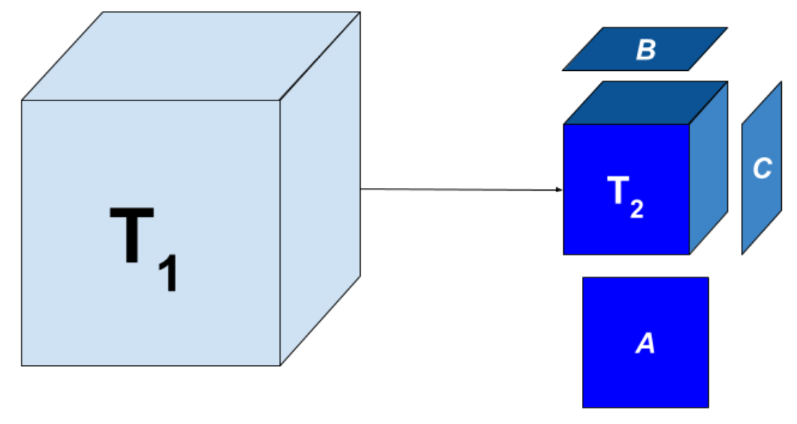
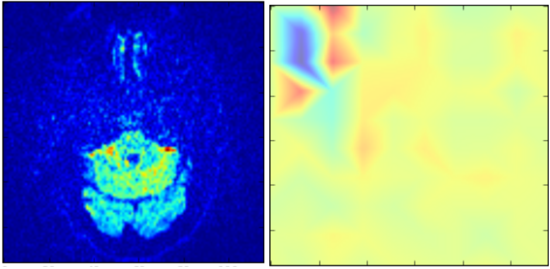

:author: Rajeswari Sivakumar
:email: rajeswari.a.sivakumar@gmail.com
:institution: University of Georgia

:author: Shannon Quinn
:email: spq@cs.uga.edu
:institution: University of Georgia
:corresponding:

:url: https://github.com/quinngroup/SciPy2019-demo/blob/master/README.md

------------------------------------------------------------------------------
Parkinson's Classification and Feature Extraction from Diffusion Tensor Images
------------------------------------------------------------------------------

.. class:: abstract

    Parkinson’s disease (PD) affects over 6.2 million people around the world.
    Despite its prevalence, there is still no cure, and diagnostic methods are
    extremely subjective,  relying on observation of physical motor symptoms
    and response to treatment protocols. Other neurodegenerative diseases can
    manifest similar motor symptoms and often too much neuronal damage has
    occurred before motor symptoms can be observed. The goal of our study is
    to examine  diffusion tensor images (DTI) from Parkinson’s and control
    patients through linear dynamical systems and tensor decomposition methods
    to generate features for training classification models. Diffusion tensor
    imaging emphasizes the spread and density of white matter in the brain.
    We will reduce the dimensionality of these images to allow us to
    focus on the key features that differentiate PD and control patients.
    We show through our experiments that these approaches can result in
    good classification accuracy (90\%), and indicate this avenue of
    research has a promising future.

.. class:: keywords

    tensor decomposition, brain imaging, diffusion tensor image, Parkinsons disease

Introduction
------------

Parkinson’s Disease
+++++++++++++++++++
Parkinson’s disease (PD) is one of the most common neurodegenerative disorders.
The disease mainly affects the motor systems and its symptoms can include shaking,
slowness of movement, and reduced fine motor skills. As of 2015 an estimated
6.2 million globally were afflicted with the disease [vos2016]. Its cause is largely unknown
and there are some treatments available, but no cure has yet been found.
Early diagnosis of PD is a topic of keen interest to diagnosticians and
researchers alike. Currently Parkinson’s is diagnosed based on the presence of
observable motor symptoms and change in symptoms in response to medications that
target dopaminergic receptors such as Levodopa [sveinbjornsdottir2016].
The problem with this approach is that it relies on treating symptoms instead of
preventing them. Once motor symptoms present, at least 60\% of neurons have been
affected and there is little likelihood of healing them fully. Additionally
early diagnosis will help reduce likelihood of misdiagnosis
with other motor neuron diseases.

Parkinsons Progression Markers Initiative Datasets
++++++++++++++++++++++++++++++++++++++++++++++++++

The Parkinson’s Progression Markers Initiative (PPMI) [marek2011] is a
clinical study designed to identify PD biomarkers and contribute towards new
and better treatments for the disease. The cohort consists of approximately 400
de novo, untreated PD subjects and 200 healthy subjects followed longitudinally
for clinical, imaging and biospecimen biomarker assessment. The PPMI data set is
a collection of biomarker data collected from a longitudinal study of Parkinson’s
and control subjects. They have thus far collected DaT (dopamine transporter) scan,
MRI (magnetic resonance imaging), fMRI (functional magnetic resonance imaging), and CT
(computerized tomography) scan data from several hundred subjects in 6 month intervals.
They first began collecting data in 2010, funded by the Michael J.Fox Foundation.
The dataset chosen for this paper was PPMI’s Diffusion Tensor Imaging (DTI) records.
DTI has been shown to be a promising avenue to explore biomarkers in Parkinsonian symptoms and can
provide unique insights into brain network connectivity. Moreover, the DTI data was
one of PPMI’s cleanest and largest datasets and thus expected to be one of the most
useful for further analysis. A DTI record is a four-dimensional dataset comprised of
a time-series of a three-dimensional imaging sequence of the brain. PPMI’s DTIs
generally consisted of 65 time slices, each taken approximately five seconds apart.
This method tracks movement of water in brain over the discrete time steps, creating a
representation of the brain that emphasizes the white matter structures [soares2013].

Existing Work
-------------

Parkinson’s Disease
+++++++++++++++++++

A variety of tools currently exist for diagnosis of Parkinson’s through
pre-motor symptoms. For example Parkinson’s seems to measurably affect olfactory
sensitivity prior to presenting motor symptoms more than other motor neuron diseases,
as illustrated by the University of Pennsylvania Smell Identification Test (UPSIT) [chaudhuri2016].
While there is still more work needed to refine tests like these, it is one example
that proves the feasibility of earlier diagnosis of Parkinson’s disease.
The PPMI holds that discovery of one or more biomarkers for PD is a critical step
for developing treatments for the disease. In [chahine2016] a search was conducted
of existing PD articles relating to objective biomarkers for PD and found that
there are several potential candidates, including biofluids, peripheral tissue,
imaging, genetics, and technology based objective motor testing.
Dinov et al [dinov2016] explored both model-based and model-free approaches for PD
classification and prediction, jointly processing imaging, genetic, clinical,
and demographic data. They were able to develop and full data-processing
pipeline enabling modeling of all the data available from PPMI, and found that
model-free approaches such as support vector machines (SVM) and K-nearest-neighbor
(KNN) outperformed model-based techniques like logistic regression in terms of
predicted accuracy. Several of these classifiers generated specificity exceeding
96\% when all data available from the dataset was aggregated and used. One
interesting finding was a notable increase in accuracy when using group size
rebalancing techniques to counteract the effect of cohort sample-size disparities
(there are many more patients than control subjects), increasing accuracy in one
SVM classifier from 75.9\% to 96.3\%.
Researchers in [baytas2017] recognized the inherent difficulty of using time-series analysis
techniques on longitudinal data collected at irregularly-spaced intervals and
proposed a new Long-Short Term Memory (LSTM) technique: Time-Aware LSTM (T-LSTM).
In [simuni2016] it was found that the subgroup PD classification of
tremor dominant (TD) versus postural instability gait disorder dominant (PIGD)
has substantial variability, especially in the early stages of diagnosis.
For this reason no attempt was made in this paper to include subtype assignment,
but only to learn a binary Yes/No PD classification prediction.
State-of-the art Parkinson’s classification results were reported by
[adeli2017] in early 2017 through use of a joint kernel-based feature
selection and classification framework. Unlike conventional feature selection
techniques, this allowed them to select features that best benefit the classification
scheme in the kernel space as opposed to the original input feature space.
They analyzed MRI and SPECT data of 538 subjects from the PPMI database and
obtained a diagnosis accuracy of 70.5\% in MRI generated features and 95.6\% in
SPECT image generated features. The authors speculated that their non-linear
feature selection was the reason for their outperformance of other methods on
this non-linear classification problem. Other researchers, [banerjee2016]
were able to achieve 98.53\% using ensemble learning methods trained on
T1 weighted MRI data. However Banerjee used several domain knowledge based feature
extraction methods to preprocess their data including image registration,
segmentation, and volumetric analysis.

The present research strikes a balance between feature selection and domain knowledge.
While our autoregressive model does utilize a basic understanding of relevance of time
in diffusion tensor imaging, we do not utilize any other domain specific
knowledge to inform our feature extraction. Our hope is to build a
generalizable approach that can be applied to other data structured similarly
both within and outside the domain of biomedical image analysis. Additionally
we want to improve the models being trained without domain specific knowledge
on MRI data. This is because MRI is a far less invasive brain imaging method
than SPECT imaging which is an X-ray based technique and must be used at a
limited frequency. Additionally the multiple MRI modalities offer versatility
in examining biological structures.

Tensor and Matrix Decomposition
+++++++++++++++++++++++++++++++

Matrix decomposition has been used in a variety of computer vision applications
in recent years including analysis of facial features. It offers another
means of quantifying the features that describe the relationships between
values in a 2D space and can be generalized to a variety of applications.
The key being that decomposition offers a powerful means of simultaneously
evaluating the relationships of values in a 2 or higher dimensional space.
In higher dimensional spaces, tensor decomposition is used, where tensors are
a generalization of matrices [rabanser2017].
Matrix decomposition can be described as a means of separating a matrix into
several component matrices whose product would result in the original matrix.
For example when solving a system of equations you might approach formulate
the problem as:

.. math::

   A x = b

where :math:`A` is a matrix and :math:`x` and :math:`b` are vectors. When
trying to solve this system of linear equation, we could apply a matrix decompositions
operations to the matrix :math:`A`, to more efficiently solve the system. By
finding the products of the of :math:`x` and :math:`b` with the one matrix
resulting from the decomposition and the inverse of the other,
we can solve the system of equations with significantly fewer operations [rabanser2017].
This can be generalized to machine learning applications where increased complexity of
models, often result in exponential increases in number of computations.
This also affects the applications of new algorithms and pipelines, Those that
are too complex and consequently have too many operations become too computationally
intensive to be practical to use in some cases.
We can choose specific types of decompositions that also allow us to preserve
unique information about original matrix while also reducing the size of
the matrix. In the case of singular value decomposition we are
trying to solve:

.. math::

   A = U S V^T

Where :math:`A` is the original matrix, of size :math:`m * n`, :math:`U` is an
orthogonal matrix of size :math:`m * n`, :math:`S` is a diagonal matrix of
size :math:`n * n`, and :math:`V^T` is an orthogonal matrix of size :math:`n * n`.
This generalization of the eigendecomposition is useful in compressing matrices
without losing information. It will come into play with our final experiment
using linear dynamical systems to extract features from the DTIs.
Extending the premise of singular value decomposition (SVD) to higher order
matrices, or tensors, we come to Tucker decomposition.

   Tucker decomposition, visualized. :label:`figure1`

Similarly to SVD, Tucker decomposition is used to compress tensors, and can be
applied to any tensor of 3 or more dimensions. This is illustrated using a tensor of
three dimensions in Figure 1. The resulting core tensor from the decomposition still
maintains the same shape and number of dimensions, but each are scaled down
to the size specified. We are thus able to use it as means to scale brain images to a
set of representative features without breaking down specific regions of
interest.

Methods
-------

There are two main experiments conducted. We examine both Tucker tensor
decomposition and a linear dynamical systems approach to reduce number of
dimensions and scale down diffusion tensor images. The goal is to evaluate
the two approaches for the quality of features extracted. To this end, the
final feature vectors produced by each method is then passed on to a random
forest classifier, where the accuracy of the final trained model is measured
on a classification task to predict control or Parkinson’s (PD) group.

The objective is to represent the original DTI as an abstracted tensor that is the
product of one of the dimensionality reduction techniques used in each experiment.

Algorithm Selection
+++++++++++++++++++

To guide our selection of a classifier, we used the python package TPOT [olson2016].
TPOT uses genetic algorithms to iteratively generate, select and evaluate
classification pipelines. We evaluated 10 generations of pipelines with
population size 100 in each and found that Random Forest classification was
most successful as predicting Parkinson’s from the generated features.
Given the success of random forest classifier, we considered that we might
further improve our accuracy by reducing the number of features we used from
the generated set. We considered that because we are focused on the differences
in a relatively small specific brain regions, only a small number of features
would be relevant. To test this theory, we used three different methods to
reduce the dimensionality of our feature set to 20 components: linear
principle component analysis (PCA), linear discriminant analysis (LDA) and
kernel PCA using a radial basis function (RBF).

Experiment I
++++++++++++

Using the tensorly package [kossaifi2019], a Tucker decomposition is applied to each brain
image. This approach to tensor decomposition was selected because it will
produce one core tensor that is representative but scaled down from the original
diffusion tensor image. Additionally Tucker decomposition, unlike other forms of
tensor decomposition is significantly better at preserving features specific to
the tensor being decomposed. Because of this it has applications in compression
algorithms.
The Tucker decomposition method is chosen in the present study over other tensor
decomposition methods to preserve features unique to each brain image it is
applied to. This will allow us to scale down each image and focus features and
regions of interest in each that are specific to that image.
In this experiment we decompose each brain image from a dimension of
:math:`(65,100,116,116)` to :math:`(10,10,10,10)` to have a continuity in number of features
produced.

Experiment II
+++++++++++++

This experiment focused on breaking down the feature extraction further and
evaluate another approach: linear dynamical systems. We scale down each coronal
slice in the images and then evaluate the change over time. The reason for
scaling down the coronal slices is to allow us to more efficiently build a
transition model to represent the flow of water over the time steps of the
image. This will allow us to build a three-dimensional representation of the
brain from the images that will show the flow of water and the distribution of
white matter in the brain. We evaluate the produced transition matrix as
features to be applied to the classification pipeline. The nature of the linear
dynamical systems allow us to directly model the flow of water via the net change
over time in the DTI.

Results
-------

Experiment I
++++++++++++

While we were able to achieve an accuracy of 94\% immediately,
we were not able to improve on this by further reducing the produced features
with various dimensionality reduction methods. In fact it appears that in some
cases, such as linear discriminant analysis (LDA), additional dimensionality
reduction adversely affects classifier performance. In exploring a slice of
the output core tensor at one ‘time’ point, what we see suggests that the
output of the tensor decomposition might be likened to a stack of sliced that
focus on the regions of interest in the original image. This is validated by
examining several corresponding decomposed core and original slices.

   (left): Slice from original brain image at a
   specific time point; (right): Corresponding slice
   from tensor decomposition output :label:`figure2`

.. table:: Classification accuracy of features generated from Tucker decomposition after various additional dimensionality reduction techniques are applied :label:`table1`

   +----------------------------+-------------+------------+
   |  Dimensionality Reduction  |  F-measure  |  Accuracy  |
   +----------------------------+-------------+------------+
   |                            |      0.94   |     0.94   |
   +----------------------------+-------------+------------+
   | PCA                        |      0.94   |     0.94   |
   +----------------------------+-------------+------------+
   | LDA                        |      0.82   |     0.81   |
   +----------------------------+-------------+------------+
   | Kernel PCA                 |      0.94   |     0.94   |
   +----------------------------+-------------+------------+

Experiment II
+++++++++++++

.. table:: Classification accuracy of features generated from linear dynamical systems after various additional dimensionality reduction techniques are applied :label:`table2`

    +----------------------------+-------------+------------+
    |  Dimensionality Reduction  |  F-measure  |  Accuracy  |
    +----------------------------+-------------+------------+
    |                            |      0.90   |     0.82   |
    +----------------------------+-------------+------------+
    | PCA                        |      0.89   |     0.81   |
    +----------------------------+-------------+------------+
    | LDA                        |      0.84   |     0.74   |
    +----------------------------+-------------+------------+
    | Kernel PCA                 |      0.93   |     0.89   |
    +----------------------------+-------------+------------+

We were able to achieve accuracy of 82\% with random forest classifier alone.
This outperforms previous benchmarks in training classifiers on synthetic
features derived from MR images. Compared to present results, [cole2016] achieved
only 70\% accuracy at best on synthetic features generated from T1 weighted MRI
scans. Furthermore, based on the F-measure scores across the experiment
conditions, we can reasonably say that our model is not skewed as a consequence
of the uneven distribution of the data. The PPMI data is heavily
skewed toward Parkinson’s individuals, with a majority of our data set coming
from Parkinson’s patients (421 subjects) versus controls (213 subjects),
which was also addressed by rebalancing the classes by oversampling the control.
We intuited that we could speed up model training and improve accuracy by
reducing the number of synthetic features we retained. We initially tried
linear PCA and LDA to perform the dimensionality reduction. However, these
actually hurt performance, resulting in test accuracy of 81\% and 74\%
respectively. Based on this, we considered non-linear dimensionality reduction
would be more effective. To this end we used Kernel PCA with RBF kernel,
which effectively improved accuracy to 89\%.

Discussion
----------
In summary we can conclude that dimensionality reduction is a useful method for
extracting meaningful features from brain imaging. Furthermore the impressive
performance of these features in machine learning applications indicates that at
least some subset of these features strongly correlates with the patient group.

While not explored in this paper, it would be interesting to explore why LDA seemed
cause a drop in classifier performance while traditional PCA did not in the tensor
decomposition. Furthermore it would be interesting to explore why PCA and LDA both
have caused classifier performance decreases with features produced from linear
dynamical systems. Specifically it would be interesting to explore the co linearity
between the class and features that affect the output features following the LDA
treatment. Specifically LDA seems to be stuck producing one strong feature
and ignoring the rest.

Additionally it would be interesting to explore the effect of various preprocessing
methods to improve out comes and to systematically obscure the data to evaluate which
features of the raw pixel data are being hi-lighted by the tensor decomposition and
linear dynamical systems steps.

Acknowledgements
----------------
Data used in the preparation of this article were obtained from the Parkinson's
Progression Markers Initiative (PPMI) database (www.ppmi-info.org/data). For
up-to-date information on the study, visit www.ppmi-info.org.
PPMI - a public-private partnership - is funded by the Michael J. Fox Foundation
for Parkinson's Research and funding partners, including Abbvie, Allergan, Avid,
Biogen, BioLegend, Bristol-Mayers Squibb, Colgene, Denali, GE Healthcare,
Genentech, GlaxoSmithKline, Lilly, Lundbeck, Merck, Meso Scale Discovery, Pfizer,
Piramal, Prevail, Roche, Sanofi Genzyme, Servier, Takeda, TEVA, UCB, Verily,
Voyager, and Golub Capital.

We would also like to thanks the reviewers for their feedback and support in
preparing this manuscript for publication.

References
----------
.. [adeli2017] Adeli, E., Wu, G., Saghafi, B., An, L., Shi, F., & Shen, D. (2017). Kernel-based Joint Feature Selection and Max-Margin Classification for Early Diagnosis of Parkinson’s Disease.Scientific reports, 7. doi: 10.1038/srep41069

.. [banerjee2016] Banerjee, M., Okun, M. S., Vaillancourt, D. E., & Vemuri, B. C. (2016). A Method for Automated Classification of Parkinson’s Disease Diagnosis Using an Ensemble Average Propagator Template Brain Map Estimated from Diffusion MRI. PloS one, 11(6), e0155764. doi: 10.1371/journal.pone.0155764

.. [baytas2017] Baytas, I. M., Xiao, C., Zhang, X., Wang, F., Jain, A. K., & Zhou, J. (2017, August). Patient subtyping via time-aware lstm networks. InProceedings of the 23rd ACM SIGKDD International Conference on Knowledge Discovery and Data Mining (pp. 65-74). ACM. doi: 10.1145/3097983.3097997

.. [chahine2016] Chahine, L. M., & Stern, M. B. (2016). Parkinson’s Disease Biomarkers: Where Are We and Where Do We Go Next?.Movement Disorders Clinical Practice. doi: 10.1002/mdc3.12545

.. [chaudhuri2016] Chaudhuri, K. R., Bhidayasiri, R., & van Laar, T. (2016). Unmet needs in Parkinson’s disease: New horizons in a changing landscape. Parkinsonism & related disorders, 33, S2-S8. doi: 10.1016/j.parkreldis.2016.11.018

.. [cole2016] Cole, J. H., Poudel, R. P., Tsagkrasoulis, D., Caan, M. W., Steves, C., Spector, T. D., & Montana, G. (2016, December). Predicting brain age with deep learning from raw imaging data results in a reliable and heritable biomarker. doi: 10.1016/j.neuroimage.2017.07.059

.. [dinov2016] Dinov, I. D., Heavner, B., Tang, M., Glusman, G., Chard, K., Darcy, M., ... & Foster, I. (2016). Predictive big data analytics: a study of Parkinson’s disease using large, complex, heterogeneous, incongruent, multi-source and incomplete observations. PloS one, 11(8), e0157077. doi: 10.1371/journal.pone.0157077

.. [kossaifi2019] Kossaifi, Jean, et al. "Tensorly: Tensor learning in python." The Journal of Machine Learning Research 20.1 (2019): 925-930. url: http://jmlr.org/papers/v20/18-277.html

.. [marek2011] Marek, K., Jennings, D., Lasch, S., Siderowf, A., Tanner, C., Simuni, T., ... & Poewe, W. (2011). The parkinson progression marker initiative (PPMI). Progress in neurobiology, 95(4), 629-635. doi: 10.1016/j.pneurobio.2011.09.005

.. [olson2016] Olson, R. S., Urbanowicz, R. J., Andrews, P. C., Lavender, N. A., & Moore, J. H. (2016, March). Automating biomedical data science through tree-based pipeline optimization. In European Conference on the Applications of Evolutionary Computation (pp. 123-137). Springer, Cham. doi: https://doi.org/10.1007/978-3-030-05318-5_8

.. [rabanser2017] Rabanser, S., Shchur, O., & Günnemann, S. (2017). Introduction to Tensor Decompositions and their Applications in Machine Learning. arXiv preprint arXiv:1711.10781.

.. [simuni2016] Simuni, T., Caspell-Garcia, C., Coffey, C., Lasch, S., Tanner, C., Marek, K., & PPMI Investigators. (2016). How stable are Parkinson’s disease subtypes in de novo patients: Analysis of the PPMI cohort?.Parkinsonism & related disorders, 28, 62-67. doi: 10.1016/j.parkreldis.2016.04.027

.. [soares2013] Soares, J. M., Marques, P., Alves, V., & Sousa, N. (2013). A hitchhiker’s guide to diffusion tensor imaging. Frontiers in neuroscience, 7. doi: 10.3389/fnins.2013.00031

.. [sveinbjornsdottir2016] Sveinbjornsdottir, S. (2016). The clinical symptoms of Parkinson’s disease. Journal of neurochemistry, 139(S1), 318-324. doi: 10.1111/jnc.13691

.. [vos2016] Vos, T., Allen, C., Arora, M., Barber, R. M., Bhutta, Z. A., Brown, A., ... & Coggeshall, M. (2016). Global, regional, and national incidence, prevalence, and years lived with disability for 310 diseases and injuries, 1990–2015: a systematic analysis for the Global Burden of Disease Study 2015. The Lancet, 388(10053), 1545-1602. doi: 10.1016/S0140-6736(16)31678-6
