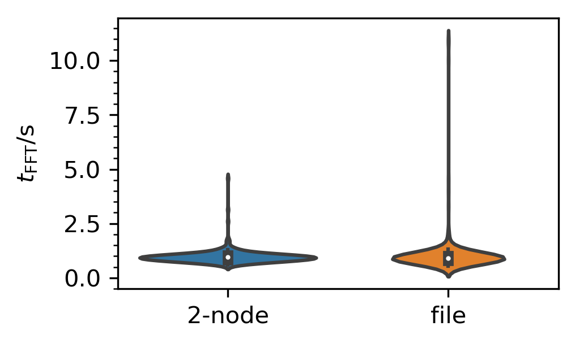
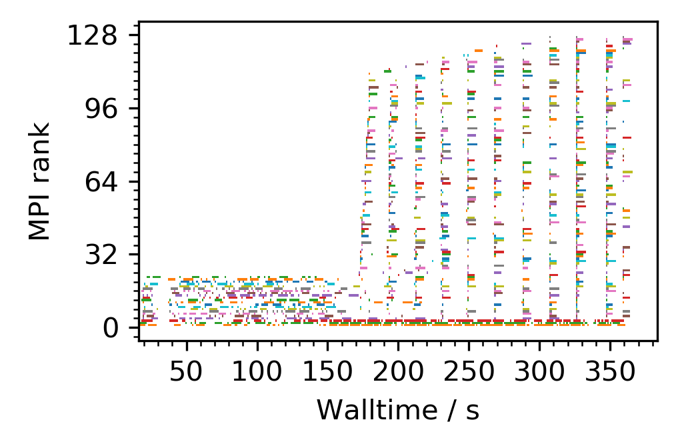
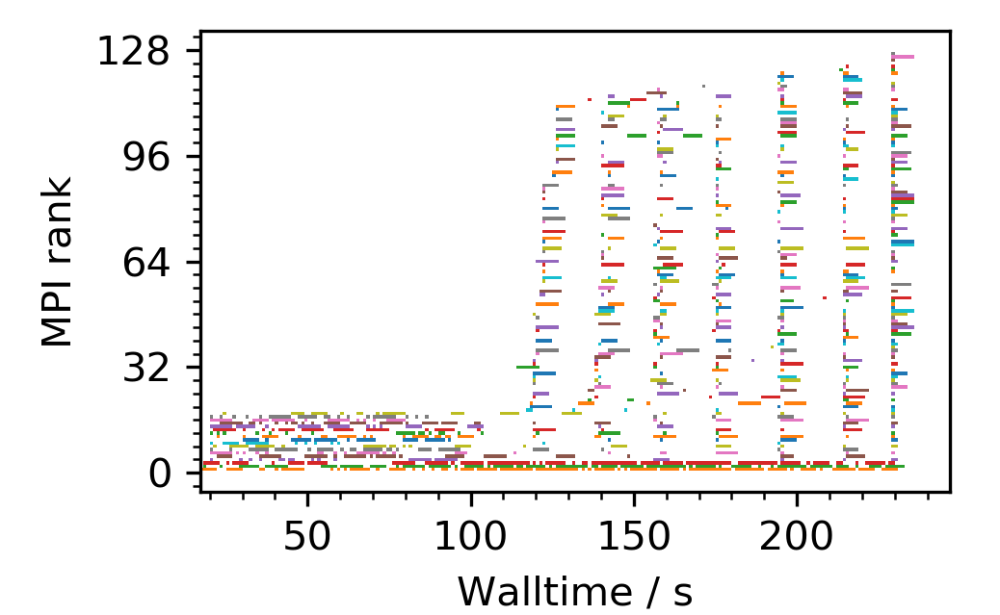
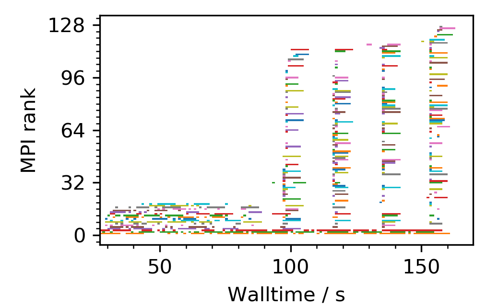

:author: Ralph Kube
:email: rkube@pppl.gov
:institution: Princeton Plasma Physics Laboratory

:author: R Michael Churchill
:email: rchurchi@pppl.gov
:institution: Princeton Plasma Physics Laboratory

:author: Jong Youl Choi
:email: choij@ornl.gov
:institution: Oak Ridge National Laboratory

:author: Ruonan Wang
:email: wangr1@ornl.gov
:institution: Oak Ridge National Laboratory

:author: Scott Klasky
:email: klasky@ornl.gov
:institution: Oak Ridge National Laboratory

:author: CS Chang
:email: cschang@pppl.gov
:institution: Princeton Plasma Physics Laboratory

:video: http://www.youtube.com/watch?v=AXG3ma_f-iM:

----------------------------------------------------------------------
Leading magnetic fusion energy science into the big-and-fast data lane
----------------------------------------------------------------------

.. class:: abstract

We present ``Delta``, a Python framework for efficient wide-area network transfer of high-velocity
high-dimensional data streams from remote scientific experiments to high-performance computing
resources for parallelized processing of typical scientific analysis workflows. Targeting magnetic
fusion research, we use DELTA to adapt an existing Python code-base that performs spectral analysis
of imaging data on single-core architectures to a code that processes the data stream on a modern
HPC architecture. ``Delta`` facilitates data transfers using the ADIOS2 I/O middleware and
dispatches data analysis tasks using PoolExecutors. For the magnetic fusion data case ``Delta``
reduces the wall-time to run the entire suite of data analysis routines from 12 hours to less than
5 minutes.

.. class:: keywords

   streaming analysis, mpi4py, queue, adios, HPC

Magnetic Fusion Energy research and its data analysis needs
-----------------------------------------------------------

Research on magnetic fusion energy (MFE) combines theoretical physics, experimental physics, engineering,
and even economics to achieve the goal of developing an unlimited, clean energy source. Python is well 
established in the fusion community through projects like plasmapy [PPY]_ or OMFIT [Men15]_. With
a plethora of scientific disciplines at its footing, scientific workflows in MFE vary significantly by 
the amount of data and computational time they require. We introduce ``Delta`` - the aDaptive nEar-reaL Time
Analysis framework - using a typical image processing workflow as a use case. We hope this tool will aid
research on magnetic fusion energy.

But before we begin, what is the goal of magnetic fusion energy research? If you could harvest the
energy from controlled nuclear fusion reactions you would have a potentially unlimited,
environmentally friendly energy source. Nuclear fusion reactions are the opposite to nuclear fission
reactions which power todays nuclear power plants. In a fusion reaction two light atomic nuclei
merge into a heavier one, while converting a fraction of the reactants binding energy into kinetic
energy of the products. As a nuclear reaction, the amount of energy released is larger by orders of
magnitude than for a chemical reaction that occurs when burning fossil fuels. And the best is that
fuel for fusion reactions are readily extracted from sea water, which is available in near-infinite quantities. 

At the same time nuclear fusion is inherently safe. In order to bring positively charged atomic
nuclei close enough together so that they fuse requires a temperature upwards of 100 million
degrees. Such a requirement unfortunately excludes any material container to confine a fusion fuel.
The most promising approach is to confine the fusion fuel in the state of a plasma - a hot gas where
the atoms are stripped of their electrons. Such a plasma can be confined in a strong magnetic field,
shaped like a donut. Since the energy yield of a fusion reaction is so large, only little
fusion plasma needs to be confined to power a fusion reactor. To produce 1 GW of fusion power,
enough to power about 700,000 homes, just 2 kg of fusion plasma would need to be burned per day
[Ent18]_. Thus, a catastrophic event such as total loss of plasma confinement can cause no more than
local damage to the plasma vessel. The physical principles of Fusion Energy also forbid uncontrolled
chain reactions.

The best performing plasma confinement devices, tokamaks, are donut shaped. Medium-sized tokamaks,
such as KSTAR [KSTAR]_, DIII-D [D3D]_, NSTX-U [NSTX]_, ASDEX Upgrade [AUG]_, MAST [MAST]_, and TCV
[TCV]_ have a major radius R=1-1.5m and a minor radius a=0.2-0.7m. In experiments at these
facilities, researchers configure parameters such as the plasma density or the shaping and strength
of the magnetic field and study the behaviour of the plasma in this setup. During a typical
experimental workflow, about 10-30 ``shots`` are performed on a given day where each shot lasts for
a couple of seconds up to minutes. Numerous measurements of the plasma and the mechanical components
of the tokamak are performed during each discharge. After a cool-down phase - the tokamaks contain
cryogenic components - the device is ready for the next shot. 

A common diagnostic in magnetic fusion experiments are so-called Electron Cyclotron Emission Imaging
(ECEI) systems [Cos74]_. They measure emission intensity by free electrons in the plasma, which
allows to infer their temperature as a function of radius. Modern ECEI systems, as the one installed
in the KSTAR tokamak [Yun14]_ have hundreds of spatial channels and sample data on a microsecond
time-scale, producing data streams upwards of 500 MB/sec. 

The aim of the ``Delta`` framework is to integrate measurement-based decision making in the
experimental workflow. This use-case falls in between two other common data analysis workflows in
fusion energy research, listed in table :ref:`timescale`. Real-time control systems for plasma
engineering components require data on a millisecond time scale. The amounts of data provided by
these algorithms is constrained by the processing time. Post-shot batch analysis of measurements on
the other hand serve scientific discovery. The data and the analysis methods are selected on a
per-case basis. By providing timely analysis results of plasma measurements to the experimentalists,
they can make more informed decisions about the next plasma shot. Such a workflow has been used in
experiments at TAE, where the machine-learning based optometrist algorithm was leveraged to
significantly increase fusion yield [Bal17]_. 

.. table:: Time-scales on which analysis results of fusion data is required for different tasks.  :label:`timescale`

    +-----------------------------+--------------------+
    |    Task                     | Time-scale         |
    +=============================+====================+
    | real-time control           | millisecond        |
    +-----------------------------+--------------------+
    | live/inter-shot analysis    | seconds, minutes   |
    +-----------------------------+--------------------+
    | scientific discovery        | hours, days, weeks |
    +-----------------------------+--------------------+

Designing the Delta framework
-----------------------------

With ``Delta`` we are aiming to connect magnetic fusion experiments to high-performance computing
(HPC) facilities. We are designing the ``Delta`` framework in a bottom-up approach, tailoring it to
the needs of the ECEI analysis workflow and a specific deployment platform in mind. While plasma
diagnostics operated at fusion experiments produce a heterogeneous set of data streams, the ECEI
analysis is representative for a large set of data streams produced by other diagnostics. HPC
environments are also rather heterogeneous. There are significant differences in local area network
topologies, such as the speed network links between data-transfer nodes to compute node and even
compute node interconnects, network security policies, and granted allocation of compute time for
research projects that make it unpractical to start with a top-down approach that generalizes will
to arbitrary HPC targets. In the remainder of this section we describe the data analysis workflow for
ECEI data, the targeted network and deployment architecture and give an overview of how ``Delta``
connects them together.

Electron Cyclotron Emission Imaging
^^^^^^^^^^^^^^^^^^^^^^^^^^^^^^^^^^^

The Electron Cyclotron Emission Imgaging diagnostic installed in KSTAR measures the electron
temperature :math:`T_e` on a 0.15m by 0.5m grid, resolved using 8 horizontal and 24 vertical
channels [Yun10]_ [Yun14]_. Each individual channel produces an intensity time series :math:`I_{h,
v}(t_i)` where h and v index the horizontal and vertical channel number and :math:`t_i = i *
\Delta_t` denotes the time where the intensity is sampled with :math:`\Delta_t \approx 1 \mu s`
being the sampling time. The voltage is digitized using a 16-bit digitizer, which produces  a data
stream of 2 byte * 192 channels * 1,000,000 samples / sec = 384 MByte/sec. The spatial view of this
diagnostic covers a significant area of the plasma cross-section which allows it to directly
visualize the large-scale structures of the plasma. Besides analyzing the normalized intensity,
several quantities calculated off the Fourier Transformed intensity :math:`X(\omega)`, here
:math:`\omega` denotes the angular frequency, are used to study the plasma dynamics. The cross-power
S, the coherence C, the cross-phase P and the cross-coherence R are defined respectively for pairs of
Fourier Transformed intensity signals :math:`X` and :math:`Y` as

.. math:: 
   S_{xy}(\omega) = E[F_x(\omega) F_y^{\dagger}(\omega)],
   :label: eq-S
   
   
.. math::
   C_{xy}(\omega) = |S_{xy}(\omega)| / \sqrt{S_{xx}(\omega)} / \sqrt{S_{yy}(\omega)},
   :label: eq-C

.. math::
   P_{xy}(\omega) = arctan(Im(S_{xy}(\omega)) / Re(S_{xy}(\omega)),
   :label: eq-P
   

and

.. math::
   R_{xy}(t) = IFFT(S_{xy}(\omega)).
   :label: eq-R
   

Here E denotes an ensemble average, :math:`^{\dagger}` denotes complex conjugation, :math:`Re` and
:math:`Im` denote the real and imaginary part of a complex number and :math:`IFFT` denotes the
inverse Fourier Transform. Spectral quantities calculated off local :math:`T_e` fluctuations, such
as the cross coherence or the cross phases, are used to identify macro-scale structures in the
plasma, so called magnetic islands [Cho17]_. Detection of magnetic islands is an important task as
they can disrupt plasma confinement.

Targeted HPC architecture
^^^^^^^^^^^^^^^^^^^^^^^^^^

Designed with a specific application in mind, we implement ``Delta`` for streaming data from KSTAR
to the National Energy Research Scientific Computing Centre (NERSC). NERSC operates Cori, a Cray
XC-40 supercomputer that is comprised of 2,388 Intel Xeon "Haswell" processor nodes, 9,688 Intel
Xeon Phi "Knight's Landing" (KNL) nodes and ranks 13 on the Top500 list. Figure :ref:`fig-topo`
illustrates the targeted network topology. Data transfers from KSTAR and NERSC originate and end at
their respective Data Transfer Node (DTN). DTNs are servers dedicated to performing data transfers.
As such, they feature large-bandwidth network interfaces, both for internal and external
connections. Table :ref:`tab1` lists the hardware of the DTNs and Cori's compute nodes. 100Gbit/s
links connect both DTNs via the internet. At NERSC, the DTN is connected to Cori with dual 10 Gbit/s
NICs. In Cori, the individual compute nodes are connected with a Cray Aries interconnect, peaking at
> 45 TB/s [cori]_.

.. figure:: plots/delta_arch.png
   :align: center
   :scale: 40%
   :figclass: w

   The network topology for which the ``Delta`` framework is designed. Data is streamed in the
   direction indicated by the orange arrow. At KSTAR, measurement data is staged from its DTN to
   the NERSC DTN. Internally at NERSC, the data stream is forwarded to compute nodes at Cori 
   and analyzed. Orange arrows mark sections of the network where ADIOS2 facilitates high-performance streaming. Black arrows denote standard TCP/IP connections. The analysis results are stored in a
   database backend and can be ingested by visualizers. :label:`fig-topo`
   

.. table:: Hardware and network interconnections of the data transfer nodes (DTNs) and compute nodes :label:`tab1`
 
    +---------------+--------------------+----------+--------------------------+
    | Where         |   CPU              |    RAM   |  NIC                     |
    +===============+====================+==========+==========================+
    | | KSTAR DTN   | | Xeon E5-2640 v4  | | 128GB  | | 100 Gbit (ext)         |
    +---------------+--------------------+----------+--------------------------+
    | |  NERSC DTN  | | Xeon E5-2680 v2  | | 128GB  | | 2 * 100 Gbit  (ext)    |
    |               |                    |          | | 2 * 10 Gbit  (int)     |
    +---------------+--------------------+----------+--------------------------+
    | | Cori compute| | Xeon E5-2698 v3  |  | 128GB | | Cray Aries             | 
    |               | |  32 threads      |          |                          |
    +---------------+--------------------+----------+--------------------------+

Connection science experiments to HPC resources
^^^^^^^^^^^^^^^^^^^^^^^^^^^^^^^^^^^^^^^^^^^^^^^

In order to connect KSTAR to Cori, ``Delta`` uses three separate software components. A
**generator** running on the KSTAR DTN, a **middle_man** running on the NERSC DTN, and a
**processor** running on Cori. The generator ingests data from an experiment and sends it to the
NERSC DTN where the middle_man is running. The middle_man forwards the received data to the
processor. The processor receives the data, executes the appropriate analysis kernels and stores the
analysis results. ``Delta`` uses ADIOS2 [adios2]_ [Liu14]_ to facilitate high bandwidth streaming
on the paths marked with orange arrows in :ref:`fig-topo`. ADIOS2 is a unified input/output system
that transports and transforms groups of self-describing data variables across different media with
performance as a main goal. Its transport interface is step-based, which resembles the generation of
scientific data. ADIOS2 implements multiple transport mechanisms as engines, such as DataMan or a
Sustainable Staging Transport (SST), which take advantage of underlying network communication
mechanisms to provide optimal performance. For the topology at hand, ``Delta`` configures ADIOS2 to
use the DataMan engine for trans-oceanic data and SST for intra-datacenter transfer.

Implementaion details
---------------------

After providing an overview of the ``Delta`` framework and introducing its component in the previous section
we continue by describing the implementation details and present performance analysis of the components. 

Components of the ``Delta`` framework
^^^^^^^^^^^^^^^^^^^^^^^^^^^^^^^^^^^^^

As shown in Fig. :ref:`fig-topo`, the architecture of ``Delta`` consists of three 
components. At the data staging site a **generator** ingests data from a local source, for example the
diagnostic digitizer, and sends it to the processing facility. At NERSC, the  **middle man**
runs on the DTN, receives the data stream from the WAN and forwards it to Cori. On cori the **processor**
runs as an MPI program, receives the data stream, performs data analysis and stores the results in a backend,
such as a database. Once stored, the analyzed can readily be ingested by visualizers, such as a dashboard. Figure 
:ref:`fig-sw-arch` visualizes the architecture, but hides the middle man for simplicity.

.. figure:: plots/delta-sw-arch.png
   :align: center
   :figclass: w
   :scale: 40%

   Schematic of the ``Delta`` framework. The **generator** runs at the data staging site and
   transmits time chunks via the ADIOS2 channels SSSSS_ECEI_NN. Here SSSSS 
   denotes the shot number and NN enumerates the ADIOS2 channels. The **processor** runs at the
   HPC site, recieves the data and submits it for processing through a ``task_list``. :label:`fig-sw-arch`.

The generator is implemented as a single-threaded application. Data is sourced using a loader class,
that handles all diagnostic specific data transformations. For the ECEI diagnostic this includes for
example calculating a channel-dependent normalization and the aggregation of data into time chunks,
:math:`n_{ch}` consecutive voltage samples. Data is transferred by a writer class which handles all
calls to ADIOS2. Pseudo-code for the generator looks like this:

.. code:: python
   :linenos:

   loader = loader_ecei(cfg["ECEI"])
   writer = writer_gen(cfg["transport_tx"])
   writer.Open()

   batch_gen = loader.batch_generator()
   for batch in batch_gen:
       writer.BeginStep()
       writer.put(batch)
       writer.EndStep()

Here, cfg is a framwork-wide json configuration file. Diagnostic-specific parameters, such as
:math:`n_{ch}` and details on how to calculate data normalization, are stored in the ``ECEI``
section. ADIOS2 parameters for the writer, such as parameters for the IO engine and connection
details are stored in the ``transport_tx`` section. Moving all diagnostic-dependent transformations
into the loader class, the generator code appears diagnostic-agnostic. We note however that in the
current version, the number of generated data batches, which is specific to the ECEI diagnostic,
defines the number of steps. Furthermore, the pseudo-code  example above demonstrates the
step-centered design of the ADIOS2 library. It encapsulates each time chunk in a single time step.

The middle-man runs on the NERSC DTN. It's task is to read data from the generator and pass it along 
to the processor. Using the classes available in ``Delta``, the pseudo-code looks similar to the
generator. But instead of a loader, a reader object is instantiated that consumes the generators
writer stream. This stream is passed to a writer object that sends the stream to the processor.

The processor is run on Cori. It receives an incoming time chunks from an ADIOS2 stream, publishes
them in a queue and submits analysis tasks to a pool of worker threads. As illustrated in
:ref:`fig-sw-arch` a ``reader`` object receives time chunks data. The time chunk data then passed to
``task_list`` objects, which group a series of analysis routines. Pseudo-code for the processor looks
like this

.. code:: python
   :linenos:

   def consume(Q, task_list):
     while True:
        try:
          msg = Q.get(timeout=5.0)
        except queue.Empty:
          break
        task_list.submit(msg)
      Q.task_done()

   def main():
      executor = MPIPoolExecutor(max_workers=NF)
      a2_reader = reader(cfg["transport_rx"])
      reader.Open()
      task_list = task_list_spectral(executor, cfg)

      dq = Queue.Queue()
      workers = []
      for _ in range(n_thr):
         w = threading.Thread(target=consume, 
                              args=(dq, task_list))
         w.start()
         workers.append(w)

      while True:
        stepStatus = reader.BeginStep()
        if stepStatus:
          stream_data = a2_reader.Get(varname)
          dq.put_nowait((stream_data, 
                         reader.CurrentStep()))
          reader.EndStep()
        else:
          break
      
      worker.join()
      dq.join()

To access the many cores available, ``processor`` needs to be run on Cori as an MPI program under
control of ``mpi4py.futures``: ``srun -n NP -m mpi4py.futures processor.py``. The number of MPI ranks
should be approximately equal to the workers requested in the PoolExecutors, ``NP == NF - 1``. 
Then ``a2_reader`` is instantiated with a configuration mirroring the one of the writer. After defining a 
Queue for Inter-process communication a series of worker threads is started. In the main loop ``a2_reader``
consumes the data stream and the data packets are inserted in the queue. The array of worker tasks 
subsequently read data from the queue and dispatch it to the data analysis code.

The actual data analysis code is implemented as cython kernels which are described in a later subsection.
While the low-level implementation of Eqs. (:ref:`eq-S`) - (:ref:`eq-R`) is in cython, ``Delta`` abstracts
them through the ``task`` class. Sans initialization the relevant class methods looks like this:

.. code:: python
   :linenos:

   class task():
   ...
   def calc_and_store(self, data, **kwargs):
     try:
       result = self.kernel(data, **kwargs)
       self.storage_backend.store(data, tidx)
      
   def submit(self, executor, data, tidx):
     ...
     _ = [executor.submit(self.calc_and_store, data, ch_it, tidx) for ch_it in (self.get_dispatch_sequence())]

The call to the analysis kernel happens in ``calc_and_store``. This member function immediately
calls the storage backend and stores the analyzed data. This allows to run the analysis task in a
``fire-and-forget`` way. Implementing analysis and storage as separate functions on the other hand
would introduce dependencies between futures returned ``executor.submit``. Grouping analysis and
storage together on the other hand guarantees that once ``calc_and_store`` returns, the data has
been analyzed and stored.  The member function ``submit`` launches ``calc_and_store`` on an executor
by iterating over ``get_dispatch_sequence()``. This method returns a list of list of channel pairs
:math:`X` and :math:`Y` where each sub-list specifies the range for which a kernel is evaluated.

Since the ECEI analysis tasks for the workflow at hand expect Fourier Transformed data, we add 
another level of abstraction by grouping them in a ``task_list`` class:

.. code:: python
   :linenos:

   from scipy.signal import stft

   class task_list():

   def submit(self, data, tidx):
     fft_future = self.executor.submit(stft, data, **kwargs)

     for task in self.task_list:
       task.submit(self.executor, fft_future.result(), tidx)

Grouping the analysis tasks after the Fourier Transformation further reduces inter-dependencies in
the workflow, i.e. the code only requires one await call. Without grouping the analysis tasks into a
task_list, one may choose to execute the Fourier Transformation in the task_class itself. This
particular choice would for example increase the number of Fourier Transformations by a factor of 4.

Explored alternative architectures
^^^^^^^^^^^^^^^^^^^^^^^^^^^^^^^^^^

``Delta`` utilizes the ``futures`` interface defined in PEP 3148. Since both Cori and ADIOS2 are
designed for MPI applications we use the ``mpi4py`` [mpi4py]_ implementation. Being a standard interface,
other implemenations like ``concurrent.futures`` can readily be used. Note that the reason why calls to
``executor.submit`` are enacpsulated in classes is to pass kernel-dependent keyword arguments. The 
Python Standard Library defines the inerface as :code:`executor.submit(fn, *args **kwargs)`. We are passing 
an executor to the ``submit`` wrapper call and class-specific information is passed to ``kwargs``.

Besides ``mpi4py`` we also explored executing ``task.calc_and_store`` calls on a ``Dask`` [dask]_ cluster.
Exposing ``concurrent.futures``-compatible interface, both libraries can be interchanged with little
work. Running on a single node we found little difference in execution speed. However once the
dask-distributed cluster was deployed on multiple nodes we observed a significant slowdown due to
network traffic overhead. We did not investigate this problem any further.

As an alternative to using a queue with threads, we also explored using asynchronous I/O. In this
scenario, the main task would define a coroutine receiving the data time chunks and a second one
dispatching them to an executor. In our tested implementation, the coroutines would run in a main loop
and communicate via a queue. Our experiments showed no measurable difference against a threaded
implementation. On the other hand, the threaded implementation fits more naturally in the multi-processing
design approach.

Using data analysis codes  ``Delta``
^^^^^^^^^^^^^^^^^^^^^^^^^^^^^^^^^^^^

In a broad sense, data analysis can be described as applying a transformation :math:`F` to
some data :math:`d`,

.. math::
   y = F(d; \lambda_1, \ldots, \lambda_n),
   :label: eq-transf

given some parameters :math:`\lambda_1 \ldots \lambda_n`. Translating the relation between the 
function and the data into an object-oriented setting is not always ambiguous. The approach taken by
packages such as scipy or scikit-learn is to implement a transformation :math:`F` as a class
and interface to data through its member functions. Taking Principal Component Analysis in 
scikit-learn as an example, the default way of applying it to data is 

.. code:: python

   from sklearn.decomposition import PCA 
   X = np.array([...])
   pca = PCA(n_components=2)
   pca.fit(X)

This approach has proven itself useful and is the common way of organizing libraries. ``Delta``
deviates slightly from this approach and calls transformations in the ``calc_and_store`` member
function of the ``task_ecei`` class. The specific kernel to be called is set in the constructor:

.. code:: python
   
   from kernels import kernel_crossphase, kernel_crosspower, ...

   class task():
      def __init__(self, cfg):
         ...
      if (cfg["analysis"] == "cross-phase"):
         self.kernel = kernel_crossphase
      elif (cfg["analysis"] == cross-power"):
         self.kernel = kernel.crosspower

      ...

     def calc_and_store(self, data, ...):
        ...
        result = self.kernel(data, ...)

At the time of writing, ``Delta`` only implements a workflow for ECEi data and this design choice 
minimizes the number of classes present in the framework. Grouping the data analysis methods by 
diagnostic also allows to collectively execute diagnostic-specific pre-transformations that are best
performed after transfer to the processing site. One may wish for example to distribute calculations of
the 18336 channel pairs among multiple instances of ``task_ecei``. This approach lets us seamlessly
do that. Once the requirements and use cases have stabilized we will explore suitable generalizations
such as object factories for the ``task_list`` class.

In summary, the architecture of ``Delta`` implements data streaming using time-stepping interface of
ADIOS2 and data analysis using PEP 3148 compatible executors. In order to increase performance we
choose to use two PoolExecutors and to group all analysis tasks. The first executor is available for
Fourier Transformations of the the input data for the entire analysis task group. The second pool
executor is available for running the analysis kernels and immediate storage of the results. 

Performance analysis
--------------------

The ``Delta`` framework aims to facilitate near real-time intra-shot data analysis by leveraging
remote HPC resources. While the overall performance of the framework can be measured by the walltime
of the analysis workflow at hand, the complex composition of the framework requires to understand
the performance of its building blocks. Referring to figure :ref:`fig-sw-arch`, both the ADIOS2
communication performance, the asynchronous receive-publish-submit strategy of the processor, and
the speed of the individual analysis kernels contribute to the workflow walltime. Furthermore, the
workflow walltime may also be sensitive to how the different components of the framework interact.
For example, even though the processor design aims to facilitate high-velocity data streams by using
queues and multiple worker threads, the data streams may still significantly affect the performance.
Given these considerations we start be investigating the performance of individual components in
this section and finally investigate the performance of the framework on the ECEI workflow.

Performance of the WAN connections
^^^^^^^^^^^^^^^^^^^^^^^^^^^^^^^^^^

To measured the practically available bandwidth between the KSTAR and NERSC DTNs using iperf3
[iperf]_.
Multiple data streams are often necessary to exhaust high-bandwidth networks. Varying the number of
senders from 1 to 8, we measure data transfer rates from 500 MByte/sec using 1 process up to a peak
rate of 1500 MByte/sec using 8 processes, shown in Figure :ref:`kstar-dtn-xfer`. Using 1 thread we
find that the data transfer rate is approximately 500 MByte/sec with little variation throughout the
benchmakr. Running the 2 and 4 process benchmark we see initial transfer rates of more than 1000
MByte/sec. After about 5 to 8 seconds, TCP observes network congestion and falls back to fast
recovery mode where the transfer rates increase to the approximately the initial transfer rates
until the end of the benchmark run. The 8 process benchmark shows a qualitatively similar behaviour
but the congestion avoidance starts at approximately 15 seconds where the transfer enters a fast
recovery phase.

.. figure:: plots/kstar_dtn_xfer.png
   :scale: 100%
   :figclass: h

   Data transfer rates between the KSTAR and NERSC DTNs measured using iperf3
   using 1, 2, 4, and 8 processes :label:`kstar-dtn-xfer`

While we measured the highest bandwidth for the 8 process transfer, ``Delta`` currently only implements 
data transfers with a single writer process.

Data Analysis Kernels 
^^^^^^^^^^^^^^^^^^^^^

Foreshadowed in the code-example above, ``Delta`` implements data analysis routines as computational
kernels. These are implemented in cython to circumvent the global interpreter lock and utilize 
multiple cores. For example the coherence :math:`C`, Eq. (:ref:`eq-C`), is implemented as

.. code:: python

  @cython.boundscheck(False)
  @cython.wraparound(False)
  @cython.cdivision(True)
  def kernel_coherence_64_cy(cnp.ndarray[cnp.complex128_t, 
                                         ndim=3] data, 
                                         ch_it, 
                                         fft_config):
      cdef size_t num_idx = len(ch_it)      # Length of index array
      cdef size_t num_fft = data.shape[1]   # Number of fft frequencies
      cdef size_t num_bins = data.shape[2]  # Number of ffts
      cdef size_t ch1_idx, ch2_idx
      cdef size_t idx, nn, bb # Loop variables
      cdef double complex Sxx, Syy, _tmp
      
      cdef cnp.ndarray[cnp.uint64_t, ndim=1] ch1_idx_arr =
         np.array([int(ch_pair.ch1.idx()) for ch_pair in ch_it], 
                  dtype=np.uint64)
      cdef cnp.ndarray[cnp.uint64_t, ndim=1] ch2_idx_arr = 
         np.array([int(ch_pair.ch2.idx()) for ch_pair in ch_it], 
                  dtype=np.uint64)
      cdef cnp.ndarray[cnp.float64_t, ndim=2] result = 
         np.zeros([num_idx, num_fft], dtype=np.float64)

      with nogil: 
          for idx in prange(num_idx, schedule=static):
              ch1_idx = ch1_idx_arr[idx]
              ch2_idx = ch2_idx_arr[idx]
  
              for nn in range(num_fft):
                  _tmp = 0.0
                  for bb in range(num_bins):
                      Sxx = data[ch1_idx, nn, bb] * 
                        conj(data[ch1_idx, nn, bb])
                      Syy = data[ch2_idx, nn, bb] * 
                        conj(data[ch2_idx, nn, bb])
                      _tmp +=  data[ch1_idx, nn, bb] * 
                               conj(data[ch2_idx, nn, bb]) / 
                               csqrt(Sxx * Syy)
  
                  result[idx, nn] = creal(cabs(_tmp)) 
                                   / num_bins
      return(result) 

The arguments passed to the kernel are the three-dimensional array of Fourier Coefficients,
``ch_it`` - an iterator over the channel lists, and ``fft_config`` - a dictionary of parameters used 
for the Fourier Transformation. While the data stream produced by the ECEi diagnostic is only 
two-dimensional, ``fft_data`` is three-dimensional as we use a Short Time Fourier Transformation.
The second argument ``ch_it`` is an iterator over a list of channel pairs, defining linear index pairs 
for the channels :math:`X` and :math:`Y` for which to calculate :math:`C`. After defining the output
array and temporary data, the kernel opens a section where it discards the global interpreter lock.
This is crucial for executing the enclosed section with multiple threads.

The ranges of the three for loops within these section decrease by order of magnitude. 
For the full ECEI dataset, ``ch_it`` spans 18336 distinct channel pairs, 512 to 1024 Fourier 
Coefficients are calculated for a total of 19 to 38 sliding window bins. After each for-loop header we
instruct to cache data. Additionally, the channel pairs in ``ch_it`` are a tuple of integers and sorted
by the first item. These measures allow to better utilize the CPU cache. 

.. figure:: plots/kernel_performance.png
   :scale: 100%

   Runtime of the multi-threaded kernels for coherence :math:`C`, cross-power :math:`S` and cross-phase :math:`P` compared against numpy implementations. :label:`kernel-perf`

Figure :ref:`kernel-perf` demonstrates a strong scaling of the kernels calculating Eqs.(:ref:`eq-S`) - (ref:`eq-R`)
for up to 16 threads. Using more 32 threads results in sub-linear speedup. We note here that this benchmark was
performed on a single Cori compute node with 32 cores and 64 threads. 

Performance of the ECEI workflow
^^^^^^^^^^^^^^^^^^^^^^^^^^^^^^^^

After having benchmarked the performance of individual components we continue by benchmarking the performance 
of ``Delta`` on the entire ECEI workflow. The task at hand is to calculate Eqs.(:ref:`eq-S`) - (ref:`eq-R`) 
for 18836 unique channel pairs per time chunk. Each time chunk represents 10,000 samples for 192 individual
samples and in total we process 500 time chunks. The size of the data to analize is approximately 5 GByte.

To better understand the interplay of the individual compoments and the performance of the design
choices, we benchmarked the runtime of the ``Delta`` ECEI workflow in three scenarios. In the
``file`` scenario, the processor reads data from a local data file. No data is streamed. In the
``2-node`` scenario, data is streamed from the NERSC DTN to Cori using the ADIOS2 DataMan backend.
In the ``3-node`` scenario, data is streamed from the KSTAR DTN to the NERSC DTN and forwared to
Cori. The workflow walltimes of these scenarios are listed in :ref:`walltimes`.  All runs are
performed on an allocation using 8 Cori nodes partitioned into 32 MPI ranks with 16 Threads each for
a total of 2048 CPU cores.

.. table:: Walltime and number of processesed time chunk for the ECEI workflow in different configurations .  :label:`walltimes`

    +-------------+----------+-----------+----------+
    | Scenario    | Walltime | processed |  Average |
    +=============+==========+===========+==========+
    | file        | 352s     | 500       | 0.70s    |
    +-------------+----------+-----------+----------+
    | 2-node      | 221s     | 318       | 0.69     |
    +-------------+----------+-----------+----------+
    | 3-node      | 148s     | 193       | 0.77     |
    +-------------+----------+-----------+----------+

The walltime for the file-based workflow is 352s, about 221s for the 2-node scenario and ... for the
3-node scenario. A reason for this can be found in how the high-velocity data I/O affects the
receive-publish-submit architecture implemented by the processor and is explained in the following.

``Delta`` uses a queue to communicate between the reader and the PoolExecutor. Figure :ref:`delta-perf-queue` shows 
the time that the time chunks are enqueued. We find that even tough reading from the filesystem should be faster
than streaming, data spends on average less time in the 2-node streaming scenario than in the file scenario.

.. figure:: plots/performance_time_subcon.png
   :scale: 100%

   Time that the individual time chunks are queued. The color legend is shown in Figure 6 :label:`delta-perf-queue`

As a time chunk is read from the queue, a STFT is executed. The time where this occurs to the individual time-chunks 
is shown in :ref:`delta-fft-tstart`. The beginning of each horizontal bar indicates where a time chunk is submitted 
to **executor_fft** and the length of each bar denotes the time it takes to execute the STFT. The beginning of 
each horizontal bar co-incides with the end of the bar in :ref:`delta-perf-queue`. In :ref:delta-fft-perf` we plot
the distribution of the walltimes it takes to perform the STFT. In both scenarios, the time it takes to perform 
an STFT on the executor is approximately one second. Both cases also show outliers where it takes up to 10 seconds 
to perform a STFT. These outliers usually occur in the first few time steps where the many processes are spawned.
MPI process spawning is an expensive process we do not observe such long execution times after the startup.

.. figure:: plots/performance_fft.png
   :scale: 100%

   Time where the individual time chunks are Fourier Transformed :label:`delta-fft-tstart`

   Distribution of the time it takes to perform a Fourier Transformation on **executor_fft** :label:`delta-fft-perf`

In Figures :ref:`delta-perf-file` and :ref:`delta-perf-2node` we show the timing and utilization of MPI ranks
running data analysis kernels. These show that once all data has been Fourier transformed, all available MPI ranks start 
executing data analysis kernels. There is little difference between the kernel runtime in the total workflow and in the
benchmarks shown in the previous section.

   Timing and utilization of the MPI ranks executing data analysis kernels for the ``file`` scenario :label:`delta-perf-file`

   Timing and utilization of the MPI ranks executing data analysis kernels for the ``2-node`` scenario :label:`delta-perf-2node`

   Timing and utilization of the MPI ranks executing data analysis kernels for the ``3-node`` scenario :label:`delta-perf-3node`

Conclusions and future work
---------------------------

We have demonstrated that ``Delta`` can facilitate near real-time analysis of high-velicty big streaming data.
``Delta`` on Cori can execute the ECEI workflow in less than 4 minutes. Using a single-core pure python implementation this
would take about 4 hours. 

Due to limitations on Cori, we are limited to using a single PoolExecutor. Separate Executors should be used for the
analysis kernels and the FFT.

Future work will extend ``Delta`` on multiple fronts. For one, the next generation HPC facilities will use 
nVidias Ampere GPU. These will come available in 2021 and we are looking to explore GPU computing for the
computationally demanding parts of the framework.
Second, we look to include machine learning inference workloads on the processor. This could be disruption 
detection as described for ECEI data in RMCs paper.

We also investigate how to make ``Delta`` more adaptive. This could include using machine learning 
at the sender side to stream only really interesting data and have it analyzed extra carefully. And for standard
cases you would only run default analysis.

Making delta adaptiv by
Allow other diagnostic data to be transferred
Real-time detection of interesting features, coupled to compression
ECEi has large view, maybe we need fewer channels

Acknowledgements
----------------
The authors would like to acknowledge the excellent technical support from engineers and developers
at the National Energy Research Scientific Computing Center in developing delta. This work used
resources of the National Energy Research Scientific Computing Center (NERSC), a U.S. DOE Office of
Science User Facility operated under Contract No. DE-AC02-05CH11231.

References
----------

.. [PPY] https://www.plasmapy.org

.. [Men15] O. Meneghini, S.P. Smith, L.L. Lao et al. *Integrated modeling applications for tokamak experiments with OMFIT*
         Nucl. Fusion **55** 083008 (2015)

.. [Ent18] S. Entler, J. Horacek, T. Dlouhy and V. Dostal *Approximation of the economy of fusion energy*
           Energy 152 p. 489 (2018)

.. [D3D] DIII-D http://www.ga.com/diii-d

.. [NSTX] NSTX https://www.pppl.gov/nstx

.. [KSTAR] KSTAR Tokamak https://www.nfri.re.kr/kor/index

.. [AUG] ASDEX Upgrade https://www.ipp.mpg.de/16195/asdex

.. [MAST] Mega Amp Spherical Tokamak https://ccfe.ukaea.uk/research/mast-upgrade/

.. [TCV] https://www.epfl.ch/research/domains/swiss-plasma-center/research/tcv/research_tcv_tokamak/

.. [Cos74] A.E Costley, R.J. Hastie, J.W.M. Paul, and J. Chamberlain *Electron Cyclotron Emission from a Tokamak Plasma: Experiment and Theory*
           Phys. Rev. Lett. 33 p. 758 (1974).

.. [Yun14] G.S. Yun, W. Lee, M.J. Choi et al. *Quasi 3D ECE imaging system for study of MHD instabilities in KSTAR*
           Rev. Sci. Instr. 85 11D820 (2014)
           http://dx.doi.org/10.1063/1.4890401

.. [Bal17] E.A. Baltz, E. Trask, M. Binderbauer et al. *Achievement of Sustained Net Plasma Heating in a Fusion Experiment with the Optometrist Algorithm*
           Sci. Reports 6425 (2017)
           https://doi.org/10.1038/s41598-017-06645-7

.. [Bel18] V. A. Belyakov and A. A. *Kavin Fundamentals of Magnetic Thermonuclear Reactor Design*
           Chapter 8 Woodhead Publishing Series in Energy

.. [Yun10] G. S. Yun, W. Lee, M. J. Choi et al. *Development of KSTAR ECE imaging system for measurement of temperature fluctuations and edge density fluctuations*
           Rev. Sci. Instr. 81 10D930 (2010)
           https://dx.doi.org/10.1063/1.3483209

.. [Cho17] M. J. Choi, J. Kim, J.-M. Kwon et al. *Multiscale interaction between a large scale magnetic island and small scale turbulence*
           Nucl. Fusion **57** 126058 (2017)
           https://doi.org/10.1088/1741-4326/aa86fe

.. [cori] https://docs.nersc.gov/systems/cori/

.. [nerscdtn] https://docs.nersc.gov/systems/dtn/

.. [iperf] https://iperf.fr

.. [adios2] https://adios2.readthedocs.io/en/latest/index.html

.. [Liu14] Q. Liu, J. Logan, Y. Tian et al. *Hello ADIOS: the challenges and lessons of developing leadership class I/O frameworks*
           Concurrency Computat.: Pract. Exper. **26** 1453-1473 (2014).

.. [PEP3148] https://www.python.org/dev/peps/pep-3148/

.. [mpi4py] https://mpi4py.readthedocs.io/en/stable/

.. [dask] https://dask.org

.. [FFT] G. Heinzel, A. Rüdiger, R. Schilling, *Spectrum and spectral density estimation by the Discrete Fourier transform (DFT), including a comprehensive list of window functions and some new flat-top windows*
         Max Planck Institute für Gravitationsphysik (Albert-Einstein-Institut) Feb. 2002