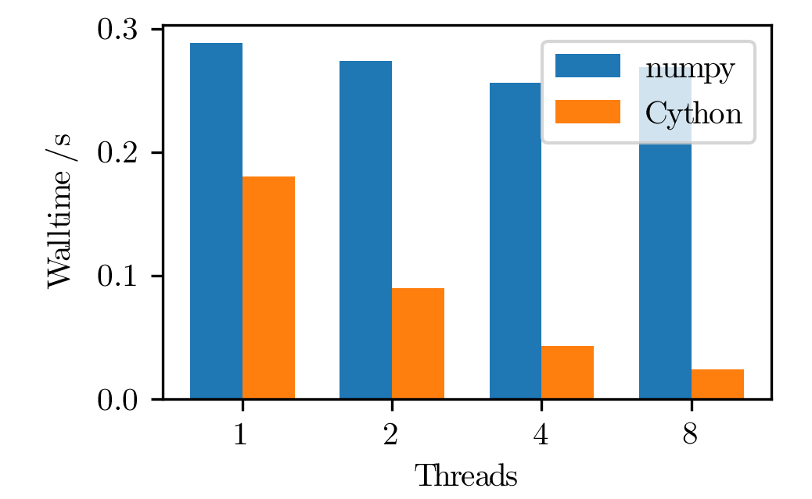
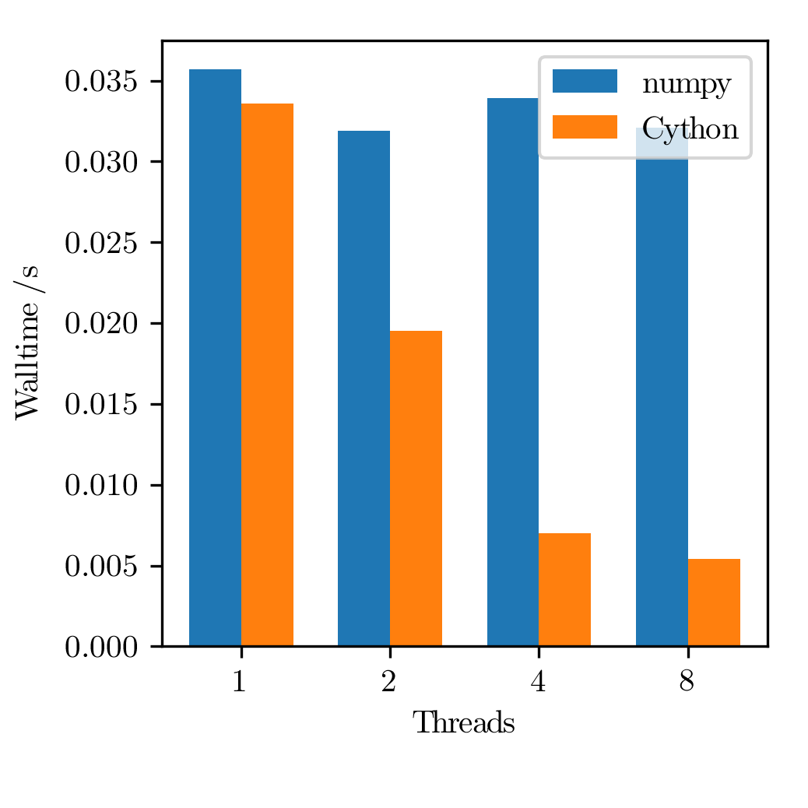
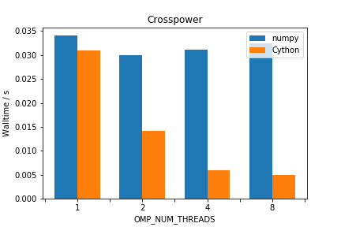

:author: Ralph Kube
:email: rkube@pppl.gov
:institution: Princeton Plasma Physics Laboratory

:author: R Michael Churchill
:email: rchurchi@pppl.gov
:institution: Princeton Plasma Physics Laboratory

:author: Jong Youl Choi
:email: choij@ornl.gov
:institution: Oak Ridge National Laboratory

:author: Ruonan Wang
:email: wangr1@ornl.gov
:institution: Oak Ridge National Laboratory

:author: Scott Klasky
:email: klasky@ornl.gov
:institution: Oak Ridge National Laboratory

:author: CS Chang
:email: cschang@pppl.gov
:institution: Princeton Plasma Physics Laboratory

:video: http://www.youtube.com/watch?v=AXG3ma_f-iM:

----------------------------------------------------------------------
Leading magnetic fusion energy science into the big-and-fast data lane
----------------------------------------------------------------------

.. class:: abstract

We present the DELTA framework, a Python framework for efficient wide-area network 
transfer of high-velocity high-dimensional data streams from remote scientific experiments, sent to 
HPC resources for parallelized processing of typical scientific analysis workflows. Targeting 
magnetic fusion research, we accelerate the analysis of a plasma imaging diagnostic that produces
a high-dimensional data stream upwards of 500MB/sec. Using the DELTA framework we adapt the existing
Python code-base that runs in batch mode using single-core methods to a code processing large data 
streams with modern, distributed HPC architectures. We facilitate all data transfers using the ADIOS2
I/O middleware and implement the data analysis tasks using the PoolExecutor model. For the test 
case of 10 seconds of imaging measurements, we reduce the wall-time for a suite of spectral diagnostics
from 12 hours to about 10 minutes.

.. class:: keywords

   streaming analysis, mpi4py, queue, adios, HPC

Introduction
------------

If you could harvest the energy from controlled nuclear fusion reactions you would have 
a potentially unlimited, environmentally friendly energy source. Nuclear fusion reactions
are the opposite to nuclear fusion reactions, which are used in todays nuclear power plants.
In a fusion reaction two light atomic nuclei merge into a heavier one, while converting a 
small fraction of the binding energy of the reactants into kinetic energy of the products.
As a nuclear reaction, the amount of energy released is many orders of magnitude larger
than for a chemical reaction, such as oxidization of carbon when burning coal.
At the same time nuclear fusion reactions are inherently safe. To bring positively charged
atomic nuclei close enough together so that they fuse requires temperatures upwards of
100 million degrees. Such a requirement unfortunately excludes any material container to
confine a fusion fuel. The most promising approach to confine a fusion fuel is in the 
state of a plasma - a hot gas where the atoms are stripped of their electrons. Such a 
plasma can be confined in a donut-shaped by strong magnetic fields. Since the energy yield 
of a fusion reaction is so large, only a small amount of fusion plasma needs to be confined
to power a fusion reactor. To produce 1 GW of fusion power, enough to power about 700,000 homes, 
only 2 kg of fusion plasma would need to be burned per day [Ent18]_. Thus, a catastrophic event
such as loss of plasma confinement would only lead to local damage to the plasma vessel. with
Fusion, no uncontrolled chain reactions are possible. Under operation, plasma facing components of
the vessel will be activated. Due to the characteristic energies of fusion reaction, the weakly 
active materials will be safe to handle after about 10-20 years. Fuels for fusion reactions are readily
extracted from sea water, which is available in near-infinite quantities. 

The plasma confinement devices with the best performance have a toroidal geometry, such as a 
tokamak. Medium-sized tokamaks, such as DIII-D [D3D]_, NSTX-U [NSTX]_, ASDEX Upgrade [AUG]_,
MAST [MAST]_, TCV [TCV]_ or KSTAR [KSTAR], have a major radius R=1-1.5m and a minor radius a=0.2-0.7m. 
During a typical experimental campaign, about 10-30 ``shots`` are performed on a given day. 
By configuring paramaters such as the plasma density, type and magnitude of external heating,
the strength of the magnetic field, researchers are studying the behaviour of the fusion plasma
in this configuration. A typical plasma shot lasts a couple of seconds up to minutes, a time in which
numerous measurements of the plasma and the mechanical components of the tokamak are performed. After
a cool-down phase - any large tokamak contains cryogenic components - the device is ready for the 
next shot. In this short break researchers and engineers may look at preliminary data and 
make decisions on whether to follow the experimental plan or to depart from it based on new data.
This decision making is sometimes aided by reduced model simulations that are fast enough to run
in between shots. Given the size of fusion experiments, with hundreds of staff on site, numerous
collaborators scattered around may also be involved and interested in timely results of any experimental
activity.

Need refs here to reduced models etc.

A common type of measurement is the samping of the emission intensity by free electrons in the plasma,
which allows to infer their temperature as a function of radius [Cos74]_. These so-called Electron
Cyclotron Emission Imaging (ECEI) diagnostic image the plasmas emission. Modern ECEI systems, as the 
one installed in the KSTAR tokamak [Yun14]_ have hundreds of spatial channels and sample data on a microsecond 
time-scale, producing data stream upwards of 500 MB/sec. Providing timely analysis results of 
plasma measurements to interested parties would provide multiple benefits. For one, such an 
analysis may provide information to perform inter-shot optimization. This optimization could also 
be performed in combination with machine-learning algorithms, similar to the workflow that incorporates
the optometrist algorithm [Bal17]_.

Here we present the ``Delta`` framework which is designed to facilitate near-real time analysis of big
and fast fusion data. 

This presentation will guide the audience through the adaptation process and will demonstrate how 
HPC python packages including mpi4py, threading, and queue are used and optimized for performance. 
To establish a baseline, we start by describing the implementation and limitations of the original 
code base. 

Proceeding we connect the data generation site, the KSTAR fusion facility in Korea, with the 
compute facility, the Cori Cray XC-40 supercomputer in California, USA. Cori is operated by the 
U.S. National Energy Research Scientific Computing Center and ranks 13 on the Top500 list. For this 
task, we use the ADIOS2 I/O middleware for the wide-area network (WAN) data transfer, which is part 
of the exascale computing project. We highlight the newly developed WAN-capabilities of ADIOS2 for 
low-latency streaming I/O. We show how to efficiently implement asynchronous data processing, using 
threading and queue to process the data streams into analysis workers. 

We continue by showing how the original code-base is adapted to the distributed computing 
architecture of modern HPC facilities by factoring the diagnostic routines into computational 
kernels and interfacing them to a pool executor. Using the executor models implemented by 
the mpi4py package we demonstrate the scaling of the new analysis routines on Cori. We further 
explore how embarrassingly parallel diagnostic kernels are accelerated using task-based 
parallelization and vectorization and some pitfalls to avoid. 

Analysis of measurements taken in experiments on magnetic fusion energy are
typically performed batch-wise after the experiment has concluded. 

.. _table:: Time-scales on which analysis results of fusion data is required for different tasks.  :label:`timescale`

    +---------------+------------------+--------------------+
    |    Task       | Time-scale       | code-name          |
    +===============+==================+====================+
    | real-time     | millisecond      | [Bel18]_           |
    | control       |                  |                    |
    +---------------+------------------+--------------------+
    | inter-shot    | seconds,         | ``Delta``          |
    | analysis      | minutes          |                    |
    +---------------+------------------+--------------------+
    | post-shot     | hours,days,weeks | fluctana           |
    | batch analysis|                  |                    |
    +---------------+------------------+--------------------+

Data analysis for Electron Cyclotron Emission Imaging diagnostic
^^^^^^^^^^^^^^^^^^^^^^^^^^^^^^^^^^^^^^^^^^^^^^^^^^^^^^^^^^^^^^^^

The Electron Cyclotron Emission Imgaging diagnostic installed in the KSTAR tokamak 
measures the electron temperature :math:`T_e` on a 0.15m by 0.5m grid, resolved using 8 horizontal
and 24 vertical channels [Yun10]_ [Yun14]_. Each individual channel produces an intensity time series
:math:`I_{h, v}(t_i)` where h and v index the horizontal and vertical channel number and
:math:`t_i = i * \Delta_t` denotes the time where the intensity is sampled with 
:math:`\Delta_t \approx 1 \mu s` being the sampling time. Digitizing the samples with a 16-bit 
digitizer results in a data stream of 2 byte * 192 channels * 1,000,000 samples / sec = 384 MByte/sec.
The spatial view of this diagnostic covers a significant area of the plasma cross-section which allows it to directly visualize the large-scale 
structures of the plasma. Besides analyzing the normalized intensity, several quantities calculated 
off the Fourier Transformed intensity :math:`X(\omega)`, where :math:`\omega` denotes the angular frequency, are used
to study the plasma dynamics. The cross-power S, the coherence C, the cross-phase P and 
the cross-coherence R are respectively defined for two Fourier Transformed intensity signals X and Y as

.. math:: 
   S_{xy}(\omega) = E[F_x(\omega) F_y^{\dagger}(\omega)],
   :label: eq-S
   
   
.. math::
   C_{xy}(\omega) = |S_{xy}(\omega)| / \sqrt{S_{xx}(\omega)} / \sqrt{S_{yy}(\omega)},
   :label: eq-C

.. math::
   P_{xy}(\omega) = arctan(Im(S_{xy}(\omega)) / Re(S_{xy}(\omega)),
   :label: eq-P
   

and

.. math::
   R_{xy}(t) = IFFT(S_{xy}(\omega)).
   :label: eq-R
   

Here E denotes an ensemble average, :math:`^{\dagger}` denotes complex conjugation, :math:`Re` and
:math:`Im` denote the real and imaginary part of a complex number and :math:`IFFT` denotes the
inverse Fourier Transform. Spectral quantities calculated off local :math:`T_e` fluctuations, such
as the cross coherence or the cross phases, can be used to identify macro-scale structures in the
plasma, so called magnetic islands [Cho17]_. Detection of magnetic islands is an important task as
they can disrupt plasma confinement.

Commonly, diagnostic data as produced by the ECEI is analyzed manually batch-wise, often hours,
days, or weeks after a given plasma shot. The researchers doing this obtain the raw data files and
maybe a copy of common analysis routines or they write their own analysis codes. Then the channel
pairs for which quantities like (:ref:`eq-S`) are to be computed are specified by hand. The output
and visualization is stored in another file. 

Abundant high performance computing resources make it possible to design a streaming workflow for
this analysis task. Modern high-performance computing (HPC) resources provide ample computing power
to perform calculations of all relevant spectral quantities, for any given channel pair in near
real-time. Furthermore, the calculated quantities can be stored indefinitely for future access
together with sufficient meta-data to know what the people who wrote the data did. With appropriate
reduction, these data can also be distributed to interested parties, internationally distributed
teams of researchers, in near real-time.

A streaming workflow for big and fast fusion data
-------------------------------------------------

We are designing the ``Delta`` framework in a bottom-up approach, tailoring it to the needs of the
ECEi analysis workflow and with a specific deployment scenario in mind. While plasma diagnostics 
operated at fusion experiments produce a heterogeneous set of data streams, the ECEi analysis workflow 
is still representative for a large set of data streams produced by other diagnostics. HPC environments
are also rather heterogeneous. There are significant differences in local area network topologies, such 
as the speed of DTN to compute node links and even compute node interconnects, network security policies,
and granted allocation of compute time for research projects that make it unpractical to start with a 
top-down approach that generalizes will to arbitrary HPC targets.

Designed with a specific application in mind, we implement ``Delta`` for streaming from KSTAR to the 
National Energy Research Scientific Computing Centre (NERSC), using Cori as a HPC resource.
Cori is a Cray XC-40 supercomputer operated by NERSC, is comprised of 2,388 Intel Xeon "Haswell"
processor nodes, 9,688 Intel Xeon Phi "Knight's Landing" (KNL) nodes and ranks 13 on the Top500 list.
Figure :ref:`fig-topo` illustrates the network topology which ``Delta`` targets. KSTAR and NERSC are
connected through the Internet with specialized Data Transfer Nodes as boundary nodes. These are servers
dedicated to performing data transfers. As such, they feature large-bandwidth network interfaces, both 
for internal and external
connections. Table :ref:`tab1` lists the hardware of the DTNs and Cori's compute nodes. 100Gbit/s links
connect both DTNs via the internet. At NERSC, the DTN is connected to Cori with dual 10 Gbit/s NICs.
In Cori, the individual compute nodes are connected with a Cray Aries interconnect, peaking at > 45 TB/s
[cori]_.

.. figure:: plots/delta_arch.png
   :align: center
   :scale: 40%
   :figclass: w

   The network topology for which the ``Delta`` framework is designed. Data is streamed in the
   direction indicated by the orange arrow. At KSTAR, measurement data is staged from its DTN to
   the NERSC DTN. Internally at NERSC, the data is forwarded to compute nodes at the Cori supercomputer
   and analyzed. Orange arrpws mark high-performance streaming sections of the network. Black links
   denote standard TCP/IP connections. The analysis results are stored in a database backend and can be 
   ingested by visualizers. :label:`fig-topo`
   

.. table:: Hardware and network interconnections of the data transfer nodes (DTNs) and compute nodes :label:`tab1`
 
    +---------------+--------------------+----------+--------------------------+
    | Where         |   CPU              |    RAM   |  NIC                     |
    +===============+====================+==========+==========================+
    | | KSTAR DTN   | | Xeon E5-2640 v4  | | 128GB  | | 100 Gbit (ext)         |
    +---------------+--------------------+----------+--------------------------+
    | |  NERSC DTN  | | Xeon E5-2680 v2  | | 128GB  | | 2 * 100 Gbit  (ext)    |
    |               |                    |          | | 2 * 10 Gbit  (int)     |
    +---------------+--------------------+----------+--------------------------+
    | | Cori compute| | Xeon E5-2698 v3  |  | 128GB | | Cray Aries             | 
    |               | |  32 threads      |          |                          |
    +---------------+--------------------+----------+--------------------------+

Facilitating high-velocity data streams
^^^^^^^^^^^^^^^^^^^^^^^^^^^^^^^^^^^^^^^

To measured the practically available bandwidth between the KSTAR and NERSC DTNs using iperf3
[iperf]_.
Multiple data streams are often necessary to exhaust high-bandwidth networks. Varying the 
number of senders from 1 to 8, we measure data transfer rates from 500 MByte/sec using 1 
process up to a peak rate of 1500 MByte/sec using 8 processes, shown in Figure :ref:`kstar-dtn-xfer`.
Using 1 thread we find that the data transfer rate is approximately 500 MByte/sec with little 
variation throughout the benchmakr. Running the 2 and 4 process benchmark we see initial transfer
rates of more than 1000 MByte/sec. After about 5 to 8 seconds, TCP observes network congestion and
falls back to fast recovery mode where the transfer rates increase to the approximately the 
initial transfer rates until the end of the benchmark run. The 8 process benchmark shows a
qualitatively similar behaviour but the congestion avoidance starts at approximately 15 seconds
where the transfer enters a fast recovery phase.

.. figure:: plots/kstar_dtn_xfer.png
   :scale: 100%
   :figclass: h

   Data transfer rates between the KSTAR and NERSC DTNs measured using iperf3
   using 1, 2, 4, and 8 processes :label:`kstar-dtn-xfer`

``Delta`` uses ADIOS2 [adios2]_ for streaming data from KSTAR to NERSC and within NERSC from the 
DTN to Cori. These connections are marked orange in :ref:`fig-topo`. ADIOS2 is a unified input/output 
system that transports and transforms groups of self-describing data variables across different media 
with performance as a main goal. It groups variables by default and its transport interface is step-based,
which resembles the generation of scientific data. ADIOS2 implements multiple transport mechanisms as 
engines, such as DataMan or a Sustainable Staging Transport (references here?), which take advantage of
underlying network communication mechanisms to provide optimal performance.

``Delta`` uses the DataMan engine for trans-oceanic data transfer from KSTAR to NERSC.

``Delta`` uses the SST engine for data staging from the NERSC DTN to Cori. 

Architecture of the ``Delta`` framework
^^^^^^^^^^^^^^^^^^^^^^^^^^^^^^^^^^^^^^^

Following the network layout in :ref:`fig-topo`, the basic architecture of ``Delta`` consists of three 
components. At the data staging site a **generator** ingests data from a local source, for example the
diagnostic digitizer, and sends it to the processing facility. At the HPC network a **middle man**, 
running on the DTN, receives the data stream from the WAN and forwards it to the compute nodes. 
On the compute nodes, a **processor** receives the stream and distributes it among the compute nodes. 
The **processor** ranks consume the stream and store results in a backend, such as a database. Once
stored, the analyzed can readily be ingested by visualizers, such as a dashboard. Figure 
:ref:`fig-sw-arch` visualizes the architecture, but leaves out the middle man for simplicity.

.. figure:: plots/delta-sw-arch.png
   :align: center
   :figclass: w
   :scale: 40%

   Schematic of the ``Delta`` framework. The **generator** runs at the data staging site and
   transmits time chunks to the **processor** via the ADIOS2 channels SSSSS_ECEI_NN. Here SSSSS 
   denotes the shot number and NN enumerates the ADIOS2 channels.  :label:`fig-sw-arch`.

The generator is implemented as a single-threaded application. Data is sourced using a loader
class, such as loader_ecei, that handles all diagnostic specific data transformations. For the
ECEi diagnostic this includes for example calculating a channel-dependent normalization and 
the aggregation of data into time chunks. A time chunk are n_{ch} consecutive channel voltage samples.
The generator instantiates a loader and a writer before starting the main loop. In the main loop,
the generator iterates over the time chunks, exposed by the ``get_batch`` method, and stages them
for transport throug the ``put_data`` method of the writer. Pseudo-code for the generator looks like
this:

.. code:: python
   :linenos:

   loader = loader_ecei(cfg["ECEI"])
   writer = writer_gen(cfg["transport_tx"])
   writer.Open()

   batch_gen = loader.batch_generator()
   for batch in batch_gen:
       writer.BeginStep()
       writer.put_data(batch)
       writer.EndStep()

Here, cfg is a json configuration file is a framework-wide configuration file. Diagnostic-specific
parameters, such as n_{ch}, as stored in the ``ECEI`` section. ADIOS2 parameters for the writer,
such as to use the DataMan IO engine, are stored in the ``transport_rx`` section.
Moving all diagnostic-dependent transformations into the loader class, the generator code 
appears diagnostic-agnostic. We note however that in the current version, the number of 
generated data batches, which is specific to the ECEi diagnostic, defines the number of 
steps. This issue will be addressed in future version of the workflow. Furthermore, the pseudo-code 
example above demonstrates the step-centered design of the ADIOS2 library. It encapsulates 
each time chunk in a single time step.

On the data processing facility, a processor receives the incoming data stream and dispatches 
specified analysis tasks. In pseudo-code the processor looks like this

.. code:: python
   :linenos:

   def consume(Q, executor, task_list):
     while True:
      msg = Q.get()
      if msg.tidx == None:
        Q.task_done()
        break
      
      fft_data = FFT(msg.data)
      for task in task_list:
          task.submit(executor, fft_data)
      Q.task_done()

   def main():
     with MPICommExecutor(MPI.COMM_WORLD) as executor:
      a2_reader = reader(cfg["transport_rx"])
      reader.Open()
      task_list = []
      for task_config in cfg["task_list"]:
        task_list.append(task_ecei(task_config, 
                                   cfg["ECEI_cfg"]))

      dq = Queue.Queue()
      worker = threading.Thread(target=consume, 
                                args=(dq, executor, 
                                      task_list))
      worker.start()

      while True:
        stepStatus = reader.BeginStep()
        if stepStatus:
          stream_data = a2_reader.Get(varname)
          dq.put_nowait((stream_data, 
                         reader.CurrentStep()))
          reader.EndStep()
        else:
          dq.put((None, None))
          break
      
      worker.join()
      dq.join()

In this example, line 16 - 24 illustrate the setup. An ADIOS2 reader is instantiated with a configuration
mirroring the one of the writer. Afterwards the processor generates a list of task_ecei objects. These
calculate the eqs. (:ref:`eq-S`) - (:ref:`eq-R`) for a given time chunk. As discussed in the introduction,
these spectral quantities are defined over two input signals. Currently we automatically calculate them
for all possible :math:`{192}\choose{2}` = 18336 channel pairs. ``Delta`` stores received time chunk data
in a queue.  A separate worker thread pops time chunk data from the queue and submits analysis tasks operating
on these data to a worker thread pool. ``Delta`` utilizes the ``futures`` interface defined in PEP 3148
Since however both Cori and ADIOS2 are designed for MPI applications we use the ``mpi4py`` [mpi4py]_ 
implementation.

Entering the main loop, the reader receives time-step data through the opened channel. This data
is forwarded into the queue. Due to the high data rates it is crucial that the processor spends as little
time as possible outside the ``Get`` routine of the reader. By calling ``put_nowait`` instead of ``put``,
an exception is raised if no slot in the queue is available. As for the generator, the time-step-based
design of ADIOS2 makes it easy to use for the streaming approach.

The worker thread consumes items from the queue, applies a temporal fourier transformation, and passes
this data to a task to be submitted on the executor. Internally, task.submit calls executor.submit.
But in order to allow for diagnostic-dependent keyword arguments in submit - the interface as defined
in the Python Standard Library is :code:`submit(fn, *args **kwargs)` - we pass the executor object
to the task. By ``Delta`` coding guidelines, the tasks all submit their member function
``calc_and_store`` to the executor. Besides calculating diagnostics, ``calc_and_store`` also stores 
analysis result together with metadata in a storage backend. A storage backend is a lightweight 
abstraction of for example a directory with numpy files, a MongoDB database, or ``/dev/null``.

Explored alternative architectures
^^^^^^^^^^^^^^^^^^^^^^^^^^^^^^^^^^

Besides ``mpi4py`` we also explored executing the ``task_ecei.calc_and_store`` calls on a ``Dask`` [dask]_ cluster.
Exposing ``concurrent.futures``-compatible interface, both libraries can be interchanged with little
work. Running on a single node we found little difference in execution speed. However once the
dask-distributed cluster was deployed on multiple nodes we observed a significant slowdown due to
network traffic overhead. We did not investigate this problem any further.

As an alternative to using a queue with threads, we also explored using asynchronous I/O. In this
scenario, the main task would define a coroutine receiving the data time chunks and a second one
dispatching them to an executor. In our tested implementation, the coroutines would run in a main loop
and communicate via a queue. Our experiments showed no measurable difference against a threaded
implementation. On the other hand, we deem threaded implementation described above to be easier to
implement.

Using data analysis codes  ``Delta``
------------------------------------

In the most general case, data analysis can be formulated as applying a transformation :math:`F` 
to some data :math:`d`,

.. math::
   y = F(d; \lambda_1, \ldots, \lambda_n),
   :label: eq-transf

given some parameters :math:`\lambda_1 \ldots \lambda_n`. Translating the relation between the 
function and the data into an object-oriented setting is not always ambiguous. The approach taken by
packages such as scipy or scikit-learn is to define the model, in our case :math:`F`, as a base object
and interface to the data with its member functions. Taking Principal Component Analysis in 
scikit-learn as an example, the default way of working with it is

.. code:: python

   from sklearn.decomposition import PCA 
   X = np.array([...])
   pca = PCA(n_components=2)
   pca.fit(X)

In other words :math:`F` corresponds to a distinct class. This approach has proven
itself useful and is the common way of writing libraries. ``Delta`` deviates slightly from
this approach and collects transformations as member functions in diagnostic task component. 
For example and defines the computational kernel that is executed in ``calc_and_store`` by a
if-else block in ``__init__``

.. code:: python
   
   from kernels import kernel_crossphase, ...

   class task_ecei():
     def __init__(self, cfg):
       ...
       if (cfg["analysis"] == "cross-phase"):
         self.kernel = kernel_crossphase

         ...

     def calc_and_store(self, data, ...):
        ...
        result = self.kernel(data, ...)

At the time of writing, ``Delta`` only implements a workflow for ECEi data and this design choice 
minimizes the number of classes present in the framework. Combining the data analysis methods by 
diagnostic also allows to collectively execute diagnostic-specific pre-transformations that are best
performed after transfer to the processing site. 

Performance analysis
^^^^^^^^^^^^^^^^^^^^

Foreshadowed in the code-example above, ``Delta`` implements data analysis routines as computational
kernels. To fully utilize the multi-threading capabilities of Cori, all currently used kernels 
are implemented using cython. The coherence, Eq. (:ref:`eq-C`), is implemented as

.. code:: python

  @cython.boundscheck(False)
  @cython.wraparound(False)
  @cython.cdivision(True)
  def kernel_coherence_64_cy(cnp.ndarray[cnp.complex128_t, 
                                         ndim=3] data, 
                                         ch_it, 
                                         fft_config):
      cdef size_t num_idx = len(ch_it)      # Length of index array
      cdef size_t num_fft = data.shape[1]   # Number of fft frequencies
      cdef size_t num_bins = data.shape[2]  # Number of ffts
      cdef size_t ch1_idx, ch2_idx
      cdef size_t idx, nn, bb # Loop variables
      cdef double complex Sxx, Syy, _tmp
      
      cdef cnp.ndarray[cnp.uint64_t, ndim=1] ch1_idx_arr =
         np.array([int(ch_pair.ch1.idx()) for ch_pair in ch_it], 
                  dtype=np.uint64)
      cdef cnp.ndarray[cnp.uint64_t, ndim=1] ch2_idx_arr = 
         np.array([int(ch_pair.ch2.idx()) for ch_pair in ch_it], 
                  dtype=np.uint64)
      cdef cnp.ndarray[cnp.float64_t, ndim=2] result = 
         np.zeros([num_idx, num_fft], dtype=np.float64)

      with nogil: 
          for idx in prange(num_idx, schedule=static):
              ch1_idx = ch1_idx_arr[idx]
              ch2_idx = ch2_idx_arr[idx]
  
              for nn in range(num_fft):
                  _tmp = 0.0
                  for bb in range(num_bins):
                      Sxx = data[ch1_idx, nn, bb] * 
                        conj(data[ch1_idx, nn, bb])
                      Syy = data[ch2_idx, nn, bb] * 
                        conj(data[ch2_idx, nn, bb])
                      _tmp +=  data[ch1_idx, nn, bb] * 
                               conj(data[ch2_idx, nn, bb]) / 
                               csqrt(Sxx * Syy)
  
                  result[idx, nn] = creal(cabs(_tmp)) / num_bins
      return(result) 

The arguments passed to the kernel are the three-dimensional array of Fourier Coefficients,
``ch_it`` - an iterator over the channel lists, and ``fft_config`` - a dictionary of parameters used 
for the Fourier Transformation. While the data stream produced by the ECEi diagnostic is only 
two-dimensional, ``fft_data`` is three-dimensional as we use a sliding-window Fourier Transformation.
The second argument ``ch_it`` is an iterator over a list of channel pairs, defining the pairs for which
to calculate :math:`C`. After defining the output array and temporary data, the kernel defines a 
section where it discards the global interpreter lock. This is crucial to enable the compiler to 
generate multi-threaded code for the section. 

The ranges of the three for loops within these section decrease by order of magnitude. 
For a full dataset, each kernel iterators over 18336 distinct channel pairs, 512 to 1024 Fourier 
Coefficients and 19 to 38 sliding window bins. Data caching occurs after each for-loop header.
Furthermore are the channel-pairs a tuple-like data structure and sorted by the first item,
``ch1_idx`` in the case above. This sorting allows to better utilize the CPU cache. The preferred
compiler on Cori is the cray compilier, which is a wrapper for the Intel compiler. Since this
compiler stack is incompatible with mpi4py on Cori, we choose to use the Gnu compiler for the 
diagnostic kernels as well.

   Runtime of the multi-threaded coherence kernel versus a numpy implementation. :label:`perf-C`

   Runtime of the multi-threaded cross phase kernel versus a numpy implementation. :label:`perf-P`

   Runtime of the multi-threaded cross power kernel versus a numpy implementation. :label:`perf-S`.

Figures :ref:`perf-C` to :ref:`perf-S` show the performance gained by using multi-threaded kernels 
over kernels implemented in numpy.

Acknowledgements
----------------
The authors would like to acknowledge the excellent technical support from engineers and developers
at the National Energy Research Scientific Computing Center in developing delta. This work used
resources of the National Energy Research Scientific Computing Center (NERSC), a U.S. DOE Office of
Science User Facility operated under Contract No. DE-AC02-05CH11231.

References
----------

.. [Ent18] S. Entler, J. Horacek, T. Dlouhy and V. Dostal *Approximation of the economy of fusion energy*
           Energy 152 p. 489 (2018)

.. [D3D] DIII-D http://www.ga.com/diii-d

.. [NSTX] NSTX https://www.pppl.gov/nstx

.. [KSTAR] KSTAR Tokamak https://www.nfri.re.kr/kor/index

.. [AUG] ASDEX Upgrade https://www.ipp.mpg.de/16195/asdex

.. [MAST] Mega Amp Spherical Tokamak https://ccfe.ukaea.uk/research/mast-upgrade/

.. [TCV] https://www.epfl.ch/research/domains/swiss-plasma-center/research/tcv/research_tcv_tokamak/

.. [Cos74] A.E Costley, R.J. Hastie, J.W.M. Paul, and J. Chamberlain *Electron Cyclotron Emission from a Tokamak Plasma: Experiment and Theory*
           Phys. Rev. Lett. 33 p. 758 (1974).

.. [Yun14] G.S. Yun, W. Lee, M.J. Choi et al. *Quasi 3D ECE imaging system for study of MHD instabilities in KSTAR*
           Rev. Sci. Instr. 85 11D820 (2014)
           http://dx.doi.org/10.1063/1.4890401

.. [Bal17] E.A. Baltz, E. Trask, M. Binderbauer et al. *Achievement of Sustained Net Plasma Heating in a Fusion Experiment with the Optometrist Algorithm*
           Sci. Reports 6425 (2017)
           https://doi.org/10.1038/s41598-017-06645-7

.. [Bel18] V. A. Belyakov and A. A. *Kavin Fundamentals of Magnetic Thermonuclear Reactor Design*
           Chapter 8 Woodhead Publishing Series in Energy

.. [Yun10] G. S. Yun, W. Lee, M. J. Choi et al. *Development of KSTAR ECE imaging system for measurement of temperature fluctuations and edge density fluctuations*
           Rev. Sci. Instr. 81 10D930 (2010)
           https://dx.doi.org/10.1063/1.3483209

.. [Cho17] M. J. Choi, J. Kim, J.-M. Kwon et al. *Multiscale interaction between a large scale magnetic island and small scale turbulence*
           Nucl. fusion 57 126058 (2017)
           https://doi.org/10.1088/1741-4326/aa86fe

.. [cori] https://docs.nersc.gov/systems/cori/

.. [nerscdtn] https://docs.nersc.gov/systems/dtn/

.. [iperf] https://iperf.fr

.. [adios2] https://adios2.readthedocs.io/en/latest/index.html

.. [PEP3148] https://www.python.org/dev/peps/pep-3148/

.. [mpi4py] https://mpi4py.readthedocs.io/en/stable/

.. [dask] https://dask.org

.. [FFT] G. Heinzel, A. Rüdiger, R. Schilling, *Spectrum and spectral density estimation by the Discrete Fourier transform (DFT), including a comprehensive list of window functions and some new flat-top windows*
         Max Planck Institute für Gravitationsphysik (Albert-Einstein-Institut) Feb. 2002