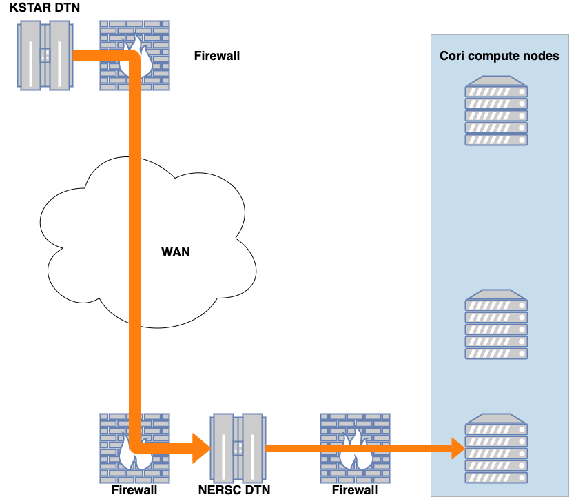

:author: Ralph Kube
:email: rkube@pppl.gov
:institution: Princeton Plasma Physics Laboratory

:author: R Michael Churchill
:email: rchurchi@pppl.gov
:institution: Princeton Plasma Physics Laboratory

:author: Jong Youl Choi
:email: choij@ornl.gov
:institution: Oak Ridge National Laboratory

:author: Ruonan Wang
:email: wangr1@ornl.gov
:institution: Oak Ridge National Laboratory

:author: Scott Klasky
:email: klasky@ornl.gov
:institution: Oak Ridge National Laboratory

:author: CS Chang
:email: cschang@pppl.gov
:institution: Princeton Plasma Physics Laboratory

:bibliography: mybib

:video: http://www.youtube.com/watch?v=PSfrMksr0GY

----------------------------------------------------------------------
Leading magnetic fusion energy science into the big-and-fast data lane
----------------------------------------------------------------------

.. class:: abstract

We present the DELTA framework, a Python framework for efficient wide-area network 
transfer of high-velocity high-dimensional data streams from remote scientific experiments, sent to 
HPC resources for parallelized processing of typical scientific analysis workflows. Targeting 
magnetic fusion research, we accelerate the analysis of a plasma imaging diagnostic that produces
a high-dimensional data stream upwards of 500MB/sec. Using the DELTA framework we adapt the existing
Python code-base that runs in batch mode using single-core methods to a code processing large data 
streams with modern, distributed HPC architectures. We facilitate all data transfers using the ADIOS2
I/O middleware and implement the data analysis tasks using the PoolExecutor model. 

By reducing such data streams
into analysis results, available to scientists in near real-time, the process of scientific discovery
can be accelerated. 

.. class:: keywords

   streaming analysis, mpi4py, queue, adios, HPC

Introduction
------------

If you could harvest the energy from controlled nuclear fusion reactions you would have 
a potentially unlimited, environmentally friendly energy source. Nuclear fusion reactions
are the opposite to nuclear fusion reactions, which are used in todays nuclear power plants.
In a fusion reaction two light atomic nuclei merge into a heavier one, while converting a 
small fraction of the binding energy of the reactants into kinetic energy of the products.
As a nuclear reaction, the amount of energy released is many orders of magnitude larger
than for a chemical reaction, such as oxidization of carbon when burning coal.
At the same time nuclear fusion reactions are inherently safe. To bring positively charged
atomic nuclei close enough together so that they fuse requires temperatures upwards of
100 million degrees. Such a requirement unfortunately excludes any material container to
confine a fusion fuel. The most promising approach to confine a fusion fuel is in the 
state of a plasma - a hot gas where the atoms are stripped of their electrons. Such a 
plasma can be confined in a donut-shaped by strong magnetic fields. Since the energy yield 
of a fusion reaction is so large, only a small amount of fusion plasma needs to be confined
to power a fusion reactor. To produce 1 GW of fusion power, enough to power about 700,000 homes, 
only 2 kg of fusion plasma would need to be burned per day [Ent18]_. Thus, a catastrophic event
such as loss of plasma confinement would only lead to local damage to the plasma vessel. with
Fusion, no uncontrolled chain reactions are possible. Under operation, plasma facing components of
the vessel will be activated. Due to the characteristic energies of fusion reaction, the weakly 
active materials will be safe to handle after about 10-20 years. Fuels for fusion reactions are readily
extracted from sea water, which is available in near-infinite quantities. 

The plasma confinement devices with the best performance have a toroidal geometry, such as a 
tokamak. Medium-sized tokamaks, such as DIII-D [D3D]_, NSTX-U [NSTX]_, ASDEX Upgrade [AUG]_,
MAST [MAST]_, TCV [TCV]_ or KSTAR [KSTAR], have a major radius R=1-1.5m and a minor radius a=0.2-0.7m. 
During a typical experimental campaign, about 10-30 ``shots`` are performed on a given day. 
By configuring paramaters such as the plasma density, type and magnitude of external heating,
the strength of the magnetic field, researchers are studying the behaviour of the fusion plasma
in this configuration. A typical plasma shot lasts a couple of seconds up to minutes, a time in which
numerous measurements of the plasma and the mechanical components of the tokamak are performed. After
a cool-down phase - any large tokamak contains cryogenic components - the device is ready for the 
next shot. In this short break researchers and engineers may look at preliminary data and 
make decisions on whether to follow the experimental plan or to depart from it based on new data.
This decision making is sometimes aided by reduced model simulations that are fast enough to run
in between shots. Given the size of fusion experiments, with hundreds of staff on site, numerous
collaborators scattered around may also be involved and interested in timely results of any experimental
activity.

Need refs here to reduced models etc.

A common type of measurement is the samping of the emission intensity by free electrons in the plasma,
which allows to infer their temperature as a function of radius [Cos74]_. These so-called Electron
Cyclotron Emission Imaging (ECEI) diagnostic image the plasmas emission. Modern ECEI systems, as the 
one installed in the KSTAR tokamak [Yun14]_ have 192 spatial channels and sample data on a microsecond 
time-scale. The resulting data stream is approximately 500 MB/sec. Providing timely analysis results of 
plasma measurements to interested parties would provide multiple benefits. For one, such an 
analysis may provide information to perform inter-shot optimization. This optimization could also 
be performed in combination with machine-learning algorithms, similar to the workflow that incorporates
the optometrist algorithm [Bal17]_.

Here we present the ``DELTA`` framework which is designed to facilitate near-real time analysis of big
and fast fusion data. 

This presentation will guide the audience through the adaptation process and will demonstrate how 
HPC python packages including mpi4py, threading, and queue are used and optimized for performance. 
To establish a baseline, we start by describing the implementation and limitations of the original 
code base. 

Proceeding we connect the data generation site, the KSTAR fusion facility in Korea, with the 
compute facility, the Cori Cray XC-40 supercomputer in California, USA. Cori is operated by the 
U.S. National Energy Research Scientific Computing Center and ranks 13 on the Top500 list. For this 
task, we use the ADIOS2 I/O middleware for the wide-area network (WAN) data transfer, which is part 
of the exascale computing project. We highlight the newly developed WAN-capabilities of ADIOS2 for 
low-latency streaming I/O. We show how to efficiently implement asynchronous data processing, using 
threading and queue to process the data streams into analysis workers. 

We continue by showing how the original code-base is adapted to the distributed computing 
architecture of modern HPC facilities by factoring the diagnostic routines into computational 
kernels and interfacing them to a pool executor. Using the executor models implemented by 
the mpi4py package we demonstrate the scaling of the new analysis routines on Cori. We further 
explore how embarrassingly parallel diagnostic kernels are accelerated using task-based 
parallelization and vectorization and some pitfalls to avoid. 

Analysis of measurements taken in experiments on magnetic fusion energy are
typically performed batch-wise after the experiment has concluded. 

.. _table-1 : Time-scales on which analysis results of fusion data is required for different tasks.

    +---------------+------------------+--------------------+
    |    Task       | Time-scale       | code-name          |
    +===============+==================+====================+
    | real-time     | ms               | [Bel18]_           |
    | control       |                  |                    |
    +---------------+------------------+--------------------+
    | inter-shot    | seconds,         | ``Delta``          |
    | analysis      | minutes          |                    |
    +---------------+------------------+--------------------+
    | post-shot     | hours,days,weeks | fluctana           |
    | batch analysis|                  |                    |
    +---------------+------------------+--------------------+

This is listed in table-1_.

Data analysis for Electron Cyclotron Emission Imaging diagnostic
----------------------------------------------------------------
The Electron Cyclotron Emission Imgaging diagnostic installed in the KSTAR tokamak 
measures the electron temperature :math:`T_e` on a 0.15m by 0.5m grid, resolved using 8 horizontal
and 24 vertical channels [Yun10]_ [Yun14]_. Each individual channel produces an intensity time series
:math:`I_{h, v}(t_i)` where h and v index the horizontal and vertical channel number and
:math:`t_i = i * \Delta_t` denotes the time where the intensity is sampled with 
:math:`\Delta_t \approx 1 \mu s` being the sampling time. The spatial view of this diagnostic covers 
a significant area of the plasma cross-section which allows it to directly visualize the large-scale 
structures of the plasma. Besides analyzing the normalized intensity, several quantities calculated 
off the Fourier Transformed intensity :math:`X(\omega)`, where :math:`\omega` denotes the angular frequency, are used
to study the plasma dynamics. The cross-power S, the coherence C, the cross-phase P and 
the cross-coherence R are respectively defined for two Fourier Transformed intensity signals X and Y as

.. math:: 
   S_{xy}(\omega) = E[F_x(\omega) F_y^{\dagger}(\omega)],
   :label: eq-S
   
.. math::
   C_{xy}(\omega) = |S_{xy}(\omega)| / \sqrt{S_{xx}(\omega)} / \sqrt{S_{yy}(\omega)},
   :label: eq-C

.. math::
   P_{xy}(\omega) = arctan(Im(S_{xy}(\omega)) / Re(S_{xy}(\omega)),
   :label: eq-P

and

.. math::
   R_{xy}(t) = IFFT(S_{xy}(\omega)).
   :label: eq-R

Here E denotes an ensemble average, :math:`^{\dagger}` denotes complex conjugation, :math:`Re` and
:math:`Im` denote the real and imaginary part of a complex number and :math:`IFFT` denotes the
inverse Fourier Transform. Spectral quantities calculated off local :math:`T_e` fluctuations, such
as the cross coherence or the cross phases, can be used to identify macro-scale structures in the
plasma, so called magnetic islands [Cho17]_. Detection of magnetic islands is an important task as
they can disrupt plasma confinement.

Commonly, diagnostic data as produced by the ECEI is analyzed manually batch-wise, often hours,
days, or weeks after a given plasma shot. The researchers doing this obtain the raw data files and
maybe a copy of common analysis routines or they write their own analysis codes. Then the channel
pairs for which quantities like eq-S are to be computed are specified by hand. The output
and visualization is stored in another file. 

Abundant high performance computing resources make it possible to design a streaming workflow for
this analysis task. Modern high-performance computing (HPC) resources provide ample computing power
to perform calculations of all relevant spectral quantities, for any given channel pair in near
real-time. Furthermore, the calculated quantities can be stored indefinitely for future access
together with sufficient meta-data to know what the people who wrote the data did. With appropriate
reduction, these data can also be distributed to interested parties, internationally distributed
teams of researchers, in near real-time.

A streaming workflow for big and fast fusion data
-------------------------------------------------

Designing a streaming workflow for the analysis of fusion data can not be done in a top-down
approach, that facilitates multiple experiments or diagnostics. Plasma diagnostics operated at
experimental sites produce a heterogeneous set of data streams. Furthermore, the diagnostics are
often custom build and share no common platform. Delta takes a bottom-up approach by being tailored
to KSTARs ECEI diagnostic and the suite of spectral analysis routines described in the previous
section. Being designed with a specific application in mind, we implement Delta on Cori, a Cray
XC-40 supercomputer in California, USA. Cori is operated by the U.S. National Energy Research
Scientific Computing Center and ranks 13 on the Top500 list. Figure :ref:`fig1` shows the target
network topology. KSTAR and NERSC are connected through the internet. The endpoint at each 
site for data-transfer is a Data Transfer Node. These are servers dedicated to performing data
transfers. As such, they feature large-bandwidth network interfaces, both for internal and external
connections. Table :ref:`tab1` lists the hardware of the DTNs.

  The network topology for which the delta framework is designed. Data is streamed in the
  direction indicated by the orange arrow. The KSTAR and NERSC Data Transfer Nodes are 
  machines dedicated to transfer data in and out of their respective networks. _table-dtn
  lists the speed of the network interface connections (NIC) connecting them to the internet.
  Another firewall is between Cori on which the data is finally analyzed and the NERSC DTN.
  This is the label :label:`fig1`
  

.. table:: Hardware and network interconnections of the data transfer nodes (DTNs) :label:`tab1`
 
    +---------------+--------------------+----------+-----------------------------------------+
    | Where         |   CPU              |    RAM   |  NIC                                    |
    +===============+====================+==========+=========================================+
    | | KSTAR       | | Xeon E5-2640 v4  | | 128GB  | | 100 Gbit Ethernet (external)          |
    +---------------+--------------------+----------+-----------------------------------------+
    | |  NERSC      | | Xeon E5-2680 v2  | | 128GB  | | 2 * 100 Gbit Ethernet (external)      |
    |               |                    |          | | 2 * 10 Gbit Ethernet (internal)       |
    +---------------+--------------------+----------+-----------------------------------------+

Designing abstractions for the diagnostic data
----------------------------------------------

How do program?

Refactoring the analysis code
-----------------------------

What new?

Performance analysis
--------------------

Is new fast?

Acknowledgements
----------------
The authors would like to acknowledge support from engineers and developers at the National Energy 
Research Scientific Computing Center. This work used resources of the National Energy Research 
Scientific Computing Center (NERSC), a U.S. DOE Office of Science User Facility operated under
Contract No. DE-AC02-05CH11231.

References
----------

.. [Ent18] S. Entler, J. Horacek, T. Dlouhy and V. Dostal *Approximation of the economy of fusion energy*
           Energy 152 p. 489 (2018)

.. [D3D] DIII-D http://www.ga.com/diii-d

.. [NSTX] NSTX https://www.pppl.gov/nstx

.. [KSTAR] KSTAR Tokamak https://www.nfri.re.kr/kor/index

.. [AUG] ASDEX Upgrade https://www.ipp.mpg.de/16195/asdex

.. [MAST] Mega Amp Spherical Tokamak https://ccfe.ukaea.uk/research/mast-upgrade/

.. [TCV] https://www.epfl.ch/research/domains/swiss-plasma-center/research/tcv/research_tcv_tokamak/

.. [Cos74] A.E Costley, R.J. Hastie, J.W.M. Paul, and J. Chamberlain *Electron Cyclotron Emission from a Tokamak Plasma: Experiment and Theory*
           Phys. Rev. Lett. 33 p. 758 (1974).

.. [Yun14] G.S. Yun, W. Lee, M.J. Choi et al. *Quasi 3D ECE imaging system for study of MHD instabilities in KSTAR*
           Rev. Sci. Instr. 85 11D820 (2014)
           http://dx.doi.org/10.1063/1.4890401

.. [Bal17] E.A. Baltz, E. Trask, M. Binderbauer et al. *Achievement of Sustained Net Plasma Heating in a Fusion Experiment with the Optometrist Algorithm*
           Sci. Reports 6425 (2017)
           https://doi.org/10.1038/s41598-017-06645-7

.. [Bel18] V. A. Belyakov and A. A. *Kavin Fundamentals of Magnetic Thermonuclear Reactor Design*
           Chapter 8 Woodhead Publishing Series in Energy

.. [Yun10] G. S. Yun, W. Lee, M. J. Choi et al. *Development of KSTAR ECE imaging system for measurement of temperature fluctuations and edge density fluctuations*
           Rev. Sci. Instr. 81 10D930 (2010)
           https://dx.doi.org/10.1063/1.3483209

.. [Cho17] M. J. Choi, J. Kim, J.-M. Kwon et al. *Multiscale interaction between a large scale magnetic island and small scale turbulence*
           Nucl. fusion 57 126058 (2017)
           https://doi.org/10.1088/1741-4326/aa86fe

.. [nerscdtn] https://docs.nersc.gov/systems/dtn/