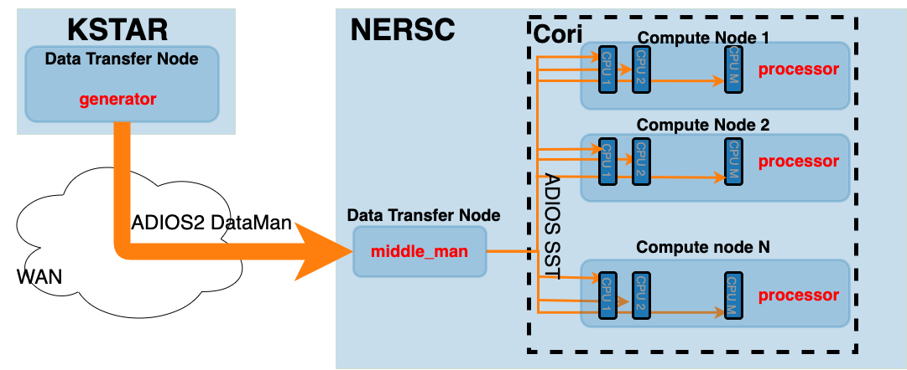
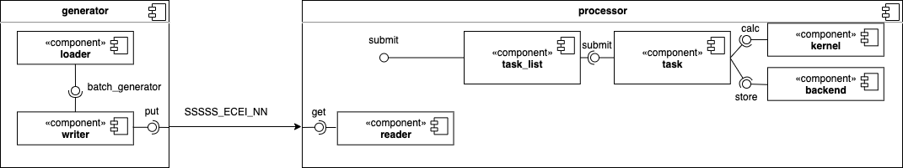
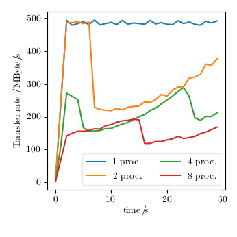
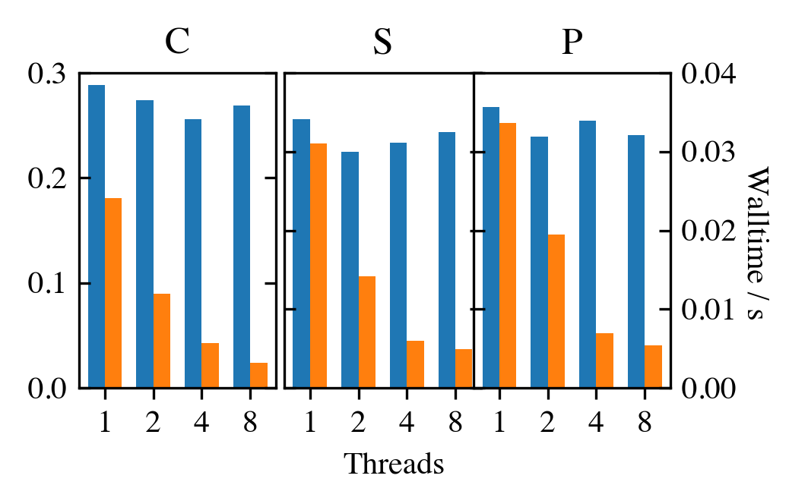
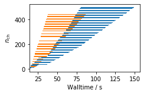
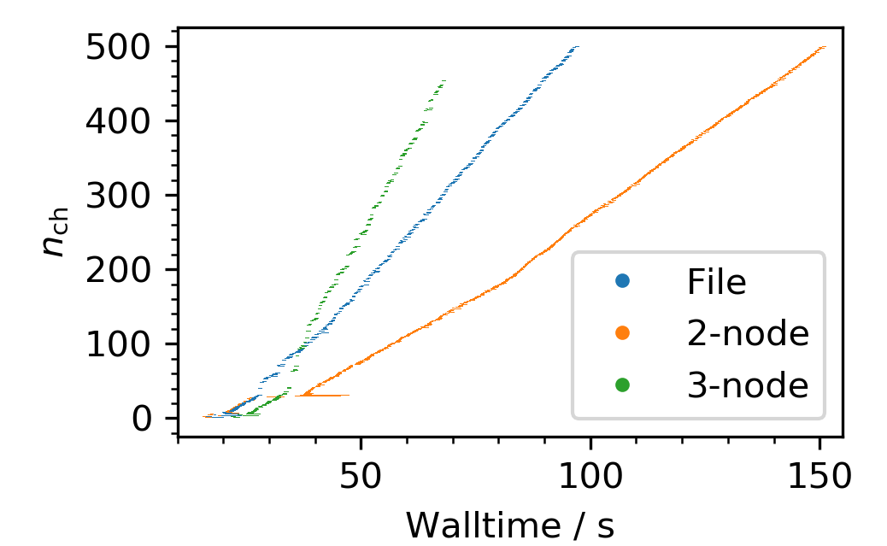
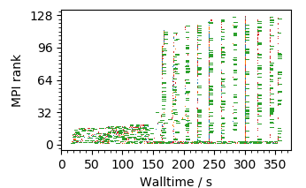
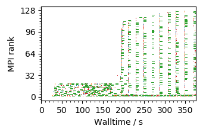
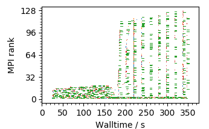

:author: Ralph Kube
:email: rkube@pppl.gov
:institution: Princeton Plasma Physics Laboratory

:author: R Michael Churchill
:email: rchurchi@pppl.gov
:institution: Princeton Plasma Physics Laboratory

:author: Jong Youl Choi
:email: choij@ornl.gov
:institution: Oak Ridge National Laboratory

:author: Ruonan Wang
:email: wangr1@ornl.gov
:institution: Oak Ridge National Laboratory

:author: Scott Klasky
:email: klasky@ornl.gov
:institution: Oak Ridge National Laboratory

:author: CS Chang
:email: cschang@pppl.gov
:institution: Princeton Plasma Physics Laboratory

:author: Minjun J. Choi
:email: mjchoi@nfri.re.kr
:institution: National Fusion Research Institute, Daejeon 34133, Republic of Korea

:author: Jinseop Park
:email: Jinseop.PARK@nfri.re.kr
:institution: National Fusion Research Institute, Daejeon 34133, Republic of Korea

:video: https://youtu.be/rih7Hp9nPvM

----------------------------------------------------------------------
Leading magnetic fusion energy science into the big-and-fast data lane
----------------------------------------------------------------------

.. class:: abstract

We present ``Delta``, a Python framework that connects magnetic fusion experiments to
high-performance computing (HPC) facilities in order leverage advanced data analysis for near
real-time decisions. Using the ADIOS I/O framework, ``Delta`` streams measurement data with over 300
MByte/sec from a remote experimental site in Korea to Cori, a Cray XC-40 supercomputer at the
National Energy Energy Research Scientific Computing Centre in California. There ``Delta``
dispatches cython data analysis kernels using an mpi4py PoolExecutor in order to perform a spectral
data analysis workflow. Internally ``Delta`` uses queues and worker threads for data communication.
With this approach we perform a common spectral analysis suite on imaging measurements more than 100
times faster than with a single-core implementation.

.. class:: keywords

   streaming analysis, mpi4py, queue, adios, HPC

Magnetic Fusion Energy research and its data analysis needs
-----------------------------------------------------------

Research on magnetic fusion energy combines physics, engineering, and even economics to deploy a
virtually unlimited, clean, and competitively priced energy source to the grid. Python is well
established in the fusion community through projects like plasmapy [PPY]_ or OMFIT [Men15]_. We
introduce another Python library for fusion energy reserch, ``Delta`` - the aDaptive nEar-reaL Time
Analysis framework - and show how it can be used to stream data from an experiment to a remote high
performance computing (HPC) resource [git].

There, Delta executes a routine spectral analysis workflow in near real-time. By making data
analysis results available in near real-time, Delta allows scientists to make more informed
decisions on follow-up experiments and could accelerate scientific discovery. To illustrate the
use-case for Delta in fusion energy research, we start with a primer of fusion energy, introduce
tokamak devices that are used to perform fusion experiments, describe a diagnostic that is installed
in many tokamaks. With this at hand, we describe how near real-time data analysis can be used to
accelerate experimental fusion energy workflows.

If one could harvest the energy from controlled nuclear fusion reactions you would
have a potentially unlimited, environmentally friendly energy source. Fusion reactions release
energy when two light nuclei merge into a heavier one. As part of the reaction, a fraction of the
reactants nuclear binding energy is converted into kinetic energy of the products. Fission
reactions on the other hand, which power todays nuclear power plants, release binding energy when a
heavy nucleus decays into lighter products. Typical energies involved in nuclear reactions are
measured in MeV, multiple orders of magnitude larger than the characteristic eV energy scale for
chemical reactions. Thus, the energy yield for a nuclear reaction is much larger than for chemical
reaction, which occur when fossil fuels are burnt. Fuel for fusion reactions are readily extracted
from sea water, which is available in virtually inexhaustible quantities. Since the energy yield of
a fusion reaction is so large, only little fusion plasma needs to be confined to power a fusion
reactor. To produce 1 GW of fusion power, enough to power about 700,000 homes, just 2 kg of fusion
plasma would need to be burned per day [Ent18]_. Thus, a catastrophic event such as total loss of
plasma confinement can cause no more than local damage to the plasma vessel.

To fuse positively charged atoms into one heavier requires enormous energy. For the most feasible
fusion reactions, Deuterium-Tritium, temperatures upwards of 100 million degrees are required. Such
a requirement unfortunately excludes any material container to confine a fusion fuel. The most
promising approach is to confine the fusion fuel in the state of a plasma - a hot gas where the
atoms are stripped of their electrons. Such a plasma can be confined in a strong magnetic field,
shaped like a donut. Confined like this, there is no possibility for an uncontrolled chain reaction.
If a significant amount of plasma would leak out of the vessel, the accompanying temperature drop
would stop any fusion reactions. At the same time there are only a few grams of plasma confined and
it does not have enough stored energy to cause damage other than to the structure of the
confinement vessel.

The best performing plasma confinement devices, tokamaks, have a toroidal shape, similar to a donut.
Tokamaks (a transliteration of the Russian acronym for toroidal chamber with magnetic coils), such
as KSTAR [KSTAR]_
have a major radius R=1-1.5m and a minor radius a=0.2-0.7m. In experiments at these facilities,
researchers configure parameters such as the plasma density or the shaping and strength of the
magnetic field and study the behaviour of the plasma in this setup. During a typical experimental
workflow, about 20-30 plasma discharges, so-called ``shots`` are performed on a given day where each
shot lasts for a couple of seconds up to minutes. Numerous measurements of the plasma and the
mechanical components of the tokamak are performed during each discharge. After a cool-down phase of
a few minutes (tokamaks contain cryogenic components) the device is ready for the next shot.

A common diagnostic in magnetic fusion experiments is a so-called Electron Cyclotron Emission (ECE)
diagnostic [Cos74]_. They measure emission intensity by free electrons in the plasma, which allows
one to infer their temperature as a function of radius. Physical models of the plasma describe it
partially through the temperature. This measurement allows one to interpret the experiment in terms
of such models. Modern ECE systems, such as the one installed in the KSTAR tokamak [Yun14]_ have
hundreds of spatial channels and sample data on a microsecond time-scale, producing data streams
upwards of 500 MB/sec.

Analyzing large datasets, as produced by ECE diagnostics in between shots and generating actionable
information in time for the next shot is a challenging task. The ``Delta`` framework aims to
facilitate the analysis of such large datasets in near real-time." This use-case falls in between
two other common data analysis workflows in fusion energy research, listed in Tab. :ref:`timescale`.
Real-time control systems for plasma control require data on a millisecond time scale. This time
scale is a hard constraint and limits the amount of data the algorithms can ingest. Post-shot batch
analysis of measurements on the other hand serves scientific discovery, such as extraction about
the plasma from ECE data. The data and the analysis
methods are selected on a per-case basis and are often performed manually hours, days, weeks, months,
or years after an experiment has concluded. A goal of Delta is to facilitate scientific discovery at
time-scale faster than the experimental cadence. Providing timely analysis results of plasma
measurements to experimentalists aids them in making informed decisions about the next plasma
shot. As an example of the workflows that we wish to facilitate with ``Delta`` we refer to a series of
experiments performed at the TAE facility [Bal17]_. There, the so-called ``optometrist`` algorithm was
used as a stochastic optimizer in conjunction with expert judgement of domain scientists to assess
the performance of a just concluded plasma shot and optimize the machine parameters in order to increase
the performance of the following shot. By making advanced data analysis results available in near
real-time to domain scientists, ``Delta`` will allow to improve workflows at experimental fusion
facilities.

.. table:: Time-scales on which analysis results of fusion data is required for different tasks.  :label:`timescale`

    +---------------------------+--------------------+
    |    Task                   | Time-scale         |
    +===========================+====================+
    | real-time control         | millisecond        |
    +---------------------------+--------------------+
    | live/inter-shot analysis  | seconds, minutes   |
    +---------------------------+--------------------+
    | scientific discovery      | hours, days, weeks |
    +---------------------------+--------------------+

Designing the Delta framework
-----------------------------

We are designing the ``Delta`` framework in a bottom-up approach, tailoring it to facilitate a
specific spectral analysis workflow that uses measurements from an ECEI diagnostic. While plasma
diagnostics operated at fusion experiments produce a heterogeneous set of data streams, the ECEI
spectral analysis workflow is representative for a large set of workflows used to analyze different
measurements. HPC environments also differ for example in their local area network topologies, the
speed of network links between data-transfer nodes to compute node, compute node interconnects,
and their network security policies. Furthermore granted allocations of compute time for research
projects make it impractical to start with a top-down approach that generalizes well to arbitrary
HPC platforms (though we endeavor to build the framework with flexibility and extensibility in
mind). In the remainder of this section we describe the data analysis workflow for ECEI data, the
targeted network and deployment architecture and give an overview of how ``Delta`` connects them
together.

Electron Cyclotron Emission Imaging
^^^^^^^^^^^^^^^^^^^^^^^^^^^^^^^^^^^

The Electron Cyclotron Emission Imaging diagnostic installed in KSTAR measures the electron
temperature :math:`T_e` on a 0.15m by 0.5m grid, resolved using 8 horizontal and 24 vertical
channels [Yun10]_ [Yun14]_. Each individual channel produces an intensity time series :math:`I_{h,
v}(t_i)` where h and v index the horizontal and vertical channel number and :math:`t_i = i
\Delta_t` denotes the time where the intensity is sampled with :math:`\Delta_t \approx 1 \mu s`
being the sampling time. Digitized with a 16-bit digitizer, this diagnostic produces a data
stream of 1836 MByte/sec. The spatial view of this
diagnostic covers a significant area of the plasma cross-section which allows it to directly
visualize the large-scale structures of the plasma. Besides analyzing the normalized intensity,
several quantities calculated off the Fourier transformed intensity :math:`X(\omega)`, here
:math:`\omega` denotes the angular frequency, are used to study the plasma dynamics. The cross-power
S, the coherence C, the cross-phase P and the cross-correlation R are defined respectively for
channel pair combinations of Fourier transformed intensity signals :math:`X` and :math:`Y` as

.. math::
   S_{xy}(\omega) = E[X(\omega) Y^{\dagger}(\omega)],
   :label: eq-S

.. math::
   C_{xy}(\omega) = |S_{xy}(\omega)| / \sqrt{S_{xx}(\omega)} / \sqrt{S_{yy}(\omega)},
   :label: eq-C

.. math::
   P_{xy}(\omega) = arctan(Im(S_{xy}(\omega)) / Re(S_{xy}(\omega)),
   :label: eq-P

and

.. math::
   R_{xy}(t) = IFFT(S_{xy}(\omega)).
   :label: eq-R

Here E denotes an ensemble average, :math:`^{\dagger}` denotes complex conjugation, :math:`Re` and
:math:`Im` denote the real and imaginary part of a complex number and :math:`IFFT` denotes the
inverse Fourier transform. In practice we use a short-time Fourier transformation (STFT) which
averages the Fourier coefficients obtained from FFTs calculated on slightly shifted time windows. Spectral
quantities calculated off local :math:`T_e` fluctuations, such as the cross coherence or the cross
phases, are used to identify macro-scale structures, so called magnetic islands, as well as
micro-scale instabilities in the plasma [Cho17]_. Understanding the physics resulting in magnetic
islands is important for plasma confinement, and avoiding sudden loss of plasma control, known as a
disruption.

Targeted HPC architecture
^^^^^^^^^^^^^^^^^^^^^^^^^^

We implement ``Delta`` for streaming data from KSTAR
to the National Energy Research Scientific Computing Centre (NERSC). NERSC operates Cori [cori]_, a Cray
XC-40 supercomputer that is comprised of 2,388 Intel Xeon "Haswell" processor nodes, 9,688 Intel
Xeon Phi "Knight's Landing" (KNL) nodes and ranks 16 on the Top500 list [top500]_. Figure :ref:`fig-topo`
illustrates the targeted network topology. Data transfers from KSTAR and NERSC originate and end at
their respective Data Transfer Node (DTN). DTNs are servers deployed and configured specifically for
transferring data over networks [dtn]_. As such, they feature
large-bandwidth network interfaces, both for internal and external connections. Table :ref:`tab1`
lists the hardware of the DTNs and Cori's compute nodes. 100Gbit/s links connect both DTNs via the
internet. At NERSC, the DTN is connected to Cori with dual 10 Gbit/s NICs. Coris individual compute
nodes are connected with a Cray Aries interconnect, peaking at > 45 TB/s.

   The network topology for which the ``Delta`` framework is designed. Data is streamed in the
   direction indicated by the orange arrow. At KSTAR, measurement data is staged from its DTN to
   the NERSC DTN. Internally at NERSC, the data stream is forwarded to compute nodes at Cori
   and analyzed. Orange arrows mark sections of the network where ADIOS facilitates high-performance streaming.
   Black arrows denote standard TCP/IP connections. :label:`fig-topo`

.. table:: Hardware and network interconnections of the data transfer nodes (DTNs) and compute nodes :label:`tab1`

    +---------------+--------------------+----------+------------------+
    | Where         |   CPU              |    RAM   |  NIC             |
    +===============+====================+==========+==================+
    | | KSTAR DTN   | | Xeon E5-2640 v4  | | 128GB  | | 100 Gbit       |
    +---------------+--------------------+----------+------------------+
    | |  NERSC DTN  | | Xeon E5-2680 v2  | | 128GB  | | 2 * 100 Gbit   |
    |               |                    |          | | 2 * 10 Gbit    |
    +---------------+--------------------+----------+------------------+
    | | Cori compute| | Xeon E5-2698 v3  | | 128GB  | | Cray Aries     |
    |               | |  32 threads      |          |                  |
    +---------------+--------------------+----------+------------------+

Connecting science experiments to HPC resources
^^^^^^^^^^^^^^^^^^^^^^^^^^^^^^^^^^^^^^^^^^^^^^^

``Delta`` uses three separate software components to connect KSTAR to Cori. A **generator** running
on the KSTAR DTN, a **middleman** running on the NERSC DTN, and a **processor** running on Cori. To
avoid performance hits when touching the filesystem, ``Delta`` streams data between its components.
By using only in-memory data transfers this avoids performance hits when touching the file system.
Performance variability of file-based I/O on HPC systems is however a well studied problem [Xie12]_
. Furthermore, the workflow at hand and anticipated workflows require frequent transfer of
relatively small data packets. By relying on streaming data transfers, ``Delta`` aims to avoid
jitter due to I/O bottlenecks.

The generator stages measurement data and sends it to the middleman. The middleman forwards the data
to the processor. The processor receives the data, executes the appropriate analysis kernels and
stores the analysis results. ``Delta`` uses ADIOS [adios]_ to facilitate high bandwidth streaming on
the paths marked with orange arrows in :ref:`fig-topo`. ADIOS is a unified input/output system that
transports and transforms groups of self-describing data variables across different media with
performance as a main goal. It is commonly used in the Department of Energy for high performance
parallel I/O. Its transport interface is step-based, which resembles the generation of scientific
data. ADIOS implements multiple transport mechanisms as engines which take advantage of underlying
network communication mechanisms to provide optimal performance. For the topology at hand, ``Delta``
configures ADIOS to use the DataMan engine for both, trans-oceanic data and intra-datacenter
transfer. Switching the engine used by ADIOS is trivial and requires only the change of a single
line in a configuration file.

Implementaion details
---------------------

After providing an overview of the ``Delta`` framework and introducing its components in the
previous section we continue by describing their implementation in the this section and benchmark
their performance in the following section.

Components of the ``Delta`` framework
^^^^^^^^^^^^^^^^^^^^^^^^^^^^^^^^^^^^^

We continue by discussing the architecture of the ``generator`` and the ``processor`` shown
in Fig. :ref:`fig-sw-arch`. Here we omit the ``middleman`` as it only relays the data stream.

   Schematic of the ``Delta`` framework. The **generator** runs at the data staging site and
   transmits time chunks via the ADIOS channels SSSSS_ECEI_NN. Here SSSSS
   denotes the shot number and NN enumerates the ADIOS channels. The **processor** runs at the
   HPC site, recieves the data and submits it for processing through a ``task_list``. :label:`fig-sw-arch`.

The ``generator`` is a single-threaded application that sources data using a ``loader``
instance which handles all diagnostic specific data transformations and stages it for streaming. For
the ECEI diagnostic the tranformations includes for example calculating a channel-dependent
normalization and the aggregation of data into time chunks, :math:`N_{ch}` blocks of :math:`s_{ch}`
consecutive samples. A ``writer`` instance handles all streaming I/O using ADIOS.
Pseudo-code for the generator looks like this:

.. code:: python
   :linenos:

   loader = loader_ecei(cfg["ECEI"])
   writer = writer_gen(cfg["transport_tx"])
   writer.Open()

   batch_gen = loader.batch_generator()
   for batch in batch_gen:
       writer.BeginStep()
       writer.put(batch)
       writer.EndStep()

Here, cfg is a framework-wide json configuration file. Diagnostic-specific parameters are stored in
the ``ECEI`` section. ADIOS parameters for the writer are stored in the ``transport_tx`` section.
Since all data transformations are applied inside the loader class the generator appears to be
agnostic about what kind of diagnostic data it gets. However, the number of data batches is specific
to the data at hand. Furthermore, the pseudo-code  example above demonstrates the step-centered
design of the ADIOS library. It encapsulates each time chunk in a single time step.

The middleman runs on the NERSC DTN and relays data streams from the generator to the processor.
Using the classes available in ``Delta`` the pseudo-code looks similar to the
``generator`` with a ``reader`` instance replacing the ``loader``..

The ``processor`` runs on Cori. It reads time chunks from an ADIOS stream, publishes
them in a queue and submits analysis tasks to a pool of worker threads. As illustrated in Fig.
:ref:`fig-sw-arch` a ``reader`` object receives time chunks data and passes them to a
``task_list`` instance, which submits all data analysis routines on the ``executors``.
Pseudo-code for the processor looks like this

.. code:: python
   :linenos:

   def consume(Q, task_list):
     while True:
        try:
          msg = Q.get(timeout=timeout_in_secs)
        except queue.Empty:
          break
        task_list.submit(msg)
      Q.task_done()

   def main():
      executor_fft = MPIPoolExecutor(max_workers=NF)
      executor_anl = MPIPoolExecutor(max_workers=NA)
      a2_reader = reader(cfg["transport_rx"])
      a2_reader.Open()
      task_list = task_list_spectral(executor_anl,
                                     executor_fft,
                                     cfg)

      dq = Queue.Queue()
      workers = []
      for _ in range(n_thr):
         w = threading.Thread(target=consume,
                              args=(dq, task_list))
         w.start()
         workers.append(w)

      while True:
        stepStatus = reader.BeginStep()
        if stepStatus:
          stream_data = a2_reader.Get(varname)
          dq.put_nowait((stream_data,
                         reader.CurrentStep()))
          reader.EndStep()
        else:
          break

      worker.join()
      dq.join()

To access the many cores available, ``processor`` is launched as an MPI program under
control of ``mpi4py.futures``: ``srun -n NP -m mpi4py.futures processor.py``. The ``mpi4py``
documentation suggests to run as ``mpiexec -n 1 -usize NP processor.py`` but unfortunately Cori's job system
supports neither ``mpiexec`` nor defining the universe size by environment variables.
The number of MPI ranks should be approximately equal to the workers requested in the PoolExecutors, ``NP`` == ``NF`` + ``NA`` - 1.

Then ``a2_reader`` is instantiated with ``cfg[transport_rx]``, mirroring the configuration of the writer.
After defining a queue for inter-process communication, a group of worker threads is started. In the main loop ``a2_reader``
consumes incoming time chunk data from the ADIOS stream and enqueues them. At the same time, the array of worker tasks
dequeues time chunks data and passes it to the ``task_list``.

The data analysis code is implemented by cython kernels which are described in a later subsection.
While the low-level implementation of Eqs. (:ref:`eq-S`) - (:ref:`eq-R`) is in cython, ``Delta``
encapsulates them by the ``task`` class. Sans initialization the relevant class interface is implemented
as

.. code:: python
   :linenos:

   class task():
   ...
   def calc_and_store(self, data, **kwargs):
     result = self.kernel(data, **kwargs)
     self.storage_backend.store(result, tidx)

   def submit(self, executor, data, tidx):
     ...
     _ = [executor.submit(self.calc_and_store, data,
                          ch_it, tidx)
          for ch_it in self.get_dispatch_sequence()]

The call of an analysis kernel happens in ``calc_and_store``. Once the kernel returns, the analyzed
data is immediately stored.  This allows us to submit a large number of analysis task in parallel in a
``fire-and-forget`` way. Implementing analysis and storage as separate functions would introduce
dependencies between futures returned by ``executor.submit``. Grouping analysis and storage together
guarantees that once ``calc_and_store`` returns, the data has been analyzed and stored. In order to
minimize data communication, ``submit`` launches ``calc_and_store`` for an exhaustive list of
channel pair combinations which is accessed by ``get_dispatch_sequence()``.

Since the ECEI analysis tasks for the workflow at hand expects Fourier transformed data, the analysis kernels
are called sequentially right after the Fourier transformed data becomes available. This logic is implemented
by the ``task_list`` class:

.. code:: python
   :linenos:

   from scipy.signal import stft

   class task_list():

     def submit(self, data, tidx):
       fft_future = self.executor_fft.submit(stft,
                                             data,
                                             **kwargs)

       for task in self.task_list:
         task.submit(self.executor_anl,
                     fft_future.result(), tidx)

Executing the analysis tasks after the Fourier transformation further reduces interdependencies in
the workflow, i.e. this implementation awaits only a single future. Without collecting the analysis
tasks in a list one may for example execute Fourier transformations prior to launching each
individual analysis kernel. This particular choice would increase the number of Fourier
transformations by a factor of four and may seem like a poor choice. On the other hand would this
result in less communication across the MPI ranks and may perform better in situations where
communication between MPI ranks becomes a bottleneck.

Explored alternative architectures
^^^^^^^^^^^^^^^^^^^^^^^^^^^^^^^^^^

``Delta`` relies on the ``futures`` interface defined in PEP 3148 to launch data analysis kernels on
an HPC resource [PEP3148]_. Since both Cori and ADIOS are designed for MPI application we use the ``mpi4py``
[mpi4py]_ implementation. Being a standard interface, other implemenations like
``concurrent.futures`` can readily be used.  The Python Standard Library defines the interface as
:code:`executor.submit(fn, *args **kwargs)`. ``Delta`` wraps PEP 3148 ``submit`` calls in wrapper
methods of the ``task`` and ``task_list`` class in order to pass kernel-dependent keyword arguments
and in order to facilitate more flexible launch configuration on multiple executors.

Besides ``mpi4py`` we explored executing ``task.calc_and_store`` calls on a ``Dask`` [dask]_ cluster.
Exposing ``concurrent.futures``-compatible interface, both libraries can be interchanged with little
work. Running on a single node we found little difference in execution speed. However once the
dask-distributed cluster was deployed on multiple nodes we observed a significant slowdown due to
network traffic overhead. We did not investigate this problem any further.

As an alternative to using a queue with threads, we also explored using asynchronous I/O. In this
scenario, the main task would define a coroutine receiving the data time chunks and a second one
dispatching them to an executor. In our tested implementation, the coroutines would run in a main loop
and communicate via a queue. Our experiments showed no measurable difference against a threaded
implementation. On the other hand, the threaded implementation fits more naturally in the multi-processing
design approach.

Using data analysis codes  ``Delta``
^^^^^^^^^^^^^^^^^^^^^^^^^^^^^^^^^^^^

In a broad sense, data analysis can be described as applying a transformation :math:`F` to
some data :math:`d`,

.. math::
   y = F(d; \lambda_1, \ldots, \lambda_n),
   :label: eq-transf

given some parameters :math:`\lambda_1 \ldots \lambda_n`. Translating the relation between the
:math:`F` and :math:`d` into an object-oriented setting is not always straight-forward and one needs
to have the application in mind when designing a library. The approach taken by general-purpose
packages such as ``scipy`` or ``scikit-learn`` is to implement a transformation :math:`F` as a class
and interface to data through its member functions. Taking Principal Component Analysis in
scikit-learn as an example, the default way of applying it to data is

.. code:: python

   from sklearn.decomposition import PCA
   X = np.array([...])
   pca = PCA(n_components=2)
   pca.fit_transform(X)

This approach has proven itself useful and is the common way of organizing libraries. ``Delta``
deviates slightly from this approach and calls transformations in the ``calc_and_store`` member
function of the ``task_ecei`` class. The specific kernel to be called is configured in the objects
initialization:

.. code:: python

   from kernels import kernel_crossphase, ...
   class task():
      def __init__(self, cfg):
         ...
      if (cfg["analysis"] == "cross-phase"):
         self.kernel = kernel_crossphase
      elif (cfg["analysis"] == cross-power"):
         self.kernel = kernel.crosspower
      ...
     def calc_and_store(self, data, ...):
        ...
        result = self.kernel(data, ...)

At the time of writing, ``Delta`` only implements a workflow for ECEI data and this design choice
minimizes the number of classes present in the framework. Grouping the data analysis methods by
diagnostic also allows to execute diagnostic-specific pre-transformations that are best
performed after transfer to the ``processor`` collectively. One may wish for example to distribute calculations of
the 18336 channel pair combinations among multiple ``task`` instances. This approach lets us seamlessly
do that. Once the requirements and use cases have stabilized we will explore suitable generalizations
such as object factories for the ``task_list`` class.

In summary, the architecture of ``Delta`` implements data streaming using time-stepping interface of
ADIOS and data analysis using PEP 3148 compatible executors. In order to increase performance we
choose to use two PoolExecutors. The first executor is used to execute short Fourier Transformations
of the the input data for the entire analysis task group. The second pool executor is available for
running the analysis kernels and immediate storage of the results.

Performance analysis
--------------------

While the overall performance of the framework can be measured by the walltime of the analysis
workflow at hand, the complex composition of the framework requires us to understand the performance of
its building blocks. Referring to figure :ref:`fig-sw-arch`, IO performance of the ADIOS library,
the asynchronous receive-publish-submit strategy implemented by processor and finally the speed of
individual analysis kernels contribute to the workflow walltime. Furthermore, the workflow walltime
may be sensitive to the individual components interacting with one another. For example, even though the
processor design aims to facilitate high-velocity data streams by using queues and multiple worker
threads, a fast data stream ingested by the processor may negatively affect the performance of the
PoolExecutors by submitting too many tasks in a short time. It may well be that slower data
streaming rate result in a smaller workflow walltime. Given these considerations we start be
investigating the performance of individual components in this section and finally investigate the
performance of the framework on the ECEI workflow.

Performance of the WAN connection
^^^^^^^^^^^^^^^^^^^^^^^^^^^^^^^^^

As a first step we measure the practically available bandwidth between the KSTAR and NERSC DTNs using
the network performance tool iperf3 [iperf]_.
Multiple data streams are often necessary to exhaust high-bandwidth networks. Varying the number of
senders from 1 to 8, we measure data transfer rates from 500 MByte/sec using 1 process up to a peak
rate of 1500 MByte/sec using 8 processes, shown in Figure :ref:`kstar-dtn-xfer`. Using 1 thread we
find that the data transfer rate is approximately 500 MByte/sec with little variation throughout the
benchmark. Running the 2 and 4 process benchmark we see initial transfer rates of more than 1000
MByte/sec. After about 5 to 8 seconds, TCP observes network congestion and falls back to fast
recovery mode where the transfer rates increase to the approximately the initial transfer rates
until the end of the benchmark run. The 8 process benchmark shows a qualitatively similar behaviour
but the congestion avoidance starts at approximately 15 seconds where the transfer enters a fast
recovery phase.

   Data transfer rates between the KSTAR and NERSC DTNs measured using iperf3
   using 1, 2, 4, and 8 processes :label:`kstar-dtn-xfer`

While we measured the highest bandwidth when transferring with 8 process, ``Delta`` currently only implements
single process data transfers.

Data Analysis Kernels
^^^^^^^^^^^^^^^^^^^^^

As seen in the code-example above, ``Delta`` implements data analysis routines as computational
kernels. These are implemented in cython to circumvent the global interpreter lock and utilize
multiple cores. Measuring the average execution time over 10 runs on a Cori compute node we find
that the kernels demonstrate a strong scaling for up to 16 threads, shown in Fig.
:ref:`kernel-perf`. Using more 32 threads results in sub-linear speedup.

   Runtime of the multi-threaded kernels for coherence :math:`C`, cross-power :math:`S` and cross-phase :math:`P` compared against numpy implementations. :label:`kernel-perf`

Performance of the ECEI workflow
^^^^^^^^^^^^^^^^^^^^^^^^^^^^^^^^

Having established the performance of the individual components we continue by benchmarking the
performance of ``Delta`` performing the entire ECEI analysis workflow. The task at hand is to
calculate Eqs.(:ref:`eq-S`) - (:ref:`eq-R`) for 18836 unique channel pair combinations per time
chunk. Each time chunk consists of :math:`s_{ch}=10,000` samples for 192 individual channels. A
total of :math:`N_{ch}=500` time chunks are to be processed, for a total of about 5 GByte of data.

The performance of ``Delta`` depends on the individual performance of multiple components, such as
the data streaming velocity, lag introduced by using queue inter-process communication, spawning processes
on the executors, MPI communication as well as their interplay with one another. Having benchmarked
individual components in the previous section, we now benchmark the runtime of ``Delta`` performing
the ECEI spectral analysis workflow in three scenarios. In the
``file`` scenario, the ``processor`` reads data from a local ADIOS file. No data is streamed. In the
``2-node`` scenario, data is streamed from the ``generator`` running on the NERSC DTN to Cori. In the
``3-node`` scenario, data is streamed from the KSTAR DTN to the NERSC DTN and forwared to Cori
- this is the scenario shown in :ref:`fig-sw-arch`. Both the ``2``- and ``3-node`` scenario use
ADIOS DataMan engine for data streaming.  All runs are performed on an allocation using 32 Cori nodes
partitioned into 128 MPI ranks with 16 Threads each for a total of 2048 CPU cores.

.. table:: Performance metrics for the ECEI workflow in the  benchmarked scenarios. :label:`tab-walltimes`

    +-------------+-----------+----------------+----------------+
    | Scenario    | Walltime  | :math:`N_{ch}` | Bandwidth      |
    +=============+===========+================+================+
    | file        | 347s      | 500            | 350 MByte/sec  |
    +-------------+-----------+----------------+----------------+
    | 2-node      | 358s      | 485            | 95 MByte/sec   |
    +-------------+-----------+----------------+----------------+
    | 3-node      | 339s      | 463            | 450 MByte/sec  |
    +-------------+-----------+----------------+----------------+

Table :ref:`tab-walltimes` lists  the Walltime and the number of proccessed time chunk
:math:`N_{ch}` and the utilized bandwidth. Walltime refers to the walltime as measured by the
``processor`` and :math:`N_{ch}` gives the number of time chunks analyzed by the processor. The
utilized bandwidth refers to the I/O speed achieved when reading from disk in the ``file`` scenario,
the average data transfer rate from the NERSC DTN to Cori in the ``2-node`` scenario and as the
average data transfer rate from the KSTAR DTN to the NERSC DTN in the ``3-node scenario``.

The measured walltime for the file-based workflow is 352s, 358s for the 2-node scenario and 339s for
the 3-node scenario. Only minor packet loss occurs using the current implementation of the DataMan
engine. In order to mitigate packet loss the ``generator`` pauses a tenth of a second after sending
any packet from the NERSC DTN to Cori, resulting in a bandwidth of 95 MByte/sec for the ``2-node``
scenario. In the ``3-node`` scenario we show that ``Delta`` can ingest high velocity data streams
from KSTAR to NERSC and perform analysis on them. As in the ``2-node`` scenario, we limit the
bandwidth from the NERSC DTN to Cori by pausing a fraction of a second before relaying a time chunk.
On average, ``Delta`` performs the entire analysis workflow as fast in a streaming setting as it
does when reading from the local file system. The average time to analyze a single time chunk is
about 0.7 seconds, independent of the workflow.

Figure :ref:`delta-perf-queue` shows the amount of time that data for a given time chunk, :math:`n_{ch} = 1... N_{ch}`,
spends in the queue of the processor.
All three scenarios show a similar trend - the amount of time a time chunk spends in the queue increases with
the time when it is enqueued. This suggests that data is streamed faster to the ``processor`` than the MPI ranks
perform data analysis. This implies that the queue acts as a cache for the incoming time chunk data. Running the ``file``
scenario, the processor loads data almost immediatetly after it starts up. For the ``2-node`` and ``3-node`` scenarios
the start time of the components on their respective machines is not coordinated. This causes the first time chunk data
to arrive at varying times for the three scenarios.

   Horizontal bars mark the time that the a given time chunk :math:`n_{ch}` spends in the queue of the processor. The color legend is shown in Figure 6 :label:`delta-perf-queue`

As time chunks are dequeued, they are subject to a STFT. Figure :ref:`delta-fft-tstart` denotes the
time where the STFT of each time chunk is performed with horizontal bars. The beginning of a
horizontal bar indicates where the STFT with the time chunk data is submitted on ``executor_fft``
and the end of a bar marks the time STFT is finished. Common for all three scenarios is that the
STFTs with the longest execution time are the ones for the first time chunks received. Also, the
majority of the STFTs is executed in approximately one second. Equivalent STFT evaluations outside
Delta take about 0.15s on Cori. On average the STFT when called from the streaming workflow is
slower by a factor of 6. We believe that this long execution time is in part explained by MPI
communication overhead.

   Horizontal bars mark the during which the STFT for each time chunk data is executed :label:`delta-fft-tstart`

Finally, Figures :ref:`delta-perf-file`, :ref:`delta-perf-2node` and :ref:`delta-perf-3node` show the utilization of
the MPI ranks over time. The MPI ranks execute the STFT and analysis kernels, the figures only show the time
where analysis kernels are executed. All three scenarios show a low usage of available MPI ranks, approximately 16 - 20
in the beginning of the run. After all time chunks are dequeued and Fourier transformed, all available MPI ranks are
used. Color encodes the different analysis kernels. For example, green bars show time at which a cross-correlation
kernel is executed. The majority of the compuation time is consumed by cross-correlation kernels. This observation
agrees with the performance analysis that showed that the cross-correlation kernel is the most time consuming.

   MPI rank utilization for the ``file`` scenario. Colored bars mark the execution time of analysis kernels. Blue bars denote cross-phase, orange bars denote cross-power, green bars denote cross-correlation and red bars denote coherence. :label:`delta-perf-file`

   MPI rank utilization for the ``2-node`` scenario. The color encoding of the analysis kernels is the same as in Figure 7 :label:`delta-perf-2node`

   MPI rank utilization for the ``3-node`` scenario. The color encoding of the analysis kernels is the same as in Figure 7 :label:`delta-perf-3node`

Conclusions and future work
---------------------------

We demonstrate that ``Delta`` can facilitate near real-time analysis of high-velocity streaming
data. In our experiments we achieved streaming rates of about 350 MByte/sec and execute a spectral
analysis workflow on ECEI measurements in less than 4 minutes. Performing the analysis in the streaming
scenario, illustrated in Figure :ref:`fig-topo`, comes with only a negligible performance impact as
compared to using local filesystem IO. ADIOS manages to utilize about 70% of the available bandwidth
for data streaming from KSTAR to NERSC in the streaming analysis workflow. ``mpi4py``
PoolExecutors facilitate an flexible execution of work items on Cori, as required for our workflow
where data arrive at high velocity. Furthermore, python queues reliably facilitate inter-process
communication and act as a data cache under the tested IO loads.

In the current form, there are multiple shortcomings of the framework that need to be addressed.
Firstly, the DataMan engine received an experimental feature to mitigate packet loss. Secondly,
implementation details of MPI on Cori limit us to effectively a single PoolExecutor. We are planning
to investigate this more closely and aim to properly separate the execution space of the STFT and
the analysis kernels. Thirdly, the framework will be generalized in order to facilitate more data
analysis tasks. Finally, we are working on adapting ``Delta`` for next generation HPC facilities
which heavily rely on graphical processing units to provide processing power.

Another issue we plan to address is to make ``Delta`` more adaptive. This includes developing
machine learning algorithm for data compression and to decide which data batches are to be offloaded
to HPC resources for in-depth analysius. For example, ECEI time chunk data that is not likely to be
relevant for magnetic island studies could be analyzed with fast, coarse routines at a local
workstation while relevant data could be forwarded to in-depth analysis routines.

Acknowledgements
----------------
The authors would like to acknowledge the excellent technical support from engineers and developers
at the National Energy Research Scientific Computing Center. This work used
resources of the National Energy Research Scientific Computing Center (NERSC), a U.S. DOE Office of
Science User Facility operated under Contract No. DE-AC02-05CH11231.
``Delta`` is available on github: [Git]_
All data used to generate the plots in this article can be accessed on Zenodo [Zen]_ .

References
----------

.. [PPY] PlasmaPy Community, Nicholas A. Murphy, Andrew J. Leonard et al.
         PlasmaPy: an open source community-developed Python
         package for plasma physics.
         Zenodo.
         http://doi.org/10.5281/zenodo.1238132

.. [Men15] O. Meneghini, S.P. Smith, L.L. Lao et al. *Integrated modeling applications for tokamak experiments with OMFIT*
         Nucl. Fusion **55** 083008 (2015)

.. [Git] Ralph Kube (2020, June). DELTA-FUSION (aDaptive rEaL Time Analysis of big fusion data). Retrieved from https://github.com/rkube/delta

.. [Ent18] S. Entler, J. Horacek, T. Dlouhy and V. Dostal *Approximation of the economy of fusion energy*
           Energy 152 p. 489 (2018)

.. [KSTAR] G.S. Lee, J. Kim, S.M. Hwang et al. *The design of the KSTAR tokamak*
           Fus. Eng. Design 46 405-411 (1999)
           https://doi.org/10.1016/S0920-3796(99)00032-0

.. [Cos74] A.E Costley, R.J. Hastie, J.W.M. Paul, and J. Chamberlain *Electron Cyclotron Emission from a Tokamak Plasma: Experiment and Theory*
           Phys. Rev. Lett. 33 p. 758 (1974).

.. [Yun14] G.S. Yun, W. Lee, M.J. Choi et al. *Quasi 3D ECE imaging system for study of MHD instabilities in KSTAR*
           Rev. Sci. Instr. 85 11D820 (2014)
           http://dx.doi.org/10.1063/1.4890401

.. [Bal17] E.A. Baltz, E. Trask, M. Binderbauer et al. *Achievement of Sustained Net Plasma Heating in a Fusion Experiment with the Optometrist Algorithm*
           Sci. Reports 6425 (2017)
           https://doi.org/10.1038/s41598-017-06645-7

.. [Bel18] V. A. Belyakov and A. A. *Kavin Fundamentals of Magnetic Thermonuclear Reactor Design*
           Chapter 8 Woodhead Publishing Series in Energy

.. [Yun10] G. S. Yun, W. Lee, M. J. Choi et al. *Development of KSTAR ECE imaging system for measurement of temperature fluctuations and edge density fluctuations*
           Rev. Sci. Instr. 81 10D930 (2010)
           https://dx.doi.org/10.1063/1.3483209

.. [Cho17] M. J. Choi, J. Kim, J.-M. Kwon et al. *Multiscale interaction between a large scale magnetic island and small scale turbulence*
           Nucl. Fusion **57** 126058 (2017)
           https://doi.org/10.1088/1741-4326/aa86fe

.. [cori] National Energy Research Scientific Computing Center. Cori. Retrieved from https://docs.nersc.gov/systems/cori/

.. [top500] @top500supercomp (2019, Nov) We are proud to announce the 54th edition of the TOP500 list!
            China extends lead in number of TOP500 supercomputers, US holds on to performance advantage.
            To view the full list, visit https://top500.org/lists/2019/11/
            Retrieved from https://twitter.com/top500supercomp/status/1196428698339160065

.. [dtn] Energy Sciences Network. Data Transfer Nodes. Retrieved from http://es.net/science-engagement/technical-and-consulting-services/data-transfer-nodes/

.. [Xie12] B. Xie, J. Chase, D. Dillow et al. *Characterizing output bottlenecks in a supercomputer*
           SC '12: Proceedings of the International conference on High Performance Computing, Networking, Storage and Analysis
           https://doi.org/10.1109/SC.2012.28

.. [nerscdtn] National Energy Research Scientific Computing Center. Data Transfer Nodes. Retrieved from https://docs.nersc.gov/systems/dtn/

.. [iperf] ESnet / Lawrence Berkeley National Laboratory (2014, July 7) iPerf - The ultimate speed test tool for TCP, UDP and SCTP. https://iperf.fr

.. [adios] Oak Ridge National Laboratory (2018, April 5) ADIOS 2: The Adaptable Input/Output System version 2. Retrieved from https://adios2.readthedocs.io/en/latest/index.html

.. [PEP3148] B. Quinlan *PEP 3148 futures - execute computations asynchronously*
             2009
             Retrieved from https://www.python.org/dev/peps/pep-3148/

.. [mpi4py] L. Dalcin, R. Paz and M. Storti *MPI for Python*
            Journal of Parallel and Distributed Computing, 65(9): 1108–1115, 2005
            https://doi.org/10.1016/j.jpdc.2005.03.010

.. [dask] M. Rocklin *Dask: Parallel Computation with Blocked Algorithms and Task Scheduling*
          Proceedings of the 14th Python in Science Conference p.126-132 2015
          DOI: 10.25080/Majora-7b98e3ed-013

.. [FFT] Heinzel, G., Rüdiger, A., & Schilling, R. (2002). Spectrum and spectral density estimation
         by the Discrete Fourier transform (DFT), including a comprehensive list of window functions and some
         new at-top windows.
         http://hdl.handle.net/11858/00-001M-0000-0013-557A-5

.. [Zen] Kube, Ralph, Churchill, R Michael, Chang, CS, et al. (2020).
         Leading magnetic fusion energy science into the big-and-fast data lane.
         Zenodo
         http://doi.org/10.5281/zenodo.3871700