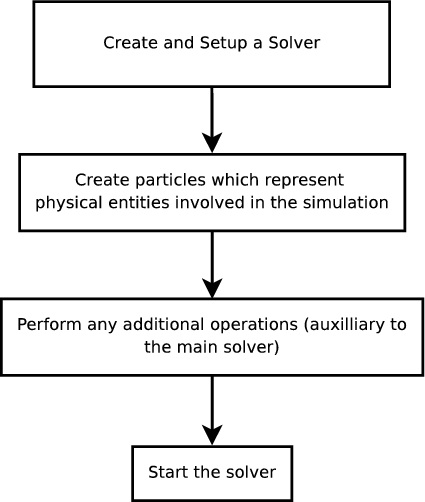
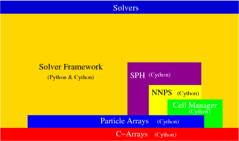
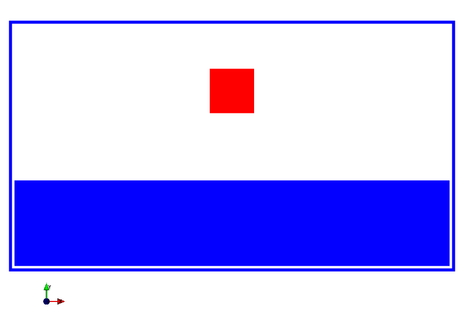
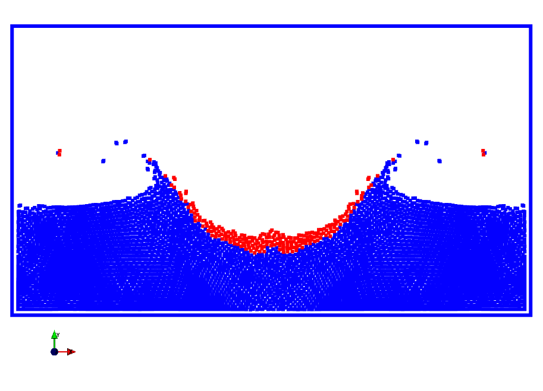
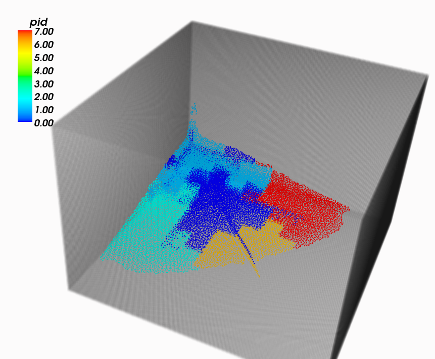

:author: Prabhu Ramachandran 
:email: prabhu@aero.iitb.ac.in
:institution: IIT Bombay

:author: Chandrashekhar Kaushik
:email: shekhar@zeusnumerix.com
:institution: IIT Bombay.

--------------------------------------------------------------
PySPH: A Python framework for smoothed particle hydrodynamics 
--------------------------------------------------------------

.. class:: abstract 

    [PySPH]_ is a Python-based open source parallel framework for
    Smoothed Particle Hydrodynamics (SPH) simulations.  It is
    distributed under a BSD license.  The performance critical parts are
    implemented in [Cython]_. The framework provides a load balanced,
    parallel execution of solvers.  It is designed to be easy to extend.
    In this paper we describe the architecture of PySPH and how it can
    be used.  

    At it's core PySPH provides a particle kernel, an SPH kernel and a
    solver framework.  Serial and parallel versions of solvers for some
    standard problems are also provided.  The parallel solver uses
    [mpi4py]_.  We employ a simple but elegant automatic load balancing
    strategy for the parallelization.  Currently, we are able to perform
    free surface simulations and some gas dynamics simulations.  PySPH
    is still a work in progress and we will discuss our future plans for
    the project.

Introduction
============

SPH Primer
----------

Smoothed Particle Hydrodynamics (SPH) is a computational simulation
technique. It was developed to simulate astral phenomena by [Gingold77]_
and [Lucy77]_ in 1977.  Since then, it has been used in numerous other
fields including fluid-dynamics, gas-dynamics and solid mechanics. 

The central idea behind SPH is the use of integral interpolants.
Consider a function :math:`f(r)`.  It can be represented by the
equation

.. math::
   :label: deltafunc

    f(r) = \int{f(r^\prime)\delta(r-r^\prime)dr^\prime}

Replacing the delta distribution with an approximate delta function,
:math:`W`, gives us:

.. math::
   :label: sphintegral

    f(r) = \int{f(r^\prime)W(r-r^\prime,h)dr^\prime}.

The above equation estimates the value of function :math:`f` at a
point :math:`r` in space using the weighted values of :math:`f` at
points near it. The weight decreases as the distance between :math:`r`
and :math:`r^\prime` increase. :math:`h` in the above equation
represents the particle interaction radius. The *support* of the kernel
:math:`W` is some small multiple of :math:`h`. Outside the support,
the value of :math:`W` is set to zero.  Compact support is
computationally advantageous since it allows us to avoid an
:math:`N^2` interaction among particles.

The above equation can be written in summation form as 

.. math::
   :label: sphsummation

   f(r_i) = \sum_jf(r_j)\frac{m_j}{\rho_j}W(r_i-r_j,h)

The above equation forms the core of all SPH calculations. The index *j*
loops over all neighboring particles. :math:`m_j` is the mass of a
particle and :math:`\rho_j` is the density of the particle. The term 

.. math::

    \frac{m_j}{\rho_j},

can be thought of as representing a volume element [Morris96]_.
Gradients and divergence encountered in the equations representing fluid
motion are represented using similar summations.  SPH finds widespread
use in many domains. [Monaghan05]_ and [Morris97]_ give extensive
details about the SPH method.

Related Work
------------

Despite the age of SPH and its applicability to many domains, there does
not seem to be much effort in developing a unified framework for SPH.
[SPHysics]_ is a FORTRAN-based open source package for performing SPH.
It's primary objective is to model free-surface flows.  From the
provided documentation we feel that it is not easy to set up simulations
in this package.  [SPH2000]_ is another parallel framework for SPH
written in C++. This code however does not seem to be in active
development currently. Moreover, they show exactly one example
simulation with their code. Neither package has a publicly accessible
source code repository.  Therefore, an open source package that is easy
to experiment with and extend will be a useful contribution to the
community, especially when combined with the flexibility of Python
[Oliphant07]_.

PySPH [PySPH]_ was created to address this need.  It is an open source,
parallel, framework for Smoothed Particle Hydrodynamics (SPH)
implemented in Python.

Choice of implementation language
---------------------------------

We use a combination of Python and [Cython]_ to implement the framework.
Python is a high-level, object-oriented, interpreted programming
language which is easy to learn. Python code is also very readable.
There are numerous packages (both scientific and otherwise) that can be
used to enhance the productivity of applications. A Python-based SPH
implementation can take advantage of these packages, which could enhance
it in various aspects, from providing plotting facilities (2D and 3D),
to generating GUI's, to running SPH simulations from the web, to
parallelization. All these features can also be accessed through an
interactive interpreter. [Oliphant07]_ discusses how Python can be used
for scientific computing.

Python, however, is an interpreted language. Thus, compute-intensive
tasks implemented in pure Python will be prohibitively slow. To overcome
this, we delegate all performance-critical tasks to a language called
Cython [Cython]_. Cython makes writing C extensions for Python nearly as
simple as writing Python code itself. A Cython module is compiled by a
compiler into a C extension module.  When the C code is compiled, it
becomes a module that may be imported from Python.  Most of Python's
features are available in Cython. Thus, by delegating all
performance-critical components to Cython, we are able to overcome the
performance hit due to the interpreted nature of Python and still use
all of Python's features. 

An overview of features
------------------------

PySPH currently allows a user to set up simulations involving
incompressible fluids and free surfaces in two and three dimensions.
The framework supports complex geometries. However, only a few simple
shapes have been currently implemented.  The framework has been designed
from the ground up to be parallel.  We use mpi4py [mpi4py]_ for the
parallel solver.  The parallel solver is automatically load balanced.

In the following, we outline the framework, discuss the current status
and future improvements that are planned.

The Framework
=============

The whole framework was designed to enable simple simulations to be
set up very easily, and yet be flexible enough to add complex features.
We present a high level view of a particle-based simulation in the
following.

Guiding Principle - High level view of a simulation
----------------------------------------------------

A simulation always involves a few key objects:

 * *Solver*: The solver is an object that manages the entire simulation.
   It typically delegates its activities to other objects like 
   integrators, component managers and arrays of particles.

 * *Entities*: The simulation involves distinct collections of particles
   each representing a particular physical entity.  Each entity is a
   derived class from the base class *EntityBase*.  For example, *Fluid*
   and *Solid* are two different classes and a user may create a
   collection of fluids and solids using this.  This allows a user to
   set up a simulation with a collection of physical entities.

The high level view outlined in Figure :ref:`figure1` served as the guiding principle
while designing various components of the framework.

 
   Outline of tasks to set up a simulation. :label:`figure1`

The various tasks shown in Figure :ref:`figure1` are explained below:

    * **Create and set up the solver**: Initially, we create an
      appropriate solver object for the simulation.  Different solvers
      are used for different kinds of simulations. We also set up various
      parameters of the solver.

    * **Create physical entities**: In this step, we add the physical
      entities (made of up particles), that will take part in the
      simulation.  Multiple sets of particles could be added, one for each
      physical entity involved.

    * **Additional operations to the solver**: We may require the solver to 
      perform additional operations (apart from the main simulation), like 
      writing data to file, plotting the data etc.  This is configured
      during this step.

    * **Start the solver**: The solver iterations are started.

The outline given above is very generic. This set of steps is useful in
setting up almost any particle-based simulation. Parallel simulations
too should adhere to the basic outline given above.  Given below is
pseudo-Python code to run a simple serial simulation::

    # Imports...
    solver = FSFSolver(time_step=0.0001,
                  total_simulation_time=10., 
                  kernel=CubicSpline2D())

    # create the two entities.
    dam_wall  = Solid(name='dam_wall')
    dam_fluid = Fluid(name='dam_fluid')

    # The particles for the wall.
    rg = RectangleGenerator(...)
    dam_wall.add_particles(
                      rg.get_particles())
    solver.add_entity(dam_wall)
    # Particles for the left column of fluid.
    rg = RectangleGenerator(...)
    dam_fluid.add_particles(
                      rg.get_particles())
    solver.add_entity(dam_fluid)

    # start the solver.
    solver.solve()

Architecture Overview
---------------------

The architecture may be broadly split into the following:

  * the particle kernel,

  * the SPH kernel,

  * the solver framework,

  * serial and parallel solvers.

The overall architecture of the framework is shown in Figure :ref:`figure2`.  We
discuss this in detail in the following sections.

Particle kernel
----------------

A fast implementation of arrays in Cython forms the foundation of the
framework. Arrays are ubiquitous in the implementation, hence the
implementation is made as fast as possible (close to C performance)
using Cython.  The base class for these arrays is called **BaseArray**
and subclasses of these in the form of **IntArray**, **FloatArray**
etc. are made available.  These expose a **get_npy_array** method which
returns a numpy array which internally uses the same C data buffer.  Our
arrays may be resized and are up to 4 times faster than numpy arrays
when used from Cython.

   Architecture of the framework :label:`figure2`

The **ParticleArray** module uses these arrays extensively and allows us
to represent collections of particles in the framework. It is also
implemented in Cython to achieve maximum performance.  Each
**ParticleArray** maintains a collection of particle properties and uses
the arrays to store this data.  Since the arrays allow the developer to
manipulate them as numpy arrays, it becomes easy to perform calculations
on the particle properties, if required.

One of the central requirements of the SPH is to find the nearest
neighbors of a given particle.  This is necessary in order to calculate
the influence of each particle on the others.  We do this using a
nearest neighbor algorithm (Nearest Neighbor Particle Search - NNPS)
which bins the domain into a collection of fixed size cells.  Particles
are organized into a dictionary keyed on a tuple indicative of the
location of the particle.  The nearest neighbor search is collectively
performed by the **CellManager** class and the **nnps** modules.  Both
are implemented in Cython.

SPH kernel
-----------

The SPH kernel consits of the **sph** module which contains classes to
perform the SPH summation (as given in the equations in the introductory
section) and also to represent particle interactions.   This includes a
variety of kernels.  These are implemented so as to use the **nnps** and
other modules discussed earlier.  These are all implemented in Cython
for performance.

Solver framework
-----------------

Finally, bringing all the underlying modules together is the **Solver
framework**. The framework is component based, and allows users to write
components, which are subclasses of **SolverComponent**, with a standard
interface set.  The **SolverComponent** is the base class for all
classes that perform any operation on any of the entities.  Many
abstractions required for a solver have been implemented, and a user can
inherit from various classes to implement new formulations.  The
**ComponentManager** manages all the **SolverComponents** used by the
solver.  It is also responsible for the property requirements of each of
the components involved in a calculation.  Thus, if an entity is
operated by a component that requires a particular property to be
available, the manager ensures that the entity is suitably set up.  An
**Integrator** class handles the actual time integration.  The
**Integrator** is also a **SolverComponent**.  These are
implemented in a combination of Python and Cython. 

Solvers
--------

New solvers are written using the various abstractions developed in the
solver framework and all of them derive from the **SolverBase** class.
Serial and parallel solvers are written using the functionality made
available in the solver framework.

Parallelization
=================

In SPH simulations, particles simply influence other particles in a
small neighborhood around them.  Thus, in order to perform a parallel
simulation one needs to:

  * partition the particles among different processors, and

  * share neighboring particle information between some of the
    processors.

For an SPH simulation, this does require a reasonable amount of
communication overhead since the particles are moving and the neighbor
information keeps changing.  In addition to this, we would like the load
on the processors to be reasonably balanced.  This is quite challenging.

Our objective was to maintain an outline similar to the serial code for
setting up simulations that run in parallel. For parallelization of the
framework, ideally only the **CellManager** needs to be aware of the
parallelism. The components in the solver framework simply operate on
particle data that they are presented with. This is achievable to a good
extent, except when a component requires global data, in which case the
serial component may need to subclassed and a parallel version written,
which collects the global data before executing the serial version code.
A good example for this is when a component needs to know the maximum
speed of sound in the entire domain in order to limit the time-step say. 

The pseudo-code of a typical parallel simulation is the same as the
serial example given earlier with just one change to the solver as below::

    solver = ParallelFSFSolver(
                  time_step=0.0001,
                  total_simulation_time=10., 
                  kernel=CubicSpline2D())

    # Code to load particles in proc with 
    # rank 0.

In the above pseudo-code, the only thing that changes is the fact that
we instantiate a parallel solver rather than a serial one.  We also
ensure that the particles are all loaded only on the first processor.
The **ParallelCellManager** manages the parallel neighbor information.
It also performs automatic load-balancing by distributing the particles
to different processors on demand based on the number of particles in
each processor.

The full details of the parallelization are beyond the scope of this
article but we provide a brief outline of the general approach.  More
details can be obtained from [Kaushik09]_.

The basic idea of the parallelization involves the following key steps:

 * Particles are organized into small cubical **Cells**.  Each cell
   manages a set of particles.  Cells are created and destroyed on
   demand depending on where the particles are present.

 * A region consists of a set of usually (but not always) connected
   cells.  Each region is managed by one processor.

 * The domain of particles is decomposed into cells and regions and
   allocated to different processors.

 * Cells are moved between processors in order to balance the load.

In addition, the **ParallelCellManager** ensures that each processor has
all the necessary information such that an SPH computation may be
performed on the the particles it manages.

Figure :ref:`figure3` outlines how the parallel and serial solvers are set up
internally.   In both cases, solver components operate on cell managers
to obtain the nearest neighbors and get the particles, the only
difference being the **ParallelCellManager**, which manages the load
distribution and communication in the parallel case. 

.. figure:: parallel-approach.pdf

   The parallel solvers simply use a ParallelCellManager
   instead of a CellManager. :label:`figure3`

It is important to note that the basic ideas for the parallel algorithm
were implemented and tested in pure Python using mpi4py.   This was done
in highly fragmented time and was possible only because of the
convenience of both Python and mpi4py.  Mpi4py allows us to send Python
objects to processors and this allowed us to focus on the algorithm
without worrying about the details of MPI.  The use of Python enabled
rapid prototyping and its libraries made it easy to visualize the
results.  In roughly 1500 lines we had implemented the core ideas, added
support for visualization, logging and command line options.  The
initial design was subsequently refined and parts of it implemented in
Cython.  Thus, the use of Python clearly allowed us to prototype rapidly
and yet obtain good performance with Cython.

Current status
==============

   Initial condition of a square block of water falling towards
   a vessel with water. :label:`figure4`

   Square block of water after it strikes a vessel containing
   water simulated with the SPH. :label:`figure5`

Figures :ref:`figure4`, :ref:`figure5` show the fluid at a particular instant when a square block
of water strikes a vessel filled with water.  This is a two-dimensional
simulation. 

Figure :ref:`figure6` shows a typical 3D dam-break problem being simulated with 8
processors.  The fluid involved is water.  The colors indicate the
processor on which the particles are located.

   3D dam-break problem simulated on 8 processors with
   particles colored as per processor ID indicating a load balanced
   simulation. :label:`figure6`

The current capabilities of PySPH include the following:

    * Fully automatic, load balanced, parallel framework.

    * Fairly easy to script.

    * Good performance.

    * Relatively easy to extend.

    * Solver for incompressible free surface flows.

Most importantly, we have a working framework and a reasonable design
which provides good performance.  However, there are several things we
need to improve.  

Future work
============

Our code is available in the form of a Mercurial repository on Google's
project hosting site [PySPH]_.  However, the code is not ready for a
proper release yet because we would like to perform a redesign of some
parts of the solver framework.  At the moment, they are a little too
complex.  Once this is done we would like to do the following:

  * Improve the documentation.

  * Reduce any compulsory dependence on VTK or TVTK.

  * Improve testing on various platforms.

  * A full-fledged release.

  * Support for gas-dynamics problems.

  * Support for solid mechanics problems.

This would take a few more months and at which point we will make a
formal release.

Conclusions
============

We have provided a high-level description of the current capabilities
and architecture of PySPH. We have also mentioned what we believe are
the future directions we would like to take.   We think we have made an
important beginning and believe that PySPH will help enable open
research and computing using particle-based computing in the future.  It
is important to note that Python has been centrally important in the
development of PySPH by way of its rapid prototyping capability and
access to a plethora of libraries.  

References
==========

.. [Cython] http://www.cython.org

.. [Gingold77] R. A. Gingold and J. J. Monaghan. *Smoothed particle
               hydrodynamics: theory and application to non-spherical
               stars*, Mon. Not.  R. astr. Soc., 181:375-389, 1977.

.. [Kaushik09] Chandrashekhar P. Kaushik. *A Python based parallel
               framework for Smoothed Particle Hydrodynamics*, M.Tech.
               dissertation, Department of Computer Science and
               Engineering, IIT Bombay, 2009.

.. [Lucy77] L. B. Lucy. *A numerical approach to testing the fission
            hypothesis*, The Astronomical Journal, 82(12):1013-1024,
            December 1977.

.. [Monaghan05] J. J. Monaghan. *Smoothed particle hydrodynamics*,
                Reports on Progress in Physics, 68(8):1703-1759, 2005.

.. [Morris96] J. P. Morris. *Analysis of smoothed particle hydrodynamics
              with applications*, PhD Thesis, Monash University,
              Australia, 1996.

.. [Morris97] J. P. Morris, P. J. Fox and Yi Zhu. *Modeling low Reynolds
              number incompressible flows using SPH*, Journal of 
              Computational Physics, 136(1):214-226, 1997.

.. [mpi4py] http://mpi4py.scipy.org

.. [Oliphant07] Travis E. Oliphant. *Python for scientific computing*,
                Computing in science and engineering, 9:10-20, 2007.

.. [PySPH] http://pysph.googlecode.com

.. [SPH2000] S. Ganzenmuller, S. Pinkenburg and W. Rosenstiel. *SPH2000: 
             A Parallel Object-Oriented Framework for Particle
             Simulations with SPH*, Lecture notes in computer science,
             3648:1275-1284, 2005.

.. [SPHysics] Gòmez-Gesteira M., Rogers, B.D., Dalrymple, R.A., Crespo, 
              A.J.C. and Narayanaswamy, M. *User guide for the SPHysics
              code 1.4*, http://wiki.manchester.ac.uk/sphysics.

