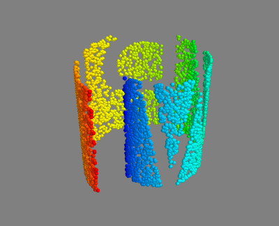

:author: Randy Paffenroth
:email: rcpaffenroth@wpi.edu
:institution: Worecester Polytechnic Institute, Mathematical Sciences Department and Data Science Program

:video: http://www.youtube.com/watch?v=dhRUe-gz690

------------------------------------------------
Python in Data Science Research and Education
------------------------------------------------

.. class:: abstract

  Here we demonstrate how Python can be used throughout an entire
  lifecycle of a graduate program in Data Science.  In
  interdisciplinary fields, such as Data Science, the students often
  come from a variety of different backgrounds where, for example,
  some students may have strong mathematical training but less
  experience in programming.  Python’s ease of use, open source
  license, and access to a vast array of libraries make it
  particularly suited for such students.  In particular, we will
  discuss how Python, IPython notebooks, scikit-learn, NumPy, SciPy,
  and pandas can be used in several phases of graduate Data Science
  education, starting from introductory classes (covering topics such
  as data gathering, data cleaning, statistics, regression,
  classification, machine learning, etc.) and culminating in degree
  capstone research projects using more advanced ideas such as convex
  optimization, non-linear dimension reduction, and compressed
  sensing.  One particular item of note is the scikit-learn library,
  which provides numerous routines for machine learning.  Having
  access to such a library allows interesting problems to be addressed
  early in the educational process and the experience gained with such
  “black box” routines provides a firm foundation for the students own
  software development, analysis, and research later in their academic
  experience.  

.. class:: keywords

   data science, education, machine learning

Introduction
------------

Data Science is a burgeoning field of study that lays at the
intersection of statistics, computer science, and numerous applied
scientific domains.  As is common within such *interdisciplinary*
domains of study, Data Science education, mentoring, and research
draws ideas from, and is inspired by, several other more classic
areas.  Perhaps just as importantly, student who wish to pursue
education and careers in Data Science common from similarly diverse
backgrounds.  Accordingly, the challenges and opportunities of being
an educator in such a domain requires one to reflect on appropriate
tools and approaches that promote educational success.  In is the
author's view, and experience, that the Python scripting language can
be an effective part of the Data Science curriculum for several
reasons including its ease of use, its open source license, and its
access to a vast array of libraries covering many topics of interest
to Data Science.

Worcester Polytechnic Institute (WPI) has recently (Fall 2014) begun
admitting students into its new Data Science Master's degree program.
Already the program appears to be experiencing some preliminary
success, with far more applications each semester than we can
reasonably admit, and many students already having success finding
internships and having bright prospects for future jobs.  Of course,
it is much to early to make any comments on the sustained of the
program, however, perhaps the gentle reader will find some value in
the author's experiences, even at this early date.

Of course, we are not the first to suggest Python's effectiveness in
an education and research environment.  In fact, the Python
programming language is quite popular in numerous problem domains and
Python has seen wide used in education, see e.g., [Mye07]_ and
[Sta00]_.  In fact, in ranks quite highly in many surveys of
programming language popularity CITE
http://redmonk.com/sogrady/2014/01/22/language-rankings-1-14/
and it seeing substantial growth within the Data Science community
CITE http://www.experfy.com/blog/python-data-science/.

However, it is not our purpose here to focus on Python
in the large, but rather to focus on its use in *Data Science*
education and research.  With that in mind, herein we will focus on a
small number of case studies that provide insights into how Python can 
leveraged.   

In particular, herein we will discuss the use of Python at three
different levels of Data Science education and research.  First, one
of the courses that is offered as part of the Data Science curriculum,
and in which the author and others have leveraged Python, is DS501
|--| "Introduction to Data Science".  The idea of DS501 is to provide
an introductory overview of the many fields that comprise Data Science
and it is intended that DS501 be one of the first classes a new
student takes when entering the program.  Second, the author has also
used Python to support MA542 |--| "Regression Analysis".  MA542 is a
somewhat more advanced class that is a (core) elective in the Data
Science program as well as being a class taken by many students who
are seeking degrees in the Mathematical Sciences department.  Finally,
the author mentors a number of student's research projects both within
the Data Science Program and the Mathematical Sciences Department.
These research projects all leverage Python, in various ways,
and having access to a common code base allows the various student
projects to build off of one another.

Two key themes will permeate our discussion in the following sections.
First, Python provides easy access to a vast array of libraries.  Even
though Data Science education and research draws from many other
domains, Python was always there with a library ready to support our
work.  Second, and perhaps more subtly, having access to a language
which is easy to use, but provides access to many advanced libraries,
allows one to carefully craft the difficulty and scope of homework
assignments, class projects, and research problems.  In particular,
Python allows students to tackle particular aspects of real world
problems, without being overly burdened with details that are
extraneous to their particular learning objectives.  Both properties make
Python particularly advantageous.

TODO Get rid of after references are done.
TODO Put in references.

Python [Lut13]_, IPython notebooks [Per07]_, scikit-learn [Ped11]_,
  NumPy [Wal11]_, SciPy [Oli01]_, and pandas [McK10]_ [McK10]_

matplotlib [Hun07]_
Cython [Beh11]_
Mayavi [Ram11]_

TODO Compare to R?
TODO More mention of learning objectives earlier in the introduction.

DS501 Introduction to Data Science
----------------------------------

DS501 |--| "Introduction to Data Science" is intended to be one of the
first classes a new student takes when entering the Data Science
program at WPI, and the goal is to provide a high level overview of a
wide swath of the material that a burgeoning Data Scientist should know.
In particular, the course is described as:

.. raw:: latex  
 
  \begin{quotation} 

    This course provides an overview of Data Science, covering a broad
    selection of key challenges in and methodologies for working with
    big data. Topics to be covered include data collection,
    integration, management, modeling, analysis, visualization,
    prediction and informed decision making, as well as data security
    and data privacy. This introductory course is integrative across
    the core disciplines of Data Science, including databases, data
    warehousing, statistics, data mining, data visualization, high
    performance computing, cloud computing, and business
    intelligence. Professional skills, such as communication,
    presentation, and storytelling with data, will be
    fostered. Students will acquire a working knowledge of data
    science through hands-on projects and case studies in a variety of
    business, engineering, social sciences, or life sciences
    domains. Issues of ethics, leadership, and teamwork are
    highlighted. --
    {\footnotesize http://www.wpi.edu/academics/catalogs/grad/dscourses.html}

  \end{quotation}

As one might imagine for such a course, finding the right level of
detail for the course can be quite challenging especially considering
the fact that many of the students have quite varied backgrounds, with
some being experts in mathematics, but with perhaps less training in
computer science or software development, while others find themselves
in the opposite situation.  

In the author's view, an important feature of such a class is that the
students should be able to *get "their hands dirty" playing with real
data*.  Students can often find inspiration by seeing the ideas discussed
in class put to use on problems of practical interest (TODO citation).

With all of the above in mind, the author and the others involved in
the design of DS501 decided to have as a focus of the class be an
interconnected set of four *case studies*.  Each case study is
intended to build upon the previous one until the students are able to
solve some interesting and pertinent problems in Data Science.  And it
is precisely here were Python had a substantial role to play.

Case Study 1
~~~~~~~~~~~~

The idea of the first case study in DS501 is to perform basic data
gathering, cleaning, and collection of statistics.  For this case
study we choose our data source to be the Twitter Data Streaming API
TODO cite.  Already, Python begins to demonstrate its usefulness,
since it allows ready access to the Twitter API through python-twitter
TODO CITE https://code.google.com/p/python-twitter/.

Another key feature of the case studies in DS501 is that we chose to
use IPython notebooks [Per07]_ both to provide the assignments to the
students and to have the students submit their results.  Using IPython
notebooks for both of these tasks provided a number of advantages.
First and foremost, it let the instructors to provide the students
with skeleton implementations of their assignments and allowed the 
students to focus on their learning objectives.  

For example, in the IPython notebooks we provided code examples
similar to the following:

.. code-block:: python

   import twitter
   #---------------------------------------------
   # Define a Function to Login Twitter API
   def oauth_login():
       # Go to http://twitter.com/apps/new to create an 
       # app and get values for these credentials that you'll 
       # need to provide in place of these empty string values 
       # that are defined as placeholders.  
       # See https://dev.twitter.com/docs/auth/oauth for 
       # more information on Twitter's OAuth implementation.
    
       CONSUMER_KEY = '<Insert your key>'
       CONSUMER_SECRET ='<Insert your key>'
       OAUTH_TOKEN = '<Insert your token>'
       OAUTH_TOKEN_SECRET = '<Insert your token>'
    
       auth = twitter.oauth.OAuth(OAUTH_TOKEN, 
		                  OAUTH_TOKEN_SECRET,
                                  CONSUMER_KEY, 
                                  CONSUMER_SECRET)
    
       twitter_api = twitter.Twitter(auth=auth)
       return twitter_api

   #----------------------------------------------
   # Your code starts here
   #   Please add comments or text cells in between to 
   #   explain the general idea of each block of the code.
   #   Please feel free to add more cells below this cell 
   #   if necessary

In this example we provide a skeleton that allows the students to not
have to struggle with the details of Twitter authentication, but
rather focus on the objective of analyzing tweets and hashtags with
frequency analysis.  Using Python, and the skeleton code provided by
the instructors, the student where able to gather and analyze many
thousands of tweets and learn important lessons about data gathering,
data APIs, data storage, and basic analytics.

Case Study 2
~~~~~~~~~~~~

Building upon the skills gained in the first case study, the second
case study asks the students to analyze the MovieLens 1M Data Set
(CITE) FIXME Check MovieLens license, which contains data about users
and how the rate movies.  The key learning objectives are to analyze
the data set, make conjectures, support or refute those conjectures
with data, and tell a story about the data.  In particular, the
students are not only asked to perform several technical tasks, but
they must also propose a business question that they think this data
can answer.  In effect, the are expected to play the role of a Data
Scientist at a movie company and they must convince "upper
management", who are not presume to be technically minded, that their
conjecture is correct.
    
While a seemingly tall order for only the second case study, Python
again shows it utility.  In particular, just as in case study 1, the 
assignment is provided in an IPython notebook, and the student is required
to submit their work in the same format, thereby leveraging the skills
learned in the first case study.

However, in this case study we introduce several important Python
libraries that support Data Science including Numpy [Wal11]_,
matplotlib [Hun07]_, and, perhaps most importantly, pandas [McK10]_.
As is perhaps well known to the readers of this text, Numpy provides a
vast selection of routines for numerical processing, including
powerful array and matrix/vector classes, while matplotlib allows for
plotting of data and generation of compelling figures.  Finally,
pandas provides many tools for data processing, including a structure
called a DataFrame (inspired by a data structure with the same name in
the R language CITE), which facilities many data manipulations.  Note,
we are certainly not the first to consider this collection of
libraries to be important for Data Science, and this particular case
study was inspired by the excellent book "Python for Data Analysis:
Data Wrangling with Pandas, NumPy, and IPython", by Wes McKinney CITE
(http://shop.oreilly.com/product/0636920023784.do) (which is required
reading for this particular assignment).

Many of the tasks in this case study revolve around question like:

* How many movies have an average rating over 4.5 overall?
* How many movies have an average rating over 4.5 among men?  How
  about women?
* How many movies have an *median* rating over 4.5 among men over age
  30?  How about women over age 30?
* What are the ten most popular movies given a reasonable, student 
  derived definition of "popular"?

and the visualization of the data by way of:

* Plotting a histogram of the ratings of all movies.
* Plotting a histogram of the *number* of ratings each movie received.
* Plotting a histogram of the *average rating* for each movie.
* Plotting a histogram of the *average rating* for movies which are rated
  more than 100 times.
* Making a scatter plot of men versus women and their mean rating for
  every movie.
* Making a scatter plot of men versus women and their mean rating for
  movies rated more than 200 times.

among others.  Note, there are a number of important learning
objectives that we wish to support.  First, several terms are,
intentionally, only vaguely defined in the assignment.  For example,
the precise definition of "popular" is left to the student to derive.
Second, the student is expected to make hypotheses or conjectures
based upon the definitions they come up with.  For example, perhaps
the conjecture that men's and women's rating for certain genres are
highly correlated.  Finally, the students must try to either prove, or
just as interestingly, disprove their conjectures based upon the data.

Diving a bit more deeply into some of the specific functionality that
we leverage in Python, and pandas in particular.  To any Python
aficionado, it is likely clear that there are many ways to process the
data to answer the questions above, ranging from the brute force to
the elegant.  

To start, the MovieLens 1M Data Set itself is actually provided in
three different files.  First is a file containing the information
regarding individual users, indexed by a unique *user_id*.  Second is
a file containing the information regarding each movie, indexed by a
unique *movie_id*.  Finally, and perhaps most importantly, is a file
which contains ratings (and time stamps) indexed by a pair of
*user_id* and *movie_id*.

Already we can perceive a thorny issue.  Clearly, the questions of
interest can only be answered by appropriate cross referencing between
these three files.  For example, all three files must be referenced to
answer a question an seemingly straight forward as "how many action
movies do men rate higher than 4?"  While perhaps not too troublesome
for students who are adept programmers, the cross referencing between
the files presents an unnecessary impediment to less proficient
students that does not support the learning goals for this assignment.

Of course, a straight forward answer would be for the instructors to
preprocess the data appropriately.  However, using the power of Python 
one can easily arm the students with a general tool, while at the same 
time avoiding unnecessary hurdles.  In particular, the pandas provides
a merge function CITE that provides exactly the required functionality
in a quite general framework.  In particular, one can use the code
below to easily merge the three data files into a single DataFrame.

.. code-block:: python

   import pandas as pd
   #---------------------------------------------

   # Read in the user data into a DataFrame
   unames = ['user_id', 'gender', 'age', 'occupation', 'zip']
   users = pd.read_table('ml-1m/users.dat', sep='::', header=None,
   names=unames)

   # Read in the rating data into a DataFrame
   rnames = ['user_id', 'movie_id', 'rating', 'timestamp']
   ratings = pd.read_table('ml-1m/ratings.dat', sep='::', header=None,
   names=rnames)

   # Read in the movie data into a Data Frame
   mnames = ['movie_id', 'title', 'genres']
   movies = pd.read_table('ml-1m/movies.dat', sep='::', header=None,
   names=mnames)

   # Merge all the data into one DataFrame
   data = pd.merge(pd.merge(ratings, users), movies)

Of course, even once the data files have been merged, there are many
places where a student might be lead astray.  Fortunately, pandas
provides another tool which allows for elegant and compact code,
namely the *pivot-table*.  For example, one can imagine writing
complicated loops and conditionals to perform the task of printing
out all movies that have a median rating of 5 by men or women.
However, using pivot-tables, such a question can be answered with
just three lines of code.

.. code-block:: python

   # Create a pivot table to aggregate the data
   mean_ratings = data[data['age'] > 30].pivot_table(values='rating', 
                                                     rows='title', 
                                                     cols='gender', 
                                                     aggfunc='median')
   # Only print out movies with at least one rating
   print (mean_ratings[mean_ratings['M'].notnull()].sort('M',
     ascending=False)['M'] > 4.5).nonzero()
   print (mean_ratings[mean_ratings['F'].notnull()].sort('F',
     ascending=False)['F'] > 4.5).nonzero()

Of course, one might be tempted to argue that having students develop
their own code, rather than leveraging such *black box* routines leads
to a deeper learning experience.  While we certainly appreciate this
point of view, we wish to emphasize that the class in question is a
introductory Data Science class, and not a programming or data
structure class.  Accordingly, using Python, and the powerful features
of libraries such as Pandas, allows us to focus on the Data Science
learning goals, while at the same time allowing the students to
utilize large scale, real world, and sometimes messy data sources.
This theme of using Python to allow for focused learning goals, using
real world data, is a key message our this text.

Case Study 3
~~~~~~~~~~~~

The third case study is substantially more challenging than the second
case study, but builds on the foundations already laid down.  While
case study focused on analyzing *numerical* movie reviews, case study
three focuses on detecting positive and negative reviews from raw text
using natural language processing.

In particular, is case study three the class turns it attention to the
Movie Review Data v2.0 from the
http://www.cs.cornell.edu/people/pabo/movie-review-data.  This data
set contains written reviews of movies divided into positive and
negative reviews, and the goal is to learn how to automatically detect
which are which.

Of course, tackling such problems is well known to be difficult, and
there are many open research problems in this domain.  On the other
hand, such problems are clearly of importance in many domains, and it
is not at all difficult to get students interested in solving them.
The question remains, how can students in their very first Data
Science class be expected to approach such difficult and important
problems, and still be able to make meaningful progress?  Of course,
the answer is, again, Python.

In particular, we base this case study on the excellent scikit-learn
scikit-learn [Ped11]_ Python library.  The scikit-learn provides easy
to use and efficient tools for data analysis.  Most importantly, it
provides routines for many important Data Science concepts such as
machine learning and cross validation.  In fact, this case study is
inspired by the scikit-learn tutorial "Working With Text Data" which
can be found at
http://scikit-learn.org/stable/tutorial/text_analytics/working_with_text_data.html.

Following our theme of leveraging Python to quickly get to interesting
Data Science, the students in case study 3 are encouraged to start their
work based upon various examples provided in the scikit-learn library.
In particular, the students leverage the files:

* doc/tutorial/text_analytics/skeletons/exercise_02_sentiment.py
* doc/tutorial/text_analytics/solutions/exercise_02_sentiment.py

For DS501 there are two key learning goals for this case study.
First, the students need to derive *features* from the raw text that
they feel would be useful in predicting positive and negative
sentiments.  Second, they must make predictions by processing these
features using a variety of supervised machine learning algorithms.

Classically, rather than attempting to do machine learning on raw
text, Data Science practitioners will first process the raw text to
derive features for downstream processing.  A detailed description of
text feature generation is beyond the scope of the current text (the
interested reader may see CITE for more details).  However, Python and
scikit learn provide the exact functionality required by the students
by way of the TfidVectorizer class which implements the term
frequency–inverse document frequency (TF-IDF) statistic (CITE
http://en.wikipedia.org/wiki/Tf\%E2\%80\%93idf) .  The documentation
for this class can be found at
http://scikit-learn.org/stable/modules/generated/sklearn.feature_extraction.text.TfidfVectorizer.html,
and for our purposes we merely observe that there are several
parameters that the student can explore to get a fell for feature
generation including *min_df* and *max_df* parameters (which control
thresholds on document frequencies) and ngram_range (which controls
how many words are conglomerated into a single token).  Experimenting
with these parameters provide many important insights for the, not the
least of which is that large values of ngram_range may take a long
time to run.

Now, given a collection of reviews, each represented by a set of
features, sometimes called *predictors*, one can imagine many
interesting problems.  For example, a classic problem in machine
learning involves using a set of reviews which have appropriate labels
(in this case positive or negative) to *predict* labels of other
reviews which do not already have labels.  This process is called
*supervised* machine learning.  The idea is that the labeled data is
used to *supervise* the training of a algorithm which, after training,
can effectively compute labels just from the raw features.  Again,
supervised machine learning is a vast subject, and space does not
allow use treat the subject even at the more superficial level here (the
interested read may see CITE, and references therein, for more
detail).  However, we will now that scikit-learn provides functions
and classes for many standard algorithms, allowing the students to 
become familiar with important machine learning and Data Science
concepts, without being burdened with too many prerequisites.
For example, sci-kit learn provides access to classic and power
algorithms such as K-nearest neighbors CITE, support vector
classifiers CITE, and principle component analysis CITE.

Using such routines, several important learning objectives can be
supported, such as error estimation, by way of techniques such as
cross-validation and confusion matrices.  In fact, one particularly
effective learning experience revolved around the following challenge.
Using their favorite technique, can the student find a two dimensional
plot of the data where the positive and negative reviews are
separated.  While easy to state, actually solving the problem is
exceptionally difficult, and the instructors admit that they are not
in possession of an actual solution.  This is many students first 
time attempting to tackle a problem for which the answer is not
known FIXME Say better.

Case Study 4
~~~~~~~~~~~~

The final case study, and in some sense the capstone of the class
revolves around the Yelp Dataset Challenge
http://www.yelp.com/dataset_challenge.  This case study involves a
large data set with approximately 42,153 business, 252,898 users, and
1,125,458 reviews in Phoenix, Las Vegas, Madison, Waterloo and
Edinburgh.

Again, building off of the previous case studies, the students are
expected to process the data, generate statistics, process reviews
using TfidVectorizer, etc.  However, for this case study the students
are expected to process the data using MapReduce CITE.  As is well
known in many circles, MapReduce is a programming model (with various
implementations) for distributed processing of large scale data
sets. Distributed processing models, and MapReduce in particular, are
essentional elements of modern Data Science and we woul have felt remiss
if students in a class such as DS501 were not able to experience,
at least at some level, the beauty and power of such methods.

Fortunately, and we fear that we are repeating ourselves, Python
provides precisely the functionality we required.  In particular,
there are several MapReduce interfaces for Python, and we choose to
use the mrjob package CITE https://pythonhosted.org/mrjob/.  This
package is especially useful in a classroom environment since it can
be used locally on a single computer (for testing) and in a cluster
environment.

Introductory Data Science: Final Thoughts
~~~~~~~~~~~~~~~~~~~~~~~~~~~~~~~~~~~~~~~~~

Of course, Python is not the only choice for an Introductory Data
Science course.  For example, the programming language R CITE is also
a popoular choice which the author has also used it successfully in
the Data Science curriculum.  In particular, R offers all of the
functionality mentioned above, including interfaces to MapReduce
http://www.milanor.net/blog/?p=853.  Accordingly, the choice of
language for such a class may be considered a matter of taste

However, there is mounting evidence of Python's growing popularity
within the Data Science community CITE
http://www.experfy.com/blog/python-data-science/ and the development
community at large CITE
http://redmonk.com/sogrady/2014/01/22/language-rankings-1-14/.
Perhaps, if we may be forgiven a small measure of Python bias, then
perhaps we will merely emphasize that Python's popularity cuts across
many problem domains.  For example, the authors are not aware of any
web servers currently being developed in R [#]_, nor many other
domains in which Python has made inroads.  The fact that Python is as
generally applicable as it is, while still perhaps being just as
popular as R for Data Science, it a testement to its advantages.

.. [#] We would be remiss not to at least mention the quite beautiful
       R web application framework Shiny CITE.  However, we believe
       our point still stands.

MA542 Regression Analysis
-------------------------

Leaving aside introductory classes, we now make brief mention of
Python's usefulness in more advanced classes.  In particular, the
author recently taught a Regression Analysis class for the first time
with all of the development in the class being Python focused.
Regression Analysis is a more advanced class with a greater
concentration of students who take the class being mathematically
focused.  In addition, many students were first time Python users,
with the majority of the exceptions being Data Science students who 
had taken Introduction to Data Science previously.

Just as in Introduction to Data Science Numpy, matplotlib, and Pandas
provided almost all of the functionality the students required for the
learning objectives in the class.  In fact, one of the challenges in
this class was that Python perhaps does *too good* of a job providing
functionality to the students.  

In partiuclar, Python provides so many libraries that, for example,
many of the computationally oriented homework questions are trivially
answerable if the students look hard enough.  Accordingly, as an
instructore, one needs to be careful that the ground rules are set
correctly so that the learning objectives are achieved.  For example,
if the learning obective is for the student to understand the details
of a particular mathematical concept, say the *normal equations*,
rather than just a numerical procesdure, such as *linear regression*
on a particular dataset, then the expectations for the assignment need
to be carefully delinated.  

Note, on the positive side, the instructor can use Python and its vast
array of libraries to carefully control the difficulty and scope of
assignements.  Even better, since Python is quite easy to learn CITE,
we are able to focus on the mathematics and not have the language get
in the way.

Accordingly, to maintain the integrity of the learning objecitves, a
tactic usde by the authors was to carefully delinate what parts of the
assignement are allow to be Python "black boxes" and which parts must
be hand coded.  In addition, we require the students to hand in their
Python code, even though the code itself is *not* graded.  The
learning objectives of the class are mathematical, and not
programming.  Accordingly, the quality of the implementations is not a
focus.  However, having access to the code allows the instructor to
insure that the desired learning objectives are being met.

As one final note, one tactic that was quite successful was to
encourage the students to check their hand coded results against those
provided any black box routine they find.  It was quite useful for the
students in debugging their own implementations and understanding of
the mathematical concepts.  It was quite empowering for the students
when their answers would exactly match those of the black box.  They
then appreciated that they understood, in a deep way, what the
"professionals" were doing.

Student research projects and theses
------------------------------------

The author is proud to report that they have been using Python for
science research since 1997 [Paf99]_.  We perform research involving,
and mentor students in, several topics revolving around
semi-supervised and unsupervised machine learning applied to several
different domains, with a focus on cyber defense (see, for example,
CITE).  We will not burden the reader the details of our mathematical
research directions, but just observe that our work, and the work of
our students, draws from laundry list of ideas from mathematics,
statistics, and Data Science, including convex optimization CITE,
deep learning CITE, graphical models CITE, graph theory CITE, and
scientific visalualization CITE.

For the current purpose, it is merely interesting to note that  
Python libraries are available for *all of these subjects*:

* Convex optimization: CVXOPT CITE, CVXPY CITE
* Deep learning: Theano CITE
* Graphical models:  FIXME CITE
* Graph theory:  networkx CITE
* Scientific visualization: mayavi CITE

Accordingly, students who are train in classes such as DS501 and MA542 can 
everage that training to get a quick start on their research subjects.

We use all of these libraries in our work, where we are especially
interesed in large scale robust principle component analysis CITE and
non-linear dimension reduction CITE problems, such as shown in figure
FIXME.  FIXME Lead into figure better.

   An example of a 3D visualization of a manifold using Mayavi.  In
   our work we attempt to detect the non-linear dependcies in such
   data, even when the data is noisy and unevenly distributed.

Beyond the mathematical research that Python supports, there are a
vast array of computational resources that are at the fingertips of
those well versed in Python.  For example, our research group is
interested in developing algorithms for modern distributed
supercomputers that leverage GPUs to accelerate computations.  Again,
Python displays its usefullness with the pycuda CITE and mpi4py
libraries.

Conclusion
----------
It can be used at all levels, and each level builds on the previous one.
There is such a broad array of libraries available in Data Science (or 
whatever you want to call it) that students can focus on what is important
to them.

References
----------
.. cython
.. [Beh11] Stefan Behnel, Robert Bradshaw, Craig Citro, Lisandro
           Dalcin, Dag Sverre Seljebotn and Kurt Smith. Cython: The
           Best of Both Worlds, Computing in Science and Engineering,
           13, 31-39 (2011), DOI:10.1109/MCSE.2010.118 (publisher
           link)

.. matplotlib
.. [Hun07] John D. Hunter. Matplotlib: A 2D Graphics Environment,
           Computing in Science & Engineering, 9, 90-95 (2007),
           DOI:10.1109/MCSE.2007.55 (publisher link)

.. python
.. [Lut13] Lutz, Mark. *Programming python*. 5th edition, O'Reilly
           Media, Inc., 2010.

.. pandas
.. [McK10] Wes McKinney. Data Structures for Statistical Computing in
           Python, Proceedings of the 9th Python in Science
           Conference, 51-56 (2010) (publisher link)

.. scientific computing in python
.. [Mil11] K. Jarrod Millman and Michael Aivazis. Python for
           Scientists and Engineers, Computing in Science &
           Engineering, 13, 9-12 (2011), DOI:10.1109/MCSE.2011.36

.. python for education
.. [Mye07] Myers, Christopher R., and James P. Sethna. *Python for
	   education: Computational methods for nonlinear systems.*
	   Computing in Science & Engineering 9.3 (2007): 75-79.

.. scipy
.. [Oli01] Jones E, Oliphant E, Peterson P, et al. *SciPy: Open Source
           Scientific Tools for Python*, 2001-, http://www.scipy.org/
           [Online; accessed 2015-05-31].

.. scientific computing in python
.. [Oli07] Travis E. Oliphant. *Python for Scientific Computing*,
           Computing in Science & Engineering, 9, 10-20 (2007),
           DOI:10.1109/MCSE.2007.58

.. [Paf99] Paffenroth, Randy C. *VBM and MCCC: Packages for objected 
	   oriented visualization and computation of bifurcation 
	   manifolds.* Object Oriented Methods for Interoperable 
	   Scientific and Engineering Computing: Proceedings of the 
	   1998 SIAM Workshop. Vol. 99. SIAM, 1999.

.. sklearn
.. [Ped11] Fabian Pedregosa, Gaël Varoquaux, Alexandre Gramfort,
           Vincent Michel, Bertrand Thirion, Olivier Grisel, Mathieu
           Blondel, Peter Prettenhofer, Ron Weiss, Vincent Dubourg,
           Jake Vanderplas, Alexandre Passos, David Cournapeau,
           Matthieu Brucher, Matthieu Perrot, Édouard
           Duchesnay. Scikit-learn: Machine Learning in Python,
           Journal of Machine Learning Research, 12, 2825-2830 (2011)
           (publisher link)

.. ipython
.. [Per07] Fernando Pérez and Brian E. Granger. IPython: A System for
           Interactive Scientific Computing, Computing in Science &
           Engineering, 9, 21-29 (2007), DOI:10.1109/MCSE.2007.53
           (publisher link)

.. mayavi
.. [Ram11] Ramachandran, P. and Varoquaux, G., `Mayavi: 3D
           Visualization of Scientific Data` IEEE Computing in Science
           & Engineering, 13 (2), pp. 40-51 (2011)

.. education
.. [Sta00] Stajano, Frank. *Python in education: Raising a generation
	   of native speakers.* Proceedings of 8th International
	   Python Conference. 2000.

.. numpy and scipy
.. [Wal11] Stéfan van der Walt, S. Chris Colbert and Gaël
           Varoquaux. The NumPy Array: A Structure for Efficient
           Numerical Computation, Computing in Science & Engineering,
           13, 22-30 (2011), DOI:10.1109/MCSE.2011.37 (publisher link)

