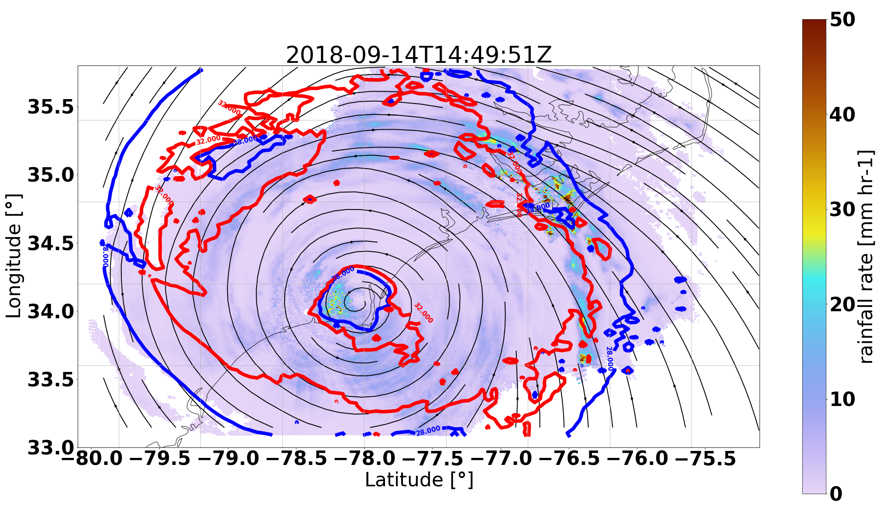
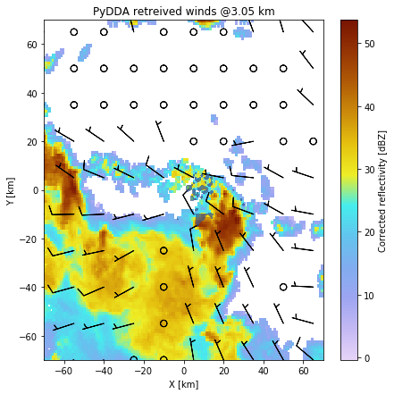
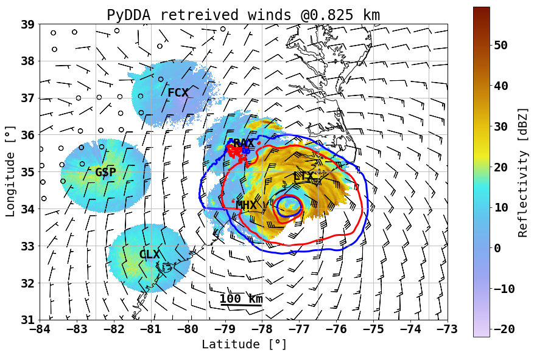
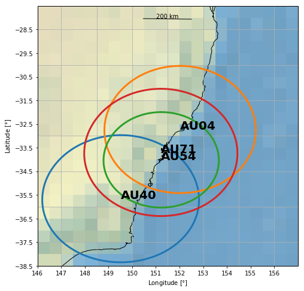
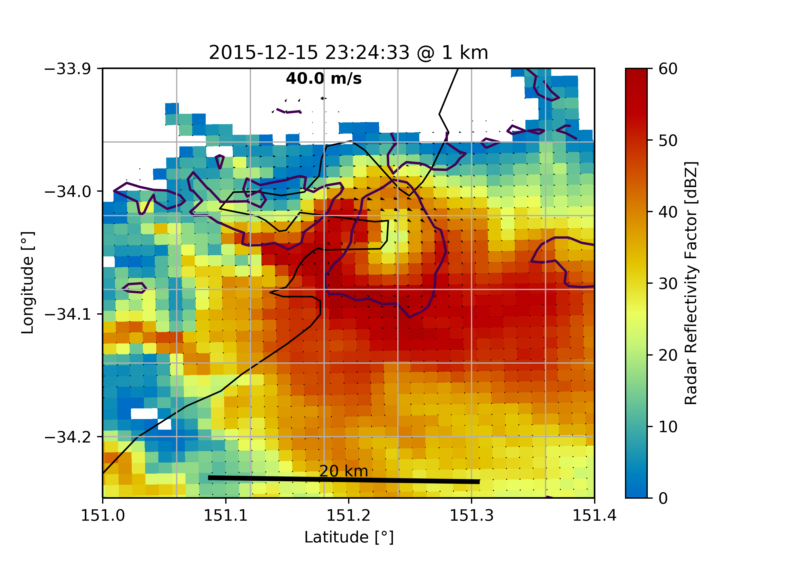
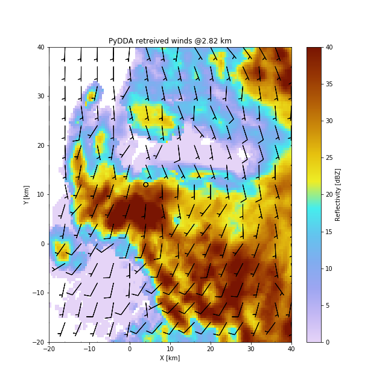

:author: Robert Jackson
:email: rjackson@anl.gov
:institution: Argonne National Laboratory, Argonne, IL, USA

:author: Scott Collis
:email: scollis@anl.gov
:institution: Argonne National Laboratory, Argonne, IL, USA

:author: Timothy Lang
:email: timothy.j.lang@nasa.gov
:institution: NASA Marshall Space Flight Center, Huntsville, AL, USA

:author: Corey Potvin
:email: corey.potvin@noaa.gov
:institution: NOAA/OAR National Severe Storms Laboratory, Norman, OK, USA
:institution: School of Meteorology, University of Oklahoma, Norman, OK, USA

:author: Todd Munson
:email: tmunson@anl.gov
:institution: Argonne National Laboratory, Argonne, IL, USA

:bibliography: mybib

------------------------------------------------
PyDDA: A new Pythonic Wind Retrieval Package
------------------------------------------------

.. class:: abstract

   PyDDA is a new community framework aimed at wind retrievals that depends
   only upon utilities in the SciPy ecosystem such as scipy, numpy, and dask.
   It can support retrievals of winds using information from weather radar
   networks constrained by high resolution forecast models over grids that
   cover thousands of kilometers at kilometer-scale resolution.
   Unlike past wind retrieval packages, this package can be installed using
   anaconda for easy installation and, with a focus on ease of use can retrieve
   winds from gridded radar and model data with just a few lines of code. The
   package is currently available for download at https://github.com/openradar/PyDDA.

.. class:: keywords

   wind, retrieval, hurricane, tornado, radar

Introduction
------------

Three dimensional wind retrievals are important for examining the dynamics
that drive severe weather such as tornadoes and hurricanes. In addition, spatial
wind retrievals inside severe convection are important for assessing the wind
damage they cause. Scanning radars provide the best opportunity for providing three dimensional
volumes of winds inside severe weather. However, the retrieval of three dimensional
winds from weather radars is a nontrivial task. Given that the radar measures the
speed of scatterers in the direction of the radar beam rather than the full wind velocity,
retrieving these winds requires more information than the Doppler velocities measured by a
single weather radar. Typically, the 3D wind field is retrieved based on constraints
with regards to physical laws such as conservation of mass or wind data from
other sources such as model reanalyses, wind profilers, and rawinsondes. In
particular, atmospheric scientists use two methods to retrieve winds from
scanning weather radars. The first method prescribes a strong constraint
on the wind field according to the mass continuity equation. The second
method is a variational technique that places weak constraints on the
wind field by finding the wind field that minimizes a cost function according
to deviance from physical laws or from observations (:cite:`Shapiroetal2009`,
:cite:`Potvinetal2012`).

Currently existing software for wind retrievals includes software based
off of the strong constraint technique such as CEDRIC :cite:`CEDRIC` as well
as software based off of the weak variational technique such as MultiDop
:cite:`Langetal2017`. Since CEDRIC uses a strong constraint
from mass continuity equation to retrieve winds, the addition of constraints
from other data sources is not possible with CEDRIC. Also, while CEDRIC was
revolutionary for its time, it is difficult to use as a separate scripting
language is the input for the retrieval. While MultiDop is based off of the
more customizable 3D variational technique, it is fixed to 2 or 3 radars and
is not scalable. Also, Multidop does not support the addition of 3D wind fields
from models or other retrievals. Finally, Multidop is a wrapper
around a program written in C which introduces issues related to packaging
and scalability due to the non-thread-safe nature of the wrapper.

The limitations in current wind retrieval software motivated development
of Pythonic Direct Data Assimilation (PyDDA).PyDDA is
currently available for download at https://openradarscience.org/PyDDA.
PyDDA is entirely written in Python and uses only tools in the Scientific Python
ecosystem such as NumPy :cite:`NumPy`, SciPy :cite:`SciPy`, and Cartopy :cite:`Cartopy`.
This therefore permits the easy installation of PyDDA using pip or anaconda.
Given that installation is a major hurdle to using currently existing retrieval
software, this makes it easier for those who are not radar scientists to be
able to use the software. Unlike currently existing software,
a suite of unit tests are built into PyDDA that are executed whenever a user
make a contribution to PyDDA, ensuring that the package will function for the
user. With regards to ease of use, PyDDA can retrieve winds from multiple radars
combined with data from model reanalyses with just a few lines of code. In addition,
PyDDA is built upon the Python ARM Radar Toolkit (Py-ART) :cite:`HelmusandCollis2016`.
Since Py-ART is already used by hundreds of users in the radar meteorology community, these
users would be able to learn how to use PyDDA easily. Moreover, the open source nature
of PyDDA encourages contributions by users for further enhancement. In essence,
PyDDA was created with a goal in mind: to make radar wind retrievals more accessible
to the scientific community through both ease of installation and use.

This paper will first show the implementation of the variational technique used
in PyDDA. After that, this paper shows examples of retrieving and visualizing
gridded radar data with PyDDA. Finally, several use cases in severe convection
such as Hurricane Florence and a tornado in Sydney, Australia are shown in order
to provide examples on how this software can be used by those interested in validating
severe weather forecasts and assessing wind damage.

Three dimensional variational (3DVAR) technique
-----------------------------------------------

..  table:: List of cost functions implemented in PyDDA. :label:`costfunctions`

    +--------------------------------+-------------------------------+
    | Cost function                  | Basis of constraint           |
    +================================+===============================+
    | :math:`J_{o}(\vec{\textbf{V}})`| Radar observations            |
    +--------------------------------+-------------------------------+
    | :math:`J_{c}(\vec{\textbf{V}})`| Mass continuity equation      |
    +--------------------------------+-------------------------------+
    | :math:`J_{v}(\vec{\textbf{V}})`| Vertical vorticity equation   |
    +--------------------------------+-------------------------------+
    | :math:`J_{m}(\vec{\textbf{V}})`| Model field constraint        |
    +--------------------------------+-------------------------------+
    | :math:`J_{b}(\vec{\textbf{V}})`| Background constraint         |
    |                                | (rawinsonde data)             |
    +--------------------------------+-------------------------------+
    | :math:`J_{s}(\vec{\textbf{V}})`| Smoothness constraint         |
    +--------------------------------+-------------------------------+

The wind retrieval used by PyDDA is the three dimensional variational
technique (3DVAR). 3DVAR retrieves winds by finding the wind vector field
:math:`\vec{\textbf{V}}` that minimizes the cost function :math:`J(\textbf{V})`.
This cost function is the weighted sum of many different cost functions related
to various constraints. The detailed formulas behind these cost functions can be found in
:cite:`Shapiroetal2009`, :cite:`Potvinetal2012` as well as in the source code of the
:code:`cost_functions` module of PyDDA. The details behind constructing the model
constraint are provided in the next section.

The cost function :math:`\vec{\textbf{V}}` is then typically expressed as:

.. math::

     J(\vec{\textbf{V}}) = J_{o}(\vec{\textbf{V}}) + J_{c}(\vec{\textbf{V}}) +
                           J_{v}(\vec{\textbf{V}}) + J_{m}(\vec{\textbf{V}}) +
                           J_{b}(\vec{\textbf{V}}) + J_{s}(\vec{\textbf{V}})

where each addend is as in Table :ref:`costfunctions`.

The evaluation of :math:`J(\textbf{V})` can be done entirely using calls
from NumPy and SciPy. For example, evaluating :math:`J_{c}(\vec{\textbf{V}}) =
\nabla\cdot\vec{\textbf{V}}` with an optional anelastic term be reduced to a
few NumPy calls. The code that executes these NumPy calls can be found in the
Appendix.

Since NumPy can be configured to take advantage of open source mathematics libraries that
parallelize the calculation, this also extends the capability of the retrieval
to use the available cores on the machine in addition to simplifying the code.
Each cost function and its gradient can be expressed in an analytical form
using variational calculus, so the addition of more cost functions is possible due to
the modular nature of each constraint.

These calculations are then done in order to find the :math:`\vec{\textbf{V}}`
that minimizes :math:`\vec{J(\textbf{V})}`. A common technique to
minimize :math:`J(\textbf{V})` calculates:

.. math::

    \vec{\textbf{V}_n} = \vec{\textbf{V}_{n-1}} - \alpha(\nabla\vec{\textbf{V}})

for an :math:`\alpha > 0` until there is convergence to a solution, given that
an initial guess :math:`\vec{\textbf{V}_{0}}` is provided. This is called the
gradient descent method that finds the minimum by decrementing
:math:`\vec{\textbf{V}}` in the direction of steepest descent along :math:`J`.
Multidop uses a variant of the gradient descent method, the conjugate gradient
descent method, in order to minimize the cost function :math:`\vec{J(\textbf{V})}`.

However, convergence can be slow for certain cost functions.
Therefore, in order to ensure faster convergence, PyDDA uses the limited memory
Broyden–Fletcher–Goldfarb–Shanno (L-BGFS) technique that optimizes the gradient
descent method by approximating the Hessian from previous iterations.
The inverse of the approximate Hessian is then used to find the
optimal search direction and :math:`\alpha` for each retrieval :cite:`Byrdetal1995`.
Since there are physically realistic constraints to :math:`\vec{\textbf{V}}`, the L-BFGS
box (L-BFGS-B) variant of this technique can take advantage of this by only
using L-BFGS on what the algorithm identifies as free variables, optimizing
the retrieval further. In PyDDA, we constrain the solution to ensure that each
individual component of :math:`\vec{\textbf{V}}` is within a range of :math:`(-100\
m\ s^{-1}, 100\ m\ s^{-1})`.

The L-BFGS-B algorithm is implemented in SciPy. After
the initial wind field is provided, PyDDA calls 10 iterations of L-BFGS-B using
:code:`scipy.optimize.fmin_l_bfgs_b`. PyDDA will then then test for convergence
of a solution by either detecting whether the maximum change in vertical velocity between
the current solution and the previous 10 iterations is less than :math:`0.02\ m\ s^{-1}` or
if :math:`\left\Vert\vec{\textbf{V}}\right\Vert < 10^{-3}`, signifying that
we have reached a local minimum in :math:`\vec{\textbf{V}}`. In addition, in order
to reduce noise in the retrieved :math:`\vec{\textbf{V}}`, there are options
for the user to use a low pass filter on the retrieval as well as to adjust
the smoothness constraint.

Executing the 3DVAR technique with just a few lines of code
-----------------------------------------------------------

With one line of code, one can use the 3DVAR technique to retrieve winds using the
:code:`pydda.retrieval.get_dd_wind_field` procedure.
If one has a list of Py-ART grids :code:`list_of_grids` that they have loaded
and provide :math:`\vec{\textbf{V}_{0}}` into arrays called
:code:`u_init`, :code:`v_init`, and :code:`w_init`, retrieval of winds is as easy as

.. code-block:: python

    winds = pydda.retrieval.get_dd_wind_field(
        list_of_grids, ui, vi, wi)

PyDDA even includes an initialization module that will generate example
:code:`ui`, :code:`vi`, and :code:`wi` for the user. For example,
in order to generate a simple initial wind field of
:math:`\vec{\textbf{V}} = \vec{\textbf{0}}` in the shape of any one of the grids
in :code:`list_of_grids`, simply do

.. code-block:: python

    import pydda.initialization as init

    ui, vi, wi = init.make_constant_wind_field(
        list_of_grids[0], wind=(0.0, 0.0, 0.0))

The user can add their own custom constraints and initializations into PyDDA.
Since :code:`pydda.retrieval.get_dd_wind_field` has 3D NumPy arrays as inputs
for the initialization, this allows the user to enter in an arbitrary NumPy
array with the same shape as the analysis grid as the initialization field.

.. table:: The differing initializations PyDDA can provide to the user. These initializations are constructed by interpolating the model :math:`J(\vec{\textbf{V}})` to the analysis grid coordinates. :label:`inits`

    +-----------------+----------------------------------------------+
    | Data source     | Routine in initialization module             |
    +=================+==============================================+
    | Weather         |                                              |
    | Research        | :code:`make_background_from_wrf`             |
    | and Forecasting |                                              |
    | (WRF)           |                                              |
    +-----------------+----------------------------------------------+
    | High Resolution | :code:`make_initialization_from_hrrr`        |
    | Rapid Refresh   |                                              |
    | (HRRR)          |                                              |
    +-----------------+----------------------------------------------+
    | ERA Interim     | :code:`make_initialization_from`             |
    |                 | :code:`_era_interim`                         |
    +-----------------+----------------------------------------------+
    | Rawinsonde      | :code:`make_wind_field_from_profile`         |
    +-----------------+----------------------------------------------+
    | Constant field  | :code:`make_constant_wind_field`             |
    +-----------------+----------------------------------------------+

In addition, PyDDA includes four different initialization routines that will
create this field for you from various data sources such as ERA-Interim. Similar to when the
constraints are created, the initialization is created by interpolating the original
model data from its coordinates to the analysis grid coordinates using nearest-neighbor
interpolation. This initialization is then entered in as :math:`\vec{\textbf{V}_0}`
in the optimization loop.

.. table:: The differing model constraints PyDDA can provide to the user. These constraints are constructed by interpolating the model :math:`J(\vec{\textbf{V}})` to the analysis grid coordinates. :label:`consts`

    +------------------+----------------------------------------------+
    | Data source      | Routine in constraints module                |
    +==================+==============================================+
    | Weather Research | :code:`make_constraint_from_wrf`             |
    | and Forecasting  |                                              |
    | (WRF)            |                                              |
    +------------------+----------------------------------------------+
    | High Resolution  | :code:`add_hrrr_constraint_to_grid`          |
    | Rapid Refresh    |                                              |
    | (HRRR)           |                                              |
    +------------------+----------------------------------------------+
    | ERA Interim      | :code:`make_constraint_from_era_interim`     |
    +------------------+----------------------------------------------+

A similar set of routines exist in in the :code:`constraints` module for creating
constraints from model fields. These routines are listed in Table :ref:`consts`.
In order to create these constraints, PyDDA will first interpolate the model
wind field :math:`\vec{\textbf{V}_m}` from the data's original coordinates data into
the analysis grid's coordinates using nearest-neighbor interpolation. After that,
for each model, an extra term is added to :math:`J(\vec{\textbf{V}})` in the
optimization technique. This term corresponds to the sum of the squared error
between the :math:`\vec{\textbf{V}}` and :math:`\vec{\textbf{V}_m}`:

.. math::
    J_{m}(\vec{\textbf{V}}) = c_{m} \sum_{(i,j,k) \ \in \ domain} (v_{ijk} - v_{m, ijk})^2

:math:`c_{m}` is the weight given to this constraint by the user. The code snippet below will
interpolate an HRRR model run to a Py-ART grid called :code:`mygrid`.
The :code:`get_dd_wind_field` will then look for the name of the model inside :code:`mygrid`
when calculating :math:`J_{m}(\vec{\textbf{V}})`.

.. code-block:: python

    import pydda.constraints as const

    # Add HRRR GRIB file
    hrrr_path = 'my_hrrr_file.grib'
    mygrid = const.add_hrrr_constraint_to_grid(
             mygrid, hrrr_path)

The model constraints and retrieval initializations are based off of any 3D
field with the same array size and grid specification as the input radar grids.
Therefore, these lists can be easily expanded with user routines that interpolate the model
or other observational data to the analysis grid.

Visualization module
--------------------

   An example streamline plot of winds in Hurricane Florence overlaid over
   radar estimated rainfall rate. The LKTX and KMHX NEXt Generation Radars (NEXRADs) were
   used to retrieve the winds and rainfall rates. The blue contour represents the region containing
   gale force winds, while the red contour represents the regions where hurricane
   force winds are present. :label:`streamline`

In addition, PyDDA also supports 3 types of basic visualizations: wind barb plots,
quiver plots, and streamline plots. These plots are created using matplotlib and return a matplotlib axis
handle so that the user can use matplotlib to make further customizations to the plots.
For example, creating a plot of winds on a geographical map with contours
overlaid on it such as what is shown in Figure :ref:`streamline` is as simple as:

.. code-block:: python

    import pyart
    import pydda
    import cartopy.crs as ccrs

    # Load Grids
    ltx_grid = pyart.io.read_grid('ltx_grid.nc')
    mhx_grid = pyart.io.read_grid('mtx_grid.nc')

    # Set up projection and plot of winds
    ax = plt.axes(projection=ccrs.PlateCarree())
    ax = pydda.vis.plot_horiz_xsection_streamlines_map(
        [ltx_grid, mhx_grid], ax=ax,
        background_field='rainfall_rate', bg_grid_no=-1,
        level=2, vmin=0, vmax=50, show_lobes=False)

    # You can add more layers of data that you wish
    wind_speed = np.sqrt(ltx_grid.fields["u"]["data"]**2
    wind_speed += ltx_grid.fields["v"]["data"]**2)
    wind_speed = wind_speed.filled(np.nan)
    lons = ltx_grid.point_longitude["data"]
    lats = ltx_grid.point_latitude["data"]
    cs = ax.contour(
        lons[2], lats[2], wind_speed[2], levels=[28, 32],
        linewidths=8, colors=['b', 'r', 'k'])
    plt.clabel(cs, ax=ax, inline=1, fontsize=15)

    # Adjust axes properties
    ax.set_xticks(np.arange(-80, -75, 0.5))
    ax.set_yticks(np.arange(33, 35.8, 0.5))
    ax.set_title(ltx_grid.time["units"][-20:])

This therefore makes it very easy to create quicklook plots from the data.
In addition to horizontal cross sections, PyDDA can also plot wind cross sections
in the x-z and y-z planes so that one can view a vertical cross section of winds. Since the
:code:`pydda.vis.plot_horiz_xsection_streamlines_map` returns a matplotlib axes handle,
it is then possible for the user to customize the plot further to add features such as
wind contours as well as adjust the axes limits as shown in the code above.

   An example wind quiver plot from a retrieval from the C-band Polarization
   Radar, Berrimah radar, and a weather balloon over Darwin on 20 Jan 2006. The background colors
   represent the radar reflectivity. :label:`quiver`

In addition to streamline plots, PyDDA also supports visualization through quiver
plots. Creating a quiver plot from a dataset that looks like Figure :ref:`quiver`,
in this case a single Doppler retrieval, is as easy as:

.. code-block:: python

    import pyart
    import pydda

    Grids = [pyart.io.read_grid('mywinds.nc')]
    plt.figure(figsize=(7,7))
    pydda.vis.plot_horiz_xsection_quiver(
        Grids, None, 'reflectivity', level=6,
        quiver_spacing_x_km=10.0,
        quiver_spacing_y_km=10.0)

   As Figure :ref:`quiver`, but using wind barbs. :label:`barb`

In a similar regard, one can also make wind barb plots like the one in
Figure :ref:`barb` using a similar code snippet:

.. code-block:: python

    import pyart
    import pydda

    Grids = [pyart.io.read_grid('mywinds.nc')]
    plt.figure(figsize=(7,7))
    pydda.vis.plot_horiz_xsection_barbs(
        Grids, None, 'reflectivity', level=6,
        barb_spacing_x_km=15.0, barb_spacing_y_km=15.0)

More detailed examples on how to visualize wind fields using PyDDA are available
at the PyDDA example gallery at https://openradarscience.org/PyDDA/source/auto_examples/index.html.

Hurricane Florence winds using NEXRAD and HRRR
----------------------------------------------

Another example of the power of PyDDA is its ability to retrieve winds from
networks of radars over areas spanning thousands of kilometers with ease. An
example retrieval in Hurricane Florence using 2 NEXRAD radars and HRRR was shown
in Figure :ref:`streamline`. For this grid, the horizontal domain is 300 by 400 km
with 1 km grid spacing. While there is already hundreds of kilometers in coverage,
not all of the hurricane is covered within the retrieval domain. This therefore
motivated a feature in PyDDA to use dask :cite:`Dask2016` to manage retrievals that are too large to
execute on one single machine. Figure :ref:`bighurricane` shows an example of a retrieval
from PyDDA using 6 NEXRAD radars combined with the HRRR and ERA-Interim. The total horizontal coverage
of the domain in Figure :ref:`bighurricane` is 1200 km by 1200 km with 1 km spacing.
Using a multigrid method that first retrieves the wind field on a coarse grid
and then splits the fine grid retrieval into chunks, this technique can use dask to retrieve
the wind field in Figure :ref:`bighurricane` about 30 minutes on 4 nodes with
36-core Intel Broadwell CPUs. The code to retrieve the wind field from many
radars and both models is as simple as passing the dask Client instance to the
:code:`pydda.get_dd_wind_field_nested` technique. The data
and source code for the 2 radar example can be downloaded from
https://openradarscience.org/PyDDA/source/auto_examples/index.html.

   A wind barb plot showing the winds retrieved by PyDDA from 6 NEXRADs,
   the HRRR and the ERA-Interim. The locations of the 6 NEXRADs are marked by
   their location code. Contours are as in Figure
   :ref:`streamline`. :label:`bighurricane`

Given that hurricanes can span hundreds of kilometers and yet have kilometer
scale variations in wind speed, having the ability to create such high resolution
retrievals is important for those using high resolution wind data for forecast
validation and damage assessment. In this example, the coverage of both the
tropical storm force and damaging hurricane force winds are examined. Figures
:ref:`streamline` and :ref:`bighurricane` both show kilometer-scale
regions of hurricane force winds that may otherwise not have been forecast
to occur simply because they are outside of the primary region of damaging winds.
This therefore shows the importance of having a high resolution, three dimensional
wind retrieval when examining the effects of storm wind damage.

Tornado in Sydney, Australia using 4 radars
-------------------------------------------

    The locations of the four operational radars operated by the
    Bureau of Meteorology in the vicinity of Sydney, Australia.
    The circles represent the maximum unambiguous range of each radar. :label:`bomlayout`

In addition to retrieving winds in hurricanes PyDDA can also integrate
data from radar networks in order to retrieve the winds inside tornadoes.
For example, a network of four scanning radars in the vicinity of Sydney,
Australia captured a supercell within the vicinity of Sydney as shown in
Figure :ref:`bomlayout`. In this retrieval, a horizontal domain of 350 km by
550 km with 1 km grid spacing was used.

    A quiver plot inside a supercell that spawned a tornado in the vicinity of
    Sydney, Australia. The area inside the hatched contour represents regions
    where the updraft velocity is greater than 1 m/s to highlight
    regions where updrafts are present. :label:`tornado`

Figure :ref:`tornado` shows the winds retrieved by PyDDA inside this supercell.
Using data from the radars, PyDDA is able to provide a complete picture of the rotation inside
the supercell and even resolves the updraft in the vicinty of the mesocyclone. Such datasets can be
of use for estimating the winds inside a tornado at altitudes as low as 500 m above ground level. This
therefore is capable of providing wind datasets that can be used to both provide
an estimated wind speed for wind damage assessments as well as for verification
of supercell simulations from weather forecasting models. The data and source code
for this example is also available at https://openradarscience.org/PyDDA/source/auto_examples/index.html.

Combining winds from 3 scanning radars with HRRR in Oklahoma
-------------------------------------------------------------

.. figure:: arm_site_layout.png
    :align: center

    The locations of the two X-band Scanning Precipitation Radars (XSAPRs) I5 and
    I6 as well as the KVNX NEXRAD. The two circles represent the maximum unambiguous
    range of the XSAPR radars. The maximum unambiguous range of KVNX covers the entire
    figure. :label:`armsite`

A final example shows how easily data from multiple radars and models
can be combined together. In this case, we integrate data from three scanning
radars whose locations are shown in Figure :ref:`armsite` in the vicinity of the
Atmospheric Radiation Measurement (ARM) Southern Great Plains (SGP) site. In this example,
the 2 XSAPR radars are at X-band and therefore have lower coverage but greater resolution
than the S-band KVNX radar. In addition, the High Resolution Rapid Refresh was
used as an additional constraint, with the constraint stronger in regions without
radar coverage. The horizontal domain for the retrieval was 100 km by 100 km with
1 km spacing.

    A quiver plot of a wind retrieval from 2 XSAPR radars and the KVNX
    NEXRAD radar in Oklahoma. In addition, the HRRR was used as a constraint.
    The wind barbs are plotted over the reflectivity derived from the maximum
    of the reflectivity from the 3 radars. :label:`somanyradars`

Figure :ref:`somanyradars` shows the resulting wind field
of such a retrieval during a case of stratiform rain with embedded convection
that occurred over the SGP site on 04 October 2017. Generally,
weaker winds and a less organized structure is seen compared to the
previous two examples. This would be expected in such conditions.
However, this also demonstrates the success in integrating radar data
from 3 radars and a high resolution reanalysis to provide the most complete
wind retrieval possible. The data and source code
for this example is also available at
https://openradarscience.org/PyDDA/source/auto_examples/index.html.

Validation
----------

PyDDA utilizes a series of unit tests in order to ensure that quality results are
produced with each build of PyDDA. These tests are implemented using pytest.
In total, PyDDA currently has 27 tests on the software that test all aspects
of the software including the cost functions, optimization loop, and visualizations.
For each pull request to the master branch of PyDDA, Travis CI runs this suite of
unit tests on the program in order to ensure functionality of the program. Examples
of unit tests that are executed by PyDDA are based on expected results from theoretical
considerations regarding each cost function. For example, in order to evaluate whether
:code:`pydda.cost_functions.calculate_mass_continuity` is working correctly,
the tests evaluate this function using a wind field with surface convergence
in the center. If the cost function is negative as would be expected, then the
unit test passes. Another example evaluates whether the model cost function is
working by checking to see if the wind field from the optimization loop converges
to the model input if no other data or constraints are specified. In addition, the
visualization modules are tested by comparing their results against baseline images
to ensure that they are functioning correctly.

Contributor Information
-----------------------

We are currently welcoming contributions from the community into PyDDA. A PyDDA road map
demonstrates what kinds of contributions to PyDDA would be useful. As of the writing
of this paper, the road map states that the current goals of PyDDA are to implement:

* Support for a greater number of high resolution (LES) models such as CM1 :cite:`BryanandFritsch2002`
* Support for integrating in data from the Rapid Refresh
* Coarser resolution reanalyses such as the NCEP reanalysis as initializations and constraints.
* Support for individual point analyses, such as those from wind profilers and METARs
* Support for radar data in antenna coordinates
* Improvements in visualizations
* Documentation improvements, including better descriptions in the current English version of the documentation
  and versions of the documentation in non-English languages.

All contributions to PyDDA will have to be submitted by a pull request to the master branch
on https://github.com/openradar/PyDDA. From there, the main developers will examine the pull
request to see if unit tests are needed and if the contribution both helps contribute to the
goals of the road map and if it passes a suite of unit tests in order to ensure the functionality
of PyDDA. In addition, we also require that the user provide documentation for the code they
contribute. For the full information on how to make a contribution, go to the contributor's
guide at https://openradarscience.org/PyDDA/contributors_guide/index.html.

In addition, for further information about how to use PyDDA, please consult the documentation at
https://openradarscience.org/PyDDA.

Acknowledgments
---------------

The HRRR data were downloaded from the University of Utah archive :cite:`Blaylocketal2017`.
In addition, the authors would like to thank Alain Protat for providing the Sydney tornado
wind data. PyDDA was partially supported by the Climate Model Development and Validation
Activity of the Department of Energy Office of Science. Dr. Tsengdar Lee of the NASA Weather
program provided funds that supported the development of MultiDop, a critical intermediate
step toward the development of PyDDA.

Appendix: Mass continuity cost function in Python
-------------------------------------------------
This appendix shows an example cost function from PyDDA. The code snippet below shows how
the mass continuity cost function can be implemented using NumPy.

.. code-block:: python

    import numpy as np

    def calculate_mass_continuity(
        u, v, w, z, dx, dy, dz, coeff=1500.0, anel=1):
        """
        Calculates the mass continuity cost function by
        taking the divergence
        of the wind field.

        All arrays in the given lists must have the same
        dimensions and represent the same spatial
        coordinates.

        Parameters
        ----------
        u: Float array
            Float array with u component of wind field
        v: Float array
            Float array with v component of wind field
        w: Float array
            Float array with w component of wind field
        dx: float
            Grid spacing in x direction.
        dy: float
            Grid spacing in y direction.
        dz: float
            Grid spacing in z direction.
        z: Float array (1D)
            1D Float array with heights of grid
        coeff: float
            Constant controlling contribution of mass
            continuity to cost function
        anel: int
            = 1 use anelastic approximation, 0=don't

        Returns
        -------
        J: float
            value of mass continuity cost function
        """
        dudx = np.gradient(u, dx, axis=2)
        dvdy = np.gradient(v, dy, axis=1)
        dwdz = np.gradient(w, dz, axis=0)

        if(anel == 1):
            rho = np.exp(-z/10000.0)
            drho_dz = np.gradient(rho, dz, axis=0)
            anel = w/rho*drho_dz
        else:
            anel = np.zeros(w.shape)
        return coeff*np.sum(
            np.square(dudx + dvdy + dwdz + anel))/2.0