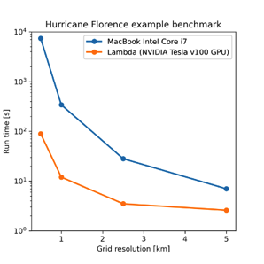
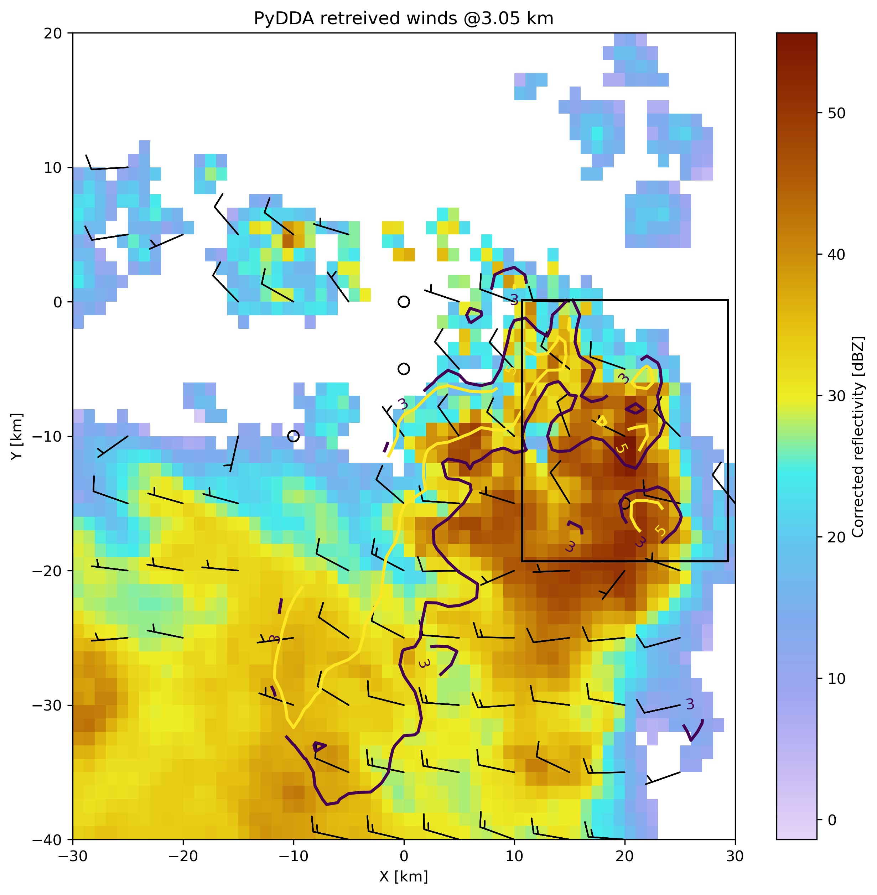
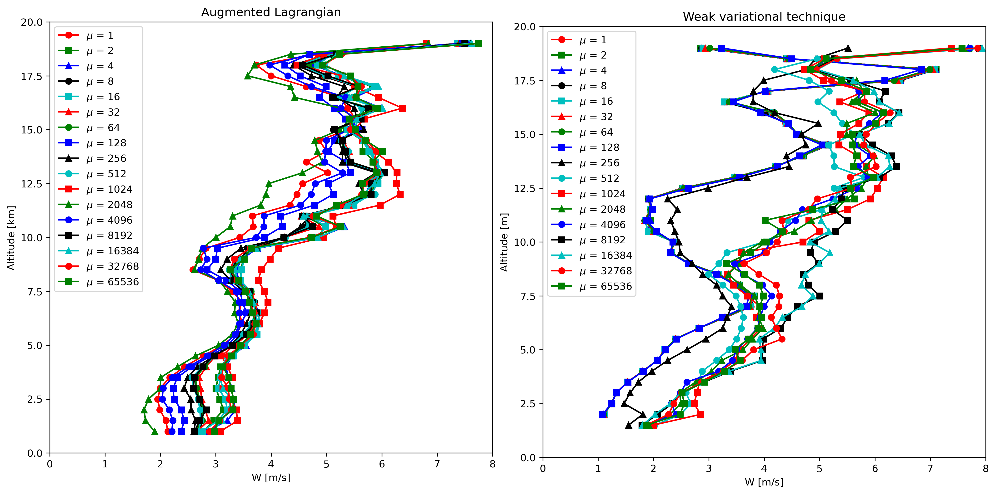

:author: Robert Jackson
:email: rjackson@anl.gov
:institution: Argonne National Laboratory, 9700 Cass Ave., Argonne, IL, 60439

:author: Rebecca Gjini
:email: rgjini@ucsd.edu
:institution: University of California at San Diego

:author: Sri Hari Krishna Narayanan
:email: snarayan@anl.gov
:institution: Argonne National Laboratory, 9700 Cass Ave., Argonne, IL, 60439

:author: Matt Menickelly
:email: menickelly@anl.gov
:instiution: Argonne National Laboratory, 9700 Cass Ave., Argonne, IL, 60439

:author: Paul Hovland
:email: hovland@mcs.anl.gov
:institution: Argonne National Laboratory, 9700 Cass Ave., Argonne, IL, 60439

:author: Jan Hückelheim
:email: jueckelheim@anl.gov
:institution: Argonne National Laboratory, 9700 Cass Ave., Argonne, IL, 60439

:author: Scott Collis
:email: scollis@anl.gov
:institution: Argonne National Laboratory, 9700 Cass Ave., Argonne, IL, 60439
:bibliography: mybib

--------------------------------------------------------------------------------------------------------------
Improving PyDDA's atmospheric wind retrievals using automatic differentiation and Augmented Lagrangian methods
--------------------------------------------------------------------------------------------------------------

============
Introduction
============

Meteorologists require information about the spatiotemporal distribution of winds in thunderstorms in order
to analyze how physical and dynamical processes govern thunderstorm evolution. Knowledge of such processes is vital for
predicting severe and hazardous weather events. However, acquiring wind observations in thunderstorms is a non-trivial
task. There are a variety of instruments that can measure winds including radars, anemometers, and vertically pointing
wind profilers.
The difficulty in acquiring a three dimensional volume of the 3D wind field from these sensors is
that these sensors typically only measure either point observations or only the component of the wind field
parallel to the direction of the antenna.
Therefore, in order to obtain 3D wind fields, the weather radar community uses a weak variational technique that
finds a 3D wind field that minimizes a cost function :math:`J`.

.. math::
    :label: costfunction

    J(\textbf{V}) = \mu_{m}J_{m} + \mu_{o}J_{o} + \mu_{v}J_{v} + \mu_{b}J_{b} + \mu_{s}J_{s}

Here, :math:`J_{m}` is how much the wind field :math:`\textbf{V}` violates the
anelastic mass continuity equation. :math:`J_{o}` is how much the wind field is
different from the radar observations. :math:`J_{v}` is how much the wind field
violates the vertical vorticity equation. :math:`J_{b}` is how much the wind field
differs from a prescribed background. Finally :math:`J_{s}` is related to the smoothness
of the wind field, quantified as the Laplacian of the wind field. The scalars :math:`\mu_{x}`
are weights determining the relative contribution of each cost function to the total :math:`J`.
The flexibility in this formulation potentially allows
for factoring in the uncertainties that are inherent in the measurements. This formulation is expandable
to include cost functions related to data from other sources such as weather forecast models and soundings.
For more specific information on these cost functions, see :cite:`Shapiroetal2012` and :cite:`Potvinetal2012`.

PyDDA is an open source Python package that implements the weak variational technique
for retrieving winds. It was originally developed in order
to modernize existing codes for the weak variational retrievals such as CEDRIC :cite:`Miller1998` and Multidop :cite:`Lang2017` as detailed in the 2019 SciPy Conference proceedings (see :cite:`Jacksonetal2020, robert_jackson-proc-scipy-2019`).
It provided a much easier to use and more portable interface for wind retrievals than was provided by these packages. In PyDDA versions 0.5 and prior, the implementation of Equation (:ref:`costfunction`) uses NumPy :cite:`harris2020array` to calculate :math:`J` and its gradient.
In order to find the wind field :math:`\textbf{V}` that minimizes :math:`J`, PyDDA
used the limited memory Broyden–Fletcher–Goldfarb–Shanno bounded (L-BFGS-B) from SciPy :cite:`scipy`.
L-BFGS-B requires gradients of :math:`J` in order to minimize :math:`J`. Considering the antiquity
of the CEDRIC and Multidop packages, these first steps provided the transition to Python that
was needed in order to enhance accessibility of wind retrieval software by the scientific community.
For more information about PyDDA versions 0.5 and prior, consult :cite:`robert_jackson-proc-scipy-2019` and
:cite:`Jacksonetal2020`.

However, there are further improvements that still needed to be made in order to optimize both the accuracy and speed of the PyDDA retrievals. For example, the cost functions and gradients in PyDDA 0.5 are implemented in NumPy which does not take advantage of GPU architectures for potential speedups :cite:`harris2020array`. In addition, the gradients of the cost function that are required for the weak variational technique are hand-coded even though packages such as Jax :cite:`jax2018github` and TensorFlow :cite:`tensorflow2015-whitepaper` can automatically calculate these gradients. These needs motivated new features for the release of PyDDA 1.0. In PyDDA 1.0, we utilize Jax and TensorFlow's automatic differentiation capabilities for differentiating :math:`J`, making these calculations less prone to human error and more efficient.

Finally, upgrading PyDDA to use Jax and TensorFlow allows it to take advantage of GPUs,
increasing the speed of retrievals. This paper shows how Jax and TensorFlow are used
to automatically calculate the gradient of :math:`J` and improve the performance of PyDDA's
wind retrievals using GPUs. 

In addition, a drawback to the weak variational technique is that the technique requires
user specified constants :math:`\mu`. This therefore creates the possibility that winds retrieved
from different datasets may not be physically consistent with each other, affecting reproducibility. Therefore, for the PyDDA 1.1 release, this paper also details a new approach
that uses Augmented Lagrangian solvers in order to place strong constraints on the wind field
such that it satisfies a mass continuity constraint to within a specified tolerance
while minimizing the rest of the cost function. This new approach also takes advantage of the automatically calculated gradients that are implemented in PyDDA 1.0. This paper will show that this new approach
eliminates the need for user specified constants, ensuring the reproducibility of the results produced
by PyDDA.

==========================
Weak variational technique
==========================

This section summarizes the weak variational technique that was implemented in PyDDA previous to version 1.0
and is currently the default option for PyDDA 1.1. PyDDA currently uses the weak variational formulation
given by Equation (:ref:`costfunction`).
For this proceedings, we will focus our attention on the mass continuity :math:`J_m` and observational cost function :math:`J_{o}`.
In PyDDA, :math:`J_{m}` is given as the discrete volume integral of the square of the anelastic mass
continuity equation

.. math::
    :label: masscontinuity

    J_{m}(u,v,w) = \sum_{volume} \left[ \frac{\delta(\rho_{s}u)}{\delta x}  + \frac{\delta(\rho_{s}v)}{\delta y} + \frac{\delta(\rho_{s}w)}{\delta z}\right]^2,

where :math:`u` is the zonal component of the wind field and :math:`v` is the meridional component
of the wind field. :math:`\rho_{s}` is the density of air, which is approximated in PyDDA as
:math:`\rho_{s}(z) = e^{-z/10000}` where :math:`z` is the height in meters. The physical
interpretation of this equation is that a column of air in the atmosphere is only allowed to compress
in order to generate changes in air density in the vertical direction. Therefore, wind convergence at
the surface will generate vertical air motion. A corollary of this is that divergent winds must occur
in the presence of a downdraft. At the scales of winds observed by PyDDA, this is a reasonable
approximation of the winds in the atmosphere.

The cost function :math:`J_{o}` metricizes how much the wind field is different from the winds
measured by each radar. Since a scanning radar will scan a storm while pointing at an elevation angle
:math:`\theta` and an azimuth angle :math:`\phi`, the wind field must first be projected to the
radar's coordinates. After that, PyDDA finds the total square error between the analysis wind field
and the radar observed winds as done in Equation (:ref:`radarwindcost`).

.. math::
    :label: radarwindcost

    \begin{aligned}
       J_{o}(u,v,w) = \sum_{volume} \left(u \cos \theta \sin \phi +
       v \cos \theta \cos \phi + (w - w_{t}) \sin \theta \right)^2
    \end{aligned}

Here, :math:`w_{t}` is the terminal velocity of the particles scanned by the radar volume. This is
approximated using empirical relationships between :math:`w_t` and the radar reflectivity :math:`Z`.
PyDDA then uses the limited memory Broyden–Fletcher–Goldfarb–Shanno bounded (L-BFGS-B) algorithm
(see, e.g., :cite:`Liu89onthe`) to find the :math:`u`, :math:`v`, and :math:`w` that solves the
optimization problem

.. math::
   :label: unconstrained

    \displaystyle\min_{u,v,w} J(u,v,w) \triangleq \mu_{m}J_{m}(u,v,w) + \mu_{v}J_{v}(u,v,w).

For experiments using the weak variational technique, we run the optimization until either the
:math:`L^{\inf}` norm of the gradient of J is less than :math:`10^{-8}` or when the maximum change
in :math:`u`, :math:`v`, and :math:`w` between iterations is less than 0.01 m/s as done by :cite:`Potvinetal2012`.
Typically, the second criteria is reached first. Before PyDDA 1.0, PyDDA utilized SciPy's L-BFGS-B
implementation. However, as of PyDDA 1.0 one can also use TensorFlow's L-BFGS-B implementation, which
is used here for the experiments with the weak variational technique :cite:`tensorflow2015-whitepaper`.

===============================
Using automatic differentiation
===============================

The optimization problem in Equation (:ref:`unconstrained`) requires the gradients of :math:`J`.
In PyDDA 0.5 and prior, the gradients of the cost function :math:`J` were calculated
by finding the closed form of the gradient by hand and then coding the closed form
in Python. The code snippet below provides an example of how the cost function :math:`J_{m}`
is implemented in PyDDA using NumPy.

.. code:: python

    def calculate_mass_continuity(u, v, w, z, dx, dy, dz):

        dudx = np.gradient(u, dx, axis=2)
        dvdy = np.gradient(v, dy, axis=1)
        dwdz = np.gradient(w, dz, axis=0)

        div = dudx + dvdy + dwdz

        return coeff * np.sum(np.square(div)) / 2.0

In order to hand code the gradient of the cost function above, one has to write the
closed form of the derivative into another function like below.

.. code:: python

    def calculate_mass_continuity_gradient(u, v, w, z, dx,
                                           dy, dz, coeff):
        dudx = np.gradient(u, dx, axis=2)
        dvdy = np.gradient(v, dy, axis=1)
        dwdz = np.gradient(w, dz, axis=0)

        grad_u = -np.gradient(div, dx, axis=2) * coeff
        grad_v = -np.gradient(div, dy, axis=1) * coeff
        grad_w = -np.gradient(div, dz, axis=0) * coeff

        y = np.stack([grad_u, grad_v, grad_w], axis=0)
        return y.flatten()

Hand coding these functions can be labor intensive for complicated cost
functions. In addition, there is no guarantee that there is a closed form solution
for the gradient. Therefore, we tested using both Jax and TensorFlow to automatically compute the
gradients of :math:`J`. Computing the gradients of :math:`J` using Jax can be done
in two lines of code using :code:`jax.vjp`:

.. code:: python

    primals, fun_vjp = jax.vjp(
        calculate_radial_vel_cost_function,
        vrs, azs, els, u, v, w, wts, rmsVr, weights, 
        coeff)
    _, _, _, p_x1, p_y1, p_z1, _, _, _, _ = fun_vjp(1.0)

Calculating the gradients using automatic differentiation using TensorFlow
is also a simple code snippet using :code:`tf.GradientTape`:

.. code:: python

    with tf.GradientTape() as tape:
        tape.watch(u)
        tape.watch(v)
        tape.watch(w)
        loss = calculate_radial_vel_cost_function(
            vrs, azs, els, u, v, w,
            wts, rmsVr, weights, coeff)

    grad = tape.gradient(loss)

As one can see, there is no more need to derive the closed form of the gradient
of the cost function. Rather, the cost function itself is now the input to a snippet
of code that automatically provides the derivative. In PyDDA 1.0, there are now three different
engines that the user can specify. The classic "scipy" mode uses the NumPy-based cost function and
hand coded gradients used by versions of PyDDA previous to 1.0. In addition, there are now TensorFlow and Jax
modes that use both cost functions and automatically generated gradients generated using TensorFlow
or Jax.

===========================================
Improving performance with GPU capabilities
===========================================

The implementation of a TensorFlow-based engine provides PyDDA the capability to take advantage
of CUDA-compatible GPUs. Given that weather radar datasets can span
decades and processing each 10 minute time period of data given by the radar can take on the order
of 1-2 minutes with PyDDA using regular CPU operations, if this time were reduced to seconds, then
processing winds from years of radar data would become tenable. Therefore, we used the TensorFlow-based
PyDDA using the weak variational technique on the Hurricane Florence example in the PyDDA Documentation.
On 14 September 2018, Hurricane Florence was within range of 2 radars from the NEXRAD network:
KMHX stationed in Newport, NC and KLTX stationed in Wilmington, NC. In addition, the High Resolution
Rapid Refresh model runs provided an additional constraint for the wind retrieval. For more information
on this example, see :cite:`robert_jackson-proc-scipy-2019`. The analysis domain spans 400 km by 400 km horizontally,
and the horizontal resolution was allowed to vary for different runs in order to compare how both the
CPU and GPU-based retrievals' performance would be affected by grid resolution. The time of completion
of each of these retrievals is shown in Figure :ref:`timing`.

   The time in seconds of execution of the Hurricane Florence retrieval example when using the
   TensorFlow and SciPy engines on an Intel Core i7 MacBook in CPU mode and on a node of Argonne National
   Laboratory's Lambda cluster, utilizing a single NVIDIA Tesla A100 GPU for the calculation. :label:`timing`

.. table:: Run times for each of the benchmarks in Figure :ref:`timing`. :label:`timetable`
   

    +--------------+----------+----------+----------+----------+
    | Method       | *0.5 km* | *1 km*   | *2.5 km* | *5.0 km* |
    +==============+==========+==========+==========+==========+
    | SciPy        |          |          |          |          |
    | Engine       | ~50 days | 5771.2 s | 871.5 s  | 226.9 s  |
    +--------------+----------+----------+----------+----------+
    | TensorFlow   |          |          |          |          |
    | Engine       | 7372.5 s | 341.5 s  | 28.1 s   | 7.0 s    |
    +--------------+----------+----------+----------+----------+
    | NVIDIA Tesla |          |          |          |          |
    | A100 GPU     | 89.4 s   | 12.0 s   | 3.5 s    | 2.6 s    |
    +--------------+----------+----------+----------+----------+

Figure :ref:`timing` and Table :ref:`timetable` show that, in general, the retrievals took anywhere from 10 to 100 fold less time
on the GPU compared to the CPU. The discrepancy in performance between the GPU and CPU-based
retrievals increases as resolution decreases, demonstrating the importance of the GPU for conducting
high-resolution wind retrievals. In Table :ref:`timetable`, using a GPU to retrieve the Hurricane Florence example at 1 km
resolution reduces the run time from 341 s to 12 s. Therefore, these performance improvements
show that PyDDA's TensorFlow-based engine now enables it to handle both spatial scales of hundreds of
kms at a 1 km resolution. For a day of data at this resolution, assuming five minutes between scans,
an entire day of data can be processed in 57 minutes. With the use of multi-GPU clusters and selecting
for cases where precipitation is present, this enables the ability to process winds from multi-year
radar datasets within days instead of months. 

In addition, simply using TensorFlow's implementation of L-BFGS-B as well as the TensorFlow calculated cost function and gradients provides a significant performance improvement compared to the original "scipy" engine in PyDDA 0.5, being up to a factor of 30 faster. In fact, running PyDDA's original "scipy" engine on the 0.5 km resolution data for the Hurricane Florence example would have likely taken 50 days to complete on an Intel Core i7-based MacBook laptop. Therefore, that particular run was not tenable to do and therefore not shown in Figure :ref:`timing`. In any case, this shows that upgrading the calculations to use TensorFlow's automatically generated gradients and L-BFGS-B implementation provides a very significant speedup to the processing time. 

===========================
Augmented Lagrangian method
===========================

The release of PyDDA 1.0 focused on improving its performance and gradient accuracy by
using automatic differentiation for calculating the gradient. For PyDDA 1.1,
the PyDDA development team focused on implementing a technique that enables the user to automatically determine the weight
coefficients :math:`\mu`. This technique builds upon the automatic differentiation work
done for PyDDA 1.0 by using the automatically generated gradients. In this work, we consider a constrained reformulation of Equation (:ref:`unconstrained`)
that requires wind fields returned by PyDDA to (approximately) satisfy mass continuity constraints.
That is, we focus on the constrained optimization problem

.. math::
    :label: constrained

    \begin{array}{rl}
    \displaystyle\min_{u,v,w} & J_{v}(u,v,w)\\
    \text{s. to} & J_{m}(u,v,w) = 0,\\
    \end{array}

where we now interpret :math:`J_m` as a vector mapping that outputs, at each grid point in the discretized volume
:math:`\frac{\delta(\rho_{s}u)}{\delta x} + \frac{\delta(\rho_{s}v)}{\delta y} + \frac{\delta(\rho_{s}w)}{\delta z}`.
Notice that the formulation in Equation (:ref:`constrained`) has no dependencies on scalars :math:`\mu`.

To solve the optimization problem in Equation (:ref:`constrained`), we implemented an augmented Lagrangian method with a
filter mechanism inspired by :cite:`filteral`. An augmented Lagrangian method considers the Lagrangian associated with
an equality-constrained optimization problem, in this case :math:`\mathcal{L}_0(u,v,w,\lambda) = J_v(u,v,w) - \lambda^\top J_m(u,v,w)`,
where :math:`\lambda` is a vector of Lagrange multipliers of the same length as the number of grid points in the discretized volume.
The Lagrangian is then *augmented* with an additional squared-penalty term on the constraints to yield
:math:`\mathcal{L}_{\mu}(u,v,w,\lambda) = \mathcal{L}_0(u,v,w,\lambda) + \frac{\mu}{2}\|J_m(u,v,w)\|^2`,
where we have intentionally used :math:`\mu > 0` as the scalar in the penalty term to make comparisons with
Equation (:ref:`unconstrained`) transparent. It is well known (see, for instance, Theorem 17.5 of :cite:`NoceWrig06`)
that under some not overly restrictive conditions there exists a finite :math:`\bar\mu` such that if
:math:`\mu \geq \bar\mu`, then each local solution of Equation (:ref:`constrained`) corresponds to a strict
local minimizer of :math:`\mathcal{L}_{\mu}(u,v,w,\lambda^*)` for a suitable choice of multipliers :math:`\lambda^*`.
Essentially, augmented Lagrangian methods solve a short sequence of unconstrained problems :math:`\mathcal{L}_{\mu}(u,v,w,\lambda)`, with different
values of :math:`\mu` until a solution is returned that is a local, feasible solution to Equation (:ref:`constrained`).
In our implementation of an augmented Lagrangian method, the coarse minimization of
:math:`\mathcal{L}_{\mu}(u,v,w,\lambda)` is performed by the Scipy implementation of LBFGS-B with the TensorFlow
implementation of the cost function and gradients.
Additionally, in our implementation, we employ a filter mechanism (see a survey in :cite:`Fletcher06abrief`) recently
proposed for augmented Lagrangian methods in :cite:`filteral` in order to guarantee convergence. We defer details to that paper,
but note that the feasibility restoration phase (the minimization of a squared constraint violation)
required by such a filter method is also performed by the SciPy implementation of LBFGS-B.

   The PyDDA retrieved winds overlaid over reflectivity from the C-band Polarization Radar for the
   MCS that passed over Darwin, Australia on 20 Jan 2006. The winds were retrieved using the weak variational technique with :math:`\mu = 1` **(a)** and the Augmented Lagrangian technique with :math:`\mu = 1` **(b)**.
   The contours represent vertical velocities
   at 3.05 km altitude. The boxed region shows the updrafts that generated the heavy precipitation. :label:`storm`

The PyDDA documentation contains an example of a mesoscale convective system (MCS) that was sampled by a C-band
Polarization Radar (CPOL) and a Bureau of Meteorology Australia radar on 20 Jan 2006 in Darwin, Australia.
For more details on this storm and the radar network configuration, see :cite:`Collisetal2013`. For more information about the CPOL radar dataset, see :cite:`Jacksonetal2018`.  This example with its data is included in the PyDDA Documentation as the "Example of retrieving and plotting winds."

Figure :ref:`storm` shows the winds retrieved by the Augmented Lagrangian technique with :math:`\mu = 1` and from
the weak variational technique with :math:`\mu = 1` on the right. Figure :ref:`storm` shows that both techniques are
capturing similar horizontal wind fields in this storm. However, the Augmented Lagrangian technique is resolving an
updraft that is not present in the wind field generated by the weak variational technique. Since there is horizontal
wind convergence in this region, we expect there to be an updraft present in this box in order for the solution to
be physically realistic. Therefore, for :math:`\mu = 1`, the Augmented Lagrangian technique is doing a better job at
resolving the updrafts present in the storm than the weak variational technique is. This shows
that adjusting :math:`\mu` is required in order for the weak variational technique to resolve the updraft.

.. figure:: auglag2.pdf
   :align: center

   The :math:`x`-axis shows, on a logarithmic scale, the maximum constraint violation
   in the units of divergence of the wind field and the :math:`y`-axis shows the value of the
   data-fitting term :math:`J_v` at the optimal solution. The legend lists the number of
   function/gradient calls made by the filter Augmented Lagrangian Method,
   which is the dominant cost of both approaches.
   The dashed line at :math:`10^{-3}` denotes the tolerance on the maximum constraint violation
   that was supplied to the filter Augmented Lagrangian method. :label:`auglag2`

.. figure:: lbfgs2.pdf
   :align: center

   As :ref:`auglag2`, but for the weak variational technique that uses L-BFGS-B. :label:`lbfgs2`

We solve the unconstrained formulation (:ref:`unconstrained`) using the implementation of L-BFGS-B
currently employed in PyDDA; we fix the value :math:`\mu_v = 1` and vary :math:`\mu_m = 2^j: j = 0,1,2,\dots,16`.
We also solve the constrained formulation (:ref:`constrained`) using our implementation of a
filter Augmented Lagrangian method, and instead vary the initial guess of penalty parameter
:math:`\mu = 2^j: j = 0,1,2,\dots,16`. For the initial state, we use the wind profile from the weather balloon
launch at 00 UTC 20 Jan 2006 from Darwin and apply it to the whole analysis domain.
A summary of results is shown in Figures :ref:`auglag2` and :ref:`lbfgs2`. We applied a maximum constraint violation
tolerance of :math:`10^{-3}` to the filter Augmented Lagrangian method. This is a tolerance that assumes
that the winds do not violate the mass continuity constraint by more than :math:`0.001\ m^2 s^{-2}`.
Notice that such a tolerance is impossible to supply to the weak variational method, highlighting the key advantage of
employing a constrained method. Notice that in this example, only 5 settings of :math:`\mu_m`
lead to sufficiently feasible solutions returned by the variational technique.

   The mean updraft velocity obtained by (left) the weak variational and (right) the Augmented
   Lagrangian technique inside the updrafts in the boxed region
   of Figure :ref:`storm`. Each line represents a different value of :math:`\mu` for the given
   technique. :label:`updraftvelocity`

.. table:: Minimum, mean, maximum, and standard deviation of :math:`w` (m/s) for select levels in Figure :ref:`updraftvelocity`. :label:`updraftstats`
    

    +--------------------+-----+------+-----+-----------+
    |                    | Min | Mean | Max | Std. Dev. |
    +====================+=====+======+=====+===========+
    | *Weak variational* |     |      |     |           |
    +--------------------+-----+------+-----+-----------+
    | 2.5 km             | 1.2 | 1.8  | 2.7 | 0.6       |
    +--------------------+-----+------+-----+-----------+
    | 5 km               | 2.2 | 2.9  | 4.0 | 0.7       |
    +--------------------+-----+------+-----+-----------+
    | 7.5 km             | 3.2 | 3.9  | 5.0 | 0.4       |
    +--------------------+-----+------+-----+-----------+
    | 10 km              | 2.3 | 3.3  | 4.9 | 1.0       |
    +--------------------+-----+------+-----+-----------+
    | *Aug. Lagrangian*  |     |      |     |           |
    +--------------------+-----+------+-----+-----------+
    | 2.5 km             | 1.8 | 2.8  | 3.3 | 0.5       |
    +--------------------+-----+------+-----+-----------+
    | 5 km               | 3.1 | 3.3  | 3.5 | 0.1       |
    +--------------------+-----+------+-----+-----------+
    | 7.5 km             | 3.2 | 3.5  | 3.9 | 0.1       |
    +--------------------+-----+------+-----+-----------+
    | 10 km              | 3.0 | 4.3  | 4.9 | 0.5       |
    +--------------------+-----+------+-----+-----------+    

Finally, a variable of interest to atmospheric scientists for winds inside MCSes is the vertical
wind velocity. It provides a measure of the intensity of the storm by demonstrating the amount
of upscale growth contributing to intensification. Figure :ref:`updraftvelocity` shows the mean
updraft velocities inside the box in Figure :ref:`storm` as a function of height for each of the
runs of the TensorFlow L-BFGS-B and Augmented Lagrangian techniques. Table :ref:`updraftstats` summarizes the mean and spread of the solutions in Figure :ref:`updraftvelocity`. For the updraft velocities
produced by the Augmented Lagrangian technique, there is a 1 m/s spread of velocities produced
for given values of :math:`\mu` at altitudes < 7.5 km in Table :ref:`updraftstats`. At an altitude of 10 km, this spread is 1.9 m/s. This is likely due to the reduced spatial coverage of the radars at higher altitudes. However, for the weak variational technique, the sensitivity of
the retrieval to :math:`\mu` is much more pronounced, with up to 2.8 m/s differences between retrievals.
Therefore, using the Augmented Lagrangian technique makes the vertical velocities less sensitive to :math:`\mu`.
Therefore, this shows that using the Augmented Lagrangian technique will result in more
reproducible wind fields from radar wind networks since it is less sensitive to user-defined parameters
than the weak variational technique. However, a limitation of this technique is that, for now, this technique is limited to two radars and to the mass continuity and vertical vorticity constraints.

==================
Concluding remarks
==================

Atmospheric wind retrievals are vital for forecasting severe weather events. Therefore,
this motivated us to develop an open source package for developing atmospheric wind
retrievals called PyDDA. In the original releases of PyDDA (versions 0.5 and prior),
the original goal of PyDDA was to convert legacy wind retrieval packages such as
CEDRIC and Multidop to be fully Pythonic, open source, and accessible to the scientific
community. However, there remained many improvements to be made to PyDDA to optimize the
speed of the retrievals and to make it easier to add constraints to PyDDA.

This therefore motivated two major changes to PyDDA's wind retrieval routine for PyDDA 1.0.
The first major change to PyDDA in PyDDA 1.0 was to simplify the wind retrieval process by
automating the calculation of the gradient of the cost function used for the weak
variational technique. To do this, we utilized Jax and TensorFlow's capabilities to do
automatic differentiation of functions. This also allows PyDDA to take advantage of GPU
resources, significantly speeding up retrieval times for mesoscale retrievals at kilometer-scale
resolution. In addition, running the TensorFlow-based version of PyDDA provided significant performance improvements even when using a CPU. 

These automatically generated gradients were then used to implement an Augmented
Lagrangian technique in PyDDA 1.1 that allows for automatically determining the weights for
each cost function in the retrieval. The Augmented Lagrangian technique guarantees convergence
to a physically realistic solution, something that is not always the case for a given set of
weights for the weak variational technique. Therefore, this both creates more reproducible
wind retrievals and simplifies the process of retrieving winds for the non-specialist user. However,
since the Augmented Lagrangian technique currently only supports the ingesting of radar data
into the retrieval, plans for PyDDA 1.2 and beyond include expanding the Augmented Lagrangian
technique to support multiple data sources such as models and rawinsondes. 

=================
Code Availability
=================

PyDDA is available for public use with documentation and examples available at https://openradarscience.org/PyDDA. The GitHub repository that hosts PyDDA's source code is available at https://github.com/openradar/PyDDA.

===============
Acknowledgments
===============

The submitted manuscript has been created by UChicago Argonne, LLC, Operator of Argonne National Laboratory ('Argonne').
Argonne, a U.S. Department of Energy Office of Science laboratory, is operated under Contract No. DE-AC02-06CH11357.
The U.S. Government retains for itself, and others acting on its behalf, a paid-up nonexclusive, irrevocable worldwide
license in said article to reproduce, prepare derivative works, distribute copies to the public, and perform publicly
and display publicly, by or on behalf of the Government.  The Department of Energy will provide public access to these
results of federally sponsored research in accordance with the DOE Public Access Plan.
This material is based upon work supported by Laboratory Directed Research and Development (LDRD) funding from Argonne National Laboratory,
provided by the Director, Office of Science, of the U.S. Department of Energy under Contract No. DE-AC02-06CH11357.
This material is also based upon work funded by program development funds from
the Mathematics and Computer Science and Environmental Science departments at Argonne National Laboratory.

