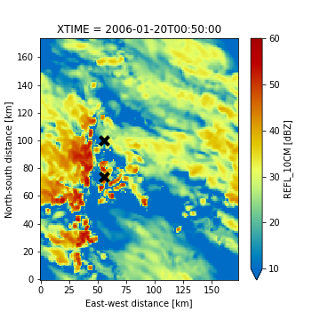

:author: Robert Jackson
:email: rjackson@anl.gov
:institution: Argonne National Laboratory

:author: Rebecca Gjini
:email: rgjini@ucsd.edu
:institution: University of California at San Diego

:author: Sri Hari Krishna Narayanan
:email: snarayan@anl.gov
:institution: Argonne National Laboratory

:author: Matt Menickelly
:email: menickelly@anl.gov
:instiution: Argonne National Laboratory

:author: Paul Hovland
:email: hovland@mcs.anl.gov
:institution: Argonne National Laboratory

:author: Jan Hückelheim
:email: jueckelheim@anl.gov
:institution: Argonne National Laboratory

:author: Scott Collis
:email: scollis@anl.gov
:institution: Argonne National Laboratory

:bilbliography: mybib

------------------------------------------------------------------------------------------------------
Improving atmospheric wind retrievals using automatic differentiation and Augmented Lagrangian methods
------------------------------------------------------------------------------------------------------

============
Introduction
============
Climate change is one of the leading crises that humanity will be forced to confront in the 21^{st} century.
It has been linked to warming temperatures and more extreme droughts and storms. However, there is still a large
uncertainty in these predictions that is partly attributable to how thunderstorms are resolved by climate models.
Three dimensional wind observations will help validate and improve the representation of thunderstorms in climate models.

However, acquiring wind observations in thunderstorms is a non-trivial task. There are a variety of instruments that can
measure winds including radars, anemometers, and vertically pointing wind profilers. The difficulty in acquiring a
three dimensional volume of the 3D wind field from these sensors is that these sensors typically only measure either
point observations or only the component of the wind field parallel to the direction of the antenna.
Therefore, the weather radar community uses a weak variational technique that finds a 3D wind field that minimizes a
cost function :math:`J`.

.. math::
    :label: cost_function

    J(\textbf{V}) = \mu_{m}J_{m} + \mu_{o}J_{o} + \mu_{v}J_{v} + \mu{b}J_{b} + \mu_{s}J_{s}

Here, :math:`J_{m}` is how much the wind field :math:`\textbf{V}` violates the
anelastic mass continuity equation. :math:`J_{o}` is how much the wind field is
different from the radar observations. :math:`J_{v}` is how much the wind field
violates the vertical vorticity equation. :math:`J_{b}` is how much the wind field
differs from a prescribed background. Finally :math:`J_{s}` is related to the smoothness
of the wind field, quantified as the Laplacian of the wind field. The scalars :math:`\mu_{m}` and :math:`\mu_{v}` are weights determining the relative contribution
of each cost function to the total :math:`J`. The flexibility in this formulation potentially allows
for factoring in the uncertainties that are inherent in the measurements. This formulation is expandable
to include cost functions related to data from other sources such as weather forecast models and soundings.
For more specific information on these cost functions, see :cite:`Shapiroetal2009` and :cite:`Potvinetal2012`.

PyDDA is an open source Python package that implements the weak variational technique
for retrieving winds :cite:`Jacksonetal2020`. In PyDDA versions 0.5 and prior,
PyDDA, Equation :ref:`cost_function` is implemented using NumPy :cite:`harris2020array`.
In order to find the wind field :math:`\textbf{V}` that minimizes :math:`J`, PyDDA
used the limited memory Broyden–Fletcher–Goldfarb–Shanno bounded (L-BFGS-B) from SciPy.
L-BFGS-B requires gradients of :math:`J` in order to minimize :math:`J`.
PyDDA provides SciPy with a function that computes the derivatives.
PyDDA versions 0.5 and prior provided handcoded derivatives to SciPy. In PyDDA 1.0,
PyDDA now takes advantage of modern frameworks such as JAX :cite:`jax2018github`
and TensorFlow :cite:in order to optimize the calculation of :math:`J(\textbf{V})`.
JAX and TensorFlow both provide automatic differentiation capability for differentiating :math:`J`,
making the calculation of the derivatives less prone to round-off and human coding errors.
Finally, upgrading PyDDA to use Jax and TensorFlow allows it to take advantage of GPUs,
increasing the speed of retrievals.

In addition, one drawback to the weak variational technique is that because the technique requires
user specified constants :math:`\mu`, this therefore creates the possibility that winds retrieved
from different datasets may not be physically consistent with each other. Therefore, in addition
to exploring automatic differentiation for the PyDDA 1.0 release, this paper also details a new approach
that uses Augmented Lagrangian solvers in order to place strong constraints on the wind field
such that it follows the mass continuity within a specified tolerance
while minimizing the rest of the cost function. This paper will show
that this new approach eliminates the need for user specified constants.

===============================
Using automatic differentiation
===============================

In Computing the gradients of :math:`J` using Jax can be done in two lines of
code using :code:`jax.vjp`:

.. code::

    primals, fun_vjp = jax.vjp(calculate_radial_vel_cost_function,
            vrs, azs, els, u, v, w, wts, rmsVr, weights, coeff)
    _, _, _, p_x1, p_y1, p_z1, _, _, _, _ = fun_vjp(1.0)

Calculating the gradients using automatic differentiation using TensorFlow
is also a simple code snippet using :code:`tf.GradientTape`:
.. code::

    with tf.GradientTape() as tape:
        tape.watch(u)
        tape.watch(v)
        tape.watch(w)
        loss = calculate_radial_vel_cost_function(
            vrs, azs, els, u, v, w, wts, rmsVr, weights, coeff)

===========================================
Improving performance with GPU capabilities
===========================================

===========================
Augmented Lagrangian method
===========================

In this work, we consider a constrained reformulation of Equation~\ref{unconstrained} that requires wind fields returned by PyDDA to (approximately) satisfy mass continuity constraints.
That is, we focus on the constrained optimization problem
.. math::
    :label: constrained

    \begin{array}{rl}
    \displaystyle\min_{u,v,w} & J_{v}(u,v,w)\\
    \text{s. to} & J_{m}(u,v,w) = 0,\\
    \end{array}

where we now interpret :math:`J_m` as a vector mapping that outputs, at each grid point in the discretized volume
:math:`\frac{\delta(\rho_{s}u)}{\delta x}  + \frac{\delta(\rho_{s}v)}{\delta y} + \frac{\delta(\rho_{s}w)}{\delta z}`.
Notice that the formulation in Equation :ref:`constrained` has no dependencies on scalars :math:`\mu`.

To solve the optimization problem in Equation :ref:`constrained`,
we implemented an augmented Lagrangian method with a filter mechanism inspired by :cite:`filteral`.
An augmented Lagrangian method considers the Lagrangian associated with an equality-constrained optimization problem, in this case
:math:`\mathcal{L}_0(u,v,w,\lambda) = J_v(u,v,w) - \lambda^\top J_m(u,v,w)`,
where :math:`\lambda` is a vector of Lagrange multipliers of the same length as the number of gridpoints in the discretized volume.
The Lagrangian is then *augmented* with an additional squared-penalty term on the constraints to yield
:math:`\mathcal{L}_{\mu}(u,v,w,\lambda) = \mathcal{L}_0(u,v,w,\lambda) + \frac{\mu}{2}\|J_m(u,v,w)\|^2`,
where we have intentionally used $\mu>0$ as the scalar in the penalty term to make comparisons with Equation~\ref{unconstrained} transparent.
It is well known (see, for instance, Theorem 17.5 of :cite:`NoceWrig06`) that
under some not overly restrictive conditions,
there exists a finite :math:`\bar\mu` such that if :math:`\mu \geq \bar\mu`,
then each local solution of Equation :ref:`constrained` corresponds to a strict
local minimizer of :math:`\mathcal{L}_{\mu}(u,v,w,\lambda^*)` for a suitable
choice of multipliers :math:`\lambda^*`.
An augmented Lagrangian method is an iterative method, where in the :math:`k`th iteration,
one employs a method of unconstrained optimization to (approximately) minimize
:math:`\mathcal{L}_{\mu_k}(u,v,w,\bar\lambda_k)`$`, and then update the penalty
parameters :math:`\mu_k`$` and multiplier estimates :cite:`\lambda_k``.
This process is iterated until a measure of constraint violation - i.e.,
:math:`\|J_m(u,v,w)\|` - and the augmented Lagrangian norm
:math:`|\nabla_{u,v,w} \mathcal{L}_{\mu_k}(u,v,w,\lambda_k)\|` are both sufficiently close to 0.

We employ a filter mechanism (see a survey in :cite:`Fletcher06abrief`) recently proposed for augmented Lagrangian methods in \cite{filteral}.
We defer details to that paper, but give a coarse description of the method here.
Filter methods are inspired by biobjective minimization;
in the augmented Lagrangian context, we treat the minimization of
:math:`|\nabla_{u,v,w} \mathcal{L}_{\mu_k}(u,v,w,\lambda_k)\|` and the
minimization of :math:`\|J_m(u,v,w)\|` as two separate, but obviously related, objectives.
The filter method iteratively constructs an envelope around the Pareto front of
these two objectives to filter out candidate solutions from the :math:`k`th
iteration of the augmented Lagrangian method that do not make sufficient
progress towards the simultaneous minimization of both objectives; if an
approximate minimizer of the $k$th augmented Lagrangian is outside the envelope,
it is deemed acceptable to the filter.
When insufficient progress towards the minimization of :math:`\|J_m(u,v,w)\|` is detected,
the method enters a feasibility restoration phase to rapidly decrease the constraint
violation at the expense of gains made in locating a stationary point of the augmented Lagrangian
- such a point is guaranteed to be acceptable to the filter. On these
feasibility restoration iterations, :math:`\mu_k` is increased.
In our implementation, the minimization of the augmented Lagrangian --
and the minimization of the squared constraint violation in a feasiblity restoration phase
-- is performed by LBFGS-B.

.. figure:: auglag1.eps
   :align: center

.. figure:: auglag2.eps
   :align: center

.. figure:: lbfgs1.eps
   :align: center

.. figure:: lbfgs2.eps
   :align: center

.. figure:: figure_updrafts.png
   :align: center

===========
Conclusions
===========
