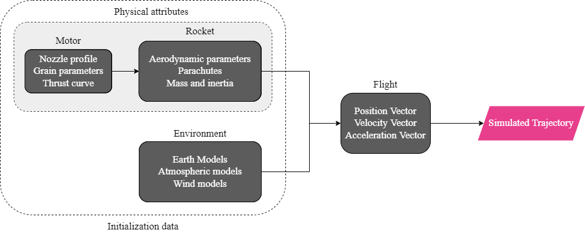
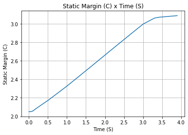
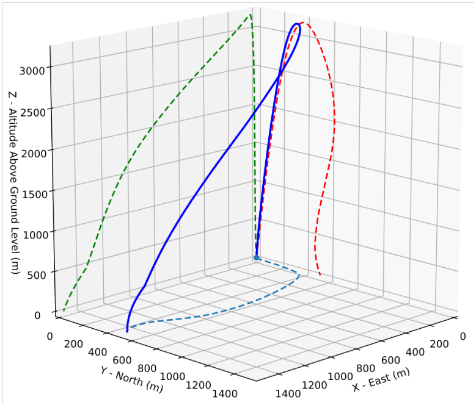
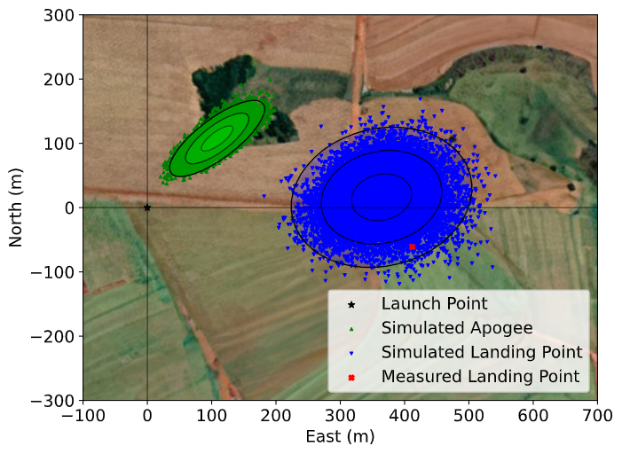
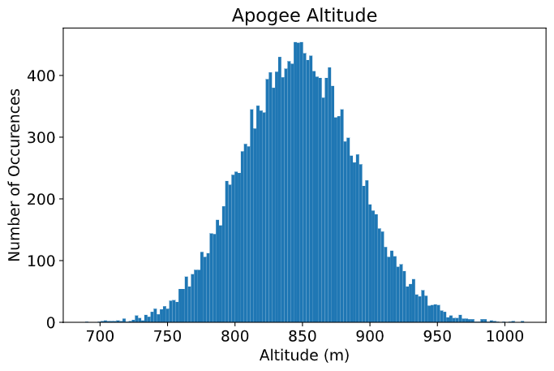

:author: João Lemes Gribel Soares
:email: jgribel@usp.br
:institution: Escola Politécnica of the University of São Paulo
:corresponding:

:author: Mateus Stano Junqueira
:email: mateusstano@usp.br
:institution: Escola Politécnica of the University of São Paulo

:author: Oscar Mauricio Prada Ramirez
:email: oscarmprada@usp.br
:institution: Escola Politécnica of the University of São Paulo
:orcid: 0000-0001-6904-8959

:author: Patrick Sampaio dos Santos Brandão
:email: patricksampaio@usp.br
:institution: Escola Politécnica of the University of São Paulo
:institution: École Centrale de Nantes.

:author: Adriano Augusto Antongiovanni
:email: adrianoaugusto98@usp.br
:institution: Escola Politécnica of the University of São Paulo
:orcid: 0000-0002-3658-0153

:author: Guilherme Fernandes Alves
:email: guilherme_fernandes@usp.br
:institution: Escola Politécnica of the University of São Paulo
:orcid: 0000-0003-3873-2699

:author: Giovani Hidalgo Ceotto
:email: giovani.ceotto@alumni.usp.br
:institution: Escola Politécnica of the University of São Paulo
:orcid: 0000-0002-1614-3028

:bibliography: references

------------------------------------------------------------------------------------------------------------
RocketPy: Combining Open-Source and Scientific Libraries to Make the Space Sector More Modern and Accessible
------------------------------------------------------------------------------------------------------------

.. class:: abstract
   
   In recent years we are seeing exponential growth in the space sector, with new companies emerging in it. 
   On top of that more people are becoming fascinated to participate in the aerospace revolution, which motivates
   students and hobbyists to build more High Powered and Sounding Rockets. 
   However, rocketry is still a very inaccessible field, with a high knowledge entry-level and very specific terms. 
   To make it more accessible, people need an active community with flexible, easy-to-use, and well-documented tools.
   RocketPy is a software solution created to address all those issues, solving the trajectory simulation for High-Power
   rockets being built on top of SciPy and the Python Scientific Environment. 
   The code allows for a sophisticated 6 degrees of freedom simulation of a rocket's flight trajectory, including high
   fidelity variable mass effects as well as descent under parachutes. 
   All of this is packaged into an architecture that facilitates complex simulations, such as multi-stage rockets, 
   design and trajectory optimization, and dispersion analysis. 
   In this work, the flexibility and usability of RocketPy are indicated in three example simulations: 
   a basic trajectory simulation, a dynamic stability analysis, and a Monte Carlo dispersion simulation. 
   The code structure and the main implemented methods are also presented.

      
.. class:: keywords

   rocketry, flight, rocket trajectory, flexibility, Monte Carlo analysis

Introduction
============

When it comes to rockets, there is a wide field ranging from orbital rockets to model rockets. 
Between them, two types of rockets are relevant to this work: sounding rockets and High-Powered Rockets (HPRs). 
Sounding rockets are mainly used by government agencies for scientific experiments in suborbital 
flights while HPRs are generally used for educational purposes, with increasing popularity in university competitions, 
such as the annual Spaceport America Cup, which hosts more than 100 rocket design teams from all over the world. 
After the university-built rocket TRAVELER IV :cite:`TravelerIV` successfully reached space by crossing the Kármán line
in 2019, both Sounding Rockets and HPRs can now be seen as two converging categories in terms of overall flight
trajectory.

HPRs are becoming bigger and more robust, increasing their potential hazard, along with their capacity, making safety an
important issue. Moreover, performance is always a requirement both for saving financial and time resources while
efficiently launch performance goals.

In this scenario, crucial parameters should be determined before a safe launch can be performed. Examples include
calculating with high accuracy and certainty the most likely impact or landing region. This information greatly increases
range safety and the possibility of recovering the rocket :cite:`Wilde2018RangeLaunches`. As another example, it is
important to determine the altitude of the rocket's apogee in order to avoid collision with other aircraft and
prevent airspace violations.

To better attend to those issues, RocketPy was created as a computational tool that can accurately predict all 
dynamic parameters involved in the flight of sounding, model, and High-Powered Rockets, given parameters 
such as the rocket geometry, motor characteristics, and environmental conditions. It is an open source project, 
well structured, and documented, allowing collaborators to contribute with new features with minimum effort regarding
legacy code modification :cite:`ceotto2021rocketpy`.

Background 
==========

Rocketry terminology
--------------------

In order to better understand the current work, some specific terms regarding the rocketry field are stated below: 

- Apogee: The point at which a body is furthest from earth
- Degrees of freedom: Maximum number of independent values in an equation
- Flight Trajectory: 3-dimensional path, over time, of the rocket during its flight
- Launch Rail: Guidance for the rocket to accelerate to a stable flight speed
- Powered Flight: Phase of the flight where the motor is active
- Free Flight: Phase of the flight where the motor is inactive and no other component but its inertia is influencing the rocket's trajectory
- Standard Atmosphere: Average pressure, temperature, and air density for various altitudes
- Nozzle: Part of the rocket's engine that accelerate the exhaust gases
- Static hot-fire test: Test to measure the integrity of the motor and determine its thrust curve
- Thrust Curve: Evolution of thrust force generated by a motor 
- Static Margin: Is a non-dimensional distance to analyze the stability
- Nosecone: The forward most section of a rocket, shaped for aerodynamics
- Fin: Flattened append of the rocket providing stability during flight, keeping it in the flight trajectory

Flight Model
------------
The flight model of a high-powered rocket takes into account at least three different phases:

1. The first phase consists of a linear movement along the launch rail:
The motion of the rocket is restricted to one dimension, which means that only the translation along the rail needs 
to be modeled. During this phase, four forces can act on the rocket: weight, engine thrust, rail reactions, and 
aerodynamic forces.

2. After completely leaving the rail, a phase of 6 degrees of freedom (DOF) is established, 
which includes powered flight and free flight:
The rocket is free to move in three-dimensional space and weight, engine thrust, normal and axial 
aerodynamic forces are still important.

3. Once apogee is reached, a parachute is usually deployed, characterizing the third phase of flight:
the parachute descent.
In the last phase, the parachute is launched from the rocket, which is usually divided into two
or more parts joined by ropes. This phase ends in the point of impact.

Design: RocketPy Architecture
=============================

Four main classes that organize the dataflow during the simulations: motor, rocket, environment, and flight
:cite:`ceotto2021rocketpy`.
Furthermore, there is also a helper class named `function`, which will be described further.
In the Motor class, the main physical and geometric parameters of the motor are configured, 
such as nozzle geometry, grain parameters, mass, inertia, and thrust curve.
This first class acts as an input to the Rocket class where the user is also asked to define certain parameters of 
the rocket such as the inertial mass tensor, geometry, drag coefficients, and parachute description. 
Finally, the Flight class joins the rocket and motor parameters with information from another class called Environment, 
such as wind, atmospheric, and earth models, to generate a simulation of the rocket's trajectory.
This modular architecture, along with its well-structured and documented code, facilitates complex simulations, 
starting with the use of Jupyter Notebooks that people can adapt for their specific use case.
Fig. :ref:`fig1` illustrates RocketPy architecture.  

   RocketPy classes interaction :cite:`ceotto2021rocketpy` :label:`fig1`

Function
--------

Variable interpolation meshes/grids from different sources can lead to problems regarding coupling different data types.
To solve this, RocketPy employs a dedicated *Function* class which allows for more natural and dynamic handling
of these objects, structuring them as :math:`\mathbb{R}^n \to \mathbb{R}` mathematical functions.

Through the use of those methods, this approach allows for quick and easy arithmetic operations between lambda
expressions and list-defined interpolated functions, as well as scalars. Different interpolation methods are available
to be chosen from, among them simple polynomial, spline, and Akima (:cite:`akima1970new`).
Extrapolation of *Function* objects outside the domain constrained by a given dataset is also allowed.

Furthermore, evaluation of definite integrals of these *Function* objects is among their feature set. By cleverly
exploiting the chosen interpolation option, RocketPy calculates the values fast and precisely through the use of
different analytical methods. If numerical integration is required, the class makes use of SciPy's implementation of
the QUADPACK Fortran library :cite:`piessens2012quadpack`. For 1-dimensional Functions, evaluation of derivatives at a
point is made possible through the employment of a simple finite difference method.

Finally, to increase usability and readability, all *Function* object instances are callable and can be
presented in multiple ways depending on the given arguments. If no argument is given, a matplotlib figure opens and a
plot of the function is shown inside its domain. Only 2-dimensional and 3-dimensional functions can be plotted. This is
especially useful for the post-processing methods where various information on the classes responsible for the
definition of the rocket and its flight are presented, providing for more concise code.If an n-sized array is passed
instead, RocketPy will try and evaluate the value of the Function at this given point using different methods, returning
its value. An example of the usage of the Function class can be found in the Examples section.

Additionally, if another *Function* object is passed, the class will try to match their respective domain
and co-domain in order to return a third instance, representing a composition of functions, in the
likes of: :math:`h(x) = (g \circ f)(x) = g(f(x))`. With different *Function* objects defined, the *comparePlots* method
can be used to plot, in a single graph, different functions.

By imitating, in syntax, commonly used mathematical notation, RocketPy allows for more understandable and human-readable
code, especially in the implementation of the more extensive and cluttered rocket equations of motion.

Environment
-----------

The Environment class reads, processes and stores all the information regarding wind and atmospheric model data. 
It receives as inputs launch point coordinates, as well as the length of the launch rail, and then provide
the flight class with six profiles as a function of altitude: wind speed in east and north directions,
atmospheric pressure, air density, dynamic viscosity, and speed of sound.
For instance, an Environment object can be set as representing New Mexico, United States:

.. code-block:: python
   :linenos:

   from rocketpy import Environment
   Env = Environment(
      railLength=5.2,
      latitude=32.990254,
      longitude=-106.974998,
      elevation=1400) 

RocketPy requires `datetime` library information specifying year, month, 
day and hour to compute the weather conditions on the specified day of launch. 
An optional argument, the timezone, may also be specified. 
If the user prefers to omit it, RocketPy will assume 
the `datetime` object is given in standard UTC time, just as following:

.. code-block:: python
   :linenos:
   
   import datetime
   tomorrow = (
      datetime.date.today() + 
      datetime.timedelta(days=1)
   )
      
   date_info = (
      tomorrow.year,
      tomorrow.month, 
      tomorrow.day,
      12
   )  # Hour given in UTC time

By default, the International Standard Atmosphere :cite:`ISOCentralSecretary1975StandardAtmosphere` static atmospheric 
model is loaded. However, it is easy to set other models by importing data from different 
meteorological agencies public datasets, such as Wyoming Upper Air Soundings and European Centre for Medium-Range Weather Forecasts (ECMWF); 
or to set a customized atmospheric model based on user defined functions. 
As RocketPy supports integration with different meteorological agencies datasets, it allows for a 
sophisticated definition of weather conditions including forecasts and historical reanalysis scenarios.

In this case, NOAA's RUC Soundings data model is used, a worldwide and open-source meteorological model made available 
online. The file name is set as `GFS`, indicating the use of the Global Forecast System provided by NOAA, which features
a forecast with quarter degree equally spaced longitude/latitude grid with a temporal resolution of three hours. 

.. code-block:: python
   :linenos:

   Env.setAtmosphericModel(
      type='Forecast', 
      file='GFS')
   Env.info()

What is happening on the back-end of this code's snippet is RocketPy utilizing 
the OPeNDAP protocol to retrieve data arrays from NOAA's server. 
It parses by using netCDF4 data management system, allowing for the retrieval of 
pressure, temperature, wind velocity, and surface elevation data as a function of altitude. 
The Environment class then computes the following parameters: wind speed, wind heading, speed of sound, air density, 
and dynamic viscosity. 
Finally, plots of the evaluated parameters with respect to the altitude are all passed on to the mission 
analyst by calling the `Env.info()` method.

Motor
-----

RocketPy is flexible enough to work with most types of motors used in sound rockets. 
The main function of the Motor class is to provide the thrust curve, the propulsive mass, the inertia tensor, 
and the position of its center of mass as a function of time. 
Geometric parameters regarding propellant grains and the motor's nozzle must be provided, 
as well as a thrust curve as a function of time. The latter is preferably obtained empirically from a static hot-fire 
test, however, many of the curves for commercial motors are freely available online :cite:`coker4thrustcurve`. 

Alternatively, for homemade motors, there is a wide range of open-source
internal ballistics simulators, such as OpenMotor :cite:`openMotor`, which can predict the produced thrust 
with high accuracy for a given sizing and propellant combination.
There are different types of rocket motors: solid motors, liquid motors, and hybrid motors. 
Currently, a robust Solid Motor class has been fully implemented and tested.
For example, a typical solid motor can be created as an object in the following way:

.. code-block:: python
   :linenos:
   
   MotorName = SolidMotor(
      thrustSource='Motor_file.eng',
      burnOut=2,
      reshapeThrustCurve= False,
      grainNumber=5,
      grainSeparation=3/1000,
      grainOuterRadius=33/1000,
      grainInitialInnerRadius=15/1000,
      grainInitialHeight=120/1000,
      grainDensity= 1782.51,
      nozzleRadius=49.5/2000,
      throatRadius=21.5/2000,
      interpolationMethod='linear')

Rocket
------

The Rocket Class is responsible for creating and defining the rocket's core characteristics. Mostly composed of
physical attributes, such as mass and moments of inertia, the rocket object will be responsible to storage and 
calculate mechanical parameters.

A rocket object can be defined with the following code:

.. code-block:: python
   :linenos:

   RocketName = Rocket(
      motor=MotorName,
      radius=127 / 2000,
      mass=19.197 - 2.956,
      inertiaI=6.60,
      inertiaZ=0.0351,
      distanceRocketNozzle=-1.255,
      distanceRocketPropellant=-0.85704,
      powerOffDrag="data/rocket/powerOffDragCurve.csv",
      powerOnDrag="data/rocket/powerOnDragCurve.csv",
   )

As stated in [RocketPy architecture], a fundamental input of the rocket is its motor, an object of the Motor class
that must be previously defined. Some inputs are fairly simple and can be easily obtained with a CAD model
of the rocket such as radius, mass, and moment of inertia in two different axis.
The *distance* inputs are relative to the center of mass and define the position of the motor nozzle and the center of
mass of the motor propellant. The *powerOffDrag* and *powerOnDrag* receive .csv data that represents the drag
coefficient as a function of rocket speed for the case where the motor is off and other for the motor still burning, 
respectively.

.. The calculations made in the class consider, as the geometrical reference, the center of mass of the rocket.
.. Thus, all parts of the rocket must be defined considering its distance to the rockets CM

At this point, the simulation would run a rocket with a tube of a certain diameter, with its center of mass specified 
and a motor at its end. For a better simulation, a few more important aspects should then be defined, called 
*Aerodynamic surfaces*. Three of them are accepted in the code, these being the nosecone, fins, and tail. They can be 
simply added to the code via the following methods:

.. code-block:: python
   :linenos:
   
   Nosecone = RocketName.addNose(
      length=0.55829, kind="vonKarman", 
      distanceToCM=0.71971
   )
   FinSet = RocketName.addFins(
      4, span=0.100, rootChord=0.120, tipChord=0.040, 
      distanceToCM=-1.04956
   )
   Tail = RocketName.addTail(
      topRadius=0.0635, bottomRadius=0.0435, length=0.060, 
      distanceToCM=-1.194656
   )

All these methods receive defining geometrical parameters and their distance to the rocket's center of mass 
(distanceToCM) as inputs. Each of these surfaces generates, during the flight, a lift force that can be calculated via 
a lift coefficient, which is calculated with geometrical properties, as shown in :cite:`Barrowman1967TheVehicles`. 
Further on, these coefficients are used to calculate the center of pressure and subsequently the static margin. Inside 
each of  these methods, the static margin is reevaluated.

Finally, the parachutes can be added in a similar manner to the aerodynamic surfaces. However, a few inputs regarding
the electronics involved in the activation of the parachute are required. Most interesting of them is the *trigger* and
*samplingRate* inputs, which are used to define the parachute's activation. The *trigger* is a function that returns
a boolean value that signifies when the parachute should be activated. The *samplingRate* is the time interval that the 
*trigger* will be evaluated in the simulation time steps.

.. code-block:: python
   :linenos:
   
   def parachuteTrigger(p, y):
    return True if vel_z < 0 and height < 800 else False

   ParachuteName = RocketName.addParachute(
      'ParachuteName',
      CdS=10.0,
      trigger=parachuteTrigger, 
      samplingRate=105,
      lag=1.5,
      noise=(0, 8.3, 0.5)
   )

With the rocket fully defined, the :code:`Rocket.info()` and :code:`Rocket.allInfo()` methods can be called giving us information and plots of the
calculations performed in the class. 
One of the most relevant outputs of the Rocket class is the static margin, as it is important for the rocket stability 
and makes possible several analyses.
It is visualized through the time plot in Fig. :ref:`figSM`, which shows the variation of the static margin as the motor
burns its propellant.

   
   Static Margin :label:`figSM`

Flight
------

The Flight class is responsible for the integration of the rocket's equations of motion overtime
:cite:`ceotto2021rocketpy`. Data from instances of the Rocket class and the Environment class are used as input to
initialize it, along with parameters such as launch heading and inclination relative to the Earth's surface:

.. code-block:: python
   :linenos:
   
   TestFlight = Flight(
      rocket=Rocket,
      environment=Env,
      inclination=85,
      heading=0
   )

Once the simulation is initialized, run, and completed, the instance of the Flight class stores relevant raw data. The
:code:`Flight.postProcess()` method can then be used to compute secondary parameters such as the rocket's Mach number
during flight and its angle of attack.

To perform the numerical integration of the equations of motion, the Flight class uses the LSODA solver
:cite:`LSODA1983` implemented by Scipy's :code:`scipy.integrate` module :cite:`2020SciPy-NMeth`. Usually, well-designed
rockets result in non-stiff equations of motion. However, during flight, rockets may become unstable due to variations
in their inertial and aerodynamic properties, which can result in a stiff system. LSODA switches automatically between the
nonstiff Adams method and the stiff BDF method, depending on the detected stiffness, perfectly handling both cases.

Since a rocket's flight trajectory is composed of multiple phases, each with its own set of governing equations,
RocketPy employs a couple of clever methods to run the numerical integration. The Flight class uses a
:code:`FlightPhases` container to hold each :code:`FlightPhase`. The :code:`FlightPhases` container will orchestrate the
different :code:`FlightPhase` instances, and compose them during the flight.

This is crucial because there are events that may or may not happen during the simulation, such as the triggering of a
parachute ejection system (which may or may not fail) or the activation of a premature flight termination event. There
are also events such as the departure from the launch rail or the apogee that is known to occur, but their timestamp is
unknown until the simulation is run. All of these events can trigger new flight phases, characterized by a change in the
rocket's equations of motion. Furthermore, such events can happen close to each other and provoke delayed phases.

To handle this, the Flight class has a mechanism for creating new phases and adding them dynamically in the appropriate
order to the :code:`FlightPhases` container.

The constructor of the :code:`FlightPhase` class takes the following arguments:

- :code:`t`: a timestamp that symbolizes at which instant such flight phase should begin;
- :code:`derivative`: a function that returns the time derivatives of the rocket's state vector (i.e., calculates the
  equations of motion for this flight phase);
- :code:`callbacks`: a list of callback functions to be run when the flight phase begins (which can be useful if some
  parameters of the rocket need to be modified before the flight phase begins).

The constructor of the Flight class initializes the :code:`FlightPhases` container with a *rail phase* and also a
dummy *max time* phase which marks the maximum flight duration. Then, it loops through the elements of the container.

Inside the loop, an important attribute of the current flight phase is set: :code:`FlightPhase.timeBound`, the maximum
timestamp of the flight phase, which is always equal to the initial timestamp of the next flight phase. Ordinarily, it
would be possible to run the LSODA solver from :code:`FlightPhase.t` to :code:`FlightPhase.timeBound`. However, this is
not an option because the events which can trigger new flight phases need to be checked throughout the simulation.
While :code:`scipy.integrate.solve_ivp` does offer the :code:`events` argument to aid in this, it is not possible to use
it with most of the events that need to be tracked, since they cannot be expressed in the necessary form.

As an example, consider the very common event of a parachute ejection system. To simulate real-time algorithms,
the necessary inputs to the ejection algorithm need to be supplied at regular intervals to simulate the desired sampling
rate. Furthermore, the ejection algorithm cannot be called multiple times without real data since it generally stores
all the inputs it gets to calculate if the rocket has reached the apogee to trigger the parachute release
mechanism. Discrete controllers can present the same peculiar properties.

To handle this, the instance of the :code:`FlightPhase` class holds a :code:`TimeNodes` container, which stores all
the required timesteps, or :code:`TimeNode`, that the integration algorithm should stop at so that the events can be
checked, usually by feeding the necessary data to parachutes and discrete control trigger functions. When it comes to
discrete controllers, they may change some parameters in the rocket once they are called. On the other hand, parachute
triggers rarely actually trigger, and thus, rarely invoke the creation of a new flight phase characterized by
*descent under parachute* governing equations of motion.

The Flight class can take advantage of this fact by employing overshootable time nodes: time nodes that the integrator
does not need to stop at. This allows the integration algorithm to use more optimized timesteps and significantly
reduce the number of iterations needed to perform a simulation. Once a new timestep is taken, the Flight class checks
all overshootable time nodes that have passed and feeds their event triggers with interpolated data. In case when an event
is triggered, the simulation is rolled back to that state.

In summary, throughout a simulation, the Flight class loops through each non-overshootable :code:`TimeNode` of each
element of the :code:`FlightPhases` container. At each :code:`TimeNode`, the event triggers are fed with the necessary
input data. Once an event is triggered, a new :code:`FlightPhase` is created and added to the main container.
These loops continue until the simulation is completed, either by reaching the maximum flight duration or by reaching
a terminal event, such as ground impact.

Once the simulation is completed, raw data can already be accessed. To compute secondary parameters, the
:code:`Flight.postProcess()` is used. It takes advantage of the fact that the :code:`FlightPhases` container keeps all
relevant flight information to essentially retrace the trajectory and capture more information about the flight.

Once secondary parameters are computed, the :code:`Flight.allInfo` method can be used to show and plot all the relevant
information, as illustrated in Fig. :ref:`figTraject`.

   
   3D flight trajectory, an output of the Flight.allInfo method :label:`figTraject`
   

Adaptability of the Code and Accessibility 
==================================================

RocketPy's development started in 2017, and since the beginning, certain requirements were kept on mind:  

- Execution times should be **fast**. There is a high interest in performing sensitivity analysis, optimization studies
  and Monte Carlo simulations, which require a large number of simulations to be performed (10,000 ~ 100,000).
- The code structure should be **flexible**. This is important due to the diversity of possible scenarios that exist in
  a rocket design context. Each user will have their simulation requirements and should be able to modify and adapt
  new features to meet their needs. For this reason, the code was designed in a fashion such that each major component
  is separated into self-encapsulated classes, responsible for a single functionality. This tenet follows the concepts
  of the so-called Single Responsibility Principle (SRP) :cite:`martin2003agile`.
- Finally, the software should aim to be **accessible**. The source code was openly published on GitHub (https://github.com/Projeto-Jupiter/RocketPy), where the community started to be built and a group of developers, known as RocketPy Team, are currently assigned as dedicated maintainers.
  The job involves not only helping to improve the code, but also working towards building a healthy ecosystem of Python, rocketry, and scientific 
  computing enthusiasts alike; thus facilitating the access to high-quality simulation without a great level of specialization. 

The following examples demonstrate how RocketPy can be a useful tool during the design and operation of a rocket model, 
enabling functionalities not available by other simulation software before.

Examples
========

Using RocketPy for Rocket Design 
--------------------------------

1.  Apogee by Mass using Function helper class

Because of performance and safety reasons, apogee is one of the most important results in rocketry competitions, and 
it's highly valuable for teams to understand how different Rocket parameters can change it. Since a direct relation is 
not available for this kind of computation, the characteristic of running simulation quickly is utilized for evaluation 
of how the Apogee is affected by the mass of the Rocket. This function is highly used during the early phases of the 
design of a Rocket.

An example of code of how this could be achieved:

.. code-block:: python
   :linenos:

   def apogee(mass):
      # Prepare Environment
      Env = Environment(....)

      Env.setAtmosphericModel(type="CustomAtmosphere", 
      wind_v=-5)

      # Prepare Motor
      MotorName = SolidMotor(.....)

      # Prepare Rocket
      RocketName = Rocket(.....
         mass=mass,
         ......)

      RocketName.setRailButtons([0.2, -0.5])
      Nose = RocketName.addNose(.....)
      FinSet = RocketName.addFins(....)
      Tail = RocketName.addTail(....)

      # Simulate Flight until Apogee
      TestFlight = Flight(.....)
      return TestFlight.apogee

   apogeebymass = Function(apogee, inputs="Mass (kg)", 
   outputs="Estimated Apogee (m)")
   apogeebymass.plot(8, 20, 20)

The possibility of generating this relation between mass and apogee in a graph shows the flexibility of Rocketpy and 
also the importance of the simulation being designed to run fast.

2. Dynamic Stability Analysis
   
In this analysis the integration of three different RocketPy classes will be explored: Function, Rocket, and Flight.
The motivation is to investigate how static stability translates into dynamic stability, 
i.e. different static margins result relies on different dynamic behavior, 
which also depends on the rocket's rotational inertia.

We can assume the objects stated on [motor] and [rocket] sections and just add couple of variations on some input data 
to visualize the output effects. 
More specifically, the idea will be to explore how the dynamic stability of the studied rocket varies by 
changing the position of the set of fins by a certain factor.

To do that, we have to simulate multiple flights with different static margins, which is achieved by varying 
the rocket's fin positions. This can be done through a simple python loop, as described below:

.. code-block:: python
   :linenos:
   
   simulation_results = []
   for factor in [0.5, 0.7, 0.9, 1.1, 1.3]:
      # remove previous fin set
      ExRocket.aerodynamicSurfaces.remove(FinSet)
      FinSet = ExRocket.addFins(
         4, span=0.1, rootChord=0.120, tipChord=0.040,
         distanceToCM=-1.04956 * factor
      )
      ExFlight = Flight(
         rocket=ExRocket,
         environment=Env,
         inclination=90,
         heading=0,
         maxTimeStep=0.01,
         maxTime=5,
         terminateOnApogee=True,
         verbose=True,
      )
      ExFlight.postProcess()
      simulation_results += [(
         ExFlight.attitudeAngle,
         ExRocket.staticMargin(0),
         ExRocket.staticMargin(ExFlight.outOfRailTime),
         ExRocket.staticMargin(ExFlight.tFinal)
      )]
   Function.comparePlots(
      simulation_results,
      xlabel="Time (s)",
      ylabel="Attitude Angle (deg)",
   )

The next step is to start the simulations themselves, which can be done through a loop where the Flight class is called, 
perform the simulation, save the desired parameters into a list and then follow through with the next iteration.
The *post-process* flight data method is being used to make RocketPy evaluate additional result parameters after the simulation.

Finally, the `Function.comparePlots()` method is used to plot the final result, as reported at Fig. :ref:`dinStab`.

.. figure:: images/dynamicStability.png
   :align: center
   :figclass: bht
   
   Dynamic Stability example, unstable rocket presented on blue line :label:`dinStab`
    
Monte Carlo Simulation
----------------------

When simulating a rocket's trajectory, many input parameters may not be completely reliable due to several
uncertainties in measurements raised during the design or construction phase of the rocket. 
These uncertainties can be considered together in a group of Monte Carlo simulations
:cite:`rubinstein2016simulation` which can be built on top of RocketPy.

The Monte Carlo method here is applied by running a significant number of simulations where each iteration
has a different set of inputs that are randomly sampled given a previously known probability distribution, 
for instance the mean and standard deviation of a Gaussian distribution. 
Almost every input data presents some kind of uncertainty, except for the number of fins or propellant grains
that a rocket presents. 
Moreover, some inputs, such as wind conditions, system failures, or the aerodynamic coefficient curves, may behave
differently and must receive special treatment.

Statistical analysis can then be made on all the simulations, with the
main result being the :math:`1\sigma`, :math:`2\sigma`, and :math:`3\sigma` ellipses representing the possible area of 
impact and the area where the apogee is reached (Fig. :ref:`figEllipses`). All ellipses can be evaluated 
based on the method presented by :cite:`Chew1966ConfidenceDistribution`.

   
   1 :math:`1\sigma`, 2 :math:`2\sigma`, and 3 :math:`3\sigma` dispersion ellipses for both apogee and landing point :label:`figEllipses`

When performing the Monte Carlo simulations on RocketPy, all the inputs - i.e. the parameters along with their
respective standard deviation - are stored in a dictionary. The randomized set of inputs is then generated using
a `yield` function:

.. code-block:: python
   :linenos:

   def sim_settings(analysis_params, iter_number):
      i = 0
      while i < iter_number:
         # Generate a simulation setting
         sim_setting = {}
         for p_key, p_value in analysis_params.items():
               if type(p_value) is tuple:
                  sim_setting[p_key] =  normal(*p_value)
               else:
                  sim_setting[p_key] =  choice(p_value)
         # Update counter
         i += 1
         # Yield a simulation setting
         yield sim_setting

Where *analysis_params* is the dictionary with the inputs and *iter_number* is the total number of simulations
to be performed.
At that time the function yields one dictionary with one set of inputs, which will be used to run a simulation. 
Later the *sim_settings* function is called again and another simulation is run until the loop iterations reach
the number of simulations:

.. code-block:: python
   :linenos:

   for s in sim_settings(analysis_params, iter_number):
      # Define all classes and simulate with the current
      # set of inputs generated by sim_settings
      
      # Prepare Environment
      Env = Environment(.....)
      # Prepare Motor
      ExMotor = SolidMotor(.....)
      # Prepare Rocket
      ExRocket = Rocket(.....)
      Nose = ExRocket.addNose(.....)
      FinSet = ExRocket.addFins(....)
      Tail = ExRocket.addTail(.....)

      # Considers any possible errors in the simulation
      try:
        # Simulate Flight until Apogee
        ExFlight = Flight(.....)

        # Function to export all output and input
        # data to a text file (.txt)
        export_flight_data(s, ExFlight)
      except Exception as E:
        # if an error occurs, export the error
        # message to a text file
        print(E)
        export_flight_error(s)
      

Finally, the set of inputs for each simulation along with its set of outputs, are stored in a .txt file. 
This allows for long-term data storage and the possibility to append simulations to previously finished ones.
The stored output data can be used to study the final probability distribution of key parameters, as illustrated 
on Fig. :ref:`apogAlt`.

   
   Distribution of apogee altitude :label:`apogAlt`
.. 

Finally, it is also worth mentioning that all the information generated in the Monte Carlo simulation based on
RocketPy may be of utmost importance to safety and operational management during rocket launches, once it allows for a 
more reliable prediction of the landing site and apogee coordinates.

Validation of the results: Unit, Dimensionality and Acceptance Tests
====================================================================

Validation is a big problem for libraries like RocketPy, where true values for some results like apogee and maximum 
velocity are very hard to obtain or simply not available. Therefore, in order to make RocketPy more robust and easier to
modify, while maintaining precise results, some innovative testing strategies have been implemented.

First of all, unit tests were implemented for all classes and their methods ensuring that each function is working
properly. Given a set of different inputs that each function can receive, the respective outputs are tested against
expected results, which can be based on real data or augmented examples cases. The test fails if the output deviates
considerably from the established conditions, or an unexpected error occurs along the way.

Since RocketPy relies heavily on mathematical functions to express the governing equations, implementation errors
can occur due to convoluted nature of such expressions. Hence, to reduce the probability of such errors, there is a
second layer of testing which will evaluate if such equations are dimensionally correct.

To accomplish this, RocketPy makes use of the `numericalunits` library, which defines a set of independent base units as
randomly-chosen positive floating point numbers. In a dimensionally-correct function, the units all cancel out when the
final answer is divided by its resulting unit. And thus, the result is deterministic, not random. On the other hand, if
the function contains dimensionally-incorrect equations, there will be random factors causing a randomly-varying final
answer. In practice, RocketPy runs two calculations: one without `numericalunits`, and another with the dimensionality
variables. The results are then compared to assess if the dimensionality is correct. 

Here is an example. First, a SolidMotor object and a Rocket object are initialized without `numericalunits`:

.. code-block:: python
   :linenos:

   @pytest.fixture
   def unitless_solid_motor():
      example_motor = SolidMotor(
         thrustSource="Cesaroni_M1670.eng",
         burnOut=3.9,
         grainNumber=5,
         grainSeparation=0.005,
         grainDensity=1815,
         ...
      )
      return example_motor

   @pytest.fixture
   def unitless_rocket(solid_motor):
      example_rocket = Rocket(
         motor=unitless_solid_motor,
         radius=0.0635,
         mass=16.241,
         inertiaI=6.60,
         inertiaZ=0.0351,
         distanceRocketNozzle=-1.255,
         distanceRocketPropellant=-0.85704,
         ...
      )
      return example_rocket

Then, a SolidMotor object and a Rocket object are initialized with `numericalunits`:

.. code-block:: python
   :linenos:

   import numericalunits

   @pytest.fixture
   def m():
      return numericalunits.m

   @pytest.fixture
   def kg():
      return numericalunits.kg

   @pytest.fixture
   def unitful_motor(kg, m):
      example_motor = SolidMotor(
         thrustSource="Cesaroni_M1670.eng",
         burnOut=3.9,
         grainNumber=5,
         grainSeparation=0.005 * m,
         grainDensity=1815 * (kg / m**3),
         ...
      )
      return example_motor

   @pytest.fixture
   def unitful_rocket(kg, m, dimensionless_motor):
      example_rocket = Rocket(
         motor=unitful_motor,
         radius=0.0635 * m,
         mass=16.241 * kg,
         inertiaI=6.60 * (kg * m**2),
         inertiaZ=0.0351 * (kg * m**2),
         distanceRocketNozzle=-1.255 * m,
         distanceRocketPropellant=-0.85704 * m,
         ...
      )
      return example_rocket

Then, to ensure that the equations implemented in both classes (:code:`Rocket` and :code:`SolidMotor`) are dimensionally
correct, the values computed can be compared. For example, the :code:`Rocket` class computes the rocket's static margin,
which is an non-dimensional value and the result from both calculations should be the same:

.. code-block:: python
   :linenos:
   
   def test_static_margin_dimension(
      unitless_rocket, 
      unitful_rocket
   ):
      ...
      s1 = unitless_rocket.staticMargin()
      s2 = unitful_rocket.staticMargin(0)
      assert abs(s1 - s2) < 1e-6

In case the value of interest has units, such as the position of the center of pressure of the rocket, which has units
of length, then such value must be devided by the relevant unit for comparison: 

.. code-block:: python
   :linenos:

   def test_cp_position_dimension(
      unitless_rocket,
      unitful_rocket
   ):
      ...
      cp1 = unitless_rocket.cpPosition()
      cp2 = unitful_rocket.cpPosition() / m
      assert abs(cp1 - cp2) < 1e-6

If the assertion fails, we can assume that the formula responsible for calculating the center of pressure position was
implemented incorrectly, probably with a dimensional error.

Finally, some tests at a larger scale, known as acceptance tests, were implemented to validate outcomes such as apogee,
apogee time, maximum velocity, and maximum acceleration when compared to real flight data. A required accuracy for such
values was established after the publication of the experimental data by :cite:`ceotto2021rocketpy`.
Such tests are crucial for ensuring that the code doesn't lose precision as a result of new updates.

These three layers of testing ensure that the code is trustworthy, and that new features can be implemented without
degrading the results.

Conclusions 
===========

Rocketpy is an easy-to-use tool for simulating high-powered rocket trajectories built with SciPy and 
the Python Scientific Environment. 
The software's modular architecture is based on four main classes and helper classes with well-documented code 
that allows to easily adapt complex simulations to various needs using the supplied Jupyter Notebooks.
The code can be a useful tool during Rocket design and operation, allowing to calculate of key parameters 
such as apogee and dynamic stability as well as high-fidelity 6-DOF vehicle trajectory with
a wide variety of customizable parameters, from its launch to its point of impact.
RocketPy is an ever-evolving framework and is also accessible to anyone interested, with an active community 
maintaining it and working on future features such as the implementation of other engine types, 
such as hybrids and liquids motors, and even orbital flights.

Installing RocketPy
===================

RocketPy was made to run on Python 3.6+ and requires the packages: Numpy >=1.0, Scipy >=1.0 and Matplotlib >= 3.0. For a
complete experience we also recommend netCDF4 >= 1.4. All these packages, except netCDF4, will be installed automatically
if the user does not have them. To install, execute:

.. code-block:: python

   pip install rocketpy

or 

.. code-block:: python

   conda install -c conda-forge rocketpy

The source code, documentation and more examples are available at https://github.com/Projeto-Jupiter/RocketPy

Acknowledgements
================

The authors would like to thank the *University of São Paulo*, for the support during 
the development the current publication, and also all members of Projeto Jupiter and the RocketPy Team 
who contributed in the making of the RocketPy library.

References
==========

