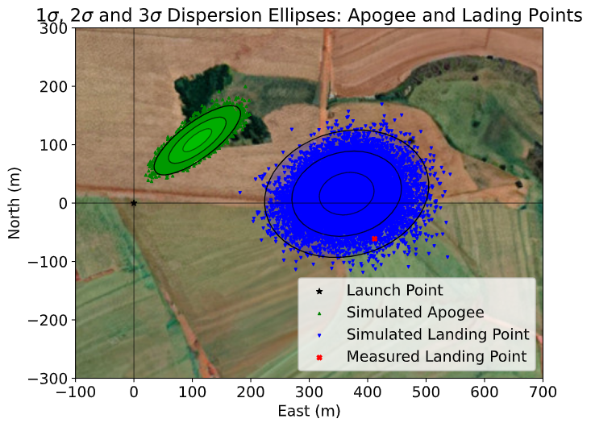

:author: João Lemes Gribel Soares
:email: jgribel@usp.br
:institution: Escola Politécnica of the University of São Paulo
:corresponding:

:author: Mateus Stano Junqueira
:email: mateusstano@usp.br
:institution: Escola Politécnica of the University of São Paulo

:author: Oscar Mauricio Prada Ramirez
:email: oscarmprada@usp.br
:institution: Escola Politécnica of the University of São Paulo
:orcid: 0000-0001-6904-8959

:author: Patrick Sampaio dos Santos Brandão
:email: patricksampaio@usp.br
:institution: Escola Politécnica of the University of São Paulo
:institution: École Centrale de Nantes.

:author: Adriano Augusto Antongiovanni
:email: adrianoaugusto98@usp.br
:institution: Escola Politécnica of the University of São Paulo
:orcid: 0000-0002-3658-0153

:author: Guilherme Fernandes Alves
:email: guilherme_fernandes@usp.br
:institution: Escola Politécnica of the University of São Paulo
:orcid: 0000-0003-3873-2699

:author: Giovani Hidalgo Ceotto
:email: giovani.ceotto@alumni.usp.br
:institution: Escola Politécnica of the University of São Paulo
:orcid: 0000-0002-1614-3028

:bibliography: references

------------------------------------------------------------------------------------------------------------
RocketPy: Combining Open-Source and Scientific Libraries to Make the Space Sector More Modern and Accessible
------------------------------------------------------------------------------------------------------------

.. class:: abstract
   
   In recent years we are seeing exponential growth in the space sector, with new companies emerging in it. 
   On top of that more people are becoming fascinated to participate in the aerospace revolution, which motivates
   students and hobbyists to build more High Powered and Sounding Rockets. 
   However, rocketry is still a very inaccessible field, with a high knowledge entry-level and very specific terms. 
   To make it more accessible, people need an active community with flexible, easy-to-use, and well-documented tools.
   RocketPy is a software solution created to address all those issues, solving the trajectory simulation for High-Power
   rockets being built on top of SciPy and the Python Scientific Environment. 
   The code allows for a sophisticated 6 degrees of freedom simulation of a rocket's flight trajectory, including high fidelity variable mass effects as well as descent under parachutes. 
   All of this is packaged into an architecture that facilitates complex simulations, such as multi-stage rockets, 
   design and trajectory optimization, and dispersion analysis. 
   In this work, the flexibility and usability of RocketPy are indicated in four example simulations: 
   a basic trajectory simulation, an , a dynamic stability analysis, and a Monte Carlo dispersion simulation. 
   The code structure and the main implemented methods are also presented.
   .. While RocketPy has a sophisticated feature set, it is also accessible for anyone interested, as the code is well
   .. documented, and the repository's GitHub page is filled with example Jupyter Notebooks that can be adapted for
   .. specific use case.
.. class:: keywords

   rocketry, flight, rocket trajectory, flexibility, Monte Carlo analysis

Introduction
============

When it comes to rockets, there is a wide field ranging from orbital rockets to toy rockets. 
Between them, two types will be noted: sounding rockets and High-Powered Rockets (HPRs). 
Sounding rockets are mainly used by government agencies for scientific experiments in suborbital 
flights and HPR are mainly used for educational purposes, with increasing popularity in student competitions, 
such as the annual Spaceport America Competition, with more than 100 rocket design teams from all over the world. 
Also, after the university-built rocket TRAVELER IV :cite:`TravelerIV`reaching the Kármán line, 
both types of rockets are converging to a similar flight trajectory.

With this convergence, HPRs are becoming bigger and more robust, increasing their potential hazard, along with their
capacity, making safety an important issue. 
Moreover, performance is always a requirement both for saving cost, and time and to accurately reach scientific 
experiment goals.

In that scenario, many parameters should be determined before launching an HPR for both safety and performance, 
such as the landing site coordinates, increasing safety and the possibility of recovering the rocket 
:cite:`Wilde2018RangeLaunches`; apogee altitude, avoiding collision with aircraft and maintaining the ideal 
altitude so the rocket can function.

To better attend to those issues, RocketPy was created as a computational tool that can accurately predict all 
dynamic parameters involved in the flight of sounding, model, and HPR, given parameters such as the rocket geometry,
motor characteristics, and environmental conditions. It is also open source, well structured, and documented, 
allowing minor changes to bring new features :cite:`ceotto2021rocketpy`.

Background 
==========

Rocketry Introduction
---------------------
.. First author: Stano

To better understand RocketPy, a few general aspects of rocketry are of major importance. First, rockets are flying
vehicles that can be 

Rocketry terminology
--------------------
In this section, we clarify some terms specific to the rocketry field that may help to better understand the text.

- Apogee: The point at which a body is furthest from earth
- Degrees of freedom: Maximum number of independent values in an equation
- Flight Trajectory: 3-dimensional path, over time, of the rocket during its flight
- Launch Rail: Guidance for the rocket to accelerate to a stable flight speed
- Powered Flight: Phase of the flight where the motor is active
- Free Flight: Phase of the flight where the motor is inactive and no other component but its inertia is influencing the rocket's trajectory
- Standard Atmosphere: Average pressure, temperature, and air density for various altitudes
- Nozzle: Part of the rocket’s engine that accelerate the exhaust gases
- Static hot-fire test: Test to measure the integrity of the motor and determine its thrust curve
- Thrust Curve: Thrust overtime of a motor
- Static Margin: Is a non-dimensional distance to analyze the stability
- Nosecone: The forward most section of a rocket, shaped for aerodynamics
- Fin: Flattened append of the rocket providing stability during flight, keeping it in the flight trajectory

Flight Model
------------
The flight model of a high-powered rocket takes into account at least three different phases:

1. The first phase consists of a linear movement along the launch rail:
The motion of the rocket is restricted to one dimension, which means that only the translation along the rail needs 
to be modelled. During this phase, four forces can act on the rocket: weight, engine thrust, rail reactions, and 
aerodynamic forces.

2. After completely leaving the rail, a phase of 6 degrees of freedom (DOF) is established, 
which includes powered flight and free flight:
The rocket is free to move in three-dimensional space and weight, engine thrust, normal and axial 
aerodynamic forces are still important.

3. Once apogee is reached, a parachute is usually deployed, characterizing the third phase of flight:
the parachute descent.
In the last phase, the parachute is launched from the rocket, which is usually divided into two
or more parts joined by ropes. This phase ends in the point of impact.

.. multibody dynamics is taken into account during descent.

Design: RocketPy Architecture
=============================
.. First authors: Oscar/Gui
   Length: 4/15 columns

There are four main classes that organize the dataflow during the simulations: motor, rocket, environment and flight
:cite:`ceotto2021rocketpy`.
Furthermore there is also a helper class named `function`, which will be described further.
In the Motor class, the main physical and geometric parameters of the motor are configured, 
such as: nozzle geometry, grain parameters, mass, inertia and thrust curve.
This first class acts as an input to the Rocket class where the user is also asked to define certain parameters of 
the rocket  such as the inertial mass tensor, geometry, drag coefficients and parachute description. 
Finally, the Flight class joins the rocket and motor parameters with information from another class called Environment, 
such as wind, atmospheric and earth models, to generate a simulation of the rocket's trajectory.
This modular architecture, along with its well-structured and documented code, facilitates complex simulations, 
starting with the use of Jupyter Notebooks that people can adapt for their specific use case.
The Fig. :ref:`fig1` illustrates RocketPy architecture. 

.. figure:: images/Fluxogram.png
   :align: center
   :scale: 25%
   :figclass: bht

   RocketPy classes interaction :label:`fig1`

Function
--------
.. First authors: Gribel
   (Talk a bit about the motivations behind Function class and what it is trying to solve.
   Go over its main features such as naturally doing algebra, interpolation/extrapolation, evaluating, differentiation/integration and plotting.
   Explain how rocketpy interpolations are faster than usual numpy/scipy methods due to utilizing values from previous interpolations - )
   Discuss ease-of-use vs. efficiency. Show an example.

Variable interpolation meshes/grids from different sources can lead to problems regarding coupling different data types.
In order to solve this, RocketPy employs a dedicated *Function* class which allows for more natural and dynamic handling
of these objects, structuring them like :math:`\mathbb{R}^n \to \mathbb{R}^n` mathematical functions.

Through the use of those methods, this approach allows for quick and easy arithmetic operations between lambda
expressions and list-defined interpolated functions, as well as scalars. Different interpolation methods are available
to be chosen from, among them simple polynomial, spline and Akima (:cite:`ceotto2021rocketpy`). Extrapolation of *Function*
objects outside the domain constrained by a given dataset is also allowed.

Furthermore, evaluation of definite integrals of these *Function* objects is among their feature set. By cleverly
exploiting the chosen interpolation option, RocketPy calculates the values fast and precisely through the use of
different analytical methods. If numerical integration is required, the class makes use of SciPy's implementation of
the QUADPACK Fortran library (citar referencia). For 1-dimensional Functions, evaluation of derivatives at a point is
made possible through the employment of a simple finite difference method.

.. TODO: melhorar parágrafo acima

Finally, in order to increase usability and readability, all *Function* objects instances are callable and can be
presented in multiple ways depending on the given arguments. If no argument is given, a matplotlib figure opens and a
plot of the function is shown inside it's domain. This is especially useful for [the post-processing methods where
various information on the multiple classes is presented, providing for more concise code]. If a n-sized array is
passed instead, RocketPy will try and evaluate the value of the Function at this given point [using different methods],
returning it's value.

Additionally, if another *Function* object is passed, the class will try to match their respective domain
and co-domain in order to return a third instance, representing a composition of functions, in the
likes of: :math:`h(x) = (g \circ f)(x) = g(f(x))`. By imitating in syntax commonly used mathematical
notation, RocketPy allows for more understandable and human-readable code, especially in the implementation
of the more extensive and cluttered rocket equations of motion.

.. The paragraph above should probably be broken into two...

.. Might be worth to add an example here, or maybe not... If anyone has any good ideas on concise examples of Function class,
   feel free to add it here!

Environment
-----------
.. First authors: Gui/Oscar

The Environment class reads, processes and stores all the information regarding wind and atmospheric model data. 
It receives as inputs launch point coordinates, as well as the length of the launch rail, and then provide
the flight class with six profiles as a function of altitude: wind speed in east and north directions,
atmospheric pressure, air density, dynamic viscosity, and speed of sound.
For instance, an Environment object can be set as representing New Mexico, United States:

.. code-block:: python

   from rocketpy import Environment
   Env = Environment(
      railLength=5.2,
      latitude=32.990254,
      longitude=-106.974998,
      elevation=1400) 

RocketPy requires `datetime` library information specifying year, month, 
day and hour to compute the weather conditions on the specified day of launch. 
An optional argument, the timezone, may also be specified. 
If the user prefers to omit it, RocketPy will assume 
the `datetime` object is given in standard UTC time, just as following:

.. code-block:: python
   
   import datetime
   tomorrow = (
      datetime.date.today() + 
      datetime.timedelta(days=1)
   )
      
   date_info = (
      tomorrow.year,
      tomorrow.month, 
      tomorrow.day,
      12
   )  # Hour given in UTC time

By default, the International Standard Atmosphere :cite:`ISOCentralSecretary1975StandardAtmosphere` static atmospheric 
model is loaded. However, it is easy to set other models by importing data from different 
meteorological agencies public datasets, such as Wyoming Upper Air Soundings and ECMWF; 
or to set a customized atmospheric model based on user defined functions. 
As RocketPy supports integration with different meteorological agencies datasets, it allows for a 
sophisticated definition of weather conditions including forecasts and historical reanalysis scenarios.

In this case, NOAA's RUC Soundings data model is used, a worldwide and open-source meteorological model made available 
online. The file name is set as `GFS`, indicating the use of the Global Forecast System provided by NOAA, which features
a forecast with quarter degree equally spaced longitude/latitude grid with a temporal resolution of three hours. 

.. code-block:: python

   Env.setAtmosphericModel(
      type='Forecast', 
      file='GFS')
   Env.info()

What is happening on the back-end of this code's snippet is RocketPy utilizing 
the OPeNDAP protocol to retrieve data arrays from NOAA's server. 
It parses by using netCDF4 data management system, allowing for the retrieval of 
pressure, temperature, wind velocity, and surface elevation data as a function of altitude. 
The Environment class then computes the following parameters: wind speed, wind heading, speed of sound, air density, 
and dynamic viscosity. 
Finally, plots of the evaluated parameters with respect to the altitude are all passed on to the mission 
analyst by calling the `Env.info()` method.

.. TODO: acrescentar imagem do environment?

Motor
-----

RocketPy is flexible enough to work with most types of motors used in sound rockets. 

.. Currently, a robust Motor class has been fully implemented and tested. 

The main function of the Motor class is to provide the thrust curve, the propulsive mass, the inertia tensor, 
and the position of its center of mass as a function of time. 
Geometric parameters regarding propellant grains and the motor's nozzle must be provided, 
as well as a thrust curve as a function of time. The latter is preferably obtained empirically from a static hot-fire 
test, however, many of the curves for commercial motors are freely available online (citacao-1: thrustcurve.org). 
Alternatively, for homemade motors, there is a wide range of [Python-based - ?], open-source
internal ballistics simulators [packages], such as OpenMotor (citacao 2), which can predict the produced thrust 
with high accuracy for a given sizing and propellant combination.
There are different types of rocket motors: solid motors, liquid motors, and hybrid motors. 
Currently, a robust Solid Motor class has been fully implemented and tested.
For example, a typical solid motor can be created as an object in the following way:

.. code-block:: python
   
   MotorName = SolidMotor(
      thrustSource='Motor_file.eng',
      burnOut=2,
      reshapeThrustCurve= False,
      grainNumber=5,
      grainSeparation=3/1000,
      grainOuterRadius=33/1000,
      grainInitialInnerRadius=15/1000,
      grainInitialHeight=120/1000,
      grainDensity= 1782.51,
      nozzleRadius=49.5/2000,
      throatRadius=21.5/2000,
      interpolationMethod='linear')

Rocket
------

.. First author: Stano
.. 1Revisor: Adriano

The Rocket Class is responsible for creating and defining the rocket's core characteristics. Mostly composed of
physical attributes, such as mass and moments of inertia, the rocket object will be responsible to storage and 
calculate mechanical parameters.

A rocket object can be defined with the following code:

.. code-block:: python

   RocketName = Rocket(
      motor=MotorName,
      radius=127 / 2000,
      mass=19.197 - 2.956,
      inertiaI=6.60,
      inertiaZ=0.0351,
      distanceRocketNozzle=-1.255,
      distanceRocketPropellant=-0.85704,
      powerOffDrag="data/rocket/powerOffDragCurve.csv",
      powerOnDrag="data/rocket/powerOnDragCurve.csv",
   )

As stated in [RocketPy architecture], a fundamental input of the rocket is its motor, an object of the Motor class
that must be previously defined. Some inputs are fairly simple inputs that can be easily obtained with a CAD model
of the rocket such as radius, mass, and moment of inertia in two different directions.
The 'distance' inputs are relative to the center of mass and define the position of the motor nozzle and the center of
mass of the motor propellant. The *powerOffDrag* and *powerOnDrag* receive .csv data that represents the drag
coefficient as a function of rocket speed for the case where the motor is off and other for the motor still burning, 
respectively.

.. Revisor1: Nao colocaria a parte abaixo, me parece algo mais apr aum manual d RocketPy
.. The calculations made in the class consider, as the geometrical reference, the center of mass of the rocket.
.. Thus, all parts of the rocket must be defined considering its distace to the rockets CM

At this point, the simulation would run a rocket with a tube of a certain diameter, with its center of mass specified 
and a motor at its end. For a better simulation, a few more important aspects should then be defined, called \
*Aerodynamic surfaces*. Three of them are accepted in the code, these being the nosecone, fins, and tail. They can be 
simply added to the code via the following methods:

.. TODO: example image of a nosecone, fin and tail???
.. Rvisor1: Por mim nao coloca nenhum

.. code-block:: python
   
   Nosecone = Rocket.addNose(
      length=0.55829, kind="vonKarman", 
      distanceToCM=0.71971
   )
   FinSet = Rocket.addFins(
      4, span=0.100, rootChord=0.120, tipChord=0.040, 
      distanceToCM=-1.04956
   )
   Tail = Rocket.addTail(
      topRadius=0.0635, bottomRadius=0.0435, length=0.060, 
      distanceToCM=-1.194656
   )
   
.. TODO: explicar como adicionar paraquedas... 

All these methods receive defining geometrical parameters and their distance to the rocket's center of mass 
(distanceToCM) as inputs. Each of these surfaces generates, during the flight, a lift force that can be calculated via 
a lift coefficient, which is calculated with geometrical properties, as shown in :cite:`Barrowman1967TheVehicles`. 
Further on, these coefficients are used to calculate the center of pressure and subsequently the static margin. Inside 
each of  these methods, the static margin is reevaluated.

With the rocket fully defined, the `info()` and `allInfo()` methods can be called giving us information and plots of the
calculations performed in the class. 
One of the most relevant outputs of the Rocket class is the static margin, as it is important for the rocket stability 
and makes possible several analyses.
It is visualized through the time plot in Fig. :ref:`figSM`, which shows the variation of the static margin as the motor
burns its propellant.
.. Revisor1: Reduzi um pouco o texto e agrupei todas as infos de static margin antes de mostrar o exmeplo dela.
..One of the most relevant outputs of the Rocket class is the static margin, thorught the time plot :ref:`figSM`, which shows
..the variation of the static margin as the motor burns its propellant.

.. figure:: images/SMoutput.png
   :align: center
   :figclass: bht
   
   Static Margin :label:`figSM`

..Since the static margin is essential to understand the rocket stability, this plot is very useful for several different analysis.

Flight
------
.. First author: Giovani/Stano
   Suggested topics:
    (0) Basic intro describing what class does
    (1) Use of LSODA and why (taking advantage of explicit and implitcit solvers) and how (if interesting)
    (2) FlightPhases as a container datatype, which holds FlightPhase instances
        (a) How is the FlightPases container initialized (rail phase and max time)
        (b) The fact that it is dynamic, new phases can be added and removed
        (c) The fact that it is iterable, and that it can be used in a for loop
        (d) How flight phases are created during the simulation and when
    (3) TimeNodes as a container datatype, which holds TimeNode instances
        (a) TimeNodes as a basic discretization of the flight phase
        (b) Why use TimeNodes: parachute release, control events, etc.
    (4) Time overshoot - why? faster when events are rarely triggered
    (5) Post processing and results (allInfo)
   
.. (0)

The Flight class is responsible for the integration of the rocket's equations of motion overtime
:cite:`ceotto2021rocketpy`. Data from instances of the Rocket class and the Environment class are used as input to
initialize it, along with parameters such as launch heading and inclination relative to the Earth's surface:

.. code-block:: python
   
   TestFlight = Flight(
      rocket=Rocket,
      environment=Env,
      inclination=85,
      heading=0
   )

Once the simulation is initialized, run and completed, the instance of the Flight class stores relevant raw data. The
:code:`Flight.postProcess()` method can then be used to compute secondary parameters such the rocket's Mach number
during flight and it's angle of attack.

.. (1) TODO: Cite Scipy and LSODA (citations can be found here: https://docs.scipy.org/doc/scipy/reference/generated/scipy.integrate.LSODA.html)

To perform the numerical integration of the equations of motion, the Flight class uses the LSODA solver
:cite:`LSODA1983` implemented by Scipy's :code:`scipy.integrate` module :cite:`2020SciPy-NMeth`. Usually, well designed
rockets result in non-stiff equations of motion. However, during flight, rockets may become unstable due to variations
in its inertial and aerodynamic properties, which can result in a stiff system. LSODA switches automatically between the
nonstiff Adams method and the stiff BDF method, depending on the dected stiffness, perfectly handling both cases.

.. (2) FlightPhases as a container datatype, which holds FlightPhase instances

Since a rocket's flight trajectory is composed of multiple phases, each with its own set of governing equations,
RocketPy employs a couple of clever methods to run the numerical integration. The Flight class uses a
:code:`FlightPhases` container to hold each :code:`FlightPhase`. The :code:`FlightPhases` container will orchestrate the
different :code:`FlightPhase` instances, and compose them during the flight.

.. (b) The fact that it is dynamic, new phases can be added and removed

This is crucial because there are events which may or may not happen during the simulation, such as the triggering of a
parachute ejection system (which may or may not fail) or the activation of a premature flight termination event. There
are also events such as the departure from the launch rail or the apogee that are known to occur, but their timestamp is
unknown until the simulation is run. All of these events can trigger new flight phases, caracterized by a change in the
rocket's equations of motion. Furthermore, such events can happen close to each other and provoke delayed phases.

To handle this, the Flight class has a mechanism of creating new phases and adding them dynamically in the appropriate
order to the :code:`FlightPhases` container.

The constructur of the :code:`FlightPhase` class takes the following arguments:

- :code:`t`: a timestamp which simbolizes at which instant such flight phase should begin;
- :code:`derivative`: a function which returns the time derivatives of the rocket's state vector (i.e., calculates the
  equations of motion for this flight phase);
- :code:`callbacks`: a list of callback functions to be run when the flight phase begins (which can be usefull if some
  parameters of the rocket need to be modified before the flight phase begins).

.. (c) The fact that it is iterable, and that it can be used in a for loop

The constructor of the Flight class initializes the :code:`FlightPhases` container with a *rail phase* and also a
dummy *max time* phase which marks the maximum flight duration. Then, it loops through the elements of the container.

Inside the loop, an important attribute of the current flight phase is set: :code:`FlightPhase.timeBound`, the maximum
timestamp of the flight phase, which is always equal to the initial timestamp of the next flight phase. Ordinarily, it
would be possible to run the LSODA solver from :code:`FlightPhase.t` to :code:`FlightPhase.timeBound`. However, this is
not an option because the events which can trigger new flight phases need to be checked throughtout the simulation.
While :code:`scipy.integrate.solve_ivp` does offer the :code:`events` argument to aid in this, it is not possible to use
it with most of the events that need to be tracked, since they cannot be expressed in the necessary form.

As an example, consider the very common event of a parachute ejection system. In order to simulate real-time algorithms,
the necessary inputs to the ejection algorithm need to be supplied at regular intervals to simulate a desired sampling
rate. Furthermore, the ejection algorithm cannot be called multiple times without real data since it generally stores
all the inputs it gets to calculate if the rocket has reached the apogee in order to trigger the parachute release
mechanism. Discrete controllers can present the same peculiar properties.

..  (3) TimeNodes as a container datatype, which holds TimeNode instances
..      (a) TimeNodes as a basic discretization of the flight phase
..      (b) Why use TimeNodes: parachute release, control events, etc.

To handle this, the instance of the :code:`FlightPhase` class holds a :code:`TimeNodes` container, which stores all
the required timesteps, or :code:`TimeNode`, that the integration algorithm should stop at so that the events can be
checked, usually by feedding the necessary data to parachutes and discrete control trigger functions. When it comes to
discrete controllers, they may change some parameters in the rocket once they are called. On the other hand, parachute
triggers rarely actually trigger, and thus, rarely invoke the creation of a new flight phase caractherized by
*descent under parachute* governing equations of motion.

..  (4) Time overshoot - why? faster when events are rarely triggered

The Flight class can take advantage of this fact by employing overshootable time nodes: time nodes that the integrator
does not really need to stop at. This allows the integration algorithm to use more optmized timesteps and significantly
reduce the number of iterations needed to perform a simulation. Once a new timestep is taken, the Flight class checks
all overshootable time nodes that have passed and feed their event triggers with interpolated data. In case when event
is actually triggered, the simulation is rolled back to that state.

.. (2)(d) How flight phases are created during the simulation and when

In summary, throughout a simulation, the Flight class loops through each non-overshootable :code:`TimeNode` of each
element of the :code:`FlightPhases` container. At each :code:`TimeNode`, the event triggers are fed with the necessary
input data. Once an event is triggered, a new :code:`FlightPhase` is created and added to the main container.
These loops continue until the simulation is completed, either by reaching the maximum flight duration or by reaching
a terminal event, such as ground impact.

..  (5) Post processing and results (allInfo)

Once the simulation is completed, raw data can already be accessed. To compute secondary parameters, the
:code:`Flight.postProcess()` is used. It takes advtange of the fact that the :code:`FlightPhases` container keeps all
relevant flight information to essentially retrace the trajectory and capture more information about the flight.

Once secondary parameters are computed, the :code:`Flight.allInfo` method can be used to show and plot all the relevant
information ...
.. TODO: Add trajectory plot, or other relavant plots

.. TODO: Come up with a better section title, one which is shorter and clearer

Design: Adaptability of the Code and Accessibility 
==================================================
.. First author: Patrick
   Suggestions:
      It's easy and possible to implement new classes over rocketpy framework
      also it's an open-source project, 
      object-oriented programming makes everything easier and more accessible

RocketPy's development started in 2017 with some requirements in mind: the code must run fast, which is important because
we are interested in running multiple simulations to compare different parameters; and there must be the possibility of 
implementing optimization methods for the rocket parameters; the code must be flexible, this is important because each
team has their own necessity, therefore we structured the code in a fashion that each major component of the problem 
separated in classes, using concepts of Single Responsibility Principle (SRP), and finally, the code must be accessible, 
that's why the code was published on the Github (citar rocketpy.org) and why we started the RocketPy Team to improve 
this tool and to create a community around it, facilitating the access to high-quality simulation without a great level
of specialization.

The following examples demonstrate how RocketPy is an useful tool during the design, and operation of the Rocket, 
enabling functionalities not available by other rocket simulation software.

Examples
========
.. Length: 5/15 columns

Using RocketPy for Rocket Design 
--------------------------------

In this section we describe 
Using RocketPy for such thing is such kind special...

1.  Apogee by Mass using function helper class

   .. First author: Patrick
      For inspiration, you can see the following content:https://colab.research.google.com/github/giovaniceotto/rocketpy/blob/master/docs/notebooks/getting_started_colab.ipynb#scrollTo=qsXBVgGANVGD
   
   .. Revisor1: Adriano

Because of performance and safety reasons, apogee is one of the most important results in rocketry competitions, and 
it's highly valuable for teams to understand how different Rocket parameters can change it. Since a direct relation is 
not available for this kind of computation, the caracteristic of running simulation quickly are utilized for evaluatin 
how the Apogee is affected by the mass of the Rocket. This function is highly used during the early phases of the 
design of a Rocket.

An example of code of how this could be achieved:

.. code-block:: python

   def apogee(mass):
      # Prepare Environment
      Env = Environment(....)

      Env.setAtmosphericModel(type="CustomAtmosphere", 
      wind_v=-5)

      # Prepare Motor
      Pro75M1670 = SolidMotor(.....)

      # Prepare Rocket
      Calisto = Rocket(.....
         mass=mass,
         ......)

      Calisto.setRailButtons([0.2, -0.5])
      Nose = Calisto.addNose(.....)
      FinSet = Calisto.addFins(....)
      Tail = Calisto.addTail(....)

      # Simulate Flight until Apogee
      TestFlight = Flight(.....)
      return TestFlight.apogee

   apogeebymass = Function(apogee, inputs="Mass (kg)", 
   outputs="Estimated Apogee (m)")
   apogeebymass.plot(8, 20, 20)

The possibility of generating this relation between mass and apogee in a graph shows the flexibility of Rocketpy and 
also the importance of the simulation being designed to run fast.

1. Dynamic Stability Analysis
   
In this analysis the integration of three different RocketPy classes will be explored: Function, Rocket, and Flight.
The motivation is to investigate how static stability translates into dynamic stability, 
i.e. different static margins result relies on different dynamic behaviour, 
which also depends on the rocket's rotational inertia.

We can assume the objects stated on [motor] and [rocket] sections and just add couple variations on some input data in 
order to visualize the output effects. 
More specifically, the idea will be to explore how the dynamic stability of the student rocket Calisto varies by 
changing the position of the set of fins by a certain factor.

In order to do that, we have to simulate multiple flights with different static margins, which is achieved by varying 
the rocket's fin positions. This can be done through a simple python loop, as described below:

.. code-block:: python
   
   simulation_results = []
   for factor in [0.5, 0.7, 0.9, 1.1, 1.3]:
      # remove previous fin set
      RocketName.aerodynamicSurfaces.remove(FinSet)
      FinSet = RocketName.addFins(
         4, span=0.1, rootChord=0.120, tipChord=0.040,
         distanceToCM=-1.04956 * factor
      )
      FlightName = Flight(
         rocket=RocketName,
         environment=Env,
         inclination=90,
         heading=0,
         maxTimeStep=0.01,
         maxTime=5,
         terminateOnApogee=True,
         verbose=True,
      )
      FlightName.postProcess()
      simulation_results += [
         (
         FlightName.attitudeAngle,
         RocketName.staticMargin(0),
         RocketName.staticMargin(FlightName.outOfRailTime),
         RocketName.staticMargin(FlightName.tFinal)
         )
         ]
   Function.comparePlots(
      simulation_results,
      xlabel="Time (s)",
      ylabel="Attitude Angle (deg)",
   )

The next step is to start the simulations themselves, which can be done through a loop where we call Flight class, 
perform the simulation, save the desired parameters into a list and then follow through the next iteration.
We'll also be using the *post-process* flight data method to make RocketPy evaluate additional result parameters after
the simulation.

Finally, the `Function.comparePlots()` method is used to plot the final result.

[Precisa incluir imagem aqui e refinar o texto acima!]

Monte Carlo Simulation
----------------------

When simulating a rocket's trajectory, many input parameters may not be completely reliable due to several
uncertainties in measurements raised during the design or construction phase of the rocket. 
These uncertainties can be considered together in a group of Monte Carlo simulations
:cite:`rubinstein2016simulationc` which can be built on top of RocketPy.

The Monte Carlo method here is applied by running a significant number of simulations where each iteration
has a different set of inputs that are randomly sampled given a previously known probability distribution, 
for instance the mean and standard deviation of a Gaussian distribution. 
Almost every input data presents some kind of uncertainty, except for the number of fins or propellant grains
that a rocket presents. 
Moreover, some inputs, such as wind conditions, system failures, or the aerodynamic coefficient curves, may behave
differently and must receive special treatment.

Statistical analysis can then be made on all the simulations, with the
main result being the :math:`1\sigma`, :math:`2\sigma`, and :math:`3\sigma` ellipses representing the possible area of 
impact and the area where the apogee is reached (:ref:`figEllipses`). All ellipses can be evaluated 
based on the method presented by :cite:`Chew1966ConfidenceDistribution`.

   
   1 sigma, 2 sigma, and 3 sigma dispersion ellipses for both apogee and landing point :label:`figEllipses`

.. TODO: remover titulo do grafico, corrigir o simbolo sigma na legenda

When performing the Monte Carlo simulations on RocketPy, all the inputs - i.e. the parameters along with their
respective standard deviation - are stored in a dictionary. The randomized set of inputs is then generated using
a `yield` function:

.. code-block:: python

   def sim_settings(analysis_parameters, iter_number):
      i = 0
      while i < iter_number:
         # Generate a simulation setting
         sim_setting = {}
         for p_key, p_value in analysis_parameters.items():
               if type(p_value) is tuple:
                  sim_setting[p_key] =  normal(*p_value)
               else:
                  sim_setting[p_key] =  choice(p_value)
         # Update counter
         i += 1
         # Yield a simulation setting
         yield sim_setting

Where *analysis_parameters* is the dictionary with the inputs and *iter_number* is the total number of simulations
to be performed.
At that time the function yields one dictionary with one set of inputs, which will be used to run a simulation. 
Later the *sim_settings* function is called again and another simulation is run until the loop iterations reach
the number of simulations:

.. code-block:: python
   
   for s in sim_settings(analysis_parameters, iter_number): 
      # Call the Environment, Motor, Rocket, 
      # and Flight class to run a simulation 
      # with the set of inputs yielded by the 
      # flight_setting function
      ...

Finally, the set of inputs for each simulation along with its set of outputs, are stored in a .txt file. 
This allows for long-term data storage and the possibility to append simulations to previously finished ones.
The stored output data can be used to study the final probability distribution of key parameters, as illustrated 
on :ref:`apogAlt`.

.. figure:: images/apogeeAltitude.png
   :align: center
   :figclass: bht
   
   Distribution of apogee altitude :label:`apogAlt`
.. 

Finally, it is also worth mentioning that all the information generated in the Monte Carlo simulation based on
RocketPy may be of utmost importance to safety and operational management during rocket launches, once it allows for a 
more reliable prediction of the landing site and apogee coordinates.

Validation of the results 
=========================

Validation is a big problem for libraries like RocketPy, where true values for some results like apogee and maximum 
velocity are very hard to obtain or simply not available. Therefore, in order to make RocketPy more robust and easier to
modify, while maintaining precise results, some innovative testing strategies have been implemented.

First of all, unit tests were implemented for all classes and their methods ensuring that each function is working
properly. Given a set of different inputs that each function can receive, the respective outputs are tested against
expected results, which can be based on real data or augmented examples cases. The test fails if the output deviates
considerably from the established conditions, or an unexpected error occurs along the way.

Since RocketPy relies heavily on mathematical functions to express the governing equations, implementation errors
can occur due to convulated nature of such expressions. Hence, to reduce the probability of such errors, there is a
second layer of testing which will evaluate if such equations are dimensionally correct.

To accomplish this, RocketPy makes use of the `numericalunits` library, which defines a set of independent base units as
randomly-chosen positive floating point numbers. In a dimensionally-correct function, the units all cancel out when the
final answer is devided by its resulting unit. And thus, the result is deterministic, not random. On the otIn a dimensionally-incorrect
calculations, there will be random factors causing a randomly-varying final answer.

"A complete set of independent base units (meters, kilograms, seconds, coulombs, kelvins) are defined as randomly-chosen
positive floating-point numbers. All other units and constants are defined in terms of those. In a dimensionally-correct
calculation, the units all cancel out, so the final answer is deterministic, not random. In a dimensionally-incorrect
calculations, there will be random factors causing a randomly-varying final answer."

These tests are implemented using the numericalunits library, which
generates a random number that will be associated to a given unit. For example, given one initialization of this library
the meter will be equal to the numerical value of 4.08. Using this ideia, the classes Rocket, SolidMotor are initilized
with parameters with their respectives units.

Initilization without using numericalunits

.. code-block:: python

   @pytest.fixture
   def solid_motor():
      example_motor = SolidMotor(
         thrustSource="data/motors/Cesaroni_M1670.eng",
         burnOut=3.9,
         grainNumber=5,
         grainSeparation=5 / 1000,
         grainDensity=1815,
         grainOuterRadius=33 / 1000,
         grainInitialInnerRadius=15 / 1000,
         grainInitialHeight=120 / 1000,
         nozzleRadius=33 / 1000,
         throatRadius=11 / 1000,
         interpolationMethod="linear",
      )
      return example_motor

   @pytest.fixture
   def rocket(solid_motor):
      example_rocket = Rocket(
         motor=solid_motor,
         radius=127 / 2000,
         mass=19.197 - 2.956,
         inertiaI=6.60,
         inertiaZ=0.0351,
         distanceRocketNozzle=-1.255,
         distanceRocketPropellant=-0.85704,
         powerOffDrag="data/calisto/powerOffDragCurve.csv",
         powerOnDrag="data/calisto/powerOnDragCurve.csv",
      )
      return example_rocket

Initilization using numericalunits

.. code-block:: python

   import numericalunits

   @pytest.fixture
   def m():
      return numericalunits.m

   @pytest.fixture
   def kg():
      return numericalunits.kg

   @pytest.fixture
   def dimensionless_rocket(kg, m, dimensionless_solid_motor):
      example_rocket = Rocket(
         motor=dimensionless_solid_motor,
         radius=127 / 2000 * m,
         mass=(19.197 - 2.956) * kg,
         inertiaI=6.60 * (kg * m**2),
         inertiaZ=0.0351 * (kg * m**2),
         distanceRocketNozzle=-1.255 * m,
         distanceRocketPropellant=-0.85704 * m,
         powerOffDrag="data/calisto/powerOffDragCurve.csv",
         powerOnDrag="data/calisto/powerOnDragCurve.csv",
      )
      return example_rocket

   @pytest.fixture
   def dimensionless_solid_motor(kg, m):
      example_motor = SolidMotor(
         thrustSource="data/motors/Cesaroni_M1670.eng",
         burnOut=3.9,
         grainNumber=5,
         grainSeparation=5 / 1000 * m,
         grainDensity=1815 * (kg / m**3),
         grainOuterRadius=33 / 1000 * m,
         grainInitialInnerRadius=15 / 1000 * m,
         grainInitialHeight=120 / 1000 * m,
         nozzleRadius=33 / 1000 * m,
         throatRadius=11 / 1000 * m,
         interpolationMethod="linear",
      )
      return example_motor

Finally, to ensure that the equations implemented are dimensionally correct, we compare the value calculated by the
class initilized with and without the numericalunits units. For example, on the Rocket class it's calculated the
staticMargin of the rocket, which is an adimensional value, so the class initilized with and without the units should
have the same value, so to make sure that the computation is correct it's possible to simply execute the following test:

.. code-block:: python

   def test_static_margin_dimension(..., rocket, dimensionless_rocket, ...):
      #add aerodynamic surfaces to rocket and dimensioneless_rocket
      assert pytest.approx(dimensionless_rocket.staticMargin(0), 1e-12) == pytest.approx(
         rocket.staticMargin(0), 1e-12
      )
      assert pytest.approx(dimensionless_rocket.staticMargin(-1), 1e-12) == pytest.approx(
         rocket.staticMargin(-1), 1e-12
      )

And if the computation have a unit, the center of pressure, which is given in meters, the following test is implemented

.. code-block:: python

   def test_cpz_dimension(..., rocket, dimensionless_rocket, ...):
      #add aerodynamic surfaces to rocket and dimensioneless_rocket
      assert pytest.approx(dimensionless_rocket.cpPosition / m, 1e-12) == pytest.approx(
        rocket.cpPosition, 1e-12
    )

If the result given by dimensionless_rocket divided by the value of meter is not equal to the value given by the rocket,
we can conclude that the formula responsible for calculating the cpPosition was implemented incorrectly.

Finally, it was implemented some tests at a more macroscopic scale, which are the Acceptance tests, that validates
results like apogee, maximum velocity, apogee time, maximum aceleration. These results depend on several functions and
their interactions, after the publication of the [rocketpaper] we have defined a precision for these results for the
flights for which we haverecorded experimental data. These tests will simply run a simulation of these flights and
compare the experimental data with the data generated by RocketPy and evaluate if the resultsare within the interval of
tolerance defined. They are very important to ensure that with new changes the code will not lose precision. In
conclusion those 3 layers of testing makes the software reliable, where the team is confident that new changes will only
improves the perfomance of the Software.

Conclusions 
===========
.. Length: 0.75/15 columns

Rocketpy is an easy-to-use tool for simulating high-powered rocket trajectories built with SciPy and 
the Python Scientific Environment. 
The software's modular architecture is based on four main classes and helper classes with well-documented code 
that allows to easily adapt complex simulations to various needs using the supplied Jupyter Notebooks.
The code can be a useful tool during Rocket design and operation, allowing to calculate key parameters 
such as apogee and dynamic stability as well as high-fidelity 6-DOF vehicle trajectory with
a wide variety of customizable parameters, from its launch to its point of impact.
RocketPy is an ever-evolving framework and is also accessible to anyone interested, with an active community 
maintaining it and working on future features such as the implementation of other engine types, 
such as hybrids and liquids motors, and even orbital flights.

Installing RocketPy
===================

RocketPy was made to run on Python 3.6+ and requires the packeges: Numpy >=1.0, Scipy >=1.0 and Matplotlib >= 3.0. For a
complete experience we also recomend netCDF4 >= 1.4. All these packeges, except netCDF4, will be installed automatically
if the user do not have then. To install, execute:

.. code-block:: python

   pip install rocketpy

or 

.. code-block:: python

   conda install -c conda-forge rocketpy

The sourcecode, documentaton and more examplres are avaiable in https://github.com/Projeto-Jupiter/RocketPy

Acknowledgements
================
.. Length: 0.25/15 columns

The authors would like to thank the *University of São Paulo*, for the support during 
the development the current publication, and also all members of Projeto Jupiter and the RocketPy Team 
who contributed in the making of the RocketPy library.

References
==========

