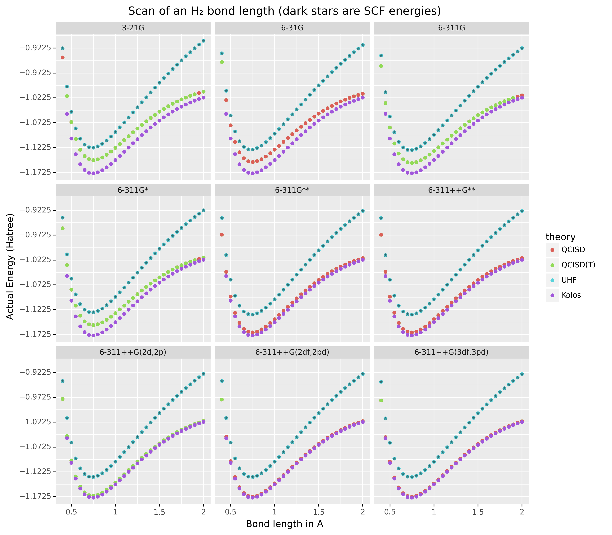

:author: Rohit Goswami
:email: rog32@hi.is
:institution: Science Institute, University of Iceland
:institution: Quansight Austin, TX, USA
:bibliography: SciPyCon2022
:orcid: 0000-0002-2393-8056
:corresponding:

----------------------------------------------------------
Wailord: Parsers and Reproducibility for Quantum Chemistry
----------------------------------------------------------

.. class:: abstract

   Data driven advances dominate the applied sciences landscape, with quantum chemistry being no exception to the rule. Dataset biases and human error are key bottlenecks in the development of reproducible and generalized insights. At a computational level, we demonstrate how changing the granularity of the abstractions employed in data generation from simulations can aid in reproducible work. In particular, we introduce ``wailord`` (https://wailord.xyz), a free-and-open-source python library to shorten the gap between data-analysis and computational chemistry, with a focus on the ORCA suite binaries. A two level hierarchy and exhaustive unit-testing ensure the ability to reproducibly describe and analyze "computational experiments". ``wailord`` offers both input generation, with enhanced analysis, and raw output analysis, for traditionally executed ORCA runs. The design focuses on treating output and input generation in terms of a mini domain specific language instead of more imperative approaches, and we demonstrate how this abstraction facilitates chemical insights.

.. class:: keywords

   quantum chemistry, parsers, reproducible reports, computational inference

Introduction
------------

The use of computational methods for chemistry is ubiquitous and few modern
chemists retain the initial skepticism of the field
:cite:`kohnNobelLectureElectronic1999,schaeferMethyleneParadigmComputational1986`.
Machine learning has been further earmarked
:cite:`meyerMachineLearningComputational2019,dralQuantumChemistryAge2020,schuttUnifyingMachineLearning2019`
as an effective accelerator for computational chemistry at every level, from DFT
:cite:`gaoMachineLearningCorrection2016` to alchemical searches
:cite:`deComparingMoleculesSolids2016` and saddle point searches
:cite:`asgeirssonExploringPotentialEnergy2018`. However, these methods trade
technical rigor for vast amounts of data, and so the ability to reproduce
results becomes increasingly more important. Independently, the ability to
reproduce results
:cite:`pengReproducibleResearchComputational2011,sandveTenSimpleRules2013` in
all fields of computational research, and has spawned a veritable flock of
methodological and programmatic advances :cite:`communityTuringWayHandbook2019`,
including the sophisticated provenance tracking of AiiDA
:cite:`pizziAiiDAAutomatedInteractive2016,huberAiiDAScalableComputational2020`.

Dataset bias
------------

:cite:`engstromIdentifyingStatisticalBias2020,blumRecoveringBiasedData2019,rahamanSpectralBiasNeural2019`
has gained prominence in the machine learning literature, but has not yet
percolated through to the chemical sciences community. At its core, the argument
for dataset biases in generic machine learning problems of image and text
classification, can be linked to the difficulty in obtaining labeled results for
training purposes. This is not an issue in the computational physical sciences
at all, as the training data can often be labeled without human intervention.
This is especially true when simulations are carried out at varying levels of
accuracy. However, this also leads to a heavy reliance on high accuracy
calculations on "benchmark" datasets and results
:cite:`hojaQM7XComprehensiveDataset2021,seniorProteinStructurePrediction2019`.

Compute is expensive, and the reproduction of data which is openly available is
often hard to justify as a valid scientific endeavor. Rather than focus on the
observable outputs of calculations, instead we assert that it is best to be able
to have reproducible confidence in the elements of the workflow. In the
following sections, we will outline ``wailord``, a library which implements a
two level structure for interacting with ORCA :cite:`neeseORCAProgramSystem2012`
to implement an end-to-end workflow to analyze and prepare datasets. Our focus
on ORCA is due to its rapid and responsive development cycles, that it is free
to use (but not open source) and also because of its large repertoire of
computational chemistry calculations. Notably, the black-box nature of ORCA (in
that the source is not available) mirrors that of many other packages (which are
not free) like VASP :cite:`hafnerAbinitioSimulationsMaterials2008`. Using ORCA
then, allows us to design a workflow which is best suited for working with many
software suites in the community.

We shall understand this ``wailord`` from the lens of what is often
known as a design pattern in the practice of computational science and
engineering. That is, a template or description to solve commonly occurring
problems in the design of programs.

Structure and Implementation
----------------------------

Python has grown to become the lingua-franca for much of the scientific
community
:cite:`oliphantPythonScientificComputing2007,millmanPythonScientistsEngineers2011`,
in no small part because of its interactive nature. In particular, the REPL
(read-evaluate-print-loop) structure which has been prioritized (from IPython to
Jupyter) is one of the prime motivations for the use of Python as an exploratory
tool. Additionally, PyPI, the python package index, accelerates the widespread
disambiguation of software packages. Thus ``wailord`` is implemented as a free
and open source ``python`` library.

Structure
+++++++++

Data generation involves set of known configurations (say, ``xyz`` inputs) and a
series of common calculations whose outputs are required. Computational
chemistry packages tend to be focused on acceleration and setup details on a
*per-job* scale. ``wailord``, in contrast, considers the outputs of simulations
to form a tree, where the actual run and its inputs are the leaves, and each
layer of the tree structure holds information which is collated into a single
dataframe which is presented to the user.

Downstream tasks for simulations of chemical systems involve questions phrased
as queries or comparative measures. With that in mind, ``wailord`` generates
``pandas`` dataframes which are indistinguishable from standard machine learning
information sources, to trivialize the data-munging and preparation process. The
outputs of ``wailord`` represent concrete *information* and it is not meant to
store runs like the ASE database :cite:`larsenAtomicSimulationEnvironment2017` ,
nor run a process to manage discrete workflows like AiiDA
:cite:`huberAiiDAScalableComputational2020`.

By construction, it differs also from existing "interchange" formats as those
favored by the materials data repositories like the QCArchive project
:cite:`smithMolSSIQCArchiveProject2021` and is partially close in spirit to the
``cclib`` endeavor :cite:`oboyleCclibLibraryPackageindependent2008a`.

Implementation
++++++++++++++

Two classes form the backbone of the data-harvesting process. The intended point
of interface with a user is the ``orcaExp`` class which collects information
from multiple ORCA outputs and produces dataframes which include relevant
metadata (theory, basis, system, etc.) along with the requested results (energy
surfaces, energies, angles, geometries, frequencies, etc.). A lower level "orca
visitor" class is meant to parse each individual ORCA output. Until the release
of ORCA 5 which promises structured property files, the outputs are necessarily
parsed with regular expressions, but validated extensively. The focus on ORCA
has allowed for more exotic helper functions, like the calculation of rate
constants from ``orcaVis`` files. However, beyond this functionality offered by
the quantum chemistry software (ORCA), a computational chemistry workflow
requires data to be more malleable. To this end, the plain-text or binary
outputs of quantum chemistry software must be further worked on (post-processed)
to gain insights. This means for example, that the outputs may be entered into a
spreadsheet, or into a plain text note, or a lab notebook, but in practice,
programming languages are a good level of abstraction. Of the programming
languages, Python as a general purpose programming language with a high rate of
community adoption is a good starting place.

Python has a rich set of structures implemented in the standard library, which
have been liberally used for structuring outputs. Furthermore, there have been
efforts to convert the grammar of graphics :cite:`wilkinsonGrammarGraphics2005`
and tidy-data :cite:`wickhamWelcomeTidyverse2019` approaches to the ``pandas``
package which have also been adapted internally, including strict unit adherence
using the ``pint`` library. The user is not burdened by these implementation
details and is instead ensured a ``pandas`` data-frame for all operations, both
at the ``orcaVis`` level, and the ``orcaExp`` level.

Software industry practices have been followed throughout the development
process. In particular, the entire package is written in a
test-driven-development (TDD) fashion which has been proven many times over for
academia :cite:`desaiSurveyEvidenceTestdriven2008` and industry
:cite:`bhatEvaluatingEfficacyTestdriven2006`. In essence, each feature is
accompanied by a test-case. This is meant to ensure that once the end-user is
able to run the test-suite, they are guaranteed the features promised by the
software.  Additionally, this means that potential bugs can be submitted as a
test case which helps isolate errors for fixes. Furthermore, software testing
allows for coverage metrics, thereby enhancing user and development confidence
in different components of any large code-base.

User Interface
++++++++++++++

The core user interface is depicted in Fig. [[fig:uiwail]]. The test suites
cover standard usage and serve as ad-hoc tutorials. Additionally, ``jupyter``
notebooks are also able to effectively run ``wailord`` which facilitates its use
over SSH connections to high-performance-computing (HPC) clusters. The user is
able to describe the nature of calculations required in a simple YAML file
format. A command line interface can then be used to generate inputs, or another
YAML file may be passed to describe the paths needed. A very basic harness
script for submissions is also generated which can be rate limited to ensure
optimal runs on an HPC cluster.

.. figure:: overviewWailord.jpg

   Some implemented workflows including the two input YML files. VPT2 stands for second-order vibrational perturbation theory and ``Orca_vis`` objects are part of ``wailord``'s class structure. PES stands for potential energy surface.
   :label:`uiwail`

Design and Usage
----------------

A simulation study can be broken into:

- Inputs
  + Configuration for runs
  + Data for structures
- Outputs per run
- Post-processing and aggregation

From a software design perspective, it is important to recognize the right level
of abstraction for the given problem. An object-oriented pattern is seen to be
the correct design paradigm. However, though combining test driven development
and object oriented design is robust and extensible, the design of ``wailord``
is meant to tackle the problem at the level of a domain specific language.
Recall from formal language theory :cite:`ahoCompilersPrinciplesTechniques2007`
the fact that a grammar is essentially meant to specify the entire possible set
of inputs and outputs for a given language. A grammar can be expressed as a
series of tokens (terminal symbols) and non-terminal (syntactic variables)
symbols along with rules defining valid combinations of these.

It may appear that there is little but splitting hairs between parsing data line
by line as is traditionally done in libraries, compared to defining the exact
structural relations between allowed symbols. However, this design, apart from
disallowing invalid inputs, also makes sense from a pedagogical perspective.

For example, of the inputs, structured data like configurations (XYZ formats)
are best handled by concrete grammars, where each rule is followed in order:

.. code-block:: python

    grammar_xyz = Grammar(
        r"""
        meta = natoms ws coord_block ws?
        natoms = number
        coord_block = (aline ws)+
        aline = (atype ws cline)
        atype = ~"[a-zA-Z]" / ~"[0-9]"
        cline = (float ws float ws float)
        float = pm number "." number
        pm              = ~"[+-]?"
        number          = ~"\\d+"
        ws              = ~"\\s*"
        """
    )

This definition maps neatly into the exact specification of an ``xyz`` file:

.. code-block:: tcl

    2

    H   -2.8   2.8   0.1
    H   -3.2   3.4   0.2

Where we recognize that the overarching structure is of the number of atoms,
followed by multiple coordinate blocks followed by optional whitespace. We move
on to define each coordinate block as a line of one or many ``aline``
constructs, each of which is an ``atype`` with whitespace and three float values
representing coordinates. Finally we define the positive, negative, numeric and
whitespace symbols to round out the grammar. This is the exact form of every
valid ``xyz`` file. The ``parsimonious`` library allows handling grammatical
constructs in a Pythonic manner.

However, the generation of inputs is facilitated through the use of generalized
templates for "experiments" controlled by ``cookiecutter``. This allows for
validations on the workflow during setup itself.

For the purposes of the simulation study, one "experiment" consists of multiple
single-shot runs; each of which can take a long time.

Concretely, the top-level "experiment" is controlled by a YAML file:

.. code-block:: yaml

    project_slug: methylene
    project_name: singlet_triplet_methylene
    outdir: "./lab6"
    desc: An experiment to calculate singlet and triplet
    states differences at a QCISD(T) level
    author: Rohit
    year: "2020"
    license: MIT
    orca_root: "/home/orca/"
    orca_yml: "orcaST_meth.yml"
    inp_xyz: "ch2_631ppg88_trip.xyz"

Where each run is then controlled individually.

.. code-block:: yaml

    qc:
      active: True
      style: ["UHF", "QCISD", "QCISD(T)"]
      calculations: ["OPT"]
      basis_sets:
        - 6-311++G**
    xyz: "inp.xyz"
    spin:
      - "0 1" # Singlet
      - "0 3" # Triplet
    extra: "!NUMGRAD"
    viz:
      molden: True
      chemcraft: True
    jobscript: "basejob.sh"

Usage is then facilitated by a high-level call.

.. code-block:: python

    waex.cookies.gen_base(
    template="basicExperiment",
    absolute=False,
    filen="./lab6/expCookieST_meth.yml",
    )

The resulting directory tree can be sent to a High Performance Computing Cluster
(HPC), and once executed via the generated run-script helper; locally analysis
can proceed.

.. code-block:: python

    mdat = waio.orca.genEBASet(Path("buildOuts") / \
    "methylene",
    deci=4)
    print(mdat.to_latex(index=False,
    caption="CH2 energies and angles \
    at various levels of theory, with NUMGRAD"))

In certain situations, ordering may be relevant as well (e.g. for generating
curves of varying density functional theoretic complexity). This can be handled
as well.

For the outputs, similar to the key ideas across ``signac``, ``nix``, ``spack``
and other tools, control is largely taken away from the user in terms of the
auto-generated directory structure. The outputs of each run is largely collected
through regular expressions, due to the ever changing nature of the outputs of
closed source software.

Importantly, for a code which is meant to confer insights, the concept of units
is key. ``wailord`` with ``ORCA`` has first class support for units using
``pint``.

Dissociation of H2
++++++++++++++++++

As a concrete example, we demonstrate a popular pedagogical exercise, namely to
obtain the binding energy curves of the H2 molecule at varying basis sets and
for the Hartree Fock, along with the results of Kolos and Wolniewicz
:cite:`kolosImprovedTheoreticalGround1968`. We first recognize, that even for a
moderate 9 basis sets with 33 points, we expect around 1814 data points. Where
each basis set requires a separate run, this is easily expected to be tedious.

Naively, this would require modifying and generating ORCA input files.

.. code-block:: tcl

    !UHF 3-21G ENERGY

    %paras
    	R = 0.4, 2.0, 33 # x-axis of H1
    end

    *xyz 0 1
    H    0.00   0.0000000    0.0000000
    H    {R}    0.0000000    0.0000000
    *

We can formulate the requirement imperatively as:

.. code-block:: yaml

    qc:
      active: True
      style: ["UHF", "QCISD", "QCISD(T)"]
      calculations: ["ENERGY"] # Same as single point or SP
      basis_sets:
        - 3-21G
        - 6-31G
        - 6-311G
        - 6-311G*
        - 6-311G**
        - 6-311++G**
        - 6-311++G(2d,2p)
        - 6-311++G(2df,2pd)
        - 6-311++G(3df,3pd)
    xyz: "inp.xyz"
    spin:
      - "0 1"
    params:
      - name: R
        range: [0.4, 2.00]
        points: 33
        slot:
          xyz: True
          atype: "H"
          anum: 1 # Start from 0
          axis: "x"
    extra: Null
    jobscript: "basejob.sh"

This run configuration is coupled with an experiment setup file, similar to the
one in the previous section. With this in place, generating a data-set of all
the required data is fairly trivial.

.. code-block:: python

    kolos = pd.read_csv(
        "../kolos_H2.ene",
        skiprows=4,
        header=None,
        names=["bond_length", "Actual Energy"],
        sep=" ",
    )
    kolos['theory']="Kolos"

    expt = waio.orca.orcaExp(expfolder=Path("buildOuts") / "h2")
    h2dat = expt.get_energy_surface()

Finally, the resulting data can be plotted using tidy principles.

.. code-block:: python

    imgname = "images/plotH2A.png"
    p1a = (
        p9.ggplot(
            data=h2dat, mapping=p9.aes(x="bond_length",
            y="Actual Energy",
            color="theory")
        )
        + p9.geom_point()
        + p9.geom_point(mapping=p9.aes(x="bond_length",
          y="SCF Energy"),
          color="black", alpha=0.1,
          shape='*', show_legend=True)
        + p9.geom_point(mapping=p9.aes(x="bond_length",
          y="Actual Energy",
          color="theory"),
          data=kolos,
          show_legend=True)
        + p9.scales.scale_y_continuous(breaks
          = np.arange( h2dat["Actual Energy"].min(),
          h2dat["Actual Energy"].max(), 0.05) )
        + p9.ggtitle("Scan of an H2 \
          bond length (dark stars are SCF energies)")
        + p9.labels.xlab("Bond length in Angstrom")
        + p9.labels.ylab("Actual Energy (Hatree)")
        + p9.facet_wrap("basis")
    )
    p1a.save(imgname, width=10, height=10, dpi=300)

Which gives rise to the concise representation Fig. :ref:`ph2a` from which all
required inference can be drawn.

   Plots generated from tidy principles for post-processing ``wailord`` parsed outputs.
   :label:`ph2a`

In this particular case, it is possible to see the deviations from the
experimental results at varying levels of theory for different basis sets.

Conclusions
-----------

We have discussed ``wailord`` in the context of generating, in a reproducible
manner the structured inputs and output datasets which facilitate chemical
insight. The formulation of bespoke datasets tailored to the study of specific
properties across a wide range of materials at varying levels of theory has been
shown. The test-driven-development approach is a robust methodology for
interacting with  closed source software. The design patterns expressed, of
which the ``wailord`` library is a concrete implementation, is expected to be
augmented with more workflows, in particular, with a focus on nudged elastic
band. The methodology here has been applied to ORCA, however, the two level
structure has generalizations to most quantum chemistry codes as well.

Importantly, we note that the ideas expressed form a design pattern for
interacting with a plethora of computational tools in a reproducible manner. By
defining appropriate scopes for our structured parsers, generating deterministic
directory trees, along with a judicious use of regular expressions for output data
harvesting, we are able to leverage tidy-data principles to analyze the results
of a large number of single-shot runs.

Taken together, this tool-set and methodology can be used to generate elegant
reports combining code and concepts together in a seamless whole. Beyond this,
the interpretation of each computational experiment in terms of a concrete
domain specific language is expected to reduce the requirement of having to
re-run benchmark calculations.

Acknowledgments
----------------

R Goswami thanks H. Jónsson and V. Ásgeirsson for discussions on the design of
computational experiments for inference in computation chemistry. This work was
partially supported by the Icelandic Research Fund, grant number 217436052.

..
   References
   ----------
   .. [Atr03] P. Atreides. *How to catch a sandworm*,
              Transactions on Terraforming, 21(3):261-300, August 2003.
