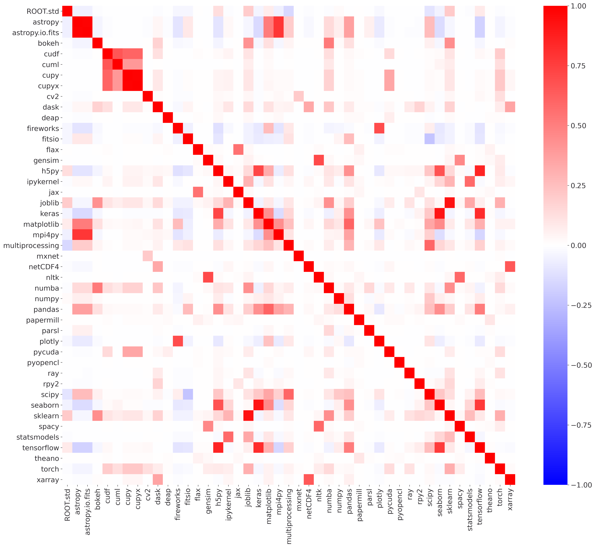
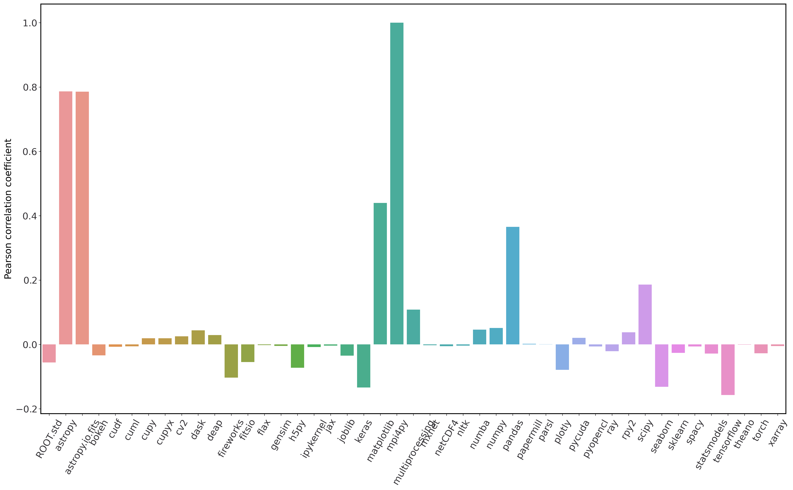
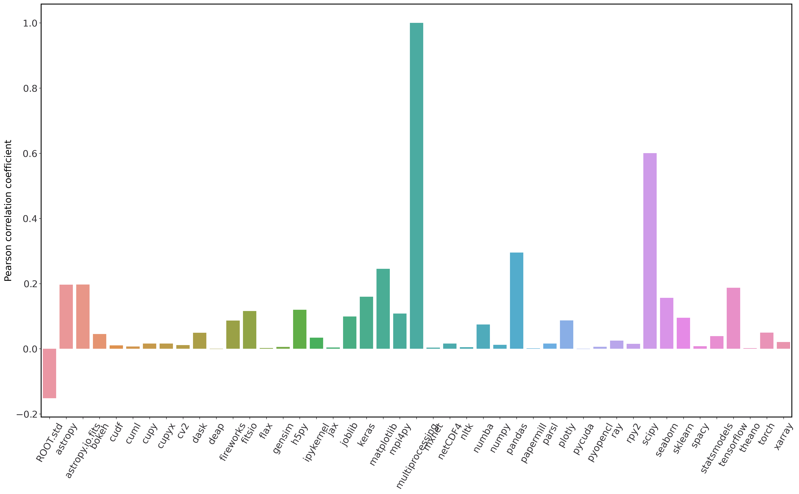
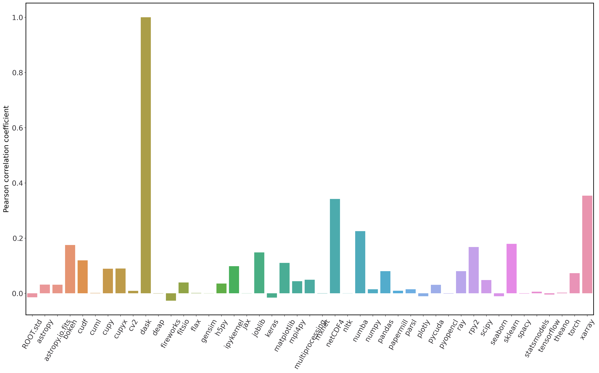

:author: Rollin Thomas
:email: rcthomas@lbl.gov
:institution: National Energy Research Scientific Computing Center,
              Lawrence Berkeley National Laboratory,
              1 Cyclotron Road MS59-4010A,
              Berkeley, California, 94720
:orcid: 0000-0002-2834-4257
:corresponding:

:author: Laurie Stephey
:email: lastephey@lbl.gov
:institution: National Energy Research Scientific Computing Center,
              Lawrence Berkeley National Laboratory,
              1 Cyclotron Road MS59-4010A,
              Berkeley, California, 94720
:orcid: 0000-0003-3868-6178

:author: Annette Greiner
:email: amgreiner@lbl.gov
:institution: National Energy Research Scientific Computing Center,
              Lawrence Berkeley National Laboratory,
              1 Cyclotron Road MS59-4010A,
              Berkeley, California, 94720
:orcid: 0000-0001-6465-7456

:author: Brandon Cook
:email: bgcook@lbl.gov
:institution: National Energy Research Scientific Computing Center,
              Lawrence Berkeley National Laboratory,
              1 Cyclotron Road MS59-4010A,
              Berkeley, California, 94720
:orcid: 0000-0002-4203-4079

:video: http://www.youtube.com/watch?v=dhRUe-gz690

=====================================================
Monitoring Scientific Python Usage on a Supercomputer
=====================================================

.. class:: abstract

   In 2020, more than 35% of users at the National Energy Research Scientific
   Computing Center (NERSC) used Python on the Cori supercomputer. To determine
   this we have developed a simple, minimally invasive monitoring framework that
   leverages standard Python features to capture Python imports and other job data
   via a package called ``customs`` **FIXME add public link to customs.** The data we
   collect via customs are analyzed with Dask-cuDF in a Jupyter notebook, and
   results are summarized in a Voila dashboard. We display these dashboards via
   our Spin container-as-aservice platform **FIXME add public link to dashboards**
   This new method of analyzing our data has led to insights including: our top 3
   most popular libraries are NumPy, multiprocessing, and Matplotlib, our mean
   jobsize is 2.4 nodes, information about the relationship between library and
   jobsize, and information about which libraries are correlated and
   anticorrelated. We will employ this framework to better understand Python user
   behavior on our current and future NERSC systems.

.. class:: keywords

   HPC, Python monitoring, GPUs, dashboards, parallel

Introduction
============

..
   Why is the work important?

The National Energy Research Scientific Computing Center [NERSC]_ is the primary
scientific computing facility for the US Department of Energy's Office of
Science.
Some 8,000 scientists use NERSC to perform basic, non-classified research in
predicting novel materials, modeling the Earth's climate, understanding the
evolution of the Universe, analyzing experimental particle physics data,
investigating protein structure, and much more.
NERSC procures and operates supercomputers and massive storage systems under a
strategy of balanced, timely introduction of new hardware and software
technologies to benefit the broadest possible subset of this workload.
Since any research project aligned with the mission of the Office of Science may
apply for access, NERSC's workload is diverse and demanding.
While procuring new systems or supporting users of existing ones, NERSC relies
on detailed analysis of its workload to help inform its strategy.

*Workload analysis* is the process of collecting and marshaling data to build a
picture of how applications and users really interact with and utilize systems.
It is one part of a procurement strategy that also includes surveys of user and
application requirements, emerging computer science research, developer or
vendor roadmaps, and technology trends.
Understanding our workload helps us engage in an informed way with stakeholders
like funding agencies, vendors, developers, users, standards bodies, and other
high-performance computing (HPC) centers.
Actively monitoring the workload enables us to identify suboptimal or
potentially problematic user practices and address them through direct
intervention, improving documentation, or simply making it easier for users to
use software better.
Measuring the relative frequency of use of different software components can
help us streamline delivery, retiring less-utilized packages and promoting
timely migration to newer versions.
Understanding which software packages are most useful to our users helps us
focus support, collaborate with key software developers and vendors, or at least
advocate on our users' behalf to the right people.
Detecting and analyzing trends in user behavior with software over time also
helps us anticipate user needs and respond to those needs proactively.
Comprehensive, quantitative workload analysis is a critical tool in keeping
NERSC a productive supercomputer center for science.

With Python assuming a key role in scientific computing, it makes sense to apply
workload analysis to Python in production settings like NERSC's Cray XC-40
supercomputer, Cori.
Once viewed in HPC circles as merely a cleaner alternative to Perl or Shell
scripting, Python has evolved into a robust platform for orchestrating
simulations, running complex data processing pipelines, managing artificial
intelligence workflows, visualizing massive data sets, and more.
Adapting workload analysis practices to scientific Python gives its community
the same data-driven leverage that other language communities in HPC already
enjoy.

..
   I think if we haven't published MODS in a paper, we could find a public OAR
   release that describes MODS and reference that?

This article documents NERSC's Python workload analysis efforts, part of an
initative called Monitoring of Data Services (MODS), and what we have learned
from the experience.
In the next section, we provide an overview of related work including existing
tools for workload data collection, management, and analysis.
In Methods, we describe an approach to Python-centric workload analysis that
uses built-in Python features to capture usage data, and a Jupyter notebook
based workflow for exploring the data set and communicating what we discover.
Our Results include high-level statements about what Python packages are used
most often and at what scale on Cori, but also some interesting deeper dives
into use of certain specific packages along with a few surprises.
In the Discussion, we follow up on the results from the previous section, share
the pluses and minuses of our workflow, the lessons we learned in setting it up,
and outline plans for expanding the analysis to better fill out the picture of
Python at NERSC.
The Conclusion suggests areas for future work and includes an invitation to
developers to contact us about having their work added to the list of scientific
Python packages we monitor at NERSC.

Related Work
============

..
   What is the context for the work?

The simplest approach used to get a sense of what applications run on a
supercomputer is to scan submitted batch job scripts for executable names.
In the case of Python applications, this is problematic since users often
invoke Python scripts directly instead of as an argument to the ``python``
executable.
This method also provides only a crude count of Python invocations and gives
little insight into deeper questions about specific Python packages, libraries,
or frameworks in use.

Software environment modules [Fur91]_ are a common way for HPC centers to
deliver software to users.
Environment modules operate primarily by setting, modifying, or deleting
environment variables upon invocation of a module command (e.g. ``module
load``, ``module swap``, or ``module unload``)
This provides an entrypoint for software usage monitoring.
Staff can inject code into a module load operation to record the name of the
module being loaded, its version, and other information about the user's
environment.
Lmod, a newer implementation of environment modules [Mcl11]_, provides
documentation on how to configure it to use syslog and MySQL to collect module
loads through a hook function [lmod]_.
Counting module loads as a way to track Python usage has the virtue of
simplicity.
However, users often include module load commands in their shell resource files
(e.g., `.bashrc`), meaning that shell invocation or mere user login may trigger
a detection even if the user never actually uses it.
Capturing information at the package, library, or framework level using module
load counts would also require that individual Python packages be installed as
separate environment modules.
Module load counts also miss Python usage that happens without loading modules,
in particular user-installed Python environments or in containers.

Tools like ALTD [Fah10]_ and XALT [Agr14]_ are commonly used in HPC contexts to
track library usage in compiled applications.
The approach is to introduce wrappers that intercept the linker and batch job
launcher (e.g. ``srun`` in the case of Slurm used at NERSC).
The linker wrapper can inject metadata into the executable header, take a census
of libraries being linked in, and forward that information to a file or database
for subsequent analysis.
Information stored in the header at link time is dumped and forwarded later by
the job launch wrapper.
On systems where all user applications are linked and launched with instrumented
wrappers, this approach yields a great deal of actionable information to HPC
center staff.
However, popular Python distributions such as Anaconda Python arrive on systems
fully built, and often are installed by users without assistance from center
staff.
Later versions of XALT can address this through an ``LD_PRELOAD`` environment
variable setting.
This enables XALT to identify compiled extensions that are imported in Python
programs using a non-instrumented Python, but pure Python libraries currently
are not detected.
XALT is an active project so this may be addressed in a future release.

[Mac17]_ describes an approach to monitoring Python package use on Blue Waters
using only built-in Python features: ``sitecustomize`` and ``atexit``.
During normal Python interpreter start-up, an attempt is made to import a module
named ``sitecustomize`` that is intended to perform site-specific
customizations.  In this case, the injected code registers an exit handler
through the ``atexit`` standard library module.
This exit handler inspects ``sys.modules``, a dictionary that normally describes
all packages imported in the course of execution.
On Blue Waters, ``sitecustomize`` was installed into the Python distribution
installed and maintained by staff.
Collected information was stored to plain text log files.
An advantage of this approach is that ``sitecustomize`` failures are nonfatal,
and placing the import reporting step into an exit hook (as opposed to
instrumenting the import mechanism) means that it minimizes interference with
normal operation of the host application.
The major limitation of this strategy is that abnormal process terminations
prevent the Python interpreter from proceeding through its normal exit sequence
and package import data are not recorded.

Short of introspecting processes at a very deep level, gaining insight into
Python usage involves a few minimally invasive and easy to customize tools.
Obviously, solutions that can overly impact application reliability or place an
undue burden on system administrators and operations staff should be avoided.
The fullest picture we can obtain will come from a combination of tooling and
follow-up with users, using the story we can put together from the data we
gather as a starting point for conversation.

..
   There are probably tools that do deep data collection on processes running
   that we could mention.  If we do we should explain that getting those
   installed and getting access to those data require 

Methods
=======

..
   How was the work done?

Users have a number of options when it comes to how they use Python at NERSC.
NERSC provides a "default" Python to its users through a software environment
module, based on the Anaconda Python distribution with modifications.
Users may load this module, initialize the Conda tool, and create their own
custom Conda environments.
Projects or collaborations may provide their users with shared Python
environments, often as a Conda environment or as an independent installation
altogether (e.g. using the Miniconda installer and building up).
Cray provides a basic "Cray Python" module containing a few core scientific
Python packages linked against Cray MPICH and LibSci libraries.
Python packages are also installed by staff or users via Spack **REF**, an HPC
package manager.
NERSC also provides Shifter **REF**, a container runtime that enables users to
run custom Docker containers that can contain Python built however the author
desires.
With a properly defined kernel-spec file, a user is able to use a Python
environment based on any of the above options as a kernel in NERSC's Jupyter
service.
We need to be able to gather data for workload analysis across all of these
options, in part to understand the relative importance of each.

.. figure:: mods-save-data.png

   Infrastructure for capturing Python package usage data at NERSC.
   :label:`save-data`

Monitoring all of the above can be done quite easily by using the strategy
outlined in [Mac17]_ with certain changes.
Figure :ref:`save-data` illustrates the infrastructure we have configured.
As in [Mac17]_ a ``sitecustomize`` that registers the ``atexit`` handler is
installed in a directory included into all users' Python ``sys.path``.
The file system where ``sitecustomize`` is installed should be local to the
compute nodes that it runs on and not served over network, in order to avoid
exacerbating poor performance of Python start-up at scale.
We accomplish this by installing it and any associated Python modules into the
compute node system images themselves, and configuring default user environments
to include a ``PYTHONPATH`` setting that injects ``sitecustomize`` into
``sys.path``.
Shifter containers include the monitoring packages from the system image via
volume mount set at runtime.
Users can opt out of monitoring simply by unsetting or overwriting
``PYTHONPATH``.
We took the approach of provisioning a system-wide ``PYTHONPATH`` because it is
much more tenable to give users the ability to opt out of data collection by
unsetting it than it is to ask them to install ``sitecustomize`` voluntarily.
This also gives us a centrally managed source of truth for what is monitored at
any given time.

Customs: Inspect and Report Packages
------------------------------------

To organize ``sitecustomize`` logic we have created a Python package we call
"Customs," since it is for inspecting and reporting on Python package imports of
particular interest.
Customs can be understood in terms of three simple concepts.
A **Check** is a simple object that represents a Python package by its name and
a callable that is used to verify that the package is present in a given
dictionary.
In production this dictionary should be ``sys.modules`` but during testing it
can be mock ``sys.modules`` dictionary.
The **Inspector** is a container of Check objects, and is responsible for
applying each Check to ``sys.modules`` (or mock) and returning the names of
packages that are detected.
Finally, the **Reporter** is an abstract class that takes some action given a
list of detected package names.
The Reporter action should be to record or transmit the list of detected
packages, but exactly how this is done depends on implementation.
Customs includes a few reference Reporter implementations and an example of a
custom Customs Reporter.

Customs provides an entry point to use in ``sitecustomize``, the function
``register_exit_hook``.
This function takes two arguments.
The first argument is a list of strings or (string, callable) tuples that are
converted into Checks.
The second argument is the type of Reporter to be used.
The exit hook can be registered multiple times with different package
specification lists or Reporters if desired.

The intended workflow is that a staff member creates a list of package
specifications they want to check for, selects or implements an appropriate
Reporter, and passes these two objects to ``register_exit_hook`` within
``sitecustomize.py``.
Installing ``sitecustomize`` to system images generally involves packaging the
software as an RPM to be installed into node system images and deployed by
system administrators.
When a user invokes Python, the exit hook will be registered using the
``atexit`` standard library module, the application proceeds as normal, and then
at normal shutdown ``sys.modules`` is inspected and detected packages of
interest are reported.

Message Logging and Storage
---------------------------

NERSC has developed a lightweight abstraction layer for message logging called
nerscjson.
It is a simple Python package that consumes JSON messages and forwards them to
an appropriate transport laer that connects to NERSC's central
Elasticsearch-based telemetry collection framework, OMNI **REF**.
Currently this is achieved by using the ``SysLogHandler`` from Python's standard
logging library with a minor modification to the time format to satisfy RFC 3339
**REF**.
Downstream from these transport layers, a message key is used to identify the
incoming messages, their JSON payloads are extracted, and then forwarded to the
appropriate Elastic index.
The Customs Reporter used on Cori simply uses nerscjson.

On Cori compute nodes, we use the Cray Lightweight Log Manager (LLM) **REF**,
configured to accept RFC 5424 **REF** protocol messages on service nodes.
A random service node is chosen as the recipient in order to balance load.
On other nodes besides compute nodes, such as login nodes or nodes running
user-facing services, rsyslog is used for message transport.
This abstraction layer allows us to maintain a stable interface for logging
while using an appropraitely scalable transport layer for the system.
For instance, future systems will rely on Apache Kafka or the Lightweight
Distributed Metrics Service [Age14]_.

Cori has 10,000 compute nodes running jobs at very high utilization, 24 hours
day for more than 340 days in a typical year.
The volume of messages arriving from Python processes completing could be quite
high, so we have taken a cautious approach of monitoring only a sizeable list of
key scientific Python packages instead of reporting the entire contents of each
process's ``sys.modules``.
This introduces a potential source of bias that we return to in the Discussion,
but we note here that Python 3.10 will include ``sys.stdlib_module_names``, a
frozenset of strings containing the names of standard library modules, that
could be used in addition to ``sys.builtin_module_names`` to remove standard
library and built-in modules from ``sys.modules`` easily.
Ultimately we plan to capture all imports excluding standard and built-in
packages, except for ones we consider particularly relevant to scientific
Python workflows like ``multiprocessing``.

To reduce excessive duplication of messages from MPI-parallel Python
applications, we prevent reporting from processes with nonzero MPI rank or
``SLURM_PROCID``.
Other multi-process parallel applications using ``multiprocess`` for instance
are harder to deduplicate.
This moves deduplication downstream to the analysis phase.
The key is to carry along enough additional information to enable the kinds of
deduplication needed (e.g., by user, by job, by node, etc).
Table :ref:`metadata` contains a partial list of metadata captured and forwarded
along with package names and versions.

.. table:: Additional monitoring metadata :label:`metadata`

   +----------------+--------------------------------------------------+
   | Field          | Description                                      |
   +================+==================================================+
   | ``executable`` | Path to Python executable used by this process   |
   +----------------+--------------------------------------------------+
   | ``is_compute`` | True if the process ran on a compute node        |
   +----------------+--------------------------------------------------+
   | ``is_shifter`` | True if the process ran in a Shifter container   |
   +----------------+--------------------------------------------------+
   | ``is_staff``   | True if the user is a member of NERSC staff      |
   +----------------+--------------------------------------------------+
   | ``job_id``     | Slurm job ID                                     |
   +----------------+--------------------------------------------------+
   | ``main``       | Path to application, if any                      |
   +----------------+--------------------------------------------------+
   | ``num_nodes``  | Number of nodes in the job                       |
   +----------------+--------------------------------------------------+
   | ``qos``        | Batch queue of the job                           |
   +----------------+--------------------------------------------------+
   | ``repo``       | Batch job charge account                         |
   +----------------+--------------------------------------------------+
   | ``subsystem``  | System partition or cluster                      |
   +----------------+--------------------------------------------------+
   | ``system``     | System name                                      |
   +----------------+--------------------------------------------------+
   | ``username``   | User handle                                      |
   +----------------+--------------------------------------------------+

Fields that only make sense in a batch job context are set to a default
(``num_nodes: 1``) or left empty (``repo: ""``).
Much of the job information is discoverable from separate databases specifically
for Slurm, identity, and banking.
Basic job quantities like node count help capture the most salient features of
jobs being monitored; a downstream join with those external databases is
required for more details.
Much of the information needed is also stored and accessible in OMNI.

In principle it is possible that messages may be dropped along the way to OMNI.
**UDP**
To control for this source of error, we submit scheduled "canary jobs" a few
dozen times a day that run a Python script that imports libraries listed in
``sitecustomize`` and then exits normally.
Matching up those job submissions with entries in Elastic enables us to quantify
the message failure rate.
Canary jobs began running in October of 2020 and from that time until now (May
2021), perhaps surprisingly, we actually have observed no message delivery
failures.

Prototyping, Production, and Publication
----------------------------------------

OMNI includes Kibana, a visualization interface that NERSC staff can use to
visualize indexed Elasticsearch data collected from NERSC systems, including
data collected for MODS.
The MODS team uses Kibana for creating plots of usage data, organizing these
into attractive dashboard displays that communicate MODS high-level metrics.
Kibana is very effective at providing a general picture of user behavior with
the NERSC data stack, but the MODS team wanted deeper insights from the data and
obtaining these through Kibana presented some difficulty.
Given that the MODS team is fluent in Python, and that NERSC provides users
(including staff) with a productive Python ecosystem for data analytics, using
Python tools for understanding the data was a natural choice.

Our first requirement was the ability to explore MODS Python data interactively
to prototype new analyses, but we wanted to be able to record that process,
document it, share it, and enable others to re-run or re-create the results.
Jupyter Notebooks specifically target this problem, and NERSC already runs a
user-facing JupyterHub service that enables access to Cori.
Members of the MODS team manage notebooks in a Gitlab instance managed by NERSC,
but can also share them with one another (and from Gitlab) using an NBViewer
service running alongside NERSC's JupyterHub.

Iterative prototyping of big data analysis pipelines often starts with testing
hypotheses or algorithms against a small subset of the data and then scaling
that analysis up to the entire data set. Using Python we can interact with a
subset of data with richer and more powerful way than through database queries.
This initial, interactive protyping should then be able to scale to process all
of our data efficiently on NERSC's HPC hardware.

Finally, we want to be able to share the results of our analysis using
Python-backed dashboards. For this we use Voila to run the dashboard notebooks
we have created using our container-as-a-service system Spin. To achieve this
vision we have developed the following workflow which we will now describe in
more detail.

Jupyter data analysis
---------------------

**FIXME** Describe Jupyter analysis, everything below is mostly Python-specific

To avoid version
compatibility problems within the Python stack used for the analysis we use
Docker containers.  At runtime the Docker containers are run using Shifter (our
in-house HPC container solution), and in Spin they are just Docker containers
managed by Rancher 2, orchestrated with Kubernetes.  For our Jupyter analysis,
Wwe use cell notebook metadata to execute the Spin-appropriate cells and not
the Cori-appropriate ones in Spin. (We use two separate sets of notebooks for
Python analysis since our data analysis and plotting require incompatible 
kernels.)

Python data analysis
--------------------

The first step of the Python analysis workflow is to pull the data out of the
Elasticsearch database where it is stored. We do this using the Python
Elasticsearch client API [elast]_. Since each day’s worth of data can take
several minutes to pull, convert, and save, we run this process nightly as a
cronjob to pull the previous day’s data. A typical day’s worth of data is about
10 MB, once saved in compressed Parquet format. The total amount of data we
have collected since August 2020 is approximately 7 GB, so this is likely not
in the realm of “big data” as far as most are concerned. However the dataset is
large and complex enough that analysis with CPU-based methods is cumbersome. We
have therefore opted to use GPU-based methods for filtering, analyzing, and
distilling the data into something reasonably quick to plot in our dashboards.

We have written a flexible Jupyter notebook that can process data in a monthly,
quarterly, or yearly fashion. It will decide which of these to perform based on
the input from a Papermill parameter cell. To perform this
analysis, we use ``Dask-cuDF`` and ``cuDF`` [dcdf]_ throughout the analysis, keeping
the whole workflow on the GPU. We typically use 4 Nvidia Volta V100 GPUs
coordinated by a ``Dask-CUDA`` cluster [dcuda]_ which we spin up directly in the
notebook. We load the Parquet data using Dask-cuDF directly into GPU memory and
perform various types of filtering and reduction operations. We ultimately save
the distilled output in new Parquet files, again using direct GPU I/O in
``Dask-cuDF`` or ``cuDF``.

Since our analysis is split in several dimensions-- monthly, quarterly, or
yearly-- the workflow must be flexible enough to facilitate this. Our design
choice here was to use ``Papermill`` [pmill]_ to turn our single notebook into an
extensible workflow. Papermill recognizes and replaces Jupyter cells tagged as
parameters based on external input. (**TODO point to this script**) We can then
launch a batch job on our shared GPU system which will call our ``Papermill`` >
``Jupyter`` > ``Dask-CUDA`` > ``Dask-cuDF``. Each ``Papermill`` instance will run a single
Jupyter notebook for one piece of our analysis. In each Jupyter notebook, a
Dask CUDA cluster is spun up and then shutdown at the end for memory/worker
cleanup.  Every notebook writes a set of output files to be used in our
dashboards. Processing all data for all permutations of time currently takes
about 1.5 hours on 4 V100 GPUs on the NERSC Cori cgpu system. We
summarize this workflow in Fig. :ref:`analyze-data`.

.. figure:: mods-analyze-data.png

   This diagram summarizes the workflow for processing and analyzing Python
   data at NERSC. :label:`analyze-data`

In this work our design choice is to use ``Voila`` [voila]_ to turn our Jupyter
notebooks into dashboards. Generating usable interactive dashboards has been a
challenge however for several reasons. The first obstacle is the data loading
time. Our design choice has been to preload all possible data the dashboard
may display while it starts. The tradeoff here is a long load time but a faster
interactive response time once it has loaded (~30 s). Another significant
problem is quickly generating plots. This may sound surprising given that we
already spent a good deal of time preprocessing and distilling our data on
GPUs. However, we still found that plotting operations, especially those
performing operations like histogram binning, with ``Pandas`` DataFrames was
unsatisfyingly slow for our vision of a responsive dashboard. Our choice here
was to use the ``Vaex`` library instead [vaex]_ which provides similar
functionality to Pandas but is significantly more performant as a result of
multithreaded CPU parallelism. We did use some of ``Vaex``’s native plotting
functionality (notably ``Vaex``’s ``viz.histogram`` functionality) which is wrappable
in the standard ``Matploptlib`` plotting format. However we primarily used the
``Seaborn`` library for plotting with Vaex objects underneath which we found to be
a fast and friendly way to generate visually appealing plots. We also used some
traditional ``Matplotlib`` plotting functionality when ``Seaborn`` could not provide
what we wanted. We summarize this workflow in Fig. :ref:`mods-dashboard`.

.. figure:: mods-dashboard.png

   This diagram summarizes the setup we use to provide our web-based,
   interactive dashboards. :label:`mods-dashboard`

Together this approach provided a solution that satisfied our vision of a
Python- and Jupyter-based, powerful, self-documenting and sharable, interactive
dashboard solution. This richer analysis has provided us new insights into our
data.

Results
=======

We will now summarize some of the results and insights we have gained
from collecting and anayzing our data. There is a great deal more information
in our dataset that we have not yet analyzed and there is much future work
to be done. We should note that there are several important caveats to keep
in mind when understanding and drawing conclusions from our data. These
are outlined in our Discussion section.

Perhaps the first question someone may ask is what the top Python libraries
being used at NERSC are. Our top 20 libraries from Jan-May 2021, deduplicated by
user, are displayed in Fig. :ref:`lib-barplot`.

.. figure:: library-barplot-2021.png

   The top 20 Python libraries at NERSC, deduplicated by user, in 2021. Note that
   we only have data for libraries we have explictly
   tracked. :label:`lib-barplot`

These top libraries, especially ``NumPy`` (ranked number 1) and ``SciPy`` (ranked
number 4) are generally in line with what other HPC centers like Blue
Waters and TACC have also reported [Mcl11]_ [Eva15]_. Nevertheless the ubiquitous use of
``multiprocessing`` (ranked number 2) surprised us, as did the heavy use of
visualization/plotting libraries (``Matplotlib`` ranked number 3). Conversely, we
might have expected that libraries like ``mpi4py`` (ranked number 12) or ``Dask``
(ranked number 13) would rank higher at an HPC center- both are outranked by
``Joblib`` (ranked number 8). ``ipykernel`` (ranked number 5), a proxy for Jupyter
usage, confirms Jupyter’s popularity at NERSC. GPU libraries like ``TensorFlow``
(ranked number 16) and ``PyTorch`` (ranked number 19) are relatively low-ranked at
the moment since we have only a modest 18 node GPU cluster with limited users,
but we expect with our coming GPU system Perlmutter that this will change.

.. figure:: jobsize-hist-2021.png

   A histogram of Python jobsize at NERSC in 2021. Note that these data
   are deduplicated by job_id and are NOT deduplicated by
   user. :label:`jobsize-hist`

Another key question at an HPC center is jobsize. We wanted to know if Python
users were in fact running large jobs on our systems. Examining the data shown
in Fig. :ref:`jobsize-hist`, deduplicated by job rather than by user, the
results show that most Python jobs are small. The mean jobsize in 2021 is 2.37
nodes. Note that any activity performed on a login node or shared Jupyter node
is not included in this analysis since we required that the MODS record have a
Slurm job_id. Note that in this analysis we deduplicate by job_id, so jobs with
many records are only counted once.

.. figure:: jobsize-lib-2021.png

   A 2D histogram of jobsize vs. Python library counts. Note that these data
   are deduplicated by (job_id, library) so each library is counted once per
   job. Note that these data are NOT deduplicated by user, so the overall
   library use here appears different than in Fig. :ref:`lib-barplot`.
   :label:`jobsize-lib`

What are users doing in these various sized jobs? To attempt to dig further, we
create a 2d histogram of Python library counts vs. jobsize, shown in Fig.
:ref:`jobsize-lib`. The adjacent top plot is the sum of jobsize on a linear
scale and the adjacent right plot is a histogram of library record counts. Note
that unlike the barplot in Fig. :ref:`jobsize-lib`, these results are not
deduplicated by user so library popularity has a different meaning in this
context. We do however deduplicate using the subset of (job_id, library), so
each library is only counted once per job. This plot demonstrates that far
fewer libraries appear at the largest scales, notably ``mpi4py`` and ``NumPy``.
We observe that ``Dask`` jobs are generally 500 nodes and fewer, so it appears
that ``Dask`` is not being used to scale as large as mpi4py presumably is.
Workflow managers ``FireWorks`` and ``Parsl`` scale to 1000 nodes. ``PyTorch``
appears at larger scales than ``TensorFlow`` and ``Keras``, which may speak to
its ease of scaling at NERSC. Most Python libraries we track do not appear
above 200 nodes. Are users able to satisfy their requirements with a single
node or small handful of nodes? Would users like to scale but they don’t have
the time or skills to write code at scale?  Anecdotally from interacting with
our users, we lean toward the latter.

   The Pearson correlation coefficients for tracked Python libraries
   within the same job. Note that even if libraries were imported multiple
   times per job, they were counted as either a 0 or 1. :label:`corr2d`

Another area we seek to understand is the relationship between Python
libraries. Since many libraries are often used within a single job_id, we can
study this relationship. We have used the cuDF corr function
to determine the Pearson correlation coefficients of each library with all
other libraries we are currently tracking per job. Note that in this
calculation, we have assigned libraries with a value of 1 or 0. (Some users
import the same library many times during the same job, but we throw away these
additional import counts if present.)  The resulting correlation coefficients
are displayed as a heatmap in Fig. :ref:`corr2d`.

Notable results are that some libraries are very strongly correlated (``CuPy`` and
``CuPyx``, ``Astropy`` and ``Astropy.fits.io``), which is not surprising. Perhaps more
surprising is that some libraries are anticorrelated. For example, the
``FireWorks`` workflow engine [Jai15]_ is anticorrelated with ``TensorFlow``; we
posit that this is because ``TensorFlow`` has its own distributed training
strategies like ``Horovod``. ``Seaborn`` is anticorrelated with ``Plotly``; we posit that
this is because these are very different approaches to Python plotting. In
contrast, ``Seaborn`` is correlated with ``Matplotlib``.

Finally, since NERSC is an HPC center, we are especially interested in
libraries that allow Python jobs to achieve parallelism. We have
selected ``mpi4py``, ``multiprocessing``, and ``Dask`` as case studies. We perform a deeper
dive into the data associated with these libraries in order to better
understand how users are using them.

``mpi4py`` is one of the main workhorse libraries of allowing Python code to
scale to many nodes. We can see from in-depth analysis in Fig
:ref:`jobsize-lib` that jobs which use `mpi4py` have run at the largest scales
(3000+ nodes).

   We plot a 1D slice of the 2D correlation heatmap shown in Fig. :ref:`corr2d`
   for the `mpi4py` library. :label:`mpi-corr`

Based on the library correlation coefficients shown in Fig. :ref:`mpi-corr`,
the use of mpi4py on our systems seems to be surprisingly domain-specific.
``mpi4py`` is most strongly correlated with ``Astropy`` and ``Astropy.io.fits`` which are
primarily used by users in the astronomy and cosmology community. Our
assumption was that Python users in many domains would use ``mpi4py`` to achieve
scaling and/or parallelism, but these data imply that is not necessarily true.
However, we simply may not be capturing the libraries used with ``mpi4py`` in other
domains due to our limited list. Other notable strong correlations include
``Matplotlib``, ``NumPy``, and ``SciPy``, which are more in line with historically more
popular HPC libraries. Notable anticorrelations include ``FireWorks``, ``Keras``, and
``TensorFlow``, frameworks that all include their own methods of distributing
work/scaling.

To try to gain more insight into ``mpi4py`` use, we used the ``nltk`` [nltk]_ library to determine
the paths most frequently used to launch ``mpi4py`` jobs. (We will not report or
share these paths as a matter of user privacy.) In these paths we could
identify user directories and contacted several of these users to ask them how
they are using ``mpi4py``. One user reported that they used ``mpi4py`` to distribute a
large-scale optimization problem: "My go-to approach is to broadcast data using
``mpi4py``, split up input hyperparameters/settings/etc. across ranks, have each
rank perform some number of computations, and then gather all the results
(which are almost always ``NumPy`` arrays) using ``mpi4py``."

   We plot a 1D slice of the 2D correlation heatmap shown in Fig. :ref:`corr2d`
   for the ``multiprocessing`` library. :label:`multi-corr`

``multiprocessing`` is one of our top two libraries at NERSC, even after filtering
out records generated by the ``conda`` tool. The correlation coefficients for
``multiprocessing`` are shown in Fig. :ref:`multi-corr`. We do know that some
libraries explicitly use the ``multiprocessing`` module, such as ``SciPy``, which we
believe contributes to this heavy usage. To more thoroughly understand our
``multiprocessing`` use, we used the same method we described above to determine
top paths (and from this, users) of ``multiprocessing`` jobs. We contacted several
of these users. One replied: "I'm using and testing many bioinformatics
Python-based packages, some of them probably using Python ``multiprocessing``. But
I'm not specifically writing myself scripts with ``multiprocessing``." Another
reported: "The calculations are executing a workflow for computing the binding
energies of ligands in metal complexes. Since each job is independent,
``multiprocessing`` is used to start workflows on each available processor." We
appear to have some mix of both direct and indirect use of ``multiprocessing`` as
reported by these users; understanding this breakdown will be part of
our future work.

   We plot a 1D slice of the 2D correlation heatmap shown in Fig. :ref:`corr2d`
   for the ``Dask`` library. :label:`dask-corr`

We are interested in ``Dask`` as an alternative to more traditional scaling methods
like ``mpi4py`` since it is somewhat more flexible and resilient. It also enables
users to write multi-CPU/multi-GPU code without explicitly managing the parallelism. We are monitoring
`Dask` adoption within the HPC community, especially as ``Dask`` has now assumed a
key role in the NVIDIA RAPIDS ecosystem. As we noted above, jobs using ``Dask`` are
generally smaller than those using ``mpi4py`` (500 nodes vs 3000+ nodes), which may
speak to its ability to easily scale on NERSC systems. The correlation data
shown in Fig. :ref:`dask-corr` suggest that ``Dask`` is being used by the climate
and weather community, as evidenced by relatively strong correlation
coefficients in ``netCDF4`` and ``xarray``. Similar to ``mpi4py`` and ``multiprocessing``, we
reached out to several of our top ``Dask`` users. One reponded: "I don't remember
having any Python `Dask`-related jobs running in the past 3 months." After some
additional discussion and analysis, we discovered the user was using the ``xarray``
library which we believe was using ``Dask`` unbeknownst to the user. This type of response was common among
``Dask`` users in particular.

Discussion
==========

..
   What do the results mean?  What are the implications and directions for future work?

.. epigraph::

    Data scientists are involved with gathering data, massaging it into a
    tractable form, making it tell its story, and presenting that story to
    others.

    -- Mike Loukides, `What is Data Science?
    <https://www.oreilly.com/radar/what-is-data-science/>`_

* Why do we do it this way?

  * Test dog food
  * Able to interact with the data using Python which allows more sophisticated analysis
  * Lends itself to a very appealing prototype-to-production flow

    * We make something that works
    * Show it to stakeholder, get feedback,
    * Iterate on the actual notebook in a job
    * Productionize that notebook without rewriting to scripts etc

We should emphasize several important caveats in the nature and interpretation
of our data. The first is that our data represent a helpful if incomplete
picture of user activities on our system. What do we mean by this? First, we
collect a list of Python libraries used within a job defined by our workflow
manager/queuing system Slurm. These libraries may be called by each other (ex:
``SciPy`` imports ``multiprocessing``, ``scikit-learn`` imports ``Joblib``) with or without
user knowledge, they may be explicitly imported together by the user in the
same analysis (ex: ``CuPy`` and ``CuPyx``), they may be unrelated but used at different
times during the job (``SciPy`` and ``Plotly``), or the user may import libraries they
never actually use. At the moment we cannot differentiate between any of these
situations. For example, we contacted several users appeared to be running ``Dask`` at large scale as our
data indicated that in the same job, they imported ``Dask`` in a jobsize of greater
than 100 nodes. We contacted these users to ask them what kinds of things they
were doing with ``Dask`` at scale, and two replied that they had no idea they were
using ``Dask``. One said, "I'm a bit curious as to why I got this email. I'm not
aware to have used Dask in the past, but perhaps I did it without realizing
it." Thus it is important to emphasize that the data we have can be a
helpful guide but is certainly not definitive and when we impart our own
expectations onto it, it can even be misleading.

Another caveat is that we are tracking a prescribed list of packages which
imparts some bias into our data collection. We do our best to keep abreast of
innovations and trends in the Python user community, but we are undoubtedly
missing important packages that have escaped our notice. One notable example
here is the ``Vaex`` library. We were not aware of this library when we implemented
our list of packages to track. Even though we used it heavily ourselves during
this work, at the moment we have no data regarding its general use on our
system. We have recently updated our monitoring infrastructure to track ``Vaex``,
``Numexpr``, ``psycopg2`` and other packages.

The last caveat is we currently only capture the Python facets of any given
job. In another example, we reached out to some users who appeared to be
running Python at large scale (greater than 100 nodes) on one of our slower
filesystems. We emailed these users to suggest they use a faster filesystem or
a container. The users wrote back that their job is largely not in Python--
they have one Python process running on a single node to monitor the job
status. Our data collection currently has no way of differentiating between
running C++ on 100 nodes with a single Python monitoring process and running
pure Python on 100 nodes-- we are blind to other parts of the job.

We can make an educated guess based on our data, but without
talking to the user or looking at their code, at present we have an incomplete
picture of what they really are doing. We should however note that
even users may not fully realize which libaries they are using (as in our Dask
examples), so users may not be the final authority either. The important
point is that taking data and trusting user assessments alone are not enough
to capture user behavior on our system. Both approaches are necessary.

Putting all the steps in the analysis (extraction, aggregation, indexing,
selecting, plotting) into one narrative greatly improves communication,
reasoning, iteration, and reproducibility.
Therefore, one of our objectives was to manage as much of the data analysis as
we could using one notebook per topic and make the notebook functional both as a
Jupyter document and as dashboard.
Using cell metadata helped us to manage both the computationally-intensive
"upstream" part of the notebook and the less expensive "downstream" dashboard
within a single notebook.
One disadvantage of this approach is that it is very easy to remove or forget to
apply cell tags.
Another is that some code, particularly package imports in one part of the
notebook need to be repeated in another.
These shortcomings could be addressed by making cell metadata easier to apply
and manage **see if there's a tool we should use already out there?**.
Oh could install the Voila extension for JupyterLab that may help.

The analysis part of a notebook is performed on a supercomputer, while the
dashboard runs on a separate container-as-a-service platform, but we were able
to use the notebooks in both cases and use the same exact containers whether
using Jupyter or Voila.
The reason for this is that while the runtime on Cori for containers is Shifter,
and Spin uses Kubernetes to orchestrate container-based services, they both take
Docker as input.
Some of our images were created using Podman, and others using Docker, it didn't
matter.
The Jupyter kernel, the Dask runtime in both places, all the exact same stack.

Conclusion
==========

..
   Summarize what was done, learned, and where to go next.

We have described how we characterize, as comprehensively as possible, the
Python workload on Cori.
We leverage Python's built-in ``sitecustomize`` loader, ``atexit`` module, and
``PYTHONPATH`` environment variable to instrument Python applications to detect
key package imports and gather runtime environment data.
This is implemented in a very simple Python package we have created and released
called ``customs`` that provides interfaces for and reference implementations of
the separate concerns of inspecting and reporting package detections.
Deploying this as part of Cori's node images and container runtime **???**
enables us to gather information on Python applications no matter how they are
installed.
Unsetting the default ``PYTHONPATH`` allows users to opt-out.
Collected data is transmitted to a central data store via syslog.
Finally, to understand the collected data, we use a PyData-centered workflow
that enables exploration, interactivity, prototyping, and report generation:

* **Jupyter Notebooks,** to interactively explore the data, iteratively
  prototype data analysis and visualizations, and arrange the information for
  reporting, all within a single document.
* **cuDF** to accelerate tabular data analytics and I/O on a single GPU.
* **Dask-cuDF and Dask-CUDA** to scale data transformations and analytics
  to multiple GPUs, including I/O.
* **Papermill,** to automate extraction and transformation of the data as well as
  production runs of Notebooks in multiple-GPU batch jobs on Cori.
* **Vaex,**, to enable a more responsive dashboard via fast data loading and
  plotting operations.
* **Voila** to create responsive, interactive dashboards
  for both internal use
  by NERSC staff and management, but also to external stakeholders.

**Rephrase**
Putting all the steps in the analysis (extraction, aggregation, indexing,
selecting, plotting) into one narrative greatly improves communication,
reasoning, iteration, and reproducibility.

**Rephrase**
The analysis part of a notebook is performed on a supercomputer, while the
dashboard runs on a separate container-as-a-service platform, but we were able
to use the notebooks in both cases and use the same exact containers whether
using Jupyter or Voila.

We invite developers to suggest their packages.

In the future we would like to capture more than just the list of packages that
match our filter, being able to easily filter out standard library packages by
default as will be possible in Python 3.10 would help with this.
Part of the problem is the message transport layer.

Future work will include continuing to uncover information in this large and
rich dataset. There are pieces of information in our data such as project name
that we have not yet considered; this will give us insight into user
demographics. There are also many methods such as those in machine learning
that we have not yet applied in our analysis. We should emphasize that MODS is
not the only data being collected at NERSC. In fact we are awash in data from
our job scheduler Slurm, from our user information database Iris, from our OMNI
center metrics that include power consumption, rack temperature, etc, and from
libraries like Darshan which track I/O patterns. Analyzed together these
datasets could provide a much more nuanced understanding of user and job
characteristics at our center and could eventually provide many opportunities
for improving throughput and performance, preloading helpful system defaults,
reducing power consumption, etc. There are substantial possibilities in this
area.

Finally, our new GPU-based system Perlmutter is coming online at the time of
this writing. We will be using our Python monitoring framework to watch how our
users adapt and utilize our new system. There are several questions in our
mind: 1) Will Python users simply keep doing the same things on Perlmutter as
they are currently doing on Cori? Will they adapt their codes to use the GPUs
or will the remain on the CPUs? 2) Will this different, more powerful system
enable new kinds of analyses that were previously untenable?  Will deep
learning and more sophisticated image processing become more prevalent? 3) Can
we use this system to understand user problems and help address them? For
example, our jobsize data indicate that most Python jobs on Cori are quite
small. Is this because users prefer small jobs? Or is it because users simply
lack the skills they need to scale to the full potential of our supercomputers?
An open question is how can we leverage the data we collect to help NERSC
become a more user-friendly and scientifically productive center.

Acknowledgments
===============

This research used resources of the National Energy Research Scientific
Computing Center (NERSC), a U.S. Department of Energy Office of Science User
Facility located at Lawrence Berkeley National Laboratory, operated under
Contract No. DE-AC02-05CH11231. The authors would like to thank the Vaex
developers for their help and advice related to this work. The authors would
also like to thank the Dask-cuDF and cuDF developers for their quick response
fixing issues and for providing helpful advice in effectively using cuDF and
Dask-cuDF.

References
==========

.. [NERSC] https://www.nersc.gov/about/

.. [Age14] A. Agelastos, B. Allan, J. Brandt, P. Cassella, J. Enos, J. Fullop,
           A. Gentile, S. Monk, N. Naksinehaboon, J. Ogden, M. Rajan, M. Showerman,
           J. Stevenson, N. Taerat, and T. Tucker
           *Lightweight Distributed Metric Service: A Scalable Infrastructure for 
           Continuous Monitoring of Large Scale Computing Systems and Applications*
           Proc. IEEE/ACM International Conference for High Performance Storage,
           Networking, and Analysis, SC14, New Orleans, LA, 2014.

.. [Agr14] K. Agrawal, M. R. Fahey, R. McLay, and D. James.
           *User Environment Tracking and Problem Detection with XALT*
           Proceedings of the First International Workshop on HPC User Support
           Tools, Piscataway, NJ, 2014.
           <http://doi.org/10.1109/HUST.2014.6>

.. [Fah10] M. Fahey, N Jones, and B. Hadri, 
           *The Automatic Library Tracking Database*
           Proceedings of the Cray User Group, Edinburgh, United Kingdom, 2010

.. [Fur91] J. L. Furlani, *Modules: Providing a Flexible User Environment*
           Proceedings of the Fifth Large Installation Systems Administration
           Conference (LISA V), San Diego, CA, 1991.

.. [Mac17] C. MacLean. *Python Usage Metrics on Blue Waters*
           Proceedings of the Cray User Group, Redmond, WA, 2017.

.. [Mcl11] R. McLay, K. W. Schulz, W. L. Barth, and T. Minyard, 
           *Best practices for the deployment and management of production HPC clusters*
           In State of the Practice Reports, SC11, Seattle, WA, <https://doi.acm.org/10.1145/2063348.2063360>

.. [lmod]  https://lmod.readthedocs.io/en/latest/300_tracking_module_usage.html

.. [Eva15] T. Evans, A. Gomez-Iglesias, and C. Proctor. *PyTACC: HPC Python at the
           Texas Advanced Computing Center* Proceedings of the 5th Workshop on Python
           for High-Performance and Scientific Computing, SC15, Austin, TX,
           <https://doi.org/10.1145/2835857.2835861>

.. [Jai15] Jain, A., Ong, S. P., Chen, W., Medasani, B., Qu, X., Kocher, M.,
           Brafman, M., Petretto, G., Rignanese, G.-M., Hautier, G., Gunter, D., and
           Persson, K. A. (2015) FireWorks: a dynamic workflow system designed for
           high-throughput applications. Concurrency Computat.: Pract. Exper., 27:
           5037–5059. <https://doi.org/10.1002/cpe.3505>

.. [elast] https://elasticsearch-py.readthedocs.io/en/7.10.0/

.. [dcdf]  https://docs.rapids.ai/api/cudf/stable/dask-cudf.html

.. [dcuda] https://dask-cuda.readthedocs.io/en/latest/

.. [pmill] https://papermill.readthedocs.io/en/latest/

.. [vaex]  https://vaex.io/docs/index.html

.. [voila] https://voila.readthedocs.io/en/stable/index.html

.. [nltk]  https://www.nltk.org/

