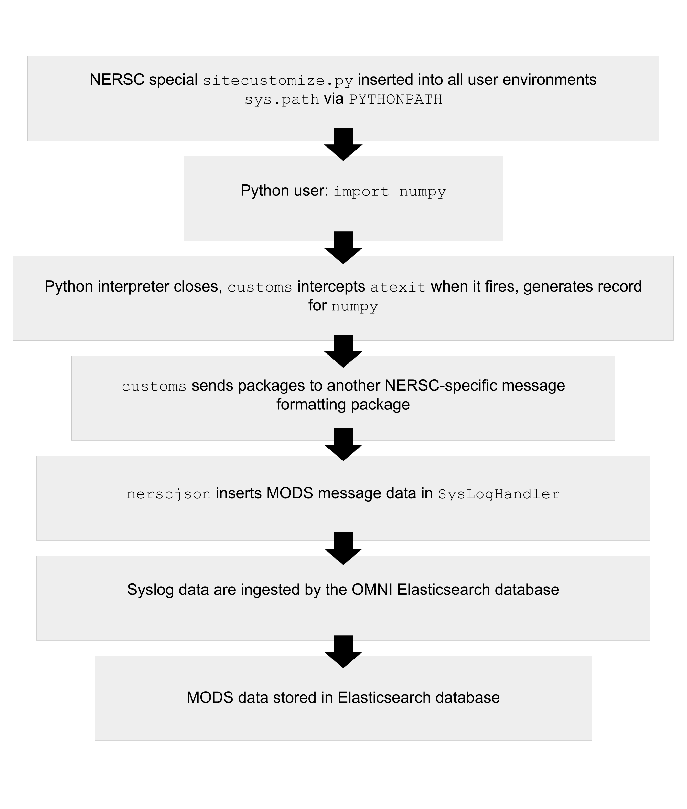
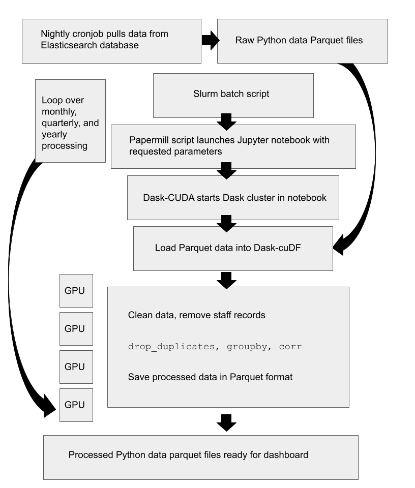
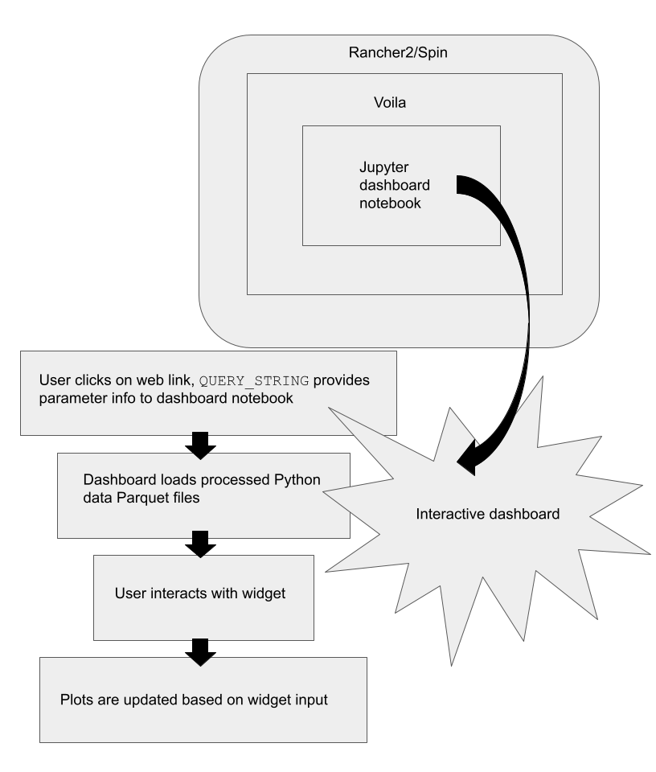
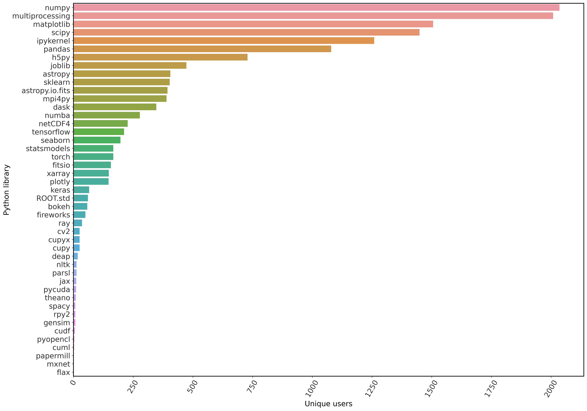
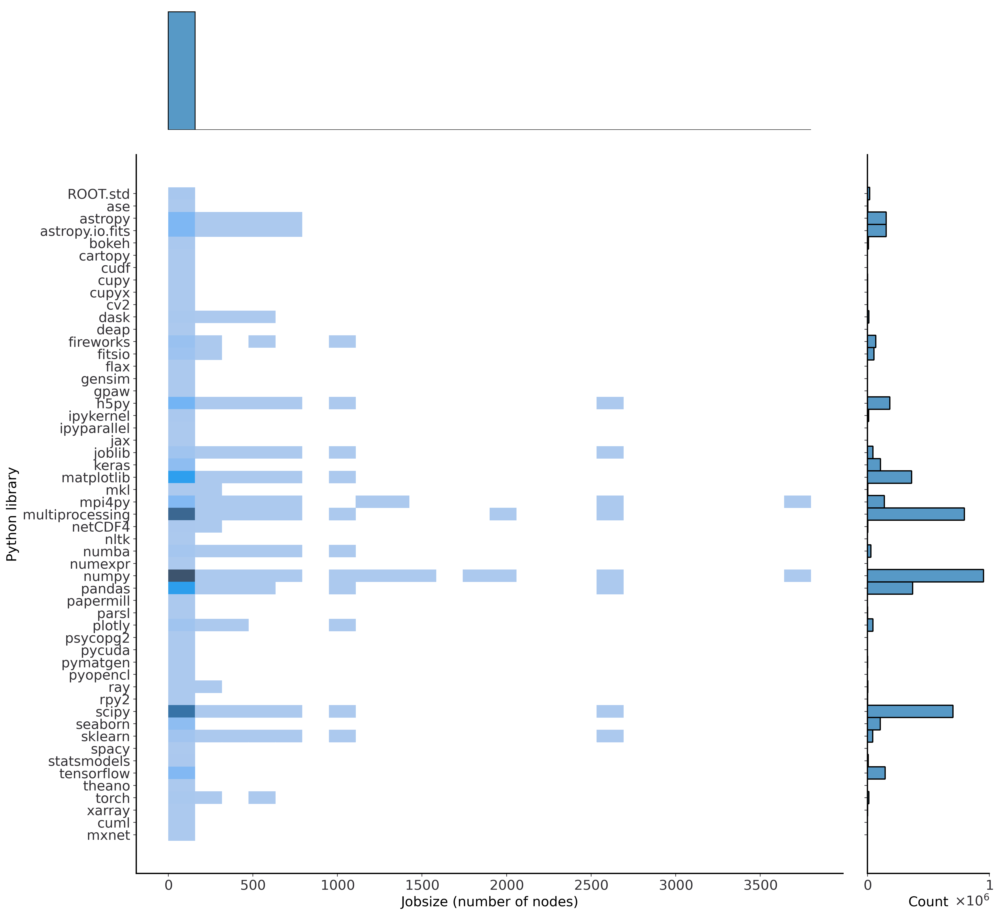
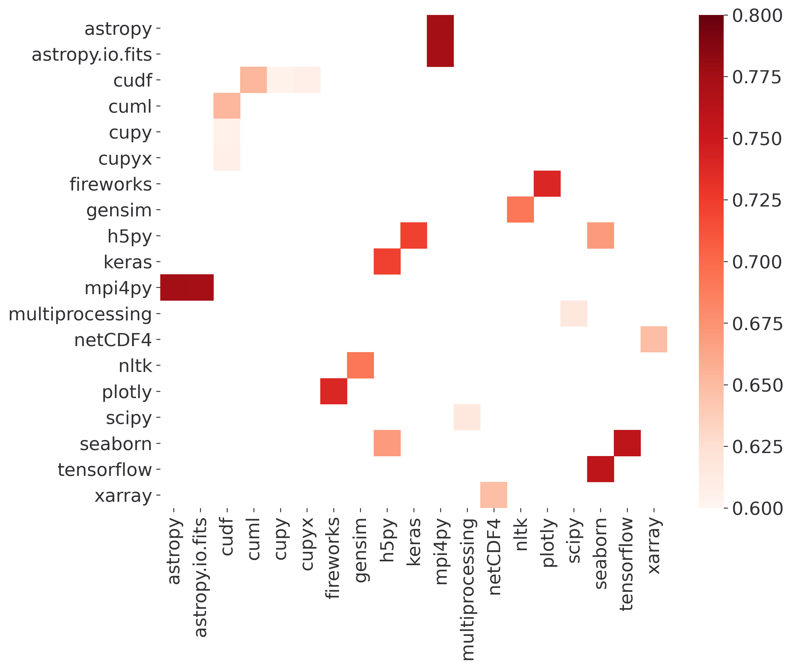
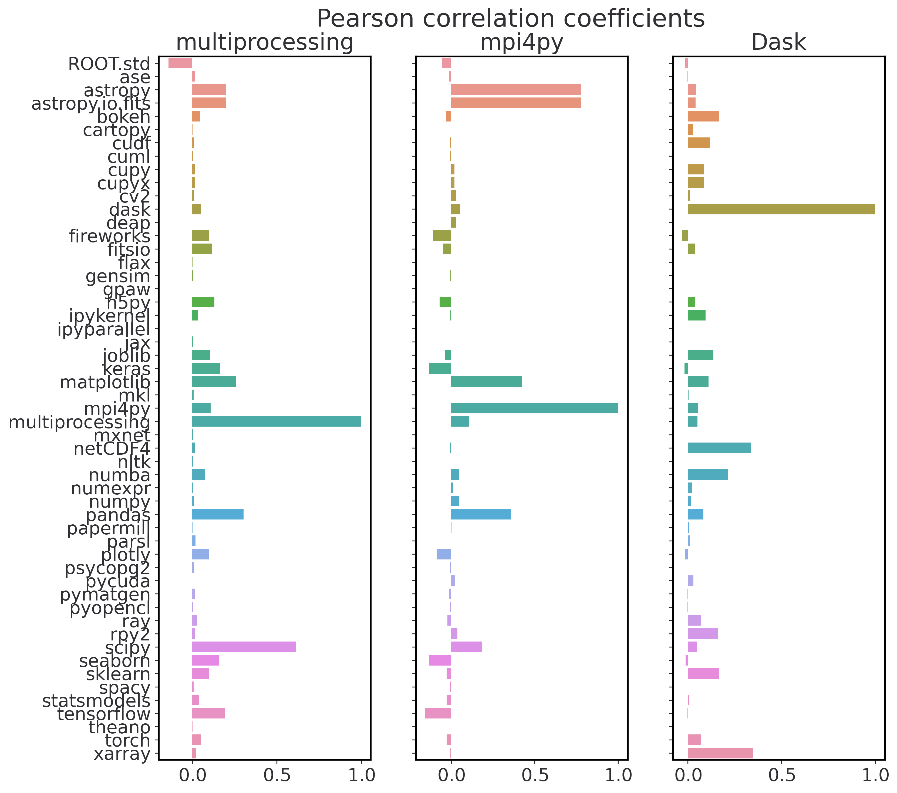

:author: Rollin Thomas
:email: rcthomas@lbl.gov
:institution: National Energy Research Scientific Computing Center,
              Lawrence Berkeley National Laboratory,
              1 Cyclotron Road MS59-4010A,
              Berkeley, California, 94720
:orcid: 0000-0002-2834-4257
:corresponding:

:author: Laurie Stephey
:email: lastephey@lbl.gov
:institution: National Energy Research Scientific Computing Center,
              Lawrence Berkeley National Laboratory,
              1 Cyclotron Road MS59-4010A,
              Berkeley, California, 94720
:orcid: 0000-0003-3868-6178
:corresponding:

:author: Annette Greiner
:email: amgreiner@lbl.gov
:institution: National Energy Research Scientific Computing Center,
              Lawrence Berkeley National Laboratory,
              1 Cyclotron Road MS59-4010A,
              Berkeley, California, 94720
:orcid: 0000-0001-6465-7456

:author: Brandon Cook
:email: bgcook@lbl.gov
:institution: National Energy Research Scientific Computing Center,
              Lawrence Berkeley National Laboratory,
              1 Cyclotron Road MS59-4010A,
              Berkeley, California, 94720
:orcid: 0000-0002-4203-4079

:video: http://www.youtube.com/watch?v=dhRUe-gz690

=====================================================
Monitoring Scientific Python Usage on a Supercomputer
=====================================================

.. class:: abstract

   In 2020, more than 35% of users at the National Energy Research Scientific
   Computing Center (NERSC) used Python on the Cori supercomputer. To determine
   this we have developed a simple, minimally invasive monitoring framework that
   leverages standard Python features to capture Python imports and other job data
   via a package called ``customs`` **FIXME add public link to customs.** The data we
   collect via customs are analyzed with Dask-cuDF in a Jupyter notebook, and
   results are summarized in a Voila dashboard. We display these dashboards via
   our Spin container-as-aservice platform **FIXME add public link to dashboards**
   This new method of analyzing our data has led to insights including: our top 3
   most popular libraries are NumPy, multiprocessing, and Matplotlib, our mean
   jobsize is 2.4 nodes, information about the relationship between library and
   jobsize, and information about which libraries are correlated and
   anticorrelated. We will employ this framework to better understand Python user
   behavior on our current and future NERSC systems.

.. class:: keywords

   HPC, Python monitoring, GPUs, dashboards, parallel

Introduction
============

..
   Why is the work important?

The National Energy Research Scientific Computing Center
`NERSC <https://www.nersc.gov/about/>`_ is the primary
scientific computing facility for the US Department of Energy's Office of
Science.
Some 8,000 scientists use NERSC to perform basic, non-classified research in
predicting novel materials, modeling the Earth's climate, understanding the
evolution of the Universe, analyzing experimental particle physics data,
investigating protein structure, and much more.
NERSC procures and operates supercomputers and massive storage systems under a
strategy of balanced, timely introduction of new hardware and software
technologies to benefit the broadest possible subset of this workload.
Since any research project aligned with the mission of the Office of Science may
apply for access, NERSC's workload is diverse and demanding.
While procuring new systems or supporting users of existing ones, NERSC relies
on detailed analysis of its workload to help inform its strategy.

*Workload analysis* is the process of collecting and marshaling data to build a
picture of how applications and users really interact with and utilize systems.
It is one part of a procurement strategy that also includes surveys of user and
application requirements, emerging computer science research, developer or
vendor roadmaps, and technology trends.
Understanding our workload helps us engage in an informed way with stakeholders
like funding agencies, vendors, developers, users, standards bodies, and other
high-performance computing (HPC) centers.
Actively monitoring the workload enables us to identify suboptimal or
potentially problematic user practices and address them through direct
intervention, improving documentation, or simply making it easier for users to
use software better.
Measuring the relative frequency of use of different software components can
help us streamline delivery, retiring less-utilized packages and promoting
timely migration to newer versions.
Understanding which software packages are most useful to our users helps us
focus support, collaborate with key software developers and vendors, or at least
advocate on our users' behalf to the right people.
Detecting and analyzing trends in user behavior with software over time also
helps us anticipate user needs and respond to those needs proactively.
Comprehensive, quantitative workload analysis is a critical tool in keeping
NERSC a productive supercomputer center for science.

With Python assuming a key role in scientific computing, it makes sense to apply
workload analysis to Python in production settings like NERSC's Cray XC-40
supercomputer, Cori.
Once viewed in HPC circles as merely a cleaner alternative to Perl or Shell
scripting, Python has evolved into a robust platform for orchestrating
simulations, running complex data processing pipelines, managing artificial
intelligence workflows, visualizing massive data sets, and more.
Adapting workload analysis practices to scientific Python gives its community
the same data-driven leverage that other language communities in HPC already
enjoy.

..
   I think if we haven't published MODS in a paper, we could find a public OAR
   release that describes MODS and reference that?

This article documents NERSC's Python workload analysis efforts, part of an
initative called Monitoring of Data Services (MODS), and what we have learned
from the experience.
In the next section, we provide an overview of related work including existing
tools for workload data collection, management, and analysis.
In Methods, we describe an approach to Python-centric workload analysis that
uses built-in Python features to capture usage data, and a Jupyter notebook
based workflow for exploring the data set and communicating what we discover.
Our Results include high-level statements about what Python packages are used
most often and at what scale on Cori, but also some interesting deeper dives
into use of certain specific packages along with a few surprises.
In the Discussion, we follow up on the results from the previous section, share
the pluses and minuses of our workflow, the lessons we learned in setting it up,
and outline plans for expanding the analysis to better fill out the picture of
Python at NERSC.
The Conclusion suggests areas for future work and includes an invitation to
developers to contact us about having their work added to the list of scientific
Python packages we monitor at NERSC.

Related Work
============

..
   What is the context for the work?

The simplest approach used to get a sense of what applications run on a
supercomputer is to scan submitted batch job scripts for executable names.
In the case of Python applications, this is problematic since users often
invoke Python scripts directly instead of as an argument to the ``python``
executable.
This method also provides only a crude count of Python invocations and gives
little insight into deeper questions about specific Python packages, libraries,
or frameworks in use.

Software environment modules [Fur91]_ are a common way for HPC centers to
deliver software to users.
Environment modules operate primarily by setting, modifying, or deleting
environment variables upon invocation of a module command (e.g. ``module
load``, ``module swap``, or ``module unload``)
This provides an entrypoint for software usage monitoring.
Staff can inject code into a module load operation to record the name of the
module being loaded, its version, and other information about the user's
environment.
Lmod, a newer implementation of environment modules [Mcl11]_, provides
documentation on how to configure it to use syslog and MySQL to collect module
loads through a
`hook function <https://lmod.readthedocs.io/en/latest/300_tracking_module_usage.html>`_.
Counting module loads as a way to track Python usage has the virtue of
simplicity.
However, users often include module load commands in their shell resource files
(e.g., `.bashrc`), meaning that shell invocation or mere user login may trigger
a detection even if the user never actually uses it.
Capturing information at the package, library, or framework level using module
load counts would also require that individual Python packages be installed as
separate environment modules.
Module load counts also miss Python usage that happens without loading modules,
in particular user-installed Python environments or in containers.

Tools like ALTD [Fah10]_ and XALT [Agr14]_ are commonly used in HPC contexts to
track library usage in compiled applications.
The approach is to introduce wrappers that intercept the linker and batch job
launcher (e.g. ``srun`` in the case of Slurm used at NERSC).
The linker wrapper can inject metadata into the executable header, take a census
of libraries being linked in, and forward that information to a file or database
for subsequent analysis.
Information stored in the header at link time is dumped and forwarded later by
the job launch wrapper.
On systems where all user applications are linked and launched with instrumented
wrappers, this approach yields a great deal of actionable information to HPC
center staff.
However, popular Python distributions such as Anaconda Python arrive on systems
fully built, and often are installed by users without assistance from center
staff.
Later versions of XALT can address this through an ``LD_PRELOAD`` environment
variable setting.
This enables XALT to identify compiled extensions that are imported in Python
programs using a non-instrumented Python, but pure Python libraries currently
are not detected.
XALT is an active project so this may be addressed in a future release.

[Mac17]_ describes an approach to monitoring Python package use on Blue Waters
using only built-in Python features: ``sitecustomize`` and ``atexit``.
During normal Python interpreter start-up, an attempt is made to import a module
named ``sitecustomize`` that is intended to perform site-specific
customizations.  In this case, the injected code registers an exit handler
through the ``atexit`` standard library module.
This exit handler inspects ``sys.modules``, a dictionary that normally describes
all packages imported in the course of execution.
On Blue Waters, ``sitecustomize`` was installed into the Python distribution
installed and maintained by staff.
Collected information was stored to plain text log files.
An advantage of this approach is that ``sitecustomize`` failures are nonfatal,
and placing the import reporting step into an exit hook (as opposed to
instrumenting the import mechanism) means that it minimizes interference with
normal operation of the host application.
The major limitation of this strategy is that abnormal process terminations
prevent the Python interpreter from proceeding through its normal exit sequence
and package import data are not recorded.

Of course, much more information may be available through tools based on the
extended
`Berkeley Packet Filter <https://ebpf.io/>`_
and the
`BPF compiler collection <https://github.com/iovisor/bcc>`_
for instance as with the ``pythoncalls`` utility that summarizes method calls in
a running application.
While eBPF overheads are reportedly very small, this approach requires special
compilation flags for Python and libraries.
Effort would be needed to make the monitoring more transparent to users and to
marshal the generated data for subsequent analysis.
This could be an interesting and fruitful approach to consider.
Obviously, solutions that can overly impact application reliability or place an
undue burden on system administrators and operations staff should be avoided.
The fullest picture we currently can obtain comes from a combination of
non-intrusive tooling and follow-up with users, using the story we can put
together from the data we gather as a starting point for conversation.

Methods
=======

..
   How was the work done?

Users have a number of options when it comes to how they use Python at NERSC.
NERSC provides a "default" Python to its users through a software environment
module, based on the Anaconda Python distribution with modifications.
Users may load this module, initialize the Conda tool, and create their own
custom Conda environments.
Projects or collaborations may provide their users with shared Python
environments, often as a Conda environment or as an independent installation
altogether (e.g. using the Miniconda installer and building up).
Cray provides a basic "Cray Python" module containing a few core scientific
Python packages linked against Cray MPICH and LibSci libraries.
Python packages are also installed by staff or users via Spack [Gam15]_, an HPC
package manager.
NERSC also provides Shifter [Jac16]_, a container runtime that enables users to
run custom Docker containers that can contain Python built however the author
desires.
With a properly defined kernel-spec file, a user is able to use a Python
environment based on any of the above options as a kernel in NERSC's Jupyter
service.
We need to be able to gather data for workload analysis across all of these
options, in part to understand the relative importance of each.

   Infrastructure for capturing Python package usage data at NERSC.
   :label:`save-data`

Monitoring all of the above can be done quite easily by using the strategy
outlined in [Mac17]_ with certain changes.
Fig. :ref:`save-data` illustrates the infrastructure we have configured.
As in [Mac17]_ a ``sitecustomize`` that registers the ``atexit`` handler is
installed in a directory included into all users' Python ``sys.path``.
The file system where ``sitecustomize`` is installed should be local to the
compute nodes that it runs on and not served over network, in order to avoid
exacerbating poor performance of Python start-up at scale.
We accomplish this by installing it and any associated Python modules into the
compute node system images themselves, and configuring default user environments
to include a ``PYTHONPATH`` setting that injects ``sitecustomize`` into
``sys.path``.
Shifter containers include the monitoring packages from the system image via
volume mount set at runtime.
Users can opt out of monitoring simply by unsetting or overwriting
``PYTHONPATH``.
We took the approach of provisioning a system-wide ``PYTHONPATH`` because it is
much more tenable to give users the ability to opt out of data collection by
unsetting it than it is to ask them to install ``sitecustomize`` voluntarily.
This also gives us a centrally managed source of truth for what is monitored at
any given time.

Customs: Inspect and Report Packages
------------------------------------

To organize ``sitecustomize`` logic we have created a Python package we call
"Customs," since it is for inspecting and reporting on Python package imports of
particular interest.
Customs can be understood in terms of three simple concepts.
A **Check** is a simple object that represents a Python package by its name and
a callable that is used to verify that the package (or even a specific module
within a package) is present in a given dictionary.
In production this dictionary should be ``sys.modules`` but during testing it
can be mock ``sys.modules`` dictionary.
The **Inspector** is a container of Check objects, and is responsible for
applying each Check to ``sys.modules`` (or mock) and returning the names of
packages that are detected.
Finally, the **Reporter** is an abstract class that takes some action given a
list of detected package names.
The Reporter action should be to record or transmit the list of detected
packages, but exactly how this is done depends on implementation.
Customs includes a few reference Reporter implementations and an example of a
custom Customs Reporter.

Customs provides an entry point to use in ``sitecustomize``, the function
``register_exit_hook``.
This function takes two arguments.
The first argument is a list of strings or (string, callable) tuples that are
converted into Checks.
The second argument is the type of Reporter to be used.
The exit hook can be registered multiple times with different package
specification lists or Reporters if desired.

The intended workflow is that a staff member creates a list of package
specifications they want to check for, selects or implements an appropriate
Reporter, and passes these two objects to ``register_exit_hook`` within
``sitecustomize.py``.
Installing ``sitecustomize`` to system images generally involves packaging the
software as an RPM to be installed into node system images and deployed by
system administrators.
When a user invokes Python, the exit hook will be registered using the
``atexit`` standard library module, the application proceeds as normal, and then
at normal shutdown ``sys.modules`` is inspected and detected packages of
interest are reported.

Message Logging and Storage
---------------------------

NERSC has developed a lightweight abstraction layer for message logging called
nerscjson.
It is a simple Python package that consumes JSON messages and forwards them to
an appropriate transport layer that connects to NERSC's Operations Monitoring
and Notification Infrastructure, OMNI [Bau19]_.
Currently this is achieved by using the ``SysLogHandler`` from Python's standard
logging library with a minor modification to the time format to satisfy RFC 3339
Downstream from these transport layers, a message key is used to identify the
incoming messages, their JSON payloads are extracted, and then forwarded to the
appropriate `Elasticsearch <https://elasticsearch-py.readthedocs.io/en/7.10.0/>`_
index. The Customs Reporter used on Cori simply uses nerscjson.

On Cori compute nodes, we use the Cray Lightweight Log Manager (LLM),
configured to accept RFC 5424 protocol messages on service nodes.
A random service node is chosen as the recipient in order to balance load.
On other nodes besides compute nodes, such as login nodes or nodes running
user-facing services, rsyslog is used for message transport.
This abstraction layer allows us to maintain a stable interface for logging
while using an appropraitely scalable transport layer for the system.
For instance, future systems will rely on Apache Kafka or the Lightweight
Distributed Metrics Service [Age14]_.

Cori has 10,000 compute nodes running jobs at very high utilization, 24 hours
day for more than 340 days in a typical year.
The volume of messages arriving from Python processes completing could be quite
high, so we have taken a cautious approach of monitoring only a sizeable list of
key scientific Python packages instead of reporting the entire contents of each
process's ``sys.modules``.
This introduces a potential source of bias that we return to in the Discussion,
but we note here that Python 3.10 will include ``sys.stdlib_module_names``, a
frozenset of strings containing the names of standard library modules, that
could be used in addition to ``sys.builtin_module_names`` to remove standard
library and built-in modules from ``sys.modules`` easily.
Ultimately we plan to capture all imports excluding standard and built-in
packages, except for ones we consider particularly relevant to scientific
Python workflows like ``multiprocessing``.

To reduce excessive duplication of messages from MPI-parallel Python
applications, we prevent reporting from processes with nonzero MPI rank or
``SLURM_PROCID``.
Other multi-process parallel applications using ``multiprocess`` for instance
are harder to deduplicate.
This moves deduplication downstream to the analysis phase.
The key is to carry along enough additional information to enable the kinds of
deduplication needed (e.g., by user, by job, by node, etc).
Table :ref:`metadata` contains a partial list of metadata captured and forwarded
along with package names and versions.

.. table:: Additional monitoring metadata :label:`metadata`

   +----------------+--------------------------------------------------+
   | Field          | Description                                      |
   +================+==================================================+
   | ``executable`` | Path to Python executable used by this process   |
   +----------------+--------------------------------------------------+
   | ``is_compute`` | True if the process ran on a compute node        |
   +----------------+--------------------------------------------------+
   | ``is_shifter`` | True if the process ran in a Shifter container   |
   +----------------+--------------------------------------------------+
   | ``is_staff``   | True if the user is a member of NERSC staff      |
   +----------------+--------------------------------------------------+
   | ``job_id``     | Slurm job ID                                     |
   +----------------+--------------------------------------------------+
   | ``main``       | Path to application, if any                      |
   +----------------+--------------------------------------------------+
   | ``num_nodes``  | Number of nodes in the job                       |
   +----------------+--------------------------------------------------+
   | ``qos``        | Batch queue of the job                           |
   +----------------+--------------------------------------------------+
   | ``repo``       | Batch job charge account                         |
   +----------------+--------------------------------------------------+
   | ``subsystem``  | System partition or cluster                      |
   +----------------+--------------------------------------------------+
   | ``system``     | System name                                      |
   +----------------+--------------------------------------------------+
   | ``username``   | User handle                                      |
   +----------------+--------------------------------------------------+

Fields that only make sense in a batch job context are set to a default
(``num_nodes: 1``) or left empty (``repo: ""``).
Much of the job information is discoverable from separate databases specifically
for Slurm, identity, and banking.
Basic job quantities like node count help capture the most salient features of
jobs being monitored; a downstream join with those external databases is
required for more details.
Much of the information needed is also stored and accessible in OMNI.

In principle it is possible that messages may be dropped along the way to OMNI,
since we are using UDP for transport.
To control for this source of error, we submit scheduled "canary jobs" a few
dozen times a day that run a Python script that imports libraries listed in
``sitecustomize`` and then exits normally.
Matching up those job submissions with entries in Elastic enables us to quantify
the message failure rate.
Canary jobs began running in October of 2020 and from that time until now (May
2021), perhaps surprisingly, we actually have observed no message delivery
failures.

Prototyping, Production, and Publication
----------------------------------------

OMNI includes a Kibana visualization interface that NERSC staff can use to
visualize Elasticsearch-indexed data collected from NERSC systems, including
data collected for MODS.
The MODS team uses Kibana for creating plots of usage data, organizing these
into attractive dashboard displays that communicate MODS high-level metrics.
Kibana is very effective at providing a general picture of user behavior with
the NERSC data stack, but the MODS team wanted deeper insights from the data and
obtaining these through Kibana presented some difficulty.
Given that the MODS team is fluent in Python, and that NERSC provides users
(including staff) with a productive Python ecosystem for data analytics, using
Python tools for understanding the data was a natural choice.

Our first requirement was the ability to explore MODS Python data interactively
to prototype new analyses, but we wanted to be able to record that process,
document it, share it, and enable others to re-run or re-create the results.
Jupyter Notebooks specifically target this problem, and NERSC already runs a
user-facing JupyterHub service that enables access to Cori.
Members of the MODS team can manage notebooks in a Gitlab instance run by NERSC,
or share them with one another (and from Gitlab) using an NBViewer service
running alongside NERSC's JupyterHub.

Iterative prototyping of data analysis pipelines often starts with testing
hypotheses or algorithms against a small subset of the data and then scaling
that analysis up to the entire data set.
GPU-based tools with Python interfaces for filtering, analyzing, and distilling
data can accelerate this scale-up using generally fewer compute nodes that
CPU-based ones.
The entire MODS Python data set is currently about 260 GB in size, and while
this could fit into one of Cori's CPU-based large-memory nodes, the processing
power available there is insufficient to make interactive analysis feasible.
With only CPUs, the main recourse is to scale out to more nodes and distribute
the data.
This is certainly possible, but being able to interact with the entire data set
using a few GPUs, far fewer processes, without inter-node communication is
compelling.

To do interactive analysis, prototyping, or data exploration we use
`Dask-cudf <https://docs.rapids.ai/api/cudf/stable/dask-cudf.html>`_
and cuDF, typically using 4 NVIDIA Volta V100 GPUs coordinated by a
`Dask-CUDA <https://dask-cuda.readthedocs.io/en/latest/>`_ cluster.
The Jupyter notebook itself is started from NERSC's JupyterHub using
BatchSpawner (i.e., the Hub submits a batch job to run the notebook on the GPU
cluster).
The input data, in compressed Parquet format, are read using Dask-cuDF directly
into GPU memory.
These data are periodically gathered from OMNI using the
Python Elasticsearch API and converted to Parquet.
Reduced data products are stored in new Parquet files, again using direct GPU
I/O in Dask-cuDF or cuDF.

As prototype analysis code in notebooks evolves into something resembling a
production analysis pipeline, data scientists face the choice of whether to
convert their notebooks into scripts or try to push the notebook concept to
serve as a production tool.
The latter approach has the appeal that production notebooks can be re-run
interactively when needed with all the familiar Jupyter notebook benefits.
We decided to experiment with using
`Papermill <https://papermill.readthedocs.io/en/latest/>`_
to parameterize notebook
execution over months, quarters, and years of data and submit these notebooks as
batch jobs.
In each Jupyter notebook, a Dask-CUDA cluster is spun up and then shutdown at
the end for memory/worker cleanup.
Processing all data for all permutations currently takes about 1.5 hours on 4
V100 GPUs on the NERSC Cori GPU cluster.
We summarize this workflow in Fig. :ref:`analyze-data`.

   This diagram summarizes the workflow for processing and analyzing Python
   data at NERSC. :label:`analyze-data`

Members of the MODS team can share Jupyter notebooks with one another, but this
format may not make for the best way to present data to other stakeholders, in
particular center management, DOE program managers, vendors, or users.
`Voilà <https://voila.readthedocs.io/en/stable/index.html>`_ is a tool
that uses a Jupyter notebook to power a standalone,
interactive dashboard-style web application, so we decided to evaluate and
experiment with Voilà for this project.
To run our dashboards we use NERSC's Docker container-as-a-service platform
external to its HPC systems called `Spin <https://www.nersc.gov/systems/spin/>`_
where staff and users can run
persistent web services.
Spin currently has no nodes with GPUs.

Creating a notebook using GPU cluster and then using the same notebook to power
a dashboard running on a system without GPUs presented a few challenges.
We found ourselves adopting a pattern where the first part of the notebook used
a Dask cluster and GPU-enabled tools for processing the data, and the second
part of the notebook used reduced data using CPUs to power the dashboard
visualizations.
We used cell metadata tags to direct Voilà to simply skip the first set of cells
and pick up dashboard rendering with the reduced data.
This process was a little clumsy, and we found it easy to make the mistake of
adding a cell and then forgetting to update its metadata.
Easier ways of managing cell metadata tags would improve this process.
Another side-effect of this approach is that packages may appear to be imported
multiple times in a notebook.

We found that even reduced data sets could be large enough to make loading a
Voilà dashboard slow, but we found ways to hide this by lazily loading the data.
Using Pandas DataFrames to prepare even reduced data sets for rendering,
especially histograms, resulted in distracting latency when interacting with the
dashboard.
Vaex [vaex]_ provided for a more responsive user experience, owing to
multithreaded CPU parallelism.
We did use some of Vaex's native plotting functionality (in particular
``viz.histogram``), but we primarily used Seaborn for plotting with Vaex objects
"underneath" which we found to be a fast and friendly way to generate appealing
visualizations.
Sometimes Matplotlib was used when Seaborn could not provide functionality we
needed.

Finally, we note that the Python environment used for both data exploration and
reduction on the GPU cluster, and for running the Voilà dashboard in Spin, is
managed using a single Docker image.
This ensures that the notebook behaves consistently in both contexts.
**FIXME We use two separate sets of notebooks for Python analysis since our data
analysis and plotting require incompatible kernels.**

   This diagram summarizes the setup we use to provide our web-based,
   interactive dashboards. :label:`mods-dashboard`

Results
=======

Our data collection framework yields a rich data set to examine and
our workflow enables us to interactively explore the data and translate the
results of our exploration into dashboards for monitoring Python.
Results presented come from data collected between January and May 2021.
Unless otherwise noted, all results exclude Python usage by members of NERSC
staff (``is_staff==False``) and include only results collected from batch jobs
(``is_compute==True``).
All figures are extracted from the Jupyter notebook/Voilà dashboard.

During the period of observation used here there were 2448 users running jobs
that used Python on Cori, equivalent to just over 30% of all NERSC users.
84% of jobs using Python ran on Cori's Haswell-based partition, 14% used
Cori-KNL, and 2% used Cori's GPU cluster.
63% of Python users use the NERSC-provided Python module directly (including on
login nodes and Jupyter nodes) but only 5% of jobs using Python use the module,
most use a user-built Python environment, namely Conda environments.
Anaconda Python provides scientific Python libraries linked against the Intel
Math Kernel Library (MKL), but we observe that only about 17% of MKL-eligible
jobs (ones using NumPy, SciPy, NumExpr, or scikit-learn) are using MKL.
We consider these findings in Discussion.

   Top 20 tracked Python libraries at NERSC, deduplicated by user,
   across our system.
   :label:`lib-barplot`

Fig. :ref:`lib-barplot` displays the top 20 Python packages in use determined
from unique user imports (i.e. how many users ever use a given package) across
the system, including login node and Jupyter node usage.
These top libraries are similar to previous observations reported from Blue
Waters and TACC [Mcl11]_ [Eva15]_, but the relative prominence of
``multiprocessing`` is striking.
We also note that Joblib, a package for lightweight pipelining and easy
parallelism, ranks higher than both mpi4py and Dask.

The relatively low rankings for TensorFlow and PyTorch are probably due to the
current lack of GPU resources, as Cori provides access to only 18 GPU nodes
mainly for application readiness activities in support of Perlmutter, the next
(GPU-based) system being deployed.
Additionally, some users that are training deep learning models submit a chain
of jobs that may not be expected to finish within the requested walltime; the
result is that the job may end before Customs can capture data from the
``atexit``, resulting in under-reporting.

.. figure:: jobsize-hist-2021.png

   Distribution of job size for batch jobs that use Python.
   :label:`jobsize-hist`

Fig. :ref:`jobsize-hist` shows the distribution of job size (node count) for
jobs that invoked Python and imported one or more of the packages we monitor.
Most of these jobs are small, but the distribution tracks the overall
distribution of job size at NERSC.

   2D histogram of Python package counts versus job size. The
   marginal x-axis (right) shows the total package counts. The marginal
   y-axis (top) shows the total job counts displayed on a log scale.
   Here we measure number of unique packages used within a job rather
   than number of jobs, so these data are not directly comparable
   to Fig. :ref:`lib-barplot` nor to Fig. :ref:`jobsize-hist`.
   :label:`jobsize-lib`

Breaking down the Python workload further, Fig. :ref:`jobsize-lib` contains a 2D
histogram of Python package counts as a function of job size.
Package popularity in this figure has a different meaning than in Fig.
:ref:`lib-barplot`:
The data are deduplicated by ``job_id`` and package name to account for jobs
where users invoke the same executable repeatedly or invoke multiple
applications using the same libraries. The marginal axes summarize the
total package counts and total jobsize counts as a function of
``job_id``.
Most Python libraries we track do not appear to use more than 200 nodes.
Perhaps predictably, ``mpi4py`` and NumPy are observed at the largest node
counts.
Dask jobs are observed at 500 nodes and fewer, so it appears that Dask is not
being used to scale as large as ``mpi4py`` is.
Workflow managers FireWorks [Jai15]_ and Parsl [Bab19]_ are observed scaling to
1000 nodes.
PyTorch (``torch``) appears at larger scales than TensorFlow and Keras, which
suggests users may find it easier to scale PyTorch on Cori.

   Pearson correlation coefficients for tracked Python libraries within the same
   job.
   Libraries were only counted once per job. Here we display correlation
   coefficient values between 0.6 and 0.8 in an effort to highlight
   a regime in which packages have a strong relationship but no explict
   dependencies. :label:`corr2d`

While it is obvious that packages that depend on or are dependencies of other
packages will be correlated within jobs, it is still interesting to examine the
co-occurrence of certain packages within jobs.
A simple way of looking at this is to determine Pearson correlation coefficients
for each tracked library with all others, assigning a 1 to jobs in which a
certain package was used and 0 otherwise.
Fig. :ref:`corr2d` shows an example package correlation heatmap.
The heatmap includes only package correlations above 0.6 to omit less
interesting relationships and less than 0.8 as a simple way to filter out
mandatory or optional inderdependencies.
Notable relationships between non-dependent packages include ``mpi4py`` and
AstroPy, Seaborn and TensorFlow, FireWorks and Plotly.

We used this correlation information as a starting point for examining package
use alongside ``mpi4py``, ``multiprocessing``, and Dask, all of which we are
especially interested in because they enable parallelism within batch jobs.
We omit Joblib, noting that a number of packages depend on Joblib and Joblib
itself uses ``multiprocessing``.
Fig. :ref:`case-studies` presents the correlations of each of these packages
with all other tracked packages.

   Pearson correlation coefficient values for
   ``mpi4py`` (left), ``multiprocessing`` (center), and Dask (right),
   with all other Python libraries we currently track.
   :label:`case-studies`

The strongest correlations observed for ``mpi4py`` (Fig. :ref:`case-studies`,
left) is the domain-specific package AstroPy and its submodule
``astropy.io.fits``.
This suggests that users of AstroPy have been able to scale associated
applications using ``mpi4py`` and that AstroPy developers may want to consider
engaging with ``mpi4py`` users regarding their experiences.
Following up with users generally reveals that using ``mpi4py`` for
"embarrassingly parallel" calculations is very common: "My go-to approach is to
broadcast data using ``mpi4py``, split up input hyperparameters/settings/etc.
across ranks, have each rank perform some number of computations, and then
gather all the results (which are almost always NumPy arrays) using ``mpi4py``."
Very few users report more intricate communication patterns.

Next we consider ``multiprocessing``.
The ``conda`` tool uses ``multiprocessing`` but even after filtering out those
cases, it remains one of the most popular Python libraries in use on Cori.
In Fig. :ref:`case-studies` (center), we do not see the same kind of strong
relationships we did with ``mpi4py``.
The primary correlation visible here is with SciPy, which has some built-in
support for interoperating with ``multiprocessing``, for instance through
``scipy.optimize``.
To learn more we followed up with several of the top ``multiprocessing`` users.
One reported: "I'm using and testing many bioinformatics Python-based packages,
some of them probably using Python ``multiprocessing``.
But I'm not specifically writing myself scripts with ``multiprocessing``."
Another reported: "The calculations are executing a workflow for computing the
binding energies of ligands in metal complexes.
Since each job is independent, ``multiprocessing`` is used to start workflows on
each available processor."
As a package that users directly interact with, and as a dependency of other
packages in scientific Python, ``multiprocessing`` is a workhorse package.

Finally we consider Dask, a Python package for task-based parallelism and
analytics at scale.
Users are increasingly interested in cluster runtimes where they queue up work,
submit the work to the scheduler as a task graph, and the scheduler handles
dependencies and farms out the tasks to workers.
Dask also inter-operates with GPU analytics libraries from NVIDIA as part of
RAPIDS, so we are naturally interested in its potential our next system based in
part on GPUs.
As noted, large jobs using Dask are generally smaller than those using
``mpi4py`` (500 nodes versus 3000+ nodes), which may indicate a potential gap in
scalability on Cori.
The correlation data shown in Fig. :ref:`case-studies` (right) indicate an
affinity with the weather and climate community, where ``netCDF4`` and
``xarray`` seem particularly important.
We reached out to several Dask users to learn more.
One reponded: "I don't remember having any Python Dask-related jobs running in
the past 3 months."
After some additional discussion and analysis, we discovered the user was using
``xarray`` which we believe was using Dask unbeknownst to the user.
This kind of response from Dask users was not uncommon.

Discussion
==========

..
   What do the results mean?  What are the implications and directions for future work?

    Data scientists are involved with gathering data, massaging it into a
    tractable form, making it tell its story, and presenting that story to
    others.

    -- Mike Loukides, `What is Data Science?
    <https://www.oreilly.com/radar/what-is-data-science/>`_

Our results demonstrate that we are able to collect useful data on Python
package use on Cori, tag the data with additional contextual metadata useful
for filtering during analysis, and conduct exploratory analysis of the data that
we can easily evolve to production and publication.
The results themselves confirm many of our expectations about Python use on
Cori, but also reveal some surprises that suggest next actions that various
stakeholders can take.
Such surprises suggest new opportunities for engagements between NERSC, users
and developers of scientific Python infrastructure.

We observe that Python jobs on Cori mostly come from environments that users
themselves have provisioned, and not directly from the Python software
environment module that NERSC provides.
Our expectation was that the fraction of jobs running from such environments
would be high since users have expressed to us in the past that they like being
able to customize their Python experience at NERSC using e.g. the ``conda``
tool.
A major driver behind this behavior is that users sometimes want versions of
packages than are newer than they can get from a centrally-managed Python
environment.
But rather than take that as a cue that we should be updating the NERSC-provided
Python environment more often, we note that users manage their own environments
in order to have control and not be at the mercy of NERSC's software upgrades.
Finding new ways to empower users to manage their software environments through
tools like ``conda`` or Shifter becomes the priority.

Other results indicate that this may need to be done carefully.
As mentioned in the Results, only about 17% of jobs that use NumPy, SciPy,
Scikit-Learn, or NumExpr are using versions of those packages that rely on
threaded, optimized Intel MKL.
Given that Cori's CPU architectures come from Intel, we might expect the best
performance to come from libraries optimized for that architecture.
We caution that there are a number of hypotheses to consider behind this
observation, as it is a question of how well-educated users are on the potential
benefits of such libraries, whether they in fact observe a performance boost in
their own codes, and whether it is as high a priority as other considerations.
The surprising reliance of our users on ``multiprocessing`` and the tendency of
users to use ``mpi4py`` for embarrassing parallelism suggest that they
process-level parallelism easier to manage in Python.
Eliciting good performance from optimized libraries like Intel MKL requires
users to understand interfaces to scientific Python better and perhaps make
major refactoring to their codes to "spend more time" using the underlying
libraries.
Since the interface to OpenMP is "buried" under the interface, users working at
the Python level do what they can with the tools in easy reach.
It may also be a symptom of users tending to install packages from the
conda-forge channel to get the latest versions of the packages they need, which
defaults to installing OpenBLAS.
In any case, performance differences between the two main alternatives might not
be noticeable to most users.
In any case, this is another actionable insight; now that we have identified
that MKL adoption is low, our goal is to try to ensure that users who can
benefit from MKL make good choices about how they build their Python
environments.

While some discoveries suggest next actions and user engagement for NERSC staff,
others suggest opportunities for engagement between users and scientific Python
developers.
Returning to the observation that jobs using AstroPy have an tendency to also
use ``mpi4py``, we conclude that users of AstroPy have been able to scale their
AstroPy-based applications using MPI and that AstroPy developers may want to
consider engaging with our users to make that interaction better.
Examining the jobs further we find that these users tend to be members of large
cosmology experiments like Dark Energy Survey [Abb18]_, Dark Energy
Spectroscopic Instrument [DESI]_, the Dark Energy Science Collaboration
[DESC]_, and CMB-S4 [Aba16]_.
The pattern appears over many users in several experiments.
We also note that the use of ``astropy.io.fits`` in MPI-enabled Python jobs by
astronomers suggests that issues related to FITS I/O performance in AstroPy on
HPC systems may be another area of focus.

While the results are interesting, making decisions based on data alone has its
pitfalls.
There are limitations to the data set, its analysis, and statements we can make
based on the data, some of which can be addressed easily and others not.
First and foremost, we address the limitation that we are tracking a prescribed
list of packages, an obvious source of potential bias.
The reason for prescribing a list is technical: Large bursts of messages from
jobs running on Cori at one time caused issues for OMNI infrastructure and we
were asked to find ways to limit the rate of messages or prevent such kinds of
bursts.
Since then, OMNI has evolved and may be able to handle a higher volume of
messages, and it may be possible to expand the list of simply report all entries
in ``sys.modules`` excluding built-in and standard modules (but not entirely, as
``multiprocessing`` would go undetected).
One strategy may be to forward such a more lightly filtered ``sys.modules`` to
OMNI on a very small random subset of jobs (say 1%) and use that control data
set to estimate bias in the tracked list.
It also helps us to control a major concern, that of missing emergent new
packages that we should be watching for.

Another source of bias is user opt-out.
Sets of users who opt out tend to do so in groups, in particular collaborations
or experiments who manage their own software stacks: Opting out is not a random
error source, it is another source of systematic error.
A common practice is for such collaborations to provide scripts that help a user
"activate" their environment and overwrite ``PYTHONPATH``.
This can cause undercounts in key packages, but we have very little enthusiasm
for removing the opt-out capability.
Rather, we believe we should make a positive case for users to remain opted into
data collection, based on the benefits it delivers to Python users.
Indeed, that is a major motivation for this paper.

A similar undercount may occur for applications that systematically run into
their allocated batch job wallclock limit.
As mentioned for TensorFlow, we confirmed with users a particular pattern of
submitting chains of dozens of training jobs that pick up where previous
iterations left off.
These chains of jobs would appear as just a single job.
Counting the importance of a package by the number of jobs that use it is
dubious; we favor understanding the impact of a package from the breadth of the
user community that uses it.
And further, this suggests that using multiple approaches to understanding
Python package user are needed to build a complete picture.

Part of the power of scientific Python is that it enables its developers to
build upon the work of others, so when a user imports a package it may import
several other dependencies.
All of these libraries "matter" in some sense, but we find that often users are
importing those packages without even being aware they are being used.
For instance, we contacted users who appeared to be running Dask jobs at a node
count of 100 or greater.
The following quote is characteristic of several responses:
"I'm a bit curious as to why I got this email.
I'm not aware to have used Dask in the past, but perhaps I did it without
realizing it."
Some large-scale jobs may use Python only incidentally and aren't the actual
main application running in the job.
Importing a package is not the same as actual use, use of a package in a job
running at scale is not the same as that package being used at scale, and to
understand more the data mainly provides a pointer to code or users.

The analysis part of a notebook is performed on a supercomputer, while the
dashboard runs on a separate container-as-a-service platform, but we were able
to use the notebooks in both cases and use the same exact containers whether
using Jupyter or Voila.
The reason for this is that while the runtime on Cori for containers is Shifter,
and Spin uses Kubernetes to orchestrate container-based services, they both take
Docker as input.
Some of our images were created using Podman, and others using Docker, it didn't
matter.
The Jupyter kernel, the Dask runtime in both places, all the exact same stack.

* Why do we do it this way?

  * Test dog food
  * Able to interact with the data using Python which allows more sophisticated analysis
  * Lends itself to a very appealing prototype-to-production flow

    * We make something that works
    * Show it to stakeholder, get feedback,
    * Iterate on the actual notebook in a job
    * Productionize that notebook without rewriting to scripts etc

Big summary
Findings as extension of previous work
Findings implications
How this helps the future
Statements about the field as a whole
How it facilitates science
Limitations

Putting all the steps in the analysis (extraction, aggregation, indexing,
selecting, plotting) into one narrative improves communication, reasoning,
iteration, and reproducibility.
Therefore, one of our objectives was to manage as much of the data analysis as
we could using one notebook and make the notebook functional both as a Jupyter
document and as a Voilà dashboard.
Using cell metadata helped us to manage both the computationally-intensive
"upstream" part of the notebook and the less expensive "downstream" dashboard
within a single file.
One disadvantage of this approach is that it is very easy to remove or forget to
apply cell tags.
Another is that some code, particularly package imports in one part of the
notebook may need to be repeated in another.
These shortcomings could be addressed by making cell metadata easier to apply
and manage.
The Voilà JupyterLab extension is a helpful tool for previewing a dashboard
before it is published to the web.

Finally, to understand the collected data, we use a PyData-centered workflow
that enables exploration, interactivity, prototyping, and report generation:

* **Jupyter Notebooks,** to interactively explore the data, iteratively
  prototype data analysis and visualizations, and arrange the information for
  reporting, all within a single document.
* **cuDF** to accelerate tabular data analytics and I/O on a single GPU.
* **Dask-cuDF and Dask-CUDA** to scale data transformations and analytics
  to multiple GPUs, including I/O.
* **Papermill,** to automate extraction and transformation of the data as well as
  production runs of Notebooks in multiple-GPU batch jobs on Cori.
* **Vaex,**, to enable a more responsive dashboard via fast data loading and
  plotting operations.
* **Voila** to create responsive, interactive dashboards
  for both internal use
  by NERSC staff and management, but also to external stakeholders.

Future work will include continuing to uncover information in this large and
rich dataset. There are pieces of information in our data such as project name
that we have not yet considered; this will give us insight into user
demographics. There are also many methods such as those in machine learning
that we have not yet applied in our analysis. We should emphasize that MODS is
not the only data being collected at NERSC. In fact we are awash in data from
our job scheduler Slurm, from our user information database Iris, from our OMNI
center metrics that include power consumption, rack temperature, etc, and from
libraries like Darshan which track I/O patterns. Analyzed together these
datasets could provide a much more nuanced understanding of user and job
characteristics at our center and could eventually provide many opportunities
for improving throughput and performance, preloading helpful system defaults,
reducing power consumption, etc. There are substantial possibilities in this
area.
**FIXME: Future work NLTK** `NLTK <https://www.nltk.org/>`_

Finally, our new GPU-based system Perlmutter is coming online at the time of
this writing. We will be using our Python monitoring framework to watch how our
users adapt and utilize our new system. There are several questions in our
mind: 1) Will Python users simply keep doing the same things on Perlmutter as
they are currently doing on Cori? Will they adapt their codes to use the GPUs
or will the remain on the CPUs? 2) Will this different, more powerful system
enable new kinds of analyses that were previously untenable?  Will deep
learning and more sophisticated image processing become more prevalent? 3) Can
we use this system to understand user problems and help address them? For
example, our jobsize data indicate that most Python jobs on Cori are quite
small. Is this because users prefer small jobs? Or is it because users simply
lack the skills they need to scale to the full potential of our supercomputers?
An open question is how can we leverage the data we collect to help NERSC
become a more user-friendly and scientifically productive center.

Conclusion
==========

..
   Summarize what was done, learned, and where to go next.

We have taken our first small steps in understanding the Python workload at
NERSC in detail.
Instrumenting Python to record how frequently key scientific Python packages are
being imported in batch jobs on Cori confirmed many of our assumptions but
yielded a few surprises.
One surprise is the observation of strong affinity between the nominally
unrelated packages AstroPy and ``mpi4py`` within batch jobs that use ``mpi4py``,
probably driven by a few large cosmology collaborations using NERSC.
This suggests that the AstroPy developer community may want to consider deeper
engagement with these users on HPC systems.
Another surprising observation concerns single-node parallelism, the popularity
of process-level parallelism through ``multiprocessing`` and an apparent lack
of interest in thread-level parallelism through hardware-optimized math
libraries, in particular Intel MKL.
These two factors may actually not be at odds, but the number of potential
explanations suggests further insight from the data and engagement with users is
needed.
The next step is acting on the information we have gathered, and of course,
monitoring the impact those actions have on the workload.

Using Python itself as a platform for analyzing the Python workload poses a few
challenges mostly related to supporting infrastructure and tooling.
With a few tricks, we find that the same Jupyter notebooks can be used for both
exploratory and production data analysis, and also to communicate high-level
results through dashboards.
We initiated this project not only to perform Python workload analysis but to
test the supposition that users could assemble all the pieces they needed for a
Python-based data science pipeline at NERSC.
Along the way, we identified shortcomings in our data science ecosystem, and this
motivated us to develop tools for users that fill those gaps, and gave us direct
experience with the very same tools our users use to do real science.

Future plans include expanding Python workload analysis to the new GPU-based
Perlmutter system being deployed now at NERSC.
Through comprehensive monitoring of Python use on Perlmutter we hope to identify
users of Perlmutter's CPU-only nodes who might be able to migrate to GPUs and
accelerate their science.
We look forward to finding out what fraction of our users might be able to do
this and what the challenges are.
At the center level, OMNI includes time series data from a variety of sources
including the HPC and storage systems at NERSC, supporting computational
infrastructure, environmental sensors, mechanical systems, and more.
Understanding whether Python use has any measureable impacts at the systems
level is one potential area of future work.
Similarly, examining Python use within the context of specific science areas is
possible by linking the usage with user account and allocation data from other
sources.
Applying machine learning tools to proactively identify issues that users have
with Python on our systems is also an interesting avenue to pursue.

We anticipate that developers of scientific Python software may find the
information we gather to be informative.
The corresponding authors invite developers to contact them by email about
monitoring usage of the software they have created.

Acknowledgments
===============

This research used resources of the National Energy Research Scientific
Computing Center (NERSC), a U.S. Department of Energy Office of Science User
Facility located at Lawrence Berkeley National Laboratory, operated under
Contract No. DE-AC02-05CH11231.
We thank our colleagues Brian Austin, Colin MacLean, Tiffany Connors, and
Aditya Kavalur for
discussions on workload analysis, process monitoring, and Python.
The authors would like to thank the Vaex developers for their help and advice
related to this work.
The authors would also like to thank the Dask-cuDF and cuDF developers for their
quick response fixing issues and for providing helpful advice in effectively
using cuDF and Dask-cuDF. Finally we would like to thank our users who
were kind enough to provide feedback to us and allow us to use their quotes
about how they are using Python at NERSC.

References
==========

.. [Abb18] T. M. C. Abbott, et al., *Dark Energy Survey year 1 results:
           Cosmological constraints from galaxy clustering and weak lensing*
           Physical Review D, 98, 043526, 2018
           <https://doi.org/10.1103/PhysRevD.98.043526>

.. [Age14] A. Agelastos, B. Allan, J. Brandt, P. Cassella, J. Enos, J. Fullop,
           A. Gentile, S. Monk, N. Naksinehaboon, J. Ogden, M. Rajan, M. Showerman,
           J. Stevenson, N. Taerat, and T. Tucker
           *Lightweight Distributed Metric Service: A Scalable Infrastructure for 
           Continuous Monitoring of Large Scale Computing Systems and Applications*
           Proc. IEEE/ACM International Conference for High Performance Storage,
           Networking, and Analysis, SC14, New Orleans, LA, 2014.
           <https://doi.org/10.1109/SC.2014.18>

.. [Agr14] K. Agrawal, M. R. Fahey, R. McLay, and D. James.
           *User Environment Tracking and Problem Detection with XALT*
           Proceedings of the First International Workshop on HPC User Support
           Tools, Piscataway, NJ, 2014.
           <http://doi.org/10.1109/HUST.2014.6>

.. [Bau19] E. Bautista, M. Romanus, T. Davis, C. Whitney, and T. Kubaska,
           *Collecting, Monitoring, and Analyzing Facility and Systems Data at
           the National Energy Research Scientific Computing Center,*
           48th International Conference on Parallel Processing: Workshops
           (ICPP 2019), Kyoto, Japan, 2019
           <https://doi.org/10.1145/3339186.3339213>

.. [Aba16] K. N. Abazajian, et al., *CMB-S4 Science Book, First Edition*,
           2016
           <https://arxiv.org/abs/1610.02743>

.. [DESC]  LSST Dark Energy Science Collaboration, *Large Synoptic Survey 
           Telescope: Dark Energy Science Collaboration,*
           White Paper, 2012
           <https://arxiv.org/abs/1211.0310>

.. [DESI]  The DESI Collaboration, *The DESI Experiment Part I: Science,
           Targeting, and Survey Design,* Science Final Design Report,
           <https://arxiv.org/abs/1611.00036>

.. [Fah10] M. Fahey, N Jones, and B. Hadri, 
           *The Automatic Library Tracking Database*
           Proceedings of the Cray User Group, Edinburgh, United Kingdom, 2010

.. [Fur91] J. L. Furlani, *Modules: Providing a Flexible User Environment*
           Proceedings of the Fifth Large Installation Systems Administration
           Conference (LISA V), San Diego, CA, 1991

.. [Gam15] T. Gamblin, M. P. LeGendre, M. R. Collette, G. L. Lee, A. Moody, B.
           R. de Supinski, and W. S. Futral. *The Spack Package Manager:
           Bringing Order to HPC Software Chaos.* In Supercomputing 2015 (SC15),
           Austin, Texas, November 15-20 2015. LLNL-CONF-669890.
           <https://doi.org/10.1145/2807591.2807623>

.. [Jac16] D. M. Jacobsen and R. S. Canon, *Shifter: Containers for HPC,* in
           Cray Users Group Conference (CUG16), London, United Kingdom, 2016

.. [Mac17] C. MacLean. *Python Usage Metrics on Blue Waters*
           Proceedings of the Cray User Group, Redmond, WA, 2017.

.. [Mcl11] R. McLay, K. W. Schulz, W. L. Barth, and T. Minyard, 
           *Best practices for the deployment and management of production HPC clusters*
           In State of the Practice Reports, SC11, Seattle, WA,
           <https://doi.acm.org/10.1145/2063348.2063360>

.. [Eva15] T. Evans, A. Gomez-Iglesias, and C. Proctor. *PyTACC: HPC Python at the
           Texas Advanced Computing Center* Proceedings of the 5th Workshop on Python
           for High-Performance and Scientific Computing, SC15, Austin, TX,
           <https://doi.org/10.1145/2835857.2835861>

.. [Jai15] Jain, A., Ong, S. P., Chen, W., Medasani, B., Qu, X., Kocher, M.,
           Brafman, M., Petretto, G., Rignanese, G.-M., Hautier, G., Gunter, D., and
           Persson, K. A. (2015) FireWorks: a dynamic workflow system designed for
           high-throughput applications. Concurrency Computat.: Pract. Exper., 27:
           5037–5059. <https://doi.org/10.1002/cpe.3505>

.. [Bab19] Babuji, Y et al. "Parsl: Pervasive Parallel Programming in
           Python." 28th ACM International Symposium on High-Performance Parallel and
           Distributed Computing (HPDC). 2019. <https://doi.org/10.1145/3307681.3325400>

.. [vaex]  Maarten A. and Breddels, J. V. Vaex: big data exploration in the era of Gaia
           A&A 618 A13 (2018). <https://arxiv.org/abs/1801.02638v1>

