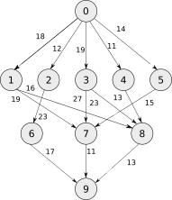
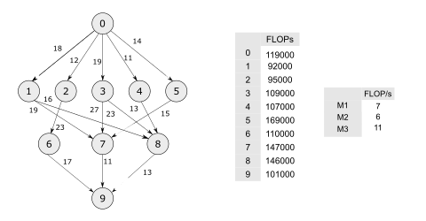
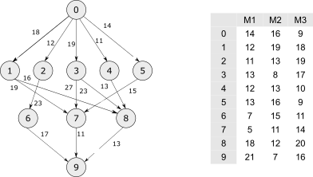

:author: Ryan W. Bunney
:email: ryan.bunney@research.uwa.edu.au
:institution: International Centre for Radio Astronomy Research
:institution: University of Western Australia

:author: Andreas Wicenec
:email: andreas.wicenec@uwa.edu.au
:institution: International Centre for Radio Astronomy Research
:institution: University of Western Australia

:author: Mark Reynolds
:email: mark.reynolds@uwa.edu.au
:institution: University of Western Australia

:bibliography: papers

.. _sec:title:

------------------------------------------------------------------------------------------------------------
SHADOW: A workflow scheduling algorithm reference and testing framework 
------------------------------------------------------------------------------------------------------------

.. class:: abstract

As the scale of science projects increase, so does the demand on computing
infrastructures. The complexity of science processing pipelines, and the
heterogeneity of the environments on which they are run, continues to increase;
in order to deal with this, the algorithmic approaches to executing these
applications must also be adapted and improved to deal with this increased
complexity. An example of this is workflow scheduling, algorithms for which are
continually being developed; however, in many systems that are used to deploy
science workflows for major science projects, the same algorithms and
heuristics are used for scheduling. We have developed SHADOW, a workflow-oriented
scheduling algorithm framework built to address an absence of open
implementations of these common algorithms, and to facilitate the development
and testing of new algorithms against these 'industry standards'. SHADOW has
implementations of common scheduling heuristics, with the intention of
continually updating the framework with heuristics, metaheuristics, and
mathematical optimisation approaches in the near future. In addition to the
algorithm implementations, there is also a number of workflow and environment
generation options, using the companion utility SHADOWGen; this has been
provided to improve the productivity of algorithm developers in experimenting
with their new algorithms over a large variety of workflows and computing
environments. SHADOWGen also has a translation utilities that will convert from
other formats, like the Pegasus DAX file, into the SHADOW-JSON configuration.
SHADOW is open-source and uses key SciPy libraries; the intention is for the
framework to become a reference implementation of scheduling algorithms, and
provide algorithm designers an opportunity to develop and test their own
algorithms with  the framework. SHADOW code is hosted on GitHub at
https://github.com/myxie/shadow; documentation for the project is available in
the repository, as well as at https://shadowscheduling.readthedocs.org.

Introduction
------------

To obtain useful results from the raw data produced by science experiments, a series of scripts or applications is often required to produce tangible results. These application pipelines are referred to as Science Workflows :cite:`alkhanak2016`, which are typically a Directed-Acyclic Graph (DAG) representation of the dependency relationships between application tasks in a pipeline. An example of science workflow usage is Montage [#]_, which takes sky images and
re-projects, background corrects and add astronomical images into custom
mosaics of the sky :cite:`bharathi2008,juve2013`. A Montage pipeline may consist of more than 10,000 jobs, perform more than 200GB of I/O (read and write), and take 5 hours to run :cite:`juve2013`. This would be deployed using
a workflow management system (for example, Pegasus :cite:`deelman2015`), which coordinates the deployment and execution of the workflow. It is this workflow management system that passes the workflow to a workflow scheduling algorithm, which will pre-allocate the individual application tasks to nodes on the execution environment (e.g. a local grid or a cloud environment) in preparation for the workflow's execution.

The processing of Science Workflows is an example of the DAG-Task scheduling problem, a classic problem at the intersection of operations research and high performance computing :cite:`kwok1999`. Science workflow scheduling is a field with varied contributions in algorithm development and
optimisation, which address a number of different sub-problems within the
field :cite:`wu2015a,chaari2014,benoit2013,herroelen1998,rodriguez2016,burkimsher`.
Unfortunately, implementations of these contributions are difficult to find;
for example, implementations that are only be found
in code that uses it, such as in simulation frameworks like
WorkflowSim
:cite:`topcuoglu2002,chen2012a`; others are not implemented in any public way at all :cite:`yu2006,abrishami2010`. These
are also typically used as benchmarking or stepping stones for new algorithms;
for example, the Heterogeneous Earliest Finish Time (HEFT) heuristic continues to be used as the foundation for scheduling
heuristics :cite:`durillo2012,caniou2018`, meta-heuristics, and even
mathematical optimisation procedures :cite:`bridi2016`, despite being 20 years
old. The lack of a consistent testing environment and implementation of
algorithms makes it hard to reproduce and verify the results of published
material, especially when a common workflow model cannot be verified.

Researchers benefit as a community from having open implementations of
algorithms, as it improves reproducibility and accuracy of benchmarking and
algorithmic analysis :cite:`crick2014`. There exists a number of open-source
frameworks designed for testing and benchmarking of algorithms, demonstrate
typical implementations, and provide an infrastructure for the development and
testing of new algorithms; examples include NLOPT for non-linear optimisation
in a number of languages (C/C++, Python, Java) :cite:`johnson`, NetworkX for
graph and network implementations in Python, MOEA for Java, and DEAP for
distributed EAs in Python :cite:`derainville2012`. 
SHADOW (Scheduling Algorithms for DAG Workflows) is our answer to the
absence of Workflow Scheduling-based algorithm and testing framework, like
those discussed above. It is an algorithm repository  and testing environment, in which the performance of single- and
multi-objective workflow scheduling algorithms may be compared to
implementations of common algorithms. The intended audience of SHADOW is those
developing and testing novel workflow scheduling algorithms, as well as
those interested in exploring existing approaches within an accessible
framework. 

To the best of our knowledge, there is no single-source repository of
implementations of DAG or Workflow scheduling algorithms. The emphasis in
SHADOW is on reproducibility and accuracy in algorithm performance analysis,
rather than a simulated demonstration of the application of a particular
algorithm in certain environments. Additionally, with the popularity of Python
in other domains that are also growing within the workflow community, such as
Machine and Deep Learning, SHADOW provides a frictionless opportunity to
integrate with the frameworks and libraries commonly used in those domains.

Workflow Scheduling
~~~~~~~~~~~~~~~~~~~

A workflow is commonly represented in the literature as a Directed Acyclic Graph
(DAG) :cite:`casavant1988,chaudhary1993,ullman1975,kwok1999`; a
sequence of tasks will have precedence constraints that limit when a task may
start. A DAG task-graph is represented formally as a graph :math:`G = (V,E)`, where
:math:`V` is a set of :math:`v` vertices and :math:`E` is a set of :math:`e`
edges :cite:`kwok1999`; an example is featured in Figure :ref:`refdag`, which
will be build upon as the paper progresses. Vertices and Edges represent communication and
computation costs respectively.  The objective of the DAG-scheduling problem
is to map tasks to a set of resources in an order and combination that minimise the execution length of the final schedule; this is referred to
as the *makespan*.

  A sample DAG; vertices represent compute tasks, and edges show precedence
  relationships between nodes. Vertex- and edge-weights are conventionally
  used to describe computational and data costs, respectively. This is adapted from :cite:`topcuoglu2002`, and is a simple example of the DAG structure of a science workflow; a typical workflow in deployment will often be more complex and contain many hundreds of nodes and edges. :label:`refdag`

The complexity and size of data products from modern science projects necessitates
dedicated infrastructure for compute, in a way that requires
re-organisation of existing tasks and processes. As a result, it is often not enough to run a sequence of tasks in series, or submit them to batch processing;
this would likely be computationally inefficient, as well taking as much longer than
necessary. As a result, science projects that have computationally- and
data-intensive programs, that are interrelated, have adopted the
DAG-scheduling model for representing their compute pipelines; this is where
science workflow scheduling is derived. 

Design and Core Architecture
----------------------------

Design
~~~~~~

SHADOW adopts a workflow-oriented design approach, where workflows are at the centre of all decisions made within the
framework; environments are assigned to workflows, algorithms operate on
workflows, and the main object that is manipulated and interacted with
when developing an algorithm is likely to be a workflow object.

By adopting a workflow-oriented model to developing algorithms to test,
three important outcomes are achieved:

-  Freedom of implementation; for users wishing to develop their own
   algorithms, there is no prohibition of additional libraries or
   data-structures, provided the workflow structure is used within the algorithm.

-  Focus on the workflow and reproducibility; when running analysis and
   benchmarking experiments, the same workflow model is used by all algorithms,
   which ensures comparisons between differing approaches (e.g. a
   single-objective model such as HEFT vs. a dynamic implementation of a
   multi-objective heuristic model) are applied to the same workflow.

-  Examples: We have implemented  popular and well-documented algorithms that
   are commonly used to benchmark new algorithms and approaches. There is no need
   to follow the approaches taken by these implementations, but they provide a
   useful starting point for those interested in developing their own.

SHADOW is not intended to accurately simulate the execution of a
workflow in an real-world environment; for example, working with delays in
processing, or node failure in a cluster. Strategies to mitigate these
are often implemented secondary to the scheduling algorithms, 
especially in the case of static scheduling,  and would not be a fair
approach to benchmarking the relative performance between each
application. Instead, it provides algorithms that may be used, 
statically or dynamically, in a larger
simulation environment, where one would be able to compare the specific
environmental performance of one algorithm over another. 

Architecture
------------

SHADOW is split into three main components that are separated by their
intended use case, whether it be designing new algorithms, or to
benchmark against the existing implementations. These components are:

-  ``models``

-  ``algorithms``

-  ``visualiser``

The ``models`` module is likely the main entry point for researchers or
developers of algorithms; it contains a number of key components of the
framework, the uses of which are demonstrated both in the ``examples``
directory, as well as the implemented sample algorithms in the ``algorithms``
module. The ``algorithms`` module is concerned with the implementations of
algorithms, with the intention of providing both a recipe for implementing
algorithms using SHADOW components, and benchmark implementations for
performance analysis and testing. The visualiser is a useful way to add
graphical components to a benchmarking recipe, or can be invoked using the
command line interface to quickly run one of the in-built algorithms.

These components are all contained within the main ``shadow`` directory;
there are also additional codes that are located in ``utils``, which are covered in the **Additional Tools** section.

Models
~~~~~~

  An example workflow DAG adapted from :cite:`topcuoglu2002` (the same
  workflow as in Figure :ref:`refdag`); weights on the edges describe data
  products from the respective parent node being sent to the child. In SHADOW,
  task computation cost is represented by  the total number of Floating Point
  Operations required to run the task (see Table :ref:`hefttable`). This is intended to
  alleviate the difficulty of converting the run-time between  different test
  environment configurations. :label:`heftcalc`

The ``models`` module provides the ``Workflow`` class, the foundational data
structure of shadow. Currently, a ``Workflow`` object is initialised using a
JSON configuration file that represents the underlying DAG structure of the
workflow, along with storing different attributes for task-nodes and edges in
Figure :ref:`heftcalc` (which is an extension of Figure :ref:`refdag`).

.. table:: Table of Task (Giga) FLOP requirements, with the (Giga) FLOP/second provided by each respective machine. It is intended to be applied to Figure :ref:`heftcalc`. :label:`hefttable`

   +------------+---------------+-----------+---------+
   |    Workflow and Costs      |  Environment        |
   +============+===============+===========+=========+
   |*Task*      |*FLOPs*        |*Machine*  |*FLOP/s* |
   +------------+---------------+-----------+---------+
   | 0          | 119000        |``cat0_m0``| 7000    |
   +------------+---------------+-----------+---------+
   | 1          | 92000         |``cat1_m1``| 6000    |
   +------------+---------------+-----------+---------+
   | 2          |95000          |``cat2_m2``| 11000   |
   +------------+---------------+-----------+---------+
   | 3          | 109000        |           |         |
   +------------+---------------+-----------+---------+
   | 4          | 107000        |           |         |
   +------------+---------------+-----------+---------+
   |5           | 169000        |           |         |
   +------------+---------------+-----------+---------+
   |6           | 110000        |           |         |
   +------------+---------------+-----------+---------+
   | 7          | 147000        |           |         |
   +------------+---------------+-----------+---------+
   | 8          | 146000        |           |         |
   +------------+---------------+-----------+---------+
   |9           | 101000        |           |         |
   +------------+---------------+-----------+---------+

These attributes are implicitly defined within the configuration
file; for example, if the task graph has compute demand (as total
number of FLOPs/task) but not memory demand (as average GB/task), then
the Workflow object is initialised without memory, requiring no
additional input from the developer. 

Using the example workflow shown in Figures :ref:`refdag` and :ref:`heftcalc`, we can demonstrate how to initialise a ``Workflow`` in SHADOW, and what options exist for extending or adapting the object. 

.. code-block:: python

   from shadow.models.workflow import Workflow
   HEFTWorkflow = Workflow('heft.json')

The ``heft.json`` file contains the graph structure, based the JSON dump
received when using networks. Nodes and their respective costs
(computation, memory, monetary etc.) are stored with their IDs. 

.. code-block:: python

       ...
       "nodes": [
           {
               "comp": 119000,
               "id": 0
           },
           {
               "comp": 92000,
               "id": 1
           },
           {
               "comp": 95000,
               "id": 2
           },
           ...
       ],

It is clear from Figure HEFT
Edges in the graph, which are the dependency relationship between tasks, 
are described by links, along with the related data-products:

.. code-block:: python

       "links": [
           {
               "data_size": 18,
               "source": 0,
               "target": 1
           },
           {
               "data_size": 12,
               "source": 0,
               "target": 2
           },
           ...

For example, looking at Figure :ref:`heftcalc` we see the dependency between tasks 0 and 1, and the weight 18 on the edge. This is reflected in the above component of the JSON file.

NetworkX is used to form the base-graph structure for the workflow; it
allows the user to specify nodes as Python objects, so tasks are stored
using the SHADOW ``Task`` object structure. By using the
``NetworkX.DiGraph`` as the storage object for the workflow structure, users
familiar with NetworkX may use with the SHADOW ``Workflow`` object in any way they would normally interact with a NetworkX ``Graph``.

In addition to the JSON configuration for the workflow DAG, a Workflow object
also requires an ``Environment`` object. ``Environment`` objects represent the
compute platform on which the Workflow is executed; they are add to
``Workflow`` objects in the event that different environments are being
analysed. The environment is also specified in JSON; currently, there is no
prescribed way to specify an environment in code, although it is possible to
do so if using JSON is not an option. 

In our example, we have three machines on which we are attempting to schedule the workflow from Figure :ref:`heftcalc`. The different performance of each machine is described in Table :ref:`hefttable`, with the JSON equivalent below:

.. code-block:: python

     "system": {
       "resources": {
         "cat0_m0": {
           "flops": 7000.0
           "mem":
           "io" :
         },
         "cat1_m1": {
           "flops": 6000.0
         },
         "cat2_m2": {
           "flops": 11000.0
         }
       },
       "rates": {
         "cat0": 1.0, # GB/s
         "cat1": 1.0,
         "cat2": 1.0
       }
     }

Environments are added to the ``Workflow`` object in the following
manner:

.. code-block:: python

   from shadow.models.environment import Environment
   env = Environment('sys.json')
   HEFTWorkflow.add_environment(env)

The Workflow class
calculates task run-time and other values based on its current environment when the environment is passed to the Workflow); however, users of the
environment class may interact with these compute values if necessary.
Configuration files may be generated in a number of ways, following a variety
of specifications, using the SHADOWGen utility.

It is also possible to use pre-calculated costs (i.e. completion time in
seconds) when scheduling with SHADOW. 

   This is a replication of the costs provided in
   :cite:`topcuoglu2002`. The table shows a different run-time for each
   task-machine pairing. It is the same structure as Figure :ref:`heftcalc`; however, the JSON specification is different to cater for the pre-calculated run-time on separate machines. :label:`heftnocalc`

This approach is less flexible for
scheduling workflows, but is a common approach used in the scheduling
algorithm literature :cite:`kwok1999,kwok1999a,sakellariou2004,barbosa2008,yu2006`; an example of this is shown in Figure
:ref:`heftnocalc`. This can be achieved by adding a list of
costs-per-tasks to the workflow specification JSON file, in addition to the
following header. For example, if instead of the total FLOPS we had provided to us in Table :ref:`hefttable`, we instead had timed the run-time of the applications on each machine separately, the JSON for Figure :ref:`heftcalc` would reflect the following:

.. code-block:: python

    {
       "header" : {
       "time": true
       },
       ...

       "nodes": [
       {
           "comp": [
               14,
               16,
               9
           ],
           "id": 0
       },
       ...
   }

The final class that may be of interest to algorithm developers is the
``Solution`` class. For single-objective heuristics like HEFT or min-min,
the final result is a single solution, which is a set of machine-task
pairs. However, for population- and search-based metaheuristics,
multiple solutions must be generated, and then evaluated, often for two
or more (competing) objectives. These solutions also need to be
sanity-checked in order to ensure that randomly generated task-machine
pairs still follow the precedence constraints defined by the original
workflow DAG. The ``Solution`` provides a basic object structure that
stores machines and task pairs as a dictionary of ``Allocations``;
allocations store the task-ID and its start and finish time on the
machine. This provides an additional ease-of-use functionality for
developers, who can interact with allocations using intuitive attributes
(rather than navigating a dictionary of stored keywords). The ``Solution``
currently stores a single objective (makespan) but can be expanded to
include other, algorithm-specific requirements. For example, NSGAII\*
ranks each generated solution using the non-dominated rank and crowding
distance operator; as a result, the SHADOW implementation creates a
class, ``NSGASolution``, that inherits the basic ``Solution`` class and adds
the these additional attributes. This reduces the complexity of the
global solution class whilst providing the flexibility for designers to
create more elaborate solutions (and algorithms).

Algorithms
~~~~~~~~~~

These algorithms may be extended by others, or used when running
comparisons and benchmarking. The ``examples`` directory gives you an
overview of recipes that one can follow to use the algorithms to perform
benchmarking.

The SHADOW approach to describing an algorithm presents the algorithm as a
single entity (e.g. heft()), with an initialised workflow object passed as a
function parameter. The typical structure of a SHADOW algorithm function is as
follows:

- The main algorithm (the function to which a Workflow well be
  passed) is titled using its publication name or title (e.g. HEFT, PCP,
  NSGAII* etc.). Following PEP8, this is (ideally) in lower-case.

- Within the main algorithm function, effort has been made to keep it
  structured in a similar way to the pseudo-code as presented in the respective
  paper. For example, HEFT has two main components to the algorithm; Upward
  Ranking of tasks in the workflow, and the Insertion Policy allocation scheme.
  This is presented in SHADOW as:

.. code-block:: python

  def heft(workflow):
    """
    Implementation of the original 1999 HEFT algorithm.

    :params workflow: The workflow object to schedule
    :returns: The solution object from the scheduled workflow
    """
    upward_rank(workflow)
    workflow.sort_tasks('rank')
    insertion_policy(workflow)
    return workflow.solution

Complete information of the final schedule is stored in the
``HEFTWorkflow.solution`` object, which provides additional information, such as
task-machine allocation pairs.  It is convention in SHADOW to have the
algorithm return the Solution object attached to the workflow:

.. code-block:: python

  solution = heft(HEFTWorkflow)

In keeping with the generic requirements of  DAG-based scheduling algorithms,
the base Solution class prioritises makespan over other objectives; however,
this may be amended (or even ignored) for other approaches. For example, the
NSGAII algorithm uses a sub-class for this purpose, as it generates multiple
solutions before ranking each solution using the crowded distance or
non-dominated sort :cite:`srinivas1994`:

.. code-block:: python

  class NSGASolution(Solution):
    """ A simple class to store each solutions' 
        related information
    """

    def __init__(self, machines):
      super().__init__(machines)
      self.dom_counter = 0
      self.nondom_rank = -1
      self.crowding_dist = -1
      self.solution_cost = 0

Visualiser
~~~~~~~~~~

SHADOW provides wrappers to ``matplotlib`` that are structured around the
``Workflow`` and ``Solution`` classes. The ``Visualiser`` uses the
``Solution`` class to retrieve allocation data, and generates a plot based on
that information. For example, Figure :ref:`examplealloc`  is the result of visualising the ``HEFTWorkflow`` example mentioned previously:

.. figure:: samplea_allocation.pdf

   Result of running ``shadow.heuristic.heft`` on the graph shown in Figure
   :ref:`heftcalc`. Final makespan is 98; gaps between tasks are indicative of
   data transfer times between parent and child tasks on different machines.
   This is generated using the ``AllocationPlot`` wrapper from the
   ``Visualiser``. :label:`examplealloc`

This can be achieved by creating a script using the algorithms as described
above, and then passing the scheduled workflow to one of the Visualiser
classes:

.. code-block:: python

  from shadow.visualiser.visualiser import AllocationPlot

  sample_allocation = AllocationPlot(
      solution=HEFTWorkflow.solution
  )

  sample_allocation.plot(
      save=True,
      figname='sample_allocation.pdf'
  )

Additional tools
----------------

Command-line interface
~~~~~~~~~~~~~~~~~~~~~~

SHADOW provides a simple command-line interface (CLI) that allows users to run
algorithms on workflows without composing a separate Python file to do so;
this provides more flexibility and allows users to use a scripting language
of their choice to run experiments and analysis.

.. code-block:: python

  python3 shadow.py algorithm heft \
  'heft.json' 'sys.json'

It is also possible to use the ``unittest`` module from the script to run through
all tests if necessary:

.. code-block:: bash

  python3 shadow.py test --all

SHADOWGen
~~~~~~~~~~~

SHADOWGen is a utility built into the framework to generate
workflows that are reproducible and interpretable. It is designed to
generate a variety of workflows that have been documented and
characterised in the literature in a way that augments current
techniques, rather than replacing them entirely.

This includes the following:

-  Python code that runs the GGen graph generator [#]_, which produces
   graphs in a variety of shapes and sizes based on provided parameters.
   This was originally designed to produce task graphs to test the
   performance of DAG scheduling algorithms.

-  DAX Translator: This takes the commonly used Directed Acyclic XML
   (DAX) file format, used to generate graphs for Pegasus, and
   translates them into the SHADOW format. Future work will also
   interface with the WorkflowGenerator code that is based on the work
   conduced in :cite:`bharathi2008`, which generates DAX
   graphs.

-  DALiuGE/EAGLE Translator :cite:`wu2017a`: EAGLE logical graphs must be
   unrolled into Physical Graph Templates (PGT) before they are in a DAG that can
   be scheduled in SHADOW. SHADOWGen will run the DALiUGE unroll code, and then
   convert this PGT into a SHADOW-based JSON workflow.

Cost generation in SHADOWGen
------------------------------

.. raw:: latex

   \setlength{\tablewidth}{0.8\linewidth}

.. raw:: latex

      \begin{table*}
       \begin{tabular}{c|ccccccccccc}
           & & \multicolumn{2}{c}{Run-time}&  \multicolumn{2}{c}{
           I/O Read} & \multicolumn{2}{c} {I/O Write} & \multicolumn{2}{c}{Peak Memory} &
           \multicolumn{2}{c}{CPU Util}\\
              Job & Count &  Mean (s) & Std. Dev. & Mean (MB) & Std. Dev. & Mean (MB)& Std. Dev. &
              Mean (MB)& Std. Dev. & Mean (\%) & Std. Dev \\
           \hline
           mProjectPP & 2102 & 1.73 & 0.09 & 2.05 & 0.07 & 8.09 & 0.31 & 11.81 & 0.32 & 86.96 & 0.03 \\
           mDiffFit & 6172 & 0.66 & 0.56 & 16.56 & 0.53 & 0.64 & 0.46 & 5.76 & 0.67 & 28.39 & 0.16 \\
           mConcatFit & 1 & 143.26 & 0.00 & 1.95 & 0.00 & 1.22 & 0.00 & 8.13 & 0.00 & 53.17 & 0.00 \\
           mBgModel & 1 & 384.49 & 0.00 & 1.56 & 0.00 & 0.10 & 0.00 & 13.64 & 0.00 & 99.89 & 0.00 \\
           mBackground & 2102 & 1.72 & 0.65 & 8.36 & 0.34 & 8.09 & 0.31 & 16.19 & 0.32 & 8.46 & 0.10 \\
           mImgtbl & 17 & 2.78 & 1.37 & 1.55 & 0.38 & 0.12 & 0.03 & 8.06 & 0.34 & 3.48 & 0.03 \\
           mAdd & 17 & 282.37 & 137.93 & 1102.57 & 302.84 & 775.45 & 196.44 & 16.04 & 1.75 & 8.48 & 0.11 \\
           mShrink & 16 & 66.10 & 46.37 & 411.50 & 7.09 & 0.49 & 0.01 & 4.62 & 0.03 & 2.30 & 0.03 \\
           mJPEG & 1 & 0.64 & 0.00 & 25.33 & 0.00 & 0.39 & 0.00 & 3.96 & 0.00 & 77.14 & 0.00 \\
           \hline
       \end{tabular}
       \caption{Example profile of Montage workflow, as presented in \cite{juve2013}}
       \label{table1}
      \end{table*}

A majority of work published in workflow scheduling will use workflows
generated using the approach laid out in :cite:`bharathi2008`. The five
workflows described in the paper (Montage, CyberShake, Epigenomics, SIPHT and
LIGO) had their task run-time, memory and I/O rates profiled, from which they
created a WorkflowGenerator tool [#]_. This tool uses the distribution sizes
for run-time etc., without requiring any information on the hardware on which
the workflows are being scheduled. This means that the characterisation is
only accurate for that particular hardware, if those values are to be used
across the board; testing on heterogeneous systems, for example, is not
possible unless the values are to be changed.

This is dealt with in varied ways across the literature. For example,
:cite:`rodriguez2018` use the distributions from :cite:`bharathi2008` paper,
and change the units from seconds to MIPS, rather than doing a conversion
between the two. Others use the values taken from distribution and workflow
generator, without explaining how their run-time differ between resources
:cite:`abrishami2013,malawski2015`; Malawski et al. generate different workflow
instances. using parameters and task run-time distributions from real
workflow traces, but do not provide these parameters :cite:`malawski2015`.
Recent research from :cite:`wang2019` still uses the workflows identified in
:cite:`bharathi2008,juve2013`, but only the structure of the workflows is
assessed, replacing the tasks from the original with other, unrelated
examples.

SHADOWGen differs from the literature by using a normalised-cost approach, in
which the values calculated for the run-time, memory, and I/O for each tasks
is derived from the normalised size as profiled in :cite:`juve2013` and
:cite:`bharathi2008`. This way, the costs per-workflow are indicative of the
relative length and complexity of each task, and are more likely to transpose
across different hardware configurations than using the varied approaches in
the literature.

.. math::
  :label: normalise

  X^\prime = \frac{(X \times n_{task})-X_{min}}{X_{max}-X_{min}}

The distribution of values is derived from a table of normalised values using
a variation on min-max feature scaling for each mean or standard deviation
column in Table :ref:`table1`. The formula to calculate each task's normalised
values is described in Equation :ref:`normalise`; the results of applying this
to Table :ref:`table1` is shown in Table :ref:`table2`:

.. raw:: latex

   \setlength{\tablewidth}{0.8\linewidth}

.. raw:: latex

  \begin{table*}
    \begin{tabular}{c|ccccccccccc}
     & \multicolumn{2}{c}{Run-time}&  \multicolumn{2}{c}{
    I/O Read} & \multicolumn{2}{c} {I/O Write} & \multicolumn{2}{c}{Peak Memory} &
    \multicolumn{2}{c}{CPU Util}\\
    job &  Mean (s) & Std. Dev. & Mean (MB) & Std. Dev. & Mean (MB)& Std. Dev. &
    Mean (MB)& Std. Dev. & Mean (\%) & Std. Dev \\
    \hline
    mProject  PP & 9.47 & 0.49 & 11.22 & 0.38 & 44.30 & 1.70 & 64.66 & 1.75 & 476.20 & 0.16 \\
    mDiffFit & 10.61 & 9.00 & 266.27 & 8.52 & 10.29 & 7.40 & 92.61 & 10.77 & 456.48 & 2.57 \\
    mConcatFit & 0.37 & 0.00 & 0.00 & 0.00 & 0.00 & 0.00 & 0.01 & 0.00 & 0.13 & 0.00 \\
    mBgModel & 1.00 & 0.00 & 0.00 & 0.00 & 0.00 & 0.00 & 0.03 & 0.00 & 0.25 &
    0.00 \\
    mBackground & 9.42 & 3.56 & 45.78 & 1.86 & 44.30 & 1.70 & 88.65 & 1.75 & 46.32 & 0.55 \\
    mImgtbl & 0.12 & 0.06 & 0.06 & 0.02 & 0.01 & 0.00 & 0.35 & 0.02 & 0.15 & 0.00 \\
    mAdd & 12.50 & 6.11 & 48.83 & 13.41 & 34.34 & 8.70 & 0.70 & 0.08 & 0.37 & 0.00 \\
    mShrink & 2.75 & 1.93 & 17.15 & 0.30 & 0.02 & 0.00 & 0.18 & 0.00 & 0.09 & 0.00 \\
    mJPEG & 0.00 & 0.00 & 0.06 & 0.00 & 0.00 & 0.00 & 0.00 & 0.00 & 0.19 & 0.00 \\
    \hline
    \end{tabular}
    \caption{
        Updated relative cost values using the min-max feature scaling method described in Equation ~\ref{normalise}.
    }
    \label{table2}
  \end{table*}

This approach allows algorithm designers and testers to describe
what units they are interested in (e.g. seconds, MIPS, or FLOP seconds
for run-time, MB or GB for Memory etc.) whilst still retaining the
relative costs of that task within the workflow. In the example of
Table :ref:`table2`, it is clear that
mAdd and mBackground are still the longest running and I/O intensive
tasks, making the units less of a concern.

Alternatives to SHADOW
----------------------

It should be noted that existing work already addresses testing workflow
scheduling algorithms in real-world environments; tools like SimGrid
:cite:`casanova`, BatSim :cite:`dutot2017`, GridSim :cite:`buyya2002`, and its
extensions, CloudSim :cite:`calheiros2011` and WorkflowSim :cite:`chen2012a`,
all feature strongly in the literature. These are excellent resources for
determining the effectiveness of the implementations at the application level;
however, they do not  provide a standardised repository of existing
algorithms, or a template workflow model that can be used to ensure
consistency across performance testing. Current implementations of workflow
scheduling algorithms may be found in a number of different environments; for
example, HEFT and dynamic-HEFT implementations exist in WorkflowSim [#]_ , but
one must traverse large repositories in order to reach them. There are also a
number of implementations that are present on open-source repositories such as
GitHub, but these are not always official releases from papers, and it is
difficult to keep track of multiple implementations to ensure quality and
consistency. The algorithms that form the ``algorithms`` module in SHADOW are
open and continually updated, and share a consistent workflow model. Kwok and
Ahmed :cite:`kwok1999` provide a comprehensive overview of the metrics and
foundations of what is required when benchmarking DAG-scheduling algorithms,
Maurya et al. maurya2018` extend this work and describe key features of a
potential framework for scheduling algorithms; SHADOW takes inspiration from,
and extends, both approaches.

Conclusion
----------

SHADOW is a development framework that addresses the absence of a repository of
workflow scheduling algorithms, which is important for  benchmarking and
reproducibility :cite:`maurya2018`. This repository continues to be updated,
providing a resource for future developers. SHADOWGen extends on existing
research from both the task- and workflow-scheduling communities in graph
generation by using existing techniques and wrapping them into a simple and
flexible utility. The adoption of a JSON data format compliments the move
towards JSON as a standardised way of representing workflows, as demonstrated by
the Common Workflow Language :cite:`chapman2016` and WorkflowHub [#]_.

Future work
-----------
Moving forward, heuristics and metaheuristics will continue to be added
to the SHADOW algorithms module to facilitate broader benchmarking and
to provide a living repository of workflow scheduling algorithms.
Further investigation into workflow visualisation techniques will also
be conducted. There are plans to develop a tool that uses the
specifications in ``hpconfig`` [#]_, a Python class-based  of
different hardware (e.g. ``class XeonPhi`` ) and High Performance
Computing facilities (e.g ``class PawseyGalaxy``). The motivation behind
``hpconfig`` is that classes can be quickly unwrapped into a large
cluster or system, without having large JSON files in the repository or
on disk; they also improve readability, as specification data is
represented clearly as class attributes.

.. ::

..   .. latex::

.. [#] https://github.com/pegasus-isi/montage-workflow-v2

.. [#]
    https://github.com/WorkflowSim/WorkflowSim-1.0/tree/master/sources/org/workflowsim/planning

.. [#]
   https://github.com/perarnau/ggen

.. [#]
   https://github.com/pegasus-isi/WorkflowGenerator

.. [#]
   github.com/myxie/hpconfig

.. [#]
    https://workflowhub.org/simulator.html