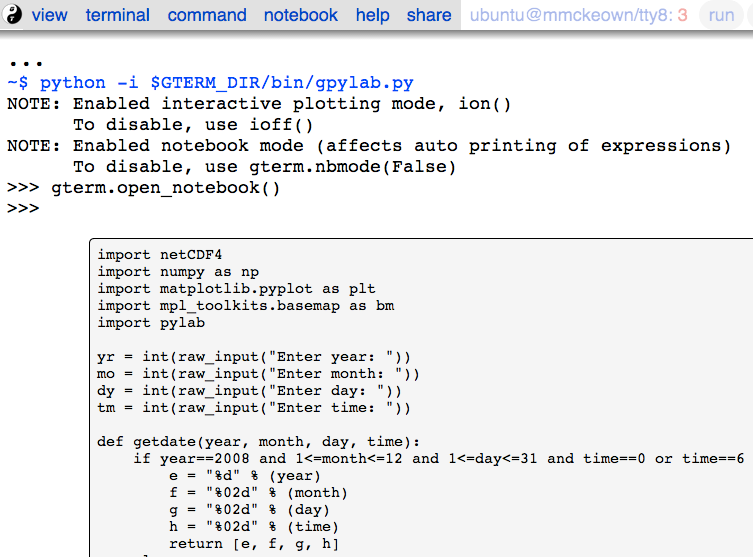
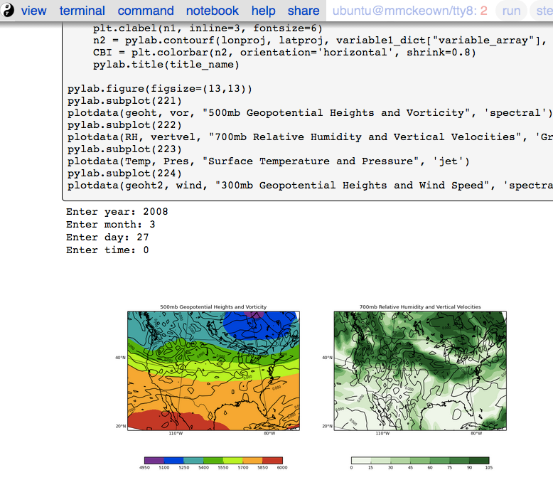
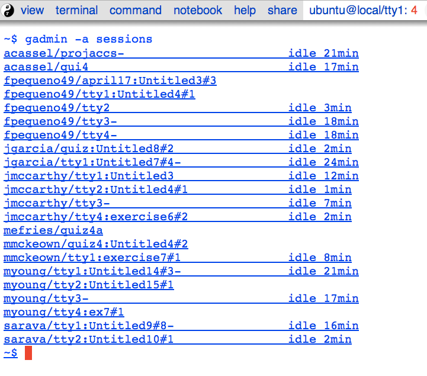
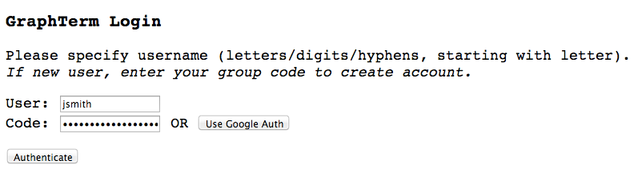

:author: Ramalingam Saravanan
:email: sarava@tamu.edu
:institution: Texas A&M University

:video: http://www.youtube.com/watch?v=LiZJMYxvJbQ

------------------------------------------------------------------------
Creating a browser-based virtual computer lab for classroom instruction
------------------------------------------------------------------------

.. class:: abstract

   With laptops and tablets becoming more powerful and more ubiquitous
   in the classroom, traditional computer labs with rows of expensive
   desktop computers are slowly beginning to lose their relevance. An
   alternative approach for teaching Python is to use a browser-based
   virtual computer lab, with a notebook interface. The advantages
   of physical computer labs, such as face-to-face interaction, and
   the challenge of replicating them in a virtual environment are
   discussed. The need for collaborative features like
   terminal/notebook sharing and chatting is emphasized. A virtual computer lab is
   implemented using the GraphTerm server, with several experimental features
   including a virtual dashboard for monitoring tasks and progressively
   fillable notebooks for ensuring step-by-step completion of a
   sequence of tasks.

.. class:: keywords

   virtual computer lab, notebook interface, cloud computing, browser-based terminal

Introduction
------------

A computer lab, with rows of identical desktop computers, is a
commonly used resource when teaching programming or scientific
computing [Thompson11]_. However, with the increasing popularity of
*Bring Your Own Device* solutions everywhere, computer labs are slowly
losing their relevance. Physical labs are expensive to provision and
maintain. Personal laptop computers and even tablets have more than
sufficient computing horsepower for pedagogical use. As infrastructure
costs increase, cloud-based virtual computing environments look
increasingly attractive as replacements for physical computer labs.

As we inevitably, albeit slowly, move away from hardware computer
labs, it is worth analyzing the pros and cons of the physical vs. the
virtual approach. Some of the advantages of a physical lab are:

* Uniform software without installation or compatibility issues

* Ability to walk around and monitor students' progress

* Students raise their hand to request assistance from the instructor

* Students can view each other's screens and collaborate

* Large files and datasets can be shared through cross-mounted file systems

Some of the shortcomings of physical computer labs are:

* Need to purchase and maintain hardware, ensuring security

* Need to create user accounts and install course-specific software

* Instructor may not want or may not have root access, leading to delays in fixing problems

* Students typically need to be physically present to use the lab

Many of the advantages of the physical computer lab are difficult to
replicate when students use laptops in an *ad hoc* fashion, with
differing software installations and without shared file systems or
collaborative features.  A browser-based virtual computing lab running
on a remote server can address many of the shortcomings of physical
computer labs, while still retaining the advantages of a uniform
software environment and shared files. However, the human interaction
aspects of a physical lab will never be fully reproducible in a virtual
environment.

This study documents experiences gained from using hybrid
physical-virtual computer lab in teaching an introductory programming
course for meteorology undergraduates during Spring 2014. The course
was aimed at students with no prior knowledge of programming. The goal
was to teach them to write code that can access and visualize
meteorological data, and Python is ideally suited for this task
[Lin12]_. The students had access to a physical lab with identical
iMac computers, but several expressed an interest in using their
laptops so that they could continue to work on assignments at home.

Students began using the IPython Notebook interface [Perez12]_ early
on during the course. Some of them installed Enthought or Anaconda
distributions on their laptop computers and used the bundled notebook
server. They were also given the option of
remotely accessing a browser-based virtual computer lab using GraphTerm,
which is an open-source graphical terminal interface that is backwards compatible
with the ``xterm`` terminal, and also supports a lightweight notebook
interface [Saravanan13]_. Some of the students used the remote
GraphTerm option to work on their assignments and collaborate on their
group project.

There are several "virtual computer lab" implementations on university
campuses which typically use a Citrix server to provide remote desktop
access to Windows computers. There are also many commercial
products providing Python computing environments in cloud, such as
PythonAnywhere and Wakari [Wakari]_.  This study focuses on
alternative “roll your own” solutions using open-source software that
are specifically targeted for use in an interactive classroom
instruction setting, with collaborative features that mimic physical
computer labs. Creating such a virtual computing lab usually involves
instantiating a server using a cloud infrastructure provider, such as
Amazon. A new server can be set-up within minutes, with a scientific
Python distribution automatically installed during set-up. Students
can then login to their own accounts on the server using a
browser-based interface to execute Python programs and visualize
graphical output. Typically, each student would use a notebook
interface to work on assignments.

The different approaches to providing a virtual computing environment
for Python, and the associated challenges, are discussed. Options for
providing a multi-user environment include running a public IPython
Notebook server, or using alternative free/commercial solutions that
incorporate the notebook interface. Enhancements to the notebook
interface that promote step-by-step instruction are described, as are
collaborative features that are important if the
virtual environment is to retain some of the advantages a physical
computer lab. User isolation and security issues that arise in a
multi-user software environment are also considered.

Multi-user virtual computing environments for Python
----------------------------------------------------------------

The simplest approach to creating a shared environment for teaching
Python would be to run a public IPython Notebook server [IPython]_. At
the moment, the server does not support a true multi-user environment,
but multiple notebooks can be created and edited simultaneously. (Full
multi-user support is planned in the near future.) The obvious
disadvantage is that there is no user isolation, and all notebooks are
owned by the same user.

One can get around the current single-user limitation by running
multiple server processes, one for each student. This could be done
simply by creating a separate account for each student on a remote
server, or using more sophisticated user isolation approaches. One of
the most promising solutions uses Docker, which is an emerging
standard for managing Linux containers [Docker]_. Unlike virtual
machines, which work at the operating system level, lightweight Docker
isolation works at the application level.

JiffyLab is an open source project that uses Docker to provide
multi-user access to the IPython Notebook interface [JiffyLab]_. It
creates a separate environment for each user to run the notebook
server. New accounts are created by entering an email
address. JiffyLab addresses the user isolation issue, but does not
currently provide collaborative features.

In the commercial world, Wakari is a cloud Python hosting solution
from the providers of the Anaconda distribution, with a free
entry-level account option [Wakari]_. It supports browser-based
terminal and editing capabilities, as well as access to IPython
Notebooks. Wakari provides user isolation and the ability to share
files and notebooks for collaboration.

Perhaps the most comprehensive free solution currently available for a
shared virtual Python environment is the Sage Math Cloud (SMC) [Sage]_. It
provides support for command line terminals, LaTeX editing and
includes numerous math-related programs such as R, Octave, and the
IPython Notebook. SMC is being used for course instruction and now
supports a real-time collaborative version
of the IPython Notebook [Stein13]_.

This study describes an alternative open-source solution using
GraphTerm that is derived from the terminal interface, with graphical
and notebook interfaces that appear as an extension of terminal
[GraphTerm]_.  It includes all features of the ``xterm``-based
command-line interface (CLI) along with additional graphical user
interface (GUI) options. In particular, users can use CLI editors like
``vim`` or Javascript-based graphical editors to modify
programs. Inline ``matplotlib`` graphics is supported, rather like the
Qt Console for IPython [QtConsole]_. Multiple users can access the
server simultaneously, with collaborative features such as being able
to view each others' terminals. GraphTerm also implements a
lightweight notebook interface that is compatible with the IPython
Notebook interface.

A browser-based Python Integrated Development Environment (IDE) such
as Wakari or SMC typically consists of the following components: a
graphical file manager, a Javascript-based editor, a shell terminal,
and a notebook window. A web GUI is used to bind these
components together. GraphTerm also serves as an IDE, but it blurs some of the
distinctions between the different components. For example, the same
GraphTerm window may function at times like a plain
``xterm``, a Qt Console with inline graphics, or a simplified IPython
Notebook, depending upon the command being executed.

For the introductory programming course, a remote computer was set up
to run the GraphTerm server, and students were able to automatically create
individual accounts on it using a group access code. (*Appendices 1
and 2 provide details of the
installation and remote access procedures involved in creating the
virtual computing lab.*) Students used the virtual lab accounts to
execute shell commands on the remote terminal, and also to use the
notebook interface, either by using GraphTerm's own notebook implementation
or by running the full IPython Notebook server on their account. (The
distinction between GraphTerm and IPython notebooks will be explained
later.) Having a custom, lightweight notebook interface enabled the
implementation and testing of several experimental features to the
GraphTerm server to support collaboration and a new feature called
*progressively fillable* notebooks. This feature allows an instructor
to assign a set of notebook-based tasks to students, where each task
must be completed before the automatically displaying the correct
solution for the task and proceeding to the next task, which may depend
on the correct solutions to all the previous tasks.

Sharing terminal sessions
----------------------------------------------------------------

One of the common sights in a physical computer lab is a group of
students huddled around a computer animatedly discussing something
visible on the screen. It would be nice to reproduce this ability
to view each other's terminals and communicate in the virtual
computer lab. If students use their laptop computers in a regular
classroom with row seating, rather than a lab, then collaborative
features in the virtual setting could make a big difference.
Such features would also allow the students to work with each other
after hours. Another crucial feature of the physical computer lab is
the instructor's ability to grab a student's mouse/keyboard to make
some quick fixes to his/her code. This feature would very much be
desirable to have in a virtual computer lab.

Although the default multi-user account setup in GraphTerm isolates
users with Unix account permissions, the instructor can choose to enable
terminal sharing for all, or create specific user groups for shared
work on projects etc. As super user, the instructor has access to the
students' terminals. (A list of all users currently watching a
terminal session can be accessed from the menu.)

For the programming course, group-based sharing was enabled to allow
students to work together on the end-of-semester project. Students
were able to *watch* someone else's terminal, without controlling it,
or *steal* control of someone else's terminal, if the terminal owner
had permitted it. (To regain control, the terminal owner would have to
steal it back.)

GraphTerm supports a rudimentary chat command for communication
between all watchers for a terminal session. The command displays a
*chat* button near the top right corner. Any user who is currently
watching a terminal session can type lines of text that will be
displayed as a feed, translucently overlaid on the terminal itself.
When chatting, an *alert* button also becomes available to attract the
attention of the terminal watchers (which may include the instructor).

There is also an experimental *tandem control* option, which allows
two or more people to control a terminal simultaneously. This needs to
be used with caution, because it can lead to unpredictable results
due to the time lags between terminal operations by multiple users.

Notebook interface
--------------------------------------------------------------------

The IPython Notebook interface was a huge hit with students in the
most recent iteration of the programming course, as compared to the
clunky text-editor/command-line/graphics-window development
environment that was used in previous iterations. In
addition to running the IPython Notebook server locally on the lab
computers, students accessed the notebook interface on the remote
server in two ways, depending upon individual preference:

 1. Activating the lightweight notebook interface built into the remote
 GraphTerm terminal. This can be as simple as typing *Shift-Enter*
 after starting the standard command line Python interpreter.

 2. Running the public IPython Notebook server on the remote computer
 and accessing it using a browser on the local computer. (A separate
 server process is started for each user who initiates it by typing a
 command, with a unique port number and a password that is the same as
 the user's access code.)

The two notebook implementations run separately, although they share
the user's home directory.

   Snippet showing a portion of a notebook session in the virtual
   lab.  :label:`notebook1`

   Another snippet showing a notebook session in the virtual
   lab, with inline graphics. :label:`notebook2`

The GraphTerm notebook interface is implemented as a wrapper on top of
the standard Python command line interface. It provides basic notebook
functionality, but is not a full-featured environment like IPython
Notebook. It does support the same notebook format, which means that
notebooks can be created in a GraphTerm window, saved as
``.ipynb`` files and opened later using IPython Notebook, and *vice
versa*. Notebooks are opened within GraphTerm using the standard ``python`` (or ``ipython``)
command, and pre-loading the GraphTerm-compatible
``pylab`` environment (Fig. :ref:`notebook1`)::

   python -i $GTERM_DIR/bin/gpylab.py notebook.ipynb

A shortcut command, ``gpython notebook.ipynb``, can also be used instead of the long
command line shown above.
Like the IPython Notebook, typing *Control-Enter* executes code
in-place, and *Shift-Enter* executes code and moves to the next cell.
The GraphTerm notebook interface is integrated into the terminal
(Fig. :ref:`notebook2`), allowing seamless switching between the
python command line and notebook mode, "live sharing" of notebooks
across shared terminals, and inline graphics display that can work across SSH login
boundaries [Saravanan13]_.

.. figure:: gt-lab-hosts.png
   :scale: 35%

   The instructor "dashboard" in the virtual computer lab,
   showing all currently logged in users. Clicking on the user name
   will open a list of terminals for that user. :label:`gadmin1`

   The instructor "dashboard" in the virtual computer lab,
   with a listing of all user terminals, including notebook names and
   the last modified cell count, generated by the ``gadmin``
   command. Clicking on the terminal session name will open a view of
   the terminal. :label:`gadmin2`

A dashboard for the lab
----------------------------

An important advantage of a physical computer lab is the ability to
look around and get a feel for the overall level of student activity.
The GraphTerm server keeps track of terminal activity in all the
sessions (Fig. :ref:`gadmin1`). The idle times of all the terminals can be viewed to see
which users are actively using the terminal (Fig. :ref:`gadmin2`). If a user is running a
notebook session, the name of the notebook and the number of the last
modified cell are also tracked. During the programming course, this was
used assess how much progress was being made during notebook-based
assignments.

The ``gadmin`` command is used to list terminal activity, serving as a
*dashboard*. Regular expressions can be used to filter the list of
terminal sessions, restricting it to particular user names, notebook
names, or alert status.  As mentioned earlier, students have an
*alert* button available when they enable the built-in chat
feature. This alert button serves as the virtual equivalent of
*raising a hand*, and can be used to attract the attention of the
instructor by flagging the terminal name in ``gadmin`` output.

.. figure:: gt-screen-gadmin-terminals.png
   :align: center
   :figclass: w
   :scale: 33%

   The instructor "dashboard" in the virtual computer lab,
   with embedded views of student terminals generated using the
   ``gframe`` command. :label:`gadmin3`

The terminal list displayed by ``gadmin`` is hyperlinked.  As the
super user has access to all terminals, clicking on the output of
``gadmin`` will open a specific terminal for monitoring
(Fig. :ref:`gadmin3`). Once a terminal is opened, the chat feature can
be used to communicate with the user.

.. figure:: gt-screen-fillable1.png

   View of progressively fillable notebook before user completes ``Step 1``. Note two
   comment line where it says ``(fill in code here)``. The user can
   replace these lines with code and execute it. The resulting output
   should be compared to the expected output, shown below the code cell.
   :label:`fillable1`

.. figure:: gt-screen-fillable2.png

   View of progressively fillable notebook after user has completed ``Step 1``. The last
   version of code entered and executed by the user is included the
   markup, and the code cell now displays the "correct" version of the
   code. Note the comment suffix ``## ANSWER`` on selected lines of
   code. These lines were hidden in the unfilled view.
   :label:`fillable2`

Progressively fillable notebooks
---------------------------------------------------

A common difficulty encountered by students on their first exposure to
programming concepts is the inability to string together simple steps
to accomplish a complex task. For example, they may grasp the concept
of an ``if`` block and a ``for`` loop separately, but putting those
constructs together turns out to be much harder. When assigned a
multi-step task to perform, some of the students will get stuck on the
first task and never make any progress. One can address this by
progressively revealing the solutions to each step, and then moving on
to the next step. However, if this is done in a synchronous fashion for the
whole lab, the stronger students will need to wait at
each step for the weaker students to catch up.

An alternative approach is to automate this process to allow students
make incremental progress. As the Notebook interface
proved to be extremely popular with the students, an experimental
*progressively fillable* version of notebooks was recently
implemented in the GraphTerm server. A notebook code cell is assigned
to each step of a multi-step task, with associated Markdown cells for
explanatory text. Initially, only the first code cell is visible, and
the remaining code cells are hidden. The code cell contains a
"skeleton" program, with missing lines (Fig. :ref:`fillable1`). The
expected textual or graphical output of the code is also
shown. Students can enter the missing lines and repeatedly execute the
code using *Control-Enter* to reproduce the expected results. If the
code runs successfully, or if they are ready to give up, they press
*Shift-Enter* to move on. The last version of the code executed by the
student, whether right or wrong, is saved in the notebook (as Markdown),
and the correct version of the code is then displayed in the cell and
executed to produce the desired result (Fig. :ref:`fillable2`). The
next code cell becomes visible and the whole process is repeated for
the next step of the task.

The user interface for creating progressively fillable notebooks in this
experimental version is very simple. The instructor creates a regular
notebook, with each code cell corresponding to a specific step of a
complex task. The comment string ``## ANSWER`` is appended to all code
lines that are to be hidden (Fig. :ref:`fillable2`). The code in each
successive step can depend on the previous step being completed
correctly. Each code cell is executed in sequence to produce output
for the step. The notebook is then saved with the suffix ``-fill``
appended to the base filename to indicate that it is fillable. The
saving step creates new Markdown content from the output of each code cell to
display the expected output in the progressive version of the
notebook. Once filled by the students, the notebooks can be
submitted for grading, as they contain a record of the last attempt
at completing each step, even if unsuccessful.

One can think of progressively fillable notebooks as providing "training wheels" for
the inexperienced programmer trying to juggle different algorithmic
concepts at the same time. They can work on assignments that require
getting several pieces of code right for the the whole program to work,
without being stymied by a pesky error in a single piece.
(This approach is also somewhat analogous to simple
unit testing using the ``doctest`` Python module, which runs functions
with specified input and compares the results to the expected output.)

Some shortcomings
------------------

Cost is an issue for virtual computer labs, because running a remote
server using a cloud service vendor does not come free. For example,
an AWS general purpose ``m3.medium`` server, which may be able to
support 20 students, costs $0.07 per hour, which works out to $50 per
month, if running full time. This would be much cheaper than the total
cost of maintaining a lab with 20 computers, even if it can be used
for 10 different courses simultaneously. However, this is a real
upfront cost whereas the cost of computer labs is usually hidden in
the institutional overheads. Of course, on-campus servers could be
used to host the virtual computer labs, instead of commercial
providers. Also, dedicated commercial servers may be considerably
cheaper than cloud-based servers for sustained long-term use. 

Depending upon whether the remote server is located on campus or off
campus, a good internet connection may be essential for the
performance a virtual computer lab during work hours. For a small
number of students, server capacity should not be an issue, because
classroom assignments are rarely compute-intensive. For large class
sizes, more expensive servers may be needed.

When compared to using a physical computer lab, typically managed by
professional system administrators, instructors planning to set up
their own virtual computer lab would need some minimal command line
skills. The GraphTerm server runs only on Linux/Mac systems, as it
requires access to the Unix terminal interface. (The browser-based
GraphTerm client can be used on Windows computers, as well as iPads
and Android tablets.)

GraphTerm supports a basic notebook interface that is closely
integrated with the command line, and supports the
collaborative/administrative features of the virtual computer
lab. However, this interface will never be as full-featured as the
IPython Notebook interface, which is a more comprehensive and mature
product. For this reason, the virtual computer lab also provides the
ability for users who need more advanced notebook features to run
their own IPython Notebook server and access it remotely. The
compatibility of the ``.ipynb`` notebook file format and the shared
user directory should make it fairly easy to switch between the two
interfaces.

Although the notebook interface has been a boon for teaching students,
it is not without its disadvantages.
It has led to decreased awareness of the file and directory structure,
as compared to the traditional command line interface. For example, as students
download data, they often have no idea where the files are being
saved. The concept of a modular project spread across functions in
multiple files also becomes more difficult to grasp in the context of a
sequential notebook interface. The all-inclusive ``pylab`` environment, although
very convenient, can lead to reduced awareness of the modular nature of
Python packages.

Conclusions
--------------

Students would like to break free of the physical limitations of a
computer lab, and to be able to work on their assignments anywhere,
anytime. However, the human interactions in a physical computer lab
have considerable pedagogical value, and any virtual environment would
need to support collaborative features to make up for that. With further
development of the IPython Notebook, and other projects like SMC,
one can expect to see increased support for collaboration through
browser-based graphical interfaces.

The collaborative features of the GraphTerm server enable it to be used
as a virtual computer lab, with automatic user creation, password-less
authentication, and terminal sharing features. Developing a GUI for
the complex set of tasks involved in managing a virtual lab can be
daunting. Administering the lab using just command line applications
would also be tedious, as some actions like viewing other users'
terminals are inherently graphical operations. The hybrid CLI-GUI
approach of GraphTerm gets around this problem by using a couple
of tricks to implement the virtual "dashboard":

  (i) Commands that produce hyperlinked (clickable) listings, to
  easily select terminals for opening etc.

  (ii) A single GraphTerm window can embed multiple nested GraphTerm
  terminals for viewing

The IPython Notebook interface, with its blending of explanatory text,
code, and graphics, has evolved into a powerful tool for teaching
Python as well as other courses involving computation and data
analysis. The notebook format can provide the "scaffolding" for
structured instruction [AeroPython]_. One of the dilemmas encountered
when using notebooks for interactive assignments is when and how to
reveal the answers. Progressively fillable notebooks address this
issue by extending the notebook interface to support assignments where
students are required to complete tasks in a sequential fashion, while
being able to view the correct solutions to completed tasks immediately.

Appendix 1: GraphTerm server setup
-------------------------------------------------

The GraphTerm server is implemented purely in Python, with
HTML+Javascript for the browser. Its only dependency is the Tornado
web server. GraphTerm can be installed using the following shell command::

   sudo pip install graphterm

To start up a multi-user server on a Linux/Mac computer, a variation
of the following command may be executed (as root)::

   gtermserver --daemon=start --auth_type=multiuser
      --user_setup=manual --users_dir=/home
      --port=80 --host=server_domain_or_ip

.. figure:: gt-ec2launch.png

   Automatic form display for the ``ec2launch`` command, used to
   configure and launch a new virtual lab using the AWS cloud. The
   form elements are automatically generated from the command line
   options for ``ec2launch`` :label:`ec2launch`

If a physical server is not readily available for multi-user
access, a virtual server can be created on demand using Amazon Web
Services (AWS).  The GraphTerm distribution includes the convenience
scripts ``ec2launch, ec2list, ec2scp,`` and ``ec2ssh`` to launch and
monitor AWS Elastic Computing Cloud (EC2) instances running a
GraphTerm server. (An AWS account is required to use these scripts,
and the ``boto`` Python module needs to be installed.)

To launch a GraphTerm server in the cloud using AWS, first start up
the single-user version of GraphTerm::

   gtermserver --terminal --auth_type=none

The above command should automatically open up a GraphTerm window in
your browser. You can also open one using the URL http://localhost:8900
Within the GraphTerm window, run the following command to
create a virtual machine on AWS::

   ec2launch

The above command will display a web form within the GraphTerm window
(Fig. :ref:`ec2launch`). This is an example of the hybrid CLI-GUI
interface supported by GraphTerm that avoids having to develop a new
web GUI for each additional task. Filling out the form and submitting
it will automatically generate and execute a command line which looks
like::

   ec2launch --type=m3.medium --key_name=ec2key
      --ami=ami-2f8f9246 --gmail_addr=user@gmail.com
      --auth_type=multiuser --pylab --netcdf testlab

The above command can be saved, modified, and re-used as needed.
After the new AWS Linux server has launched and completed
configuration, which can take several minutes, its IP address and
domain name will be displayed. The following command can then be used to
list, access or terminate all running cloud instances associated with your
AWS account (Fig. :ref:`ec2list`)::

   ec2list

Detailed instructions for accessing the newly launched server are
provided on the GraphTerm website [GraphTerm]_.

.. figure:: gt-ec2list.png
   :scale: 27%

   Output of the ``ec2list`` command, listing currently active AWS
   cloud instances running the virtual computer lab. Clickable links
   are displayed for terminating each instance :label:`ec2list`

Appendix 2: Multiple user authentication and remote access
-------------------------------------------------------------------

Assuring network security is a real headache for *roll your own*
approaches to creating multi-user servers. Institutional or commercial
support is essential for keeping passwords secure and software
patched. Often, the only sensitive information in a remotely-accessed
academic computer lab account is the student's password, which may be
the same as one used for a more confidential account. It is therefore
best to avoid passwords altogether for virtual computer labs, and
remove a big burden of responsibility from the instructor.

The GraphTerm server uses two approaches for password-less
authentication: (i) A randomly-generated user access code, or
(ii) Google authentication. The
secret user access code is stored in a protected file on the students' local
computers and a hash-digest scheme is used for authentication without
actually transmitting the secret code. Students create an account using
a browser URL provided by the instructor, selecting a new user name and
entering a group access code (Fig. :ref:`login`). A new Unix account
is created for each user and the user-specific access code is
displayed (Fig. :ref:`new-acct`). Instead of using this access code,
students can choose to use password-less Google Authentication.

   Login page for GraphTerm server in multiuser mode. The user needs
   to enter the group access code, and may choose to use Google
   Authentication :label:`login`

.. figure:: gt-new-acct.png

   New user welcome page, with access code displayed. :label:`new-acct`

After logging in, users connect to an existing terminal session or
create a new terminal session. A specific name can be used for a new
terminal session, or the special name ``new`` can be used to
automatically choose names like ``tty1``, ``tty2`` etc. When sharing
terminals with others, it is often useful to choose a meaningful name
for the terminal session.

Users can detach from a terminal session any time and connect to it at
a later time, without losing any state information. For example, a
terminal created at work can be later accessed from home, without
interrupting program execution. The students found the ability to
access their terminal sessions from anywhere to be perhaps the most
desirable feature of the virtual computer lab.

References
----------

.. [AeroPython] *AeroPython*
   http://lorenabarba.com/blog/announcing-aeropython/

.. [Docker] *Docker* sandboxed linux containers http://www.docker.com/whatisdocker/

.. [GraphTerm] *GraphTerm home page* http://code.mindmeldr.com/graphterm

.. [IPython] IPython Notebook public server http://ipython.org/ipython-doc/stable/notebook/public_server.html

.. [JiffyLab] *JiffyLab* multiuser IPython notebooks https://github.com/ptone/jiffylab

.. [Lin12] J. Lin.
   *A Hands-On Introduction to Using Python in the Atmospheric and
   Oceanic Sciences* [Chapter 9, Exercise 29, p. 162]
   http://www.johnny-lin.com/pyintro

.. [Perez12] F. Perez. *The IPython notebook: a historical retrospective.*
   Jan 2012
   http://blog.fperez.org/2012/01/ipython-notebook-historical.html

.. [QtConsole] *A Qt Console for IPython.*
   http://ipython.org/ipython-doc/2/interactive/qtconsole.html

.. [Sage] *Sage Math Cloud* https://cloud.sagemath.com/

.. [Saravanan13] R. Saravanan. *GraphTerm: A notebook-like graphical
   terminal interface for collaboration and inline data visualization*,
   Proceedings of the 12th Python in Science Conference, 90-94, July 2013.
   http://conference.scipy.org/proceedings/scipy2013/pdfs/saravanan.pdf

.. [Stein13] W. Stein. *IPython Notebooks in the Cloud with Realtime Synchronization and Support for Collaborators.*
   Sep 2013 http://sagemath.blogspot.com/2013/09/ipython-notebooks-in-cloud-with.html

.. [Thompson11] A. Thompson. *The Perfect Educational Computer Lab.*
   Nov 2011 http://blogs.msdn.com/b/alfredth/archive/2011/11/30/the-perfect-educational-computer-lab.aspx

.. [Wakari] *Wakari* collaborative data analytics platform http://continuum.io/wakari

