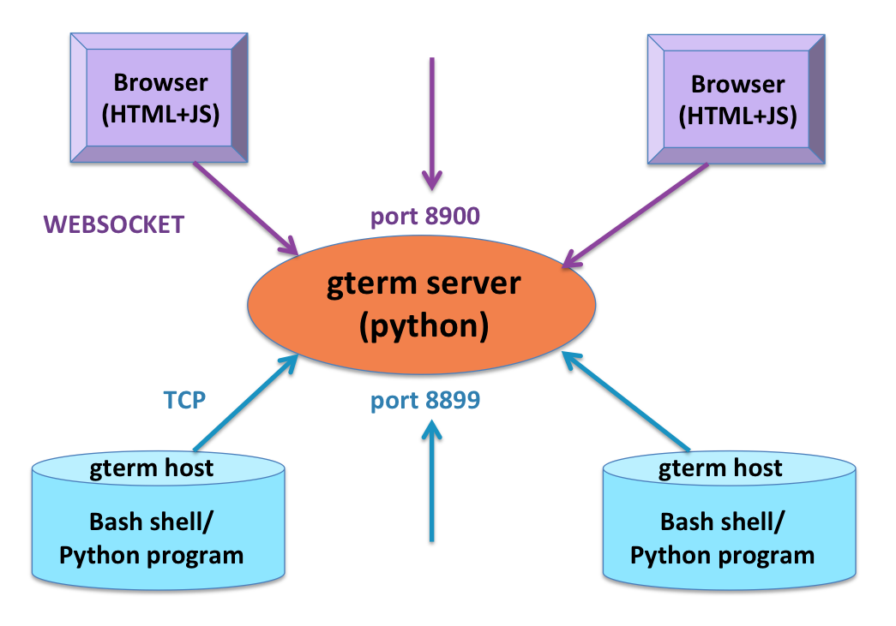
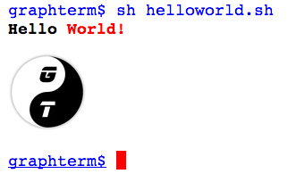
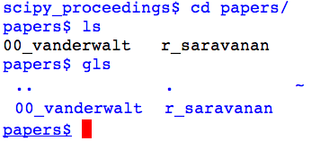
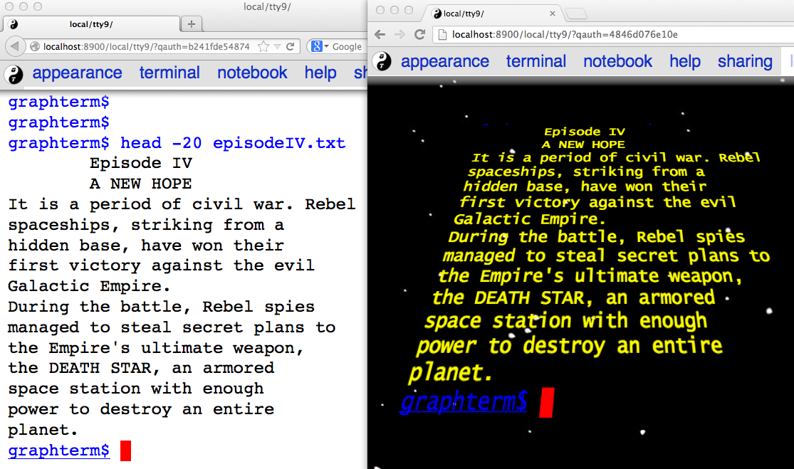
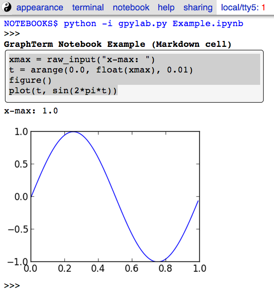
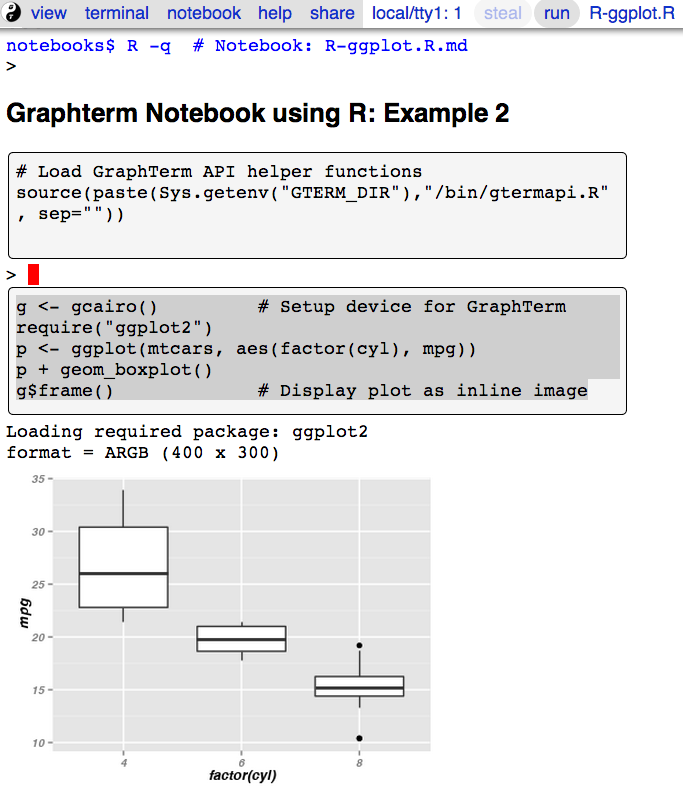

:author: Ramalingam Saravanan
:email: sarava@tamu.edu
:institution: Texas A&M University

:video: http://www.youtube.com/watch?v=nO0ceHmTlDQ

---------------------------------------------------------------------------------------------------------
 GraphTerm: A notebook-like graphical terminal interface for collaboration and inline data visualization
---------------------------------------------------------------------------------------------------------

.. class:: abstract

  The notebook interface, which blends text and graphics, has been in
  use for a number of years in commercial mathematical software and is
  now finding more widespread usage in scientific Python with the
  availability browser-based front-ends like the Sage and IPython
  notebooks. This paper describes a new open-source Python project,
  GraphTerm, that takes a slightly different approach to blending text
  and graphics to create a notebook-like interface. Rather than
  operating at the application level, it works at the unix shell level
  by extending the command line interface to incorporate elements of
  the graphical user interface. The XTerm terminal escape sequences
  are augmented to allow any program to interactively display inline
  graphics (or other HTML content) simply by writing to standard
  output.

  GraphTerm is designed to be a drop-in replacement for the standard
  unix terminal, with additional features for multiplexing sessions
  and easy deployment in the cloud. The interface aims to be
  tablet-friendly, with features like clickable/tappable directory
  listings for navigating folders etc. The user can switch, as needed,
  between standard line-at-a-time shell mode and the notebook mode,
  where multiple lines of code are entered in cells, allowing for
  in-place editing and re-execution. Multiple users can share terminal
  sessions for collaborative computing.

  GraphTerm is implemented in Python, using the Tornado web framework
  for the server component and HTML+Javascript for the browser
  client. This paper discusses the architecture and capabilities of
  GraphTerm, and provides usage examples such as inline data
  visualization using matplotlib and the notebook mode.

.. class:: keywords

   GUI, CLI, graphical user interface, command line
   interface, notebook interface, graphical shell

Introduction
------------

Text and graphics form important components of the user interface
when working with computers. Early personal computers only supported
the textual user interface, more commonly known as the *command line
interface* (CLI). However, when the Apple Macintosh popularized the
*graphical user interface* (GUI), it soon became the preferred means
for interacting with the computer. The GUI is more user-friendly,
especially for beginners, and provides a more pleasant visual
experience. The GUI typically provides buttons and widgets for the
most common tasks, whereas the CLI requires recalling and typing out
commands to accomplish tasks. However, the friendliness
of the GUI comes at a cost |---| it can be much more difficult to perform
advanced tasks using the GUI as compared to using the CLI. Using a GUI
is analogous to using a phrase book to express yourself in a foreign
language, whereas using a CLI is like learning words to form new
phrases in the foreign language. The former is more convenient for
first-time and casual users, whereas the latter provides the versatility
required by more advanced users.

The dichotomy between the textual and graphical modes of interaction
also extends to scientific data analysis tools. Traditionally,
commands for data analysis were typed into a terminal window with an
interactive shell and the graphical output was displayed in a separate
window. Some commercial software, such as Mathematica and Maple,
provided a more integrated notebook interface that blended text and
graphics, thus combining aspects of the CLI with the GUI. One of the
exciting recent developments in scientific Python has been the
development of alternative, open source, notebook interfaces for
scientific computing and data analysis |---| the Sage and IPython
notebooks [Perez12]_. Since Python is a more general-purpose language
than Mathematica or Maple, the notebook interface could potentially
reach a much wider audience.

A notebook display consists of a sequence of cells, each of which can
contain code, figures, or text (with markup). Although originally
developed for exploratory research, notebooks can be very useful
for presentations and teaching as well. They can provide step-by-step
documentation of complex tasks and can easily be shared. The cells in
a notebook do not necessarily have to be executed in the sequence in
which they appear. In this respect, the notebook interface can be
considered an expression of "literate programming", where snippets of
code are embedded in natural language documentation that explains what
the code does [Knuth84]_.

Another emerging area where the notebook interface could serve as an
important tool is *reproducible research* [Stodden13]_. As
computational techniques are increasingly being used in all areas of
research, reproducing a research finding requires not just the broad
outline of the research methodology but also documentation of the
software development environment used for the study. The need for
reproducible research is highlighted by the recent controversy
surrounding the highly influential Reinhart-Rogoff study that
identified a negative relationship between a country's debt and its
economic growth rate. A follow-up study [Herndon13]_ identified a
simple coding error that affects key findings of the original study.
The self-documenting nature of code and results presented in a
notebook format can make it easy to share and reproduce
such computations.

Background
------------

The author had some experience with commercial notebook interfaces before, but
used the IPython Notebook interface for the first time in January 2013, when
teaching an introductory undergraduate programming course for
geoscientists using Python. After initially using the command line
Python interpreter, the class switched to using IPython Notebook, whose inline code editing and
graphics display turned out to be really convenient. The notebook
interface was used for presenting lecture material, and
the students used it for their programming assignments,
turning in their notebooks for grading (in PDF format) .

The author had previously been working on a project called GraphTerm,
which implements a "graphical
terminal interface" using a Python backend and a HTML5+Javascript
frontend [GraphTerm]_. It was a follow-up to two earlier projects, the
browser-based AjaxTerm, and XMLTerm, a GUI-like browser built
using the Mozilla framework [Sarava00]_. GraphTerm is aimed at being
a drop-in replacement for XTerm, the standard unix terminal, with
additional graphical and collaborative features. It retains all the
features of the CLI, including pipes, wildcards, command recall, tab
completion etc., and also incorporates web-based sharing, as well as
GUI-like features, such as clickable folder navigation, draggable
files, inline image display etc. (There also other terminal projects
with similar goals, such as `TermKit
<http://acko.net/blog/on-termkit>`_ for OS X and `Terminology
<http://www.enlightenment.org/p.php?p=about/terminology>`_ for Linux.)

The distinctive features of the notebook interface, such as inline
editing and graphics, are not specific to any particular programming
language or interactive shell. Also, the GraphTerm code already had
the capability to incorporate GUI-like features into the terminal.
Therefore, it seemed worth experimenting with GraphTerm to see how far
it could be extended to support a generic, language-independent,
notebook interface, while still retaining *full backward
compatibility* with the unix terminal. The goal was to allow the
terminal to be switched to a notebook mode, regardless of what
application was running in the shell. The backward compatibility
requirements and the loose coupling between the notebook and the
underlying application could make it more fragile and restricted, but
that would be an unavoidable trade-off. The rest of this paper reports
on the results of this effort to combine the CLI, GUI, and the
notebook interface.

Implementation
-----------------

The standard unix terminal supports two types of buffers: (i) the
normal *scroll buffer* that contains lines of text, and (ii) the *full
screen buffer* used by text editors like ``vi`` etc. Special character
strings known as *escape sequences* are output by programs to switch
the terminal between the two buffers [XTerm]_. GraphTerm currently supports
most of the standard XTerm escape sequences and introduces
additional escape sequences that allow display of HTML fragments in the
scroll buffer and the full screen buffer. The HTML fragments can
contain just about anything that can be displayed on a web page,
including text with markup, tables, and images.

The GraphTerm server is written in pure python, using the `Tornado web
framework <http://tornadoweb.org>`_, with websocket support. The
browser client uses standard HTML5+Javascript+CSS (with
jQuery). The code is released under the BSD License and the
repository is available on `Github
<https://github.com/mitotic/graphterm>`_.

The GraphTerm server may be run on the desktop or on a remote
computer. Users create and access terminal sessions by the connecting
to the Graphterm server on the default port 8900, either directly or
through SSH port forwarding (Figure :ref:`archfig`).  By default, the
localhost on the computer where the GraphTerm server is running is
available for opening terminal sessions. Other computers can also
connect to the GraphTerm server, on a different port (8899), to make
them accessible as hosts for connection from the browser.

   Architecture of GraphTerm. Browser client connects to Tornado
   server using websockets. Hosts connect to server using TCP. :label:`archfig`

A pseudo-tty (``pty``) device is opened on the host for each terminal
session. By setting the ``PROMPT_COMMAND`` environment variable,
GraphTerm determines when the standard output of the previous command ends,
and the prompt for the new command begins. The connection between
the browser and the GraphTerm server is implemented using websockets
(bi-directional HTTP). The GraphTerm server acts as a router sending
input from controlling browser terminal sessions to the appropriate
``pty`` on the host computer, and transmitting output from each
``pty`` to all connected browser terminal sessions.

All the scroll buffer and full screen buffer content is stored on the
server, which means that the terminal is persistent across different
browser sessions. For example, you can leave the terminal on your
desktop computer at work and access the exact same content on your
laptop browser when you get home. This allows GraphTerm to be used
like the GNU ``screen`` or ``tmux`` programs. Storing the content on
the server also allows multiple users to share access to the same
terminal session for collaboration, similar to, e.g., Google Docs.
This means that multiple users will be able to view and modify a GraphTerm
notebook session in real time.

The GraphTerm API
-------------------------

Programs running within a GraphTerm shell communicate with it by
writing to its standard output a block of text using a format
similar to a HTTP response, preceded and followed by XTerm-like
escape sequences::

   \x1b[?1155;<cookie>h
   {"content_type": "text/html", ...}

   

   ...
   

   \x1b[?1155l

where ``<cookie>`` denotes a numeric value stored in the environment
variable ``GTERM_COOKIE``. This random cookie is a security
measure that prevents malicious files from accessing GraphTerm.  The
opening escape sequence is followed by an *optional* dictionary of
header names and values, using JSON format. This is followed by a
blank line, and then any data (such as the HTML fragment to be
displayed).

A simple bash shell script, ``hello_world.sh``, illustrates this API:

.. code-block:: bash

   #!/bin/bash
   # A Hello World program using the GraphTerm API

   prefix=https://raw.github.com/mitotic/graphterm
   url=$prefix/master/graphterm/www/GTYY500.png
   esc=`printf "\033"`
   code="1155"
   # Prefix escape sequence
   echo "${esc}[?${code};${GTERM_COOKIE}h"
   # Display text with HTML markup
   echo '<b>Hello</b>'
   echo '<b style="color: red;">World!</b>
'
   # Display inline image
   echo ""
   # Suffix escape sequence
   echo "${esc}[?${code}l"

If run within GraphTerm, the script produces the output shown in
Figure :ref:`logofig`.

   Output of ``helloworld.sh`` within GraphTerm, showing inline HTML
   text and image. :label:`logofig`

Features
---------------

GraphTerm is written in pure Python and the only dependency is the
``tornado`` web server module. It can be installed using
``easy_install`` or ``setuptools``. Once the GraphTerm server program
is started, it listens on port 8900 on ``localhost`` by default, and
any browser can be used to connect to it and open new terminal
sessions using the URL ``http://localhost:8900``.  At this point,
GraphTerm can be used like a regular terminal, with commands like
``ls``, ``vi``, etc. However, to use the graphical capabilities of
GraphTerm, one needs to use GraphTerm-aware versions of these commands,
with names like ``gls`` and ``gvi``, that are part of the command toolchain that is
bundled with the code. The toolchain commands communicate using pipes
and may be written any language,
e.g., Bash shell script, Python etc., using the API
described above. The GUI-like features of GraphTerm implemented using
this toolchain are discussed and illustrated below.

Clickable folders and files
========================================

The output of the standard ``ls`` command displays the directory
listing as plain text, whereas the ``gls`` command from the toolchain
displays a hyperlinked ("clickable") directory listing (Figure :ref:`lsfig`).

   Output of ``ls`` and ``gls`` commands for the same directory.
   The names displayed by ``gls`` are hyperlinked, and may be clicked
   to navigate to a folder or open a file. :label:`lsfig`

By default, ``gls`` does not display icons or images in the directory
listing. However, icon display can be enabled  using the GraphTerm
menubar (Figure :ref:`glsfig`).

.. figure:: scipy-fig-gls.png
   :scale: 22%

   Output of ``gls`` with icon display enabled. Clicking on the folder
   icon for ``00_vanderwalt`` (red rectangle) executes the command
   ``cd 00_vanderwalt; gls -f`` via the command line (green rectangle)
   to navigate to the folder and list its directory contents. (This
   action also overwrites any immediate previous file navigation
   command in the GraphTerm command history, to avoid command
   clutter.) :label:`glsfig`

You can navigate folders in GraphTerm using GUI-like actions, like you
would do in the Windows Explorer or the Mac Finder, while retaining
the ability to drop back to the CLI at any time.  If the current
command line is empty, clicking on a hyperlinked folder will insert a
new command line of the form::

   cd newdir; gls -f 

which will change the current directory to ``newdir`` and list its
contents. Clicking on a hyperlinked filename will generate a new
command line to invoke
platform-dependent commands like ``open`` or ``xdg-open`` to open
the file using the default program for its file type. This feature illustrates one of the basic design goals
of GraphTerm, that each GUI-like action should generate a
corresponding shell command that actually carries out that
action. This allows the action to be logged and reproduced later.

Drag and drop
========================================

GraphTerm currently provides limited support for drag-and-drop
operations, including support for uploading/copying files between
terminal sessions on different computers connected to the same
GraphTerm server. As shown in Figure :ref:`mvfig`, when a file is
dragged from the source terminal and dropped into a folder displayed
in the destination terminal, a ``mv`` command is generated to perform
the task. Thus the GUI action is recorded in the command line for
future reference.

.. figure:: scipy-fig-mv.png
   :scale: 40%

   File ``fig2.png`` is dragged from the ``Downloads`` folder from the
   source terminal and dropped into the ``.`` (current directory)
   folder icon displayed by ``gls`` in the destination terminal. This
   executes the command ``mv /user/rsarava/Downloads/fig2.png .`` in the
   destination terminal to move the file. :label:`mvfig`

Session sharing and theming
========================================

   Two shared views of a GraphTerm terminal session showing the output of the
   command ``head -20 episodeIV.txt`` on a computer running OS X
   Lion. The left view is in a Firefox window with the **default** theme
   and the right view shows the same terminal in a Chrome window,
   using the **stars3D** perspective theme (which currently does not work on
   Firefox).  :label:`themefig`

GraphTerm terminal sessions can be shared between multiple computers,
with different types of access levels for additional users accessing
the same terminal, such as read-only access or full read-write
access. Since a GraphTerm terminal session is just a web page, it also
supports theming using CSS stylesheets. The terminal sharing and
theming are decoupled, which means that two
users can view the same terminal using different themes (Figure :ref:`themefig`)!

Inline graphics
========================================

Since GraphTerm can display arbitrary HTML fragments, it is easy to
display graphical output from programs. The ``gimage`` command in the
toolchain can be used to display inline images. The toolchain also
includes the ``yweather`` command to display the current weather
forecast graphically using the Yahoo Weather API. Other toolchain
commands include ``glandslide`` to use the Python-based `landslide
<https://github.com/adamzap/landslide>`_ presentation tool and
``greveal`` that uses `reveal.js <http://lab.hakim.se/reveal-js>`_ to
display slideshows within a GraphTerm window.

GraphTerm can be used for inline display of graphical output from
``matplotlib`` (Figure :ref:`contourfig`). The API bundled with
GraphTerm uses the ``StringIO`` module to capture the binary plot data
using the ``png`` image output produced by the ``Agg`` renderer and
then displays the image using GraphTerm escape sequences. A module
called ``gmatplot`` is supplied with GraphTerm to provide explicit
access to this plotting API. Another module ``gpylab`` is also
provided, for *monkey patching* existing plotting code to work within
GraphTerm with little or no changes. For example, if the Python
interpreter is invoked using the following command::

   python -i $GTERM_DIR/bin/gpylab.py

then ``pylab`` functions like ``draw``, ``figure``, and ``show`` will
automatically use the Graphterm API to display inline graphics (e.g.
see the notebook example shown in Figure :ref:`nb1fig`).

.. figure:: scipy-fig-contourplot.png
   :scale: 27%

   Inline display of a 2-dimensional filled contour plot of surface
   air temperature on the globe, generated by ``matplotlib``. The code
   for this plot is taken from the textbook by
   [Lin12]_. :label:`contourfig`

Since communication with GraphTerm occurs solely via the standard
output of a program, inline graphics can be displayed from any
plotting program, including commercial software like IDL and other
plotting packages like the NCAR Command Language (NCL). Inline
graphics display can also be used across SSH login boundaries by
including support for the GraphTerm API in the plotting program on the
remote machine.

Notebook mode
--------------------------------------------------------

GraphTerm can be switched from the normal terminal mode to a blank
notebook mode using the key sequence *Shift-Enter* or using the
menubar. The user can also click on a notebook file displayed in the
``gls`` directory listing to open it and pre-fill the notebook cells
with content from the file (Figure :ref:`nb1fig`). The notebook mode supports the normal
terminal operations, such as reading from the standard input (i.e.,
``raw_input`` in Python) and using debuggers, as well as GraphTerm
extensions like inline graphics. (Full screen terminal operations are
not supported in the notebook mode.)

   GraphTerm notebook mode, where the notebook contents are read from
   a file saved using the ``ipynb`` format. The first cell contains
   Markdown text and the second cell contains python code to generate
   a simple plot using ``matplotlib``. Note the use of ``raw_input`` to
   prompt the user for terminal input. :label:`nb1fig`

Users can save the contents of the
displayed notebook to a file at any time. Users exit the
notebook mode and revert to the normal terminal mode using the menubar
or simply by typing *Control-C*. When exiting the notebook mode,
users can choose to either merge all the notebook content back
into the terminal session or discard it (Figure :ref:`nb2fig`).

.. figure:: scipy-fig-nb2.png
   :scale: 43%

   When switching back to the terminal mode after exiting the notebook
   mode, the notebook contents can either be discarded or be appended like
   normal terminal output, as shown above. :label:`nb2fig`

The notebook implementation in GraphTerm attempts to preserve
interoperability with the IPython Notebook to the extent possible.
GraphTerm can read and write notebooks using the IPython Notebook
format (``*.ipynb``), although it uses the `Markdown
<http://daringfireball.net/projects/markdown>`_ format for saving
notebook content. (Markdown was chosen as the native format because it
is more human-friendly than ReStructuredText or JSON, allows easy
concatenation or splitting of notebook files, and can be processed by
numerous Markdown-aware publishing and presentation programs like
``landslide`` and ``reveal.js``. ) GraphTerm 
supports many of the same keyboard shortcuts as IPython
Notebook. GraphTerm can also be used with the command-line version
of IPython. However, the generic, loosely-coupled notebook interface
supported by GraphTerm will never be able to support all the features
of IPython Notebook.
 
Here is how the notebook mode is implemented within GraphTerm: when
the user switches to the notebook mode, a separate scroll buffer is
created for each cell.  When the user executes a line of code within a
GraphTerm notebook cell, the code output is parsed for prompts to
decide whether to continue to display the output in the output cell,
or to return focus to the input cell. This text-parsing approach does
make the GraphTerm notebook implementation somewhat fragile, compared
to other notebook implementations that have a tighter coupling with
the underlying code interpreter (or kernel). However it allows
GraphTerm to work with interactive shells for any
platform, such as ``R`` (Figure :ref:`nb3fig`)
(or any interactive program with prompts, including closed source
binaries for languages like IDL).

   Inline graphics in notebook mode when running the standard R
   interpreter within GraphTerm. :label:`nb3fig`

Since all GraphTerm content is stored on the server, the notebook can
be accessed by multiple users simultaneously for collaboration. Like
inline graphics, the notebook mode works transparently when executing
interactive shells after a remote SSH login, because all communication
takes place via the standard output of the shell. The non-graphical
notebook mode can be used without the remote program ever being aware
of the notebook interface. However, the remote program will need to
use the GraphTerm escape sequences to display inline graphics within the notebook.

Conclusion
---------------

The GraphTerm project extends the standard unix terminal to support
many GUI-like capabilities, including inline graphics display for data
analysis and visualization.  Adding features like clickable folder
navigation to the CLI also makes it more touch-friendly, which is
likely to be very useful on tablet computers.  Incorporating GUI
actions within the CLI allows recording of many user actions as
scriptable commands, facilitating reproducibility.

GraphTerm also
demonstrates that the notebook interface can be implemented as an
extension of the CLI, by parsing the textual output from interactive
shells. This allows the notebook interface to be "bolted on" to any
interactive shell program and to be used seamlessly even across SSH
login boundaries. The notebook features and the real-time session
sharing capabilities could make GraphTerm an useful tool for
collaborative computing and research.

References
----------

.. [GraphTerm] *GraphTerm home page* http://code.mindmeldr.com/graphterm

.. [Herndon13] T. Herndon, M. Ash, and R. Pollin.
   *Does High Public Debt Consistently Stifle Economic Growth? A Critique of Reinhart and Rogoff*
   http://www.peri.umass.edu/fileadmin/pdf/working_papers/working_papers_301-350/WP322.pdf

.. [Knuth84] D. Knuth. *Literate Programming.*
   The Computer Journal archive.
   Vol. 27 No. 2, May 1984, pp. 97-111 
   http://literateprogramming.com/knuthweb.pdf

.. [Lin12] J. Lin.
   *A Hands-On Introduction to Using Python in the Atmospheric and
   Oceanic Sciences* [Chapter 9, Exercise 29, p. 162]
   http://www.johnny-lin.com/pyintro

.. [Perez12] F. Perez. *The IPython notebook: a historical retrospective.*
   Jan 2012 http://blog.fperez.org/2012/01/ipython-notebook-historical.html

.. [Sarava00] R. Saravanan. *XMLterm: A Mozilla-based Semantic User Interface.*
    XML.com, June 2000 http://www.xml.com/pub/a/2000/06/07/xmlterm/

.. [Stodden13] V. Stodden, D. H. Bailey, J. Borwein, R. J. LeVeque, W. Rider, and W. Stein.
   *Setting the Default to Reproducible:*
   *Reproducibility in Computational and Experimental Mathematics.*
   February 2013 http://stodden.net/icerm_report.pdf

.. [XTerm] *XTerm Control Sequences* http://invisible-island.net/xterm/ctlseqs/ctlseqs.html

