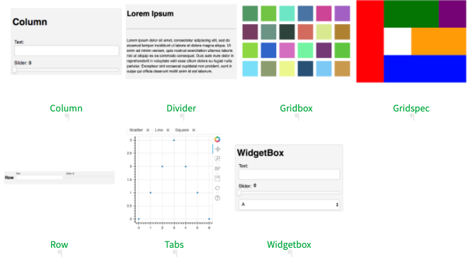
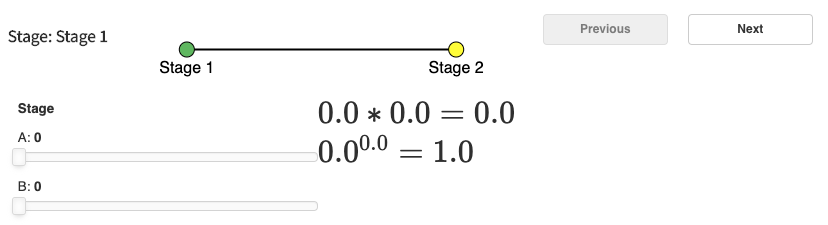
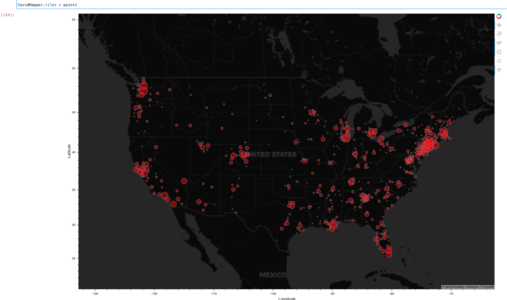
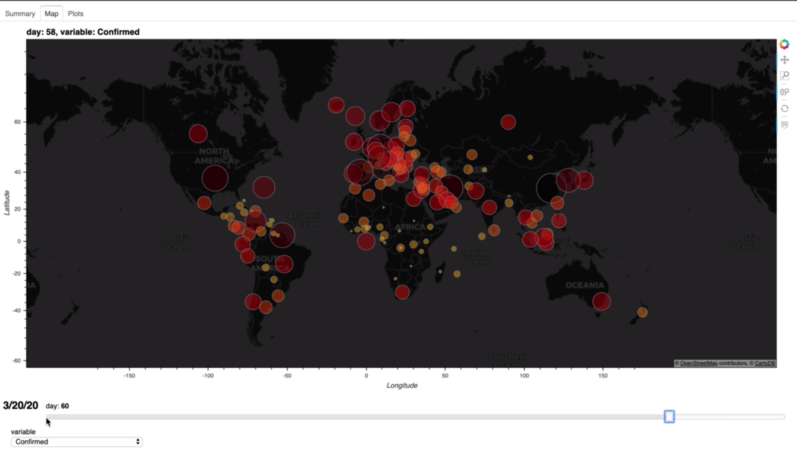
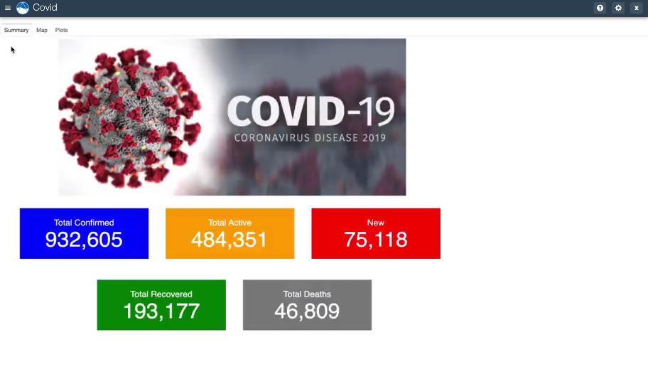

:author: Scott Christensen
:email: scott.d.christensen@usace.army.mil
:institution: US Army Engineer Research and Development Center
:corresponding:

:author: Marvin Brown
:email: marvin.s.brown@usace.army.mil
:institution: US Army Engineer Research and Development Center

-------------------------------------------------------------------------
Prototype to Production: Python Tools for Rapid Web Interface Development
-------------------------------------------------------------------------

.. class:: abstract

   Taking a powerful and complex Python workflow to the next level as an interactive web application can make a huge difference in its utility and ability to communicate results. The enhanced capabilities of open-source Python libraries have made making the jump from Jupyter notebooks to production-ready web applications easier than ever. This talk will demonstrate how prototyping a web application can begin in right in the notebook environment and then easily be deployed as a stand-alone web application with Panel. We then show how Panel apps can be transitioned to fully-featured web app in Tethys Platform.

.. class:: keywords

   web apps, Panel, Tethys Platform, Holoviz

Introduction
------------
Python has become a standard for orchestrating complex scientific workflows, which are commonly used to inform decision makers. However, the utility of those workflows is limited when results are delivered as printed reports that evaluate only a limited number of options and try to communicate complex data with a few static figures. Web applications provide a non-technical decision maker with the ability to gain greater insight from a technical scientific workflow by allowing them to explore more scenarios and by providing interactive visualizations. However, developing customized web applications in a rapidly evolving research environment is challenging. This talk will show how several open-source Python projects can be used to enable rapidly prototyping web-based interfaces in a Jupyter notebook, deploying those interfaces as standalone web-apps, and then transitioning those apps into a production ready platform, and is intended for those that need to deliver technical Python workflows to non-technical decision makers.

The next section provides some background on the core tools that are leveraged and enhanced to create the rapid prototyping capability. That is followed by the Methods section which will describe how those core tools were enhanced and chained together to create a pipeline of tools for taking a prototype to production. The Results section will describe how those tools were used to create a sample web application to analyze and explore COVID-19 data. Finally, the conclusion will provide some discussion and discuss future work that can continue to enhance how these tools integrate.

Background
----------
The workflow described in this paper leverages several existing open source tools. This section provides a brief background on those tools.

Jupyter notebooks are a commonly used as a starting point for scientific workflows because it is an open source tool that integrates code, interactive visualizations, and documentation in a sharable and reproducible way. The notebook environment is ideal for quickly iterating and prototyping scripts and visualizations.

The Holoviz tool stack is designed to integrate into the Jupyter notebook environment and work similarly to IPywidgets. While Holoviz interoperates with many different plotting libraries to create interactive visualizations it is closely tied to Bokeh both as a plotting library and backend server. This connection to Bokeh enables visualizations that were created in a notebook environment to be deployed with Bokeh independent of the notebook. This capability is ideal for a more polished and mature workflow that can be presented independent of the code that created it.

Tethys Platform is a Python-based framework for developing scientific web applications that is built on top of Django. While it was originally created to support the needs of water resources web applications it has very flexible and powerful computational and visualization tools that meet the needs of many scientific web applications. The goal of Tethys Platform is to lower the barrier to deploying web applications for scientists and engineers.

Methods
-------
This section describes how existing tools were enhanced and new tools created to enable to prototype to production workflow.

The Holoviz tool stack while providing many interactive widgets and plots lacked the flexibility in controlling the layout and in integrating other elements into a dashboard. We collaborated with the Holoviz team at Anaconda to add a new library to the Holoviz stack called Panel. Panel allows much more control over how elements are organized. It provides several tools for controlling layout including nested rows and columns, grids, tabs, and widget boxes :ref:`fig1`. Panel continues to be actively developed and had gained wide community support; thus, additional features continue to be added.

   This illustrates the various layout tools provided by the Panel library. :label:`fig1`

Additionally, Panel also provides Pipelines, which supports creating multi-step workflows :ref:`fig2`. Many scientific workflows require various stages of user interaction/input and pipelines allows multiple dashboards and visualizations to be strung together in sequence to support these types of workflows.

   This demonstrates how multiple stages can be sequenced together using Panel Pipelines. :label:`fig2`

The creation of Panel in the Holoviz tool stack accomplished the goal of supporting very customizable and flexible dashboards that can be pieced together in a notebook environment and then transitioned to an independent web application deployed with Bokeh. However, we wanted to continue to the transition into a production environment. To this end, we enabled the integration of Bokeh with Tethys Platform.

We worked with Anaconda to enable the Bokeh server to be integrated with Django Channels, the web socket backend for Django. This integration allows Bokeh applications (including those created with Panel) to be hosted and embedded in a Django-backed website. We also worked with Aquaveo to add support for Django Channels in Tethys Platform and to enable easy integration of Bokeh and Panel apps.

By integrating Panel apps into git Tethys, we can then leverage the many tools that Tethys provides including user management and permissions, easy database serialization, and the powerful compute API that supports farming out compute jobs to HTCondor, Dask, and (through a plugin) the DoD research HPC systems. These additional features of Tethys make it an ideal platform for deploying production ready scientific workflows.

The creation of Panel and the integration of Bokeh with Tethys creates a well-established pattern for transitioning from Jupyter notebooks to polished, production web applications in Tethys Platform.

Results
-------
We have now created several web applications for complex numerical modeling workflows and data analysis. As an example case we will demonstrate how an interactive visualization exploration dashboard for COVID-19 data were created into a web application. As a first step, and as is customary in scientific workflows, we first explored the data using a Jupyter notebook :ref:`fig3`

   Exploring COVID-19 data using Holoviz tools in a Jupyter Notebook. :label:`fig3`

Panel enabled us to create interactive widgets in the notebooks where were grouped and refined into a series of dashboards. In this case we grouped the dashboard using as tabs and were able to launch them as a standalone Bokeh app :ref:`fig4`.

   The visualizations first developed using Panel in a Jupyter Notebook are launched as a standalone app with Bokeh. :label:`fig4`

As a final step, using the same Panel code that is deployed with Bokeh, we created a Tethys App that adds additional functionality including user management, and an API for accessing computation resources :ref:`fig5`. Additionally, Tethys Platform is designed for production deployments.

   The Covid-19 Bokeh app is embedded in a Tethys app to provide a more polished and fully-featured web app.

Conclusion
----------
The development of web apps from Jupyter to Tethys has opened the door for rapid prototyping scientific web applications and easily transitioning them to production without needing a complete rewrite. These tools have come a long way and enabled many possibilities, but there are additional enhancements that are needed. Panel is a fast maturing library that is very capable and has had quick adoption, but it is still new and needs refining. Additionally, while Tethys Platform is capable of embedding a Bokeh app as is, it is more powerfully leveraged by transitioning several elements of a Panel-based application into the Tethys backend. At this point only some aspects of a Panel application can be transitioned to Tethys counterparts. There are more integrations that could make transitioning from panel to Tethys even easier.
