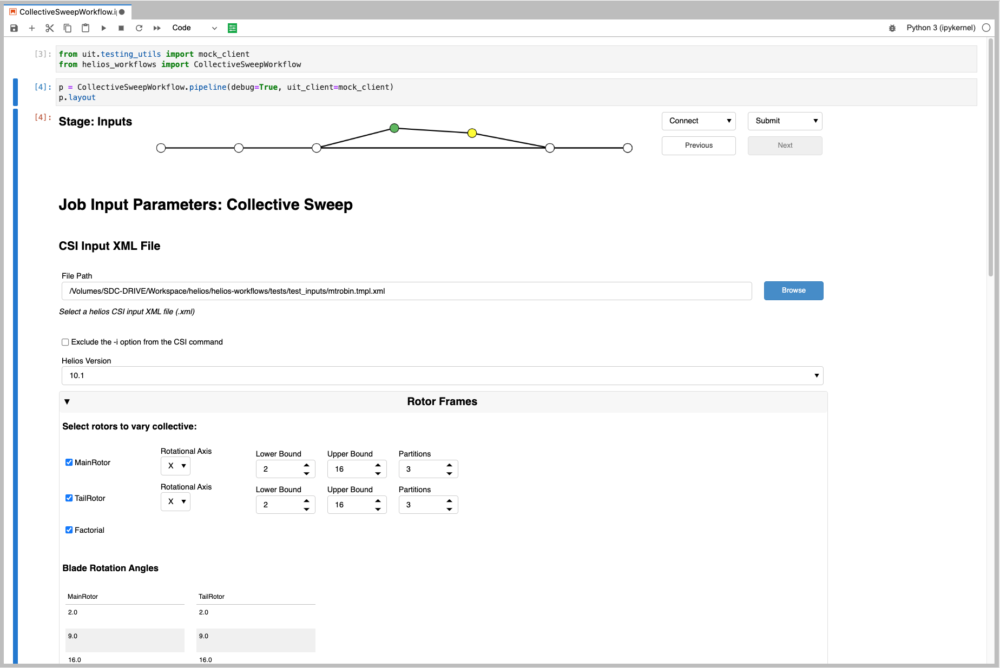
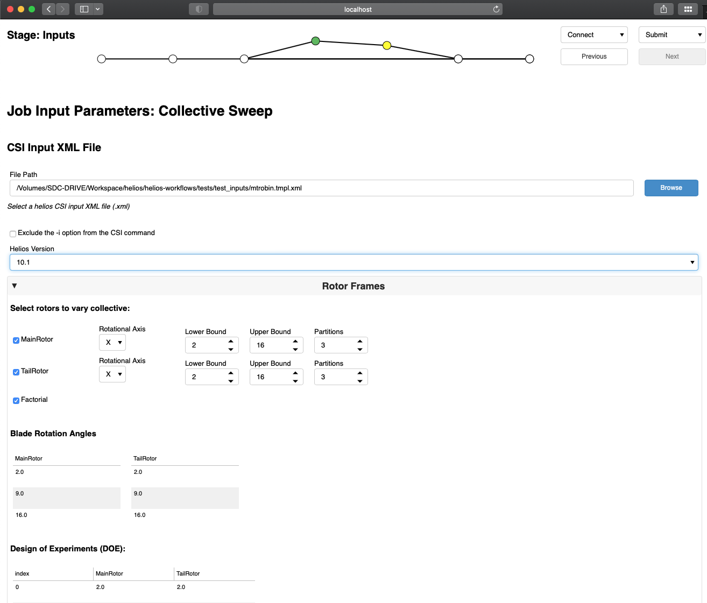
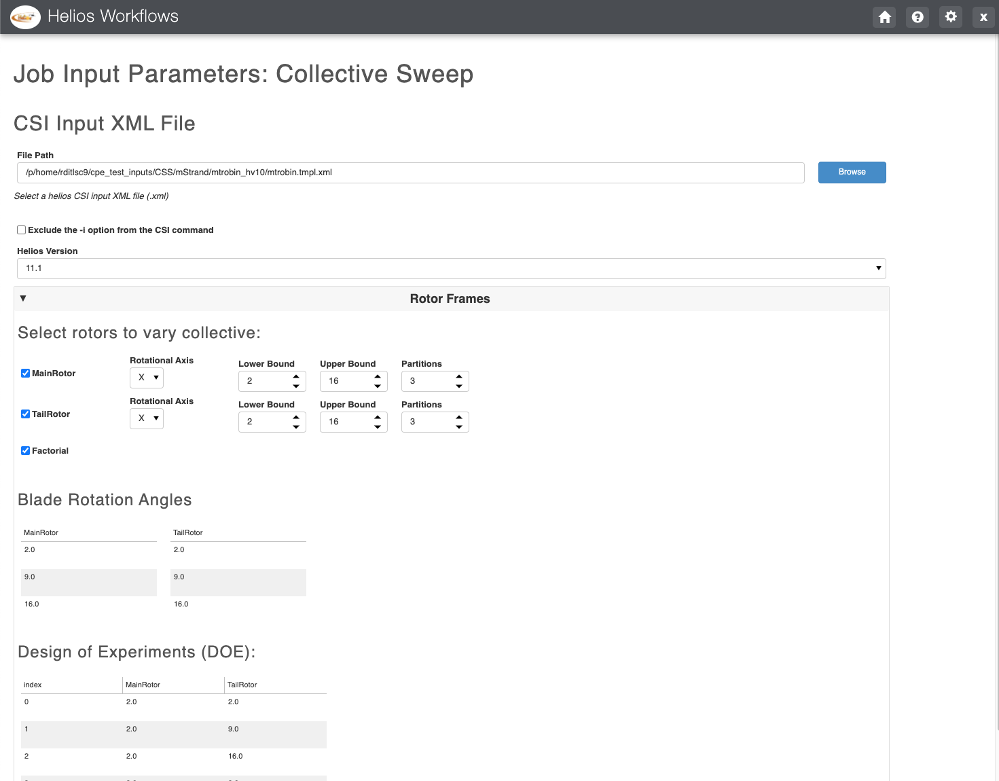
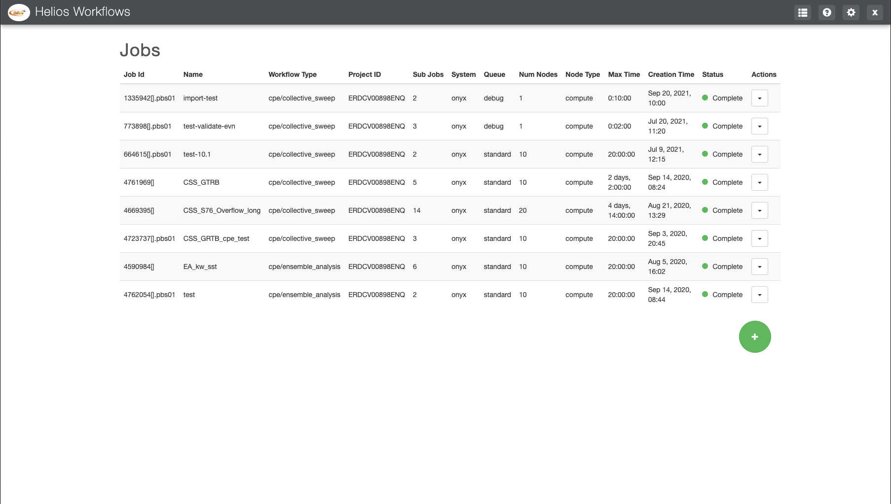
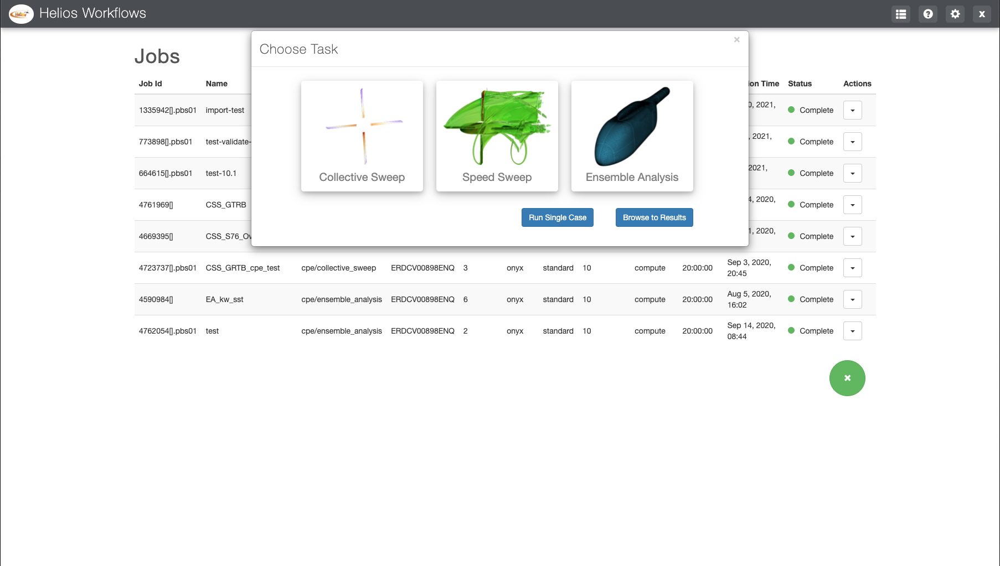
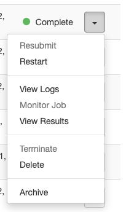
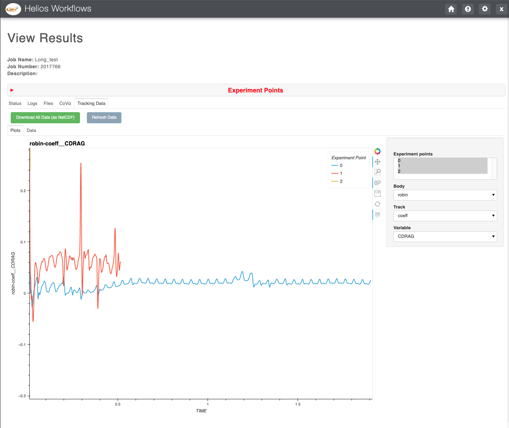
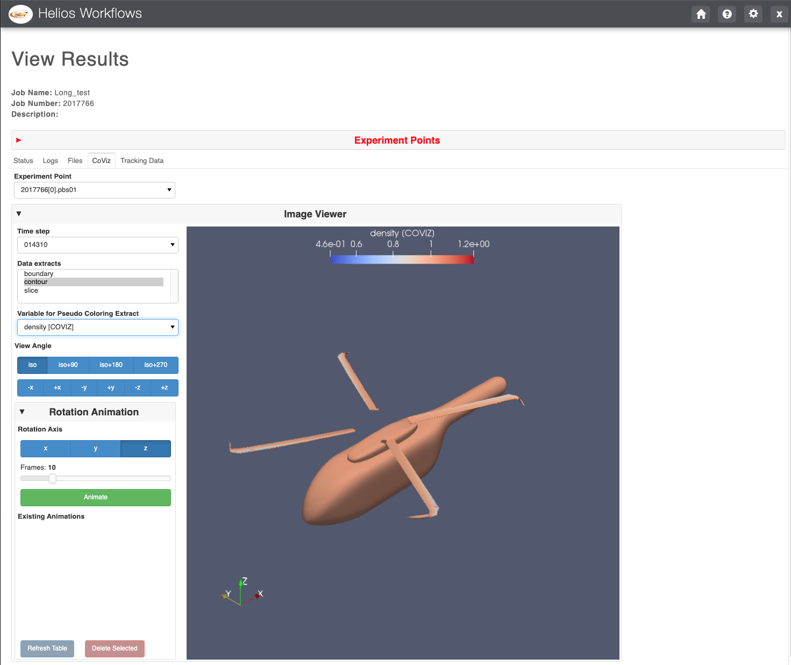

:author: Scott D. Christensen
:email: Scott.D.Christensen@usace.army.mil
:institution: US Army Engineer Research and Development Center

:author: Marvin S. Brown
:email: Marvin.S.Brown@usace.army.mil
:institution: US Army Engineer Research and Development Center

:author: Robert B. Haehnel
:email: Robert.B.Haehnel@usace.army.mil
:institution: US Army Engineer Research and Development Center

:author: Joshua Q. Church
:email: Joshua.Q.Church@usace.army.mil
:institution: US Army Engineer Research and Development Center

:author: Amanda Catlett
:email: Amanda.Reeder@usace.army.mil
:institution: US Army Engineer Research and Development Center

:author: Theresa Coumbe
:email: Theresa.Coumbe@usace.army.mil
:institution: US Army Engineer Research and Development Center

:author: Dallon C. Schofield
:email: Dallon.C.Schofield@usace.army.mil
:institution: US Army Engineer Research and Development Center

:author: Quyen T. Brannon
:email: Quyen.T.Dong@usace.army.mil
:institution: US Army Engineer Research and Development Center

:author: Stacy T. Smith
:email: Stacey.T.Smith@usace.army.mil
:institution: US Army Engineer Research and Development Center

---------------------------------------------------------
A Python Pipeline for Rapid Application Development (RAD)
---------------------------------------------------------
 
.. class:: abstract

Rapid Application Development (RAD) is the ability to rapidly prototype an interactive
interface through frequent feedback, so that it can be quickly deployed and delivered to stakeholders
and customers. RAD is a critical capability needed to meet the ever-evolving demands in scientific
research and data science. To further this capability in the Python ecosystem, we have curated and
developed a set of open-source tools, including Panel, Bokeh, and Tethys Platform. These tools enable
prototyping interfaces in a Jupyter Notebook and facilitate the progression of the interface into
a fully-featured, deployable web-application.

.. class:: keywords

   web app, Panel, Tethys, Tethys Platform, Bokeh, Jupyter

Introduction
------------

With the tools for data science continually improving and an almost innumerable supply of new data sources, there are seemingly endless opportunities to create new insights and decision support systems. Yet, an investment of resources are needed to extract the value from data using new and improved tools. Well-timed and impactful proposals are necessary to gain the support and resources needed from stakeholders and decision makers to pursue these opportunities. The ability to rapidly prototype capabilities and new ideas provides a powerful visual tool to communicate the impact of a proposal. Interactive applications are even more impactful by engaging the user in the data analysis process.

After a prototype is implemented to communicate ideas and feasibility of a project, additional success is determined by the ability to produce the end product on time and within budget. If the deployable product needs to be completely re-written using different tools, programing languages, and/or frameworks from the prototype, then significantly more time and resources are required. The ability to quickly mature a prototype to production-ready application using the same tool stack can make the difference in the success of a project.

Background
----------

At the US Army Engineer Research and Development Center (ERDC) there are evolving needs to support the missions of the US Army Corps of Engineers and our partners. The scientific Python ecosystem provides a rich set of tools that can be applied to various data sources to provide valuable insights. These insitghts can be integrated into decision support systems that can enhance the information available when making mission critical decisions. Yet, while the opportunities are vast, the ability to get the resources necessary to pursue those opportunities requires effective and timely communication of the value and feasibility of a proposed project.

We have found that rapid prototyping is a very impactful way to concretely show the value that can be obtained from a proposal. Moreover, it also illustrates with clarity that the project is feasible and likely to succeed. Many scientific workflows are developed in Python, and often the prototyping phase is done in a Jupyter Notebook. The Jupyter environment provides an easy way to quickly modify code and visualize output. However, the visualizations are interlaced with the code and thus it does not serve as an ideal way demonstrate the prototype to stakeholders, that may not be familiar with Jupyter Notebooks or code. The Jupyter Dashboard project was addressing this issue before support for it was dropped in 2017. To address this technical gap, we worked with the Holoviz team to develop the Panel library. [Panel]_ Panel is a high-level Python library for developing apps and dashboards. It enables building layouts with interactive widgets in a Jupyter Notebook environment, but can then easily transition to serving the same code on a standalone secure webserver. This capability enabled us to rapidly prototype workflows and dashboards that could be directly accessed by potential sponsors.

Panel makes prototyping and deploying simple. It can also be iterative. As new features are developed we can continue to work in the Jupyter Notebook environment and then seamlessly transition the new code to a deployed application. Since applications continue to mature they often require production-level features. Panel apps are deployed via Bokeh, and the Bokeh framework lacks some aspects that are needed in some production applications (e.g. a user management system for authentication and permissions, and a database to persist data beyond a session). Bokeh doesn't provide either of these aspects natively.

Tethys Platform is a Django-based web framework that is geared toward making scientific web applications easier to develop by scientists and engineers. [Swain]_ It provides a Python Software Development Kit (SDK) that enables web apps to be created almost purely in Python, while still leaving the flexibility to add custom HTML, JavaScript, and CSS. Tethys provides user management and role-based permissions control. It also enables database persistence and computational job management [Christensen]_, in addition to many visualization tools. Tethys offers the power of a fully-featured web framework without the need to be an expert in full-stack web development. However, Tethys lacks the ease of prototyping in a Jupyter Notebook environment that is provided by Panel.

To support both the rapid prototyping capability provided by Panel and the production-level features of Tethys Platform, we needed a pipeline that could take our Panel-based code and integrate it into the Tethys Platform framework. Through collaborations with the Bokeh development team and developers at Aquaveo, LLC, we were able to create that integration of Panel (Bokeh) and Tethys. This paper demonstrates the seamless pipeline that facilitates Rapid Application Development (RAD). In the next section we describe how the RAD pipeline is used at the ERDC for a particular use case, but first we will provide some background on the use case itself.

Use Case
++++++++

Helios is a computational fluid dynamics (CFD) code for simulating rotorcraft. It is very computationally demanding and requires High Performance Computing (HPC) resources to execute anything but the most basic of models. At the ERDC we often face a need to run parameter sweeps to determine the affects of varying a particular parameter (or set of parameters). Setting up a Helios model to run on the HPC is a somewhat involved process that requires file management and creating a script to submit the job to the queueing system. When executing a parameter sweep the process becomes even more cumbersome, and is often avoided.

While tedeous to perform manually, the process of modifying input files, transferring to the HPC, and generating and submitting job scripts to the the HPC queueing system can be automated with Python. Furthermore, it can be made much more accessible, even to those without extensive knowledge of how Helios works, through a web-based interface.

Methods
-------

To automate the process of submitting Helios model parameter sweeps to the HPC via a simple interactive web application we developed and used the RAD pipeline. Initially three Helios parameter sweep workflows were identified:

1. Collective Sweep
2. Speed Sweep
3. Ensemble Analysis

The process of submitting each of these workflows to the HPC was similar. They each involved the same basic steps:

1. Authentication to the HPC 
2. Connecting to a specific HPC system
3. Specifying the parameter sweep inputs
4. Submtting the job to the queuing system
5. Monitoring the job as it runs
6. Visualizing the results

In fact, these steps are essentially the same for any job being submitted to the HPC. To ensure that we were able to resuse as much code as possible we created PyUIT, a generic, open-source Python library that enables this workflow. The ability to authenticate and connect to the DoD HPC systems is enabled by a service called User Interface Toolkit Plus (UIT+). [PyUIT]_ UIT+ provides an OAuth2 authentication service and a RESTful API to execute commands on the login nodes of the DoD HPC systems. The PyUIT library provides a Python wrapper for the UIT+ REST API. Additionally, it provides Panel-based interfaces for each of the workflow steps listed above. Panel refers to a workflow comprised of a sequence of steps as a pipeline, and each step in the pipeline is called a stage. Thus, PyUIT provides a template stage class for each step in the basisc HPC workflow.

The PyUIT pipeline stages were customized to create interfaces for each of the three Helios workflows. Other than the inputs stage, the rest of the stages are the same for each of the workflows (See figures :ref:`fig1`, :ref:`fig2`, and :ref:`fig3`). The inputs stage allows the user to select a Helios input file and then provides inputs to allow the user to specify the values for the parameter(s) that will be varied in the sweep. Each of these stages was first created in a Jupyter Notebook. We were then able to deploy each workflow as a standalone Bokeh application. Finally we integrated the Panel-based app into Tethys to leverage the compute job management system and single-sign-on authentication.

  Collective Sweep Inputs Stage rendered in a Jupyter Notebook. :label:`fig1`

  Collective Sweep Inputs Stage rendered as a stand-alone Bokeh app. :label:`fig2`

  Collective Sweep Inputs Stage rendered in the Helios Tethys App. :label:`fig3`

As additional features are required, we are able to leverage the same pipeline: first developing the capability in a Jupyter Notebook, then testing with a Bokeh-served app, and finally, a full integration into Tethys.

Results
-------

By integrating the Panel workflows into the Helios Tethys app we can take advantage of Tethys Platform features, such as the jobs table, which persists metadata about computational jobs in a database.

  Helios Tethys App home page showing a table of previously submitted Helios simulations. :label:`fig4`

Each of the three workflows can be launched from the home page of the Helios Tethys app as shown in Figure :ref:`fig5`. Although the home page was created in the Tethys framework, once the workflows are launched the same Panel code that was previously developed is called to display the workflow (refer to figures :ref:`fig1`, :ref:`fig2`, and :ref:`fig3`).

   The Helios Tethys App is the framework for launching each of the three Panel-based Helios parameter sweep workflows. :label:`fig5`

From the Tethys Jobs Table different actions are available for each job including viewing results once the job has completed (see :ref:`fig6`).

  Actions associated with a job. The available actions depend on the job's status. :label:`fig6`

View job results is much more natural in the Tethys app. Helios jobs often take multiple days to complete. By embedding the Helios Panel workflows in Tethys users can leave the web app (ending their session), and then come back later and pull up the results to view. The pages that display the results are built with Panel, but Tethys enables them to be populated with information about the job from the database. Figure :ref:`fig7` shows the Tracking Data tab of the results viewer page. The plot is a dynamic Bokeh plot that enables the user to select the data to plot on each axis. This particular plot is showing the variation of the coeffient of drag of the fuselage body over the simulation time.

  Timeseries output associated with a Helios Speed Sweep run. :label:`fig7`

Figure :ref:`fig8` shows what is called CoViz data, or data that is extracted from the solution as the model is running. This image is showing an isosurface colored by density.

  Isosurface visualization from a Helios Speed Sweep run. :label:`fig8`

Conclusion
----------

The Helios Tethys App has demonstrated the value of the RAD pipline, which enables both rapid prototyping and rapid progression to production. This enables researchers to quickly communicate and prove ideas and deliver successful products on time. In addition to the Helios Tethys App, RAD has been instrumental for the mission success of various projects at the ERDC.

References
----------
.. [Christensen]  Christensen, S. D., Swain, N. R., Jones, N. L., Nelson, E. J., Snow, A. D., & Dolder, H. G. (2017). A Comprehensive Python Toolkit for Accessing High‐Throughput Computing to Support Large Hydrologic Modeling Tasks. JAWRA Journal of the American Water Resources Association, 53(2), 333-343. https://doi.org/10.1111/1752-1688.12455

.. [Panel] https://www.panel.org

.. [PyUIT] https://github.com/erdc/pyuit

.. [Swain] Swain, N. R., Christensen, S. D., Snow, A. D., Dolder, H., Espinoza-Dávalos, G., Goharian, E., Jones, N. L., Ames, D.P., & Burian, S. J. (2016). A new open source platform for lowering the barrier for environmental web app development. Environmental Modelling & Software, 85, 11-26. https://doi.org/10.1016/j.envsoft.2016.08.003
