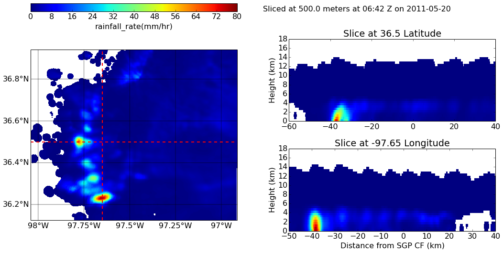
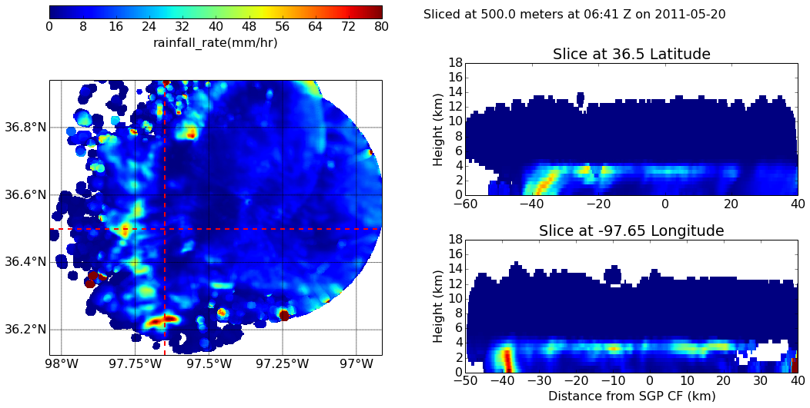

:author: Scott Collis
:email: scollis@anl.gov
:institution: Environmental Sciences Division, Argonne National Laboratory.

:author: Scott Giangrande
:email: sgrande@bnl.gov
:institution: Atmospheric Sciences, Brookhaven National Laboratory.

:author: Jonathan Helmus
:email: jhelmus@anl.gov
:institution: Environmental Sciences Division, Argonne National Laboratory.

:author: Di Wu
:email: di.wu@nasa.gov
:institution: NASA Goddard Space Flight Center.

:author: Anne Fridlind
:email: ann.fridlind@nasa.gov
:institution: NASA Goddard Institute of Space Sciences.

:author: Marcis Vanlier-Walqui
:email: marcus.vanlier-walqui@nasa.gov
:institution: NASA Goddard Institute of Space Sciences.

------------------------------------------------
Measuring rainshafts: Bringing python to bear on remote sensing data.
------------------------------------------------

.. class:: abstract
Remote sensing data is complicated, very complicated! It is not only
geospatially tricky but also indirect as the sensor measures the interaction
of the media with the probing radiation, not the geophysics. However the
problem is made tractable by the large number of algorithms available in the
Scientific Python community, what is needed is a common data model for active
remote sensing data that can act as a layer between highly specialized file
formats and the cloud of scientific software in Python. This presentation
motivates this work by asking: How big is a rainshaft? What is the natural
dimensionality of rainfall patterns and how well is this represented in fine
scale atmospheric models. Rather than being specific to the domain of
meteorology we will break down how we approach this problem in terms what tools
across numerous packages we used to read, correct, map and reduce the data to
forms able to answer our science questions. This is a "how" paper,
covering signal processing using linear programming methods, mapping using KD
Trees, and image analysis using ndimage and, of course graphics using
Matplotlib.

.. class:: keywords

   Remote sensing, radar, meteorology, hydrology

Introduction
------------
RADARs (RAdio Detecion And Ranging, henceforth radars) specialized to weather
applications do not measure the atmosphere, rather, the instument measures the
interaction of the probing radiation with the scattering medium (nominally cloud
or precipitation droplets or ice particulate matter). Therefore, in order to
extract geophysical insight, such as the relationshop between large scale
environmental forcing and heterogeneity of surface precipitation patterns, a
complex application chain of algorithms needs to be set up.

This paper briefly outlines a framework, using a common data model approach, for
assembling such processing chains: the Python-ARM Radar Toolkit, Py-ART
[Heistermann2014]_. The paper also provides an example
application: using rainfall maps to objectively metric the skill of fine scale
models in representing precipitation morphology.

The data source: Scanning centimeter wavelength radar
------------
In order to understand the spatial complexity of precipitating cloud systems a
sensor is required that can collect spatially diverse data. Radars emit a
spatailly descrete pulse of radiation with a particular beam with and pulse length.
A gated reciever that detects the backscattered signal and calculates a number
of measurements based on the radar spectrum (the power as a function of phase delay
which is due). These moments include radar reflectivity factor $Z_e$, radial velocity
of the scattering medium $v_r$ and spectrum width $w$. Polarimetric radars transmit
pulses with the electric field vector horizontal to the earth's surface and also
vertical to the earth's surface. These radars can give a measure of the anistropy
of the scattering medium and collect measurements including the differential
reflectivity :math:`Z_{DR}`, differential phase difference :math:`\phi_{dp}` and correlation
cooefficent :math:`\rho_{HV}`. The data is laid out on a time/range grid and each ray
(time step) has an associated azimuth and elevation. Data presented in this paper
are from 4 radar systems: One C-Band (5cm wavelenth) and three X-Band (3cm wavelength)
 radars as outlined in table :ref:`radars`.

.. table:: ARM radar systems used in this paper. :label:`radars`

   +-------------+------------------+-----------------+
   |             | X-SAPR           |  C-SAPR         |
   +-------------+------------------+-----------------+
   |Frequency    | 9.4 GHZ          |6.25GHz          |
   +-------------+------------------+-----------------+
   |Transmitter  | Magnetron        |Magnetron        |
   +-------------+------------------+-----------------+
   |Power        | 200kW            | 350kW           |
   +-------------+------------------+-----------------+
   |Gate spacing | 50m              |120m             |
   +-------------+------------------+-----------------+
   |Maximum Range| 40km             |120km            |
   +-------------+------------------+-----------------+
   |Beam width   | 1.0:math:`^\circ`|1.0:math:`^\circ`|
   +-------------+--------+-----------+
   |Polar. mode  | Simul. H/V|Simul. H/V|
   +-------------+--------+-----------+
   |Manufacturer | Radtec| Advanced Radar Corp.|
   +-------------+--------+-----------+
   |Native format| Iris Sigmet| NCAR MDV|
   +-------------+--------+-----------+

The Python ARM Radar Toolkit: Py-ART
------------
The idea behind Py-ART

Pre-mapping corrections and calculations
~~~~~~~~~~~~~~~~~~~~~~

Mapping to a cartesian grid
~~~~~~~~~~~~~~~~~~~~~~

   Single C-Band rainfall field. :label:`C-Band only`

   Mesh of X-Band systems. :label:`x only`

Spatial distribution of rainfall: a objective test of fine scale models
------------

Measuring rainshafts using NDimage
~~~~~~~~~~~~~~~~~~~~~~

Radar results
~~~~~~~~~~~~~~~~~~~~~~

Cloud resolving model results
~~~~~~~~~~~~~~~~~~~~~~

Conclusions
------------

Acknowledgements
------------
DoE Standard

References
----------
.. [Heistermann2014] Heistermann, M., S. Collis, M. J. Dixon, S. E. Giangrande,
              J. J. Helmus, B. Kelley, J. Koistinen, D. B. Michelson, M. Peura,
              T. Pfaff and D. B. Wolff,
              2014: The Promise of Open Source Software for the Weather Radar
              Community. *Bulletin of the American Meteorological Society*,
              **In Press.**
