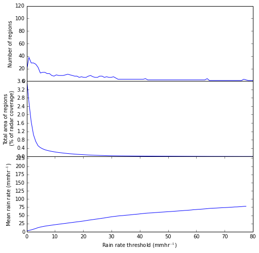

:author: Scott Collis
:email: scollis@anl.gov
:institution: Environmental Sciences Division, Argonne National Laboratory.

:author: Scott Giangrande
:email: sgrande@bnl.gov
:institution: Atmospheric Sciences, Brookhaven National Laboratory.

:author: Jonathan Helmus
:email: jhelmus@anl.gov
:institution: Environmental Sciences Division, Argonne National Laboratory.

:author: Di Wu
:email: di.wu@nasa.gov
:institution: NASA Goddard Space Flight Center.

:author: Anne Fridlind
:email: ann.fridlind@nasa.gov
:institution: NASA Goddard Institute of Space Sciences.

:author: Marcis Vanlier-Walqui
:email: marcus.vanlier-walqui@nasa.gov
:institution: NASA Goddard Institute of Space Sciences.

:author: Adam Theisen
:email: atheisen@ou.edu
:institution: University of Oklahoma, Cooperative Institute for Mesoscale Meteorological Studies, ARM Climate Research Facility Data Quality Office.

---------------------------------------------------------------------
Measuring rainshafts: Bringing python to bear on remote sensing data.
---------------------------------------------------------------------

.. class:: abstract

Remote sensing data is complicated, very complicated! It is not only
geospatially tricky but also indirect as the sensor measures the interaction
of the media with the probing radiation, not the geophysics. However the
problem is made tractable by the large number of algorithms available in the
Scientific Python community, what is needed is a common data model for active
remote sensing data that can act as a layer between highly specialized file
formats and the cloud of scientific software in Python. This paper
motivates this work by asking: How big is a rainshaft? What is the natural
morphology of rainfall patterns and how well is this represented in fine
scale atmospheric models. Rather than being specific to the domain of
meteorology, we will break down how we approach this problem in terms of the tools
used from numerous Python packages to read, correct, map and reduce the data
into a form better able to answer our science questions. This is a "how" paper,
covering signal processing using linear programming methods, mapping using k-d
trees, image analysis using SciPy's ndimage sub-module and graphics using
matplotlib.

.. class:: keywords

   Remote sensing, radar, meteorology, hydrology

Introduction
------------

RADARs (RAdio Detection And Ranging, henceforth radars) specialized to weather
applications do not measure the atmosphere, rather, the instrument measures the
interaction of the probing radiation with the scattering medium (nominally cloud
or precipitation droplets or ice particulate matter). Therefore, in order to
extract geophysical insight, such as the relationship between large scale
environmental forcing and heterogeneity of surface precipitation patterns, a
complex application chain of algorithms needs to be set up.

This paper briefly outlines a framework, using a common data model approach, for
assembling such processing chains: the Python-ARM Radar Toolkit, Py-ART
[Heistermann2014]_. This paper also provides an example
application: using rainfall maps to objectively evaluate the skill of fine scale
models in representing precipitation morphology.

The data source: scanning centimeter wavelength radar
-----------------------------------------------------

In order to understand the spatial complexity of precipitating cloud systems a
sensor is required that can collect spatially diverse data. Radars emit a
spatially discrete pulse of radiation with a particular beamwidth and pulse length.
A gated receiver detects the backscattered signal and calculates a number
of measurements based on the radar spectrum (the power as a function of phase delay
which is due to the motion of the scatting medium relative to the antenna). 
These moments include radar reflectivity factor :math:`Z_e`, radial velocity
of the scattering medium :math:`v_r` and spectrum width :math:`w`. Polarimetric radars transmit
pulses with the electric field vector horizontal to the earth's surface as well
as vertical to the earth's surface. These radars can give a measure of the anisotropy
of the scattering medium with measurements including differential
reflectivity :math:`Z_{DR}`, differential phase difference :math:`\phi_{dp}` and correlation
coefficient :math:`\rho_{HV}`. The data is laid out on a time/range grid with each ray
(time step) having an associated azimuth and elevation. Data presented in this paper
are from 4 ARM [Mather2013]_ radar systems: One C-Band (5 cm wavelength) and three X-Band (3 cm wavelength)
radars as outlined in table :ref:`radars`.

.. table:: ARM radar systems used in this paper. :label:`radars`

  +---------------+------------------+-------------------+
  |               | X-SAPR           |  C-SAPR           |
  +---------------+------------------+-------------------+
  | Frequency     | 9.4 GHZ          | 6.25GHz           |
  +---------------+------------------+-------------------+
  | Transmitter   | Magnetron        | Magnetron         |
  +---------------+------------------+-------------------+
  | Power         | 200kW            | 350kW             |
  +---------------+------------------+-------------------+
  | Gate spacing  | 50m              | 120m              |
  +---------------+------------------+-------------------+
  | Maximum Range | 40km             | 120km             |
  +---------------+------------------+-------------------+
  | Beam width    |  :math:`1^\circ` |  :math:`1^\circ`  |
  +---------------+------------------+-------------------+
  | Polar. mode   | Simul. H/V       | Simul. H/V        |
  +---------------+------------------+-------------------+
  | Manufacturer  | Radtec           | Adv. Radar Corp.  |
  +---------------+------------------+-------------------+
  | Native format | Iris Sigmet      | NCAR MDV          |
  +---------------+------------------+-------------------+

These instruments are arranged as show in figure :ref:`sgp`.

.. figure:: SGPlayout.png

   Arrangement of radars around the ARM Southern Great Plains Facility from
   [Giangrande2014]_. :label:`sgp`

The Python ARM Radar Toolkit: Py-ART
------------------------------------

Radar data comes in a variety of binary formats but the content is
essentially the same: A time-range array for each radar moment 
along with data describing the pointing and geolocating of the platform.  
For for mobile radar the platform's motion must also be described in the file.
Py-ART takes a common data model approach: Carefully design the data containers and
mandate that functions and methods accept the container as an argument and return
the same data structure. The common data model for radar data in Py-ART is the
Radar object which stores data and metadata in Python dictionaries in classes attributes.
Data is stored in a NumPy arrays in the 'data' key of the dictionary. For example:

.. code-block:: python

  print xnw_radar.fields.keys()
  ['radar_echo_classification',
  'corrected_reflectivity',
  'differential_phase',
  'cross_correlation_ratio',
  'normalized_coherent_power',
  'spectrum_width',
  'total_power', 'reflectivity',
  'differential_reflectivity',
  'specific_differential_phase',
  'velocity',
  'corrected_differential_reflectivity']
  print xnw_radar.fields['reflectivity'].keys()
  ['_FillValue', 'coordinates', 'long_name',
  'standard_name', 'units', 'data']
  print xnw_radar.fields['reflectivity']['long_name']
  Reflectivity
  print xnw_radar.fields['reflectivity']['data'].shape
  (8800, 801)

The xnw_radar has a variety of fields, including 'reflectivity' with the
numerical moment data stored in the 'data' key with 8800 time steps and 801 range
gates. Data on instrument pointing is stored in x_nw.azimuth and x_nw.elevation attributes
while the center point of each range gate is stored in x_nw.range. Again these
attributes are dictionaries with data stored in the 'data' key. Functions in Py-ART can append
fields or modify data in existing fields (rare).

The vital key is a 'Babelfish' layer which ingests a variety of formats into the
common data model. Currently table :ref:`formats` outlines the formats which
are compatible with Py-ART.  A number of these formats are available via a 
Cython wrapper around NASA's Radar Software Library.

.. table:: Py-ART formats. :label:`formats`

  +-------------+-------------------------------+---------------+
  | Format name | Example radar system(s)       | Note          |
  +-------------+-------------------------------+---------------+
  | CF-Radial   | NCAR SPOL, ARM Cloud Radars   | Output format |
  +-------------+-------------------------------+---------------+
  | UF          | Lots of legacy data           | Via RSL       |
  +-------------+-------------------------------+---------------+
  | Lassen      | BoM CPOL in Darwin, Australia | Via RSL       |
  +-------------+-------------------------------+---------------+
  | IRIS Sigmet | ARM X-SAPR                    | Native        |
  +-------------+-------------------------------+---------------+
  | NCAR MDV    | ARM C-SAPR                    | Native        |
  +-------------+-------------------------------+---------------+
  | GAMIC       | European radar network        | Native        |
  +-------------+-------------------------------+---------------+
  | WSR-88D     | USA operational network       | Native        |
  +-------------+-------------------------------+---------------+

We also have Pull Requests on GitHub which introduce support for the 
NSF funded Colorado State University CHILL radar and active development 
on supporting NOAA NOX-P and NASA D3R radars. There is a
single output format, CF-Radial, a NetCDF based community format on which the
common data model is derived from.

Pre-mapping corrections and calculations
~~~~~~~~~~~~~~~~~~~~~~~~~~~~~~~~~~~~~~~~

Once raw data is collected there is often a number of processing steps that need
to be performed. In our case this includes:

- Correcting false Azimuth readings in the Northwest X-Band system.
- Cleaning data of undesirable components such as multiple trips, clutter and
  non-meteorological returns.
- Processing the raw :math:`\phi_{DP}` and extracting the component due to
  rain water content by using a linear programming technique to fit a profile
  which mandates positive gradient, see [Giangrande2013]_.
- Using reflectivity and :math:`\phi_{DP}` to retrieve attenuation (in dBZ/km)
  due to rainwater path.
- Using the techniques outlined in [Ryzhkov2014]_ to retrieve rainfall rate (in
  mm/hr) from attenuation.

These are all outlined in the first of the three notebooks which accompany this
manuscript: http://nbviewer.ipython.org/github/scollis/notebooks/tree/master/scipy2014/.
Each process either appends a new field to the Radar instance or returns a field
dictionary which can then be added to the instance. 
Py-ART also comes with visualization methods allowing for the conical
(or Plan Position Indicator, PPI) scan to be plotted and geolocated using
matplotlib and Basemap. An example plot of raw :math:`\phi_{DP}` and reflectivity
is shown in figure :ref:`rawppi`.

.. figure:: nw_ppi.png

   Raw reflectivity factor and polarimetric phase difference from the lowest
   (0.5 degree) tilt. :label:`rawppi`

The code necessary to create this plot:

.. code-block:: python

  fields_to_plot = ['differential_phase',
                    'reflectivity']
  ranges = [(180, 240), (0, 52)]
  display = pyart.graph.RadarMapDisplay(xnw_radar)

  nplots = len(fields_to_plot)
  plt.figure(figsize=[7 * nplots, 4])
  for plot_num in range(nplots):
      field = fields_to_plot[plot_num]
      vmin, vmax = ranges[plot_num]
      plt.subplot(1, nplots, plot_num + 1)
      display.plot_ppi_map(field, 0, vmin=vmin,
          vmax=vmax, lat_lines=np.arange(20, 60, .2),
          lon_lines=np.arange(-99, -80, .4),
          resolution='l')
      display.basemap.drawrivers()
      display.basemap.drawcountries()
      display.plot_range_rings([20, 40])

Here, a RadarMapDisplay instance is instantiated by providing a Radar object
which is insensitive to the data source. The sample plotting routines can be used to
plot data ingested from any of the formats which Py-ART supports.

Mapping to a cartesian grid
~~~~~~~~~~~~~~~~~~~~~~~~~~~

Radars sample in radial coordinates of elevation, azimuth and range. Mathematics
for atmospheric phenomena are greatly simplified on Cartesian and Cartesian-like
(eg pressure surfaces) grids. Therefore the raw and processed data in the Radar
object often need to be mapped onto a regular grid. In the field, this is known as
"Objective analysis" (see, for example [Trapp2000]_). In this paper we use a technique
known as Barnes analysis [Barnes1964]_ which is an inverse distance weighting, sphere of influence
based technique. For each grid point in the Cartesian grid a set of radar
gates within a radius of influence are interpolated using the weighting function:

.. math::

   W(r) = e^\frac{-r_{infl}^2}{2.0*r^2}

where :math:`r` is the distance from the grid point and :math:`r_{infl}` is the
search radius of influence. A brute force method for performing this mapping would
be to calculated the distance from each Cartesian point to each radar gates to find those within
the radius of influence, a method which scales as :math:`n * m`
where :math:`n` is the number of point in the grid and :math:`m` the number of 
gates in the radar volume. With a typical grid being
200 by 200 by 37 points and a modern radar having on the order of 8000 time
samples and 800 range gates this quickly becomes intractable. A better method is to
store the radar gates in a k-d tree or related data structure. This reduces the search
to an order :math:`n * log(m)` problem. This method is implemented in Py-ART. In addition a
variable radius of influence algorithm is implemented which analyzes the radar
volume coverage pattern and deduces an optimized :math:`r_{infl}` at each grid point. Unlike
many other objective analysis codes Py-ART implementation can operate on
multiple Radar objects simultaneously, treating the radar gates as a cloud of points. 
This allows the merging of multiple radar data sets. The method is simple to invoke, 
for example the code snippet:

.. code-block:: python

  mesh_mapped_x = pyart.map.grid_from_radars(
      (xnw_radar, xsw_radar, xse_radar),
      grid_shape=(35, 401, 401),
      grid_limits=((0, 17000), (-50000, 40000), 
                   (-60000, 40000)),
      grid_origin=(36.57861, -97.363611),
      fields=['corrected_reflectivity','rain_rate_A',
              'reflectivity'])

will map the gates in the three Radar objects (in this case the three ARM X-Band systems
in figure :ref:`sgp`) to a grid that is (z,y,x) = (35, 401, 401) points with a domain
of 0 to 17 km in altitude, -50 to 40 km in meridional extend and -60 to 40 km in
zonal extent. The method returns a Grid object which follows a similar layout
to a Radar object: fields are stored in the fields attribute, geolocation data in the 
axes attribute with the numerical data found in the 'data' key of the dictionaries.

Again, as with the Radar object Py-ART has a menu of available routines to visualize
data contained in Grid objects as well as an input output layer that can inject CF-compliant 
netCDF grids and write Grid object out to a CF-complaint file for future analysis and distribution.

For example figure :ref:`C-Band only` shows a slice thought mapped reflectivity
from the ARM C-SAPR at 500 m and cross sections at 36.5 N degrees latitude and
-97.65 E longitude.

.. figure:: c_only_z.png

   Single C-Band reflectivity factor field. :label:`C-Band only`

In the vertical cross sections clear artifacts can be seen due to the poor sampling.
Figure :ref:`X-Band only` shows the same scene but using a grid created from three X-Band radars
in a network. In both figures the radar data are mapped onto a grid with 225 m spacing.

.. figure:: x_only_z.png

   Reflectivity factor mapped from a network of X-Band radars. :label:`X-Band only`

It is clear that more fine scale detail is resolved due to the rain systems being closer
to any given radar in the X-Band network grid.
In addition, due to the higher density of high elevation beams 
(essentially a "web" of radar beams sampling the convective anvil) sampling
artifacts are greatly reduced and finer details aloft are able to be studied.

Mesh mapping only works for "specific" measurements, ie not integrated
measurements like :math:`\phi_{DP}` or directionally dependent moments
like :math:`v_r`. One measurement that can be mapped is our retrieved rain rate.

Figures :ref:`C-Band rain` and :ref:`X-Band rain` show mappings for rain rate
using just the C-Band measurement and X-Band network respectively. Again the
mesh map of the X-Band retrieval shows very fine detail resolving (in a volumetric
dataset) fall streak patterns. The maxima near 4 km (just below the freezing
level) is due to melting particles. The rainfall retrieval has a cut off at
the sounding determined freezing level but the "bright band" can extend some depth
below this. Future work will entail using polarimetric measurements to determine
where there is only pure liquid returns and conditionally apply the rainfall
retrieval to those positions.

.. figure:: c_only_rain.png

   Single C-Band rainfall field. :label:`C-Band rain`

.. figure:: x_only_rain.png

   Rainfall from a network of X-Band systems. :label:`X-Band rain`

Spatial distribution of rainfall: a objective test of fine scale models
-----------------------------------------------------------------------

Previous sections have detailed the correction, retrieval from and mapping to a Cartesian grid of radar
data. The last section showed enhanced detail can be retrieved
by using a network of radars. The question remains: how can the detail in
rain fields be objectively compared?
Can parameters derived from radar data be compared to those calculated from forecast models? The meshes
generated using the mapping techniques previously discussed can be treated like
image data for which a number of packages exist for analysis.

Measuring rainshafts using SciPy's ndimage subpackage
~~~~~~~~~~~~~~~~~~~~~~~~~~~~~~~~~~~~~~~~~~~~~~~~~~~~~

A simple technique for documenting the features present in an image is to partition it into
segments which are above a certain threshold and calculate the number of
segments, their accumulated area and the mean rainfall across the segment. The ndimage subpackage
in Scipy is perfect for accomplishing this. Figure :ref:`seg` shows the use
of scipy.ndimage.label to segment regions above 5 and 20mm/h.

.. figure:: segmentation.png

   An example of figure segmentation using scipy.ndimage.label. :label:`seg`

The code is very simple, for a given rain rate it creates a "black and white"
image with whites above the threshold point and the black below, then scipy.ndimage.label
segments the regions into a list of regions from which metrics can be calculated:

.. code-block:: python

  def area_anal(pixel_area, rr_x, rain_rates):
      A_rainrate = np.zeros(rr_x.shape)
      N_rainrate = np.zeros(rr_x.shape)
      Rm_rainrate = np.zeros(rr_x.shape)
      for i in range(len(rr_x)):
          b_fld = np.zeros(rain_rates.shape)
          b_fld[rain_rates > rr_x[i]] = 1.0
          regions, N_rainrate[i] = ndimage.label(b_fld)
          try:
              A_rainrate[i] = (len(np.where(
                  regions > 0.5)[0]) *
                  pixel_area)
              Rm_rainrate[i] = rain_rates[
                  np.where(regions > 0.5)].mean()
          except IndexError:
              A_rainrate[i] = 0.0
              Rm_rainrate[i] = 0.0
      return N_rainrate, A_rainrate, Rm_rainrate

This produces plots for the X-Band mesh as seen in :ref:`segx` and single
C-Band sytems in :ref:`segc`.

   Number of regions, region covered and mean rain rate as a function
   of rain rate threshold for a rainmap produced by a single
   C-Band system. :label:`segc`

.. figure:: segx.png

   Number of regions, region covered and mean rain rate as a function
   of rain rate threshold for a rainmap produced by a network of
   X-Band systems. :label:`segx`

.. XXX This paragraph needs to be re-written XXX

These results show that the mesh produced by the C-Band system averages over
finely detailed higher intensity rain rates which are observed using the X-band
network. And since [Giangrande2014]_ established the veracity of rainfall retrievals
using specific attenuation for both X and C band (verus ARM and NASA guages and
distrometers) that the structures shown in figure :ref:`X-Band rain` are exist.
One thing this paper has not shown is what netork density of radars is required
to fully resolve precipitating systems. This will be a function of the large scale
forcing environment (an interesting question in as of itself). This study does
establish that, for the Southern great plains, studying phenomina at the sub kilometer
scale is required.

Conclusions
-----------

This paper has covered the pipeline for proceeding from raw radar measurements through quality
control and geophysical retrieval to mapping and finally to the extraction of geophysical
insight. The simple conclusion is that, with careful processing, a network of
X-Band radars can resolve finer details than a single C-Band radar. More
importantly, finer details exists. The paper also presents a very simple, image
processing based technique to take the "morphological finger print" of rainfall
maps. This technique can be used on both remotely sensed and numerically modeled
data providing a subjective bases for model assessment.

Acknowledgements
----------------

Dr. Giangrande's work is supported by the Climate Science for a Sustainable
Energy Future (CSSEF) project of the Earth System Modeling (ESM) program in the
DOE Office of Science. Argonne National Laboratory’s work was supported by the
U.S. Department of Energy, Office of Science, Office of Biological and Environmental
Research (OBER), under Contract DE-AC02-06CH11357.The work has also been supported
by the OBER of the DOE as part of the ARM Program. Adam Theisen’s work was supported
by Battelle – Pacific Northwest National Laboratory, contract number 206248,
and his home institution, CIMMS, is supported by NOAA/Office of Oceanic and
Atmospheric Research under NOAA-University of Oklahoma Cooperative Agreement
#NA11OAR4320072, U.S. Department of Commerce.   The authors wish to thank
Dr. Alexander Ryzhkov for support on implementation of specific attenuation-based
rainfall methods.

References
----------

.. [Heistermann2014] Heistermann, M., S. Collis, M. J. Dixon, S. E. Giangrande,
              J. J. Helmus, B. Kelley, J. Koistinen, D. B. Michelson, M. Peura,
              T. Pfaff and D. B. Wolff,
              2014: The Promise of Open Source Software for the Weather Radar
              Community. *Bull. Amer. Meteor. Soc.*,
              **In Press.**
.. [Mather2013] Mather, J. H., and J. W. Voyles, 2012:
                The Arm Climate Research Facility: A Review of Structure and
                Capabilities. *Bull. Amer. Meteor. Soc.*, **94**, 377–392,
                doi:10.1175/BAMS-D-11-00218.1.
.. [Giangrande2014] Giangrande, S. E., S. Collis, A. K. Theisen, and A. Tokay,
                    2014: Precipitation Estimation from the ARM Distributed
                    Radar Network During the MC3E Campaign.
                    *J. Appl. Meteor. Climatol.*, doi:10.1175/JAMC-D-13-0321.1.
                    http://journals.ametsoc.org/doi/abs/10.1175/JAMC-D-13-0321.1
.. [Giangrande2013] Giangrande, S. E., R. McGraw, and L. Lei,
                     2013: An Application of Linear Programming to Polarimetric
                     Radar Differential Phase Processing.
                     *Journal of Atmospheric and Oceanic Technology*, **30**,
                     1716–1729, doi:10.1175/JTECH-D-12-00147.1.
.. [Ryzhkov2014] Ryzhkov, A. V., M. Diederich, P. Zhang, C. Simmer, 2014:
                 Potential utilization of specific attenuation for rainfall
                 estimation, mitigation of partial beam blockage, and radar
                 networking. Submitted, *J. Atmos. Oceanic Technol.*, **in press.**
.. [Trapp2000] Trapp, R. J., and C. A. Doswell, 2000: Radar Data Objective
               Analysis. *Journal of Atmospheric and Oceanic Technology*,
               **17**, 105–120, doi:10.1175/1520-0426(2000)017<0105:RDOA>2.0.CO;2.
.. [Barnes1964] Barnes, S. L., 1964: A Technique for Maximizing Details in
                Numerical Weather Map Analysis. *Journal of Applied Meteorology*,
                **3**, 396–409, doi:10.1175/1520-0450(1964)003<0396:ATFMDI>2.0.CO;2.
