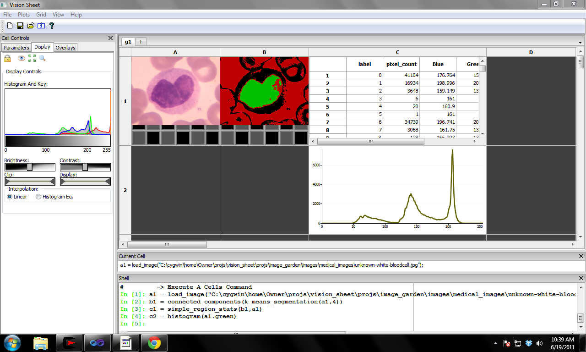
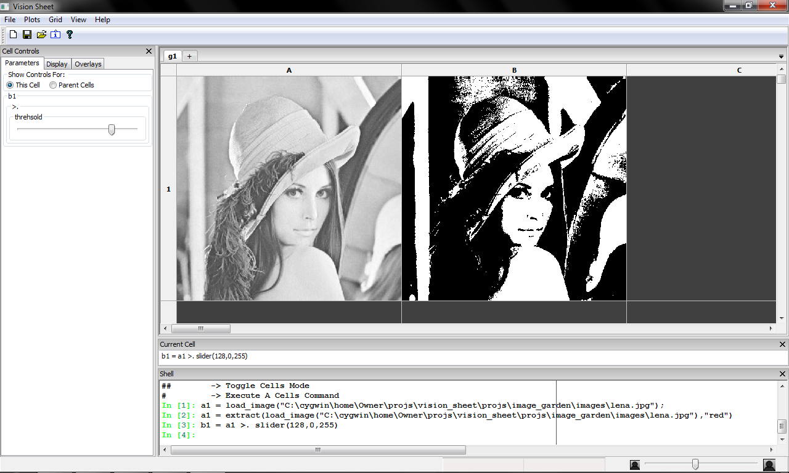

:author: Scott Determan
:email: scott.determan@gmail.com
:institution: Vision Spreadsheet

------------------------------------------------------
Vision Spreadsheet: An Environment for Computer Vision
------------------------------------------------------

.. class:: abstract

   Vision Spreadsheet is an environment for computer vision. It combines a spreadsheet with
   computer vision and scientific python.
   
.. class:: keywords

   computer vision,spreadsheet

Introduction
------------

Vision Spreadsheet is an environment for computer vision. Its purpose is to lower
the barrier to computer vision by:

- Having a shallow learning curve by using spreadsheets, an interface many people
  are already familiar with.
- Providing immediate feedback to algorithm changes. The spreadsheet interface
  along with binding GUI controls to algorithm parameters lets you explore your
  problems.
- Letting you experiment with lots of different algorithms. All of the image
  processing and machine learning algorithms from OpenCV are available.
- Allowing you to easily add your own functions to the spreadsheet. You can use
  python to extend the spreadsheet.

It is difficult to get a feel for an interactive environment by reading a
paper. I would encourage you to visit http://visionspreadsheet.com to download the
program and watch some videos of vision spreadsheet in action.

The Spreadsheet
---------------

Figure :ref:`bloodcells` shows a screen shot of vision spreadsheet. There are
three main area to the GUI: the grid of cells, the repl below the cells, and the
GUI controls to the left of the cells.

   Vision Spreadsheet cells contain images, measurements, and plots. :label:`bloodcells`

Financial spreadsheets contain a grid of numbers and labels. In vision
spreadsheet the grid of cells contains images, computations on images,
measurements, and plots. In a financial spreadsheet, if you sum a column of
numbers and change a number in the column the total automatically updates
itself. Similarly, in vision spreadsheet if you change a cell (for instance by
loading a new image or changing an algorithm parameter) then all of the cells
that depend on the changed cell will update themselves.

The repl (read-eval-print-loop) is a modified ipython shell used to specify what
a cells contains. The repl is also used to write new spreadsheet functions in
python.

The GUI controls area contains display parameters, overlays, and controls bound
to algorithm parameters for the current cell.

The Cells Language
------------------

The cells language is a very simple language used to specify what to display in a
cell. A typical call looks like:

.. code-block:: python

   some_cell = some_function(parameter1,paramter2)

For example, to erode an image in cell a1, and put the result in cell b1:

.. code-block:: python

   b1 = erode(a1)

Now if you load a new image in cell a1, cell b1 will automatically update
itself. If you want to inhibit the automatic update behavior, you can preface a
variable with a '$'. For example, if you say:

.. code-block:: perl 

   b1 = erode($a1)

The '$' in front of the a1 variable prevents the statement from rerunning if a1
changes.

Functions may be nested, so one way to run a morphological open would be:

.. code-block:: python

   b1 = dilate(erode(a1))

Of course, morphological open is already built in. In fact, all of the image
processing and machine learning functions from OpenCV are available.

The arithmetic operators are available and follow the usual syntax and precedence
rules. There is an if function and select function.

Vision spreadsheet supports namespaces. This is most useful for referencing cells
in other sheets of the spreadsheet. The syntax is:

.. code-block:: python

   namespace_name::variable_name
   ::variable_name # global namespace

So if you have sheets g1 and g2, to refer to cell sheet's g1 cell a1, you would say:

.. code-block:: python

   g1::a1

The cells language is meant to write single lines of code to specify what a cell
contains. It is not meant to write complex programs. For that, use python (and
python mode within vision spreadsheet).

Binding Parameters to GUI Controls
----------------------------------

One of my favorite features in vision spreadsheet is binding GUI controls to
algorithm parameters. The best way to explain this feature is to look at an example.
Let's say we want to threshold an image. There are a couple threshold operators, but
let's use the simplest: the '>.' operator. First load an image in cell a1. Next,
threshold it by typing:

.. code-block:: python

   b1 = a1 >. 128

This creates an image where values greater than 128 are set to 255 and values
less than or equal to 128 are set to zero. However, often we want to set
thresholds interactively. We could keep typing in numbers until we get the result
we get. A better way is to bind the parameter to a GUI controls, say a slider. The following
command does this:

.. code-block:: python

   b1 = a1 >. slider(128,0,255)

This creates a slider with a default value of 128, a min value of 0 and a max value of 255. If you look
in the cell controls pane on the left of the GUI, you will see a slider (see figure :ref:`slider`). You can use this
slider to interactively change the parameter to the threshold parameter.

   GUI controls may be bound to algorithm parameters. Here a slider is bound to a threshold. :label:`slider`

There are many other types of GUI controls that may be bound to parameters, such
as: radio buttons, sliders, spin controls, combo boxes and movie controls (radio
button are particularly useful to bind to file names so different images may be
easily loaded into a cell).

You may also use multiple GUI controls to control a single function
parameter. You do this by nesting the calls to the GUI controls. For example, to
have a spin control and a slider control the threshold:

.. code-block:: python

   b1 = a1 >. spin(slider(128,0,255))

Data Structures
---------------

There are three main data structures in vision spreadsheet: images, data frames,
and statistical models (classifiers, clusters, and regression algorithms).

Images are the data structure you will use the most. Taking an image and running
a filter, or an edge finder, or (most) segmentation algorithms transform images
to images. It is a two dimensional array of vectors. All the elements are of the
same numeric type (uchar through double are supported). Lots of image types are
supported: depth images (from the kinect camera, for example), greyscale, color
(rgb, brg, hsi, cie lab, etc.). When an image is passed to a user defined python
function it is automatically converted into a numpy array.

Data frames are modeled after R's data frame structure. You will use data frames
to store measurements on images and to overlay images with shapes and regions of
interest (among other uses). It is a table where each column in the table may
have a different type. So a single data frame may have a column of numbers and a
column of strings. Supported column types are: numeric (uchar through double),
boolean, string, and region of interest. Like R's data frames, rows may contain
missing data. Data frames also support R's notion of factor columns. Factor
columns are usually used to specify responses when training classifiers. Unlike
R, vision spreadsheet supports grouping columns into a hierarchy. This is useful
for storing higher-level objects in a data frame.  For example, rectangles are
stored in a data frame by grouping together four numeric columns. These
rectangles may then be overlaid and edited on an image.

The last major data structure is a statistical model. You will will statistical
models to classify objects in images (among other uses). There are two main
functions to a statistical model: train and predict. Train takes a data frame of
features (labeled for supervised learning, unlabeled for supervised). Predict
takes a data frame and returns a prediction for each row in the data frame (the
predictions are classifications or regressions, depending on the type of
statistical model).

There are other data types in vision spreadsheet, but using only these three you
can solve many problems in computer vision.

Python Mode
-----------

The ipython shell at the bottom of the GUI supports two modes, cells mode and
python mode. To toggle between the two modes, type '##' and hit return. Cells
mode is the default mode. Python mode is just a regular ipython shell with two
differences: you can type '##' to toggle to another mode and there is a module
called 'vis_sheet' that can be used to interact with the spreadsheet.

There are two interesting activities you typically do in python mode:

#. Extend the spreadsheet with new functions.
#. Get values from the spreadsheet, muck around with them interactively in
   python, and set the values back into the spreadsheet.

Let's look at adding a new function to the spreadsheet. Change to python mode by
typing '##' (followed by return). The shell should now have a black
background. Now, define a subtraction function as follows:

.. code-block:: python

   def my_subtract(a,b): return a-b
   import vis_sheet
   vis_sheet.add_python_op(my_subtract)

Change back to python mode by typing '##' (the shell should now have a white
background). Load an image in cell a1, erode it an put it in b1, and subtract b1
from a1 using our new function:

.. code-block:: python

   c1 = my_subtract(a1,b1)

You should see the edges from the image in cell a1. I want to note that the images in the
spreadsheet are automatically converted to numpy arrays before they are passed to user defined
functions. So the parameters a and b will be numpy arrays. If the result is a numpy array, it will
automatically be converted to an image.

You can get or set values in the spreadsheet from python mode with the following functions:

.. code-block:: python

   import vis_sheet
   vis_sheet.get_var_data('a1')
   vis_sheet.set_var_data('b1')

Kinect Camera
-------------

Although it isn't a major part of vision spreadsheet, it's too much fun not to
mention. There is an interface to the Microsoft Kinect camera. The function
grab_kinect_rgb will stream values from the rgb camera and the grab_kinect_depth
will stream values from the depth camera.

Conclusion
----------

Vision spreadsheet provides a nice environment for interactively working with
computer vision. Please go to http://visionspreadsheet.com for more information.
