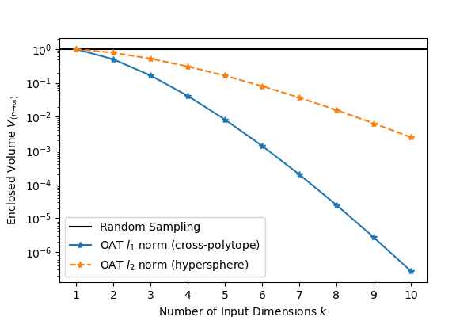
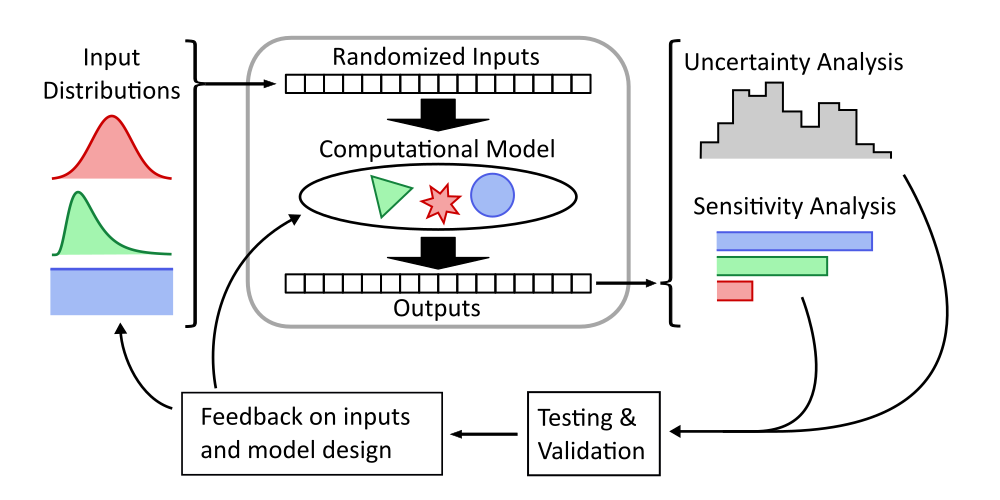
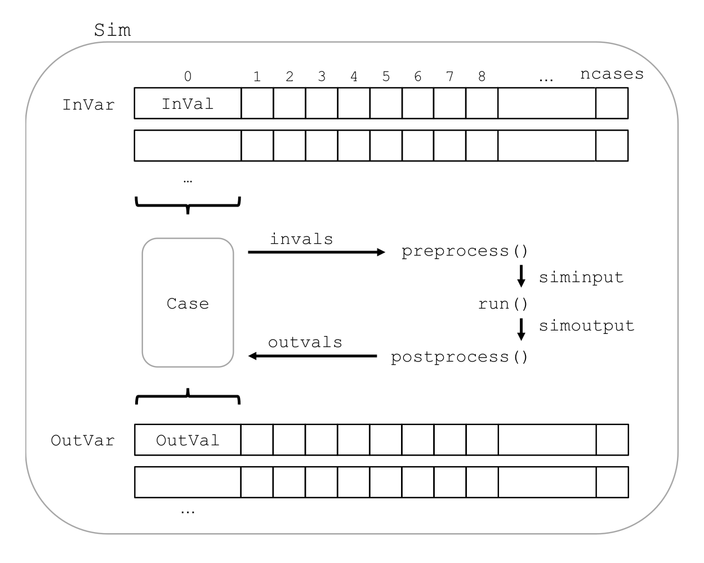
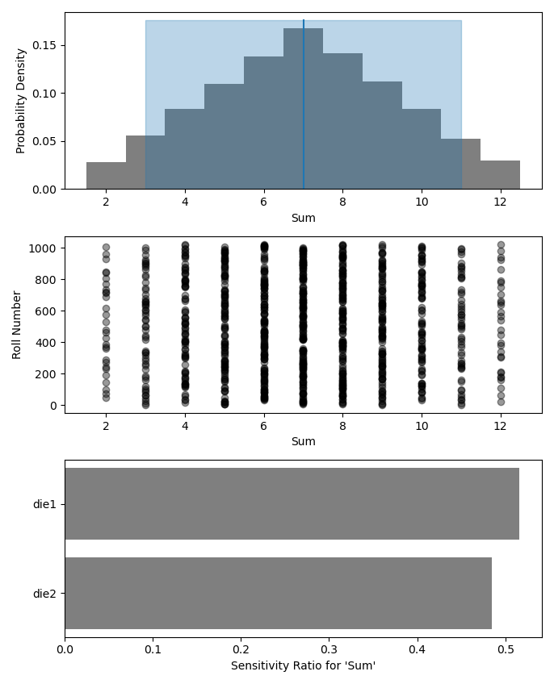

:author: Scott Shambaugh
:email: wsshambaugh@gmail.com TODO

-----------------------------------------------------------------------------------
Monaco: A Monte-Carlo Framework for Performing Uncertainty and Sensitivity Analyses
-----------------------------------------------------------------------------------

.. class:: abstract

   This paper introduces *monaco*, a python library for conducting Monte Carlo simulations of computational models, and performing uncertainty and sensitivity analysis on the results.

.. class:: keywords

   monte carlo, modelling, uncertainty quantification, uncertainty analysis, sensitivity analysis, ensemble prediction, VARS, D-VARS

Introduction
============

Computational models form the backbone of decision-making processes in science, engineering, and public policy. However, our increased reliance on these models stands in contrast to the difficulty in understanding them as we add increasing complexity to try and capture ever more of the fine details of real-world interactions. Practitioners will often take the results of their large, complex model as a point estimate, with no knowledge of how uncertain those results are. Multiple-scenario modeling (e.g. looking at a worst-case, most-likely, and best-case scenario) is an improvement, but what is needed is a complete global exploration of the input space. That gives insight into the overall distribution of results (Uncertainty Analysis, UA) as well as the relative influence of the different input factors on the ouput variance (Sensitivity Analysis, SA). This complete understanding is critical for effective and responsible use of models in any decision-making process.

Despite the importance of UA and SA in modelling, a recent literature review of the most highly cited papers across a wide range of disciplines showed that they are uncommon practices in most fields. And even when performed, best practices are usually missing - amongst papers which specifically claimed to perform sensitivity analysis, only 21% performed global (as opposed to local or no) UA and 41% performed global SA. [Sat01]_ 

Typically UA and SA are done using Monte Carlo simulations, for reasons explored in the following section. There do exist Monte Carlo frameworks available for practitioners, however available options are domain-specific, focused on narrow sub-problems (i.e. integration), tailored towards training neural nets, or require a deep statistical background to use (TODO: lots of references). For the domain expert who is not a statistician and wants to perform UA and SA on their existing models, there are no good options. *monaco* was written to address this gap.

Why Monte Carlos?
=================

Mathematical Grounding
----------------------

Randomized Monte Carlo sampling offers a cure to the curse of dimensionality - consider an investigation of the output from :math:`k` input factors :math:`y = f(x_1, x_2, ..., x_k)` where each factor is uniformly sampled between 0 and 1 :math:`x_i \in U[0, 1]`. The input space is then a :math:`k`-dimensional hypercube with volume 1. As we will see,  If each input is varied one at a time (OAT), then the volume of the input space which is sampled is the convex hull of the principle axes passing through the point :math:`x_{i\in[1, ..., k]} = 0.5`, forming a :math:`k`-dimensional cross-polytope with volume :math:`\frac{1}{k!}` (or most optimistically, a hypersphere with volume :math:`\frac{\pi^{k/2}}{2^k \Gamma(k/2 + 1)}`) that covers a vanishingly small proportion of the input space as :math:`k` increases. Unless the model is known to be linear, this is an wholly inadequate method to sample the input space. In contrast, the volume of the convex hull of a random sampling as is done with a Monte Carlo approach will converge to the entire input volume as the number of sample points :math:`n \to \infty` (and have much better coverage within that volume as well). (TODO reference) See Fig. :ref:`figvolume`.

   Volume fraction :math:`V` of a :math:`k`-dimensional hypercube enclosed by the convex hull of a large number :math:`n \to \infty` of random samples versus OAT samples along the principle axes of the input space. The volume enclosed by OAT sampling falls off super-exponentially even assuming the more optimistic :math:`l_2` norm over the :math:`l_1` norm. :label:`figvolume`

To sample :math:`k` input factors where each factor :math:`x_{i \in [1, ..., k]}` is drawn from a unique probability distribution, it is a common practice to uniformly draw a random percentile between 0 and 1 :math:`p_i \in U[0, 1]`, and transform this to the target distribution through that distribution's inverse cumulative density function (CDF) :math:`x_i = F_i^{-1}(p_i)`. Thus the previous reasoning is easily generalized to an arbitrarily distributed input space.

When to Use and When to Avoid Monte Carlo Analysis
--------------------------------------------------

The full exploration of the input space is critical

The outputs of Monte Carlo analysis can result in highly statistically signficant conclusions. However these results are *conditional on the correctness of the underlying model and input distributions*. If the underlying model has not been throroughly validated, then any precise quantification of uncertainty and sensitivities will be washed out by the uncertainty in the foundation. 

This is not to say that UA and SA should not be conducted early in the model development process - indeed, obtaining the range of plausible output uncertainties is a critical prerequisite to conducting model validation. Small quantities of test data cannot be compared to a point estimate of a model's output, and it is necessary to have the full distribution of output values to compare test data against. Once a Monte Carlo analysis has generated these output distributions, hypothesis testing or probablistic prediction measures like the Brier score or log loss can be used to anchor the model against real-life test data.

Another pitfall of Monte Carlo approaches is that rare events may be undersampled or undermodeled in a standard Monte Carlo analysis. For example, NASA uses Monte Carlos extensively during launch vehicle design to predict the rocket trajectory. [Han01]_ However, they must prove robustness to anomalous or stressing scenarios which may occu only one or two times in the thousands of cases. In these instances, rare event scenarios should be investigated directly.

Note that *monaco*'s overhead in creating easily-iterrogatable objects for variables, values, and cases makes it a slow choice for computationally simple applications with high :math:`n`, such as Monte Carlo integration.

Some benefits are more qualitative. Monte Carlo analysis is an excellent way to uncover unexpected edge cases in a model through unexpected combinations of inputs, especially in highly nonlinear models. This is essentially the concept behind "fuzzing" techniques in software testing.

Workflow
--------

   Workflow for understanding the full behavior of a computational model, inspired by [Sat01]_. Model inputs are randomly sampled from probability distributions for a large number of cases, and fed to the model. The outputs from each case are collected and the full set of inputs and outputs can be analyzed. Typically UA is performed by generating histograms, scatter plots, and summary statistics for the output variables, and SA is performed by looking at the effect of input on output variables through scatter plots and calculating sensitivity indices. These results can then be compared to real-world test data to validate the model or inform revisions to the model and input variables. :label:`figanalysisprocess`

*monaco* Structure
==================

Overall Structure
-----------------

Broadly, each input factor and model output is a *variable* that can be thought of as rows containing the full range of randomized *values*. *Cases* are columns that take a slice of the *k*'th input and output value for each variable, and represent a single run of the model. Fig. :ref:`figarchitecture` shows a visual representation of this.

   Structure of a monaco simulation, showing the relationship between the major objects and functions. :label:`figarchitecture`

Data Flow
---------

1) Instantiate a `Sim` object.
2) Add input variables to the sim with specified probability distributions.
3) Run the simulation. This executes the following:
    a) Random percentiles are drawn `ndraws` times for each of the input variables.
    b) These percentiles are turned into random values via the inverse CDF of the target probability distribution.
    c) If nonnumeric inputs are desired, the random numbers are converted to objects via a `nummap` dict.
    d) The values are distributed to `ndraws` number of cases.
    e) Each case is run by structuring the inputs values with the `preprocess` function, passing them to the `run` function, and collecting the output values with the `postprocess` function.
    f) The output values are collected into output variables and saved back to the sim. If the values are nonnumeric, a `valmap` assigning numbers to each unique value is automatically generated.
4) Calculate statistics & sensitivities for input & output variables.
5) Plot variables, their statistics, and sensitivities.

Simulation Setup
----------------
The base of a *monaco* simulation is the `Sim` object.

The workhorse of the Monte Carlo Simulation which you will run is an `Sim` object. To instantiate this object, you need to pass it two things: the number of random cases `ncases` which you want to run with, and a dict `fcns` of the handles for three functions which you need to create: `preprocess`, `run`, and `postprocess`. The processing functions will be explained in more detail in a moment. You can also choose [a random sampling method, explained here](https://monaco.readthedocs.io/en/latest/sampling_methods.html).

Once you have your Sim object, you need to generate the randomized values which your `run` function will use. To do this, use the `Sim.addInVar()` method to generate `InVar` objects. This method takes in the handle to any of SciPy's continuous or discrete probability distributions, as well as the required arguments for that probability distribution. See [info for some common distributions here](https://monaco.readthedocs.io/en/latest/statistical_distributions.html). It then randomly draws `ncases` different numbers from that distribution, and assigns them to `InVal` objects. The raw value is stored in `InVal.num`. Optionally if nonnumeric random inputs are desired, the method can also take in a `nummap` dictionary which maps the randomly drawn integers to values of other types, stored in `InVal.val`.

Once all input variables have been added, the sim can be run with `Sim.runSim()`. The first thing that this does is generate `ncases` number of `Case` objects. Each of these objects stores the n'th value of each of the input variables. A repeatably random seed for each case is also generated for use by your `run` function, if you use additional randomness inside your function that needs seeding.

Your function will now be run for all the individual cases via the call chain shown below. This should give some light into what the three functions you passed to `Sim` are doing. `preprocess` needs to take in an `Case` object, extract its random values, and package that along with any other data into the structure that `run` expects for its input arguments. The `run` function then executes on those inputs arguments and returns its outputs. The `postprocess` function then needs to take in the original `case` as well as those outputs. Within that function, you will need to perform any postprocessing you wish to do, and choose what data to log out by calling `Case.addOutVal(val)` on those values. The outputs of `preproccess` and `run` both need to be packaged into tuples for unpacking later.

User-Defined Functions
----------------------

.. code-block:: python
    
    postprocess( case, *run( *preprocess( case ) ) )
    
    # Or equivalently to unpack this into pseudocode:
    
    siminput = (siminput1, siminput2, ...) 
                 = preprocess(case)
    simoutput = (simoutput1, simoutput2, ...)
                  = run(*siminput) 
                  = run(siminput1, siminput2, ...)
    _ = postprocess(case, *simoutput)
      = postprocess(case, simoutput1, simoutput2, ...)

Technical Features
==================

Sampling Methods
----------------

Random sampling of the percentiles for each variable can be done using scipy's pseudo-random number generator (PRNG), or with any of the methods in `scip.stats.qmc` Quasi-Monte Carlo module. In general, the `sobol_random` method that generates Sobol sequences with Owen scrambling (TODO: ref) is recommended in nearly all cases as a well-performing quasi-random sequence with the best known convergence, balanced integration properties as long as the number of cases is a power of 2, and a fairly flat frequency spectra. In cases where computing sample points is taking prohibitively long, users may fall back to `random` sampling directly from the PRNG at the cost of less even distribution of points in the input space.

Order Statistics, or, How Many Cases to Run?
-------------------------------------------

How many Monte Carlo cases should one run? One answer would be to choose :math:`n \geq 2^k` for a sampling method that implements a (t,m,s)-net such as a Sobol sequence, which guarentees that there will be at least one sample point in every hyperoctant of the input space. (TODO: reference) However this will undersample for low :math:`k` and may be infeasible for high :math:`k`.

A rigorous way of choosing the number of cases is to first choose the output percentile or tolerance interval of the population which is desired to contain a sample with the target value, and then use order statistics to calculate the :math:`n` required to obtain that result with a desired confidence level. *monaco* implements routines for calculating these statistical intervals via a distribution-free approach with no assumptions about the normality or other shape characteristics of the output distribution. See chaper 5 of [Hah01]_.

A more qualitative method would simply to choose a reasonably high :math:`n` (say, :math:`n=2^10`), manually examine the results to ensure high-interest areas are not being undersampled, and rely on bootstrapping of the results to obtain the desired significance levels of the desired statistic. 

Variable Statistics
-------------------

For any input or output variable, a statistic can be calculated for the ensemble of results. *monaco* builds in some common statistics, or a custom one can be passed in. To obtain a confidence interval for this statistic, the results are sampled with replacement using the `scipy.stats.bootstrap` module. The number of bootstrap samples is determined using an order statistic approach as in the previous section, and multiplying that by a scaling factor (default 10x) for smoothness of results.

Sensitivity Indices
-------------------

Sensitivity indices give a measure of the relationship between the variance of a scalar output variable to the variance of each of the input variables. In other words, a measure of which of the inputs has the largest effect on the outputs. It is crucial that sensitivity indices are global rather than local measures - there is no reason to rely on the latter in scenarios such as computer experiments where data can be easily and aribitrarily sampled.

With computer-designed experiments, it is possible to contruct a specially designed sample set to directly calculate sensitivity indices such as the Total-order Sobol index, or the IVARS100 index. (TODO references). However, this requires either sacrificing the desirable UA properties of low-discrepancy sampling, or conducting two separate Monte Carlo analyses for UA and SA with different sample sets. For this reason, *monaco* uses the D-VARS approach to calculating sensitivity indices, which allows calcualating global indices from a set of given data. This is the first publically availble implementation of the D-VARS algorithm. [She01]_

Plotting
--------
*monaco* includes a plotting module that takes in input and output variables and quickly creates histograms, empirical CDFs, scatter plots, or 2D or 3D "spaghetti plots" depending on which is most appropriate for those variables. Variable statistics and their confidence intervals are automatically plotted when applicable.

Parallel Processing
-------------------

*monaco* uses *dask distributed* [Roc01]_ as a parallel processing backend, and fully supports preprocessing, running, and postprocessing cases in a massively parallel arrangement. Users very familiar with *dask* can extend the parellization of their simulation from their single machine to a distributed cluster.

For simple simulations such as the example code at the end of the paper, the overhead of setting up a *dask* server may outweigh the speedup from parallel computation, and in those cases *monaco* also supports running single-threaded in a single for-loop.

Example
=======
Presented here is a simple example showing a Monte-Carlo simulation of rolling two 6-sided dice and looking at their sum.

The user starts with their `run` function which is either their computational model directly, or wraps it. They must then create `preprocess` and `postprocess` functions to feed in the randomized input values and collect the outputs from that model.

.. code-block:: python
    
    # The 'run' function, which is the existing
    # computational model (or wraps it)
    def example_run(die1, die2):
        sum = die1 + die2
        return (sum, )
    
    # The 'preprocess' function grabs the random
    # input values for each case and structures it 
    # with any other data in the format the 'run' 
    # function expects
    def example_preprocess(case):
        die1 = case.invals['die1'].val
        die2 = case.invals['die2'].val
        return (die1, die2)
    
    # The 'postprocess' function takes the output
    # from the 'run' function and saves off the
    # outputs for each case
    def example_postprocess(case, sum):
        case.addOutVal(name='Sum', val=sum)
        case.addOutVal(name='Roll Number',
                       val=case.ncase)
        return None

The *monaco* simulation is initialized, given input variables with specified probability distributions (here a random integer between 1 and 6), and run.

.. code-block:: python
    
    import monaco as mc
    from scipy.stats import randint
    import matplotlib.pyplot as plt
    
    # dict structure for the three input functions
    fcns = {'preprocess' : example_preprocess,
            'run'        : example_run,
            'postprocess': example_postprocess}
    
    # Initialize the simulation
    ndraws = 1024
    seed = 123456  # Recommended for repeatability
    sim = mc.Sim(name='Dice Roll', samplemethod='sobol',
                 singlethreaded=True,
                 savecasedata=False, ndraws=ndraws,
                 fcns=fcns, seed=seed)
    
    # Generate the input variables
    sim.addInVar(name='die1', dist=randint,
                 distkwargs={'low': 1, 'high': 6+1})
    sim.addInVar(name='die2', dist=randint,
                 distkwargs={'low': 1, 'high': 6+1})
    
    # Run the Simulation
    sim.runSim()

The results of the simulation can then be postprocessed and examined. Fig. :ref:`figexample` shows the plots this code generates.

.. code-block:: python
    
    # Calculate the mean and 5-95th percentile
    # statistics for the dice sum
    sim.outvars['Sum'].addVarStat('mean')
    sim.outvars['Sum'].addVarStat('percentile',
                                  {'p':[0.95, 0.05]})
    
    # Plots a histogram of the dice sum
    fig, axs = plt.subplots(3,1)
    mc.plot(sim.outvars['Sum'], plotkwargs={'bins':10},
            ax=axs[0])
    
    # Creates a scatter plot of the sum vs the roll
    # number, showing randomness
    mc.plot(sim.outvars['Sum'],
            sim.outvars['Roll Number'], ax=axs[1])
    axs[1].get_shared_x_axes().join(axs[0], axs[1])
    
    # Calculate the sensitivity of the dice sum to 
    # each of the input variables
    sim.calcSensitivities('Sum')
    sim.outvars['Sum'].plotSensitivities(ax=axs[2])

   Output from the example code which calculates the sum of two random dice rolls. The top plot shows a histogram of the 2-dice sum, the middle plot shows the randomness over the set of rolls, and the bottom plot shows that each of the dice contributes 50% to the variance of the sum (i.e, they are weighted equally). :label:`figexample`

Summary
=======

References
==========
.. [Hah01] Hahn, G. J., & Meeker, W. Q. "Statistical intervals: a guide for practitioners" (Vol. 92). John Wiley & Sons. 2001.

.. [Han01] Hanson, J.M. and B.B. Beard. *Applying Monte Carlo Simulation to Launch Vehicle Design and Requirements Analysis*, Marshall Space Flight Center NASA/TP-2010-216447, September 2010.

.. [Roc01] Rocklin, Matthew. "Dask: Parallel computation with blocked algorithms and task scheduling." Proceedings of the 14th python in science conference. Vol. 130. Austin, TX: SciPy, 2015.

.. [Sat01] Saltelli, A. et al. *Why so many published sensitivity analyses are false: A systematic review of sensitivity analysis practices*, Environmental Modelling & Software, Vol 114:29-39, April 2019.

.. [She01] Sheikholeslami, Razi, and Saman Razavi. "A fresh look at variography: measuring dependence and possible sensitivities across geophysical systems from any given data." Geophysical Research Letters 47.20 (2020): e2020GL089829.

