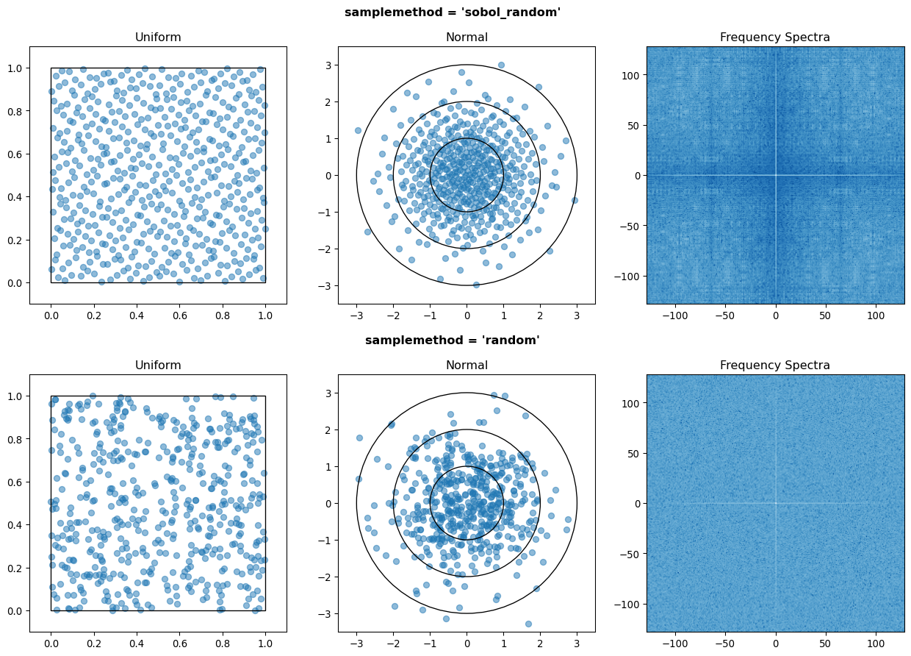
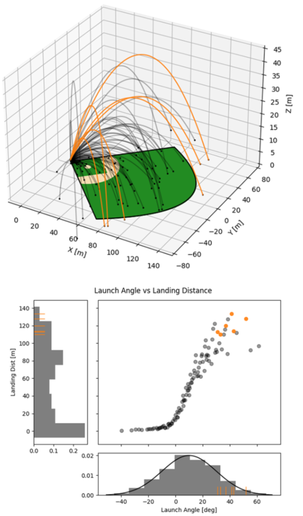
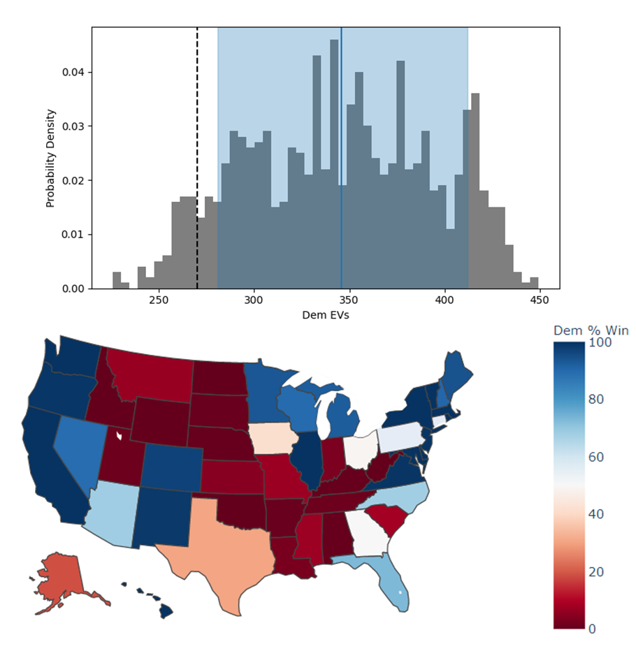

:author: W\. Scott Shambaugh
:email: wsshambaugh@gmail.com
:bibliography: refs

---------------------------------------------------------------------------------
Monaco: A Monte Carlo Library for Performing Uncertainty and Sensitivity Analyses
---------------------------------------------------------------------------------

.. class:: abstract

   This paper introduces *monaco*, a Python library for conducting Monte Carlo simulations of computational models, and performing uncertainty analysis (UA) and sensitivity analysis (SA) on the results. UA and SA are critical to effective and responsible use of models in science, engineering, and public policy, however their use is uncommon. By providing a simple, general, and rigorous-by-default library that wraps around existing models, *monaco* makes UA and SA easy and accessible to practitioners with a basic knowledge of statistics.

.. class:: keywords

   Monte Carlo, Modeling, Uncertainty Quantification, Uncertainty Analysis, Sensitivity Analysis, Decision-Making, Ensemble Prediction, VARS, D-VARS

Introduction
============

Computational models form the backbone of decision-making processes in science, engineering, and public policy. However, our increased reliance on these models stands in contrast to the difficulty in understanding them as we add increasing complexity to try and capture ever more of the fine details of real-world interactions. Practitioners will often take the results of their large, complex model as a point estimate, with no knowledge of how uncertain those results are :cite:`ferretti2016trends`. Multiple-scenario modeling (e.g. looking at a worst-case, most-likely, and best-case scenario) is an improvement, but a complete global exploration of the input space is needed. That gives insight into the overall distribution of results (UA) as well as the relative influence of the different input factors on the ouput variance (SA). This complete understanding is critical for effective and responsible use of models in any decision-making process, and policy papers have identified UA and SA as key modeling practices :cite:`azzini2020uncertainty` :cite:`us2009guidance`.

Despite the importance of UA and SA, recent literature reviews show that they are uncommon – in 2014 only 1.3% of all published papers :cite:`ferretti2016trends` using modeling performed any SA. And even when performed, best practices are usually lacking – amongst papers which specifically claimed to perform sensitivity analysis, a 2019 review found only 21% performed global (as opposed to local or zero) UA, and 41% performed global SA :cite:`saltelli2019so`. 

Typically, UA and SA are done using Monte Carlo simulations, for reasons explored in the following section. There are Monte Carlo frameworks available, however existing options are largely domain-specific, focused on narrow sub-problems (i.e. integration), tailored towards training neural nets, or require a deep statistical background to use. See :cite:`OLIVIER2020101204`, :cite:`razavi2021future`, and :cite:`DOUGLASSMITH2020104588` for an overview of the currently available Python tools for performing UA and SA. For the domain expert who wants to perform UA and SA on their existing models, there is not an easy tool to do both in a single shot. *monaco* was written to address this gap.

   The monaco project logo. :label:`monacologo`

Motivation for Monte Carlo Approach
===================================

Mathematical Grounding
----------------------

Randomized Monte Carlo sampling offers a cure to the curse of dimensionality: consider an investigation of the output from :math:`k` input factors :math:`y = f(x_1, x_2, ..., x_k)` where each factor is uniformly sampled between 0 and 1, :math:`x_i \in U[0, 1]`. The input space is then a :math:`k`-dimensional hypercube with volume 1. If each input is varied one at a time (OAT), then the volume :math:`V` of the convex hull of the sampled points forms a hyperoctahedron with volume :math:`V = \frac{1}{k!}` (or optimistically, a hypersphere with :math:`V = \frac{\pi^{k/2}}{2^k \Gamma(k/2 + 1)}`), both of which decrease super-exponentially as :math:`k` increases. Unless the model is known to be linear, this leaves the input space wholly unexplored. In contrast, the volume of the convex hull of :math:`n \to \infty` random samples as is obtained with a Monte Carlo approach will converge to :math:`V=1`, with much better coverage within that volume as well :cite:`dyer1992volumes`. See Fig. :ref:`figvolume`.

.. figure:: hypersphere_volume.png
   :align: center
   :figclass: h
   :scale: 50 %

   Volume fraction :math:`V` of a :math:`k`-dimensional hypercube enclosed by the convex hull of :math:`n \to \infty` random samples versus OAT samples along the principle axes of the input space. :label:`figvolume`

Benefits and Drawbacks of Basic Monte Carlo Sampling
----------------------------------------------------

*monaco* focuses on forward uncertainty propagation with basic Monte Carlo sampling. This has several benefits:

* The method is conceptually simple, lowering the barrier of entry and increasing the ease of communicating results to a broader audience.
* The same sample points can be used for UA and SA. Generally, Bayesian methods such as Markov Chain Monte Carlo provide much faster convergence on UA quantities of interest, but their undersampling of regions that do not contribute to the desired quantities is inadequate for SA and complete exploration of the input space. The author's experience aligns with :cite:`saltelli2019so` in that there is great practical benefit in broad sampling without pigeonholing one's purview to particular posteriors, through uncovering bugs and edge cases in regions of input space that were not being previously considered.
* It can be applied to domains that are not data-rich. See for example NASA's use of Monte Carlo simulations during rocket design prior to collecting test flight data :cite:`hanson2010applying`.

However, basic Monte Carlo sampling is subject to the classical drawbacks of the method such as poor sampling of rare events and the slow :math:`\sigma / \sqrt{n}` convergence on quantities of interest. If the outputs and regions of interest are firmly known at the outset, then other sampling methods will be more efficient :cite:`kroese2013handbook`.

Additionally, given that any conclusions are conditional on the correctness of the underlying model and input parameters, the task of validation is critical to confidence in the UA and SA results. However, this is currently out of scope for the library and must be performed with other tools. In a data-poor domain, hypothesis testing or probabilistic prediction measures like loss scores can be used to anchor the outputs against a small number of real-life test data. More generally, the "inverse problem" of model and parameter validation is a deep field unto itself and :cite:`national2012assessing` and :cite:`shiffrin2008survey` are recommended as overviews of some methods. If *monaco*'s scope is too limited for the reader's needs, the author recommends `UQpy` :cite:`OLIVIER2020101204` for UA and SA, and `PyMC` :cite:`salvatier2016probabilistic` or `Stan` :cite:`carpenter2017stan` as good general-purpose probabilistic programming Python libraries.

Workflow
--------

UA and SA of any model follows a common workflow. Probability distributions for the model inputs are defined, and randomly sampled values for a large number of cases are fed to the model. The outputs from each case are collected and the full set of inputs and outputs can be analyzed. Typically, UA is performed by generating histograms, scatter plots, and summary statistics for the output variables, and SA is performed by looking at the effect of input on output variables through scatter plots, performing regressions, and calculating sensitivity indices. These results can then be compared to real-world test data to validate the model or inform revisions to the model and input variables. See Fig. :ref:`figanalysisprocess`.

Note that with model and input parameter validation currently outside *monaco*'s scope, closing that part of the workflow loop is left up to the user.

.. figure:: analysis_process.png
   :align: center
   :figclass: h

   Monte Carlo workflow for understanding the full behavior of a computational model, inspired by :cite:`saltelli2019so`. :label:`figanalysisprocess`

*monaco* Structure
==================

Overall Structure
-----------------

Broadly, each input factor and model output is a *variable* that can be thought of as lists (rows) containing the full range of randomized *values*. *Cases* are slices (columns) that take the *i*'th input and output value for each variable, and represent a single run of the model. Each case is run on its own, and the output values are collected into output variables. Fig. :ref:`figarchitecture` shows a visual representation of this.

.. figure:: val_var_case_architecture.png
   :align: center
   :figclass: h

   Structure of a monaco simulation, showing the relationship between the major objects and functions. This maps onto the central block in Fig. :ref:`figanalysisprocess`. :label:`figarchitecture`

Simulation Setup
----------------
The base of a *monaco* simulation is the `Sim` object. This object is formed by passing it a name, the number of random cases `ncases`, and a dict `fcns` of the handles for three user-defined functions detailed in the next section. A random seed that then seeds the entire simulation can also be passed in here, and is highly recommended for repeatability of results.

Input variables then need to be defined. *monaco* takes in the handle to any of `scipy.stat`'s continuous or discrete probability distributions, as well as the required arguments for that probability distribution :cite:`virtanen2020scipy`. If nonnumeric inputs are desired, the method can also take in a `nummap` dictionary which maps the randomly drawn integers to values of other types.

At this point the sim can be run. The randomized drawing of input values, creation of cases, running of those cases, and extraction of output values are automatically executed. 

User-Defined Functions
----------------------

The user needs to define three functions to wrap *monaco*'s Monte Carlo structure around their existing computational model. First is a `run` function which either calls or directly implements their model. Second is a `preprocess` function which takes in a `Case` object, extracts the randomized inputs, and structures them with any other invariant data to pass to the `run` function. Third is a `postprocess` function which takes in a `Case` object as well as the results from the model, and extracts the desired output values. The Python call chain is as:

.. code-block:: python
    
    postprocess(case, *run(*preprocess(case)))

Or equivalently to expand the Python star notation into pseudocode:

.. code-block:: python
    
    siminput = (siminput1, siminput2, ...) 
                 = preprocess(case)
    simoutput = (simoutput1, simoutput2, ...)
                  = run(*siminput) 
                  = run(siminput1, siminput2, ...)
    _ = postprocess(case, *simoutput)
      = postprocess(case, simoutput1, simoutput2, ...)

These three functions must be passed to the simulation in a dict with keys `'run'`, `'preprocess'`, and `'postprocess'`. See the example code at the end of the paper for a simple worked example.

Examining Results
-----------------

After running, users should generally do all of the following UA and SA tasks to get a full picture of the behavior of their computational model.

* Plot the results (UA & SA).

* Calculate statistics for input or output variables (UA).

* Calculate sensitivity indices to rank importance of the input variables on variance of the output variables (SA).

* Investigate specific cases with outlier or puzzling results.

* Save the results to file or pass them to other programs. 

Data Flow
---------

A summary of the process and data flow:

1) Instantiate a `Sim` object.
2) Add input variables to the sim with specified probability distributions.
3) Run the simulation. This executes the following:    

   a) Random percentiles :math:`p_i \in U[0,1]` are drawn `ndraws` times for each of the input variables.
   b) These percentiles are transformed into random values via the inverse cumulative density function of the target probability distribution :math:`x_i = F^{-1}(p_i)`.
   c) If nonnumeric inputs are desired, the numbers are converted to objects via a `nummap` dict.
   d) `Case` objects are created and populated with the input values for each case.
   e) Each case is run by structuring the inputs values with the `preprocess` function, passing them to the `run` function, and collecting the output values with the `postprocess` function.
   f) The output values are collected into output variables and saved back to the sim. If the values are nonnumeric, a `valmap` dict assigning numbers to each unique value is automatically generated.

4) Calculate statistics & sensitivities for input & output variables.
5) Plot variables, their statistics, and sensitivities.

Incorporating into Existing Workflows 
-------------------------------------

If the user wants to use existing workflows for generating, running, post-processing, or examining results, any combination of *monaco*'s major steps can be replaced with external tooling by saving and loading input and output variables to file. For example, *monaco* can be used only for its parallel processing backend by importing existing randomly drawn input variables, running the simulation, and exporting the output variables for outside analysis. Or, it can be used only for its plotting and analysis capabilities by feeding it inputs and outputs generated elsewhere.

Resource Usage
--------------

Note that *monaco*'s computational and storage overhead in creating easily-interrogatable objects for each variable, value, and case makes it an inefficient choice for computationally simple applications with high :math:`n`, such as Monte Carlo integration. If the preprocessed sim input and raw output for each case (which for some models may dominate storage) is not retained, then the storage bottleneck will be the creation of a `Val` object for each case's input and output values with minimum size 0.5 kB. The maximum :math:`n` will be driven by the size of the RAM on the host machine being capable of holding at least :math:`0.5 * n(k_{in} + k_{out})` kB. On the computational bottleneck side, *monaco* is best suited for models where the model runtime dominates the random variate generation and the few hundred microseconds of `dask.delayed` task switching time. 

Technical Features
==================

Sampling Methods
----------------

Random sampling of the percentiles for each variable can be done using scipy's pseudo-random number generator (PRNG), or with any of the low-discrepancy methods from the `scip.stats.qmc` quasi-Monte Carlo (QMC) module. QMC in general provides faster :math:`O(\log(n)^k n^{-1})` convergence compared to the :math:`O(n^{-1/2})` convergence of random sampling :cite:`caflisch1998monte`. Available low-discrepancy options are regular or scrambled Sobol sequences, regular or scrambled Halton sequences, or Latin Hypercube Sampling. In general, the `'sobol_random'` method that generates scrambled Sobol sequences :cite:`sobol1967distribution` :cite:`owen2020dropping` is recommended in nearly all cases as the sequence with the fastest QMC convergence :cite:`christensen2018progressive`, balanced integration properties as long as the number of cases is a power of 2, and a fairly flat frequency spectrum (though sampling spectra are rarely a concern) :cite:`perrier2018sequences`. See Fig. :ref:`figsampling` for a visual comparison of some of the options.

   256 uniform and normal samples along with the 2D frequency spectra for PRNG random sampling (top), Sobol sampling (middle), and scrambled Sobol sampling (bottom, default). :label:`figsampling`

Order Statistics, or, How Many Cases to Run?
--------------------------------------------

How many Monte Carlo cases should one run? One answer would be to choose :math:`n \geq 2^k` with a sampling method that implements a (t,m,s) digital net (such as a Sobol or Halton sequence), which guarantees that there will be at least one sample point in every hyperoctant of the input space :cite:`joe2008constructing`. This should be considered a lower bound for SA, with the number of cases run being some integer multiple of :math:`2^k`.

Along a similar vein, :cite:`dyer1992volumes` suggests that with random sampling :math:`n \geq 2.136^k` is sufficient to ensure that the volume fraction :math:`V` approaches 1. The author hypothesizes that for a digital net, the :math:`n \geq \lambda^k` condition will be satisfied with some :math:`\lambda \leq 2`, and so :math:`n \geq 2^k` will suffice for this condition to hold. However, these methods of choosing the number of cases may undersample for low :math:`k` and be infeasible for high :math:`k`.

A rigorous way of choosing the number of cases is to first choose a statistical interval (e.g. a confidence interval for a percentile, or a tolerance interval to contain a percent of the population), and then use order statistics to calculate the minimum :math:`n` required to obtain that result at a desired confidence level. This approach is independent of :math:`k`, making UA of high-dimensional models tractable. *monaco* implements order statistics routines for calculating these statistical intervals with a distribution-free approach that makes no assumptions about the normality or other shape characteristics of the output distribution. See Chapter 5 of :cite:`hahn1991statistical` for background.

A more qualitative UA method would simply be to choose a reasonably high :math:`n` (say, :math:`n=2^{10}`), manually examine the results to ensure high-interest areas are not being undersampled, and rely on bootstrapping of the desired variable statistics to obtain the required confidence levels. 

Variable Statistics
-------------------

For any input or output variable, a statistic can be calculated for the ensemble of values. *monaco* builds in some common statistics (mean, percentile, etc), or alternatively the user can pass in a custom one. To obtain a confidence interval for this statistic, the results are resampled with replacement using the `scipy.stats.bootstrap` module. The number of bootstrap samples is determined using an order statistic approach as outlined in the previous section, and multiplying that number by a scaling factor (default 10x) for smoothness of results.

Sensitivity Indices
-------------------

Sensitivity indices give a measure of the relationship between the variance of a scalar output variable to the variance of each of the input variables. In other words, they measure which of the input ranges have the largest effect on an output range. It is crucial that sensitivity indices are global rather than local measures – global sensitivity has the stronger theoretical grounding and there is no reason to rely on local measures in scenarios such as automated computer experiments where data can be easily and arbitrarily sampled :cite:`saltelli2008global` :cite:`puy2022comprehensive`.

With computer-designed experiments, it is possible to construct a specially constructed sample set to directly calculate global sensitivity indices such as the Total-Order Sobol index :cite:`sobol2001global`, or the IVARS100 index :cite:`razavi2016new`. However, this special construction requires either sacrificing the desirable UA properties of low-discrepancy sampling, or conducting an additional Monte Carlo analysis of the model with a different sample set. For this reason, *monaco* uses the D-VARS approach to calculating global sensitivity indices, which allows for using a set of given data :cite:`sheikholeslami2020fresh`. This is the first publically available implementation of the D-VARS algorithm.

Plotting
--------
*monaco* includes a plotting module that takes in input and output variables and quickly creates histograms, empirical CDFs, scatter plots, or 2D or 3D "spaghetti plots" depending on what is most appropriate for each variable. Variable statistics and their confidence intervals are automatically shown on plots when applicable.

Vector Data
-----------

If the values for an output variable are length :math:`s` lists, NumPy arrays, or Pandas dataframes, they are treated as timeseries with :math:`s` steps. Variable statistics for these variables are calculated on the ensemble of values at each step, giving time-varying statistics.

The plotting module will automatically plot size :math:`(1, s)` arrays against the step number as 2-D lines, size :math:`(2, s)` arrays as 2-D parametric lines, and size :math:`(3, s)` arrays as 3-D parametric lines.

Parallel Processing
-------------------

*monaco* uses *dask.distributed* :cite:`rocklin2015dask` as a parallel processing backend, and supports preprocessing, running, and postprocessing cases in a parallel arrangement. Users familiar with *dask* can extend the parallelization of their simulation from their single machine to a distributed cluster.

For simple simulations such as the example code at the end of the paper, the overhead of setting up a *dask* server may outweigh the speedup from parallel computation, and in those cases *monaco* also supports running single-threaded in a single for-loop.

The Median Case
---------------

A "nominal" run is often useful as a baseline to compare other cases against. If desired, the user can set a flag to force the first case to be the median 50th percentile draw of all the input variables prior to random sampling.

Debugging Cases
---------------

By default, all the raw results from each case's simulation run prior to postprocessing are saved to the corresponding `Case` object. Individual cases can be interrogated by looking at these raw results, or by indicating that their results should be highlighted in plots. If some cases fail to run, *monaco* will mark them as incomplete and those specific cases can be rerun without requiring the full set of cases to be recomputed. A `debug` flag can be set to not skip over failed cases and instead stop at a breakpoint or dump the stack trace on encountering an exception.

Saving and Loading to File 
--------------------------

The base `Sim` object and the `Case` objects can be serialized and saved to or loaded from `.mcsim` and `.mccase` files respectively, which are stored in a results directory. The Case objects are saved separately since the raw results from a run of the simulation may be arbitrarily large, and the Sim object can be comparatively lightweight. Loading the Sim object from file will automatically attempt to load the cases in the same directory, but can also stand alone if the raw results are not needed.

Alternatively, the numerical representations for input and output variables can be saved to and loaded from `.json` or `.csv` files. This is useful for interfacing with external tooling, but discards the metadata that would be present by saving to *monaco*'s native objects.

Example
=======
Presented here is a simple example showing a Monte Carlo simulation of rolling two 6-sided dice and looking at their sum.

The user starts with their `run` function which here directly implements their computational model. They must then create `preprocess` and `postprocess` functions to feed in the randomized input values and collect the outputs from that model.

.. code-block:: python
    
    # The 'run' function, which implements the
    # existing computational model (or wraps it)
    def example_run(die1, die2):
        dicesum = die1 + die2
        return (dicesum, )
    
    # The 'preprocess' function grabs the random
    # input values for each case and structures it 
    # with any other data in the format the 'run' 
    # function expects
    def example_preprocess(case):
        die1 = case.invals['die1'].val
        die2 = case.invals['die2'].val
        return (die1, die2)
    
    # The 'postprocess' function takes the output
    # from the 'run' function and saves off the
    # outputs for each case
    def example_postprocess(case, dicesum):
        case.addOutVal(name='Sum', val=dicesum)
        case.addOutVal(name='Roll Number',
                       val=case.ncase)
        return None

The *monaco* simulation is initialized, given input variables with specified probability distributions (here a random integer between 1 and 6), and run.

.. code-block:: python
    
    import monaco as mc
    from scipy.stats import randint
    
    # dict structure for the three input functions
    fcns = {'run'        : example_run,
            'preprocess' : example_preprocess,
            'postprocess': example_postprocess}
    
    # Initialize the simulation
    ndraws = 1024  # Arbitrary for this example
    seed = 123456  # Recommended for repeatability
    
    sim = mc.Sim(name='Dice Roll', ndraws=ndraws,
                 fcns=fcns, seed=seed)
    
    # Generate the input variables
    sim.addInVar(name='die1', dist=randint,
                 distkwargs={'low': 1, 'high': 6+1})
    sim.addInVar(name='die2', dist=randint,
                 distkwargs={'low': 1, 'high': 6+1})
    
    # Run the Simulation
    sim.runSim()

The results of the simulation can then be analyzed and examined. Fig. :ref:`figexample` shows the plots this code generates.

.. code-block:: python
    
    # Calculate the mean and 5-95th percentile
    # statistics for the dice sum
    sim.outvars['Sum'].addVarStat('mean')
    sim.outvars['Sum'].addVarStat('percentile',
                                  {'p':[0.05, 0.95]})
    
    # Plots a histogram of the dice sum
    mc.plot(sim.outvars['Sum'])
    
    # Creates a scatter plot of the sum vs the roll
    # number, showing randomness
    mc.plot(sim.outvars['Sum'],
            sim.outvars['Roll Number'])
    
    # Calculate the sensitivity of the dice sum to 
    # each of the input variables
    sim.calcSensitivities('Sum')
    sim.outvars['Sum'].plotSensitivities()

.. figure:: example.png
   :align: center
   :figclass: h
   :scale: 40 %

   Output from the example code which calculates the sum of two random dice rolls. The top plot shows a histogram of the 2-dice sum with the mean and 5–95th percentiles marked, the middle plot shows the randomness over the set of rolls, and the bottom plot shows that each of the dice contributes 50% to the variance of the sum. :label:`figexample`

Case Studies
============

These two case studies are toy models meant as illustrative of potential uses, and not of expertise or rigor in their respective domains. Please see https://github.com/scottshambaugh/monaco/tree/main/examples for their source code as well as several more Monte Carlo implementation examples across a range of domains including financial modeling, pandemic spread, and integration.

Baseball
--------

This case study models the trajectory of a baseball in flight after being hit for varying speeds, angles, topspins, aerodynamic conditions, and mass properties. From assumed initial conditions immediately after being hit, the physics of the ball's ballistic flight are calculated over time until it hits the ground.

Fig. :ref:`figbaseball` shows some plots of the results. A baseball team might use analyses like this to determine where outfielders should be placed to catch a ball for a hitter with known characteristics, or determine what aspect of a hit a batter should focus on to improve their home run potential.

   100 simulated baseball trajectories (top), and the relationship between launch angle and landing distance (bottom). Home runs are highlighted in orange. :label:`figbaseball`

Election
--------

This case study attempts to predict the result of the 2020 US presidential election, based on polling data from FiveThirtyEight 3 weeks prior to the election :cite:`fivethirtyeight2020election`.

Each state independently casts a normally distributed percentage of votes for the Democratic, Republican, and Other candidates, based on polling. Also assumed is a uniform ±3% national swing due to polling error which is applied to all states equally. That summed percentage is then normalized so the total for all candidates is 100%. The winner of each state's election assigns their electoral votes to that candidate, and the candidate that wins at least 270 of the 538 electoral votes is the winner.

The calculated win probabilities from this simulation are 93.4% Democratic, 6.2% Republican, and 0.4% Tie. The 25–75th percentile range for the number of electoral votes for the Democratic candidate is 281–412, and the actual election result was 306 electoral votes. See Fig. :ref:`figelection`.

   Predicted electoral votes for the Democratic 2020 US Presidential candidate with the median and 25-75th percentile interval marked (top), and a map of the predicted Democratic win probability per state (bottom). :label:`figelection`

Conclusion
==========

This paper has introduced the ideas underlying Monte Carlo analysis and discussed when it is appropriate to use for conducting UA and SA. It has shown how *monaco* implements a rigorous, parallel Monte Carlo process, and how to use it through a simple example and two case studies. This library is geared towards scientists, engineers, and policy analysts that have a computational model in their domain of expertise, enough statistical knowledge to define a probability distribution, and a desire to ensure their model will make accurate predictions of reality. The author hopes this tool will help contribute to easier and more widespread use of UA and SA in improved decision-making.

Further Information
===================

*monaco* is available on PyPI as the package :code:`monaco`, has API documentation at https://monaco.rtfd.io/, and is hosted on github at https://github.com/scottshambaugh/monaco/.
