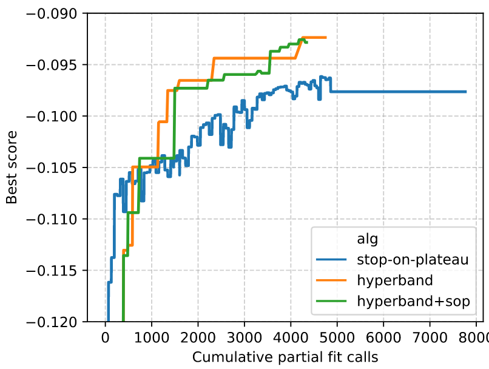
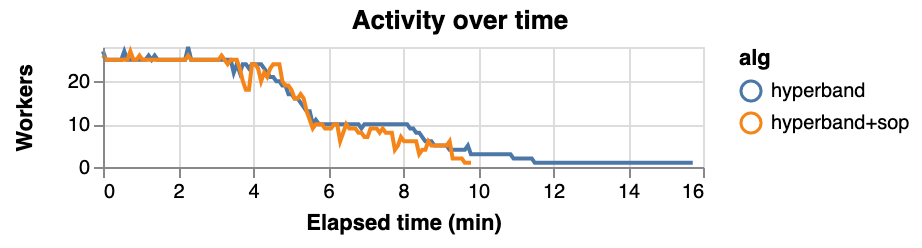

:author: Scott Sievert
:email: scott@stsievert.com
:institution: University of Wisconsin–Madison
:institution: Relevant work performed while interning for Anaconda, Inc.

:author: Tom Augspurger
:email: taugspurger@anaconda.com
:institution: Anaconda, Inc.

:author: Matthew Rocklin
:email: mrocklin@gmail.com
:institution: NVIDIA
:institution: Work performed while employed for Anaconda, Inc.

:bibliography: refs

-------------------------------------------
Better and faster model selection with Dask
-------------------------------------------

.. class:: abstract

   TODO

.. class:: keywords

   machine learning, model selection, distributed, dask

Introduction
============

.. Introduction
   Hyperparameters are input to machine learning workflow
   Performance strongly depends on hyperparameters
   They require searching
   Has gotten more complex. Growth of hyper-parameters

.. Problem statement
   * Hyper-parameter search is pain for data scientist
   * Often takes a long time to complete
   * Goals for model selection:
     * primary goal: high performing models
     * secondary goal: quick
   * Most model selection algorithms require inputs of how long to train each
     model and how many models to evaluate. It'd be convienent to have minimal
     inputs.

.. Contributions
    * implements particular model selection algorithm in Dask-ML. This
      algorithm returns high performing models and has minimal inputs.
    * makes some modifications to make Hyperband more amendable to
      parallelism
    * provides a simple heuristic to determine the inputs for Hyperband,
      which only requires knowing how many examples to feed the model and a
      rough estimate of how many parameters to sample
    * An expirement is performed to validate the parallelism claims
   These provide progress towards all 3 questions above.
   We will walk through each of these sections.

.. Theoretical groundings
   Thm from Hyperband paper
   Depends on successive halving
   Runs many brackets in parallel
   Intuition: use bandit framework

.. Amendable to parallelism
   Two levels of parallelism
   Intuition: requires sweeping over how easy to use

.. Ease of use
   Requires one parameter
   Direct result of killing off models early and sweeping over parameter
   Here's how to specify

.. Simulations
   Walk through blog post example

.. Conclusion & Future work
   Conclusion
   Implement for black-box models
   Work on removing deepcopy
   Validate works well with large memory GPU models

There are three inputs to a machine learning pipeline: data, an untrained model
and "hyper-parameters", or parameters that are required for training and
influence the performance of the model. A good example is with the
regularization parameter in ridge regression :cite:`marquardt1975` or LASSO
:cite:`tibshirani1996`). This value helps the model adapt to the noise levels
in the data.

Model performance strongly depends on the hyper-parameters provided, even for
the simple examples above with a convex optimization and one hyper-parameter.
This gets much more complex when more hyper-parameters are required.
For example, in a recent study of a particular visualization tool input
combinations of three different hyper-parameters and the the first section is
titled "Those hyper-parameters really matter" :cite:`wattenberg2016`.

These hyper-parameters are typically assumed to be given, so they require some
cross-validation search to find an estimate of the optimal value. Even in the
simple ridge regression case above, a brute force search is required
:cite:`marquardt1975`. This gets more complex with many different
hyper-parameter values to input, and especially because there's often an
interplay between hyper-parameters. In practice, this means that
hyper-parameters have to be searched or tuned to find the value that provides
the highest performance.

Model selection has become more complicated as data has grown, especially with
the growth of deep learning. A good example is with the simplest optimization
hyper-parameter: learning rate. For convex problems with few data, a technique
called line search can be performed every iteration. However, with many data
this becomes too expensive to compute and the learning rate is another
hyper-parameter that needs to be tuned.

.. TODO: reformat above paragraph

.. cite Steven Wright's book TODO

Contributions
=============

Model selection is required if high performance is desired. In practice, it's a
burden for machine learning researchers and practitioners. At best, model
selection wouldn't need to be performed. However, in practice it's required.
Ideally, a model selection algorithm should return high performing models.
High performing models make quality predictions on examples never observed
before, typically evaluated by scoring a validation dataset.

Returning the high performing model quickly will mean the user (e.g., a data
scientists) will not be blocked by model selection. They can use the tuned
model more quickly and move onto other more interesting tasks. Personal
experience suggests that model selection is time-consuming and routine but
required for quality performance.

Ideally, model selection algorithms return high performing models quickly and
are simple to use. This work

* implements a particular model selection algorithm, Hyperband, in Dask-ML.
  This algorithm returns models with a high validation score and is moderately
  amendable to parallelism, making a Dask implementation attractive.
* makes some simple modifications to increase amenability to parallelism
* provides an simple heuristic to determine the parameters to Hyperband, which
  only requires knowing how many examples the model should observe and a rough
  estimate on how many parameters to sample

This algorithm treats each computation as a scarce resource. If computation is
not a scarce resource, there is no benefit from this algorithm. At it's core,
this algorithm is a fancy early-stopping scheme for a random selection of
hyper-parameters.

This paper will review other existing work for model selection before
detailing the Hyperband implementation in Dask. A realistic set of experiments
will be presented before mentioning ideas for future work.

Related work
============

Dask
----

Dask is a distributed computation framework for Python. It integrates nicely
with Python, and especially with NumPy, Pandas and the PyData stack. It
provides easy methods to easily scale Python data analysis, either "up" to
"more data" or "out" to "more machines". Dask works equally well on a laptop or
a large cluster and presents the same interface.

Dask is a declarative distributed computation framework that works with many
distributed schedulers. It has it's own, Dask Distributed, and also worked with
SLURM, Spark and SGE to name a few. The programmer describes the distributed
computation to perform, and Dask determines and communicates with the
distributed scheduler which communication and computation operations to
perform.

Dask also provides a host of convenient diagnostics, including a dashboard that
reports diagnostic information on memory and CPU usage, a timeline of running
tasks and profiling information.

Software for model selection
----------------------------

A commonly used method for hyper-parameter selection is a random selection of
hyper-parameters followed by training each model to completion. This offers
several advantages, including sampling "important parameters" more densely over
unimportant parameters :cite:`bergstra2012random` and being very amendable to
parallelism. This randomized search is implemented in Scikit-Learn
:cite:`pedregosa2011` and mirrored in Dask-ML.

These implementations are passive by definition: they do not adapt to previous
training. Adaptive algorithms can return a higher quality solution in less time
by choosing which hyper-parameters to sample. This is especially useful for
difficult problems with many possible hyper-parameters.

One popular class of adaptive algorithms are Bayesian model selection
algorithms. These algorithms treat the model as a black box and scores as a
noisy evaluation of that black box. These methods try to find the optimal set
of a hyper-parameters given a minimal number of observations by adapting to
previous evaluations.

Popular Bayesian searches include sequential model-based algorithm
configuration (SMAC) :cite:`hutter2011`, tree-structure Parzen estimator (TPE)
:cite:`bergstra2011`, and Spearmint :cite:`snoek2012`. Many of these are
available through the "robust Bayesian optimization" package RoBo
:cite:`kleinbayesopt17` through AutoML [#automl]_. This package also includes
Fabolas, a method that takes data-set size as input and allows for some
computational control :cite:`klein2016`.

.. [#automl] https://github.com/automl/

Hyperband
---------

.. TODO rewrite this section to only explain first goal: high performing
   models.

Hyperband is an adaptive model selection algorithm :cite:`li2016hyperband`.
Hyperband is a principled early-stopping scheme for randomized searches, at
least in one application of the algorithm. Hyperband trains many models in
parallel and decides to stop models at particular times to preserve
computation. By contrast, most Bayesian searches tweak a set of
hyper-parameters based on serial evaluations of a model that's assumed to be a
black box.

The analysis underlying Hyperband relies on sweeping over the tradeoff between
training time and hyper-parameter importance. If training time only matters a
little, it makes sense to aggressively stop training models. On the flip side,
if only training time influence the score, it only makes sense to let all
models train for as long as possible.

This allows a mathematical proof that Hyperband is will return a much higher
performing model than the randomized search without early stopping returns:

.. latex::
   :usepackage: amsthm

.. raw:: latex

   \newtheorem{thm}{Theorem}
   \newcommand{\Log}{\overline{\log}}
   \newcommand{\parens}[1]{\left( #1 \right)}
   \begin{thm}
   \label{thm:hyperband}
   (informal presentation of Theorem 5 from \cite{li2016hyperband})
   Assume the loss at iteration $k$ decays like $(1/k)^{1/\alpha}$, and
   the validation losses approximately follow the cumulative distribution
   function $F(\nu) = (\nu - \nu_*)^\beta$ for $\nu\in[0, 1]$ with optimal
   validation loss $\nu_*$.

   Higher values of $\alpha$ mean slower
   convergence, and higher values of $\beta$ represent more difficult model
   selection problems because it's harder to obtain a validation loss close to
   the optimal validation loss $\nu_*$.
   If $\beta > 1$, the validation losses are not uniformly
   distributed. The commonly used stochastic gradient
   descent has convergence rates with $1 \le \alpha \le 2$ with lower values
   implying more structure and regularity
   \cite{bottou2012stochastic} \cite{shamir2013}.

   Then for any $T\in\mathbb{N}$, let $\widehat{i}_T$ be the empirically best
   performing model when models are stopped early according to the infinite
   horizon Hyperband
   algorithm when $T$ resources have been used to train models. Then
   with probability $1 -\delta$, the empirically best performing model
   $\widehat{i}_T$ has loss $$\nu_{\widehat{i}_T} \le \nu_* +
   c\parens{\frac{\Log(T)^3 \cdot a}{T}}^{1/\max(\alpha,~\beta)}$$ for some constant
   $c$ and $a = \Log(\log(T) / \delta)$ where $\Log(x) = \log(x \log(x))$.

    By comparison, the best model without early stopping (i.e., randomized
    searches) after $T$ resources have been used to train models only has loss
   $$\nu_{\widehat{i}_T} \le \nu_* + c \parens{\frac{\log(T) \cdot a}{T}}^{1 / (\alpha + \beta)}$$
   \end{thm}

For simplicity, only the infinite horizon case is presented though much of the
analysis carries over to the practical finite horizon Hyperband. [#finite]_
Because of this, it only makes sense to compare the loss when the number of
resources used :math:`T` is large. When this happens, the validation loss of
the best model Hyperband produces :math:`\nu_{\widehat{i}_T}` is much smaller
than the uniform allocation scheme. [#sizes]_

.. [#finite] To prove results about the finite horizon algorithm Li et. al.
   only need the result in Corollary 9 :cite:`li2016hyperband`.
   In the discussion afterwards, they remark that with Corollary 9
   they can show a similar result to Theorem :ref:`thm:hyperband` but leave
   it as an exercise for the reader.

.. [#sizes] This is clear by examining :math:`\log(\nu_{\widehat{i}_T} -
   \nu_*)` for Hyperband and uniform allocation. For Hyperband, the slope
   approximately decays
   like :math:`-1 / \max(\alpha,~\beta)`, much faster than the approximate
   uniform allocation slope of :math:`-1 / (\alpha + \beta)`

This shows a definite advantage to performing early stopping on randomized
searches. In addition, Li et. al. note that the probability the best model is
identified with a (near) minimal number of pulls, within log factors of the
lower bound on number of resources required as noted by Kaufmann et. al.
:cite:`kaufmann2015complexity`.

More relevant work involves combining Bayesian searches and Hyperband, which
can be combined by using the Hyperband bracket framework `sequentially` and
progressively tuning a Bayesian prior to select parameters for each bracket
:cite:`falkner2018`. This work is also available through AutoML.

Model selection in Dask
=======================

Model selection searches problems can be compute constrained or memory
constrained or neither. Memory constrained problems include data not fitting in
memory.  Compute constrained involve searches of many hyper-parameters (e.g.,
in neural nets).

Briefly, the three classes in Dask-ML for model selection search are in the
``dask_ml.model_selection``. They follow the Scikit-Learn API. The
implementations include

- ``RandomizedSearchCV`` and ``GridSearchCV``. These mirror the Scikit-Learn
  learn API. This class is designed for searches that are compute constrained
  but not memory constrained because these classes call ``fit`` on the model.
  These classes cache stages of a pipeline, which is remarkably useful with
  expensive pre-processing stages. [#jim]_
- ``IncrementalSearchCV``. By default, this mirrors either of the passive
  searches above. This class is designed to handle large datasets for searches
  that are not compute constrained. It calls ``partial_fit`` on each "chunk" or
  partition of the provided Dask array.
- ``HyperbandSearchCV``. This class is designed for all compute constrained
  searches. It inherits all of the features of ``IncrementalSearchCV`` and
  implements a principled early stopping scheme.

.. [#jim] Jim Crist from Anaconda, Inc. implemented these classes.

.. TODO should Jim be an author?

A brief summary is provided in Table :ref:`table`.

The rest of this paper will be spent describing the details of the most complex
algorithm, ``HyperbandSearchCV``. Points to cover include

* the Hyperband architecture and why it's well-suited for Dask
* the input parameters required for Hyperband, and how it requires one less
  input than most other searches
* the dwindling number of models present in the Hyperband architecture, and
  modifications to address this

These will be detailed below.

.. latex::
   :usepackage: caption

.. raw:: latex

   \setlength{\tablewidth}{0.9\linewidth}
   \captionsetup{justification=raggedright}

.. table:: A non-exhaustive and non-complete listing of the currently available
          implementations for
           model selection searches available in Dask-ML and the types of
           problems they handle best.
           The ``{Randomized, Grid}SearchCV`` classes implemented in
           Dask-ML cache stages of a pipeline.
           This is especially useful when data preprocessing takes a long time and have hyper-parameters that require tuning.
           :label:`table`

   +----------------------+---------------------+-------------------------------------------------------------------+
   | Compute constrained? | Memory constrained? | Dask Implementation(s)                                            |
   +======================+=====================+===================================================================+
   | No                   | Yes                 | ``IncrementalSearchCV``                                           |
   +----------------------+---------------------+-------------------------------------------------------------------+
   | Yes                  | No                  |  ``GridSearchCV``, ``RandomizedSearchCV``, ``HyperbandSearchCV``  |
   +----------------------+---------------------+-------------------------------------------------------------------+
   | Yes                  | Yes                 | ``HyperbandSearchCV``                                             |
   +----------------------+---------------------+-------------------------------------------------------------------+

Hyperband architecture
----------------------

There are two levels of parallelism in Hyperband, which result in two
embarrassingly parallel for-loops:

* the sweep over the different brackets of the hyper-parameter vs. training
  time importance tradeoff
* in each call to successive halving, the models are trained completely
  independently

Of course, the number of models in each bracket decrease over time because
Hyperband is an early stopping strategy. For each bracket, the number of models
is (for example) halved. This is best illustrated by the algorithm:

.. code-block:: python

   def sha(n_models, calls):
       """Successive halving algorithm"""
       models = [get_model_w_random_params()
                 for _ in range(n_models)]
       while True:
           models = [train(m, calls) for m in models]
           models = top_k(len(models) // 3, models)
           if len(models) == 1:
               break
           calls *= 3
       return models

   def hyperband(max_iter):
       # More models => more aggressive pruning of models
       brackets = [num_models_initial_calls(b, max_iter)
                   for b in range(f(max_iter))]
       final_models = [sha(n, r) for n, r in brackets]
       return best_model(final_models)

Each bracket indicates a value in the tradeoff between hyper-parameter and
training time importance. With ``max_iter=243``, the least adaptive bracket runs
5 models until completion and the most adaptive bracket aggressively prunes off
81 models.

This architecture lends itself well to Dask, an advanced distributed scheduler
that can handle many concurrent jobs. Dask Distributed is required because the
computation graph is not static: training stops on particular models. This
wouldn't be a problem if only one successive halving bracket ran; however,
those are also run in parallel.

Input parameters
----------------

Hyperband requires two input parameters:

1. the number of ``partial_fit`` calls for the best estimator (via ``max_iter``)
2. the number of examples that each ``partial_fit`` call sees (which is implicit
   via ``chunks``, the chunk size of the Dask array).

These two parameters rely on knowing how long to train the estimator
[#examples]_ and having a rough idea on the number of parameters to evaluate.
Trying twice as many parameters with the same amount of computation requires
halving ``chunks`` and doubling ``max_iter``.

In comparison, random searches require three inputs:

1. the number of ``partial_fit`` calls for `every` estimator (via ``max_iter``)
2. how many parameters to try (via ``num_params``).
3. the number of examples that each ``partial_fit`` call sees (which is implicit
   via ``chunks``, the chunk size of the Dask array).

Trying twice as many parameters with the same amount of computation requires
doubling ``num_params`` and halving either ``max_iter`` or ``chunks``, so every
estimator will see half as many data. This means a balance between training
time and hyper-parameter importance is implicitly being decided upon.
Hyperband has one fewer input because it sweeps over this balance's importance.

.. [#examples] e.g., something in the form "the most trained model should see 100 times the number of examples (aka 100 epochs)"
.. [#tolerance] Tolerance (typically via ``tol``) is a proxy for ``max_iter`` because smaller tolerance typically means more iterations are run.

Dwindling number of models
--------------------------

At first, Hyperband evaluates many models. The number of models decay because
Hyperband is a principled early stopping scheme. Hyperband varies how
aggressively it stops models per bracket: the most aggressive bracket performs
something like a binary search and the least aggressive bracket lets a couple
models run without any stopping.

This can present a problem. Towards the end of the computation, there can be a
small number of models that take an exceedingly long time to finish. This is
especially a problem when computational resources have to be paid for (e.g.,
with cloud platforms like Amazon AWS or Google Cloud Engine).

Performing additional stopping on top of Hyperband will reduce the score:
there's less training happening. However, if the correct models are stopped
that is not an issue. There are two cases to protect against:

1. When training time continues too long, and the models all converge long
   before training finishes
2. When poor hyper-parameters are selected and model quality either plateaus or
   decreases over time. This is especially prevalent in the brackets of
   Hyperband that are less adaptive because there's less control.

Both of these are addressed by a "stop on plateau" algorithm that monitors the
model's score and stops training if it doesn't increase enough. This requires
two additional parameters: ``patience`` to determine how long to wait before
stopping a model, and ``tol`` which determines how much the score should
increase by.

Both of the cases to protect against are addressed by setting ``patience`` to
be high. Both issues are addressed by setting ``patience`` high because

1. We don't think it's more likely that the programmer specified the training
   time to be slight too short rather than drastically too short. Setting
   ``patience`` to be high provides a measure to control for this.
2. Two concerns: there is little control over the least adaptive brackets of
   Hyperband by design. However, stopping when training when validation score
   decreases is a commonly used technique :cite:`prechelt1998automatic`.
   Setting ``patience`` to be high but not infinite address these concerns.

How should ``patience`` be by default? The current implementation uses
``patience=True`` to let Hyperband be layered with stop on plateau with a
patience of ``max_iter // 3``.

This choice is validated by the experiments. The most salient results are shown
in Figure :ref:`fig:activity`.

Experiments
===========
Problem
-------

Model architecture & Parameters
-------------------------------

Performance
-----------

   This is a wide figure, specified by adding "w" to the figclass.  It is also
   center aligned, by setting the align keyword (can be left, right or center).
   :label:`fig:calls`

.. figure:: 2019-03-24-time.png
   :align: center

   This is a wide figure, specified by adding "w" to the figclass.  It is also
   center aligned, by setting the align keyword (can be left, right or center).
   :label:`fig:time`

   This is a wide figure, specified by adding "w" to the figclass.  It is also
   center aligned, by setting the align keyword (can be left, right or center).
   :label:`fig:activity`

Future work
===========

The biggest area for improvement is using another application of the Hyperband
algorithm. Currently, it's applied to the case where computation is controlled
by number of ``partial_fit`` calls to the algorithm. However, it can also
control dataset size as the controlling variable. This would treat every model
as a black box and only require the model implement ``fit``.

Another area of future work is ensuring ``IncrementalSearchCV`` and all of it's
inheritants (including ``HyperbandSearchCV``) work well with large models.
Modern models often consume most of GPU memory, and currently
``IncrementalSearchCV`` requires making a copy the model. How much does this
hurt performance and can it be avoided?

References
==========

