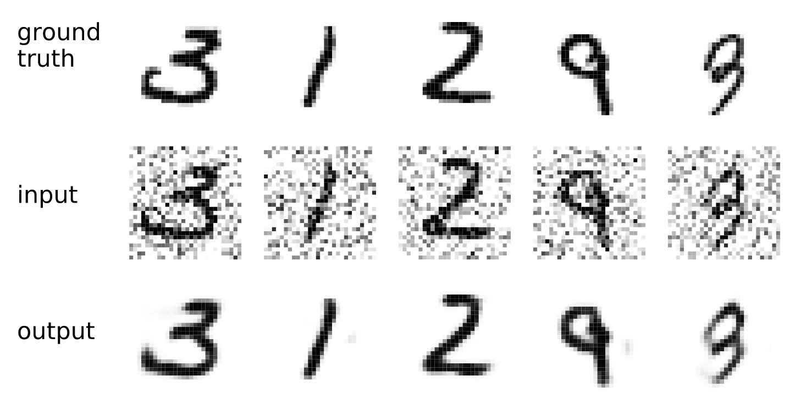
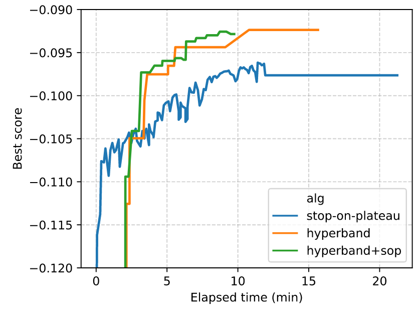
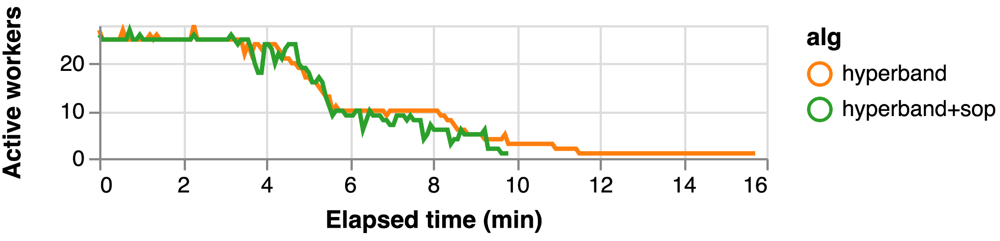

:author: Scott Sievert
:email: scott@stsievert.com
:institution: University of Wisconsin–Madison
:institution: Relevant work performed while interning for Anaconda, Inc.

:author: Tom Augspurger
:email: taugspurger@anaconda.com
:institution: Anaconda, Inc.

:author: Matthew Rocklin
:email: mrocklin@gmail.com
:institution: NVIDIA
:institution: Relevant work performed while employed for Anaconda, Inc.

:bibliography: refs

-------------------------------------------
Better and faster model selection with Dask
-------------------------------------------

.. class:: abstract

   Nearly every machine learning estimator has parameters assumed to be given.
   Finding the optimal set of these values is a difficult and time-consuming
   process for most modern estimators and is called "model selection". A recent
   breakthrough model selection algorithm Hyperband addresses this problem by
   finding high performing estimators with minimal training and has theoretical
   backing. This paper will explain why Hyperband is well-suited for Dask, the
   required input parameters and the rationale behind some minor modifications.
   Experiments with a neural network will be used for illustration and
   comparison.

.. class:: keywords

   machine learning, model selection, distributed, dask

Introduction
============

Training any machine learning pipeline requires data, an untrained model or
estimator and parameters that change the model and data, a.k.a.
"hyper-parameters". These hyper-parameters greatly influence the performance of
the model but are typically assumed to be given. A good example is with
adapting the ridge regression or LASSO models to the amount of noise in the
data with the regularization parameter :cite:`marquardt1975`
:cite:`tibshirani1996`.

Model performance strongly depends on the hyper-parameters provided, even for
the simple examples above. This gets much more complex when more
hyper-parameters are required. For example, a particular visualization tool
(t-SNE) requires (at least) three different hyper-parameters
:cite:`maaten2008visualizing`. The first section of a study on how to use this
tool effectively is titled "Those hyper-parameters really matter"
:cite:`wattenberg2016`.

These hyper-parameters are typically assumed to be given. This requires
searching over the possible values to find the best value by some measure
Typically models are scored on unseen data through a "cross-validation" search.
These searches are part of a "model selection" process because hyper-parameters
are considered part of the model. Even in the simple ridge regression case
above, a brute force search is required :cite:`marquardt1975`.

This gets more complex with many different hyper-parameter values to input, and
especially because there's often an interplay between hyper-parameters. A good
example is with deep learning, which has specialized techniques for handling
many data :cite:`bottou2010large`. However, these optimization methods can't
provide basic hyper-parameters because there are too many data. For example,
the most basic hyper-parameter "learning rate" or "step size" is
straightforward with few data but infeasible with many data
:cite:`maren2015prob`.

Contributions
=============

A hyper-parameter search a.k.a "model selection" is required if high
performance is desired. In practice, it's a burden for machine learning
researchers and practitioners. Ideally, model selection algorithms return high
performing models quickly and are simple to use.

Returning high performing models quickly will allow the user (e.g., a data
scientist) to more easily use model selection. Having a better search method
will allow them to easily find high performing models and remove the need for
repeating model selection searches to obtain a better model. Returning this
high performing model quickly would lower the barrier to performing model
selection.

This work

* provides implementation of a particular model selection algorithm, Hyperband
  in Dask, a Python library that provides advanced parallelism. Hyperband
  returns models with a high validation score with minimal training.  A Dask
  implementation is attractive because Hyperband is amenable to parallelism.
* makes a simple modifications to increase Hyperband's amenability to
  parallelism.
* provides an simple heuristic to determine the parameters to Hyperband, which
  only requires knowing how many examples the model should observe and a rough
  estimate on how many parameters to sample
* provides validating experiments

Hyperband treats computation as a scarce resource [#scarce]_ and has parallel
underpinnings. Hyperband can only return high performing models with minimal
training because it evaluate models in parallel.

In the experiments, Hyperband returns high performing models fairly quickly,
though the simple modification returns models nearly as good and only require
about 70% of time. The simple heuristic for determining input parameter to
Hyperband make it easy to use. The implementation can be found on the machine
learning for Dask, Dask-ML. The documentation for Dask-ML is available at
https://ml.dask.org.

This paper will review other existing work for model selection before
detailing the Hyperband implementation in Dask. A realistic set of experiments
will be presented before mentioning ideas for future work.

.. [#scarce] If computation is not a scarce resource, there is no benefit from
   this algorithm.

Related work
============

Dask
----

Dask provides advanced parallelism for analytics, especially for NumPy, Pandas
and Scikit-Learn :cite:`dask`. It is familiar to Python users and does not
require rewriting code or retraining models to scale to larger datasets or to
more machines. It can scale up to clusters or to massive dataset but also works
on laptops and presents the same interface. Dask provides two components:

* Dynamic task scheduling optimized for computation. This low level scheduler
  provides parallel computation and is optimized for interactive computational
  workloads.
* "Big Data" collections like parallel arrays, or dataframes, and lists that
  extend common interfaces like NumPy, Pandas, or Python iterators to
  larger-than-memory or distributed environments. These parallel collections
  run on top of dynamic task schedulers.

Dask aims to be familiar and flexible: it aims to parallelize and distribute
computation or datasets easily while retaining a task scheduling interface for
custom workloads and integration into other projects. It is fast and the
scheduler has lower overhead. It's implemented in pure Python and can scale
from massive datasets to a cluster with thousands of cores to a laptop running
single process. In addition, it's designed with interactive computing in mind
and provides rapid feedback and diagnostics to aid humans.

Software for model selection
----------------------------

Model selection can be thought of as finding the optimal hyper-parameter for a
given model. A commonly used method for hyper-parameter selection is a random
selection of hyper-parameters followed by training each model to completion.
This offers several advantages, including a simple implementation that is  very
amendable to parallelism. Other benefits include sampling "important
parameters" more densely over unimportant parameters :cite:`bergstra2012random`
This randomized search is implemented in many places, including in Scikit-Learn
:cite:`pedregosa2011`.

These implementations do not adapt to previous training, and are by definition
`passive`. `Adaptive` algorithms can return a higher quality solution in less
time by adapting to previous training and choosing which hyper-parameters to
sample. This is especially useful for difficult model selection problems with
many hyper-parameters and many values for each hyper-parameter.

Bayesian algorithms are popular as adaptive model selection algorithms. These
algorithms treat the model as a black box and the model scores as a noisy
evaluation of that black box. These algorithms try to tune a set of
hyper-parameters over time given serial evaluations of the black box.

Popular Bayesian searches include sequential model-based algorithm
configuration (SMAC) :cite:`hutter2011`, tree-structure Parzen estimator (TPE)
:cite:`bergstra2011`, and Spearmint :cite:`snoek2012`. Many of these are
available through the "robust Bayesian optimization" package RoBo
:cite:`kleinbayesopt17` through AutoML [#automl]_. This package also includes
Fabolas, a method that takes dataset size as input and allows for some
computational control :cite:`klein2016`.

.. [#automl] https://github.com/automl/

Hyperband
---------

Hyperband is an adaptive model selection algorithm :cite:`li2016hyperband`.
Hyperband is a principled early-stopping scheme for randomized searches, at
least in one application of the algorithm. Hyperband trains many models in
parallel and decides to stop models at particular times to preserve
computation. By contrast, most Bayesian searches tweak a set of
hyper-parameters based on serial evaluations of a model that's assumed to be a
black box.

The analysis underlying Hyperband relies on sweeping over the tradeoff between
training time and hyper-parameter importance. If training time only matters a
little, it makes sense to aggressively stop training models. On the flip side,
if only training time influence the score, it only makes sense to let all
models train for as long as possible.

This allows a mathematical proof that Hyperband is will return a much higher
performing model than the randomized search without early stopping returns:

.. latex::
   :usepackage: amsthm

.. raw:: latex

   \newtheorem{thm}{Theorem}
   \newcommand{\Log}{\overline{\log}}
   \newcommand{\parens}[1]{\left( #1 \right)}
   \begin{thm}
   \label{thm:hyperband}
   (informal presentation of Theorem 5 from \cite{li2016hyperband})
   Assume the loss at iteration $k$ decays like $(1/k)^{1/\alpha}$, and
   the validation losses approximately follow the cumulative distribution
   function $F(\nu) = (\nu - \nu_*)^\beta$ for $\nu\in[0, 1]$ with optimal
   validation loss $\nu_*$.

   Higher values of $\alpha$ mean slower convergence, and higher values of
   $\beta$ represent more difficult model selection problems because it's
   harder to obtain a validation loss close to the optimal validation loss
   $\nu_*$.  Taking $\beta > 1$ means the validation losses are not uniformly
   distributed and higher losses are more common. The commonly used stochastic
   gradient descent has convergence rates with $\alpha= 2$
   \cite{bottou2012stochastic} \cite[Corollary 6]{li2016hyperband}.

   Then for any $T\in\mathbb{N}$, let $\widehat{i}_T$ be the empirically best
   performing model when models are stopped early according to the infinite
   horizon Hyperband
   algorithm when $T$ resources have been used to train models. Then
   with probability $1 -\delta$, the empirically best performing model
   $\widehat{i}_T$ has loss $$\nu_{\widehat{i}_T} \le \nu_* +
   c\parens{\frac{\Log(T)^3 \cdot a}{T}}^{1/\max(\alpha,~\beta)}$$ for some constant
   $c$ and $a = \Log(\log(T) / \delta)$ where $\Log(x) = \log(x \log(x))$.

   By comparison, finding the best model without the early stopping Hyperband
   performs (i.e., randomized searches and training until completion) after $T$
   resources have been used to train models has loss $$\nu_{\widehat{i}_T} \le
   \nu_* + c \parens{\frac{\log(T) \cdot a}{T}}^{1 / (\alpha + \beta)}$$
   \end{thm}

For simplicity, only the infinite horizon case is presented though much of the
analysis carries over to the practical finite horizon Hyperband. [#finite]_
Because of this, it only makes sense to compare the loss when the number of
resources used :math:`T` is large. When this happens, the validation loss of
the Hyperband produces :math:`\nu_{\widehat{i}_T}` is much smaller than the
uniform allocation scheme. [#sizes]_ This shows a definite advantage to
performing early stopping on randomized searches.

.. [#finite] To prove results about the finite horizon algorithm Li et. al.
   only need the result in Corollary 9 :cite:`li2016hyperband`.
   In the discussion afterwards they remark that with Corollary 9
   they can show a similar result to Theorem :ref:`thm:hyperband` but it's
   left as an exercise for the reader.

.. [#sizes] This is clear by examining :math:`\log(\nu_{\widehat{i}_T} -
   \nu_*)` for Hyperband and uniform allocation. For Hyperband, the slope
   approximately decays
   like :math:`-1 / \max(\alpha,~\beta)`, much faster than the
   uniform allocation's approximate slope of :math:`-1 / (\alpha + \beta)`.

Li et. al. show that the model Hyperband identifies as the best is identified
with a (near) minimal number of pulls in Theorem 7 :cite:`li2016hyperband`,
within log factors of the known lower bound on number of resources required
:cite:`kaufmann2015complexity`.

More relevant work involves combining Bayesian searches and Hyperband, which
can be combined by using the Hyperband bracket framework `sequentially` and
progressively tuning a Bayesian prior to select parameters for each bracket
:cite:`falkner2018`. This work is also available through AutoML.

There is little to no gain from adaptive searches if the passive search
requires little computational effort. Adaptive searches spends choosing which
models to evaluate to minimize the computational effort required; if that's not
a concern there's not much value the value in any adaptive search is limited.

Adaptive model selection in Dask
================================

Dask can scale up to clusters or to massive datasets. Model selection searches
often require significant amounts of computation and can involve large
datasets. Combining Dask with advanced model selection is a natural fit.  This
work focuses on the case when the computation required is not insignificant.
Then, the existing `passive` model selection algorithms in Dask-ML have limited
use because they don't `adapt` to previous training to reduce the amount of
training required. [#dasksearchcv]_

This work implements an adaptive model selection algorithm, Hyperband, in
Dask's machine learning library, Dask-ML.  [#docs]_ This algorithm adapts to
previous training to minimize the amount of computation required. This section
will detail the Hyperband architecture, the input arguments required and some
modifications to reduce time to solution.

.. [#dasksearchcv] Though the existing implementation can reduce the
   computation required when pipelines are used. This is particularly useful
   when tuning data preprocessing (e.g., with natural language processing).
   More detail at https://ml.dask.org/hyper-parameter-search.html.

.. [#docs] The documentation the Hyperband implementation can be found at
   https://ml.dask.org.

.. TODO: add link to Hyperband docs

Hyperband architecture
----------------------

There are two levels of parallelism in Hyperband, which result in two
embarrassingly parallel for-loops:

* an "embarrassingly parallel" sweep over the different brackets of the
  hyper-parameter vs. training time importance
* in each bracket, the models are trained independently (though the training of
  low performing models ceases at particular times)

Of course, the number of models in each bracket decrease over time because
Hyperband is an early stopping strategy. This is best illustrated by the
algorithm's pseudo-code:

.. code-block:: python

   from sklearn.base import BaseEstimator

   def sha(n_models: int, calls: int) -> BaseEstimator:
       """Successive halving algorithm"""
       # (model and params are specified by the user)
       models = [get_model(random_params())
                 for _ in range(n_models)]
       while True:
           models = [train(m, calls) for m in models]
           models = top_k(len(models) // 3, models)
           calls *= 3
           if len(models) <  3:
               return best_model(models)

   def hyperband(max_iter: int) -> BaseEstimator:
       # Different brackets have different values of
       # "training" and "hyper-parameter" importance.
       # => more models means more aggressive pruning
       brackets = [(get_num_models(b, max_iter),
                    get_initial_calls(b, max_iter))
                   for b in range(formula(max_iter))]
       if max_iter == 243:
           assert brackets == [(81, 3), (34, 9),
                               (15, 27), (8, 81),
                               (5, 243)]
       final_models = [sha(n, r) for n, r in brackets]
       return best_model(final_models)

Each bracket indicates a value in the tradeoff between hyper-parameter and
training time importance. With ``max_iter=243``, the least adaptive bracket runs
5 models until completion and the most adaptive bracket aggressively prunes off
81 models.

This architecture with many embarrassingly parallel for-loops and nested
parallelism lends itself well to Dask, an advanced distributed scheduler that
can handle many concurrent jobs. Dask can exploit the parallelism present in
this algorithm and train models from different brackets concurrently.

Dask Distributed is required because of the nested parallelism and the decision
to stop training low-performing models. This means the computational graph is
dynamic and depends on other nodes in the graph.

Input parameters
----------------

Hyperband is fairly easy to use as well. It only requires two input parameters:

1. the number of ``partial_fit`` calls for the best model (via
   ``max_iter``)
2. the number of examples that each ``partial_fit`` call sees (which is
   implicit and referred to as ``chunks``, which can be the "chunk size" of the
   Dask array).

These two parameters rely on knowing how long to train the model
[#examples]_ and having a rough idea on the number of parameters to evaluate.
Trying twice as many parameters with the same amount of computation requires
halving ``chunks`` and doubling ``max_iter``. There is a third parameter that
controls the aggressiveness of the search and stopping model training, but it's
optional and has some theoretical backing.

In comparison, random searches require three inputs:

1. the number of ``partial_fit`` calls for `every` model (via ``max_iter``)
2. how many parameters to try (via ``num_params``).
3. the number of examples that each ``partial_fit`` call sees (which is
   implicit and referred to as ``chunks``, which can be the "chunk size" of the
   Dask array).

Trying twice as many parameters with the same amount of computation requires
doubling ``num_params`` and halving either ``max_iter`` or ``chunks``, which
means every model will see half as many data. An balance between training time
and hyper-parameter importance is implicitly being decided upon. Hyperband has
one fewer input because it sweeps over this balance's importance.

.. [#examples] e.g., something in the form "the most trained model should see
   100 times the number of examples (aka 100 epochs)"
.. [#tolerance] Tolerance (typically via ``tol``) is a proxy for ``max_iter``
   because smaller tolerance typically means more iterations are run.

Dwindling number of models
--------------------------

At first, Hyperband evaluates many models. As time progresses, the number of
models decay because Hyperband is a (principled) early stopping scheme.
Hyperband varies how aggressively to stop model training per bracket. Each
bracket performs something like a binary search but varies the amount of
training between each decision. The least aggressive bracket lets a few models
run without any stopping.

This means towards the end of the computation, a few models can be training
while most of the computational hardware is free. This is especially a problem
when computational resources are not free (e.g., with cloud platforms like
Amazon AWS or Google Cloud Engine).

Hyperband is a principled early stopping scheme, but doesn't protect against at
least two common cases:

1. when models have converged before training completes (i.e., the score stays
   constant)
2. when models have not converged and poor hyper-parameters are chosen (so the
   scores are decreasing).

These common use cases happen when the user specifies a poor set of
hyper-parameters or that training continue for too long. Regardless,
the scores of the models above will not increase too much with high
probability.

Providing a "stop on plateau" scheme will protect against these cases because
training will be stopped if a model's score stops increasing
:cite:`prechelt1998automatic`. This will require two additional parameters:
``patience`` to determine how long to wait before stopping a model, and ``tol``
which determines how much the score should increase.

Hyperband's early stopping is designed to identify the highest performing model
with minimal training. Setting ``patience`` to be high avoids interference with
this scheme, protects against both cases above, and errs on the side of giving
models more training time. In particular, it also provides a basic early
stopping mechanism for the least adaptive bracket of Hyperband.

The current implementation uses ``patience=True`` to choose a high value of
``patience=max_iter // 3``. This choice is validated by the experiments.

Experiments
===========

This section will highlight a practical use of ``HyperbandSearchCV``. This
involves a neural network using a popular library (PyTorch [#pytorch]_
:cite:`paszke2017automatic` through the wrapper Skorch [#skorch]_). This is
a difficult model selection problem even for this relatively simple model.
The complete implementation behind these experiments can be found at
https://github.com/stsievert/dask-hyperband-comparison.

.. [#pytorch] https://pytorch.org
.. [#skorch] https://github.com/skorch-dev/skorch

Problem
-------

This section will walk through an image denoising task. The inputs and desired
outputs are given in Figure :ref:`fig:io+est`. This is an especially difficult
problem because the noise variance varies slightly between images, which
requires a model that's at least a little complex.

Model architecture & Parameters
-------------------------------

To address that complexity, let's use an autoencoder. These are a type of neural
network that reduce the dimensionality of the input before expanding to the
original dimension. This can be thought of a lossy compression. Let's create
that model:

.. code-block:: python

   # custom model definition with PyTorch
   from autoencoder import Autoencoder
   import skorch  # scikit-learn API wrapper for PyTorch

   # definition in Appendix
   est = skorch.NeuralNetRegressor(Autoencoder, ...)

.. This autoencoder has two layers that compress

Of course, this is a neural network so there are many hyper-parameters to tune.
Only one effects the global optimum:

* ``estimator__activation``: which activation function should this neural net use?

There are 4 values for this hyper-parameter. The rest control reaching the
global optimum:

* ``optimizer``: optimization method should be used for training?
* ``estimator__init``: how should the estimator be initialized before training?
* ``batch_size``: how many examples should the optimizer use to approximate the gradient?
* ``optimizer__lr``, the most basic hyper-parameter for the optimizer.
* ``weight_decay``, which controls the amount of regularization
* ``optimizer__momentum``, which is a hyper-parameter for the SGD optimizer.

There are 4 discrete variables with :math:`160` possible combinations. For each
one of this combinations, there are 3 continuous variables to tune. Let's
create the parameters to search over:

.. code-block:: python

   # definition in Appendix
   params = {'optimizer': ['SGD', 'Adam'], ...}

The goal for model selection is to find a high performing estimator quickly is
easy usage.

Usage
-----

First, let's create a ``HyperbandSearachCV`` object:

.. code-block:: python

    from dask_ml.model_selection import HyperbandSearchCV
    search = HyperbandSearchCV(est, params, max_iter=243)
    search.fit(X_train, y_train)
    search.best_score_
    # -0.0929. Best of hand tuning: -0.098

This model has denoised series of image it's never seen before in Figure
:ref:`fig:io+est`.

   The rows show in the ground truth, input and output respectively for the
   denoising problem. The output is shown for the best model that Hyperband
   finds. :label:`fig:io+est`

``HyperbandSearchCV`` beat hand-tuning by a considerable margin. While manually
tuning, I considered any scores about :math:`-0.10` to be pretty good, and I
obtained scores no higher than :math:`-0.098`. By that measure, a score of
:math:`-0.093` is fantastic.

``HyperbandSearchCV`` only requires `one` parameter besides the model and data
as discussed above. This number controls the amount of computation that will be
performed, and does not require balancing between the number of models and how
long to train each model.

Performance
-----------

Let's compare three algorithms with the same model, parameters and validation
data. The comparisons are shown in Figures :ref:`fig:calls`, :ref:`fig:time`
and :ref:`fig:activity` and the legends for these plots is shown in Table
:ref:`table:legend`. In these experiments, 25 workers are used with Dask,
meaning that 25 tasks can complete in parallel.

I will compare against a basic stop on plateau algorithm with particular
choices for ``patience`` and ``num_params``. Specifically, I choose a fairly
aggressive value for ``patience`` and hence choose to evaluate twice as many
hyper-parameters. This illustrates the choice between hyper-parameter vs.
training time importance because training models for longer with the same
computational effort would require a higher value for ``num_params`` and a
lower and more aggressive of ``patience``.

.. table:: A summary of the legends in Figures :ref:`fig:calls`,
           :ref:`fig:time` and :ref:`fig:activity`. ``IncrementalSearchCV``
           ``patience=24`` is an algorithm that stops training after the scores
           stop increasing or plateau, hence the label.
           :label:`table:legend`

   +---------------------+---------------------------------------------------+
   | Label               | Class                                             |
   +=====================+===================================================+
   | ``hyperband``       | ``HyperbandSearchCV``                             |
   +---------------------+---------------------------------------------------+
   | ``stop-on-plateau`` | ``IncrementalSearchCV``, ``patience=24``          |
   +---------------------+---------------------------------------------------+
   | ``hyperband+sop``   | ``HyperbandSearchCV``, ``patience=True``          |
   +---------------------+---------------------------------------------------+

Figure :ref:`fig:calls` supports the claim that Hyperband will high performing
models with minimal ``partial_fit`` calls. Each ``partial_fit`` call uses 1/3
of the dataset, so algorithm passes over the training data about 1,667 times in
total, a.k.a.  1,667 epochs. Each model sees no more than 81 times the number
of examples in the dataset because ``max_iter=243`` for all searches.

.. figure:: imgs/2019-03-24-calls.png
   :align: center

   The number of ``partial_fit`` calls against the empirically best score (or
   negative loss). The legend labels are in Table :ref:`table:legend`.
   :label:`fig:calls`

However, the data scientist cares about time to reach a particular score, not
the number of ``partial_fit`` calls required. This plot is shown in Figure
:ref:`fig:time`. This plot is shown with 25 workers; if only one worker had
been used this plot in Figure :ref:`fig:time` would be the same as Figure
:ref:`fig:calls` up to the x-axis labeling.

   The time required to obtain a particular accuracy. The legend labels are in
   Table :ref:`table:legend`.
   :label:`fig:time`

.. TODO do Hyperband and Hyperband+sop find the same model?

The difference between Figures :ref:`fig:calls` and :ref:`fig:time` show a
remarkable difference of specifying ``patience`` for Hyperband: specifying
``patience=True`` means that Hyperband finishes in about 2/3rds of the time as
the default Hyperband! This is because one worker hold onto a single model for
about 4 minutes as shown in Figure :ref:`fig:activity`. Specifying
``patience=True`` removes that behavior, and likely removes that model.

.. TODO: figure out which model that is. Say a sentence about it (which bracket, etc)

   The activity over time for the 25 Dask workers.
   :label:`fig:activity`

Future work
===========

The biggest area for improvement is using another application of the Hyperband
algorithm: controlling the dataset size as the scarce resource.  This would
treat every model as a black box and vary the amount of data provided. This
would not require the model to implement ``partial_fit`` and would only require
a ``fit`` method.

Another area of future work is ensuring ``IncrementalSearchCV`` and all of it's
children (including ``HyperbandSearchCV``) work well with large models.
Modern models often consume most of GPU memory, and currently
``IncrementalSearchCV`` requires making a copy the model. How much does this
hurt performance and can it be avoided?

References
==========

