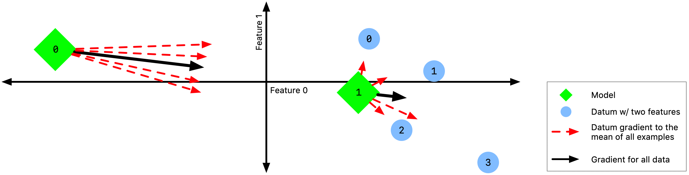
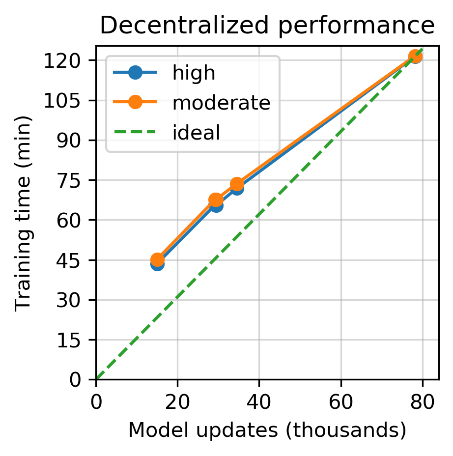
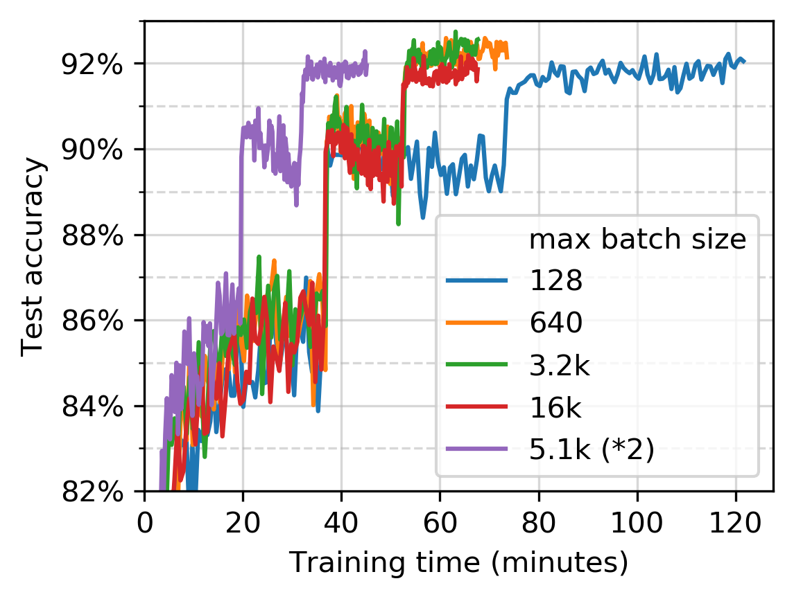
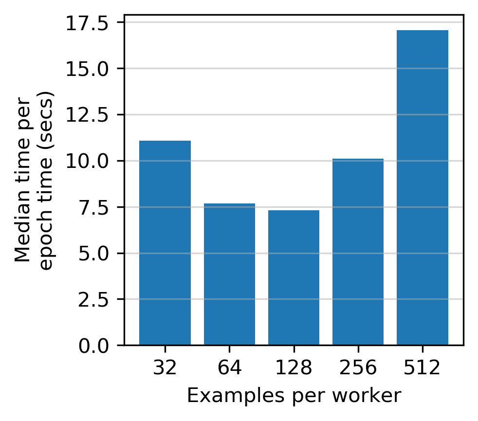
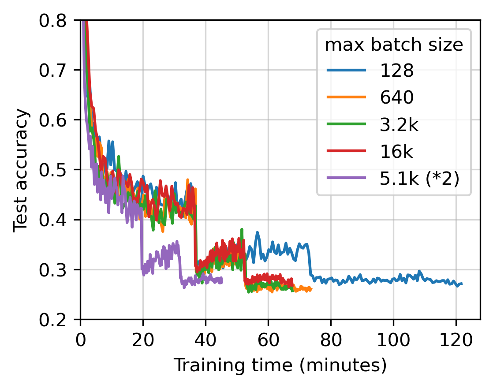
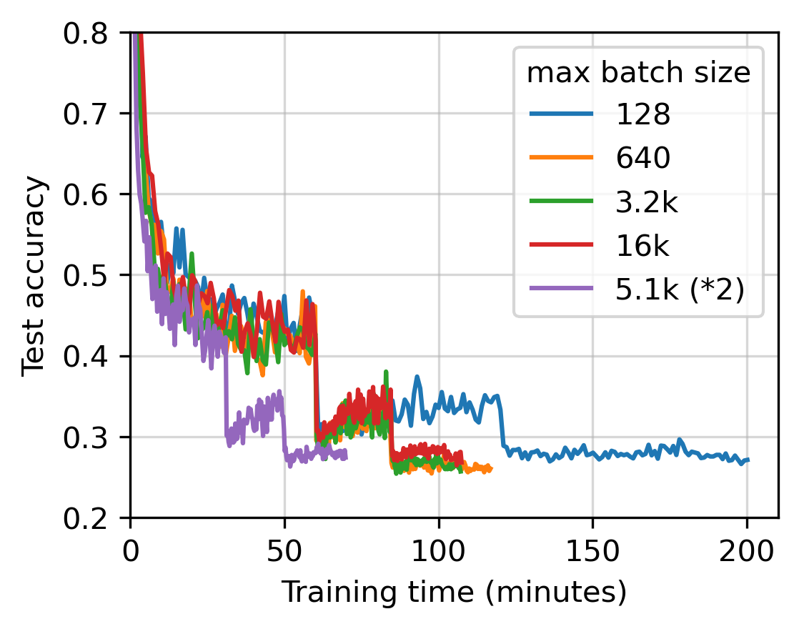

:author: Joesph Holt
:email: jpholt2@wisc.edu
:institution: University of Wisconsin–Madison

:author: Scott Sievert
:email: stsievert@wisc.com
:institution: University of Wisconsin–Madison
:corresponding:

:bibliography: refs

-------------------------------------------------
Training machine learning models faster with Dask
-------------------------------------------------

.. class:: abstract

   Machine learning (ML) relies on stochastic algorithms, all of which rely on
   gradient approximations with "batch size" examples. Growing the batch size
   as the optimization proceeds is a simple and usable method to reduce the
   training time, provided that the number of workers grows with the batch
   size. In this work, we provide a package that trains PyTorch models on Dask
   clusters, and can grow the batch size if desired. Our simulations indicate
   that for a particular model that uses GPUs for a popular image
   classification task, the training time can be reduced from about 120 minutes
   with standard SGD to 45 minutes with a variable batch size method.

.. class:: keywords

   machine learning, model training, distributed computation

Introduction
============

Training deep machine learning models takes a long time. For example, training
a popular image classification model :cite:`recht2019imagenet` to reasonable
accuracy takes "around 17 hours" on Google servers. [#]_ Another example
includes training an NLP model for 10 days on 8 high-end GPUs
:cite:`radford2018improving`. [#]_ Notably, the number of floating point
operations (FLOPs) required for "the largest AI training runs" doubles every
3.4 months. [#]_

.. [#] Specifically, a ResNet-50 model on the ImageNet database using a Google
   Tensor Proceesing Unit (TPU)
   (`github.com/tensorflow/tpu/.../resnet/README.md`_).

.. [#] See OpenAI's blog post "`Improving Language Understanding with Unsupervised Learning`_."

.. [#] See OpenAI's blog post "`AI and Compute`_."

Model training is fundamentally an optimization problem: it tries to find a
model :math:`\bm{\widehat{w}}` that minimizes a loss function :math:`F`:

.. The number of FLOPs is proportional the number
.. of `gradient computations` (aka "epochs") and determines the budget of a
.. particular training run. (deleted footnote)

.. math::

   \bm{\widehat{w}} = \arg\min_{\bm{w}} F(\bm{w}) := \frac{1}{n}\sum_{i=1}^n f(\bm{w}; \bm{z}_i)

where there are :math:`n` examples in the training set, and each example is
represented by :math:`\bm{z}_i`. For classification, :math:`\bm{z}_i =
(\bm{x}_i, y_i)` for a label :math:`y_i` and feature vector :math:`\bm{x}_i`.
The loss function :math:`F` is the mean of the loss :math:`f` over different
examples. To compute this minimization for large scale machine learning,
stochastic gradient descent (SGD) or a variant thereof is used
:cite:`bottou2018optimization`. SGD is iterative, and the model update at each
step :math:`k` is computed via

.. math::

   \bm{w}_{k+1} = \bm{w}_k - \frac{\gamma_k}{B_k} \sum_{i=1}^{B_k}
   \bm{g}(\bm{w}_k; \bm{z}_{i_s})

where :math:`\bm{g}` is the gradient of the loss function :math:`f` for some
batch size :math:`B_k \ge 1`, :math:`i_s` is chosen uniformly at random and
:math:`\gamma_k > 0` is the learning rate or step size. The objective
function's gradient is approximated with :math:`B_k` examples – the gradient
approximation :math:`\frac{1}{B_k}\sum_{i=1}^{B_k} \bm{g}(\bm{w}_k;
\bm{z}_{i_s})` is an unbiased estimator of the loss function :math:`F`'s
gradient. This computation is common in the vast majority of SGD variants, and
is found in popular variants like Adam :cite:`adam`, RMSprop :cite:`rmsprop`,
Adagrad :cite:`adagrad`, Adadelta :cite:`adadelta`, and averaged SGD
:cite:`asgd`.  Most variants make modifications to the learning rate
:math:`\gamma_k` :cite:`adagrad, adadelta, adam, rmsprop`.

Increasing the batch size :math:`B_k` will reduce the number of model updates
while not requiring more FLOPs or gradient computations – both empirically
:cite:`smith2017` and theoretically :cite:`sievert2021improving`. Typically,
the number of FLOPs controls the training time because training is performed
with a single processor. At first, fewer model updates seems like an internal
benefit that doesn't affect training time.

.. latex::

    \par The benefit comes when training with multiple machines, aka a
    distributed system. Notably, the time required to complete a single model
    update is (nearly) agnostic to the batch size provided the number of
    workers in a distributed system grows with the batch size. In one
    experiment, the time to complete a model update grows by 13\% despite the
    batch size growing by a factor of 44~\cite[Sec.~5.5]{goyal2017accurate}.
    This acceleration has also been observed with an increasing batch size
    schedule~\cite[Sec.~5.4]{smith2017}.

.. On Amazon EC2, the cost of a machine with :math:`N` GPUs is proportional
   to :math:`N`.

.. _Improving Language Understanding with Unsupervised Learning: https://openai.com/blog/language-unsupervised/

.. _AI and Compute: https://openai.com/blog/ai-and-compute/

.. _github.com/tensorflow/tpu/.../resnet/README.md: https://github.com/tensorflow/tpu/blob/4cee6f16f78a92b4da8b1b7bad1e4841c9bda77a/models/official/resnet/README.md

Contributions
=============

We provide software to accelerate machine learning model training, at least
with certain distributed systems. For acceleration, the distributed system must
be capable of assigning a different number of workers according to a fixed
schedule. Specifically, this work provides the following:

* A Python software package to train machine learning models. The
  implementation [#]_ provides a Scikit-learn API :cite:`sklearn_api` to PyTorch
  models :cite:`paszke2019pytorch`.
* Our software works on any cluster that is configured to work with Dask, many
  of which can change the number of workers on demand. [#]_
* Extensive experiments to illustrate that our software can accelerate model
  training in terms of wall-clock time when an appropriate Dask cluster is used.

.. [#] https://github.com/stsievert/adadamp

.. [#] Including the default usage (through `LocalCluster`_), supercomputers
       (through `Dask Job-Queue`_), YARN/Hadoop clusters (through `Dask Yarn`_)
       and Kubernetes clusters (through `Dask Kubernetes`_).

.. latex::

   A key component of our software is that the number of workers grows with the
   batch size. Then, the model update time is agnostic to the batch size
   provided that communication is instantaneous. This has been shown
   empirically: Goyal et al. grow the batch size (and the number of workers
   with it) by a factor of $44$ but the time for a single model update only
   increases by a factor of $1.13$~\cite[Sec.~5.5]{goyal2017accurate}.

Now, let's cover related work to gain understanding of why variable batch
sizes provide a benefit in a distributed system. Then, let's cover the details
of our software before presenting simulations. These simulations confirm that
model training can be accelerated if the number of workers grows with the batch
size. Methods to workaround limitations on the number of workers will be
presented.

.. _LocalCluster: https://distributed.dask.org/en/latest/api.html#distributed.LocalCluster
.. _Dask YARN: https://yarn.dask.org/en/latest/
.. _Dask Job-Queue: https://jobqueue.dask.org/en/latest/
.. _Dask Kubernetes: https://docs.dask.org/en/latest/setup/kubernetes.html

Related work
============

.. This work is focused on increasing the batch size.
.. First, let's examine the performance of large batch sizes. Then, let's examine
.. methods to increase the batch size. Both of these methods require the
.. following:
..
.. * The same amount of training data. For deterministic models, this is
..   proportional to the number of FLOPs.
.. * Fewer model updates.
..
.. As discussed in the introduction, fewer model updates is not an internal
.. benefit if each model update can be parallelized. In that case, it's possible
.. to make the wall-clock time required to train a model proportional to the
.. number of model updates.

The data flow for distributed model training involves distributing the
computation of the gradient estimate,
:math:`\frac{1}{B}\sum_{i=1}^{B} \bm{g}(\bm{w}_k; \bm{z}_i)`.
Typically, each worker computes the gradients for
:math:`B/P` examples when there is a batch size of :math:`B` and :math:`P`
machines. Then, the average of these gradients is taken and the model is
updated. [#]_

Clearly, Amdahl's law is relevant because there are diminishing returns as the
number of workers :math:`P` is increased :cite:`golmant2018computational`.
This as referred to as "strong scaling" because the batch size is fixed and the
number of workers is treated as an internal detail.  By contrast, growing the
amount of data with the number of workers is known as "weak scaling."  Of
course, relevant experiments show that weak scaling exhibits better scaling
than strong scaling :cite:`qi2017paleo`.

..  [#] Related but tangential methods include methods to efficiently
        communicate the gradient estimates
        :cite:`alistarh2016qsgd, grubic2018synchronous, wang2018atomo`.

.. In fact, with a constant batch
.. size the number of FLOPs or gradient computations is often the variable that
.. determines model performance :cite:`perrone2019optimal, yin2018`.

Constant batch sizes
--------------------

To circumvent Amdahl's law, a common technique is to increase the batch size
:cite:`zhang2019algorithmic` alongside the learning rate
:cite:`johnson2020adascale`. Using moderately large batch sizes yields high
quality results more quickly and, in practice, requires no more computation
than small batch sizes, both empirically :cite:`goyal2017accurate` and
theoretically :cite:`yin2018`.

There are many methods to choose the best constant batch size (e.g.,
:cite:`gazagnadou2019optimal, khaled2020unified`). Some methods are data
dependent :cite:`yin2018`, and others depend on the model complexity. In
particular, one method uses hardware topology (e.g., network bandwidth) in a
distributed system :cite:`perrone2019optimal`.

.. latex::

   \par Large constant batch sizes present generalization
   challenges~\cite{goyal2017accurate}. The generalization error is
   hypothesized to come from "sharp" minima, strongly influenced by the
   learning rate and noise in the gradient estimate~\cite{keskar2016large}. To
   match performance on the training dataset, careful thought must be given to
   hyperparameter selection~\cite[Sec.~3 and~5.2]{goyal2017accurate}. In fact,
   this has motivated algorithms specifically designed for large constant batch
   sizes and distributed systems~\cite{johnson2020adascale,jia2018,
   you2017large}.

.. By contrast, a method to increase the batch
   size is motivated by "simulated annealing," where reducing the "noise scale" or
   "temperature" of a model update may help the system converge :cite:`smith2017`.

Increasing the batch size
-------------------------

   An illustration of why the batch size should increase. Here, let's find a
   model :math:`\bm{w} = [w_x, w_y]` that minimizes the function :math:`f(w_x,
   w_y) = \sum_{i=0}^3 (w_x - x_i)^2 + (w_y - y_i)^2` where :math:`x_i` and
   :math:`y_i` are the :math:`x` and :math:`y` coordinates of each datum. When
   closer to the optimum at model A, the gradients are more "diverse," so the
   magnitude and orientation of each datum's gradient varies more
   :cite:`yin2018`.  :label:`fig:eg`

Model quality greatly influences the amount of information in the gradient
– which influences the batch size :cite:`sievert2021improving`. For example, if
models are poorly initialized, then using a large batch size has no benefit:
the gradient—or direction to the optimal model—for each example will produce
very similar numbers. An illustration is given in Figure :ref:`fig:eg`.

.. latex::

   \par

   Various methods to \emph{adaptively} change the batch size based on model
   performance have been proposed \cite{sievert2021improving, de2016big,
   balles2016coupling, byrd2012}.    Of course, these methods are adaptive so
   computing the batch size requires computation (though there are
   workarounds~\cite{sievert2021improving, balles2016coupling}).

   Convergence results have been given for adaptive batch
   sizes~\cite{sievert2021improving, bottou2018optimization, zhou2018new}.
   Increasing the batch size is a provably good measure that requires far fewer
   model updates and no more computation than standard SGD for strongly convex
   functions~\cite[Ch.~5]{bottou2018optimization}, and all function classes if
   the batch size is provided by an oracle~\cite{sievert2021improving}.
   Convergence proofs have also been given for the \emph{passively} increasing
   the batch size, both for strongly convex
   functions~\cite[Ch.~5]{bottou2018optimization} and for non-convex
   functions~\cite{zhou2018new}. Both of these methods require fewer model
   updates than SGD \emph{and} do not increase the number of gradient
   computations.

Notably, a geometric batch size increase schedule has shown great empirical
performance in image classification :cite:`smith2017`.  Specifically, the
number of model updates required to finish training decreased by a factor of
2.2 over standard SGD :cite:`smith2017`. Smith et al. make an observation that
increasing the batch size and decreasing the learning rate both decay the
optimization's "noise scale" (or variance of the model update), which has
connections to simulated annealing :cite:`smith2017`. This motivates increasing
the batch size by the same factor the learning rate decays :cite:`smith2017`.

Both growing the batch size and using large constant batch sizes should require
the same number of floating point operations as using standard SGD with small
batch sizes to reach a particular training loss (respectively
:cite:`sievert2021improving, bottou2018optimization` and
:cite:`johnson2020adascale, you2019large, yin2018`). Some proof techniques
suggest that variable batch size methods mirror gradient descent
:cite:`sievert2021improving, karimi2016linear`, so correspondingly, the
implementations do not require much additional hyperparameter tuning
:cite:`smith2017`.

Distributed training with Dask
==============================

We have written "AdaDamp," a software package to to train a PyTorch model with
a Scikit-learn API on any Dask cluster. [#]_  It supports the use of constant
or variable batch sizes, which fits nicely with Dask's ability to change the
number of workers. [#]_ In this section, we will walk through the basic
architecture of our software and an example usage. We will defer showing the
primary benefit of our software to the experimental results.

.. Originally, the motivation for AdaDamp included showing
.. adaptively damping the noise in the gradient estimate requires fewer model
.. updates – an internal benefit that is not user facing. We have added
.. distributed support to show the primary benefit of batch size growth: reduced
.. training time when the distributed system is configured appropriately.

.. [#] While our software works with a constant batch size, the native
       implementations work with constant batch sizes and very likely have
       less overhead (e.g., PyTorch Distributed :cite:`li2020pytorch`).

.. [#] https://github.com/stsievert/adadamp

Architecture
------------

Our software uses a centralized synchronous parameter server and controls the
data flow of the optimization with Dask (and does not rely on PyTorch's
distributed support). Specifically, the following happen on every model update:

1. The master node broadcasts the model to every worker.
2. The workers calculate the gradients.
3. The workers communicate the gradients back to the master.
4. The master performs a model update with the aggregated gradients.

We use Dask to implement this data flow, which adds some overhead. [#]_ AdaDamp
supports static batch sizes; however, there is little incentive to use
AdaDamp with a static batch sizes: the native solution has PyTorch less
overhead :cite:`li2020pytorch`, and already has a Dask wrapper. [#]_

.. [#] An opportunity for future work.

.. [#] https://github.com/saturncloud/dask-pytorch-ddp

.. latex::

   The key component of AdaDamp is that the number of workers grows
   with the batch size. Then, the model update time is agnostic to the batch size
   (provided communication is instantaneous). This has been shown empirically:
   Goyal et al. grow the batch size (and the number of workers with it) by a
   factor of $44$ but the time for a single model update only increases by a
   factor of $1.13$~\cite[Sec.~5.5]{goyal2017accurate}.

Example usage
-------------

First, let's create a standard PyTorch model. This is a simple definition; a
more complicated model or one that uses GPUs can easily be substituted.

.. code-block:: python

   import torch.nn as nn
   import torch.nn.functional as F

   class HiddenLayer(nn.Module):
       def __init__(self, features=4, hidden=2, out=1):
           super().__init__()
           self.hidden = nn.Linear(features, hidden)
           self.out = nn.Linear(hidden, out)

       def forward(self, x, *args, **kwargs):
           return self.out(F.relu(self.hidden(x)))

Now, let's create our optimizer:

.. code-block:: python

   from adadamp import DaskRegressor
   import torch.optim as optim

   est = DaskRegressor(
       module=HiddenLayer, module__features=10,
       optimizer=optim.Adadelta,
       optimizer__weight_decay=1e-7,
       max_epochs=10
   )

So far, a PyTorch model and optimizer have been specified. As per the
Scikit-learn API, we specify parameters for the model/optimizer with double
underscores, so in our example ``HiddenLayer(features=10)`` will be created.
We can set the batch size increase parameters at initialization if desired, or
inside ``set_params``.

.. code-block:: python

   from adadamp.dampers import GeoDamp
   est.set_params(
       batch_size=GeoDamp, batch_size__delay=60,
       batch_size__factor=5)

This will increase the batch size by a factor of 5 every 60 epochs, which is
used in the experiments. Now, we can train:

.. code-block:: python

   from sklearn.datasets import make_regression
   X, y = make_regression(n_features=10)
   X = torch.from_numpy(X.astype("float32"))
   y = torch.from_numpy(y.astype("float32")).reshape(-1, 1)

   est.fit(X, y)

Experiments
===========

In this section, we present two sets of experiments. [#]_ Both experiments will
use the same setup, a Wide-ResNet model in a "16-4" architecture
:cite:`zagoruyko2016b` to perform image classification on the CIFAR10 dataset
:cite:`cifar10`. This is a deep learning model with about 2.75 million weights
that requires a GPU to train. [#]_  The experiments will provide evidence for
the following points:

.. [#] Full detail on these experiments can be found at
       https://github.com/stsievert/adadamp-experiments

.. [#] Specifically, we used a NVIDIA T4 GPU with an Amazon ``g4dn.xlarge`` instance.
       Training consumes 2.2GB of GPU memory with a batch size of 32, and 5.5GB
       with a batch size of 256.

1. Increasing the batch size reduces the number of model updates.
2. The time required for model training is roughly proportional to the number
   of model updates (presuming the distributed system is configured correctly).

.. Model: Wide_ResNet w/ depth=16, widen_factor=4, dropout_rate=0.3, num_classes=10
.. Dataset: CIFAR10.
.. Standard transforms.
.. Loss: Cross entropy loss.
..
.. More detail:
.. https://github.com/stsievert/adadamp-experiments/blob/975f2e64e57660e011d17b219a5eefc7efa191ca/exp-dask/train.ipynb
..
.. | Batch size | GPU Memory |
.. | 1 |  1483 |
.. | 2 |  1561 |
.. | 4 |  1523 |
.. | 8 |  1621 |
.. | 16 |  1681 |
.. | 32 |  2221 |
.. | 64 |  2291 |
.. | 128 |  3407 |
.. | 256 |  5629 |
.. | 512 |  10239 |

To provide evidence for these points, let's run one set of experiments that
varies the batch size increase schedule. These experiments will mirror the
experiments by Smith et al. :cite:`smith2017`.  Additionally, let's ensure that
our software accelerates model training as the number of GPUs increase.

We train each batch size increase schedule once, and then write the historical
performance to disk. This reduces the need for many GPUs, and allows us to
simulate different networks and highlight the performance of Dask. That means
that in our simulations, we simulate model training by having the computer
sleep for an appropriate and realistic amount of time.

Batch size increase
-------------------

.. latex::

   \par To illustrate the primary benefit of our software, let's perform
   several trainings that require a different number of model updates. These
   experiments explicitly mirror the experiments by Smith et
   al.~\cite[Sec.~5.1]{smith2017}, which helps reduce the parameter tuning.

Largely, the same hyperparameters are used.  These experiments only differ in
the choice of batch size and learning rate, as shown in Figure
:ref:`fig:labels`. As in the Smith et al. experiments, every optimizer uses
Nesterov momentum :cite:`nesterov2013a` and the same momentum (0.9) and weight
decay (:math:`0.5\cdot 10^{-3}`). They start with the same initial learning
rate (0.05), [#]_ and either the learning rate is decreased or the batch size
increases by a specified factor (5) at particular intervals (epochs 60, 120 and
180). This means that the variance of the model update is reduced by a constant
factor at each update.

.. [#] These are the same as Smith et al. :cite:`smith2017` with the exception
       of learning rate (which had to be reduced by a factor of 2).

.. figure:: figs/schedule.pdf
   :align: center
   :scale: 60%
   :figclass: h

   The learning rate and batch size decrease/increase schedules for various
   optimizers. After the maximum batch size is reached, the learning rate
   decays. A postfix of "(\*2)" means the initial batch size twice as large
   (256 instead of 128) :label:`fig:labels`

These different decay schedules exhibit the same performance in terms of number
of epochs, which is proportional to the number of FLOPs, as shown in Figure
:ref:`fig:epochs`.  The number of FLOPs is (approximately) to the cost, at
least on Amazon EC2 where the cost to rent a server tends to be proportional to
the number of GPUs.

.. figure:: figs/centralized/epochs.pdf
   :align: center
   :scale: 60%
   :figclass: h

   The performance of the LR/BR schedules in Figure :ref:`fig:labels`, plotted
   with epochs—or passes through the dataset—on the x-axis. :label:`fig:epochs`

Importantly, this work focuses on increasing the number of workers with the
batch size – the effect of which is hidden in Figure :ref:`fig:epochs`.
However, the fact that the performance does not change with different
schedules means that choosing a different batch size increase schedule will not
require more wall-clock time if only a single worker is available. Combined
with the hyperparameter similarity between the different schedules, this
reduces deployment and debugging concerns.

If the number of workers grows with the batch size, then the number of
model updates is relevant to the wall-clock time. Figure :ref:`fig:updates` shows the number of model updates and wall-clock
time required to reach a model of a particular test accuracy. Of course, there
is some overhead to our current framework, which is why the number of model
updates does not exactly correlate with the wall-clock time required to
complete training. In summary, the time required to complete training is
shown in Table :ref:`table:centralized`.

.. figure:: figs/centralized/updates.pdf
   :align: center
   :scale: 60%
   :figclass: h

   The same simulations as in Figure :ref:`fig:epochs`, but plotted with the
   number of model updates and wall-clock time plotted on the x-axis (the loss
   obeys a similar behavior as illustrated in the Appendix).
   :label:`fig:updates`

.. raw:: latex

   \setlength{\tablewidth}{0.8\linewidth}

.. table:: A summary of the simulations in Figures :ref:`fig:epochs`
           and :ref:`fig:updates`. All training require approximately 200
           epochs, so they all require the same number of FLOPs.
           :label:`table:centralized`

   ==================== ================= ======================= ============
   Maximum batch size   Model     updates Training time (min)     Max. workers
   ==================== ================= ======================= ============
   5.1k (\*2)           14,960            69.87                   40
   3.2k                 29,480            107.17                  25
   16k                  29,240            107.49                  125
   640                  34,520            116.86                  5
   128                  78,200            200.19                  1
   ==================== ================= ======================= ============

Future work
===========

Architecture
------------

Fundamentally, the model weights can be either be held on a master node
(centralized), or on every node (decentralized). Respectively, these storage
architectures typically use point-to-point communication or an "all-reduce"
communication. Both centralized :cite:`li2014scaling, abadi2016` and
decentralized :cite:`li2020pytorch, sergeev2018horovod` communication
architectures are common.

Future work is to avoid the overhead introduced by manually having Dask control
the model update workflow. With any synchronous centralized system, the time
required for any one model update is composed of the time required for the following tasks:

1. Broadcasting the model from the master node to all workers
2. Finishing gradient computation on all workers.
3. Communicating gradients back to master node.
4. Various overhead tasks (e.g., serialization, worker scheduling, etc).
5. Computing the model update after all gradients are computed & gathered.

Items (1), (3) and (4) are a large concern in our implementation. Decentralized
communication has the advantage of eliminating items (1) and (4), and mitigates
(3) with a smarter communication strategy (all-reduce vs. point-to-point).
Item (2) is still a concern with straggler nodes :cite:`dean2012large`, but
recent work has achieved "near-linear scalability with 256 GPUs" in a
homogeneous computing environment :cite:`li2020pytorch`. Items (2) and (5) can
be avoided with asynchronous methods (e.g., :cite:`recht2011hogwild,
zhang2016hogwild++`).

.. latex::

   \par That is, most of the concerns in our implementation will be resolved
   with a distributed communication strategy. The PyTorch distributed
   communication package uses a synchronous decentralized strategy, so the
   model is communicated to each worker and gradients are sent between workers
   with an all-reduce scheme~\cite{li2020pytorch}. It has some machine learning
   specific features to reduce the communication time, including performing
   both computation and communication concurrently as layer gradients become
   available~\cite[Sec.~3.2.3]{li2020pytorch}.

The software library dask-pytorch-ddp [#]_ allows use of the PyTorch
decentralized communications :cite:`li2020pytorch` with Dask clusters, and is a
thin wrapper around PyTorch's distributed communication package. Future work
will likely involve ensuring training can efficiently use a variable number of
workers.

.. [#] https://github.com/saturncloud/dask-pytorch-ddp

Simulations
-----------

We have simulated the expected gain from the work of enabling decentralized
communication with two networks that use a decentralized all-reduce strategy:

* ``decentralized-medium`` It assumes an a network with inter-worker bandwidth
  of 54Gb/s and a latency of :math:`0.05\mu\textrm{s}`.
* ``centralized`` uses a centralized communication strategy (as implemented)
  and the same network as ``decentralized-medium``.
* ``decentralized-high`` has the same network as ``decentralized-medium`` but
  has an inter-worker bandwidth of 800Gb/s and a latency of
  :math:`0.025\mu\textrm{s}`.

To provide baseline performance, we also show the results with the current
implementation:

* ``centralized`` uses the same network as ``decentralized-medium`` but with
  the centralized communication scheme that is currently implemented.

.. raw:: latex

   \setlength{\tablewidth}{0.8\linewidth}

.. table:: Simulations that indicate how the training time (in minutes) will
           change under different architectures and networks. The "centralized"
           architecture is the currently implemented architecture, and has the
           same numbers as "training time" in Table :ref:`fig:updates`.
           :label:`table:networks`

   ==================  ============= ======================== ====================
   Maximum batch size  Centralized   Decentralized (moderate) Decentralized (high)
   ==================  ============= ======================== ====================
   5.1k (\*2)          69.9          45.1                     43.5
   3.2k                107.2         67.7                     65.5
   16k                 107.5         67.7                     65.7
   640                 116.9         73.6                     71.8
   128                 200.2         121.7                    121.5
   ==================  ============= ======================== ====================

``decentralized-medium`` is most applicable for clusters that have decent
bandwidth between nodes. It's also applicable to for certain cases when Amazon
EC2 is used with one GPU per worker, [#]_ or workers have a very moderate
Infiniband setup. [#]_ ``decentralized-high`` is a simulation of the network
used by the PyTorch developers to illustrate their distributed communication
:cite:`li2020pytorch`. We have run simulations to illustrate the effects of
these networks. Of course, changing the underlying networks does not affect the
number of epochs or model updates, so Figures :ref:`fig:epochs` and
:ref:`fig:updates` also apply here.

.. [#] 50Gb/s and 25Gb/s networks can be obtained with ``g4dn.8xlarge`` and
       ``g4dn.xlarge`` instances respectively. ``g4dn.xlarge`` machines have 1
       GPU each and are the least expensive for a fixed number of FLOPs on the
       GPU.

.. [#] A 2011 Infiniband setup with 4 links (https://en.wikipedia.org/wiki/InfiniBand#Performance)

A summary of how different networks affect training time is shown in Table
:ref:`table:networks`. We show the training time for a particular network
(``decentralized-moderate``) in Figure :ref:`fig:d-moderate`;
``decentralized-high`` shows similar performance as illustrated in Table
:ref:`table:networks`.  A visualization of :ref:`table:networks` is shown in
Figure :ref:`fig:update-time`. This shows how network quality affects the
performance of different optimization methods in Figure :ref:`fig:d-moderate`.
Clearly, the optimization method (and the maximum number of workers) is more
important than the network.

   A single point represents one run in Figure :ref:`fig:d-moderate`. The point
   with about 80k model updates represents a single worker, so there's no
   overhead in this decentralized simulation. Different network qualities are
   shown with different colors, and the "ideal" line is as if every model
   update is agnostic to batch size. :label:`fig:update-time`

Finally, let's show how the number of Dask workers affects the time required to
complete a single epoch with a constant batch size. This simulation will use
the ``decentralized-high`` network and has the advantage of removing any
overhead. The results in Figure :ref:`fig:nworkers` show that the speedups
start saturating around 128 examples/worker for the model used with a batch
size of 512. Larger batch sizes will likely mirror this performance –
computation is bottleneck with this model/dataset/hardware.

   The training time required for different optimizers under the
   ``decentralized-moderate`` network. :label:`fig:d-moderate`

   The median time to complete a pass through the training set with a batch
   size of 512. As expected, the speedups diminish when there is little
   computation and much communication (say with 32 examples per worker).
   :label:`fig:nworkers`

Conclusion
==========

In this work, we have provided a package to train PyTorch ML models with Dask
cluster. This package reduces the amount of time required to train a model with
the current centralized setup. However, it can be further accelerated by
integration with PyTorch's distributed communication package as illustrated by
extensive simulations. For a particular model, only 45 minutes is required for
training – an improvement over the 120 minutes required with standard SGD.

References
==========

.. latex::

   \newpage

.. latex::

   \appendix

   The training time required for different optimizers under the
   ``decentralized-moderate`` network.

   The training time required for different optimizers under the
   ``decentralized-high`` network.

   The training time required for different optimizers under the
   ``centralized`` network.

