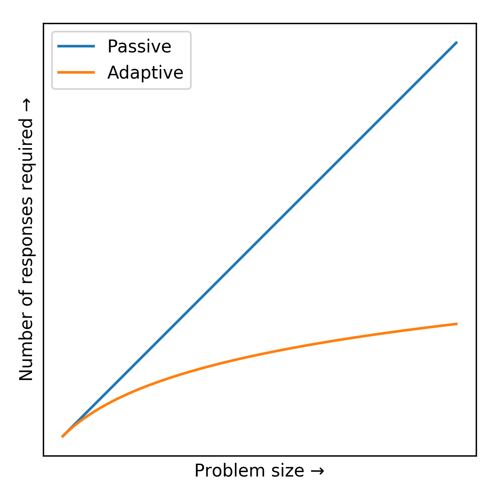
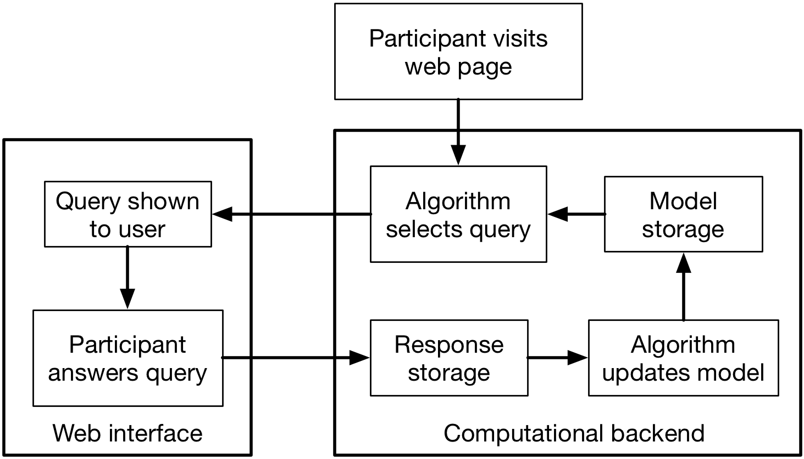
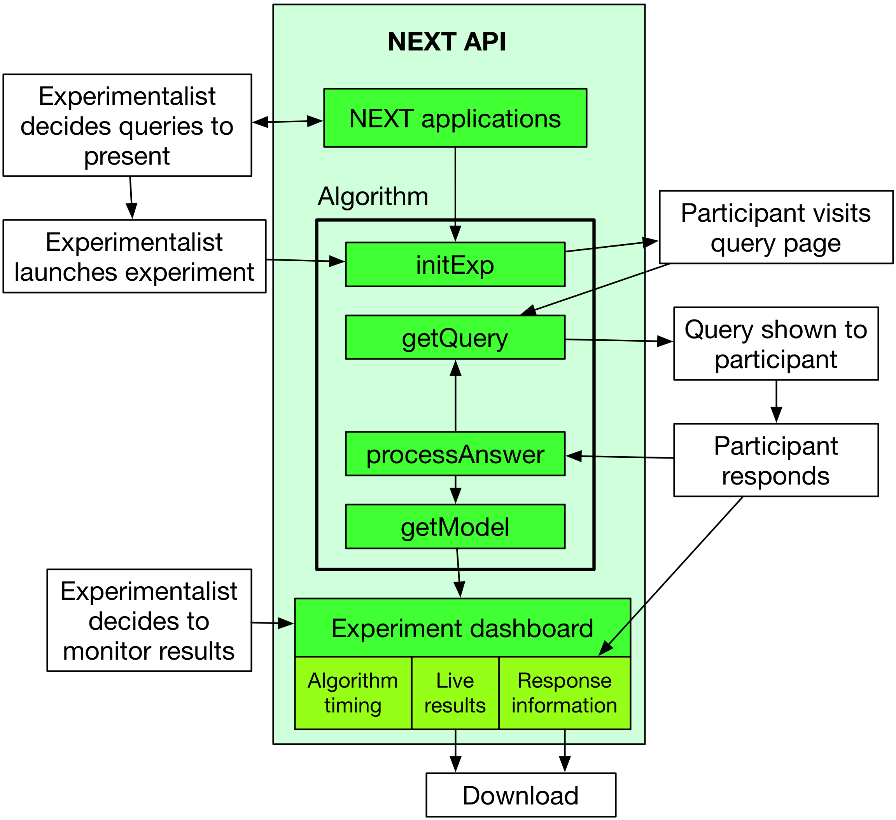
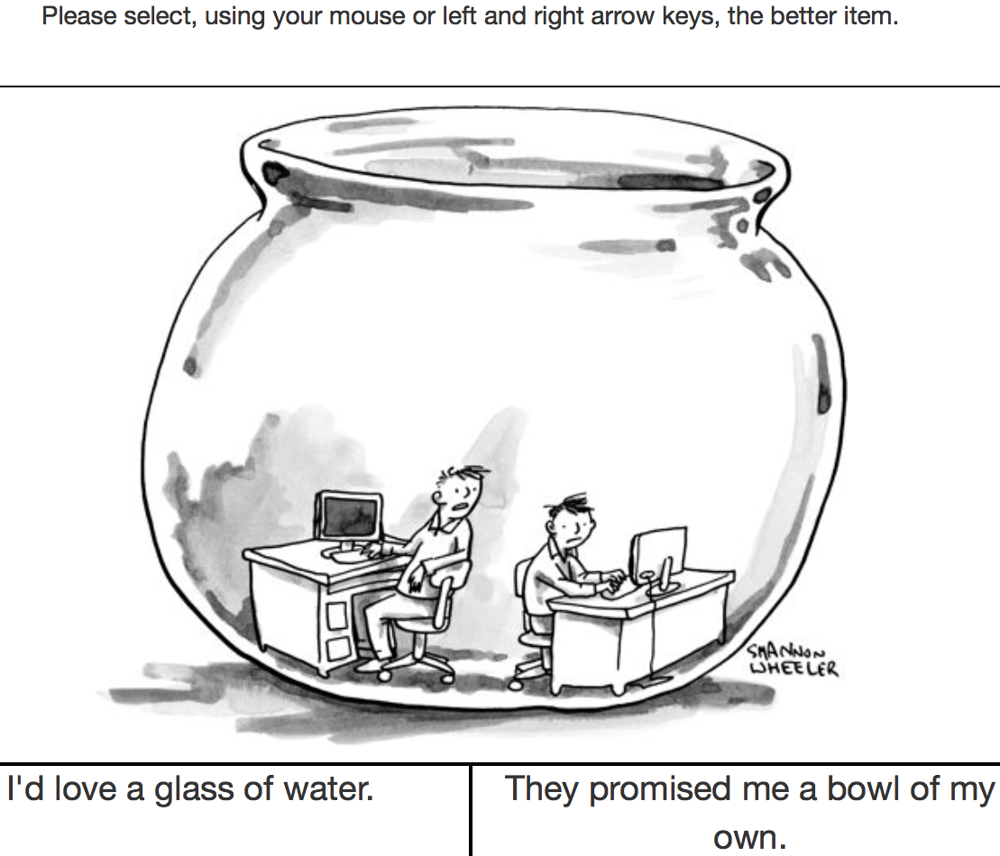
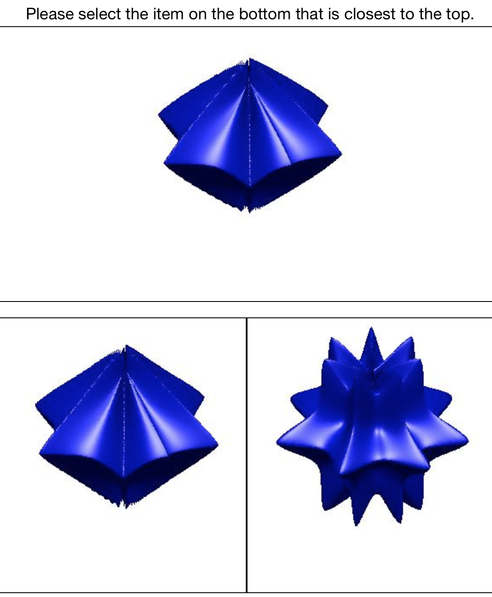
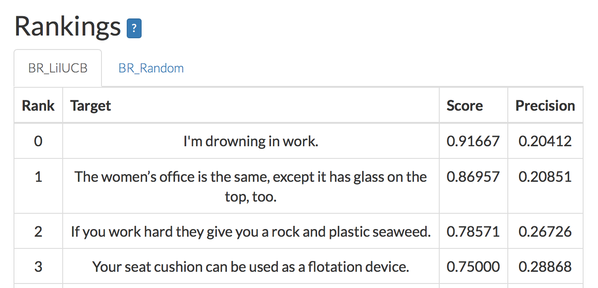
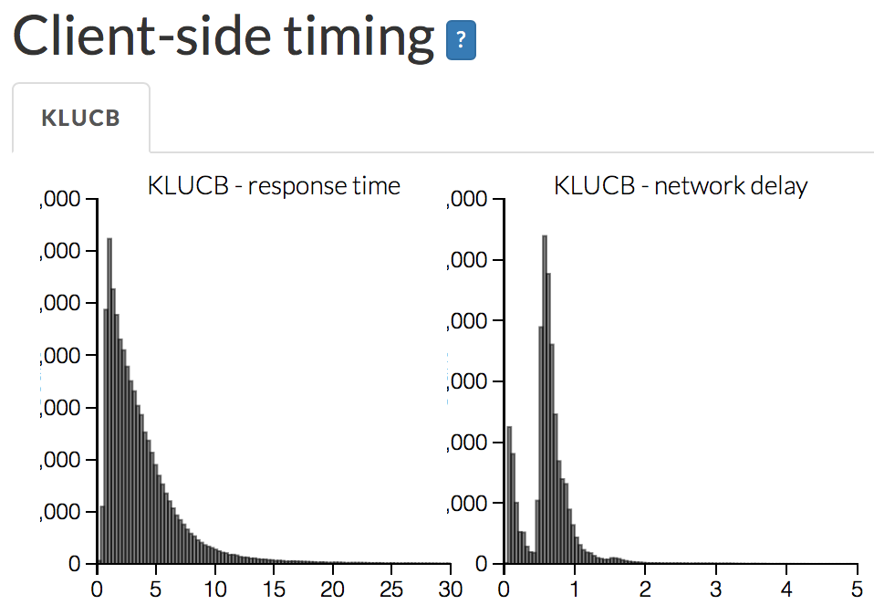

:author: Scott Sievert
:email: stsievert@wisc.edu
:institution: University of Wisconsin–Madison
:equal-contributor:
:corresponding:

:author: Daniel Ross
:email: XXX@TODO.org
:institution: University of Wisconsin–Madison
:equal-contributor:

:author: Lalit Jain
:email: lalitkumarj@gmail.com
:institution: University of Michigan, Ann Arbor
:equal-contributor:

:author: Kevin Jamieson
:email: kevin.g.jamieson@gmail.com
:institution: University of California, Berkeley

:author: Rob Nowak
:email: rdnowak@wisc.edu
:institution: University of Wisconsin–Madison

:author: Robert Mankoff
:email: Bob_Mankoff@newyorker.com
:institution: The New Yorker

:video: http://www.youtube.com/watch?v=dhRUe-gz690
:bibliography: refs

---------------------------------------------------------------------------
NEXT: A system to easily connect crowdsourcing and adaptive data collection
---------------------------------------------------------------------------

.. class:: abstract

    Obtaining useful crowdsourcing results often requires more responses than
    can be easily collected. Reducing the number of responses required can be
    done by `adapting` to previous responses with "adaptive" sampling
    algorithms, but these algorithms present a fundamental challenge when
    paired with crowdsourcing. At UW–Madison, we have built a powerful
    crowdsourcing data collection tool called NEXT (http://nextml.org) that can
    be used with arbitrary adaptive algorithms. Each week, our system is used
    by The New Yorker to run their Cartoon Caption contest
    (http://www.newyorker.com/cartoons/vote). In this paper, we will explain
    what NEXT is and it's applications, architecture and experimentalist use.

.. class:: keywords

   crowdsourcing, adaptive sampling, system

Introduction
-----------------

The ubiquitousness of the Internet has enabled crowdsourcing, which gives fast
access to unprecedented amounts of human judgment data. For example, millions
of crowdsourcing participants have been asked to determine the locations in an
image that contain a certain object (e.g., "select all image locations that
contain buildings") on many different images :cite:`deng2009imagenet`.

.. comment
    Crowdsourcing enables the collection of many simple human judgments. Uses
    include finding the best item in some set :cite:`audibert2010best` or finding
    some measure of similarity between different objects :cite:`heim2015active`.
    Typically, many responses are required as judgments must be simple for humans
    to answer.

The cost of collecting crowdsourcing responses can be significant – especially
in problem domains where expert input is required. Minimizing the number of
queries required has large practical benefits: higher accuracy with fewer
responses, and ultimately a shorter time to the result.  To obtain these
benefits, a fundamental change in the method of data collection is required.

At UW–Madison, we have developed a crowdsourcing data collection tool that
efficiently collects crowdsourced data via "adaptive" sampling algorithms
:cite:`jamieson2015next`. In this paper, we will focus on the use of NEXT
rather than the applications of NEXT and their results. We will mention the
fundamental problem NEXT addresses, its applications, and the interfaces NEXT
presents to the experimentalist and algorithm designer.

Problem statement
-----------------

    As problem size grows, fewer samples (e.g., labeled images) are needed in
    adaptive algorithms to reach a particular quality (e.g., classification
    accuracy). :label:`adaptive-gains`

Supervised machine learning relies on human responses to help produce a model
that can predict the response a human would give
:cite:`kotsiantis2007supervised`. One example of this workflow is with the
popular ImageNet dataset :cite:`deng2009imagenet`: humans have provided
millions of image labels, and there have been dozens of models to predict
labels for unseen images :cite:`szegedy2015going, he2015delving,
simonyan2014very`.

The collection of these data is `passive` and does not `adapt` to previous
responses: previous responses do not effect which queries are presented.
Adaptive data collection is a process which selects the most useful data as
quickly as possible to help achieve some goal (e.g., classification accuracy)
:cite:`holland1992adaptation`.  Adaptive data collection is done by an adaptive
sampling algorithm that chooses the next query to be labeled.

Adaptive data collection naturally requires fewer responses to produce the same
model as passive data collection: it's adapting to previous responses by
choosing which query to present next. This is most useful when many labels are
needed, or as problem size increases. Adaptive algorithms do not require more
responses than passive algorithms :cite:`castro2005faster`. A clearer depiction
of these gains is shown in Figure :ref:`adaptive-gains`.

Applying adaptive data collection to crowdsourcing has the potential to reduce
the number of samples required. An example that requires many human judgments
is sorting :math:`n` items with pairwise comparisons (e.g., :math:`x < y`). In
the ideal case, an adaptive algorithm requires :math:`O(n\log n)` comparisons
on average while passive algorithms requires :math:`O(n^2)` comparisons
:cite:`hoare1962quicksort`.

Adaptively collecting large-scale datasets is challenging and time-consuming,
as mentioned below.  As such, most experiments on adaptive sampling algorithms
are simulations that use these passively collected datasets. These simulations
do not address the practical issues faced in crowdsourcing: adaptive algorithm
response time, human fatigue and differing label quality among humans.

The problem that needs to be solved is to allow arbitrary adaptive algorithms
to collect crowdsourced data and to allow the use of adaptive algorithms by
experimentalists. Arguably, some of the deepest insights and greatest
innovations have come through experimentation. This is only possible if
adaptive data collection is easily accessible by both

1. Machine learning researchers, to test and deploy adaptive algorithms
2. Experimentalists, to use and test adaptive algorithms in real-world applications

Easy use by both groups will enable feedback between experimentalists and
machine learning researchers to improve adaptive data collection through
crowdsourcing.

Challenges
^^^^^^^^^^

Adaptive data collection is not possible without access to previous responses,
a fundamental change to data collection. This introduces human feedback: the
most useful queries are selected using previously recorded human labels by some
adaptive algorithm. If a particular query has shown to be of little use, it
doesn't make much sense to label the same query again.

Adaptive algorithms use previous responses to ask questions, which means that
they require

* receiving, storing and accessing responses
* delivering and selecting queries to be labeled
* updating some internal model which selects queries to be presented.

General crowdsourcing systems (e.g., Mechanical Turk, PsiTurk, Crowd Flower)
were not designed with these requirements in mind. Adaptive data collection
requires a fundamentally different interaction flow as show in Figure
:ref:`data-flow`, which requires the data flow in Figure
:ref:`crowdsourcing-data-flow` when applied to crowdsourcing.

Crowdsourcing adaptive data collection presents a variety of challenges in
mathematics, systems and software development. These challenges stem from the
storage and connection of responses to the adaptive sampling algorithm. Any
such system needs to process, store and receive crowdsourcing responses and
work crowdsourcing scale, meaning the development and maintenance of such a
system is involved. This has served as a barrier to developing such a system
for mathematicians, and lack of knowledge on adaptive methods have hindered
experimentalists.

.. figure:: figures/data-flow.png

    The data flows required to collect crowdsourcing data both passively and
    adaptively. The primary difference is adaptive data collection requires
    using previous responses in some way. :label:`data-flow`

    The system required to use adaptive algorithm with crowdsourcing. The
    results are stored in the model, which may contain additional information.
    :label:`crowdsourcing-data-flow`

One other system that addresses this challenge is the Microsoft Decision
Service :cite:`agarwal2016multiworld`, which can effectively evaluate the
collection of crowdsourced data with different adaptive algorithms. However,
design of this system involved different goals, including working with exactly
one problem formulation and working well at very large scales.

Our system
----------

The system we have developed at the UW–Madison is called NEXT [#]_ [#]_. It
provides adaptive, crowdsourced data collection by selecting which query to
present `next`. NEXT provides

.. [#] Homepage at http://nextml.org
.. [#] Source available at https://github.com/nextml/NEXT

* easy implementation, selection, and evaluation of different adaptive
  algorithms
* a web interface for crowdsourced experiment participation
* an HTTP-based API for experiment access (and for use in other contexts)
* live experiment monitoring dashboards that update as responses are received
* easy use and configuration by experimentalists in a wide variety of fields
  and disciplines

Our design goals necessitate that NEXT be an end-to-end system that is easily
accessible. It is a web interface that can be accessed by both experimentalists
and crowdsourcing participants, and a Python interface for the algorithm
developer. We explain use by experimentalists and algorithm developers in the
following sections. A block diagram representation of our system is in Figure
:ref:`block-diagram`.

In use of NEXT, mathematicians have implemented new algorithms
:cite:`jun2016anytime` and UW–Madison psychologists have independently used our
system [#]_. NEXT has been used by the New Yorker and in the insurance
industry. In at least one case, two adaptive algorithms have been evaluated in
the real world and one required fewer samples as expected [#]_.

.. [#] See http://concepts.psych.wisc.edu/index.php/next-tutorial/
.. [#] With contest 559 of The New Yorker Cartoon Caption contest

In our usage, the system remains responsive to participants even after
receiving millions of responses from thousands of participants, at least with
fast and simple algorithms. This is illustrated by the problem below, though
it also illustrates other features.

    When and how different users interact with NEXT. Arrows represent some form
    of communication between different system components.
    :label:`block-diagram`

Applications of NEXT
--------------------

NEXT `applications` control the presentation of queries for users to consider.

There are three "built-in" applications shipped with NEXT, geared to three
different types of judgments a user can make. These applications are

* Cardinal bandits, which asks participants to rate one object
  :cite:`gabillon2012best` as shown in Figure :ref:`example-query`.
* Dueling bandits, which asks participants to select one of two objects
  :cite:`yue2012k` as shown in Figure :ref:`dueling-interface`.
* Triplets, which displays three objects and asks for `triplet responses` of
  the form "object :math:`i` is more similar to object :math:`j` than object
  :math:`k`." :cite:`jain2016finite`, as shown in Figure
  :ref:`triplet-interface`.

We will now describe each application in more detail.

Cardinal bandits
^^^^^^^^^^^^^^^^

    An example query shown in The New Yorker Caption Contest (cartoon drawn by
    P. C. Vey) :label:`example-query`

Each week, The New Yorker draws a cartoon and asks readers for funny captions.
They receive about 5,000 captions, of which they have to find the funniest.
NEXT runs this contest each week. The interface NEXT provides is visible at
http://www.newyorker.com/cartoons/vote and in Figure :ref:`example-query`.

The interface is presented every time a query is generated. One caption is
presented below the comic with buttons to rate the caption as "unfunny",
"somewhat funny" or "funny". Every time one of these buttons is pressed, the
adaptive algorithm processes the response and generates a new query.

Each week, we collect and record up to a million ratings from over 10,000
users. All told, this dataset [#]_ includes over 20 million ratings on over
363,000 different captions. This dataset has been of practical use in
improving adaptive sampling algorithms :cite:`jun2016anytime`.

.. [#] https://github.com/nextml/caption-contest-data

The New Yorker’s goal is to find the funniest caption from this set of 5,000
captions [#]_. To achieve this, the algorithms of choice only sample captions
that can possibly be the funniest. If a caption has received only "unfunny"
ratings, it is probably not the funniest caption and should not be further
sampled.

.. [#] The top caption for the comic in Figure :ref:`example-query` was "Like you've never taken anything from a hotel room"

.. comment "Like I'm the first person who's tried sleeping their way to the top" and "And yet you embraced the standing desk".

This system has enabled evaluation and improvement in algorithm implementation.
In initial contests, we verified that one adaptive algorithm
:cite:`jamieson2014lil` saw gains over a random algorithm. Later, we
implemented an improved adaptive algorithm (KL-UCB at
:cite:`kaufmann2013information`) and saw adaptive gains as expected.

This was one of the motivations for NEXT: enabling easy evaluation of adaptive
algorithms.

Dueling bandits
^^^^^^^^^^^^^^^

    The dueling bandits interface, where two items are compared and the
    "better" item is selected (cartoon drawn for The New Yorker Caption Contest
    by Shannon Wheeler) :label:`dueling-interface`

We also support asking the crowdsourcing participants to chose the "best" of
two items. We tried this method during the first several caption contests we
launched for The New Yorker. This interface asks participants to select the
funnier of two captions, and is shown in Figure :ref:`dueling-interface`. This
problem formulation has theoretic guarantees on finding the best item in a set
:cite:`audibert2010best`, but can also be applied to ranking different objects
:cite:`chen2013pairwise`.

The early evaluation of dueling bandits in the Caption Contest is again part of
why we developed NEXT. After trying dueling bandits for several contests, we
decided using cardinal bandits is preferable. Cardinal bandits works better at
scale, and requires less work by The New Yorker.

Triplets
^^^^^^^^

    An interface that asks the user to select the most similar bottom object in
    relation to the top object. :label:`triplet-interface`

Finding a similarity measure between different objects is the goal of this
problem formulation. For example, it may be desired to find the similarity
between different facial expressions. Happy and excited faces may be similar
but are probably different from sad faces.

Human attention span cannot handle the naive number of comparisons (which is
proportional to :math:`n^2` with :math:`n` items). Instead, we ask the
crowdsourcing participant to make a pairwise similarity judgement, or a triplet
response as shown in Figure :ref:`triplet-interface`. There are theoretic
guarantees on finding some similarity measure given these responses
:cite:`jain2016finite` and have been used in practice with NEXT to compare
visual representations of different molecules :cite:`rau2016model`.

NEXT Architecture
-----------------

The design goals of NEXT are to provide

* convenient default `applications` (which handle different problem
  formulations by serving different types of queries; e.g., one application
  involves the rating of exactly one object)
* straightforward and modular algorithm implementation
* live experiment monitoring tools via a dashboard, which must update as
  responses are received and provide some sort of offline access
* easy experimentalist use, both in system launch and in experiment launch

These different system components and their data flow is shown in Figure
:ref:`block-diagram`. Complete system documentation is available and addresses
use cases seen by both algorithm developers and experimentalists [#]_.

.. [#] Documentation can be found at https://github.com/nextml/NEXT/wiki

Algorithm implementation
^^^^^^^^^^^^^^^^^^^^^^^^

Required functions
""""""""""""""""""

To implement Figure :ref:`block-diagram`, we must implement four functions for
each algorithm:

1. ``initExp``, which initializes the algorithm when the experiment is launched
2. ``getQuery``, which generates a query to show one participant
3. ``processAnswer``, which processes the human's answer
4. ``getModel``, which gets the results and is shown on the dashboard

These function handle various objects to displayed in each query (e.g., the
New Yorker displays one text object in every query for a rating). By default,
these objects or `target` are abstracted to an integer index (though the other
information is still accessible). This means that a particular target is
referred to only by index (e.g., the user is seeing target :math:`i`, not
``foo.png``).

All these functions are implemented in Python, and we provide easy access other
tasks needed for adaptive algorithms (database access, background jobs).

Arguments and returns
"""""""""""""""""""""

We treat each algorithm as a black box – NEXT only needs each algorithm
function to accept and return specific values. These arguments and return
values for all algorithm functions are specified exactly in a YAML-based
schema. Every algorithm has to create a mapping from the specified inputs to
the specified outputs.

NEXT verifies the inputs and output to/from algorithms and can also include a
description of each parameter. This means that YAML schema is always up to date
and is self-documenting. Changing this schema means different arguments are
passed to every algorithm, and we offer flexibility by allowing arguments of
any type to be passed.

This schema depends on ``Algs.yaml`` (e.g., in
``apps/[application]/algs/Algs.yaml``) and contains four root level keys for
each of ``initExp``, ``getQuery``, ``processAnswer``, and ``getModel``. Each
one of these sections describes the input arguments and returns values by
``args`` and ``rets`` respectively. These sections are filled with type
specifications that describe the name and type of the various keyword
arguments.

For example, a particular ``Algs.yaml`` may include

.. code-block:: yaml

    getQuery:
      args:
        participant_uid:
          type: string
          description: ID of the participant answering the query
      rets:
        description: The index of the target to ask about
        type: num

The keyword argument ``participant_uid`` is specified in the ``args`` key, and
the return value must be a number. The corresponding ``getQuery``
implementation would be

.. code-block:: python

    def getQuery(butler, participant_uid):
        return 0  # for example

More complete documentation on these parameter specifications, which can be
found at the API endpoint ``assistant/doc/[application-name]/pretty``.

Database access
"""""""""""""""

:label:`butler`

We provide a simple database wrapper, as algorithms need to store different
values (e.g., the number of targets, a list of target scores). We provide a
variety of atomic database operations through a thin wrappers to PyMongo [#]_
and Redis [#]_, though we can support arbitrary databases [#]_.  Each "collection"
in this wrapper mirrors a Python dictionary and has several other atomic
database operations. We provide

.. [#] http://api.mongodb.com/python/current
.. [#] https://redis.io/
.. [#] Which requires implementation of the Collection API found in ``next.apps.Butler``

* ``get``, ``set`` and ``{get, set}_many`` which provide atomic operations to
  store values in the database
* ``append`` and ``pop``, which atomically modify list values, and return the
  result
* ``increment``, which atomically increments a stored value by a given amount

All these operations are atomic, and can be accessed through an interface
called ``butler`` which contains multiple collections. The primary collection
used by algorithms (``butler.algorithms``) is specific to each algorithm and
allows for independent evaluation of different algorithms (though other
collections are available). The arguments to an algorithm function are
``butler`` followed by the values in the schema.

Example
"""""""

This example illustrates the interface we have created for the algorithm
developer and provides an example of algorithm implementation. After
implementation, this algorithm can receive crowdsourcing responses through the
web interface.

.. code-block:: python

    import numpy as np

    def choose_target(butler):
        # Adaptive sampling hidden for brevity
        n = butler.algorithms.get(key='n')
        return np.random.choice(n)

    class MyAlg:
        def initExp(self, butler, n):
            butler.algorithms.set(key='n', value=n)
            scores = {'score'+ str(i): 0 for i in range(n)}
            pulls = {'pulls' + str(i): 0 for i in range(n)}
            butler.algorithms.set_many(
                key_value_dict=scores
            )
            butler.algorithms.set_many(
                key_value_dict=pulls
            )

        def getQuery(self, butler):
            return choose_target(butler)

        def processAnswer(self, butler,
                          target_id, reward):
            butler.algorithms.increment(
                key='score' + str(target_id),
                value=reward
            )
            butler.algorithms.increment(
                key='pulls' + str(target_id),
            )

        def getModel(self, butler):
            n = butler.algorithms.get(key='n')
            scores = [butler.algorithms.get(
                        'score' + str(i))
                      for i in range(n)]
            pulls = [butler.algorithms.get(
                        'pulls' + str(i))
                      for i in range(n)]
            mean_scores = [s/p if p != 0 else float('nan')
                           for s, p in zip(scores, pulls)]
            return mean_scores

The ``Algs.yaml`` file for this algorithm would be

.. code-block:: yaml

    initExp:
      args:
        n:
          description: Number of targets
          type: num
    getQuery:
      rets:
        type: num
        description: The target to show
                     the user
    processAnswer:
      args:
        target_id:
          description: The target_id that was shown
                       to the user
          type: num
        reward:
          description: The reward the user gave
                       the target
          values: [1, 2, 3]
          type: num
    getModel:
      rets:
        type: list
        description: The scores for each target ordered
                     by target_id.
        values:
          description: The mean score for a particular target
          type: num

Experiment dashboards
^^^^^^^^^^^^^^^^^^^^^

NEXT can be monitored in real-time via dashboards for each experiment, which
include:

* experiment logs
* basic information (launch date, number of received responses, etc)
* the results, with current responses received (example in Figure
  :ref:`dashboard-results`)
* client- and server-side timing information
* download links to the responses and the live results (which allows processing
  of these data offline).

   The dashboard display of results from different algorithms for the example in Figure :ref:`dueling-interface`. :label:`dashboard-results`

The dashboards include histograms for both human response time and network
delay (time taken for NEXT to respond to request), a measure of system
responsiveness. An example is shown in Figure :ref:`histograms`. These
dashboards also include timing information for algorithm functions, a useful
debugging tool for the algorithm developer.

From the dashboard, we support the download of both experiment results and
participant response information.

    Timing histograms measured client-side in seconds for cartoon caption
    contest 573. Network delay represents the total time NEXT took to respond
    and response time measures human resposne time. :label:`histograms`

Experimentalist use
^^^^^^^^^^^^^^^^^^^

Below, we will refer to different NEXT features which are available through
different API endpoints. After NEXT has launched, these are available via HTTP
on port ``8000`` on the hosting machine. In practice, this means the API
endpoint ``/home`` (for example) is available at ``[next-url]:8000/home`` when
``[next-url]`` is one of ``ec2-...-amazonaws.com`` or ``localhost``.

Launching NEXT
""""""""""""""

The easiest way to launch NEXT is through Amazon EC2 (which can provide
the interface required for crowdsourcing) and their AMI service. After launch,
the main NEXT interface is available at the API endpoint ``/home`` which
provides links to the list of dashboards, an experiment launching interface and
the associated documentation.

Launching can be done by selecting the "Launch instance" button on Amazon EC2
and choosing the AMI "NEXT_AMI", ``ami-36a00c56`` which is available in the
Oregon region. We recommend that production experiments be run on the EC2
instance-type ``c4.8xlarge``, a server large enough to provide the necessary
memory and compute power.  A complete guide can be found in the documentation
at https://github.com/nextml/NEXT/wiki.

Experiment launch
"""""""""""""""""

Experiments are launched by providing two files to NEXT, either via a web
interface or an API endpoint. An experiment description file is required.  The
other (optional) file enumerate the objects under consideration ("target").
These two files can be uploaded through the interface available at
``/assistant/init``.

The experiment description contains the information required to launch and
configure the experiment. The following experiment description was used to
generate the image in Figure :ref:`dueling-interface`:

.. code-block:: yaml

    app_id: CardinalBanditsPureExploration
    args:
      alg_list:
      - {alg_id: KLUCB, alg_label: KLUCB}
      algorithm_management_settings:
        mode: fixed_proportions
        params:
        - {alg_label: KLUCB, proportion: 1.0}
      context: # image URL, trimmed for brevity
      context_type: image
      failure_probability: 0.05
      participant_to_algorithm_management: one_to_many
      rating_scale:
        labels:
        - {label: unfunny, reward: 1}
        - {label: somewhat funny, reward: 2}
        - {label: funny, reward: 3}

These parameters are defined in schemes, and are documented at
the API endpoint ``/assistant/doc/[application-id]/pretty``
in the "initExp" section.

The other file necessary for experiment launch is a ZIP file of targets (e.g.,
the images involved in each query). We support several different formats for
this ZIP file so images, text and arbitrary URLs can be supported. If images
are included in this ZIP file, we upload all images to Amazon S3.

Experimentalist use with crowdsourcing
""""""""""""""""""""""""""""""""""""""

After experiment launch, a link to the experiment dashboard and query page is
presented. We recommend distributing this query page link to crowdsourcing
participants, which typically happens via Mechanical Turk or email.

Experiment persistence
""""""""""""""""""""""

We support saving and restoring experiments on the experiment list at
``/dashboard/experiment_list``.  This allows experiment persistence even when
Amazon EC2 machines are terminated.

Conclusion
----------

At UW–Madison, we have created a system that is connecting useful adaptive
algorithms with crowdsourced data collection. This system has been successfully
used by experimentalists in a wide variety of disciplines from the social
sciences to engineering to efficiently collect crowdsourced data; in effect,
accelerating research by decreasing the time to obtain results.

The development of this system is modular: sampling algorithms are treated as
black boxes, and this system is accessible with other interfaces. NEXT provides
useful experiment monitoring tools that update as responses are received. This
system has shown to be cost effective in bringing decision making tools to new
applications in both the private and public sectors.
