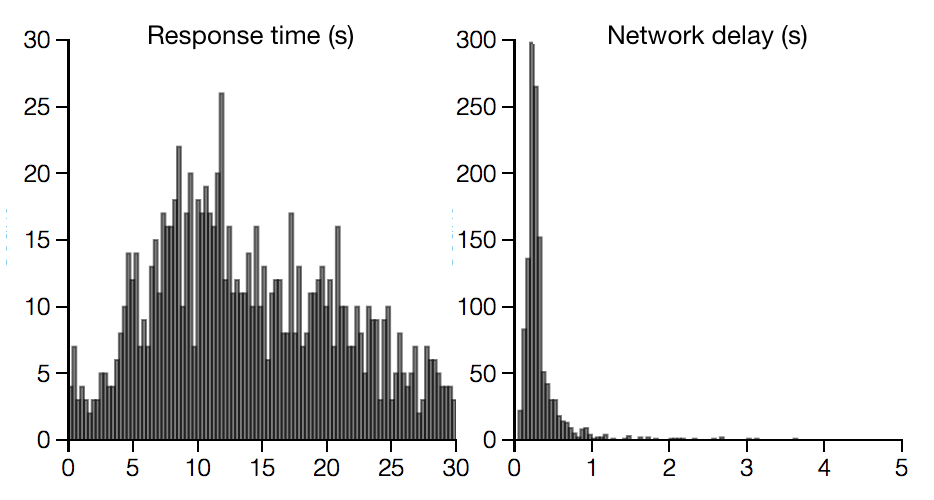

:author: Scott Sievert
:email: stsievert@wisc.edu
:institution: University of Wisconsin–Madison
:equal-contributor:
:corresponding:

:author: Daniel Ross
:email: XXX@TODO.org
:institution: University of Wisconsin–Madison
:equal-contributor:

:author: Lalit Jain
:email: XXX@TODO.org
:institution: University of Michigan, Ann Arbor
:equal-contributor:

:author: Kevin Jamieson
:email: XXX@TODO.org
:institution: University of California, Berkeley

:author: Rob Nowak
:email: XXX@TODO.org
:institution: University of Wisconsin–Madison

:video: http://www.youtube.com/watch?v=dhRUe-gz690
:bibliography: refs

--------------------------------------------------------
NEXT: A system for crowdsourcing active machine learning
--------------------------------------------------------

.. class:: abstract

    At UW–Madison, we have created a new machine learning system called NEXT
    (http://nextml.org) that addresses the problems inherent in collecting
    crowdsoured data with "adaptive" collection algorithms. NEXT is routinely
    used to collect millions of responses from thousands of users in machine
    learning applications like The New Yorker Magazine Cartoon Caption Contest
    (http://www.newyorker.com/cartoons/vote). Adaptive sampling uses previous
    responses to collect data and produces accurate results with minimal
    samples. Collecting crowdsourced data with adaptive sampling methods
    presents practical gains but also has many systems challenges. We will
    explain what NEXT is, how to use it, system goals, features and API.

.. class:: keywords

   crowdsourcing, adaptive sampling, system

Introduction
-----------------

The convergence of mobile electronics and the ubiquitousness of the Internet
has enabled crowdsourcing which allows researchers to tap the collective "wisdom
of the crowd" by asking many questions to a collection of people (i.e., a
crowd). Data collection for crowdsourcing generally includes scenarios where
fairly simple questions are asked. One common example might involve asking users to
determine the locations in an image that contain a certain object (e.g., a car
is present in the upper left) to protect against internet bots.

Crowdsourcing enables the collection of a large amount of data, which
necessitates new methods to manage, store and process these data. For example,
new methods of recognizing objects in unseen images
:cite:`krizhevsky2012imagenet` (e.g., recognizing cars in an unseen image) have
been motivated in part by a popular dataset that contains many images with
object locations and labels generated via crowdsourcing
:cite:`deng2009imagenet`. New optimization methods to aid the generation of
these object recognition methods have been generated and analyzed
:cite:`bottou2010large`, as well as improved :cite:`recht2011hogwild`.

The cost of collecting crowdsourcing responses has become significant, but data
collection is often done without consideration to the cost of `how` the data
are collected.  Human time costs money, and time is required to respond to a
crowdsourcing query. Minimizing the number of queries required would have very
practical benefits: higher quality results with fewer responses, and ultimately
a shorter time to a particular result.

At UW–Madison, we have developed a crowdsourcing data collection and analysis
tool that efficiently collects crowdsourced data :cite:`jamieson2015next`. In
this paper, we will explain the system architecture and use, and how it is
easily accessible and readily available to researchers.

Problem statement
-----------------

.. comment
    Collection of crowdsourced data is often expensive. In a popular crowdsourcing
    service provided by Amazon called Mechanical Turk, humans are paid $1.50 per
    hour (on average) :cite:`paolacci2010running` which is a significant cost when
    many responses are needed and the uncertainty in the responses is considered.
    Even in cases when participants are not paid for responses, there is still a
    significant cost in developing a relationship with participants (e.g., through
    social media campaigns) that encourages response in crowdsourcing tasks .

Crowdsourcing tasks can involve an overwhelming number of possible queries.
Naive collection methods do not pose queries aimed at achieving a particular
goal and tend to ask uninformative questions. In practice, these naive methods
cannot be used. In many cases, they fail to yield useful results given the
number of responses that can be collected.

A technique to pose informative queries is called `adaptive sampling` where
future queries are selected using previous responses and can be applied to
simple crowdsourcing queries.  Adaptive sampling depends on an objective goal
(e.g., classification accuracy) and selects queries to present that will help
achieve a given goal quickly. This benefit has been theoretically shown to
exist :cite:`castro2005faster` and is practically useful by requiring fewer
data.

.. figure:: figures/data-flow.png
    :scale: 50%

    The data flow required to adaptively collect crowdsourcing data. :label:`data-flow`

However, using adaptive sampling in a crowdsourcing setting is difficult.
Crowdsourcing is a general purpose tool that only asks many humans questions;
there’s nothing inherently adaptive in gathering responses through
crowdsourcing. Adaptive sampling requires a feedback loop that uses previous
responses to determine the next query. Pairing crowdsourcing and adaptive
sampling present many challenges in both systems and mathematics stemming from
the fact that adaptive algorithms require tight integration with the human
responses, as shown in Figure :ref:`data-flow`.

Then, the problem that ultimately needs to be solved is to find a means to
productively and efficiently gather crowdsourced data. Being able to ask
informative questions provides means to find an answer quickly and efficiently,
optimizing both cost and time.

General system
--------------

The most general solution would connect a single adaptive algorithm with
crowdsourcing responses in real time.

Such a system would be accessible by any service whether it is involved in
crowdsourcing or not. It could respond to any number of interactions; for
example, this system could respond to user clicks on different advertisements.
This would only require implementing an API that makes Figure :ref:`data-flow`
possible.

This system would lower the cost of collection for crowdsourced data, which is
proportional to the number of responses received. This means that fewer samples
would be required to reach the same objective quality measure, or equivalently,
a higher quality is achieved with the same number of samples. A clearer
description is shown in Figure :ref:`adaptive-gains`.

.. figure:: figures/adaptive-gains.png

    Fewer examples are needed to reach a particular quality, the main gain in
    adaptive algorithms. In this example, to reach a particular quality the
    passive algorithm needs 3 examples for every example the adaptive algorithm
    has. :label:`adaptive-gains`

.. comment TODO describe these systems

Other systems that address this challenge include LUIS :cite:`LUIS` (based on
ICE :cite:`simard2014ice`) and the Microsoft Decision Service
:cite:`agarwal2016multiworld`. These systems connect crowdsourcing and adaptive
sampling but have different design decisions, including working with exactly
one problem formulation and working well at very large scales (i.e., use in
Bing). While these systems achieve their goals they do not provide a
easy-of-use interface and can not handle more than one problem formulation.

Our system
----------

The system we have developed at the UW–Madison is called NEXT [#]_ [#]_ which
provides adaptive crowdsourcing data collection by selecting which query to
present `next`. NEXT also provides

.. [#] Homepage at http://nextml.org
.. [#] Source available at https://github.com/nextml/NEXT

* easy use and configuration by experimentalists, which is applicable to a wide
  variety of fields and disciplines
* live experiment monitoring dashboards that update as responses are received
* easy implementation, selection, and evaluation of different adaptive
  algorithms

These goals have been successfully addressed.  Mathematicians have implemented
new algorithms :cite:`jun2016anytime` and UW–Madison psychologists have
independently used our system. We have seen use with the New Yorker and in
the insurance industry. Different adaptive algorithms have been evaluated with
crowdsourcing in the real world, and we have seen gains as expected.

The system is responsive to crowdsourcing participants even after receiving
millions of responses from thousands of participants, at least with fast and
simple algorithms.  This is illustrated by the problem below, though it also
illustrates other features.

Example application of NEXT
^^^^^^^^^^^^^^^^^^^^^^^^^^^

Each week, The New Yorker draws a cartoon and asks readers for funny captions.
They receive about 5,000 captions, of which they have to find the funniest.
NEXT runs this contest each week. The interface NEXT provides is visible at
http://www.newyorker.com/cartoons/vote and in Figure :ref:`example-query`.

.. figure:: example_query.png

    An example query shown in the Caption Contest :label:`example-query`

The interface is presented every time a query is generated, either on the first
visit to this webpage or after responding to another query. One caption is
presented below the comic with buttons to rate the caption as "unfunny",
"somewhat funny" or "funny". Every time one of these buttons is pressed, the
adaptive algorithm processes the response and generates a new query. Each week,
we collect and record [#]_ up to a million ratings and from over 10,000 users.

.. [#] https://github.com/nextml/caption-contest-data

The New Yorker’s goal is to find the funniest caption from this set of 5,000
captions. To achieve this goal, both algorithms of choice
(:cite:`jamieson2014lil` and KL-UCB at :cite:`kaufmann2013information`) only
sample captions that can possibly be the funniest. If a caption has received
only "unfunny" ratings, it is probably not the funniest caption and should not
be further sampled. For the cartoon shown in Figure :ref:`example-query`, the
top three captions were "Like you've never taken anything from a hotel room",
"Like I'm the first person who's tried sleeping their way to the top" and "And
yet you embraced the standing desk".

NEXT Architecture
-----------------

The design goals of NEXT are

* easy experimentalist use, both in system launch and in experiment launch
* convenient default `applications` (which serve different types of queries;
  e.g., one application involves the rating of exactly one object)
* straightforward and modular algorithm implementation
* live experiment monitoring tools via a dashboard, which must update as
  responses are received and provide some sort of offline access

These different system components and their data flow is shown in Figure
:ref:`block-diagram`. Complete system documentation can be found at
https://github.com/nextml/NEXT/wiki.

.. figure:: figures/block-diagram.png

    When and how different users interact with NEXT. Arrows represent some form
    of communication between different system components.
    :label:`block-diagram`.

Default NEXT applications
^^^^^^^^^^^^^^^^^^^^^^^^^^

NEXT internal `applications` present different queries for users to consider.
There are three internal applications specifically geared to three different
types of judgments a user can make. These are

* Cardinal bandits, which asks participants to rate one object as shown in
  Figure :ref:`example-query`.
* Dueling bandits, which asks participants to select one of two objects as
  shown in Figure :ref:`dueling-interface`.
* Triplets, which displays three objects and asks for `triplet responses` of
  the form "object :math:`i` is more similar to object :math:`j` than object
  :math:`k`.", as shown in Figure :ref:`triplet-interface`.

The included applications have algorithms included by default. These algorithms
have theoretic `sample complexity bounds` which relate the result accuracy to
the number of responses received and are listed below:

- Both cardinal and dueling bandit algorithms have guarantees on finding the
  best item in a set :cite:`kaufmann2015complexity` :cite:`audibert2010best`.
- Triplet algorithms have guarantees on finding some similarity measure between
  objects given triplet responses :cite:`jain2016finite`.

An example of both cardinal and dueling bandits is in the formulation of the
New Yorker Cartoon Caption Contest. In this case, the goal of the experiment is
to find the funniest caption and both cardinal and dueling bandits support
this, by respectively finding how "funny" one caption is and finding the
"funnier" of two captions. Both cases are of interest to the magazine.
Cardinal bandits are used in practice as the New Yorker has many captions and
cardinal bandits is less computationally intense.

An example of the triplets application is finding a similarity measure of
different facial expressions (e.g., a laughing and smiling face are similar in
some sense). In this problem, objects are embedding into a similarity space
where objects are similar if and only if they are close. This embedding can be
found from the triplet responses shown in Figure :ref:`triplet-interface`.

.. figure:: figures/dueling-interface.png
    :scale: 20%

    The dueling bandits interface, where two items are compared and the
    "better" item is selected :label:`dueling-interface`

.. figure:: figures/triplet-interface.png
    :scale: 15%

    An interface that asks the user to select the most similar bottom object in
    relation to the top object. :label:`triplet-interface`

Experiment dashboards
^^^^^^^^^^^^^^^^^^^^^

NEXT experiments can be monitored in real time via experiment dashboards. For
each experiment, we provide a dashboard which includes

* the results, with current responses received (example in Figure
  :ref:`dashboard-results`)
* client- and server-side timing information
* download links to the responses and the live results (which allows processing
  of these data offline).

These dashboards provide a host of other features, including experiment logs and
basic experiment information (launch date, responses received, etc).

.. figure:: figures/alg-results.png

   The dashboard display of results from different algorithms for the example in Figure :ref:`dueling-interface`. :label:`dashboard-results`

The dashboards include histograms for both human response time and network
delay (which is time taken for NEXT computation) and is a measure of system
responsiveness. An example is shown in Figure
:ref:`histograms`. These dashboards also include timing information on
different algorithm functions, which is a useful debugging tool for the
algorithm developer.

    The client side timing. Network delay represents the total time NEXT took
    to respond. :label:`histograms`

Experimentalist use
^^^^^^^^^^^^^^^^^^^

Below, we will refer to different NEXT features which are available through
different API endpoints. After NEXT is launched, these are available by
appending to ``[next-url]:8000`` where ``[next-url]`` is the IP address where
NEXT is available, typically one of either ``localhost`` or the Amazon EC2
public DNS (e.g., ``ec2-...-amazonaws.com``).

Launching NEXT
""""""""""""""

Perhaps the easiest way to launch NEXT is through Amazon EC2 (which can provide
the interface required for crowdsourcing) and their AMI service. After launch,
the main NEXT interface is available at the API endpoint ``/home`` which
provides links to the list of dashboards, an experiment launching interface and
the associated documentation.

Launching can be done by selecting the "Launch instance" button on Amazon EC2
and choosing the AMI "NEXT_AMI", ``ami-36a00c56`` which is available in the
Oregon region. We recommend that production experiments be run on the EC2
instance-type ``c4.8xlarge`` which is a large computer that provides the
necessary memory and compute power. A complete guide can be found in the
documentation at https://github.com/nextml/NEXT/wiki.

Experiment launch
"""""""""""""""""

Experiments are launched by providing two files to NEXT, either via a web
interface or an API endpoint. An experiment description file is required.
The other optional file contains the objects being compared, or targets. These
two files can be uploaded through the interface available at ``/assistant/init``.

The experiment description contains the information required to launch and
configure the experiment. An example experiment description that can be used to
launch the experiment behind the query page shown in Figure
:ref:`example-query`:

.. code-block:: yaml

    app_id: CardinalBanditsPureExploration
    args:
      alg_list:
      - {alg_id: KLUCB, alg_label: KLUCB}
      algorithm_management_settings:
        mode: fixed_proportions
        params:
        - {alg_label: KLUCB, proportion: 1.0}
      context: # image URL, trimmed for brevity
      context_type: image
      failure_probability: 0.05
      participant_to_algorithm_management: one_to_many
      rating_scale:
        labels:
        - {label: unfunny, reward: 1}
        - {label: somewhat funny, reward: 2}
        - {label: funny, reward: 3}

The documentation for these parameters in this YAML file are documented at ``/assistant/doc/[application-id]/pretty``
under the heading "initExp".

The other file necessary for experiment launch is a ZIP file of targets (e.g.,
the images involved in each query). We support several different formats for
this ZIP file so images, text and arbitrary URLs can be supported. If images
are included in this ZIP file, we upload all images to Amazon S3.

Experiment persistence
""""""""""""""""""""""

We support saving and restoring experiments on the experiment list at ``/dashboard/experiment_list``.
This allows experiment persistence even when
Amazon EC2 machines are terminated.

Algorithm implementation
^^^^^^^^^^^^^^^^^^^^^^^^

Required functions
""""""""""""""""""

A sampling algorithm needs four functions for the features we want to provide
as shown in Figure :ref:`block-diagram`. These functions are

1. ``initExp``, which initializes the algorithm when the experiment is launched
2. ``getQuery``, which generates a query to show one participant
3. ``processAnswer``, which processes the human's answer
4. ``getModel``, which gets the results and is shown on the dashboard

Arguments and returns
"""""""""""""""""""""

These algorithms handle various objects to displayed in each query (e.g., the
New Yorker displays one text object in every query for a rating). By default,
these objects are abstracted to an integer identifier (though the other
information is still accessible). That means these algorithms mirror the
implementation in academic papers where a particular objects is referred to as
object :math:`i` to an integer.

The arguments and return values for all algorithm functions are specified
exactly. Every algorithm has to create a mapping from the specified inputs to
the specified outputs. This allows treating an algorithm like a black-box.

The YAML file ``Algs.yaml`` (e.g., in ``apps/[application]/algs/Algs.yaml``)
contains four root level keys for each of ``initExp``, ``getQuery``, ``processAnswer``
and ``getModel``. Each one of these sections describes the
input arguments and returns values by ``args`` and ``rets`` respectively. These
sections are filled with type specifications that describe the name and type of
the various keyword arguments.
For example, an integer parameter given with the keyword argument ``foo``
is characterized in ``Algs.yaml`` by

.. code-block:: yaml

    foo:
      type: num
      description: bar

in the appropriate section. Types can be defined recursively through a ``values`` key:

.. code-block:: yaml

    foo:
      type: dict
      description: A dictionary
      values:
        bar:
          type: num
          description: A number

More complete documentation on these parameter specifications can be found  in
the documentation.

Database access
"""""""""""""""

:label:`butler`

We provide a simple database wrapper, as algorithms need to store different
values (e.g., the number of targets, a list of target scores). We do provide a
variety of atomic database operations in any "collection" including

- ``set`` and ``get``, which can set and get all objects (scalars,
  dictionaries, NumPy arrays, etc).
- ``get_many`` and ``set_many`` which is atomic even with many different values
- ``append`` and ``pop`` which mirror the Python equivalents, but ``append``
  returns the modified list.
- ``increment``, which increments a variable by some value and returns

This wrapper or ``butler`` is a set of collections, and the primary collection
algorithms use is ``butler.algorithms`` which allows algorithms to be evaluated
independently. The first argument to an algorithm after ``self`` is always ``butler``.

Example
"""""""

An algorithm that performs randomly sampling is given below:

.. code-block:: python

    import numpy as np

    class MyAlg:
        def initExp(self, butler, n):
            butler.algorithm.set(key='n', value=n)
            scores = {'score' + str(i): 0
                      for i in range(n)]
            pulls = {'pulls' + str(i): 0
                      for i in range(n)]
            butler.algorithms.set_many(
                key_value_dict=scores
            )
            butler.algorithms.set_many(
                key_value_dict=pulls
            )

        def getQuery(self, butler):
            n = butler.algorithms.get(key='n')
            return np.random.choice(n)

        def processAnswer(self, butler,
                          target_id, reward):
            butler.algorithms.increment(
                key='score' + str(target_id),
                value=reward
            )
            butler.algorithms.increment(
                key='pulls' + str(target_id),
                value=1
            )

        def getModel(self, butler):
            n = butler.algorithms.get(key='n')
            scores = [butler.alrogithms.get(
                        'score' + str(i))
                      for i in range(n)]
            pulls = [butler.alrogithms.get(
                        'pulls' + str(i))
                      for i in range(n)]
            mean_scores = [s/p if p != 0 else float('nan')
                           for s, p in zip(scores, pulls)]
            return mean_scores

The ``Algs.yaml`` file for this algorithm would be

.. code-block:: yaml

    initExp:
      args:
        n:
          description: Number of targets
          type: num
    getQuery:
      rets:
        type: num
        description: The target to show
                     the user
    processAnswer:
      args:
        target_id:
          description: The target_id that was shown
                       to the user
          type: num
        reward:
          description: The reward the user gave
                       the target
          values: [1, 2, 3]
          type: num
    getModel:
      rets:
        type: list
        description: The scores for each target ordered
                     by target_id.
        values:
          description: The score for a particular target
          type: num

Conclusion
----------

At UW–Madison, we have created a system that is connecting useful adaptive
algorithms with crowdsourced data collection. This system can be and has been
widely used by experimentalists in a wide variety of disciplines from the
social sciences to engineering to more efficiently collect data using
crowdsourcing; in effect, accelerating research by decreasing the time to
obtain results. The development of this system is modular: sampling algorithms
are treated as black boxes, and this system is accessible with other
interfaces. NEXT provides useful experiment monitoring tools that update as
responses are received. This system has been show to be cost effective in
brining new decision making tools to new applications in both private and
public sectors.
