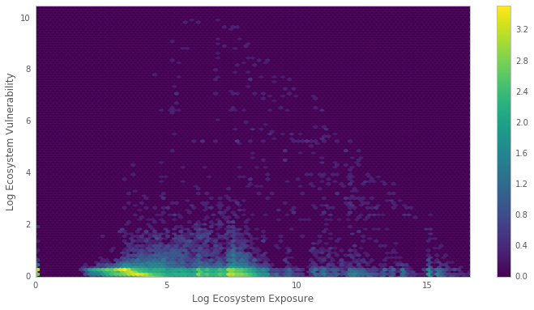

:author: Sebastian Benthall
:email: sb@ischool.berkeley.edu
:institution: Ion Channel, ionchannel.io
:institution: UC Berkeley School of Information
:corresponding:

:author: Travis Pinney
:email: travis.pinney@ionchannel.io
:institution: Ion Channel, ionchannel.io
:institution: travis.pinney@ionchannel.io

:author: JC Herz
:email:  jc.herz@ionchannel.io
:institution:  jc.herz@ionchannel.io
:institution: Ion Channel, ionchannel.io

:author: Kit Plummer
:email: kit.plummer@ionchannel.io
:institution: kit.plummer@ionchannel.io
:institution: Ion Channel, ionchannel.io

---------------------------------------------------------------
An Ecological Approach to Software Supply Chain Risk Management
---------------------------------------------------------------

.. class:: abstract

   We approach the problem of software assurance in a novel way inspired
   by an analytic framework used in natural hazard risk mitigation.
   Existing approaches to software assurance focus on
   evaluating individual software projects in isolation. 
   We demonstrate a technique that evaluates an entire ecosystem of software
   projects, taking into account the dependencey structure between packages.
   Our model analytically separates vulnerability and exposure as elements of
   software risk, then makes minimal assumptions about the propogation of these values
   through a software supply chain. 
   Combined with data collected from package management systems, our model
   indicates "hot spots" in the ecosystem of higher expected risk. 
   We demonstrate this model using data collected from the Python Package Index (PyPI).
   Our results suggest that Zope and Plone related projects carry the highest risk of
   all PyPI packages because they are widely used even though their core libraries
   are no longer maintained.

.. class:: keywords

   risk management, software dependencies, complex networks, software vulnerabilities, software security

Introduction
------------

Critical systems that depend on complex software are open
to many kinds of risk.
One typical approach to software security that mitigates this
risk is static analysis.
We are developing novel methods to manage software risk through
supply chain intelligence, with a focus on open source software
ecosystems.

The Heartbleed bug in OpenSSL is an example of community failure
and of how vulnerabilities
in open source software can be a major security risk. [Wheeler2014]_
The recent failure of React, Babel, and many other npm packages
due to the removal of one small dependency, ``left-pad``,
shows how dependencies can be a risk factor
for production software. [Haney2016]_ 
As dependencies become more numerous and interlinked, the 
complexity of the system increases, as does the scope of risk management.
Open source software projects make their source code and developer
activity data openly available for analysis.
This data can be used to mitigate software risk in ways that have not been explored.

With a small number of analytic assumptions about the propagation of vulnerability
and exposure through the software dependency network, we have developed a model
of ecosystem risk that predicts "hot spots" in need of more investment.
In this paper, we demonstrate this model using real software dependency data extracted
from PyPI using Ion Channel [IonChannel]_.

Prior work
----------
[Verdon2004]_ outline the diversity of methods used for risk analysis in software design.
Their emphasis is on architecture-level analysis and its iterative role in software development.
Security is achieved through managing information flows through architecturally distinct tiers of trust.
They argue for a team-based approach with diverse knowledge and experience because "risk analysis
is not a science".
Contrary to this, our work develops a scientific theory of risk analysis, building on work from
computer science and other fields.

There is a long history of security achieved through static analysis of source code.
[Wagner2000]_ points out that the dependency of modern Internet systems on legacy code and the
sheer complexity of source code involved makes manual source code level auditing very difficult.
While some complex projects are audited by large and dedicated communities, not all software
systems are so gifted in human resources.
Therefore, static analysis tools based on firm mathematical foundations are significant
for providing computer security at scale. 

[Wheeler2015]_ develops a risk index for determining which open source software projects need 
security investments. This work is part of the Linux Foundation (LF) Core Infrastructure 
Initiative (CII) and published by the Institute for Defense Analysis. 
This metric is based on their expertise in software development analytics and an 
extensive literature review of scholarly and commercial work on the subject. 
They then apply this metric to Debian packages and have successfully identified 
projects needing investment. This work is available on-line as the CII Census project [CensusProject]_.

While software security studies general focus on the possibility of technical failure of
software systems, open source software exposes an addition risk of community failure.
[Schweik2012]_ is a comprehensive study of the success and failure of open source
projects based on large-scale analysis of SourceForge data, as well as survey and
interview data. They define a successful project as one that performs a useful function
and has had at least three releases. They identify several key predictive factors to
project success, including data that indicates usefulness (such as number of downloads),
number of hours contributed to the project, and communicativeness of the project leader.

These precedents focus on individual software projects and their susceptiblity
to technical and community failure.
[Nagappan2005]_ and [Nagappan2007]_ look at dependency relationships between packages
and specifically relative code churn (changes in lines of code) between dependent packages
as a cause of system defects in Windows Server 2003.

We build on these approaches by considering security as a function of
the total software supply chain.
This supply chain resembles a complex ecosystem more than a simple 'chain' or stack.
We draw inspiration from a risk management strategy approached used in another kind
of complex system, namely disaster risk reduction and
climate change adaptation research developed by Cardona [Cardona2012]_ and widely used
by the World Bank's Global Facility for Disaster Risk Reduction, and others. [Yamin2013]_

This framework evaluates the expected cost of low-probability events by distinguishing three factors
of risk: hazards, exposure, and vulnerabilities.
*Hazards* are potentially damaging factors from the environment. 
*Exposure* refers to the inventory of elements in places where hazards occur.
*Vulnerabilities* are defined as the propensity of exposed elements to suffer adverse effects when impacted
by a hazard. 
Expected risk is then straightforwardly calculated using the formula:

.. math::

   risk = hazard * vulnerability * exposure

We adapting this framework to cybersecurity in the software ecosystem.
There are significant differences between modeling risk from natural hazards and
modeling cybersecurity risk.
Most notably, cybersecurity threats can be deliberately adversarial, detecting and
exploiting specific weaknesses rather than presenting a general hazard.
In this work we focus on the interplay between exposure and vulnerability in
the software ecosystem and abstract away the specificity of a threat model.
We see an analytic treatment of that interplay as a valuable step in tractable
security analysis of the software supply chain.

Modeling Ecological Risk in Software
------------------------------------

Software dependency and project risk
~~~~~~~~~~~~~~~~~~~~~~~~~~~~~~~~~~~~

Some previous studies of software risk [Wheeler2015]_ have suffered from 
the ambiguity of how 'risk' is used in a software development context.
Security research is often contextualizes problems within a specific
threat model.
But for some applications, such as identifying software projects
in need of additional investment in order to mitigate risk from
generalized and potentially unknown threats, this kind of threat
modeling is inappropriate.
A general concern with supply chain security motivates a different
approach.

If we break down the sources of risk and how these affect the need for security 
investments analytically, we can distinguish between several different factors:

* Vulnerability. A software project's vulnerability is its intrinsic susceptibility to attack. Common Vulnerability and Exposure (CVE) records are good examples of specific software vulnerabilities. But software's vulnerability can also be predicted from a general property, such as the language it's written in. (Some languages, such as C++, are harder to write in securely and therefore generally more vulnerable [Wheeler2015]_)
* Exposure. A software project's exposure is its extrinsic availability to attack. A direct network connection is a source of exposure.

Vulnerability and exposure are distinct elements of a software project's risk. 
Analyzing them separately and then combining them in a principled way gives us a better 
understanding of a project's risk.

Dependencies complicate the way we think about vulnerability and exposure. 
A software project doesn't just include the code in its own repository; 
it also includes the code of all of its dependencies, often tied to a specific version. 
Furthermore, a project does not need to be installed directly to be exposed--it can be installed 
as a dependency of another project. 
Based on these observations, we can articulate two heuristics for use of 
dependency topology in assessing project risk:

* If A depends on B, then a vulnerability in B implies a corresponding vulnerability in A.
* If A depends on B, then an exposure to A implies an exposure to B.

For example, if a web application (A) uses a generic web application framework (B), and that
web application is installed and recieving web traffic, then there is an instance
of the web framework installed and recieving web traffic.
If there is a vulnerability in the web application framework (such as a susceptibility
to SQL injection attacks), then the web application will inherit that vulnerability.
There are exceptions to these rules.
Developers of the web application (A) might recognize the vulnerability to SQL injection
and fix the problem without pushing the change upstream (to B).
Nevertheless, this is a principled analytic way of relating vulnerability, exposure, 
and software dependency that can be implemented as a heuristic and tested as a hypothesis.

The risk analysis framework described above is very general.
Due to this generality, it suffers from the ambiguity of its terms.
Depending on the application of this framework, "vulnerability" refer to literal 
software vulnerabilities such as would be reported in a CVE.
When we analyze the software ecosystem as a supply chain, we are
often concerned about higher level properties that serve as general proxies
for whole classes of error or failure.

Robustness and resilience
~~~~~~~~~~~~~~~~~~~~~~~~~~

We find the distinction between system *robustness* and system *resilience* helpful.
We define the *robustness* of a system as its invulnerability to threats and hazards,
as a function of its current state. 
We define the *resilience* of a system as its capacity to recover quickly from injury
or failure.
A mature, well-tested system will be robust.
A system with an active community ready to respond to the discovered of a new exploit
will be resilient.

A system can be robust, or resilient, or both, or neither.
Robustness and resilience can be in tension with each other.
For example, the more churn a software project is, measured as a function of the activity
of the community and frequency of new commits, the more likely that it will
be resilient, responding to new threat information.
But it is also likely to be less robust, as new code might introduce new software flaws.
[Nagappan2005]_ and [Nagappan2007]_ find that relative code churn between dependent packages
is a significant predictor of system defect.

We refer to a system that is not robust is *fragile*,
and a system that is not resilient is *brittle*.
Fragility and brittleness are two distinct and general ways in which a component
of a software ecosystem might be vulnerable.

Implementation of risk computation
~~~~~~~~~~~~~~~~~~~~~~~~~~~~~~~~~~

The risk analysis framework presented in the above section *Software dependency and project risk*
is designed to be widely applicable, factoring risk into abstract *exposure* and *vulnerability*
factors and then making minimal assumptions about how these factors propagate
through the dependency graph.

In practice, the application of this framework will depend on the selection
of package metadata used to measure exposure and vulnerability. Below is a
Python implementation of efficient risk computation using a directed graph
representation of package dependencies and NetworkX. [Hagberg2008]_
In this code, we use a precomputed 'fragility' metric as the vulnerability
variable, and the number of downloads of each package as the exposure variable.
(See the section *Computing fragility and exposure* for an explanation of how
fragility was calculated in our empirical results.)

.. code-block:: python

    import networkx as nx

    G = nx.read_gexf('pkg.gexf')

    # select proxy empirical variables for
    # vulnerability and exposure

    vulnerability_metric = 'fragility'
    exposure_metric = 'downloads'

    # efficiently compute ecosystem vulnerability
    # and assign as attribute

    ecosystem_vulnerability = {}

    for i in nx.topological_sort(G,reverse=True):
    
        ecosystem_vulnerability[i] = 
                G.node[i][vulnerability_metric] 
                + sum([ecosystem_vulnerability[j]
                       for j in G.neighbors(i)]) 

    nx.set_node_attributes(G,
                           'ecosystem_vulnerability',
                           ecosystem_vulnerability)

    # efficiently compute ecosystem exposure 
    # and assign as attribute
    
    ecosystem_exposure = {}

    for i in nx.topological_sort(G):
    
         ecosystem_exposure[i] = 
                G.node[i][exposure_metric]
                + sum([ecosystem_exposure[j]
                       for j in G.predecessors(i)]) 

    nx.set_node_attributes(G,
                           'ecosystem_exposure',
                           ecosystem_exposure)

    # efficiently compute ecosystem risk
    # and assign as attribute
    
    ecosystem_risk= {}

    for i in nx.topological_sort(G):
        ecosystem_risk[i] = 
                G.node[i]['ecosystem_vulnerability'] 
                * G.node[i]['ecosystem_exposure']

A significant problem with this implementation of risk calculation
is that if node A is accessible to node B through multiple distinct
paths, then the vulnerability (or exposure) of B will be counted
towards A's ecosystem vulnerability (or exposure) once for each path.
A superior version of this algorithm would ensure that each node was
only counted once in ecosystem measurements.
The version of the algorithm presented above uses a heuristic measure
for performance reasons.

Removing cycles
~~~~~~~~~~~~~~~

The above algorithm has one very important limitation: it
assumes that there are no cycles in the dependency graph.
This property is necessary for the nodes to have a well-defined
topological order.
However, Python package dependencies do indeed include many cycles.
We can adapt any directed cyclic graph into a directed
acyclic graph simply by removing one edge from every cycle.

.. code-block:: python

    def remove_cycles(G):
        cycles = nx.simple_cycles(G)

        for c in cycles:
            try:
                if len(c) == 1:
                    G.remove_edge(c[0],c[0])
                else:
                    G.remove_edge(c[0],c[1])
            except:
                pass

One way to improve this algorithm would be to remove as few edges as
possible in order to eliminate all cycles.
Another way to improve this algorithm would be to adapt the heuristic
assumptions that motivate this framework to make reasonable allowances
for cycle dependencies.
We leave the elaboration of this algorithm for future work.

Data collection and publication
-------------------------------

Data for this analysis comes from two sources. For package and release metadata,
we used data requested from PyPI, the Python Package Index.
This data provides for data about the publication date and number of
unique downloads for each software release.

We also downloaded each Python release and inspected it for the presence of a ``setup.py``
file. We then extracted package dependency information from ``setup.py`` through
its ``install_requires`` field.

Python dependencies are determined through executing Python install scripts.
Therefore, our method of discovering package dependencies through static
analysis of the source code does not capture all cases.

For each package, we consider dependencies to be the recursive union of all requirements
for all releases.
Specifically we collapse all releases of a package into a single node in the dependency graph.
While this loses some of the available information, it is sufficient
for this prelimenary analysis of the PyPI ecosystem. 

Empirical and Modeling Results
--------------------------------

   Visualization of PyPI dependency network. Annotated dependency graph (see *Implementation of risk computation*) was exported as .gexf, loaded into Gephi [Bastian2009]_, styled using Force Atlas layout, and colored by ecosystem risk property. This visualization does not include singleton nodes with zero degree, which are the vast majority of nodes. Node size is proportional to out degree. Nodes are colored by the log (base 10) of package ecosystem risk. Red nodes are higher risk. The large red cluster consists of projects related to the Zope web application server, including the Plone content management system.

Our data collection process created a network with :math:`66,536` nodes and :math:`72,939` edges.
Over half of the nodes, :math:`33,573`, have no edge. This isolates them from the
dependency network.
Of the remaining :math:`32,963`, :math:`31,473` belong to a single giant connected component.
This preponderance of one component is a consistent feature of complex networks more generally.

Statistical properties of the software dependency network
~~~~~~~~~~~~~~~~~~~~~~~~~~~~~~~~~~~~~~~~~~~~~~~~~~~~~~~~~

The PyPI package dependency network resembles classical complex networks, with
some notable departures.

A early claim in complex network theory by [Newman2002]_, [Newman2003]_ is that
random complex networks will exhibit negative degree assortativity, and that social
networks will exhibit positive degree assortativity due to homophily or other
effects of group membership on network growth.
[Noldus2015]_ notes that in directed graphs, there are four variations on the
degree assortativity metric as for each pair of adjacent nodes one can consider
each node's in-degree and out-degree.
The degree assortativity metrics for the PyPI dependency graph are given
in :ref:`datable`.

The PyPI package dependency network notably  has *in-in* degree assortativity of
:math:`0.19`, and *out-in* degree assortativity of :math:`-0.16`.
The *in-out* and *out-out* degree assortativities are both close to zero.
We have constructed the graph with the semantics that an edge from A to B
implies that A depends on B.

.. table:: Degree assortativity metrics for the PyPI dependency graph. :label:`datable`

   +------------+----------------+
   | Metric     | Value          |
   +============+================+
   | *in-in*    |   :math:`0.19` |
   +------------+----------------+
   | *in-out*   |   :math:`0.05` |
   +------------+----------------+
   | *out-in*   |  :math:`-0.16` |
   +------------+----------------+
   | *out-out*  |  :math:`-0.04` |
   +------------+----------------+

What explains this strange network structure? One reason is that
there is much greater variation in out-degree than in in-degree.
:label:`odtable` shows the top ten most depended on packages.
:label:`idtable` shows the top ten packages with the most dependencies.
Three packages, ``requests``, ``six``, and ``django``  have
out-degree over 1000. 

.. table:: Top ten most dependencies. :label:`odtable`

   +-----------------------+----------------+
   | Package               | Out-Degree     |
   +=======================+================+
   | ``requests``          |   :math:`2125` |
   +-----------------------+----------------+
   | ``six``               |   :math:`1381` |
   +-----------------------+----------------+
   | ``django``            |   :math:`1174` |
   +-----------------------+----------------+
   | ``pyyaml``            |    :math:`775` |
   +-----------------------+----------------+
   | ``zope.interface``    |    :math:`663` |
   +-----------------------+----------------+
   | ``lxml``              |    :math:`619` |
   +-----------------------+----------------+
   | ``flask``             |    :math:`607` |
   +-----------------------+----------------+
   | ``python-dateutil``   |    :math:`599` |
   +-----------------------+----------------+
   | ``zope.component``    |    :math:`550` |
   +-----------------------+----------------+
   | ``jinja2``            |    :math:`507` |
   +-----------------------+----------------+

.. table:: Top ten packages by number of dependencies. :label:`idtable`

   +------------------------+---------------+
   | Package                | Out-Degree    |
   +========================+===============+
   | ``plone``              |    :math:`92` |
   +------------------------+---------------+
   | ``mypypi``             |    :math:`53` |
   +------------------------+---------------+
   | ``invenio``            |    :math:`52` |
   +------------------------+---------------+
   | ``ztfy.sendit``        |    :math:`48` |
   +------------------------+---------------+
   | ``ztfy.blog``          |    :math:`47` |
   +------------------------+---------------+
   | ``smartybot``          |    :math:`47` |
   +------------------------+---------------+
   | ``icemac.addressbook`` |    :math:`41` |
   +------------------------+---------------+
   | ``sentry``             |    :math:`40` |
   +------------------------+---------------+
   | ``products.silva``     |    :math:`38` |
   +------------------------+---------------+
   | ``ztfy.scheduler``     |    :math:`37` |
   +------------------------+---------------+

   Hex plot of log vulnerability and log exposure of each package, with bin density scored on log scale. All logs are base 10. Exposure is more widely distributed than vulnerability. Vulnerability scores for the vast majority of packages are low. There is a fringe of packages that are either highly vulnerable, highly exposed, or both. There is a log-linear tradeoff between high vulnerability and high exposure. This is most likely due to the fact that ecosystem vulnerability and ecosystem exposure both depend on an package's position in the dependency network. 

Computing fragility and exposure
~~~~~~~~~~~~~~~~~~~~~~~~~~~~~~~~

Our risk analysis framework defines exposure and 
vulnerability as abstract components of risk that can be defined
depending on the hazards and threats under consideration.
In the example of this study, we will define these variables with
an interest in the general prediction of robustness in widely used
software.
This sort of analysis would be useful in determining
which software packages are in need of further investment in order
to reduce risk globally.

In the following analysis, we will define *exposure* to be the
number of times a package has been downloaded.
This metadata is provided by PyPI for each package directly.
We assume for the sake of this analysis that more widely downloaded
software is more widely used and exposed to threats.

We will define *vulnerability* specifically in terms of software
*fragility*, and make the assumption that software that has had
more releases is less fragile.
While it is true that sometimes a new software release can introduce
new flaws into software, we assume that on average more releases
mean a more active community, more robust development processes,
and greater maturity in the project lifecycle.
Specifically for the purpose of this study we will define

.. math::

   fragility(p) = \frac{1}{number_of_releases(p)}

In future work, we will revise and validate these metrics.

Hot spot analysis
~~~~~~~~~~~~~~~~~

.. raw:: latex
         
         \begin{table*}

         \begin{longtable*}{lrrrrrrrr}
         \toprule
         {} &  Log Eco. Risk &  Log Eco. Vulnerability &  Log Eco. Exposure &  Fragility &  Num. Releases &  Downloads &  In Degree &  Out Degree \\
         \midrule
         zope.app.publisher &           17.54 &                     6.95 &                10.59 &   0.04 &                  26 &     232460 &         24 &          54 \\
         zope.app.form      &           17.54 &                     6.89 &                10.64 &   0.04 &                  26 &     265370 &         19 &          45 \\
         five.formlib       &           17.44 &                     6.47 &                10.97 &   0.20 &                   5 &     127280 &         13 &          10 \\
         plone              &           17.44 &                     2.37 &                15.07 &   0.01 &                  79 &     387614 &         96 &         152 \\
         zope.interface     &           17.42 &                    10.48 &                 6.94 &   0.03 &                  31 &    8685819 &          0 &         841 \\
         zope2              &           17.41 &                     6.40 &                11.01 &   0.03 &                  32 &     241354 &         28 &         163 \\
         zope.traversing    &           17.32 &                     8.40 &                 8.92 &   0.04 &                  28 &     367494 &          9 &         181 \\
         zope.schema        &           17.29 &                     9.61 &                 7.68 &   0.03 &                  31 &     624429 &          4 &         399 \\
         zope.site          &           17.28 &                     7.60 &                 9.68 &   0.07 &                  14 &     255063 &          9 &          72 \\
         zope.container     &           17.27 &                     7.73 &                 9.54 &   0.05 &                  20 &     294873 &         20 &         119 \\
         \bottomrule
         \end{longtable*}

     \caption{Highest risk Python packages. All logs base 10.
           \DUrole{label}{quanitities-table}}

   \end{table*}

Our analysis suggests that the riskiest packages in the Python ecosystem are those that are part of the Zope web application server and the Plone content management system built on it. The Zope community has declared that Zope is now a legacy system and does not recommend that developers use these projects. Therefore, our analytic findings are consistent with community and domain knowledge regarding the resilience of these communities. Despite these warnings, the Plone community is still active and many web sites may still depend on this legacy technology. This study motivates further work on the resilience of Zope to new security threats.

[Walsh2011]_ noted that Plone has an order of magnitude lower number of vulnerabilites reported in Mitre's Common Vulnerabilities and Exposures database compared to other popular CMS's like Joomla, Drupal, and Wordpress. This has lead [Wiki2016]_ to assert that Plone's security record is cause of its widespread adoption by government and non-government organizations. [Byrne2013]_ has challenged this conclusion, noting that the high number of recorded vulnerabilites may just as likely be due to the much greater popularity of the other CMS's. That Drupal, Wordpress, and Joomla are all written in PHP is another confounding factor.
Drupal, Joomla, and Wordpress are beyond the scope of our study, which is concerned only with the PyPI ecosystem. In our risk modeling framework, Plone score poorly compared to other Python web frameworks such as Django and Flask. 

We have also identified ``six``, a Python 2 and Python 3 compatibility library, as an ecosystem risk hot spot. The second most depended on project in PyPI, ``six`` inherits its exposure from all of its downstream descendants. For this reason, it is important to ensure that ``six`` does not have any security-related flaws.

Discussion and future work
--------------------------

This paper proposes a novel framework of predicting risk in software infrastructure
based on static analysis of package dependencies and minimal assumptions about
the distribution of exposure and vulnerability in software.
We have demonstrated the implications of this framework using the PyPI package
ecosystem and specific proxy variables for the components of risk.
A major shortcoming of our analysis is the lack of validation against
a gold standard data of *ground truth* regarding software risk.

In future work, we will test this framework using other data sets, including
data from project issue trackers (such as GitHub) and Common Vulnerabilities
and Exposure (CVE) data.
We anticipate that linking this data with package
dependencies will require a non-trivial amount of work on entity resolution.
It is an open question to what extent this framework is useful for assessing
software robustness (absence of software errors that can be exploited, for
example) and software resilience (capacity of software development communities
to respond to known exploits).

While we have in this work considered the entire software ecosystem compressed
into a single static graph, in fact the software ecosystem is always changing.
Package dependencies and metadata variables that proxy for exposure and
vulnerabilty change over time.
In future work we will develop a dynamic version of this risk-management algorithm.

The research presented here deals exclusively with data about technical organization.
However, as we expand into research into how software communities and their interactions
are predictive of software risk, we must be mindful of ethical considerations.
Though all the data we intend to use is public and more importantly known
to be public in the context of software development, study of human subjects is
nevertheless sensitive.
Our research agenda depends critically on maintaining the trust of the developer
communities we study.
For this reason we are dedicated to ecosystems and software projects,
which aggregate individual efforts, as the fundamental unit of analysis.

..
  Our approach synthesizes these precedents in computer security and software 
  community analysis.
  We see risk analysis as a science that employs static analysis techniques, 
  but also looks more broadly at developer communities and the rate and flow 
  of their activities and communications.
  We are looking for mathematically firm principles
  of software supply chain risk management.
..

..
  You also need to talk about package version management, which I see as a hole. In Python, it might not be possible to have conflicting versions, but I've seen it in Java and other languages. 
..

..
  Future work will execut setup scripts to get full dependencies
..

..
  We will use more of the available information
  and take into account more of the complexity of Python package management in future work.
..

Acknowledgements
----------------

We gratefully acknowledge David Lippa, Kyle Niemeyer, and J. Edward Pickle for their helpful comments.

References
----------

.. [Bastian2009] Bastian, Mathieu, Sebastien Heymann, and Mathieu Jacomy. "Gephi: an open source software for exploring and manipulating networks." ICWSM 8 (2009): 361-362.

.. [Byrne2013] Byrne, Tony. "Is Plone Really More Secure Than Drupal and Joomla?" Web log post. Real Story Group. N.p., 11 Feb. 2013. Web. 23 June 2016.

.. [Clauset2007]  A. Clauset, C.R. Shalizi, and M.E.J. Newman. Power-law distributions 
                  in empirical data. arXiv:0706.1062, June 2007.

.. [Mitzenmacher2003] Mitzenmacher, M. 2003.
                      "A Brief History of Generative Models for Power Law
                      and Lognormal Distributions."
                      Internet Mathematics Vol. 1, No. 2: 226-251

.. [CensusProject] Census Project. (n.d.). Retrieved July 12, 2016, from https://www.coreinfrastructure.org/programs/census-project

.. [Cardona2012] Cardona, Omar-Daria, et al. "Determinants of risk: exposure and vulnerability." (2012).

.. [Girardot2013] O. Girardot. STATE OF THE PYTHON/PYPI DEPENDENCY GRAPH. 2013

.. [Hagberg2008] Aric A. Hagberg, Daniel A. Schult and Pieter J. Swart, “Exploring network structure, dynamics, and function using NetworkX”, in Proceedings of the 7th Python in Science Conference (SciPy2008), Gäel Varoquaux, Travis Vaught, and Jarrod Millman (Eds), (Pasadena, CA USA), pp. 11–15, Aug 2008

.. [Haney2016] David Haney. 2016. "NPM & left-pad: Have We Forgotten How To Program?" ``http://www.haneycodes.net/npm-left-pad-have-we-forgotten-how-to-program/``

.. [IonChannel] (n.d.). Retrieved July 12, 2016, from http://ionchannel.io/

.. [LaBelle2004] N. LaBelle, E. Wallingford. 2004. Inter-package dependency networks in open-source software.

.. [Nagappan2005] Nagappan, N., & Ball, T. (2005, May). Use of relative code churn measures to predict system defect density. In Proceedings. 27th International Conference on Software Engineering, 2005. ICSE 2005. (pp. 284-292). IEEE.

.. [Nagappan2007] Nagappan, N., & Ball, T. (2007). Explaining failures using software dependences and churn metrics. In Proceedings of the 1st International Symposium on Empirical Software Engineering and Measurement.

.. [Newman2002] Newman, M. E. J. 2002. "Assortative mixing in networks."

.. [Newman2003] Newman, M. E. J. 2003. "Mixing patterns in networks."
                Phys. Rev. E 67, 026126

.. [Noldus2015] Noldus, R and Mieghem, P. 2015. "Assortativity in Complex Networks"
                Journal of Complex Networks. doi: 10.1093/comnet/cnv005

.. [Schweik2012] C. Schweik and R. English. *Internet Success: A Study of Open-Source Software Commons*,
      The MIT Press. 2012

.. [Verdon2004] D. Verdon and G. McGraw, "Risk analysis in software design," in IEEE Security & Privacy, vol. 2, no. 4, pp. 79-84, July-Aug. 2004.

.. [Walsh2011] Walsh, M. (2011, March 11). Gov 2.0 guide to Plone. Retrieved June 23, 2016, from ``http://www.govfresh.com/2011/03/gov-2-0-guide-to-plone/``

.. [Wagner2000] David A. Wagner. 2000. Static Analysis and Computer Security: New Techniques for Software Assurance. Ph.D. Dissertation. University of California, Berkeley. AAI3002306.

.. [Wiki2016] Plone (software). (2016, May 5). In Wikipedia, The Free Encyclopedia. Retrieved 18:20, June 23, 2016, from ``https://en.wikipedia.org/w/index.php?title=Plone_(software)&oldid=718838043``

.. [Wheeler2014] Wheeler, David A. How to Prevent the next Heartbleed. 2014-10-20.
      ``http://www.dwheeler.com/essays/heartbleed.html``

.. [Wheeler2015] D. Wheeler and S. Khakimov. *Open Source Security Census: Open Source Software Projects Needing Security Investments*, Institute for Defense Analysis. 2015

.. [Yamin2013] Yamin, Luis Eduardo; Ghesquiere, Francis; Cardona, Omar Dario; Ordaz, Mario Gustavo. 2013. Modelacion probabilista para la gestion del riesgo de desastre. Washington DC ; World Bank. http://documents.worldbank.org/curated/en/2013/07/18100020/colombia-probabilistic-modeling-disaster-risk-management-modelacion-probabilista-para-la-gestion-del-riesgo-de-desastre

