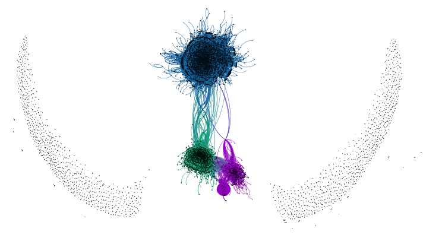
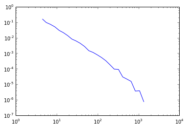

:author: Sebastian Benthall
:email: sb@ischool.berkeley.edu
:institution: UC Berkeley School of Information

================================================================
 Testing Generative Models of Online Collaboration with BigBang
================================================================

.. class:: abstract

   We introduce BigBang, a new Python toolkit for analyzing 
   online collaborative communities such as those that 
   build open source software.
   Mailing lists serve as critical communications infrastructure for
   many communities, including several of the open source software 
   development communities that build scientific Python packages.
   BigBang provides tools for analyzing mailing lists.
   In this paper, we present results from testing a generative
   model of online collaboration in mailing lists.
   We derive a social network from archival mailing list history
   and test the Barabási-Alpert model of network formation
   against this data.
   We find the model does not fit the data, but that mailing list
   social networks share statistical regularities not explained in
   existing complex systems literature.
   This suggests room for a new generative model of network formation
   in the open collaborative setting.

.. class:: keywords

   mailing lists, network analysis, assortativity, power law distributions,
   collaboration

Introduction
============

Open source software communites such as those that produce many scientific 
Python packages are a critical part of contemporary scientific organization.
A distinguishing feature of these communities is their heavy use of
Internet-based infrastructure, such as mailing lists, version control systems, and
issue trackers, for managing communications and organizing work on distributed teams.
This data is often deliberately publicly accessible as open source best practices
include the "conspicuous use of archives" [Fogel]_.
The availability of these digital records are also an excellent resource for
the researcher interested in sociotechnical organization and collaboration
within science.

This paper introduces BigBang, a Python project whose purpose is the collection,
preprocessing, and analysis of data from open collaborative communities.
Built for the use case of studying the Scientific Python communities in particular,
it generalizes to other communities and supports fruitful comparisons between them.

To demonstrate the potential of this approach, this paper will explore the
structure of mailing list discussions in the context of open collaborative projects.
We extract social network data from the archives of public mailing lists and test
the plausibility that these graphs were generated by Barabási-Alpert network model.
We find that of the mailing lists we've analyzed, none exhibit two features of
Barabási-Alpert networks: power law degree distribution and zero degree assortativity.
This result suggests the possibility of future work of scientifically developing a
generative model of collaboration.

BigBang Overview
================

Launched in 2014, BigBang is a software project 
that aims to provide researchers a complete toolkit for the scientific analysis
of open online collaborative communities.
Though applicable to many domains, research into online collaboration has
special relevance to practicioners of computationally intensive open science.
Through it scientific programming communities such as Scientific Python can
achieve a quantitative understanding of their own work and innovation process.

Thorough study of these kinds of communities requires the collection and
rationalization of many heterogenous and high-dimensional data sources,
including but not limited to mailing lists, version control systems such as Git,
and issue trackers such as GitHub and Bugzilla.

This data is complex in that it has many dimensions that afford very different
kinds of analysis:

- **Time.** All data from online collaboration infrastructure is timestamped,
  affording use of time series methods.
- **Text.** Email message bodies, issue contents, and commit messages in version
  control are all text data suitable for study with natural language processing 
  techniques.
- **Social network.** Participants in the project are individuals linked by relational
  ties of communication. Hence these data afford study through social
  network analysis techniques.
- **Software static analysis.** Source code in version control is complex data containing
  the definition of many interelated variables, functions, classes, and modules. Static
  analysis and compilation techniques from computer science can be used to study these
  entities within the software itself.

The richness and granularity of the data from open source software communities and other
open on-line collaborative projects promise the answers to many research questions about
software engineering, innovation, social organization, and more.
The catch is that with data that is so multifaceted, preprocessing the data is an
engineering-intensive endeavor.

The versatility and scope of open source Scientific Python packages makes building
a generic research infrastructure for analyzing these communities a possibility within 
reach. Architecturally, BigBang is a Python package that includes Scientific Python
libraries for time series analysis, natural language processing, network analysis,
and software analysis as dependencies.

BigBang includes methods for collecting research data from sources on the web about
the activity of open collaborative communities. At the time of this writing,
BigBang supports data collection from Mailman, the mailing list service, as well
as other `.mbox` formatted email archives. It also supports data collection
from Git repositories. Future versions will have methods for collecting data
from issue trackers.

The BigBang repository contains an `examples` directory of Jupyter notebooks
demonstrating its functionality and exploring lines of research inquiry.
Researchers can contribute to the project by submitting Jupyter notebooks to the
repository for review through the GitHub Pull Request system.
Source code that performs preprocessing that is usable by multiple computational
experiments is in a separate source code directory that can be imported as a
Python module.

In the context of Scientific Python, BigBang is deliberately recursive.
It is a Python project that depends on many other scientific Python projects.
It is designed to study, among other things, dependencies and interactions between 
the Scientific Python technologies and communities.
Our goal is for BigBang to provide a new means for these communities to engage
in scientific self-management.

Testing Generative Models of Online Collaboration
=================================================

As a demonstration of BigBang's capabilities, in this paper
we will test a well known generative model of network formation
against social network data derived from public mailing list discussions.
A generative model is a formal model that describes a process
through which data is generated.
A principle benefit of a formal generative model is that the statistical
properties of data it generates can be compared with the statistical
properties of empirical data.
Such comparisons are one way to get empirical purchase on the mechanism
behind even purely observational data.
Discovering a concise generative model that fits data from on-line collaboration
would give us insight into the mechanism of collaboration itself.

In this paper, we will test one well known generative model of network data,
the Barabási-Alpert model.
This model describes a process by which new nodes, as they join a network,
form edges with other nodes with probability proportional to their degree.
This process is called *preferential attachment*.
In social networks, it is suggestive of a network dominated by one or two luminaries.
In its basic form, this model generates networks with two notable statistical properties:

- The degree distributions of Barabási-Alpert networks is *scale-free*, meaning that
  the fraction of nodes of degree :math:`k` falls asymptotically according to a power law distribution.
  :math:`P(k) \sim k^{-\gamma}` for some positive :math:`\gamma`.
- The correlation between the degrees of adjacent nodes is zero.

We discover in our empirical data that neither of these properties hold for the social
networks fo public mailing list discussions.
This suggests that preferential attachment is not a mechanism that dominates
the social interactions on the collaborative projects represented in our data.
On the contrary, the statistical properties of public mailing list discussions
suggest that participation is more widely distributed than in many other social
networks, and that interaction with new participations is a priority.

Preferential attachment model
=============================

An early result in the study of complex networks was the observation that many networks
existing in nature exhibit a scale-free degree distribution. [BarabásiAlbert]_
This means that the tail of the distribution of the number of edges of each node in the network (the
node's *degree*) converges to a power law function: 

.. math::

   y = ax^k

(Scale-free referes to the scale invariance of the power law distribution.)

The prevalence of scale-free networks in nature has raised the question of what
generative processes produce networks with this property.
What was at one point the most well-known random graph model, the Erdős-Rénri model,
produces networks with binomial degree distribution.
Barabási and Alpert [BarabásiAlbert]_ have proposed a model of network generation
that produces graphs with scale-free degree distribution.
The Barabási-Alpert model is now widely known in the literature.

The attractiveness of the Barabási-Alpert model is due in part to its being a
generative model that describes a process for creating data of an
observed distribution, as opposed to being simply a description of the distribution
itself.
This gives the Barabási-Alpert model explanatory power.

In particular, the Barabási-Alpert model attributes the scale-free distribution of
node degree to a *preferential attachment* mechanism, parameterized by :math:`m_0` and
:math:`m`.
The network is formed by beginning with a small number :math:`m_0` of nodes and adding
new nodes, connecting each new node to :math:`m < m_0` nodes, where the probability
of connecting to node :math:`i` is proportional to the prior degree of that node,
:math:`k_i`:  adding new nodes to the network one by one. 

.. math::

   P(k_i) = \frac{k_i}{\sum_{j} k_j}

Here, :math:`\sum_{j} k_j` is the sum of all degrees of all nodes in the graph.
The parameter :math:`m` is fixed at each iteration for model simplicity. [AlbertBarabási]_

The Barabási-Alpert model is favored for its simplicity, its intuitively clear mechanism 
of preferential attachment, and for its analytic tractability.
Intuitively, a social process driven by preferential attachment is one in which
"the rich get richer".
Consider the social graph from an on-line social network such as Facebook or
Twitter.
New entrants to the network will 'friend' or 'follow' existing nodes.
If they preferentially attach, the will be much more likely to connect to
celebrities who already dominate the network than to new entrants such
as themselves.
The most highly connected participants will likely owe their position in
the network to their seniority.
Studies have supported the role of a preferential attachment mechanism in social network
formation [Zhou2011]_ [Tinatti2012]_.
It is an empirical question whether the preferential attachment mechanism explains
the data from collaborative communities such as those that develop
Scientific Python packages.

Power law or log-normal?
========================

A challenge to the Barabási-Alpert model comes from [Clauset2007]_, who argue that
many conventionally accepted techniques for fitting power law distributions to empirical data 
are biased and unsound.
Specifically, they critique the common method of plotting the histogram of the data on a log-log
axis and testing for linearity by perfoming a least-squares linear regression, and variations of this.
They propose an alternative Bayesian technique for testing power law distributions.
By computing the likelihood of the data being generated by a power law distribution and
comparing it with the likelihood of it being generated by other heavy-tail distributions,
such as the log-normal distribution, they provide a statistically sound basis for model
comparison.

The Clauset et al. method also carefully considers only the tail of the data, picking a
cutoff value :math:`x_{min}` below which data are ignored.
They argue that picking this value is of critical importance: to pick too high an
:math:`x_{min}` is to fit a power law to non-power law data.
to pick too low a value is to throw out legitimate data, which can lead to bias.
They propose selecting the :math:`x_{min}` that minimizes the Kolmogorov-Smirnov distance
between the best fitting power law distribution and the empirical data above the mininum.

We refer the reader to [Clauset2007]_ for the in-depth defense of this method as an
alternative to those based on testing for linearity on a log-log scale.
Besides its statistical soundess, an advantage of this method is that it has been implemented
in Python in the `powerlaw` package by [Alstott2014]_, which is what is used for the computational
results below.

From a Bayesian perspective, the ratio of likelihoods represents how much one should
update one's beliefs based on observation of data.
In this case, the computed likelihood ratio of the data being generated by a power law
over a log-normal distribution would be interpreted as how much one should be
persuaded that the data came from a power law distribution based on one's prior
belief in the originary distribution of data in general.

This leaves open the question of the prior probability of a distribution being
generated by a power law producing process, or a log-normal producing process.
[Mitzenmacher2003]_ surveys a century of scientific disagreement over the
prevalance of each distribution across many disciplines and argues that
subtle variations in a generative process can turn the results one way or another.

Despite these complications, different processes are expected to produce different
distributions.
These differences will be most apparent asymptotically as more data is generated.
Processes through which "the rich get richer" systematically, such as the
preferential attachment process described above, will produce power law distributed
data.

Log-normal distributions are produced by what [Mitzenmacher2003]_ calls *multiplicative
processes*.
A multiplicative process occurs when independent random variables are multiplied together.
Contrast this with the preferential attachment process, where the possibility of attachement
is distinctly not independent of prior conditions.
When a series of independent and identically distributed variables is multiplied together,
the product's distribution converges on a log-normal distribution by the Central
Limit Theorem.

In summary, a process of network growth according to which degree is the result of a
independent multiplicative process will assymptotically produce a log-normal distribution.
A process of network growth driven by non-independent preferential attachment will
approach a power law degree distribution.
A test of the log likelihood of the best fit of either distribution on an empirical
data set provides empirical support for the data's being produced by one process or
the other.

Degree assortativity
====================

Another graph theory concept that we will use in our analysis of collaborative mailing
lists is *degree assortativity*.
Degree assortativity is the correlation between degrees of adjacent nodes in the network.
In the context of social networks, it is a measure of a special case of *homophily*, the
tendency of people to be connected to others who are similar to them.
Degree assortativity means that the most connected members of the network are connected
with each other.

Following the mathematical definition of [Newman2003]_, the degree assorativity coefficient is

.. math::

   r = \frac{\sum_{jk}jk(e_{jk} - q_{j}q_{k}))}{\sigma_{q}^{2}}

In the above formula, :math:`e_{jk}` is the fraction of edges that connect vertices
of degree :math:`j + 1` and :math:`k + 1`, i.e. the degrees of the connected vertices
not including the connecting edge itself. [Newman2003] calls this *excess degree*.
The value :math:`q_k` is the distribution of excess degree.

.. math::

   \sum_{j} e_{jk} = q_{k}

The value :math:`\sigma_{q}` is the standard deviation of :math:`q_k`. [TODO: I'm using directed
assortativity here, yes? And what about weighted degrees?]

[Newman2002]_ studied degree assortativity in complex networks and introduced an intriguing 
hypothesis. Observed social networks, such as those of academic coauthorship networks and business
director associations, exhibit positive degree assortativity.
Technical and biological networks, such as connections between autonomous systems on the Internet,
protein interactions, and neural networks, exhibit negative degree assortativity, or *disassortivity*.
Our own speculative interpretation is that the organization of technical and biological networks evolves
for a functional purpose facilitated better by having highly connect hubs distributed widely, whereas 
many social networks are organized more according to the self-interest or homophilic tendencies
of the participants.

[Noldus2015]_ reviews the extensive scholarship on assortativity in networks since Newman's work in 2002.
They note that Barabási-Alpert are only slightly disassortive, converging on zero assortativity as the number
of nodes increases.
[Noldus2015]_ also surveys work such as [Newman2003]_ and [Foster2009]_ that define and analyze directed
degree assortativity.
In directed variations, degree assortativity is computed as above except using either the in-degree
or out-degree of the source and targets nodes.
In our empirical work below, we compute directed assortativity for every variation (in/in, out/in, in/out,
and out/out) and find little difference between the computed values for our data,
though there are graph structures for which these values can vary greatly.

According to the survey by [Noldus2015]_, assortivity in weighted networks is not well explored 
either theoretically or empirically.
The weighted assortativity of a a network is the correlation between the weighted degree of its adjacent nodes,
where weighted degree is the sum of the weights of all edges of a node.
Directed weighted assortativity is computed from weighted in- and out-degrees.
[Networkx]_ provides functions for computing these values on networks.
We will compare weighted and unweighted directed assortivity in empirical networks
below.

Methods
=======

We collected archival data of 13 mailing lists from open collaborative communities.
From these data we derived an *interaction graph* of who replied to whom.
We then computed the weighted and unweighted degree assortativity of these networks.
We also used the Alstott package to test the degree distribution of these networks using
the Clauset method.

Email data collection
=====================

BigBang supports collection of email data.
It can do this either by scraping the archival pages of a Mailman 2 instance,
or by importing an `.mbox` formatted file.
Internally, BigBang parses this data into a Pandas DataFrame [McKinney]_
and stores parsed and normalized email data in `.csv` format.

For the purpose of this study, we scraped data from public Mailman 2 instances
associated with the following projects:

- SciPy: http://mail.scipy.org/mailman/listinfo/
- WikiMedia: http://lists.wikimedia.org/mailman/listinfo
- OpenStreetMap: http://lists.openstreetmap.org/listinfo

We selected mailing lists from the SciPy Mailman instance primarily for their
relevance to the SciPy community.
We also selected some mailing lists from other projects for comparison.

A limiting factor for our analysis is that every new data set introduces new
edges cases BigBang's processing logic must take into account.
For example, misformatted timestamps cause errors in many archival email
data sets.
In future work we hope to sample data more systematically in order to
establish general principles of collaboration.
This preliminery study is merely descriptive.

Deriving interaction graphs
===========================

Email is archived in the same text format that email is sent in, as specified in
RFC2822 [RFC2822]_.
Every email is comprised of a message body and a number of metadata headers
that are essential for email processing and presentation.

For our study, we have been interested in extracting the implied social
network from an email archive of a public mailing list. To construct this
network, we have used the `From`, `Message-ID`, and `In-Reply-To` headers
of the email.

The `From` field of an email contains data identifying the mailbox of the message author.
This often includes both a full name and an email address of the sender.
As this is set by the email client and a single person may use many different mailbozes,
a single person is often represented differently in the `From` field
across many emails. See *Entity Resolution* for our strategies for
resolving entities from divergent email headers.

The `Message-ID` header provides a globally unique identification string
for every email.
The uniqueness of the identifier must be guaranteed by the host that generates
the message.
It is recommended in [RFC2822]_ that email hosts accomplish this by including their domain
name and combination of the exact date and time, as well as some other unique
identifier (such as a process ID number) from the host system.
The `In-Reply-To` header is set when an email is sent as a reply to
another email.
The reply's `In-Reply-To` header will match the `Message-ID` of the
original email.

Formally, we construct the directed *interaction graph* :math:`G` from a set of emails
indexed by :math:`i \in I`. 
Each email consists of a tuple :math:`(f_i,r_i)`, where :math:`f_i` identifies the mailbox
of the sender (corresponding to the `From` header) and :math:`r_i \in I \cup \{\epsilon\}`
(corresponding to the `In-Reply-To` header) may be a null value :math:`\epsilon` or be 
the index of another email.

* For every email :math:`i`, if there is not one already add a node with label 
  :math:`f_i` to :math:`G` corresponding and set its `sent` attribute :math:`1`.
  If such a node already exists, increment its `sent` attribute by 1. 
* Iterating again through every email :math:`i`, if :math:`r_i \neq \epsilon`, 
  and if there is not one already, then create a directed edge between nodes :math:`f_i`
  and :math:`f_{r_i}` with a `weight` attribute set to 1. If the edge already exists,
  increment the `weight` attribute by 1.

In sum, the final graph :math:`G` has a node for every email author annotated by the
number of emails from that sender in the data set.
There is an edge from :math:`f_i` to :math:`f_j` if author :math:`f_i` ever wrote
a reply to an email authored by :math:`f_j`.
The weight of an edge corresponds to the number of these replies in the data set.

The motivation for constructing interaction graphs in this way is to build a
concise representation of the social network implied by email data.
We posit that building a social network representation based on actual messages
sent between people provides a more granular and faithful description of
social relationships than one based on higher-level descriptions of social
relationships or ties from web services such as Facebook 'friends' and
Twitter 'followers'

BigBang implements this interaction graph creation using Python's native
email processing libraries, `pandas`, and `networkx`. [Networkx]_
The following code builds the interaction graph representations.

.. code-block:: python

   import networkx as nx

   def messages_to_interaction_graph(messages):
       """
       *messages* is a Pandas DataFrame, each row
       containing the body and header metadata for
       an email from the archive.
       Messages should be in chronological order.

       Returns a NetworkX DiGraph (directed graph),
       the nodes of which are mailing list participants.

       Nodes have a 'sent' attribute indicating number
       of emails they have sent within the archive.

       Edges from i to j indicate that i has sent at least
       one reply to j. The weight of the edge is equal
       to the number of replies sent from i to j.
       """

       IG = nx.DiGraph()

       from_dict = {}

       sender_counts = {}
       reply_counts = {}

       for m in df.iterrows():
           m_from = m[1]['From']

           from_dict[m[0]] = m_from
           sender_counts[m_from] = \\
               sender_counts.get(m_from, 0) + 1
           IG.add_node(m_from)

           if m[1]['In-Reply-To'] is not None:
               reply_to_mid = m[1]['In-Reply-To']

               if reply_to_mid in from_dict:
                   m_to = from_dict[reply_to_mid]
                   reply_counts[m_from][m_to] = \\
                       reply_counts[m_from].get(m_to, 0) + 1

       for sender, count in sender_counts.items():
           IG.node[sender]['sent'] = count

       for m_from, edges in reply_counts.items():
           for m_to, count in edges.items():
               IG.add_edge(m_from, m_to, weight=count)

       return IG

One potential objection to this approach is that since the data we are considering comes from public
mailing lists where every message has a potentially large audience, it may be
misleading to build a network representation on the assumption that a reply
is directed primarily at the person who was replied to and not more broadly
to other participants in a thread or, even more broadly, to the mailing list
as a whole.
While this is a valid objection, it points to the heart of what is distinctive
about this research.
While there have been many studies of social network formation in conventional
settings, the conditions of open collaboration are potentially quite different.
Theoretically, we expect them to be explicitly and collectively goal-directed,
self-organized for efficient action as opposed to positional 
social advantage, and designed around an archiving system for the sake of
efficiency.
Understanding the statistical properties of this particular form of social
organization, as opposed to others, is the very purpose of this empirical work.

Entity Resolution
=================

Empirically, over the extent of a mailing list's archival
data it is common for the *From* fields of emails to vary even when the
email is coming from the same person. Not only do people sometimes change their
email address or use multiple addresses to interact with the same list, but
also different email clients may represent the same email address in the *From*
header in different ways. BigBang includes automated techniques for resolving
these entities, cleaning the data for downstream processing.

Data from the `From` header of messages stored by Mailman is most often represented
in a form that includes both a full name representation and an email representation.
Unfortunately these fields can vary widely for one person. The following list
shows some of the variability that might appear for a single prolific sender.

.. table:: Examples of variations in `From` header values corresponding to the
           same person in an email archive. Some of these changes reflect changes
           of email address. Others are artifacts of the users' email clients and
           the mailing list software. :label:`mtable`

   +----------------------------------------------------------------------------+
   | Variations                                                                 |
   +============================================================================+
   | ``tyrion.lannister at gmail.com (Tyrion Lannister)``                       |
   +----------------------------------------------------------------------------+
   | ``Tyrion.Lannister at gmail.com (Tyrion Lannister)``                       |
   +----------------------------------------------------------------------------+
   | ``Tyrion.Lannister at gmail.com (Tyrion.Lannister@gmail.com)``             |
   +----------------------------------------------------------------------------+
   | ``Tyrion.Lannister at gmail.com (Tyrion.Lannister at gmail.com)``          |
   +----------------------------------------------------------------------------+
   | ``Tyrion.Lannister@gmail.com (Tyrion Lannister)``                          |
   +----------------------------------------------------------------------------+
   | ``Tyrion.Lannister@gmail.... (Tyrion Lannister)``                          |
   +----------------------------------------------------------------------------+
   | ``Tyrion.Lannister@gmail.com``                                             |
   +----------------------------------------------------------------------------+
   | ``Tyrion.Lannister at gmail.com (Tyrion)``                                 |
   +----------------------------------------------------------------------------+
   | ``tyrion at lanister.net (Tyrion Lannister)``                              |
   +----------------------------------------------------------------------------+
   | ``halfman@council.kings-landing.gov (Tyrion Lannister)``                   |
   +----------------------------------------------------------------------------+
   | ``halfman@council.kings-landing.gov (Tyrion Lannister, Hand of the King)`` |
   +----------------------------------------------------------------------------+
   | ``halfman@council.kings-landing.gov (halfman@council.kings-landing.gov)``  |
   +----------------------------------------------------------------------------+
   | ``tyrion+hand at lanister.net (Tyrion Lannister)``                         |
   +----------------------------------------------------------------------------+
   | ``tyrion.lannister at gmail.com (=?UTF-8?B?RGF2aWQgQWJpw6Fu?=)``           |
   +----------------------------------------------------------------------------+
   | ``"Tyrion Lannister" <Tyrion.Lannister@gmail.com>``                        |
   +----------------------------------------------------------------------------+

Variation in entity representation is a source of noise in our research and an
ongoing area of development for BigBang.

For the study in this paper, we have implemented a heuristic system for
entity matching.

- First we standardize the data by converting it to lower case and normalizing
  " at " and "@".
- Then we construct a similarity matrix between each entry.
  Each entry is parsed into email and full name subfields.
  The value of the similarity matrix at cell :math:`(i,j)` is 1 if there
  is an exact match of *either* the email address or the full name, and 0
  otherwise.
- We then construct a graph from the similarity matrix and treat each
  *connected component* (group of nodes that are connected to each other by
  at least one path) as an entity.

Under this procedure, all of the above email addresses would be collapsed into a single
entity.
These heuristics were developed through informal but thorough investigation of mailing list
data we have analyzed for this paper.
We leave it to future work to formally test and improve this method with respect to a
sufficiently large and labeled test data set.

In our interaction graph study, this has the effect of combining several nodes into a single one
in a way that's similar to the *blockmodel* technique.
The edges to and from the derived node are weighted by the sum of the edges of the original
nodes.
The `sent` attribute of the new node is also set as the sum of the `sent` attribute of the
original nodes.

Results
=======

We computed the (unweighted) degre distribution and the weighted and unweighted degree
assortativities of each of the mailing lists for which we collected data.
We also aggregated the interaction graphs of each list into a single graph that
we have called `total` and ran the same analysis.

   Interaction graph of all participants across all mailing lists, rendered with [Gephi]_.
   The large blue module is roughly the SciPy community.
   The green module is the Wikimedia community.
   The purple module is the OpenStreetMap community.
   Notably, these communities are not completely disjoint.
   There are several bridge nodes, meaning there are some mailboxes
   that have participated in two or more of the communities represented.
   Singleton points on either side of the central component indicate email authors
   to whom nobody ever replied. :label:`egfig2`

.. raw:: latex

   \begin{table*}

     \begin{longtable*}{|l|l|r|r|r|r|r|r|r|}
     \hline
     \bf{List name} & \bf{List Source} & $n$ & R value & $p$   & in,in,weighted & out,out,weighted & in,in,unweighted & out,out,unweighted \tabularnewline
     \hline
     \bf{total}       & All sources    & 9576 & -7.62  & \bf{0.01} & -0.13    & -0.12       & -0.21  & -0.17  \tabularnewline
     \hline
     numpy-discussion & SciPy          & 2973 & -0.76  &  0.40 & -0.22          & -0.20            & -.29             & -.26 \tabularnewline
     \hline
     scipy-user       & SciPy          & 2735 & -0.02  &  0.31 & -0.11          & -0.11            & -.19             & -.18 \tabularnewline
     \hline
     wikimedia-l      & WikiMedia      & 1729 & -3.65  &  0.07 & -0.15          & -0.15            & -.21             & -.20 \tabularnewline
     \hline
     ipython-user     & SciPy          & 1085 & -0.33  &  0.23 & -0.27          & -0.26            & -.29             & -.26 \tabularnewline
     \hline
     scipy-dev        & SciPy          & 1056 & -0.33  &  0.58 & -0.28          & -0.26            & -.31             & -.29 \tabularnewline
     \hline
     ipython-dev      & SciPy          & 689  & -0.52  &  0.08 & -0.25          & -0.24            & -.36             & -.36 \tabularnewline
     \hline
     hot              & OpenStreetMap  & 524  & -0.85  &  0.40 & -0.19          & -0.20            & -.24             & -.24 \tabularnewline
     \hline
     astropy          & SciPy          & 404  & -0.08  &  0.77 & -0.16          & -0.20            & -.16             & -.16 \tabularnewline
     \hline
     gendergap        & WikiMedia      & 301  & -0.86  &  0.40 & -0.15          & -0.18            & -.20             & -.21 \tabularnewline
     \hline
     apug             & SciPy          & 121  & -0.01  &  0.52 & -0.20          & -0.20            & -.21             & -.22 \tabularnewline
     \hline
     maps-l           & WikiMedia      & 118  & -0.00  &  0.95 & -0.19          & -0.18            & -.27             & -.26 \tabularnewline
     \hline
     design           & WikiMedia      & 111  & -3.62  &  0.10 & -0.18          & -0.17            & -.21             & -.21 \tabularnewline
     \hline
     potlatch-dev     & OpenStreetMap  & 75   & -0.00  &  0.97 & -0.01          & -0.08            & -.45             & -.34 \tabularnewline
     \hline
     \end{longtable*}

     \caption{Results of analysis. For each mailing list archive, number of participants $n$,
           loglikelihood ratio R and statistical significance $p$ in the direction of the best fit (which is all cases
           is log-normal). Also, table includescomputed degree assortativity of the interaction graph. Every variation of
           the directed assortativity metric (using the in-degree of both source and target nodes;
           using the out-degree of the source node and in-degree of the target node, etc.)
           is computed\DUrole{label}{quanitities-table}}

   \end{table*}

Every mailing list of the 13 we analyzed exhibits degree disassortivity better fit to 
log-normal instead of power law distribution.
This is the meaning of the negative R value given in Table 2.

The :math:`p` values require special explanation.
The value given is computed by the [Alstott2014]_ package 
*in the direction of the best fitting distribution*.
Since the best fitting distribution is log-normal, the null hypothesis used for computing
the :math:`p`-values is that the data was generated from a power law distribution.
That the :math:`p`-value for no individual mailing list is beneath a threshold of statistical
significance (such as :math:`p < .05` speaks to the similarity between these two distributions
that is the source of such confusion and debate, as outlined previously.
Especially for lists with low :math:`n`, the [Clauset2007]_ test can be entirely
inconclusive as to which distribution is more likely.

When the interaction graphs of the mailing lists are combined into the `total` mailing list,
the overall pattern of the data is more decisively clear.

[for some of the smaller networks here, the results are a bit sketchy. it would be better
to include the \math:`x_{min}` values and include data sets above a certain size threshold ]

   A common technique for testing whether a distribution fits a log-normal or
   power law distribution is to plot its density function on log-log axes and
   observe whether the tail of the distribution drops below the line of best fit.
   As an illustration, this is the log-log plot of the probability density function
   for the unweighted degrees of the aggregated `total` interaction graph.
   In this paper, we eschew this technique on the grounds that it is biased
   for reasons discussed in depth in [Clauset2007]_. :label:`egfig`

Discussion
==========

Empirically we have found no empirical support for email interaction networks having
power law degree distribution, as opposed to a log-normal degree distribution.
Interpretation of this result will vary depending on the "prior" probability
on assigns to finding power law and log-normal distributions in social processes like this.
As similar processes may generate both kinds of heavy-tail distributions, we can say only that
our study suggests we should not be tethered to models that guarantee scale-free distributions
such as Barabási-Alpert when explaining the interaction network data.
We consider the development of a network generation model whose degree is determined
by a multiplicative process as a direction for future work.

It is our good fortune that the network data we study is granularly time-stamped.
Since the total network structure is derived from an archive in which every email
is annotated with a particular time, we see an opportunity to test generative models
for there predictions during the whole duration of network growth.

Though anecdotally there is a difference between typical behavior on an open source project's
developer list (e.g. `ipython-dev` and `scipy-dev` in our data set) and a projects
user list (e.g. `ipython-user` and `scipy-user`), these behavior differences do
not surface as a clear statistical pattern in our study.
A direction for future work is to more carefully operationalize and test for these
behavioral differences.

We have built BigBang and conducted this preliminary analysis with a number of applications
in mind.
One is anomaly detection in the open source ecosystem as a method of supply chain risk management.
An statistical understanding of the typical patterns of collaborative behavior in open source
software development could form the foundation for techniques that detect deviations from
those patterns.
If non-adherence to these patterns were correlated with propensity for software to be
buggy or brittle, then detecting non-adherence could play a useful role in community
self-management.

Another potential application of this research is in the appropriate incentivization
of participation in open source development.
Supposing, as seems likely, that open source software development is truly a collective effort
and not merely the sum of many individual efforts, the question of how to best
incentivize contributions to open source software is not an easy one.
An understanding of how the network structure of collaboration relates to collective productivity
could inform incentive plans that are sensitive to participants unique role within the network.

*I gratefully acknowledge the helpful comments of Christine Choirat, Allen Downey, Thomas Kluyver, and Skipper Seabold.*

References
==========

.. [Alstott2014] Alstott J, Bullmore E, Plenz D (2014) powerlaw: A Python Package 
                 for Analysis of Heavy-Tailed Distributions. PLoS ONE 9(1): e85777. 
                 doi:10.1371/journal.pone.0085777

.. [AlbertBarabási] Reka Albert and Albert-László Barabási. 2002
                    Statistical mechanics of complex networks.
                    Reviews of Modern Physics, vol 74

.. [BarabásiAlbert] Albert-László Barabási & Reka Albert. Emergence of Scaling 
                    in Random Networks, Science, Vol 286, Issue 5439, 15 October 
                    1999, pages 509-512.

.. [Benthall2013] Benthall, S. 2013. "Reflexive Data Science: An Overview". 
                  http://dlab.berkeley.edu/blog/reflexive-data-science-overview

.. [Clauset2007]  A. Clauset, C.R. Shalizi, and M.E.J. Newman. Power-law distributions 
                  in empirical data. arXiv:0706.1062, June 2007.

.. [Fogel] Fogel, K. 2013 *Producing Open Source Software.* http://producingoss.com/

.. [Foster2009] Foster, J, Foster, D, Grassberger, P, and Paczuski, M. 2010
                "Edge direction and the structure of networks"
                PNAS 2010 107 (24) 10815-10820; published ahead of print 
                May 26, 2010, doi:10.1073/pnas.0912671107 

.. [Gephi] Bastian M., Heymann S., Jacomy M. (2009). 
           Gephi: an open source software for exploring and manipulating networks. 
           International AAAI Conference on Weblogs and Social Media.

.. [McKinney] Wes McKinney. Data Structures for Statistical Computing in Python, 
              Proceedings of the 9th Python in Science Conference, 51-56 (2010)

.. [Mitzenmacher2003] Mitzenmacher, M. 2003.
                      "A Brief History of Generative Models for Power Law
                      and Lognormal Distributions."
                      Internet Mathematics Vol. 1, No. 2: 226-251

.. [Networkx] Aric A. Hagberg, Daniel A. Schult and Pieter J. Swart, 
              “Exploring network structure, dynamics, and function using NetworkX”, 
              in Proceedings of the 7th Python in Science Conference (SciPy2008), 
              Gäel Varoquaux, Travis Vaught, and Jarrod Millman (Eds), (Pasadena, CA USA), 
              pp. 11–15, Aug 2008

.. [Newman2002] Newman, M. E. J. 2002. "Assortative mixing in networks."

.. [Newman2003] Newman, M. E. J. 2003. "Mixing patterns in networks."
                Phys. Rev. E 67, 026126

.. [Noldus2015] Noldus, R and Mieghem, P. 2015. "Assortativity in Complex Networks"
                Journal of Complex Networks. doi: 10.1093/comnet/cnv005
 
.. [RFC2822] Resnick, P. 2001. "Internet Message Format". Network Working Group, IETF.

.. [SocWik] Howard T. Welser, Dan Cosley, Gueorgi Kossinets, Austin Lin, Fedor Dokshin, 
            Geri Gay, and Marc Smith. 2011. *Finding social roles in Wikipedia.* 
            In Proceedings of the 2011 iConference (iConference '11). ACM, New York, NY, USA, 122-129.  

.. [LaborWik] R. Stuart Geiger and Aaron Halfaker. 2013. 
              *Using edit sessions to measure participation in wikipedia.* 
              In Proceedings of the 2013 conference on Computer supported cooperative work (CSCW '13). 
              ACM, New York, NY, USA, 861-870.

.. [SocRole] Gleave, E.; Welser, H.T.; Lento, T.M.; Smith, M.A., 
           *"A Conceptual and Operational Definition of 'Social Role' in Online Community,"* 
           System Sciences, 2009. HICSS '09. 42nd Hawaii International Conference on , 
           vol., no., pp.1,11, 5-8 Jan. 2009

.. [Tinatti2012] Tinati, R., Carr, L., Hall, W. and Bentwood, J.  (2012)  
                 Scale Free: Twitter’s Retweet Network Structure. 
                 At Network Science 2012, Evanston, US.

.. [Zanetti2012] Zanetti, M. and Schweitzer, F. 2012.
                 "A Network Perspective on Software Modularity"
                 ARCS Workshops 2012, pp. 175-186.

.. [Zhou2011] Zhou T, Medo M, Cimini G, Zhang Z-K, Zhang Y-C (2011) 
              Emergence of Scale-Free Leadership Structure in Social 
              Recommender Systems. PLoS ONE 6(7): e20648.
