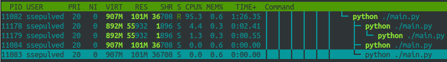
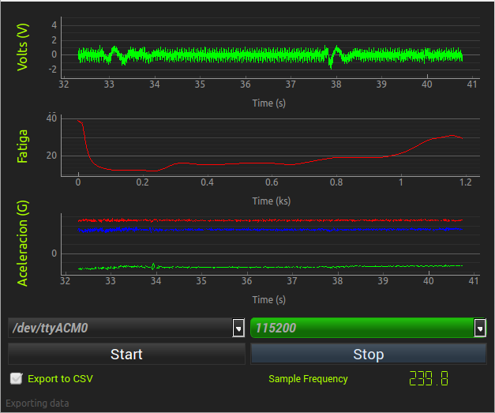

:author: Sebastián Sepúlveda
:email: ssepulveda.sm@gmail.com
:institution: Escuela de Ingeniería Civil Biomédica, Facultad de Ingeniería, Universidad de Valparaíso

:author: Pablo Reyes
:email: pablo.reyes@uv.cl
:institution: Escuela de Ingeniería Civil Biomédica, Facultad de Ingeniería, Universidad de Valparaíso

:author: Alejandro Weinstein
:email: alejandro.weinstein@uv.cl
:institution: Escuela de Ingeniería Civil Biomédica, Facultad de Ingeniería, Universidad de Valparaíso

:video: https://www.youtube.com/watch?v=sdVygxpljII
:video: https://www.youtube.com/watch?v=6WxkOeTuX7w

------------------------------------------------
Visualizing physiological signals in real time
------------------------------------------------

.. class:: abstract 

This article presents a software package, dubbed RTGRaph, to visualize, process and record physiological signals (electrocardiography, electromyography, etc.) in real time. RTGraph is written in Python; it is open source and easy to extend; and it has been tested on differente platforms, including the RaspberryPi (ARM architecture). The program leverages the use of the PyQtGraph library and the SciPy/NumPy stack. A key feature of RTGraph is its multi-process architecture. This allows RTGRaph to take advantage of multiple cores and to have a clean separation between the communication and visualization code.

.. class:: keywords

   real time processing, visualization, signal processing

Introduction
------------

A common task in biomedical research is to record and visualize physiological signals in real time. Although there are several options to do this, they are commonly based on  proprietary tools, associated with a particular signal acquisition device vendor. This article presents RTGraph, an open source software package (under MIT license) written in Python, to visualize and record physiological signals in real time, such as electrocardiography, electromyography and human movement. RTGraph is also capable of doing real time processing, such as filtering and spectral estimation. RTGraph is open source, [#]_  extensible, and  has been tested on different Linux distributions, including the RaspberryPi (ARM architecture). RTGraph has a modular design, with a clear separation among its different functionalities, making it easy to add new signal processing tasks, to use different communication protocols (serial, Bluetooth, Sockets, etc.), and customize the user interface for the specific needs of the application.

.. [#] Available at https://github.com/ssepulveda/RTGraph.

The main aim of RTGraph is to display multiple signals in real time and to export them to a file. In the current implementation, the communication between RTGraph and the acquisition device is through the serial port, and it is implemented using the PySerial library. Other communication protocols can be easily added. The real time display of the signals is implemented using the PyQtGraph library. [#]_ RTGraph has a multiprocess architecture, based on the multiprocessing Python standard library. This allows having concurrent processes for receiving, processing, and displaying the data. Signal processing tasks, such as spectral estimation, are based on the SciPy/NumPy stack [Ste11]_. This architecture makes it possible to ensure that no data is lost and that the user interface has a fast response.

.. [#] Available at http://www.pyqtgraph.org.

Software architecture
---------------------

The applications described in this article can be classified as a "data logger". A data logger needs to acquire a stream of data, add a time stamp to the data (if required), and export the time-stamped data to a file in a known file format, such as comma separated value (CSV) format. Optionally, the application can do some processing (filtering, spectral estimation, etc.) before saving the data. In addition, it is also useful to be able to visualize, in real time, the stream of data.

When developing, evaluating, or validating new hardware or software, it is important to control the outcome of the algorithms and the fidelity and performance of the data acquisition process. In particular, in the field of Biomedical Engineering, the acquisition and processing of biological signals needs to be reliable and with a tight control over the sampling frequency. It is also fundamental to ensure that no data is lost during the acquisition and logging process. From a practical point of view, having to wait for the data to be stored before visualizing it (possibly in another program) is cumbersome, slowing down the development process. For these reasons, in this article we present a program capable of: receiving data from a variety of sources (serial port, Bluetooth, Zigbee, Sockets, etc.); processing and visualizing the data in real time; and saving the data in a file.

The first version of this program was developed for biomechanical engineering research. In our case, this research involves logging, processing and the display in real time of the signals generated by a nine degrees of freedom inertial measurement unit (9DOF-IMU) [Roe06]_. This requires acquiring nine signals with a sampling rate of at least 100 Hz. Six additional signals are computed through a sensor fusion algorithm [Mad11]_. A total of 15 signals are displayed and exported as a CSV file. We designed the architecture of the program with these requirements in mind.

Real time graphics library
==========================

Real time visualization is a key component of our program. To satisfy our requirements we needed a fast and portable graphics library. Since we implemented the GUI in PyQT, we also required that the graphics library should be embeddable in this framework.

We used Matplotlib [Hun20]_ in the first version of the program. This option worked out of the box. We were able to embed a Matplotlib plot in the GUI and interact with it through other elements of the UI without major complications. Although this approach worked for displaying one signal with a sampling rate of 30 Hz, we started to notice a degradation on performance as we increased the number of signals. It is important to note that this is not a flaw of Matplotlib, since the main focus of the library is the production of publication of quality figures, and not the display of real time data.

Next, we tried PyQtGraph [Cam15]_. It is a pure Python implementation, with a focus on speed, portability and a rich set of features. Unlike Matplotlib, PyQtGraph is designed to do real time plotting and interactive image analysis. It is built on top of PyQt4/PySide, giving easy integration and full compatibility with the Qt framework. This allows using tools like Qt Designer to design the GUI. Using Qt Designer and the examples provided with the PyQtGraph library, it is easy to configure and customize the widgets. PyQtGraph is also built on top of NumPy, facilitating and improving the performance of the manipulation of numerical data. In addition, PyQtGraph wraps up some NumPy/SciPy signal processing functions such as the Fast Fourier Transform and some linear and non-linear filters. [#]_

.. [#] We also evaluated the PyQwt library (http://qwt.sourceforge.net/). This library provides a Python interface to the Qwt library. It is a light implementation with an easy QT integration. It is fast enough to support real time display of the data. However, this library is not currently maintained, and its author recommended using PyQtGraph (see http://comments.gmane.org/gmane.comp.graphics.qwt.python/506).

Threading versus Multiprocessing
================================

After using PyQtGraph to its limits in a multithreaded architecture, we could not reliably achieve the desired performance. The limitations of threads in Python [Bea10]_ combined with the interaction between the UI (main thread) and communication thread, resulted in data losses when the data rate was too high. The Global Interpreter Lock (GIL) [Bea10]_ prevents threads to take advantage of multicore systems. In short, it means that a mutex controls threads access to memory. There are ways to work around this limitation. For instance, many of the NumPy primitives take advantage of multiple cores. [#]_ However, in our case we need to parallelize the reception of the data, the visualization, the processing, and the logging.

.. [#] See http://wiki.scipy.org/ParallelProgramming for details.

To overcome the GIL limitations we used the multiprocessing module, belonging to the Python Standard Library. This module provides an API similar to the threading module, but it uses subprocesses instead of threads [Pyt15]_. By letting the OS control the subprocesses, it is possible to take advantage of the multiple cores available on the platform.

Putting it all together
=======================

Once the key components of the program have been selected, the remaining problem is to orchestrate the communication among the processes. We pay special attention to data synchronization, since there are specific considerations that should be taken into account when working with multiple processes.

Figure :ref:`figSWarch` shows the architecture of RTGraph. The architecture allow us to: (1) Have a multiplatform program; (2) have a separation between the reception and parsing of input data stream and the plotting and logging tasks. The following is a description of each process.

1. Communication process: This process is responsible for receiving and parsing the data stream sent by the device. The implementation consists of an abstract class, that subclasses the ``Process`` class from the ``multiprocessing`` library. Therefore, the methods  ``__init__`` and ``run`` are overwritten. We also added methods ``start`` and ``stop`` to properly start and stop the subprocesses. The class also has methods common to different communication protocols (serial, sockets, etc.). The details of each protocol are implemented in each subclass. This process is also responsible of validating the data and adding the time-stamp to the data, in case the device does not provide it. This guarantees that the data is always time-stamped.

2. Main process: The main process is responsible for initializing the different subprocesses and for coordinating the communication between them. As shown in figure :ref:`figSWarch`, this process instantiates the components that will allow the communication between the subprocesses and also manage the different UI elements. A ``Queue``, as implemented by the ``multiprocessing`` module, is used to connect the communication process with the main process. A ``QtTimer`` is set to update the real time plot. By updating the plot at a known frequency, we can control the responsiveness of the program under different conditions. Each time the ``QtTimer`` triggers a plot update (30 times per second), the ``queue`` is processed. The queue is read until it is empty and then the plot is updated.

.. figure:: sw_architecture.pdf

   Diagram of the software architecture. There are two independent processes. The communication process reads the incoming data stream, parses it, adds a time-stamp (if necessary), and puts the processed data into a queue. The main process reads the data from the queue, processes the data, and then updates the plot and logs the data to a file. :label:`figSWarch`

Figure :ref:`usage` shows the processes viewed by ``htop`` during the execution of the program. The first process (PID 3095) corresponds to the process initiated by the application. The second one is the communication process (PID 3109). [#]_

.. [#] By default ``htop`` shows the processes and threads together. Pressing the H key while the program is running shows or hides the threads. In figure :ref:`usage`, the screen is configured to show only the processes.

Programming details
-------------------

The template for the communication process is implemented through the ``CommunicationProcess`` class. This template allows for processing data streams coming from a variety of protocols (serial, sockets, bluetooth, etc.). The design of the class  also allows changing some of the communication parameters during run-time. In addition, since the class inherits from the ``Process`` class, it is trivial to run several instances of the class to receive from multiple devices simultaneously. For instance, it is possible to instantiate the class twice to receive data form two different serial ports at the same time. The following code snippet shows the basic structure of the class. 

.. code-block:: python

	class CommunicationProcess(Process):
	    def __init__(self, queue):
	        Process.__init__(self)
                self.exit = Event()
                self.queue = queue
                # Initialize the process ...
                # Initialize the acquisition method ...

            def run(self):
                self.init_time = time()
                try:
                    while not self.exit.is_set():
                        # do acquisition
                        # and add time stamp ...
                except:
                    raise
                finally:
                    self.closePort()

            def openPort(self, port):
                # Port configuration to open

            def closePort():
                self.exit.set()

The main process is implemented through the ``MainWindow`` class. It is a subclass of the ``QtGui.QMainWindow`` class. Inside this class we define the proper acquisition method (serial, sockets, bluetooth, etc.) and the basic plot configurations, and we configure the timers used to update the plots, which  trigger the ``update_plot`` method. The following code snippet shows the basic structure of the class. 

.. code-block:: python

	class SerialProcess(Process):
		# ...
		def run(self):
	        self.init_time = time()
	        try:
	            while self.ser.isOpen() and not self.exit.is_set():
	                data = self.ser.readline().strip()
	                try:
	                    data = map(float, data.split(','))
	                    self.queue.put([time() - self.init_time] + data)
	                except:
	                    pass
	            return
	        except:
	            raise
	        finally:
	            self.closePort()
	    # ...

One of the most important methods in a ``CommunicationProccess`` class is the ``run`` method. Following the example from the serial acquisition method, in the ``SerialProcess`` class the method ``run`` make the time stamp and then checks if the serial port is open and also, if the process is not exiting. If both statements are true, a line is read from the serial port. Then, the data is converted to the expected formant, and if the data is valid, is putted in the queue. In this case, the data is expected to be a float type, and received as CSV format.

.. code-block:: python

    class MainWindow(QtGui.QMainWindow):
        def __init__(self):
            QtGui.QMainWindow.__init__(self)
            self.ui = Ui_MainWindow()
            self.ui.setupUi(self)
            # initialize plots ...
            self.ui.plt.setBackground(background=None)
            self.plt1 = self.ui.plt.addPlot(row=1, col=1)

            # initialize variables ...
            # initialize timers ...
            QtCore.QObject.connect(self.timer_plot_update,
                                   ...)

        def start(self):
            self.data = CommunicationProcess(self.queue)
            self.data.openPort(...)

            self.timer_plot_update.start(...)
            self.timer_freq_update.start(...)

        def update_plot(self):
            while self.queue.qsize() != 0:
                data = self.queue.get(True, 1)

            # draw new data ...
            self.plt1.clear()
            self.plt1.plot(...)

        def stop(self):
            self.data.closePort()
            self.data.join()
            self.timer_plot_update.stop()

   Screenshot of ``htop`` showing the processes associated with the program. The first process (PID 3095) corresponds to the process initiated by the application. The second one is the communication process (PID 3109).  :label:`usage`

Modifying the function ``self.start``, allows to change the communication method to be used. This function is triggered every time the Start button is pressed, therefore, a new instance is generated in every trigger, allowing to modify on the fly the different acquisitions methods, if needed. the line ``self.data = CommunicationProcess(self.queue)`` must be modified to the proper acquisition class, and then, following the structure for the class defined in the ``CommunicationProcess(Process)`` snippet, the application should run without problems.

For further customization, the plot details can be modified. They reside on the MainWindow class, where some embedded functions can be used to access simple PyQtGraph options; titles, labels, colors of the lines.

.. code-block:: python

	class MainWindow(QtGui.QMainWindow):
		def __init__(self):
			# ...
			# Initializes plots
    		self.ui.plt.setBackground(background=None)
    		self.plt1 = self.ui.plt.addPlot(row=1, col=1)
    		self.plt2 = self.ui.plt.addPlot(row=2, col=1)
    		# ...
    		self.configure_plot(self.plt1, "title1", "unit1")
    		self.configure_plot(self.plt2, "title2", "unit2")

	    @staticmethod
	    def configure_plot(plot,title, unit, 
	                       y_min=0, y_max=0,
	                       label_color='#2196F3',
	                       label_size='11pt'):
	        label_style = {'color': label_color,
	                       'font-size': label_size}
	        plot.setLabel('left', title,
	                      unit, **label_style)
	        plot.setLabel('bottom', 'Time',
	                      's', **label_style)
	        plot.showGrid(x=False, y=True)
	        if y_min != y_max:
	            plot.setYRange(y_min, y_max)
	        else:
	            plot.enableAutoRange(axis=None, enable=True)
	        plot.setMouseEnabled(x=False, y=False)

As the snippet of code shows, the basic customizations can be done with the normal PyQtGraph methods instantiated from ``self.ui.plt``. This inherits the ``GraphicsLayoutWidget``, giving the possibility of making arrangements of subplots, as shown with the lines ``self.plt1 = self.ui.plt.addPlot(row=1, col=1)``. Using the view, is easy to modify on the fly the arrangements of the plots and subplots. The function ``configure_plot()`` also gives the ability to define the title of the plot, unit of the Y axis, maximum and minimum values for the Y axis (if they are not set, the functions assumes auto range for the Y axis). Optionally, the color of the plot could be customized, and the size of the fonts.
Customization of the proper UI, and the look and feel, can be done trough Qt Designer. The proper files are provided, and also a simple makefile to rebuild the UI export from Qt Designer to PyQt.

Results
-------

We have used RTGraph with a serial port data stream corresponding to a signal with a sampling frequency of 2 kHz. We have also used it with a data stream from a TCP/IP socket corresponding to 20 signals with a sampling frequency of 500 Hz.

In a biomechanical study we used our program to evaluate a prototype of a wearable device used to estimate muscle fatigue through the EMG signal. RTGraph was customized to acquire and record these data. We also incorporated some steps of a fatigue estimation algorithm [Dim03]_ to the processing pipeline. We found that having real time feedback of the signal simplified  the procedure to position the wearable device correctly, drastically reducing the amount of time required by the experiments. Figure :ref:`emg` shows a screenshot of the program while acquiring an EMG signal using a wearable device to study muscle fatigue. The figure shows an EMG signal (first panel), a real time estimation of the fatigue level (second panel) based on the acquired EMG signal, and three acceleration signals (third panel). See the following links for a video of RTGraph being used to acquire these signals: https://www.youtube.com/watch?v=sdVygxpljII, https://www.youtube.com/watch?v=6WxkOeTuX7w.

    
    Screenshot of RTGraph customized and modified to display 3 signals: an EMG signal (first panel), an estimation of the fatigue level (second panel) based on the acquired EMG signal, and three acceleration signals (third panel). :label:`emg`

An important feature of our program is the ease with wich it can be customize  to a specific application. For instance, RTGraph is being used to acquire a set of pressure signals from a device (as seen in figure :ref:`device`) used to monitor nutrition disorders in premature infants. The customization included: (1) modifying RTGraph to acquire two pressure signals using bluetooth; and (2) to perform some specific signal processing before the visualization. In this example it is important to emphasize that the changes to the program were made by a researcher other than the main developer of our program. We claim that this is possible because our program is written in Python. This makes it easier to understand and modify the code compared to a program written in a lower-level language.

The software package presented in this article has been tested with different devices, communication protocols, platforms and operating systems (OSs). The initial development was done and tested on the platforms x86, x64 and ARM (RaspberryPy) running Linux. However, this version of RTGraph did not work as expected on OS X and Windows, due to some restrictions of the multiprocessing library in these OSs. Despite the fact that OS X is a Unix-like OS, there are some multiprocessing methods not implemented in the multiprocessing library. In particular, the method ``qsize``, used to get the approximate size of the queue, is not implemented in OS X. The lack of the ``os.fork()`` call in Windows adds some extra limitations when running a program on this OS. Since in this case a child process can not access the parent resources, it is necessary that subclasses of the ``Process`` class must be picklable. Although the documentation of the library contains some suggestions to overcome these restrictions, currently we are not able to run our program on Windows.

.. figure:: device.jpg
    
    Photo of the prototype device used in the study. An Arduino development platform is used to acquire the signals (two pressure measurements). These signals are acquired by a computer running a modified version of RTGraph. :label:`device`

Conclusions
-----------

In this article we presented a program developed to record, process and visualize physiological signals in real time. Although many people consider Python as a "slow" language, this article shows that it is possible to use Python to write applications able to work in real time. At the same time, the clarity and simplicity of Python allowed us to end up with a program that it is easy to modify and extend, even by people who are not familiar with the base code.

We also believe that our solution is a contribution to the open source and Do It Yourself (DIY) communities. Typically, programs to receive and manipulate data in real time are developed using proprietary tools such as LabView or MATLAB. The cost of these tools denies members of these communities access to solutions like those described in this article. As we showed in the result section, in many cases we have used the program with an Arduino acting as an acquisition device. This is a common situation, and we believe that our program can be extended to be used in other fields in need of similar tools.

In the future our first priority is to make our program work on platforms running OS X and Windows. We are currently investigating how to overcome the restriction imposed by the multiprocessing platform on these OSs. Next, we will focus on improving the UI. In particular, we will add an option to change some plotting and processing parameters on the fly, instead of requiring a change in the source code. Finally, we will refactor the architecture of the program to improve the performance, so we can handle higher data rates. In this respect, the main change we plan to do is to move the signal processing computation to another process, leveraging the existence of multi-core machines.

Acknowledgments
---------------

This research was partially supported by the Advanced Center for Electrical and
Electronic Engineering, Basal Project FB0008, Conicyt.

References
----------

.. [Bea10] D. Beazley. *Understanding the python GIL*,
           In PyCON Python Conference. Atlanta, Georgia, 2010.

.. [Cam15] L. Campagnola. *PyQtGraph. Scientific Graphics and GUI Library for Python*,
           http://www.pyqtgraph.org/

.. [Dim03] N. Dimitrova  and G. Dimitrov. *Interpretation of EMG changes with fatigue: facts, pitfalls, and fallacies.*
        Journal of Electromyography and Kinesiology 13.1 (2003): 13-36.

.. [Hun20] J. D. Hunter. *Matplotlib: A 2D graphics environment*,
           Computing In Science & Engineering, 9(3):90-95, IEEE COMPUTER SOC, 2007.

.. [Mad11] S. Madgwick, Andrew JL Harrison, and Ravi Vaidyanathan. *Estimation of IMU and MARG orientation using a gradient descent algorithm.*,
           Rehabilitation Robotics (ICORR), 2011 IEEE International Conference on. IEEE, 2011.

.. [Pyt15] Python Software Foundation, *16.6 multiprocessing - Process-based “threading” interface*,
        https://docs.python.org/2/library/multiprocessing.html

.. [Roe06] D. Roetenberg, *Inertial and magnetic sensing of human motion*. 
	   University of Twente, 2006.

.. [Ste11] S. van der Walt, S.C. Colbert and G. Varoquaux, *The NumPy Array: A
	   Structure for Efficient Numerical Computation*, Computing in Science
	   & Engineering, 13, 22-30, 2011.

..  LocalWords:  electromyography SciPy NumPy biomedical RaspberryPi PySerial multiprocess
