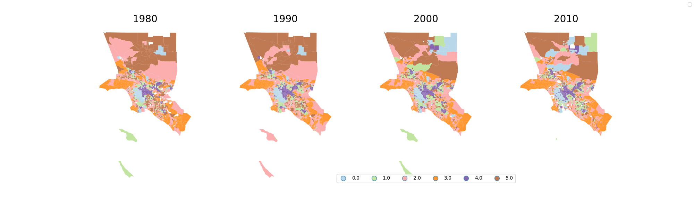
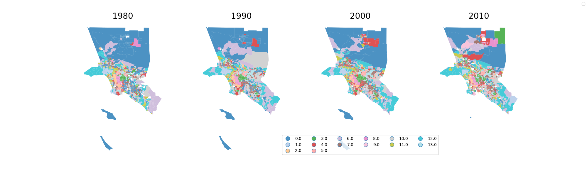
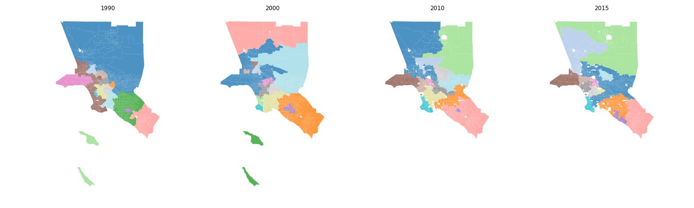

:author: Sergio Rey
:email: sergio.rey@ucr.edu
:institution: Center for Geospatial Sciences, University of California, Riverside 
:corresponding:

:author: Elijah Knaap
:email: 
:institution: Center for Geospatial Sciences, University of California, Riverside 

:author: Su Han
:email: 
:institution: Center for Geospatial Sciences, University of California, Riverside 

:author: Levi Wolf
:email: levi.john.wolf@bristol.ac.uk 
:institution: School of Geographical Sciences, University of Bristol

:author: Wei Kang 
:email: 
:institution: Center for Geospatial Sciences, University of California, Riverside 

:bibliography: reference


-------------------------------------------------------
Spatio-temporal analysis of socioeconomic neighborhoods
-------------------------------------------------------

.. class:: abstract

The neighborhood effects literature represents a wide span of the social
sciences broadly concerned with the influence of spatial context on social
processes. From the study of segregation dynamics, the relationships between the
built environment and health outcomes, to the impact of concentrated poverty on
social efficacy, neighborhoods are a central construct in empirical work. From a
dynamic lens, neighborhoods experience changes not only in their socioeconomic
composition, but also in spatial extent; however, the literature has ignored the
latter source of change. In this paper, we discuss the development of novel,
spatially explicit approaches to the study of longitudinal neighborhood dynamics
using the scientific Python ecosystem.

.. class:: keywords

   neighborhoods, GIS, clustering, dynamics

  
Introduction (.5) (SR, EK, SH, LW, WK)
--------------------------------------

For social scientists in a wide variety of disciplines, neighborhoods
are central thematic topics, focal units of analysis, and first-class
objects of inquiry. Despite their centrality public health, sociology,
geography, political science, economics, psychology, and urban planning,
however, neighborhoods remain understudied because researchers lack
appropriate analytical tools for understanding their evolution through
time and space. Towards this goal we are developing the *open source
longitudinal neighborhood analysis program* ``(OSLNAP)``. We envisage OSLNAP as a
toolkit for better, more open and reproducible science focused on neighborhoods
and their sociospatial ecology. In this paper we first provide an overview of
the main components of OSLNAP. Next, we present an illustration of selected
OSLNAP functionality. We conclude the paper with a road map for future
developments.

OSLNAP
------

Neighborhood analysis involves a multitude of analytic tasks, and different
types of enquiry lead to different analytical pipelines in which distinct tasks
are combined in sequence. OSLNAP is designed in a modular fashion to facilitate
the composition of different pipelines for neighborhood analysis. Its
functionality is available through different interfaces from a web-based front end
as a service to a library for scripting in Jupyter notebooks or at the shell. We
first provide an overview of each of the main analytical components of OSLNAP
before moving on to an illustration of how selections of the analytical
functionality can be combined for particular use cases.

OSLNAP's analytical components are organized into three core modules: [a] data
layer; [b] neighborhood definition layer; [c] longitudinal analysis layer.

Data Layer
==========

Like many quantitative analyses, one of the most important and
challenging aspects of longitudinal neighborhood analysis is the
development of a tidy and accurate dataset. When studying the
socioeconomic makeup of neighborhoods over time, this challenge is
compounded by the fact that spatial units whose composition is under
study often change size, shape, and configuration over time. The
``harmonize`` module provides social scientists with a set of simple and
consistent tools for building transparent and reproducible
spatiotemporal datasets. Further, the tools in ``harmonize`` allow
researchers to investigate the implications of alternative decisions in
the data processing pipeline and how those decisions affect the results
of their research.

Neighborhood demographic and socioeconomic data relevant to social
scientists are typically collected via a household census or survey and
aggregated to a geographic reporting unit such as a state, county or zip
code which may be relatively stable. The boundaries of smaller
geographies like census tracts, however, often are designed to
encapsulate roughly the same number of people for the sake of
comparability, which means that they are necessarily redrawn with each
data release as population grows and fluctuates. Since same physical
location may fall within the boundary of different reporting units at
different points in time, it is impossible to compare directly a single
neighborhood with itself over time.


To facilitate temporal comparisons, research to date has proceeded by
designating a “target” geographic unit or zone that is held constant
over time, and allocating data from other zones using areal
interpolation and other estimation techniques. This process is sometimes
known as “boundary harmonization” :cite:`logan_2016`. While “harmonized” data
is used widely in neighborhood research, the harmonization process also
has known shortcomings, since the areal interpolation of aggregate data
is subject to the ecological fallacy–the geographic manifestation of
which is known as the “Modifiable Areal Unit Problem” (MAUP)
:cite:`Openshaw1984`. Simply put, MAUP holds that areal interpolation
introduces bias since the spatial distribution of variables in each of
the overlapping zones is unknown. A number of alternative approaches
have been suggested to reduce the amount of error by incorporating
auxiliary data such as road networks, which help to uncover the “true”
spatial distribution of underlying variables, but this remains an active
area of research :cite:`schroeder_2017,Sridharan2013,Tapp2010,Xie1995`.

In practice, these challenges mean that exceedingly few neighborhood
researchers undertake harmonization routines in their own research, and
those performing temporal analyses typically use exogenous,
pre-harmonized boundaries from a commercial source such as the
Neighborhood Change Database (NCDB) :cite:`tatian`, or the freely available
Longitudinal Tract Database (LTDB) :cite:`logan_2014`. The developers of
these products have published studies verifying the accuracy
of their respective data, but those claims have gone untested because
researchers are unable to fully replicate the underlying methodology.

To overcome the issues outlined above, ``oslnap`` provides a suite of
functionality for conducting areal interpolation and boundary
harmonization in the ``harmonize`` module. It leverages ``geopandas``
and ``PySAL`` for managing data and performing geospatial operations,
and the pydata stack for attribute calculations :cite:`rey2009`. The
``harmonize`` module allows a researcher to specify a set of input data
(drawn from the space-time database described in the prior section), a
set of target geographic units to remain constant over time, and an
interpolation function that may be applied to each variable in the
dataset independently. For instance, a researcher may decide to use
different interpolation methods for housing prices than for the share of
unemployed residents, than for total population; not only because the
researcher may wish to treat rates and counts separately, but also
because different auxiliary information might be applicable for
different types of variables.

In a prototypical workflow, ``harmonize`` permits the end-user to:

-  query the spatiotemporal database created via the ``data`` module

   -  queries may have spatial, temporal, and attribute filters

-  define the relevant variables to be harmonized and optionally apply a
   different interpolation function to each
-  harmonize temporal data to consistent spatial units by either:

   -  selecting an existing native unit (e.g. zip codes in 2016)
   -  inputting a user-defined unit (e.g. a theoretical or newly
      proposed boundary)
   -  developing new primitive units (e.g. the intersection of all
      polygons)

Neighborhood Identification 1.5
===============================


Neighborhoods are complex social and spatial environments with multiple
interacting individuals, markets, and processes. Despite 100 years of
research it remains difficult to quantify neighborhood context, and
certainly no single variable is capable of capturing the entirety of a
neighborhood’s essential nuance. For this reason, several traditions of
urban research focus on the application of multivariate clustering
algorithms to develop neighborhood typologies. Such typologies are
sometimes viewed as more holistic descriptions of neighborhoods because
they account for multiple characteristics simultaneously
:cite:`galster2001`.

One notable tradition from this perspective called “geodemographics”, is
used to derive prototypical neighborhoods whose residents are similar
along a variety of socioeconomic and demographic attributes
:cite:`flowerdew1989,singleton2014`. Geodemographics have been applied
widely in marketing :cite:`farr2005`, education :cite:`singleton2009a`, and health
research :cite:`petersen2011` among a wide variety of additional fields. The
geodemographic approach as also been criticized, however, for failing to
model geographic space formally. In other words, the geodemographic
approach ignores spatial autocorrelation, or the “first law of
geography”–that the attributes of neighboring zones are likely to be
similar. Another tradition in urban research, known as “regionalization”
has thus been focused on the development of multivariate clustering
algorithms that account for spatial dependence explicitly. To date,
however, these traditions have rarely crossed in the literature,
limiting the utility each approach might have toward applications in new
fields. In the ``cluster`` module, we implement both clustering
approaches to (a) foster greater collaboration among weakly connected
components in the field of geographic information science, and (b) to
allow neighborhood researchers to investigate the performance of
multiple different clustering solutions in their work, and evaluate the
implications of including space as a formal component in their
clustering models.

the ``cluster`` module leverages the scientific python ecosystem,
building from ```geopandas`` <http://geopandas.org/>`__,
```PySAL`` <http://pysal.org>`__, and
```scikit-learn`` <http://scikit-learn.org>`__. Using input from the
Data Layer, the ``cluster`` module allows researchers to develop
neighborhood typologies based on either attribute similarity (the
geodemographic approach) or attribute similarity with incorporated
spatial dependence (the regionalization approach). Given a space-time
dataset, the ``cluster`` module allows users to cluster (a) a single
time period, (b) a set of time periods cross-sectionally, or (c) a set
of periods pooled as a time series. In (b), neighborhood clusters are
independent from one time period to the next. This can be a useful
approach if researchers are interested in the durability and permanence
of certain kinds of neighborhoods. If similar types reappear in multiple
cross sections (e.g. if the k-means algorithm places the k-centers in
approximately similar locations each time period), then it may be
inferred that the metropolitan dynamics are somewhat stable, at least at
the macro level, since new kinds of neighborhoods do not appear to be
evolving and old, established neighborhood types remain prominent. The
drawback of this approach is the type of a single neighborhood cannot be
compared between two different time periods because the types are
independent in each period.

In the (c), clusters are defined from all observations in all time
periods. In this case, the universe of potential neighborhood types is
held constant over time, the neighborhood types are consistent across
time periods, and researchers can examine how particular neighborhoods
get classified into different neighborhood types as their composition
transitions through different time periods. While comparatively rare in
the research, this latter approach allows a richer examination of
socio-spatial dynamics. By providing tools to drastically simplify the
data manipulation and analysis pipeline, we aim to facilitate greater
exploration of urban dynamics that will help catalyze more of this
research.

To facilitate this work, the ``cluster`` module provides wrappers for
several common clustering algorithms from ``scikit-learn`` that can be
applied . Beyond these, however, it also provides wrappers for several
*spatial* clustering algorithms from ``PySAL``, in addition to a number
of state-of-the art algorithms that have recently been developed
:cite:`wolf2018`.

In a prototypical workflow, ``cluster`` permits the end-user to:

-  query the (tidy) space-time dataset created via the ``harmonize``
   module

   -  queries may have spatial, temporal, and attribute filters

-  define the neighborhood attributes and time periods and on which to
   develop a typology
-  run one or more clustring algorithms on the space-time dataset to
   derive neighborhood cluster membership

   -  clustering may be applied cross-sectionally or on the pooled
      time-series
   -  clustering may incorporate spatial dependence, in which case
      ``cluster`` provides options for users to parameterize a spatial
      contiguity matrix

-  clustering results may be reviewed quickly via the builtin ``plot()``
   method, or interactively by leveraging the ``geovisualization``
   module.


In the following sections we demonstrate the utility of ``oslnap`` by
presenting the results of several sample analyses conducted with the
package. We begin with a series of cluster analyses, which are used in
the proceeding section to analyze neighborhood dynamics. Typically,
workflows of this variety would require extensive data collection,
munging and recombination; with ``oslnap``, however, we accomplish the
same in just a few lines of code. Using the Los Angeles metropolitan
area as our laboratory, we present three neighborhood typologies, each
of which leverages the same set of demographic and socioeconomic
variables, albeit with different clustering algorithms. The results show
similarities across the three methods but also several marked
differences. This diversity of results can be viewed as either nuisance
or flexibility, depending on the research question at hand, and
highlights the need for research tools that facilitate rapid creation
and exploration of different neighborhood clustering solutions. For each
example, we prepare a cluster analysis for the Los Angeles metropolitan
region using data at the census tract level. We show each clustering
solution on a map, describe the resulting neighborhood types, and
examine the changing spatial structure over time. For each of the
examples, we cluster on the following variables: race categories
(percent white, percent black, percent Asian, percent Hispanic),
educational attainment (share of residents with a college degree or
greater) and socioeconomic status (median income, median home value,
percent of residents in poverty).

Agglomerative Ward
~~~~~~~~~~~~~~~~~~

We begin with a simple example identifying six clusters via the
agglomerative Ward method. Following the geodemographic approach, we aim
to find groups of neighborhoods that are similar in terms of their
residential composition, regardless of whether those neighborhoods are
physically proximate. Initialized with the demographic and socioeconomic
variables listed earlier, the Ward method identifies three clusters that
are predominantly white on average but which differ with respect to
socioeconomic status. The other three clusters, meanwhile, tend to be
predominantly minority neighborhoods but are differentiated mainly by
the dominant racial group (black versus Hispanic/Latino) rather than by
class. The results, while unsurprising to most urban scholars, highlight
the continued segregation by race and class that characterize American
cities. For purposes of illustration, we give each neighborhood type a
stylized moniker that attempts to summarize succinctly its composition
(again, a common practice in the geodemographic literature). To be
clear, these labels are oversimplifications of the socioeconomic context
within each type, but they help facilitate rapid consumption of the
information nonetheless. The resulting clusters are presented below in
fig. 1.



   Neighborhood Types in LA using Ward Clustering. :label:`f:ward`


-  Type 0. racially concentrated (black and Hispanic) poverty
-  Type 1. minority working class
-  Type 2. integrated middle class
-  Type 3. white upper class
-  Type 4. racially concentrated (Hispanic) poverty
-  Type 5. white working class

When the neighborhood types are mapped, geographic patterns are
immediately apparent, despite the fact that space is not considered
formally during the clustering process. These visualizations reveal what
is known as “the first law of geography”–that near things tend to be
more similar than distant things (stated otherwise, that geographic data
tend to be spatially autocorrelated) :cite:`Tobler_1970`. Even though we do
not include the spatial configuration as part of the modeling process,
the results show obvious patterns, where neighborhood types tend to
cluster together in euclidian space. The clusters for neighborhoods type
zero and four are particularly compact and persistent over time (both
types characterized by racially concentrated poverty), helping to shed
light on the persistence of racial and spatial inequality. With these
types of visualizations in hand, researchers are equipped not only with
analytical tools to understand how neighborhood composition can affect
the lives of its residents (a research tradition known as neighborhood
effects), but also how neighborhood identities can transform (or remain
stagnant) over time and space. Beyond the simple diagnostics plots
presented above, ``oslnap`` also includes an interactive visualization
interface that allows users to interrogate the results of their analyses
in a dynamic web-based environment where interactive charts and maps
automatically readjust according to user selections.


Affinity Propagation
~~~~~~~~~~~~~~~~~~~~

Affinity propagation is a newer clustering algorithm with
implementations in scikit-learn and elsewhere that is capable of
determining the number of clusters endogenously (subject to a few tuning
parameters). Initialized with the default settings, ``oslnap`` discovers
14 neighborhood types in the Los Angeles region; in a way, this
increases the resolution of the analysis beyond the Ward example, since
increasing the number of clusters means neighborhoods are more tightly
defined with lower variance in their constituent variables. On the other
hand, increasing the number of neighborhood types also increase the
difficulty of interpretation since the each type will be, by definition,
less differentiable from the others. In the proceeding section, we
discuss how researchers can exploit this variability in neighborhood
identification to yield different types of dynamic analyses. Again, we
find it useful to present stylized labels to describe each neighborhood
type:



   Neighborhood Types in LA using Affinity Propagation. :label:`f:ap`


-  Type 0. white working class
-  Type 1. white extreme wealth
-  Type 2. black working class
-  Type 3. Hispanic poverty
-  Type 4. integrated poverty
-  Type 5. Asian middle class
-  Type 6. white upper-middle class
-  Type 7. integrated Hispanic middle class
-  Type 8. extreme racially concentrated poverty
-  Type 9. integrated extreme poverty
-  Type 10. Asian upper middle class
-  Type 11. integrated white middle class
-  Type 12. white elite
-  Type 13. Hispanic middle class

Despite having more than double the number of neighborhood types in the
Ward example, many of the spatial patterns remain when using affinity
propagation clustering, including concentrated racial poverty in South
Central LA, concentrated affluence along much of the coastline, black
and Hispanic enclaves in the core of the city, and white working class
strongholds in more rural areas to the north of the region. Comparing
these two examples makes clear that some of the sociodemographic
patterns in the LA region are quite stable, and are somewhat robust to
the clustering method or number of clusters. Conversely, by increasing
the number of clusters in the model, researchers can explore a much
richer mosaic of social patterns and their evolution over time, such as
the continued diversification of the I-5 corridor along the southern
portion of the region.

SKATER
~~~~~~

Breaking from the geodemographic approach, the third example leverages
SKATER, a spatially-constrained clustering algorithm that finds groups
of neighborhoods that are similar in composition, but groups them
together if and only if they also satisfy the criteria for a particular
geographic relationship [1]_. As such, the family of clustering
algorithms that incorporate spatial constraints (from the tradition
known as “regionalization”) must be applied cross-sectionally, and yield
an independent set of clusters for each time period. The clusters, thus,
depend not only on the composition of the census units, but also their
spatial configuration and connectivity structure at any given time.




   Neighborhood Types in LA using Skater. :label:`f:skater`

Despite the fact that clusters are independent from one year to the next
(and thus, we lack appropriate space in this text for describing the
SKATER results for each year) comparing the results over time
nonetheless yield some interesting insights. Regardless of the changing
spatial and demographic structure of the Los Angeles region, some of the
of the neighborhood boundaries identified are remarkably stable, such as
the area of concentrated affluence in Beverly Hills and its nearby
communities that jut out to the region’s West. Conversely, there is
considerable change among the predominantly minority communities in the
center of the region, whose boundaries appear to be evolving
considerably over time. In these places, a researcher might use the
output from SKATER to conduct an analysis to determine the ways in which
the empirical neighborhood boundaries derived from SKATER conform to
residents’ perceptions of such boundaries, their evolution over time,
and their social re-definition as developed by different residential
groups [@Hwang2016a]. Regardless of its particular use, the
regionalization approach presents neighborhood researchers with another
critical tool for understanding the bi-directional relationship between
people and places.

In each of the sample analyses presented above, we use ``oslnap`` to
derive a set of neighborhood clusters or types that can be used to
analyze the demographic makeup of places over time. In some cases, these
maps can serve as foundations for descriptive analyses or analyzed as
research projects in their own right. In other cases, in which social
processes rather than the demographic makeup of communities is the focus
of study, the neighborhood types derived here can be used as input to
dynamic analyses of neighborhood change and evolution, particularly as
they relate to phenomena such as gentrification and displacement. In the
following section, we demonstrate how the neighborhood typologies
generated by ``oslnap``\ ’s ``cluster`` module can be used as input to
dynamic models of urban spatial structure.


Longitudinal Analysis (WK, SR, EK) 
===================================

The second major component of the analytical layer provides a suite of
functionality for the longitudinal analysis of neighborhoods to
uncover how neighborhoods evolve over time. Traditional analysis focuses
solely on the changes in the socioeconomic composition, while it is
argued that the geographic footprint should not be ignored
:cite:`rey2011`. Therefore, this component draws upon
recent methodological developments from spatial inequality dynamics and
implements two broad sets of spatially explicit analytics to provide
deeper insights into the evolution of socioeconomic processes and the
interaction between these processes and geographic structure.

Both sets of analytics take time series of neighborhood types assigned
for all the spatial units of analysis (e.g. census tracts) based on
adopting a spatial clustering algorithm (the output of the ``cluster`` module)
as the input while they differ
in how the time series are modeled and analyzed. The first set centers
on *transition analysis* which treats each time series as stochastically
generated from time point to time point. It is in the same spirit of the
first-order Markov Chain analysis where a :math:`(k,k)` transition
matrix is formed by counting transitions across all the :math:`k`
neighborhood types between any two consecutive time points for all
spatial units. Drawbacks of such approach include that it treats all the
time series as being independent of one another and following an
identical transition mechanism. The spatial Markov approach was proposed
by :cite:`Rey01` to interrogate potential spatial
interactions by conditioning transition matrices on neighboring context
while the spatial regime Markov approach allows several transition
matrices to be formed for different spatial regimes which are
constituted by contiguous spatial units. Both approaches together with
inferences have been implemented in Python Spatial Analysis Library
(PySAL) [1]_ :cite:`Rey14` and the Geospatial Distribution
Dynamics (giddy) package  [2]_. Our module considers these packages as
dependencies and wrap relevant classes/functions to make them consistent
and efficient to the longitudinal neighborhood analysis.

The other set of spatially explicit approach to neighborhood dynamics is
concerned with *sequence analysis* which treats each time series of
neighborhood types as a whole in contrast to *transition analysis*. The
optimal matching (OM) algorithm, which was originally used for matching
protein and DNA sequences :cite:`ABBOTT:2000`, is adopted
to measure the similarity between every pair of neighborhood type time
series. It generally works by finding the minimum cost for transforming
one time series to another using a combination of operations including
replacement, insertion and deletion. The similarity matrix is then used
as the input for another round of clustering to derive a typology of
neighborhood trajectory :cite:`delmelle2016`. How to measure similarity
between sequences should be driven by specific research questions. It
is argued that the
We extend the
definition of various operation costs to incorporate potential spatial
dependence and spatial heterogeneity.

.. [1]
   https://github.com/pysal/pysal

.. [2]
   https://github.com/pysal/giddy


Conclusion (0.5)
----------------

In this paper we have presented the motivation for, and initial design and
implementation of OSLNAP. At present, we are in the early phases of the project
and moving we will be focusing on the following directions.

Parameter sweeps: In the definition of neighborhoods, a researcher faces a
daunting number of decisions surrounding treatment of harmonization, selection
of variables, and choice of clustering algorithm, among others. In the
neighborhood literature, the implications of these decisions remain unexplored
and this is due to the computational burdens that have precluded formal
examination. We plan on a modular design for OSLNAP that would support extensive
parameter sweeps to provide an empirical basis for exploring these issues and to
offer applied researchers computationally informed guidance on these decisions.

Data services: OSLNAP is being designed to work with existing harmonized data
sets available from various firms and research labs. Because these fall under
restrictive licenses, users must first acquire these sources - they cannot be
distributed with OLSNAP. To address the limitations associated with this
strategy, we are exploring interfaces to public data services such as CenPy and
tigris so that users

Reproducible Urban Science: A final direction for future research is the development of
reproducible workflows as part of OSLNAP. Here we envisage leveraging our
earlier work on provenance for spatial anayltical workflows :cite:`Anselin_2014` and
extending it to the full longitudinal neighborhood analysis pipeline.


References
----------
