:author: Shammamah Hossain
:email: shammamah@plot.ly
:institution: Plotly, Inc., 118 - 5555 Avenue de Gaspe, Montreal QC
	      H2T 2A3
:corresponding:

--------------------------------------------------
Visualization of Bioinformatics Data with Dash Bio
--------------------------------------------------

.. class:: abstract

   Plotly's Dash is a library that empowers data scientists to create
   interactive web applications declaratively in Python. Dash Bio is a
   bioinformatics-oriented suite of components that are compatible
   with Dash. Visualizations of data that are often found in the field
   of bioinformatics can now be integrated into Dash applications. We
   present the Dash Bio suite of components and parts of an auxiliary
   library that contains tools that parse files from common
   bioinformatics databases.

.. class:: keywords

   visualization, bioinformatics, sequence analysis, Dash

Introduction
------------

The emergent field of bioinformatics is an amalgamation of computer
science, statistics, and biology; it has proven itself revolutionary
in biomedical research. As scientific techniques in areas such as
genomics and proteomics improve, experimentalists in bioinformatics
may find themselves needing to interpret large volumes of data. In
order to use this data to efficiently provide meaningful solutions to
biological problems, it is important to have robust data visualization
tools.

Many bioinformaticians have already created analysis and visualization
tools with Dash and plotly.py, but only through significant
workarounds and modifications made to preexisting graph types. We
present an interface to create single-line declarations of charts for
complex datasets such as hierarchical clustering and multiple sequence
alignment. In addition, we introduce several new chart types,
three-dimensional and interactive molecule visualization tools, and
components that are specifically related to genomic and proteomic
sequences. In a separate library, we present a set of simple parsing
scripts that handle some of the most common file types found in
bioinformatics-related databases.

This paper outlines the contents of the Dash Bio package. With this
package, we hope to impart the powerful data-visualization tools and
flexibility of Dash to the flourishing bioinformatics community.

Dash
====

Plotly's :code:`dash` library provides a declarative Python interface
for developing full-stack web applications ("Dash apps"). [Dash]_ In
addition to the main :code:`dash` library, the
:code:`dash-html-components` and :code:`dash-core-components` packages
comprise the building blocks of a Dash
app. :code:`dash-html-components` provides an interface for building
the layout of a Dash application that mimics the process of building
the layout of a website; :code:`dash-core-components` is a suite of
common tools used for interactions with a Dash app (e.g., dropdowns,
text inputs, and sliders) and includes a :code:`dcc.Graph` component
for interactive graphs made with plotly.py.

A minimal Dash application that comprises a string on a webpage can be
produced with the following code.

.. code-block:: python

   import dash
   import dash_html_components as html

   app = dash.Dash()
   app.layout = html.Div('Hello, world!')

   app.run_server()

Upon running the above code, a :code:`localhost` address is specified
in the console. Visiting this address in the browser yields a simple
webpage that contains the text "Hello, world!" (see
Fig. :ref:`helloworld`).

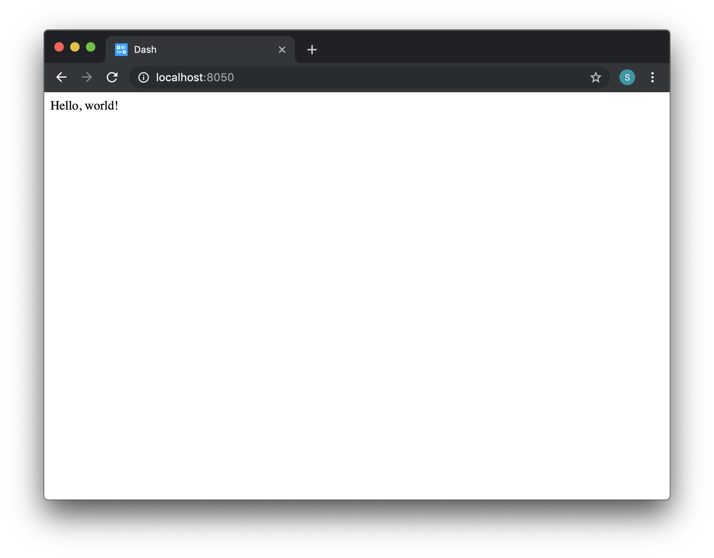

   A simple Dash application. :label:`helloworld`

Interactivity is implemented with callbacks. These allow for reading
the values of inputs in the Dash app (e.g., text inputs, dropdowns,
and sliders), which can subsequently be used to compute the value of
one or more "outputs", i.e., properties of other components in the
app. The function that computes the outputs is wrapped in a decorator
that specifies the aforementioned inputs and outputs; together, they
form a callback. The callback is triggered whenever one of the
specified inputs changes in value.

For instance, the :code:`dash_core_components.Input()` component
controls the :code:`children` property of a
:code:`dash_html_components.Div()` component in the following code.

.. code-block:: python

   import dash
   import dash_html_components as html
   import dash_core_components as dcc

   app = dash.Dash()
   app.layout = html.Div(children=[
	html.Div(id='output-div'),
	dcc.Input(id='text-input')
   ])

   @app.callback(
       dash.dependencies.Output('output-div', 'children'),
       [dash.dependencies.Input('text-input', 'value')]
   )
   def capitalize_user_input(text):
	return text.upper()

   app.run_server()

The output of the code is shown in Fig. :ref:`helloworld2`.

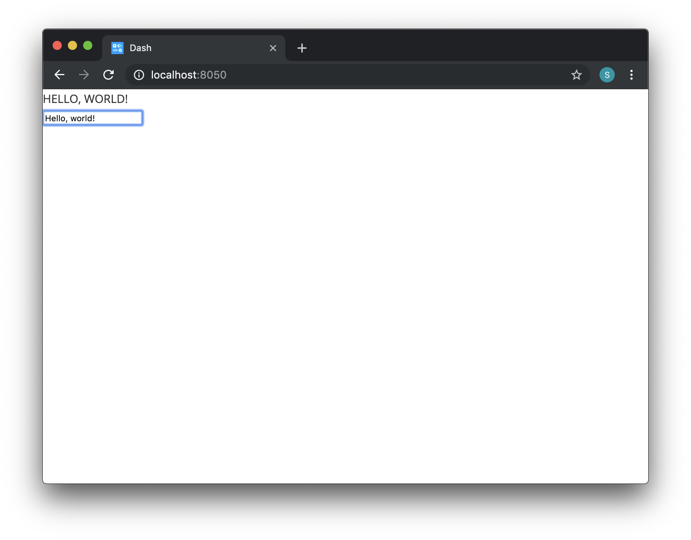

   A simple Dash application that showcases interactivity. Text that
   is entered into the input component is converted to uppercase and
   displayed in the app. :label:`helloworld2`

React.js and Python
===================

Some of the components in the Dash Bio package are wrappers around
pre-existing JavaScript or React libraries. The development process
for JavaScript-based components is fairly straightforward; the only
thing that needs to be added in many cases is an interface for Dash to
access the state of the component and read or write to its
properties. This provides an avenue for interactions with the
components from within a Dash app.

The package also contains three Python-based components: Clustergram,
ManhattanPlot, and VolcanoPlot. Unlike the JavaScript-based
components, the Python-based components are essentially functions that
return JSON data that is in the format of the :code:`figure` argument
for a :code:`dash_core_components.Graph` component.

Dash Bio Components
-------------------

Dash Bio components fall into one of three categories.

* *Custom chart types:* Specialized chart types that allow for intuitive
  visualizations of complex data. This category includes Circos,
  Clustergram, Ideogram, ManhattanPlot, NeedlePlot, and VolcanoPlot.
* *Three-dimensional visualization tools:* Structural diagrams of
  biomolecules that support a wide variety of user interactions and
  specifications. This category includes Molecule3dViewer and Speck.
* *Sequence analysis tools:* Interactive and searchable genomic and
  proteomic sequences, with additional features such as multiple
  sequence alignment. This category include AlignmentChart,
  OncoPrint, and SequenceViewer.

The documentation for all of the Dash Bio components, including
example code, can be found at `<https://dash.plot.ly/dash-bio>`_.

Circos
======

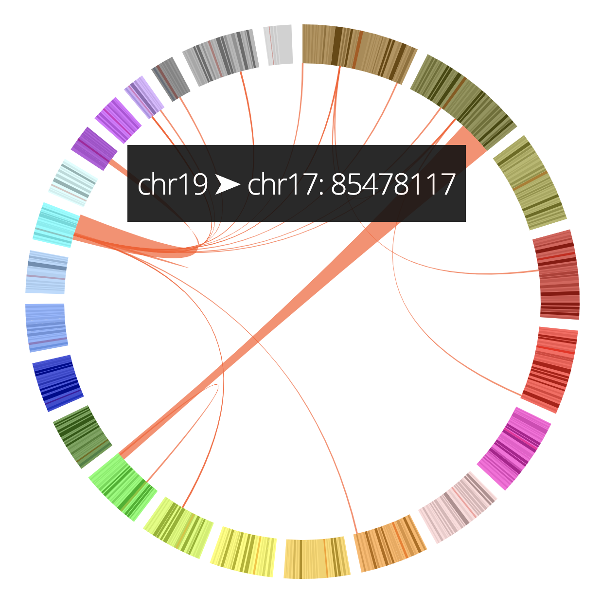

   A simple Dash Bio Circos component with chords connecting pairs of
   data points. Data taken from [Ghr]_ and converted to JSON in the
   :code:`CircosJS` repository [Circos]_. :label:`circos`

Circos is a circular graph. It can be used to highlight relationships
between, for example, different genes by drawing chords that connect
the two (see Fig. :ref:`circos`).

The Dash Bio Circos component is a wrapper of the :code:`CircosJS`
[Circos]_ library, which supports additional graph types like
heatmaps, scatter plots, histograms, and stacked charts. Input data to
Circos take the form of a dictionary, and are supplied to the
:code:`layout` parameter of the component. Additional data, such as a
list of chords, are specified in the :code:`tracks`
parameter. Multiple tracks can be plotted on the same Circos
graph. Hover data and click data on all Circos graph types are
captured and are available to Dash apps.

Clustergram
===========

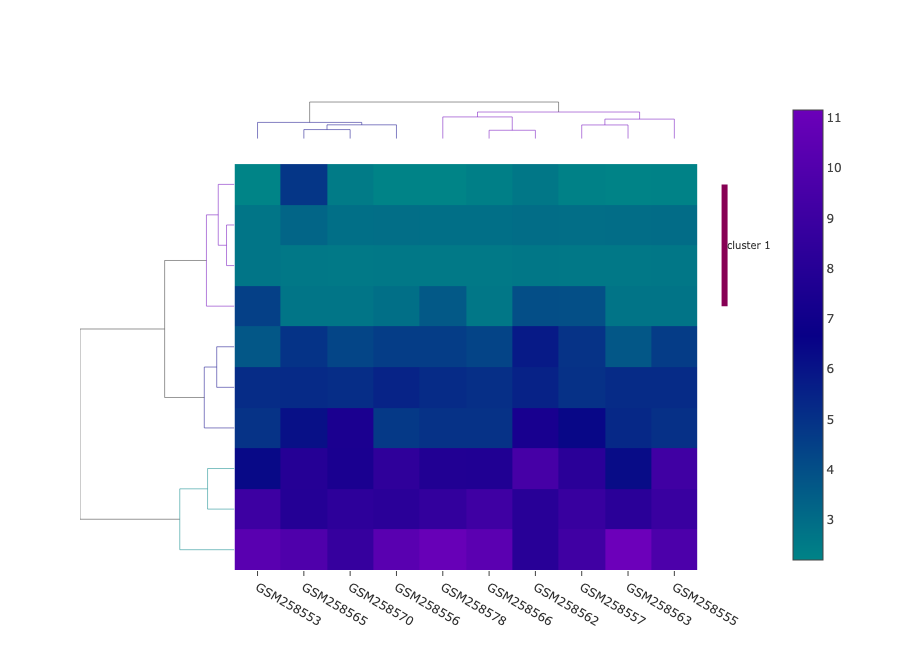

   A Dash Bio clustergram component displaying hierarchical clustering
   of gene expression data from two lung cancer subtypes. A cluster
   from the row dendrogram (displayed to the left of the heatmap) is
   annotated. Data taken from [KR09]_. :label:`clustergram`

A clustergram is a combination heatmap-dendrogram that is commonly used
in gene expression data. The hierarchical clustering that is
represented by the dendrograms can be used to identify groups of genes
with related expression levels.

The Dash Bio Clustergram component is a Python-based component that
uses plotly.py to generate a figure. It takes as input a
two-dimensional numpy array of floating-point values. Imputation of
missing data and computation of hierarchical clustering both occur
within the component itself. Clusters that meet or exceed a
user-defined threshold of similarity comprise single traces in the
corresponding dendrogram, and can be highlighted with annotations (see
Fig. :ref:`clustergram`).

The user can specify additional parameters to customize the metrics
and methods used to compute parts of the clustering, such as the
pairwise distance between observations and the linkage matrix. Hover
data and click data are accessible from within the Dash app for the
heatmap and both dendrograms that are shown in
Fig. :ref:`clustergram`.

Ideogram
========

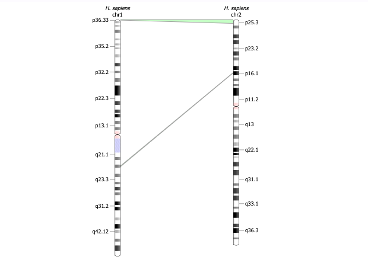

   A Dash Bio ideogram component demonstrating the homology feature
   with two human chromosomes. Data taken from the :code:`ideogram.js`
   repository [Ideo]_. :label:`ideo`

An ideogram is a schematic representation of genomic data. Chromosomes
are represented as strands, and the locations of specific genes are
denoted by bands on the chromosomes.

The Dash Bio Ideogram component is built on top of the
:code:`ideogram.js` library [Ideo]_, and includes features like
annotations, histograms, and homology (see
Fig. :ref:`ideo`). Annotations can be made to different segments of
each chromosome and displayed in the form of bands, and relationships
between different chromosomes can be highlighted by using the homology
feature to connect a region on one chromosome to a region on another
(see Fig. :ref:`ideo`). Upon hovering over an annotated part of the
chromosome, the annotation data is readable from within a Dash
app. Additionally, information from the the "brush" feature, which
allows the user to highlight a subset of the chromosome, is accessible
from within the Dash application. This information includes the
starting position and ending position of the brush, as well as the
length (in base pairs) of the selection made with the brush.

Manhattan Plot
==============

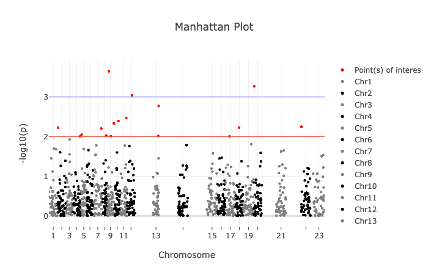

   A Dash Bio ManhattanPlot component. The threshold level is denoted
   by the red line; all points of interest are colored red. The purple
   line is the suggestive line. Data taken from the
   :code:`manhattanly` repository [Man]_. :label:`manhattan`

A Manhattan plot is a plot commonly used in genome-wide association
studies; it can highlight specific nucleotides that, when changed to a
different nucleotide, are associated with certain genetic conditions.

The Dash Bio ManhattanPlot component is built with plotly.py. Input
data take the form of a pandas dataframe. The two lines on the plot
(see Fig. :ref:`manhattan`) represent, respectively, the threshold
level and the suggestive line. [#]_ The y-values of these lines can be
controlled by the user. Hover data and click data are accessible from
within the Dash app.

.. [#] Information about the meaning of these two lines can be found
       in [ER15]_.

Needle Plot
===========

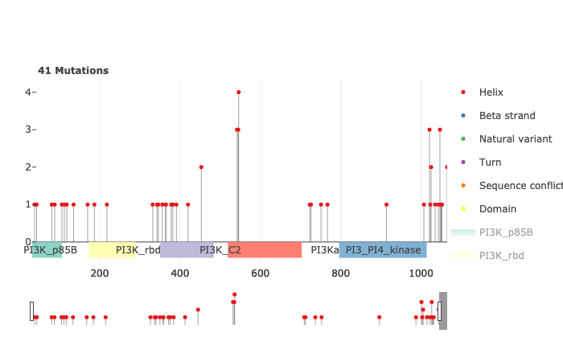

   A Dash Bio NeedlePlot component that shows the properties of
   mutations in a genomic strand. Data taken from the
   :code:`muts-needle-plot` repository [Muts]_. :label:`needle`

A needle plot is a bar plot in which each bar has been replaced with a
marker at the top and a line from the x-axis to the aforementioned
marker. Its primary use-case is visualization of dense datasets that
would appear too crowded to be interpreted effectively when
represented with a bar plot. In bioinformatics, a needle plot may be
used to annotate the positions on a genome at which genetic mutations
happen (see Fig. :ref:`needle`).

The Dash Bio NeedlePlot component was built using plotly.js. It
receives input data as a dictionary. Different colors and marker
styles can be used to distinguish different types of mutations, and
the domains of specific genes can be demarcated on the plot.

Volcano Plot
============

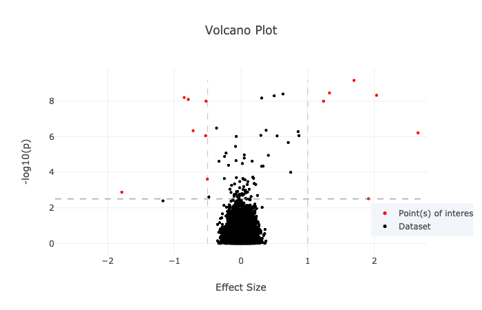

   A Dash Bio VolcanoPlot component. Points of interest are colored in
   red, and the effect size and statistical significance thresholds
   are represented by dashed lines. Data taken from the
   :code:`manhattanly` repository [Man]_. :label:`volcano`

A volcano plot is a plot used to concurrently display the statistical
significance and a defined "effect size" (e.g., the fold change [#]_)
of a dataset. This type of plot is incredibly useful when visualizing
a large number of data points that represent replicate data; it
facilitates identification of data that simultaneously have
statistical significance and a large effect.

.. [#] This refers to the ratio of a measurement to its preceding
       measurement.

The Dash Bio VolcanoPlot component was built using plotly.py. It takes
a pandas dataframe as input data. Lines that represent the threshold
for effect size (both positive and negative) and a threshold for
statistical significance can be defined by the user (see
Fig. :ref:`volcano`). Hover data and click data are accessible from
within the Dash app.

Molecule 3D Viewer
==================

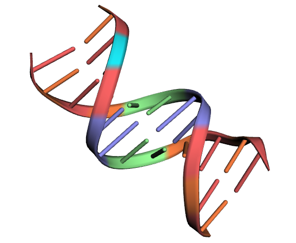

   A Dash Bio Molecule3DViewer component displaying the ribbon
   structure of a section of DNA. A selected residue is highlighted in
   cyan. Structural data taken from the Protein Data Bank
   [1bna]_. :label:`mol3d`

The Dash Bio Molecule3dViewer component was built on top of the
:code:`molecule-3d-for-react` [Mol3D]_ library. Its purpose is to
display molecular structures.  These types of visualizations can show
the shapes of proteins and provide insight into the way that they bind
to other molecules. This renders them invaluable when communicating
the mechanics of biomolecular processes.

Molecule3dViewer receives input data as a dictionary which specifies
the layout and style of each atom in the molecule. It can render
molecules in a variety of styles, such as ribbon diagrams, and allows
for mouse-click selection of specific atoms or residues (see
Fig. :ref:`mol3d`) that can be read from or written to within a Dash
app.

Speck
=====

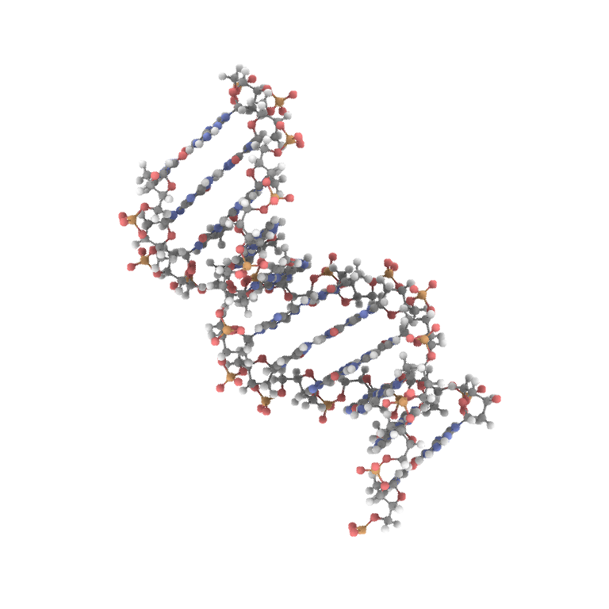

   A Dash Bio Speck component displaying the atomic structure of a
   strand of DNA in a ball-and-stick representation. Ambient occlusion
   is used to provide realistic shading on the atoms. Structural data
   taken from the :code:`Speck` repository [Speck]_. :label:`speck`

The Dash Bio Speck component is a WebGL-based 3D renderer that is
built on top of :code:`Speck` [Speck]_. It uses techniques like ambient
occlusion and outlines to provide a rich view of molecular structures
(see Fig. :ref:`speck`).

The Dash Bio Speck component receives input data as a dictionary that
contains, for each atom, the atomic symbol and the position in space
(given as x, y, and z coordinates). Parameters related to the
rendering of the molecule, such as the atom sizes, levels of ambient
occlusion, and outlines, can optionally be specified in another
dictionary supplied as an argument.

Alignment Chart
=======================

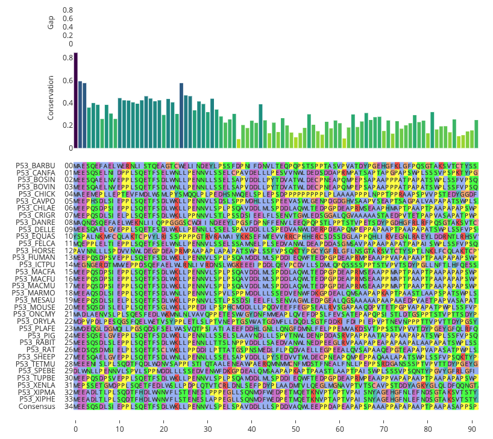

   A Dash Bio AlignmentChart component displaying the P53 protein's
   amino acid sequences from different organisms. A conservation
   barplot is displayed on top, and the bottom row of the heatmap
   contains the consensus sequence. Data taken from UniProt
   [UniP]_. :label:`alignment`

An alignment chart is a tool for viewing multiple sequence
alignment. Multiple related sequences of nucleotides or amino acids
(e.g., the amino acid sequences of proteins from different organisms
that appear to serve the same function) are displayed in the chart to
show their similarities.

The Dash Bio AlignmentChart component is built on top of
:code:`react-alignment-viewer` [Align]_. It takes a FASTA file as
input and computes the alignment. It can optionally display a barplot
that represents the level of conservation of a particular amino acid
or nucleotide across each sequence defined in the input file (see
Fig. :ref:`alignment`). Hover data and click data are accessible from
within the Dash app.

Onco Print
==========

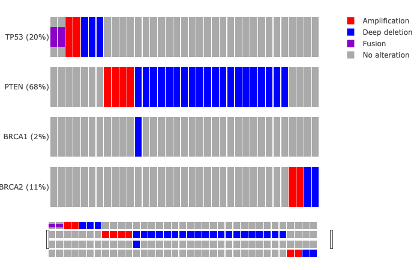

   A Dash Bio OncoPrint component that shows mutation events for the
   genomic sequences that encode different proteins. Data taken from cBioPortal [cBio]_ [cBio2]_. :label:`onco`

An OncoPrint graph is a type of heatmap that facilitates the
visualization of multiple genomic alteration events (see
Fig. :ref:`onco`).

The Dash Bio OncoPrint component is built on top of
:code:`react-oncoprint` [Onco]_. Input data for the component takes
the form of a list of dictionaries that each define a sample, gene,
alteration, and mutation type. Hover data and click data are
accessible from within the Dash app.

Sequence Viewer
===============

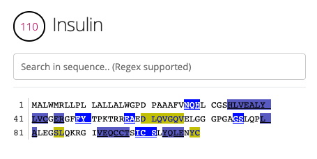

   A Dash Bio SequenceViewer component that is showing the amino acid
   sequence for insulin. A coverage has been applied to the sequence
   to emphasize subsequences of amino acids that form certain
   structures, like alpha helices or beta sheets. Data taken from
   NeXtProt [nXP]_. :label:`seqv`

The Dash Bio SequenceViewer component is a simple tool that allows for
annotating genomic or proteomic sequences. It is based on the
:code:`react-sequence-viewer` library [SeqV]_.

It includes a search function that allows the user to search the
sequence using regular expressions. In addition, the sequence can be
annotated using a selection defined by a starting point, an end point,
and a color, or a coverage that can encode additional information that
is revealed once a subsequence is clicked. The selection and coverage
are available for reading from and writing to in the Dash app, and the
mouse selection and search results are also accessible.

File Parsers
------------

The :code:`dash-bio-utils` package was developed in tandem with the
:code:`dash-bio` package. It contains parsers for common filetypes used in
bioinformatics analyses. The parsers in the package translate the data
encoded in those files to inputs that are compatible with Dash Bio
components.

FASTA data
===========

FASTA files are commonly used to represent one or more genomic or
proteomic sequences. Each sequence may be preceded by a line starting
with the :code:`>` character which contains information about the
sequence, such as the name of the gene or organism; this is the
description of the sequence. Sections of the description are separated
with pipes (:code:`|`).

The :code:`protein_reader` file in the :code:`dash-bio-utils` package
accepts a file path to, or a string representation of, a FASTA file,
and returns a dictionary that contains the sequence and any metadata
that are specified in the file. :code:`SeqIO` from the
:code:`Biopython` [BioP]_ package was used to extract all of the
sequences from the file into a list of dictionaries, each of which
contained the sequence description and the sequence itself, both in
string format.

Different databases (e.g., neXtProt, GenBank, and SWISS-PROT) encode
the sequence description metadata in different ways. The database from
which a FASTA file is retrieved is specified in the first line. In the
:code:`protein_reader` file, the code for the database is translated
into the information that is encoded in the first line for that
particular database. [NCBI]_

From there, string splitting (or, if necessary, regex) is used on the
description line of the file to generate a dictionary of the sequence
metadata.

This parser enables quick access to all of the information contained
in a FASTA file, which in turn can make the information more
human-readable. This is a feature that supplements the ease-of-use of
the :code:`dash-bio` package.

For instance, in the code snippet below, the parser is used on a
string with the contents of a FASTA file for the albumin protein
[nXP]_:

.. code-block:: python

   >>> from dash_bio_utils import protein_reader as pr
   >>> fasta_string = \
   '''>nxp|NX_P02768-1|ALB|Serum albumin|Iso 1

   MKWVTFISLLFLFSSAYSRGVFRRDAHKSEVAHRFKDLGEENFKALVLIAF
   AQYLQQCPFEDHVKLVNEVTEFAKTCVADESAENCDKSLHTLFGDKLCTVA
   TLRETYGEMADCCAKQEPERNECFLQHKDDNPNLPRLVRPEVDVMCTAFHD
   NEETFLKKYLYEIARRHPYFYAPELLFFAKRYKAAFTECCQAADKAACLLP
   KLDELRDEGKASSAKQRLKCASLQKFGERAFKAWAVARLSQRFPKAEFAEV
   SKLVTDLTKVHTECCHGDLLECADDRADLAKYICENQDSISSKLKECCEKP
   LLEKSHCIAEVENDEMPADLPSLAADFVESKDVCKNYAEAKDVFLGMFLYE
   YARRHPDYSVVLLLRLAKTYETTLEKCCAAADPHECYAKVFDEFKPLVEEP
   QNLIKQNCELFEQLGEYKFQNALLVRYTKKVPQVSTPTLVEVSRNLGKVGS
   KCCKHPEAKRMPCAEDYLSVVLNQLCVLHEKTPVSDRVTKCCTESLVNRRP
   CFSALEVDETYVPKEFNAETFTFHADICTLSEKERQIKKQTALVELVKHKP
   KATKEQLKAVMDDFAAFVEKCCKADDKETCFAEEGKKLVAASQAALGL'''
   >>> albumin = pr.read_fasta(
   ...     data_string=fasta_string
   ... )[0]
   >>> albumin['description']
   {'identifier': 'NX_P02768-1',
    'gene name': 'ALB',
    'protein name': 'Serum albumin',
    'isoform name': 'Iso 1'}
   >>> albumin['sequence'][:10]
   'MKWVTFISLL'

Gene Expression Data
====================

Gene expression data take the form of two-dimensional arrays that
measure expression levels for sets of genes under varying conditions.

A common format that is used to represent gene expression data is the
SOFT format. These files can be found in large databases such as the
Gene Expression Omnibus (GEO), [GEO]_ which contains gene expression
data from thousands of experiments. SOFT files contain the expression
data, as well as descriptive information pertaining to the specific
genes and conditions that are in the dataset.

The :code:`gene_expression_reader` file in the :code:`dash-bio-utils`
package accepts a path to, or a string representation of, a SOFT file
or TSV file containing gene expression data. It can parse the contents
of SOFT and TSV files, and return the numerical data and
metadata that they contain. In addition, selection of a subset of
the data (given by lists of selected rows and selected columns
supplied to the parser) can be returned.

The :code:`GEOparse` package [GEOP]_ was used to extract the numeric
gene expression data to a :code:`pandas` dataframe, in addition to the
metadata, in SOFT files:

.. code-block:: python

   geo_file = gp.get_GEO(
       filepath=filepath,
       geotype='GDS'
   )
   df = geo_file.table

:code:`pandas` was used to do the same with TSV files:

.. code-block:: python

   df = pd.read_csv(
       filepath, sep='\t'
   )

Both file parsers by default return a tuple comprising the file
metadata, all of the row names, and all of the column names.

If the parameter :code:`return_filtered_data` is set to :code:`True`,
the parameters :code:`rows` and :code:`columns` (lists that contain
the names of, respectively, the selected rows and selected columns)
must be specified. The dataframe :code:`df` is then filtered according
to these selections, and a two-dimensional :code:`numpy` array
containing the filtered data is returned.

In the case of SOFT files, there is additional information about
subsets of the dataset (e.g., the expression data that are recorded
with and without inducing a particular gene). This information becomes
another element in the tuple.

In the code snippet below, the parser is used to extract information
from a dataset related to the miR-221 RNA molecule [miR]_:

.. code-block:: python

   >>> from dash_bio_utils import gene_expression_reader
   >>> data = gene_expression_reader.read_soft_file(
   ...     filepath='GDS5373.soft'
   ... )
   >>> data[0]
   {'title': [
   '''miR-221 expression effect on prostate cancer
    cell line'''
   ],
   'description': [
   '''Analysis of PC-3 prostate cancer cells
      expressing pre-miR-221. miR-221 is frequently
      downregulated in primary prostate cancer.
      Results provide insight into the role of
      miR-221 in the pathogenesis of prostate
      cancer.'''
   ],
   'type': ['Expression profiling by array'],
   'pubmed_id': ['24607843'],
   'platform': ['GPL570'],
   'platform_organism': ['Homo sapiens'],
   'platform_technology_type': ['in situ oligonucleotide'],
   'feature_count': ['54675'],
   'sample_organism': ['Homo sapiens'],
   'sample_type': ['RNA'],
   'channel_count': ['1'],
   'sample_count': ['4'],
   'value_type': ['count'],
   'reference_series': ['GSE45627'],
   'order': ['none'],
   'update_date': ['Nov 03 2014']}
   >>> data[1]
   {'GDS5373_1': {'dataset_id': ['GDS5373'],
		  'description': ['miR-122 expression'],
		  'sample_id': ['GSM1110879,GSM1110880'],
		  'type': ['protocol']},
   'GDS5373_2': {'dataset_id': ['GDS5373'],
		 'description': ['control'],
		 'sample_id': ['GSM1110881,GSM1110882'],
		 'type': ['protocol']}}
   >>> data[2][:10]
   ['1007_s_at', '1053_at', '117_at', '121_at',
    '1255_g_at', '1294_at', '1316_at', '1320_at',
    '1405_i_at', '1431_at']
   >>> data[3]
   ['GSM1110879', 'GSM1110880', 'GSM1110881', 'GSM1110882']
   >>> selected = gene_expression_reader.read_soft_file(
   ...	  filepath='GDS5373.soft',
   ...	  rows=['1255_g_at', '1316_at'],
   ...    columns=['GSM1110879', 'GSM1110881'],
   ...    return_filtered_data=True
   ... )
   >>> selected
   array([[22.7604, 23.0321],
	  [21.416 , 21.0107]])

Molecule Structural Data
========================

The Protein Data Bank (PDB) [PDB]_ is a database of files that
describe macromolecular structural data. All of the files on PDB are
in the PDB format.

In the :code:`dash_bio_utils` package, the :code:`create_data`
function in :code:`pdb_parser` generates a JSON string from the
contents of a specified PDB file. This string contains information
about the atoms and the bonds in the molecular structure.

The PDB format is standardized; properties of each atom such as its
position in space and the chain and residue to which it belongs are
found within specific column indices for each row. [PdbF]_
:code:`pdb_parser` uses this information to parse each line, and
creates a list of dictionaries, each of which contains information
about the aforementioned properties for each atom in the PDB file.

The :code:`parmed` library [Par]_ was used to read the bond
information from the PDB file. Using the bond information from
:code:`parmed`, a list of dictionaries is created; each dictionary
contains the indices of the pair of atoms that form a bond.

In the code snippet below, this parser is used to extract data from a
PDB file that contains structural information for a small section of
DNA: [1bna]_

.. code-block:: python

   >>> import json
   >>> from dash_bio_utils import pdb_parser
   >>> pdb_string = pdb_parser.create_data('1bna.pdb')
   >>> pdb_1bna = json.loads(pdb_string)
   >>> pdb_1bna['atoms'][:3]
   [{'name': "O5'", 'chain': 'A',
   'positions': [18.935, 34.195, 25.617],
   'residue_index': 1, 'element': 'O',
   'residue_name': 'DC1', 'serial': 0},
   {'name': "C5'", 'chain': 'A',
   'positions': [19.13, 33.921, 24.219],
   'residue_index': 1, 'element': 'C',
   'residue_name': 'DC1', 'serial': 1},
   {'name': "C4'", 'chain': 'A',
   'positions': [19.961, 32.668, 24.1],
   'residue_index': 1, 'element': 'C',
   'residue_name': 'DC1', 'serial': 2}]
   >>> pdb_1bna['bonds'][:3]
   [{'atom2_index': 0, 'atom1_index': 1},
   {'atom2_index': 1, 'atom1_index': 2},
   {'atom2_index': 2, 'atom1_index': 3}]

Comparisons with Existing Tools
---------------------------------

GenomeDiagram
=============

The GenomeDiagram package [Geno]_ provides a way to visualize
comparative genomics data in a circular format (see
Fig. :ref:`genomediagram`); supported chart types include line charts,
bar graphs, and heatmaps.

GenomeDiagram can additionally export high-quality vector diagrams of
the charts that are generated, which can in turn be used in research
papers. It can be used in conjunction with the BioPython module to
interface with GenBank.

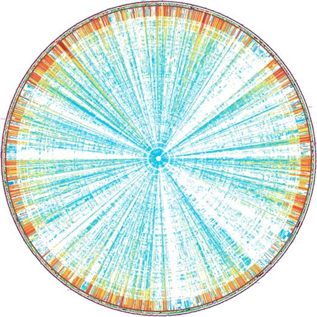

   An example of a circular diagram that can be generated with
   GenomeDiagram. Source: [Geno]_ :label:`genomediagram`

GenomeDiagram shares many similarities with the `Circos`_ component;
both are circular representations of genomic data, and both support
multiple "tracks", or traces, of multiple chart types. The key
difference between the two, and the advantage of Dash Circos, is
flexibility and interactivity; Dash Circos supports click and hover
interactions, and GenomeDiagram does not.

Furthermore, Dash Circos can be interactively modified with respect to
the data that are displayed, as well as the appearance of the graph
itself. This allows for the implementation of many useful functions,
such as cross-filtering. Instead of needing to re-create the image
every time a change is made, updates to the Circos component are
reflected immediately within a Dash app.

Plotly.py
=========

Plotly's Python plotting library has been used to create charts that
are visually similar to those that are used to display certain types
of bioinformatics data [JCViz]_. For instance, a sequence alignment
viewer can be created with a Plotly heatmap (see Fig. :ref:`plotlyalignment`).

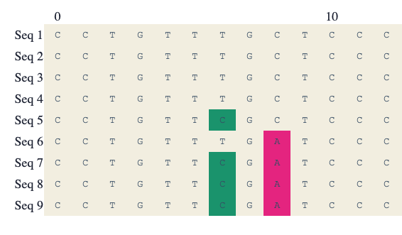

   Part of a multiple sequence alignment displayed as a Plotly
   heatmap. Source: [JCViz]_ :label:`plotlyalignment`

The Dash Bio AlignmentViewer component applies a similar approach; the
React.js component uses a plotly.js heatmap to display the
alignment. However, the API of AlignmentViewer differs from that of
the Plotly.py heatmap. The latter requires the user to define
properties of the graph that don't have anything to do with the
alignment itself. Annotations must be specified, as well as a custom
heatmap colorscale in which the values correspond to bases and not
percentiles of a dataset. It also requires pre-processing of the FASTA
data, and translation into a format that can be fit into the
parameters of a Plotly heatmap.

In contrast, AlignmentViewer includes support for information that is
specific to multiple sequence alignment. The gap and conservation, for
instance, can be optionally included as barplots; the method of
conservation can also be changed, and the consensus sequence can be
displayed on the chart. Data in the form of FASTA files can be used as
input to the component without any further processing required. This
allows for the programmer to more easily interact with the component,
as it removes the need to restructure data to fit a specific format
for visualization.

Limitations and Future Directions
---------------------------------

File Formats
============

Currently, the :code:`dash_bio_utils` package only supports specific
data file formats (namely, PDB, FASTA, and SOFT). Additionally, most
of the components require JSON data as input; this file format is not
typically provided in datasets or studies. Future developments to the
package should therefore include processing for other important file
formats, such as SAM/BAM/BAI for sequence alignment, or Genbank files
(.gb).

Conclusion
----------

The Dash Bio component suite facilitates visualization of common types
of datasets that are collected and analyzed in the field of
bioinformatics. It remains consistent with the declarative nature of
Plotly's Dash, and permits users to create interactive and responsive
web applications that can be integrated with other Dash
components. The :code:`dash-bio-utils` package additionally converts
files from some of the most prominent bioinformatics databases into
familiar Python data types such as dictionaries. When used in
conjunction with the :code:`dash-bio` package, this enables
bioinformaticians to quickly and concisely communicate information
among one another, and to the rest of the scientific community.

References
----------

.. [Mol3D] Autodesk. *Molecule 3D for React*. URL:
	     `<https://github.com/plotly/molecule-3d-for-react>`_
.. [PDB] Berman, H.M., Westbrook, J., Feng, Z., Gilliland, G., Bhat,
	 T.N., Weissig, H., Shindyalov, I.N., Bourne, P.E.. (2000) *The
	 Protein Data Bank*. Nucleic Acids Research, 28: 235-242.
	 URL:`<https://www.rcsb.org>`_ DOI: 10.1093/nar/28.1.235.
.. [Man] Bhatnagar, Samir. *manhattanly*. URL:
	 `<https://github.com/sahirbhatnagar/manhattanly>`_
.. [cBio] Cerami, E., Gao, J., Dogrusoz, U., Gross, B. E.,
	  Sumer, S. O., Aksoy, B. A., Jacobsen, A., Byrne, C. J.,
	  Heuer, M. L., Larsson, E., Antipin, Y., Reva, B.,
	  Goldberg, A. P., Sander, C., Schultz, N..*The cBio Cancer
	  Genomics Portal: An Open Platform for Exploring
	  Multidimensional Cancer Genomics Data*. Cancer Discov May 1
	  2012 (2) (5) 401-404; DOI: 10.1158/2159-8290.CD-12-0095.
.. [BioP] Cock, P. J. A., Antao, T., Chang, J. T., Chapman, B. A.,
	  Cox, C. J., Dalke, A., Friedberg, I., Hamelryck, T., Kauff,
	  F., Wilczynski, B., de Hoon, M. J. L.. *Biopython: freely
	  available Python tools for computational molecular biology
	  and bioinformatics*. Bioinformatics 25 (11), 1422–1423
	  (2009). DOI: 10.1093/bioinformatics/btp163.
.. [1bna] PDB ID: 1BNA. Drew, H.R., Wing, R.M., Takano, T., Broka, C.,
	  Tanaka, S., Itakura, K., Dickerson, R.E.. *Structure of a
	  B-DNA dodecamer: conformation and dynamics.*. (1981)
	  Proc.Natl.Acad.Sci.USA 78: 2179-2183. DOI:
	  10.1073/pnas.78.4.2179.
.. [GEO] Edgar, R., Domrachev, M., Lash, A.E.. *Gene Expression
	 Omnibus: NCBI gene expression and hybridization array data
	 repository*. Nucleic Acids Res. 2002 Jan 1;30(1):207-10. DOI:
	 10.1093/nar/30.1.207.
.. [SeqV] FlyBase. *react-sequence-viewer*. URL:
   `<https://github.com/FlyBase/react-sequence-viewer>`_
.. [Ghr] Genome Reference Consortium. *Genome Reference Consortium
	 Human Build 37 (GRCh37)* (2009). URL:
	 `<https://www.ncbi.nlm.nih.gov/assembly/GCF_000001405.13/>`_
.. [cBio2] Gao, J., Aksoy, B. A., Dogrusoz, U., Dresdner, G., Gross,
	   B., Sumer, S. O., Sun, Y., Jacobsen, A.,
	   Sinha, R. *Integrative Analysis of Complex Cancer Genomics
	   and Clinical Profiles Using the cBioPortal*. Science
	   Signaling Apr 2 2013. DOI: 10.1126/scisignal.2004088.
.. [Circos] Girault, N.. *circosJS: d3 library to build circular
	    graphs*. URL: `<https://github.com/nicgirault/circosJS>`_
.. [GEOP] Gumienny, R.. *GEOparse*. URL:
	  `<https://github.com/guma44/GEOparse>`_
.. [JCViz] johnchase. *Visualizing bioinformatics data with
	   plot.ly*. URL:`<https://plot.ly/~johnchase/22/visualizing-bioinformatics-data-with-plo/>`_
.. [miR] Kneitz, B., Krebs, M., Kalogirou, C., Schubert, M., et
	 al. *Survival in patients with high-risk prostate cancer is
	 predicted by miR-221, which regulates proliferation,
	 apoptosis, and invasion of prostate cancer cells by
	 inhibiting IRF2 and SOCS3*. Cancer Res 2014 May
	 1;74(9):2591-603. PMID: 24607843. DOI:
	 10.1158/0008-5472.CAN-13-1606.
.. [KR09] Kuner, R., Muley, T., Meister, M., Ruschhaupt, M. et
	  al. *Global gene expression analysis reveals specific
	  patterns of cell junctions in non-small cell lung cancer
	  subtypes.* Lung Cancer 2009
	  Jan;63(1):32-8. PMID: 18486272. DOI:
	  10.1016/j.lungcan.2008.03.033.
.. [NCBI] The NCBI C++ Toolkit (https://ncbi.github.io/cxx-toolkit/)
	  by the National Center for Biotechnology Information,
	  U.S. *Fasta Sequence ID Format*. National Library of
	  Medicine; Bethesda MD, 20894 USA.
.. [nXP] NeXtprot. *ALB - Serum albumin - proteomics*. URL:
	 `<https://www.nextprot.org/entry/NX_P02768/proteomics>`_
.. [Dash] Plotly. *Introducing Dash*. (2017) URL:
	  `<https://medium.com/@plotlygraphs/introducing-dash-5ecf7191b503>`_
.. [Align] Plotly. *React Alignment Viewer*. URL:
	   `<https://github.com/plotly/react-alignment-viewer>`_
.. [Onco] Plotly. *React OncoPrint*. URL:
	  `<https://github.com/plotly/react-oncoprint>`_
.. [Geno] Pritchard, L., White, J. A., Birch, P. R. J.,
	  Toth, I. K. *GenomeDiagram: a python package for the
	  visualization of large-scale genomic data*. Bioinformatics,
	  Volume 22, Issue 5, 1 March 2006, Pages 616–617. DOI:
	  10.1093/bioinformatics/btk021
.. [ER15] Reed, E., Nunez, S., Kulp, D., Qian, J., Reilly, M. P., and
	  Foulkes, A. S. (2015) *A guide to genome‐wide association
	  analysis and post‐analytic interrogation.* Statist. Med.,
	  34: 3769– 3792. DOI: 10.1002/sim.6605.
.. [Muts] Schroeder, M.. *Mutations Needle Plot
	  (muts-needle-plot)*. URL:
	  `<https://github.com/bbglab/muts-needle-plot>`_
.. [Par] Swails, J.. *ParmEd*. URL:
	 `<https://github.com/ParmEd/ParmEd>`_
.. [Speck] Terrell, R.. *Speck*. URL:
	   `<https://github.com/wwwtyro/speck>`_
.. [UniP] The UniProt Consortium. *UniProt: a worldwide hub of protein
	  knowledge*. Nucleic Acids Res. 47: D506-515 (2019). DOI:
	  10.1093/nar/gky1049.
.. [Ideo] Weitz, E.. *ideogram: Chromosome visualization with
	  JavaScript*. URL: `<https://github.com/eweitz/ideogram>`_
.. [PdbF] wwwPDB. *Protein Data Bank Contents Guide: Atomic Coordinate
	  Entry Format Description Version 3.30* (2008). 185-197.
