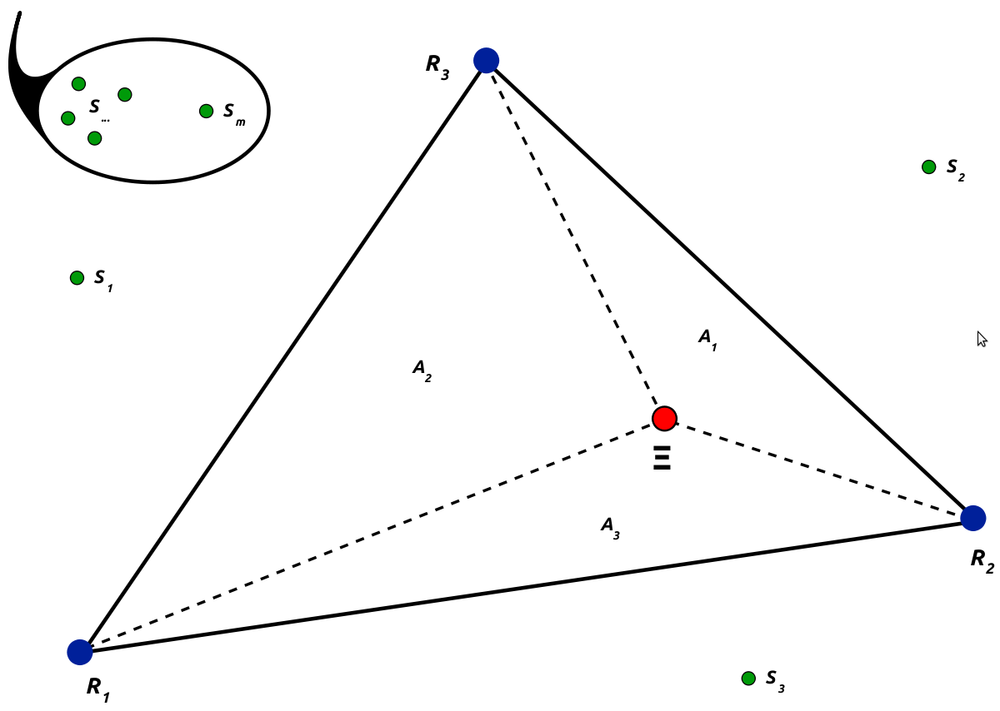
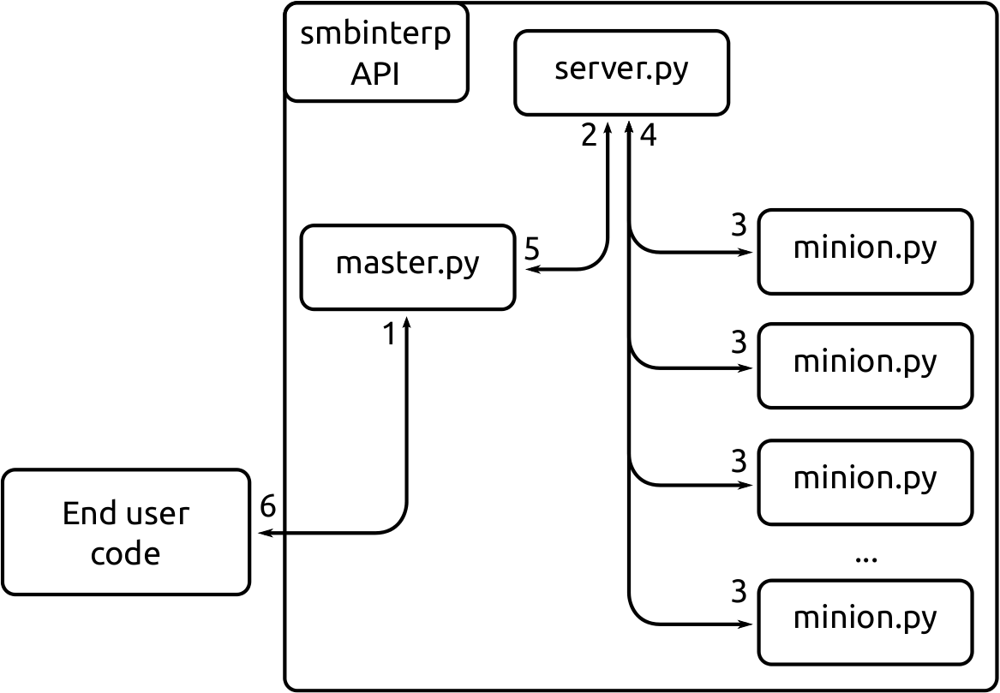
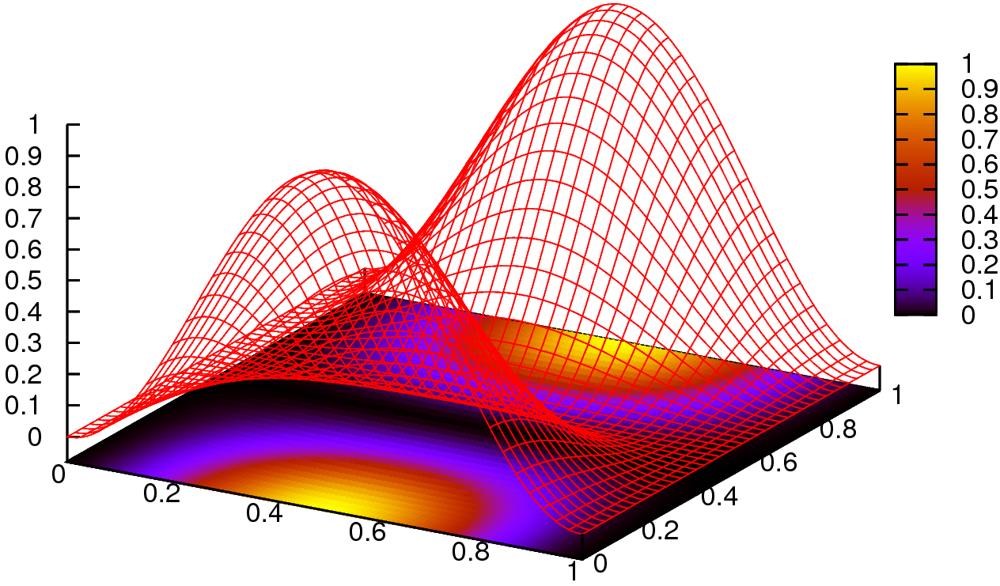
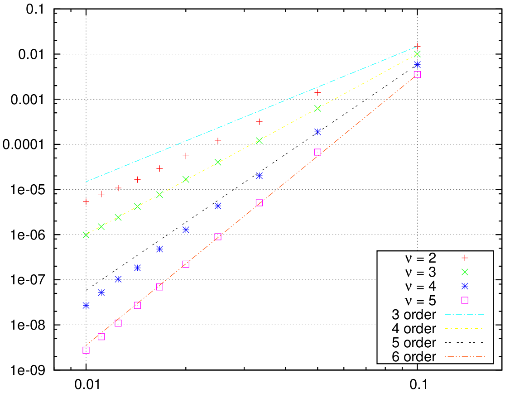
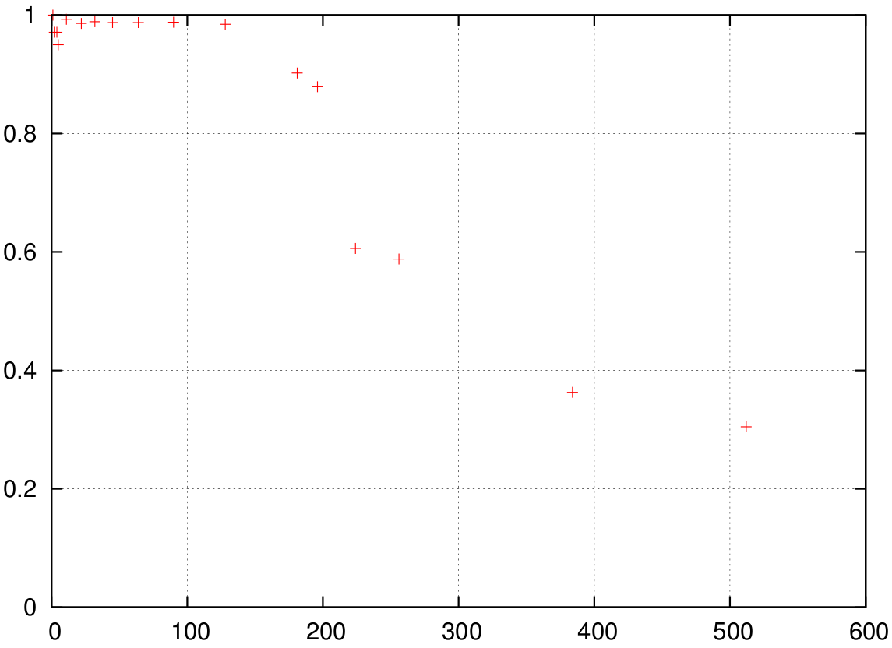

:author: Stephen M. McQuay
:email: stephen@mcquay.me
:institution: Brigham Young University

:author: Steven E. Gorrell
:email: sgorrell@byu.edu
:institution: Brigham Young University

------------------------------------------------------
N-th-order Accurate, Distributed Interpolation Library
------------------------------------------------------

.. class:: abstract

    The research contained herein yielded an open source interpolation library
    implemented in and designed for use with the Python programming language. This
    library, named smbinterp, yields an interpolation to an arbitrary degree of
    accuracy. The smbinterp module was designed to be mesh agnostic. A plugin
    system was implemented that allows end users to conveniently and consistently
    present their numerical results to the library for rapid prototyping and
    integration. The smbinterp was designed with parallel computing environments in
    mind. The library includes modules that allow for its use in high-performance
    parallel computing environments. These modules were implemented using built-in
    Python modules to simplify deployment. This implementation was found to scale
    linearly to approximately 180 participating compute processes.

.. class:: keywords

  n-th-order accurate general interpolation, distributed calculation schemes,
  multiphysics simulation

Introduction and Background
---------------------------

As engineers attempt to find numeric solutions to large physical problems,
simulations involving multiple physical models or phenomena, known as
multiphysics simulations, must be employed. This type of simulation often
involves the coupling of disparate computer codes. When modeling physically
different phenomena the numeric models used to find solutions to these problems
employ meshes of varying topology and density in their implementation. For
example, the unstructured/structured mesh interfaces seen in the
combustor/turbo machinery interface [Sha01]_, or the coupling of
Reynolds-Averaged Navier-Stokes and Large Eddy Simulation (RANS/LES) CFD codes
in Computational Fluid Dynamics (CFD) [Med06]_. A similar situation with
disparate meshes arises in the analysis of helicopter blade wake and vortex
interactions, as for example when using the compressible flow code SUmb and the
incompressible flow code CDP [Hah06]_. When this is the case, and the mesh
elements do not align, the engineer must perform interpolation from the
upstream code to the downstream code.

Frameworks exist that perform interpolation for multiphysics simulations. In
general, frameworks of this variety try to solve two problems. First, the
framework should rapidly calculate the interpolation. Secondly, the
interpolation should be accurate.

CHIMPS (*Coupler for High-performance Integrated Multi-Physics Simulations*) is
a Fortran API (with Python bindings) that implements an efficient Distributed
Alternating Digital Tree for rapid distributed data lookup [Alo06]_ [Hah09]_.
By default, CHIMPS can only provide the user with linear (second-order
accurate) interpolations. While CHIMPS can provide third-order and higher
accurate interpolations, it is not automatic; higher-order interpolations are
only performed if the engineer supplies the CHIMPS API with higher-order terms.
If this information is unavailable, then CHIMPS can only yield linear
interpolations.

Another interpolation framework exists that can perform automatic higher-order
interpolation. AVUSINTERP [Gal06]_ (*Air Vehicles Unstructured/Structured
Interpolation Tool*) is a tool that provides linear and quadratic
interpolations requiring only the physical values at points in a donor mesh,
i.e. no a priori knowledge of higher-order terms. While this framework
implements a superior interpolation scheme to the tri-linear interpolation
found in CHIMPS, AVUSINTERP was not implemented in a parallel fashion, nor does
it allow for the engineer to arbitrarily choose the order of the interpolation
past third-order accuracy.

The research presented herein describes the development of a library that is a
union of the best parts of the aforementioned tools. Namely, this research
provides a library, named smbinterp, that implements the interpolation of a
physical value from a collection of donor points to a destination point and
performs this interpolation to an arbitrary degree of accuracy. The library can
perform this interpolation in both two- and three-dimensional space. Also, the
library was designed and implemented to be used in a high-performance parallel
computing environment. smbinterp is implemented as a python module that builds
upon the numpy and scipy libraries and presents an API for use in multiphysics
simulation integration.

Method
------

The numerical method implemented in smbinterp was first proposed by Baker
[Bak03]_. This interpolation method comprises the adjustment of a linear
interpolation by a least squares estimate of higher-order terms. The Baker
interpolation of the physical value of interest (denoted :math:`q`) to the
point :math:`\Xi` is defined by:

.. math::
  :label: qbaker

  q(\Xi) = q_{linear}(\Xi) + f(\Xi),

where :math:`q_{linear}` is the linear interpolation, and :math:`f(\Xi)` is an
estimation of the higher-order error terms. The following explanation is
specific to two-dimensional space; three-dimensional space is treated in
[McQ11]_.

The participating geometry required to implement this method in two spatial
dimensions is shown in figure :ref:`simplex2d`. The blue points (:math:`R`) and
green points (:math:`S`) represent points in a source mesh, and the red point
:math:`\Xi` is the point to which an interpolation is desired. :math:`\triangle
R` represents a simplex that surrounds the destination point :math:`\Xi`, and
:math:`S_{1..m}` is a collection of extra points surrounding the simplex
:math:`R`. The triangles :math:`A_1-A_3` represent the areas formed by
:math:`\Xi` and :math:`\triangle R`.

   Planar Simplex used in Baker’s Interpolation Scheme :label:`simplex2d`

Barycentric coordinates , denoted :math:`\phi_j(\Xi)`, are used to perform the
linear interpolation. In geometric terms, the barycentric coordinates of a
point in a simplex are the values of the normalized areas :math:`A_j/A_{total}`
opposite the vertex :math:`R_j` in the simplex :math:`\triangle R`.

The barycentric coordinates define the influence that each point in the simplex
:math:`\triangle R` contributes to the linear interpolation. In other words,
the ratio of :math:`A_j/A_{total}` represents the influence from :math:`0 \le
\phi \le 1` that :math:`q(R_j)` has over the linear interpolant. If :math:`\Xi
= R_j`, the value of :math:`q_{linear}(\Xi)` should then be influenced entirely
by the known value of :math:`q(R_j)`. If :math:`\Xi` is placed in such a way as
to give :math:`\frac{A_1}{A_{total}} = \frac{A_2}{A_{total}} =
\frac{A_3}{A_{total}}`, the value :math:`q(R_j)` at each point :math:`R_j`
contributes equally to the calculated value of :math:`q_{linear}(\Xi)`.

The linear interpolant, which requires the simplex :math:`\triangle R` and
:math:`\Xi` as inputs, is defined as

.. math::
  :label: qlinear

  q_{linear}(\triangle R, \Xi) =
     \sum_{j = 1}^{N+1}{q(R_j)} \phi_j(\Xi),

where :math:`N+1` is the number of points in a simplex (3 in two-dimensional
space, and 4 in three-dimensional space). The values of the basis functions
:math:`\phi_j(\Xi)` is the only unknown in equation :ref:`qlinear`.

To solve for :math:`\phi_j(\Xi)` a system of linear equations will be defined
involving the points in the simplex :math:`R_j`, :math:`\Xi`, and equation
:ref:`qlinear`. If :math:`q(\Xi)` is a constant, :math:`q_1 = q_2 = q_3 =
q_{linear} = q_{constant}`, and equation :ref:`qlinear` can be modified by
dividing by :math:`q_{constant}`, that is:

.. math::
   :label: phi1

   \phi_1 + \phi_2 +  \phi_3 = 1.

Furthermore, the basis functions must be calculated so that equation
:ref:`qlinear` also interpolates geometric location of the point :math:`\Xi`,
hence

.. raw:: latex

    \begin{align}
      {R_1}_x \phi_1(\Xi) + {R_2}_x \phi_2(\Xi) + {R_3}_x \phi_3(\Xi) \label{phi2} &= \Xi_x \\
      {R_1}_y \phi_1(\Xi) + {R_2}_y \phi_2(\Xi) + {R_3}_y \phi_3(\Xi) \label{phi3} &= \Xi_y .
    \end{align}

The values of the basis functions :math:`\phi_j(\Xi)` can be found by solving
the following system of linear equations involving equations :ref:`phi1`,
:ref:`phi2` and :ref:`phi3`:

.. math::
   :label: lin2d

   \begin{bmatrix}
    1         &   1         &   1        \\
    {R_1}_x   &   {R_2}_x   &   {R_3}_x  \\
    {R_1}_y   &   {R_2}_y   &   {R_3}_y  \\
   \end{bmatrix}
   \begin{bmatrix}
    \phi_1(\Xi) \\
    \phi_2(\Xi) \\
    \phi_3(\Xi) \\
   \end{bmatrix}
   =
   \begin{bmatrix}
     1     \\
     \Xi_x \\
     \Xi_y \\
   \end{bmatrix},

which yields the values for :math:`\phi_j(\Xi)`, providing a solution for
equation :ref:`qlinear`.

At this point the first of two unknowns in equation :ref:`qbaker` have been
solved, however the least squares approximation of error terms :math:`f(\Xi)`
remains unknown. If :math:`q(\Xi)` is evaluated at any of the points
:math:`R_j` in the simplex, then :math:`q(R_j)` is exact, and there is no need
for an error adjustment at :math:`R_j`, hence :math:`f(\Xi) = 0`. Similarly, if
:math:`q(\Xi)` is being evaluated along any of the opposite edges to
:math:`R_\iota` of the simplex :math:`\triangle R`, the error term should have
no influence from :math:`\phi_\iota(\Xi)`, as :math:`A_\iota = 0`. This
condition is satisfied when expressing the error terms using the linear basis
functions as

.. math::
   :label: qerror

   f(\Xi)
    = a \phi_1(\Xi) \phi_2(\Xi)
    + b \phi_2(\Xi) \phi_3(\Xi)
    + c \phi_3(\Xi) \phi_1(\Xi).

In equation :ref:`qerror` the three double products of basis functions are the
set of distinct products of basis functions that are quadratic in the two
spatial dimensions :math:`x` and :math:`y`, and zero when evaluated at each of
the verticies in :math:`\triangle R`. This term represents a third-order
accurate approximation for the error up to and including the quadratic terms.
This equation introduces three unknowns whose values must be solved, namely
:math:`a,b,` and :math:`c`.

Recall that :math:`S_k, k=1,2,\ldots,m` is the set of :math:`m` points
surrounding :math:`\Xi` that are not in the simplex :math:`R_j`. A least
squares system of equations is defined using the values of the basis functions
at these points, the values of a linear extrapolation for each of those points
using the simplex :math:`\triangle R`, and the values of :math:`a,b`, and
:math:`c` in equation :ref:`qerror`. Define :math:`A` as :math:`(a,b,c)^T`.
Applying least squares theory :math:`a`, :math:`b`, and :math:`c` are found by
inverting the following :math:`3 \times 3` matrix:

.. math::
  :label: leastsquares

   B^T A = B^T w.

The matrix :math:`B` is defined using the identical basis function pattern as
in equation :ref:`qerror`. Denote :math:`\phi_j(S_k)` as the value of
:math:`\phi_j` evaluated using equation :ref:`qlinear` and the data point
:math:`S_k` (in lieu of :math:`\Xi`). The matrix :math:`B` in equation
:ref:`leastsquares` is thus defined:

.. math::
  :label: B

  B =
  \begin{bmatrix}
    \phi_1(S_1) \phi_2(S_1)  & \phi_2(S_1) \phi_3(S_1)  & \phi_1(S_1) \phi_3(S_1) \\
    \phi_1(S_2) \phi_2(S_2)  & \phi_2(S_2) \phi_3(S_2)  & \phi_1(S_2) \phi_3(S_2) \\
    \vdots                   & \vdots                   & \vdots                   \\
    \phi_1(S_m) \phi_2(S_m)  & \phi_2(S_m) \phi_3(S_m)  & \phi_1(S_m) \phi_3(S_m)
  \end{bmatrix}.

The value of :math:`q(S_k)` is known a priori (values of :math:`q` at each
point :math:`S_k` in the donor mesh). The value of  :math:`q_{linear}(S_k)`
(the linear extrapolant) can also be calculated using equation :ref:`qlinear`.
Define :math:`w` in equation :ref:`leastsquares` as

.. math::
   :label: w

   w =
   \begin{bmatrix}
     q(S_1) - q_{linear}(\triangle R, S_1) \\
     q(S_2) - q_{linear}(\triangle R, S_3) \\
     \vdots \\
     q(S_m) - q_{linear}(\triangle R, S_m)
   \end{bmatrix}.

Equation :ref:`leastsquares` is populated with the information from each of the
surrounding points in :math:`S_k`, then the unknown :math:`A` can be
calculated. Knowing :math:`A`, equation :ref:`qerror` is evaluated for
:math:`f(\Xi)`. Subsequently the previously calculated value of
:math:`q_{linear}(\Xi)` and the recently calculated value of :math:`f(\Xi)` are
used to solve equation :ref:`qbaker` for :math:`q(\Xi)`.

The interpolation function in smbinterp dynamically constructs the numpy arrays
required to solve equations :ref:`qlinear` and :ref:`qerror` from the input
geometry (simplex :math:`\triangle R`, extra points :math:`S_k`, and the
destination point :math:`\Xi`) and then calculates the solution to the linear
systems using numpy.linalg.solve. However, while solutions to the linear system
in equation :ref:`qlinear` are well-behaved, certain vertex configurations can
lead to a singular system of equations in equation :ref:`qerror`. These
pathological vertex configurations occur when more than :math:`m-2` of the
extra points lie on one extended edge of the simplex :math:`\triangle R`
[Bak03]. If this occurs, the covariance matrix :math:`B^TB` will be singular,
the solution will not be unique, and the error approximation will not generally
aid in improving the interpolation.

In the current implementation the default behavior of smbinterp is as follows:
the LinAlgError exception raised by the attempted solve of a singular system is
caught and a solution is found via the pseudo inverse, using numpy.linalg.pinv.
However, this behavior is configurable, and the end user may choose to either
simply discards the higher-order terms and return only the linear interpolation
or alternatively require that a LinAlgError is thrown when a pathological
vertex configuration is encountered.

Extension of this method into three dimensions is non-trivial, and is explained
in depth in [McQ11]_. A pattern exists to define any error approximation
function :math:`f(\Xi)` and covariance matrix :math:`B^TB` parametrized by
order of approximation and dimension. Define :math:`\nu` as the desired order
of accuracy less one (i.e. for cubic interpolation :math:`\nu` is 3). As
defined above, :math:`N` is the spatial degree. The pattern for the
combinations of basis functions that are used to define :math:`f(\Xi)` is
collection of :math:`\nu`-th ordered combinations of :math:`N+1` basis
functions :math:`\phi_j` that are unique and non-duplicate, triplicate, etc.
The following code implements this pattern:

.. code-block:: python
   :linenos:

    from itertools import product

    @memoize
    def pattern(simplex_size, nu):
      r = []
      for i in product(xrange(simplex_size),
                                    repeat = nu):
        if len(set(i)) !=1:
          r.append(tuple(sorted(i)))
      unique_r = list(set(r))
      return unique_r

The dynamic calculation of the basis function pattern in this fashion is
powerful, in that it can be calculated for any arbitrary :math:`\nu`, and for
any spatial dimension (although only :math:`N` of 2 and 3 are dealt with
herein). However, for each point :math:`\Xi` the calculation of the pattern
must be performed once for the calculation of :math:`f(\Xi)` and once per extra
point :math:`S_k` participating in the current interpolation for each row in
the :math:`B` matrix. There is only one valid pattern per set of inputs
:math:`N` and :math:`\nu`, which must both remain constant throughout a single
interpolation. The calculation of the pattern is a computationally intensive
operation, and so a caching mechanism has been implemented in smbinterp that
only calculates the pattern if it has not been previously calculated. This
concept is known as memoization, and is implemented using the following
function wrapper:

.. code-block:: python
   :linenos:

    from functools import wraps

    def memoize(f):
      cache = {}
      @wraps(f)
      def memf(simplex_size, nu):
        x = (simplex_size, nu)
        if x not in cache:
          cache[x] = f(simplex_size, nu)
        return cache[x]
      return memf

.. asdf

Baker's method gives a reasonable interpolation solution for a general cloud of
points. However, the method suggested by Baker for the vertex selection
algorithm for the terms :math:`\triangle R` and :math:`S_k` consists of simply
selecting the points nearest :math:`\Xi`. While this is the most general point
selection algorithm, it can lead to the aforementioned pathological vertex
configurations. This configuration is prevalent when the source mesh is
composed of a regular grid of verticies, and must be addressed if the method is
to yield a good interpolation.

Furthermore a mesh may have been designed to capture the gradient information,
and therefore the mesh topology should be respected. Simply selecting the
closest points to :math:`\Xi` would yield inferior results. By selecting the
more topologically (according to the mesh) adjacent points the information
intended to be captured in the mesh's design will be preserved.

A plugin architecture was implemented in smbinterp which yields the requisite
flexibility needed to avoid the pathological grid configurations and gives the
engineers  complete control over the point selection algorithms. The base class
for all grid objects that desire to use the interpolation methods is defined as
follows:

.. code-block:: python
   :linenos:

    class grid(object):
      def __init__(self, verts, q):
        self.verts = np.array(verts)
        self.tree = KDTree(self.verts)

        self.q = np.array(q)

        self.cells = {}
        self.cells_for_vert = defaultdict(list)

      def get_containing_simplex(self, Xi):
        # ...
        return simplex

      def get_simplex_and_nearest_points(self,
                             Xi, extra_points = 3):
        # ...
        return simplex, extra_points

The cells and cells_for_verts data structures are used when searching for a
containing simplex. The structures are populated with connectivity information
before a round of interpolations. The method employed in the default
implementation for the location of the containing simplex in an upstream mesh
is straight forward: first the spatial tree structure is used to find the
location of the nearest vertex to the point of interest, then the cells are
recursively visited in topologically adjacent order and tested for inclusion of
the point :math:`\Xi`.

The selection of the extra points :math:`S_k` is also implemented in the base
grid class. The default algorithm simply queries the kdtree structure for
:math:`(N+1) + m` points and discards the points that are already in the
simplex :math:`\triangle R`.

Plugins are defined as classes that inherit from the base grid object, and that
implement the requisite functionality to populate the cells and cells_for_vert
data structures. If either of the default simplex and vertex selection methods
do not provide the desired functionality they could be overridden in the
derived class to provide a more tuned :math:`\triangle R` and :math:`S_k`
selection algorithms. This gives engineers complete control over point
selection and makes the interpolation library mesh agnostic.

    Flowchart of the Parallelization Architecture :label:`pflowchart`

A parallel mechanism for calculating :math:`q(\Xi)` was implemented in
smbinterp. As is illustrated in figure :ref:`pflowchart`, a stream of requested
interpolations are presented to a queuing mechanism that then distributes the
task of calculating the interpolations to a set of minions.

The server.py application implements the four queues required to implement this
method: a queue for tasks to be performed, a queue for results, and two queues
for orchestrating the control of a round of interpolations between a master and
a set of minions. Masters and minions authenticate and connect to these four
queues to accomplish the tasks shown in the flowchart in figure
:ref:`pflowchart`. The master.py script is responsible for orchestrating the
submission of interpolations and events associated with starting and stopping a
set of interpolations. Each of the minions has access to the entire domain and
are responsible for performing the interpolations requested by the end user.

The crux of the solution lies in providing the minions with a steady stream of
work, and a pipeline into which the resultant interpolations can be returned.
The mechanism developed in smbinterp uses built-in Python modules to minimize
the deployment expense. The multiprocessing module provides a manager class
which facilitates the access of general objects to authenticated participants
over a network. The built-in Queue objects, which implement a multi-producer,
multi-consumer first-in-first-out queue, are presented to the minions and
masters using the functionality in the manager class.

Results and Discussion of Results
---------------------------------

The root mean square (RMS) of the errors was used to determine the accuracy of
the smbinterp module. A continuous function whose values varied smoothly in the
test domain was required to calculate the error; the following equation was
used:

.. math::
  :label: eqexact

  q(x,y)= \left(
            \sin \left(x \pi \right)
            \cos \left(y \pi \right)
          \right)^2.

A plot of this function is found in figure :ref:`exactplot`. Each error
:math:`\epsilon_i` was calculated as the difference between the actual value
(from equation :ref:`eqexact`)  and calculated interpolations (at each point in
the destination domain using smbinterp), or :math:`\epsilon_i(\Xi) =
q_{exact}(\Xi) - q_{calculated}(\Xi)`.

   Plot of Equation :ref:`eqexact` :label:`exactplot`

A mesh resolution study was performed to determined how the RMS of error varied
with mesh density. The results of this study are show in figure :ref:`rms`.
Figure :ref:`rms` plots the relationship between mesh spacing and RMS of error
of all interpolations in the collection of destination vertexes. The x-axis
represents the spacing between the regular mesh elements. The y-axis was
calculated by performing interpolation from each resolution of mesh to a static
collection of random points. The lines in each plot are representative of the
slope that each collection of data should follow if the underlying numerical
method is truly accurate to the requested degree of accuracy. As an example,
the collection of points for :math:`\nu` of 2 should be third-order accurate,
and should follow a line with slope of 3; this is closely demonstrated in the
plots.

   RMS of Error vs. Mesh Spacing :label:`rms`

Figure :ref:`rms` shows the results of the resolution study for the
two-dimensional test case meshes. The three dimensional test case meshes
yielded similar results and are presented in [McQ11]_. As the meshes were
refined the RMS of error decreased. The fourth- and sixth-order results
(:math:`\nu` of 3 and 5) matched the slope lines almost exactly, whereas the
third- and fifth-order results were slightly lower than expected for that level
of accuracy.

As mesh element size decreased, the RMS of error decreased as well. The RMS of
error for the highest :math:`\nu` decreased more than that of the lowest
:math:`\nu`. The RMS of error of the most coarse mesh (far right) ranges within
a single order of magnitude, whereas the RMS of errors at the most fine spacing
(far left) span four orders of magnitude. The results exhibit a slight banding,
or unevenness between each order. Also, the data very closely matches the
plotted lines of slope, indicating that the order of accuracy is indeed
provided using this numerical method.

The rate at which error decreases as the average mesh element size decreases in
figure :ref:`rms` is indicative of the order of accuracy of the numerical
method implemented in smbinterp. There is slight banding for the
two-dimensional meshes between quadratic and cubic interpolation, and again for
quartic an quintic interpolation. While this indicates that the method does not
perfectly interpolate to those orders of accuracy, in general increasing the
:math:`\nu` parameter of the \smbinterp library provides a more accurate
interpolation. Furthermore, the cases where the points diverge from the slope
of appropriate order, the divergence occurs in a favorable direction (i.e. less
error). Also, the fine meshes experience a more significant decrease in RMS of
error than the coarse  meshes while increasing the order of approximation,
:math:`\nu`. While this is an intuitive result, it emphasizes the notion that
mesh density should be chosen to best match the underlying physical systems and
to provide as accurate of results as possible.

The parallel algorithm employed by \smbinterp was found to scale quasi-linearly
to approximately 180 participating minion.py processes. Speedup is defined as
the ratio of time to execute an algorithm sequentially (:math:`T_1`) divided by
the time to execute the algorithm with :math:`p` processors [WSU]_, or
:math:`S_p = \frac{T_1}{T_p}`. A parallel algorithm is considered to have ideal
speedup if :math:`S_p = p`.

A more meaningful parameter for instrumenting the performance of a parallel
algorithm is known as the efficiency of the algorithm, denoted :math:`E_p`.
Efficiency of a parallel algorithm is defined as the speedup divided by the
number of participating processors, or :math:`E_p = \frac{T_p}{p}`. The
efficiency of an algorithm ranges from 0 to 1, and is shown for \smbinterp in
figure :ref:`efficiency`.

   Efficiency (:math:`E_p`) of the Parallel Algorithm :label:`efficiency`

The parallelization algorithm employed by the \smbinterp library has
near-linear speedup up to approximately 128 participating minions. It has an
efficiency above 90 percent up to 181 participating nodes, but the efficiency
drops substantially when using more minions. If an algorithm does not have an
efficiency of 1, it is usually indicative of communication overhead or
bottlenecks of some form. It was observed that the cpu utilization of the
server.py script increased linearly up to 181 minions (CPU utilization of
200%), but then did not increase past that point. The implementation of the
server.py script represents the bottleneck of this implementation.

Conclusions
-----------

The smbinterp module was developed to provide a high-performance interpolation
library for use in multiphysics simulations. The smbinterp module provides an
interpolation for a cloud of points to an arbitrary order of accuracy. It was
shown, via a mesh resolution study, that the algorithm (and implementation
thereof) provides the the end user with the expected level of accuracy, i.e.
when performing cubic interpolation, the results are fourth-order accurate,
quartic interpolation is fifth-order accurate, etc.

The smbinterp module was designed to be mesh agnostic. A plugin system was
implemented that allows end users to conveniently and consistently present
their numerical results to the library for rapid prototyping and integration.

The smbinterp module was designed with parallel computing environments in mind.
The library includes modules that allow for its use in high-performance
computing environments. These modules were implemented using built-in Python
modules to simplify deployment. This implementation was found to scale linearly
approximately 180 participating compute processes. It is suggested to replace
the queuing mechanism with a more performant queuing library (e.g. ØMQ) and a
more advanced participant partitioning scheme to allow the library to scale
past this point.

Acknowledgments
-----------------

The authors thank Marshall Galbraith for his friendly and crucial assistance
which helped clarify the implementation of the numerical method used herein.
The authors are especially grateful to have performed this research during a
time when information is so freely shared and readily available; they are
indebted to all of the contributors to the Python and Scipy projects. The
authors would also like to acknowledge the engineers in the aerospace group at
Pratt \& Whitney for the contribution of the research topic and for the partial
funding provided at the beginning of this research.

References
----------

.. P. Atreides. *How to catch a sandworm*,
           Transactions on Terraforming, 21(3):261-300, August 2003.

.. [Sha01] S. Shankaran et al.,
           *A Multi-Code-Coupling Interface for Combustor/Turbomachinery Simulations*,
           AIAA Paper 2001-974, 39th AIAA Aerospace Sciences Meeting and Exhibit January 8–11, 2001.

.. [Med06] G. Medic et al.,
           *Integrated RANS/LES computations of turbulent flow through a turbofan jet engine*,
           Center for Turbulence Research Annual Research Briefs, 2006, pp. 275-285.

.. [Hah06] S. Hahn et al.,
           *Coupled High-Fidelity URANS Simulation for Helicopter Applications}*,
           Center for Turbulence Research Annual Research Briefs, 2006, pp 263-274.

.. [Alo06] J. Alonso et al.,
           *CHIMPS: A High-Performance Scalable Module for Multi-Physics Simulations*,
           AIAA Paper 2006-5274, 42nd AIAA/ASME/SAE/ASEE Joint Propulsion Conference & Exhibit, Sacramento, CA, July 2006.

.. [Hah09] S. Hahn et al.,
           *Extension of CHIMPS for unstructured overset simulation and higher-order interpolation*,
           AIAA Paper 2009-3999, 19th AIAA Computational Fluid Dynamics, San Antonio, Texas, June 22-25, 2009 

.. [Gal06] M. Galbraith, J. Miller.
           *Development and Application of a General Interpolation Algorithm*,
           AIAA Paper 2006-3854, 24th AIAA Applied Aerodynamics Conference, San Francisco, California, June 5-8, 2006 

.. [Bak03] Baker, T.
           *Interpolation from a Cloud of Points*,
           in 12th International Meshing Roundtable, Santa Fe, NM, 2003, pp. 55-63.

.. [McQ11] S. M. McQuay,
           *SMBInterp: an Nth-Order Accurate, Distributed Interpolation Library,*
           M.S. thesis, Mech. Eng., Brigham Young University, Provo, UT, 2011.

.. [WSU] http://en.wikipedia.org/wiki/Speedup

.. urls
.. _smbinterp: https://mcquay.me/hg/smbinterp
.. _memoize:   http://en.wikipedia.org/wiki/Memoize
