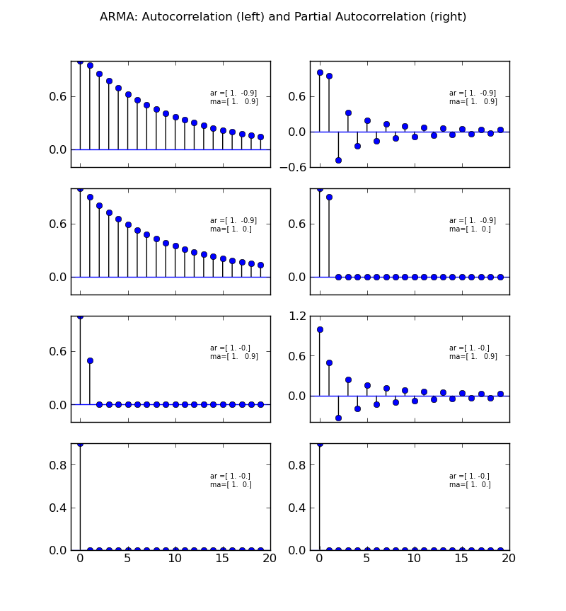
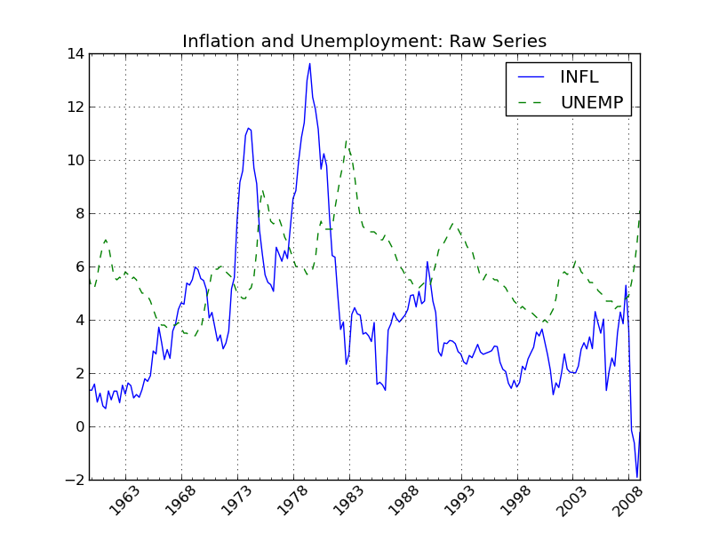
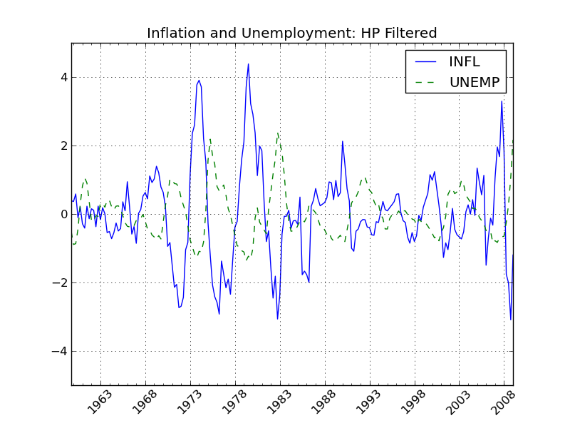
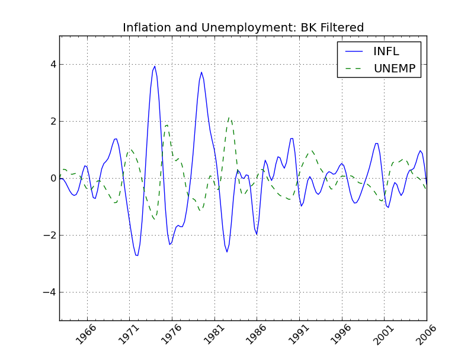
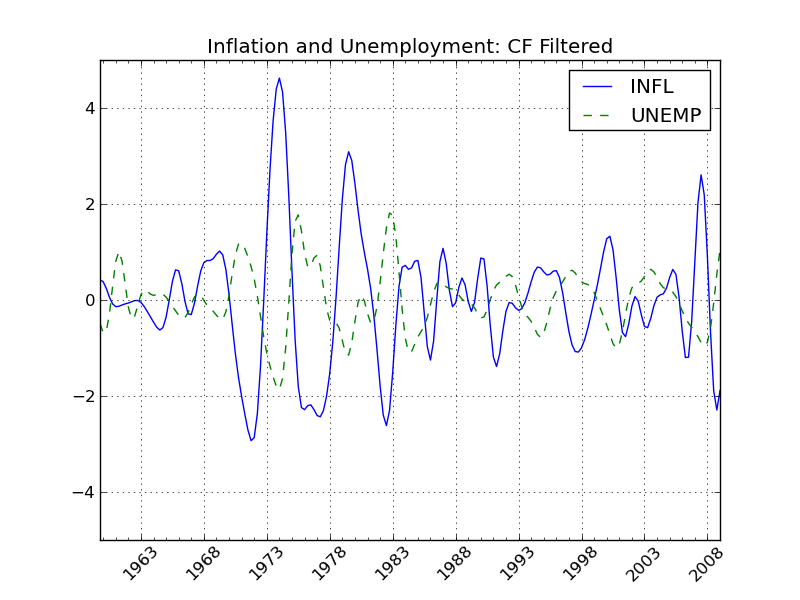
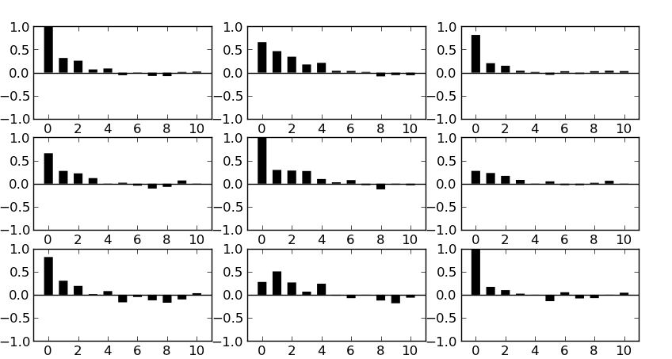
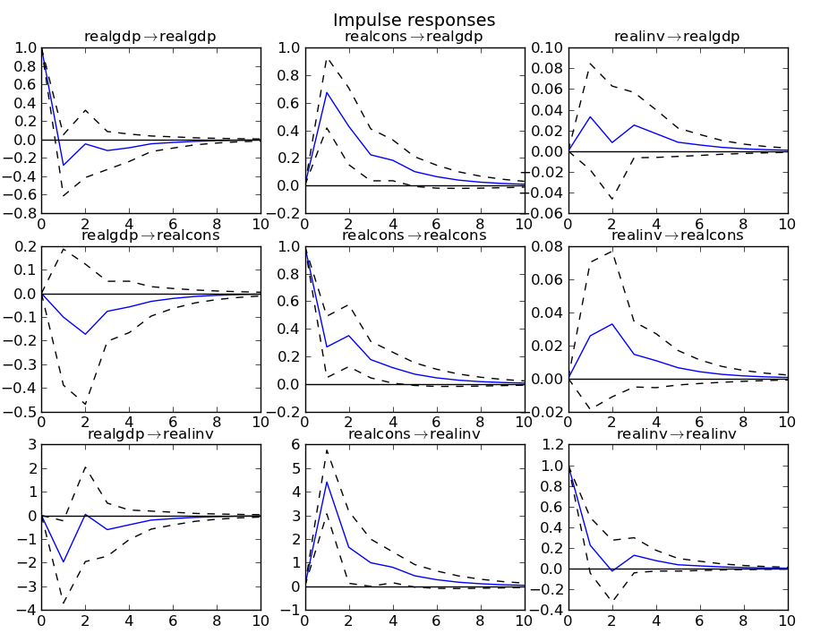
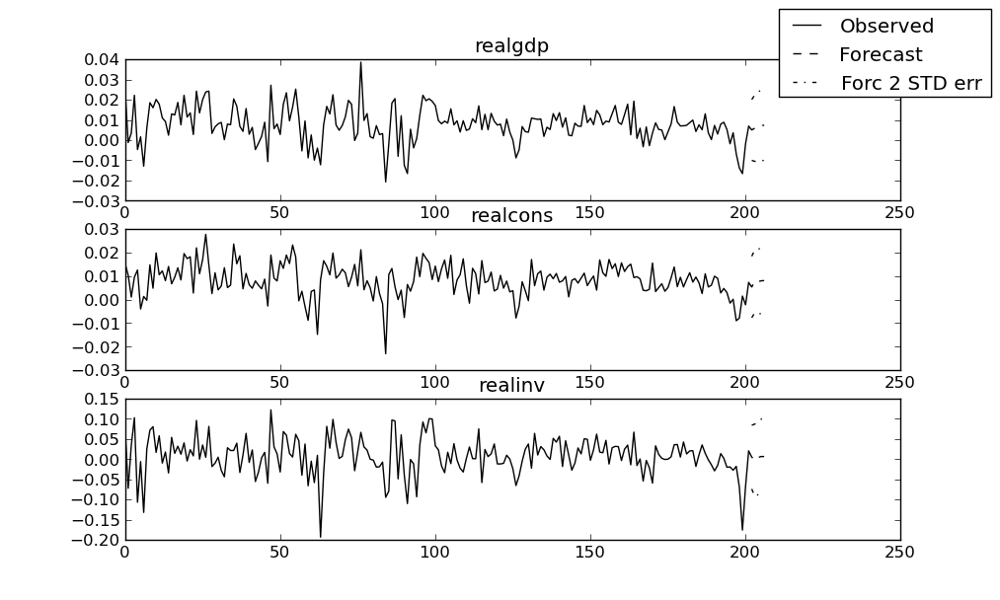
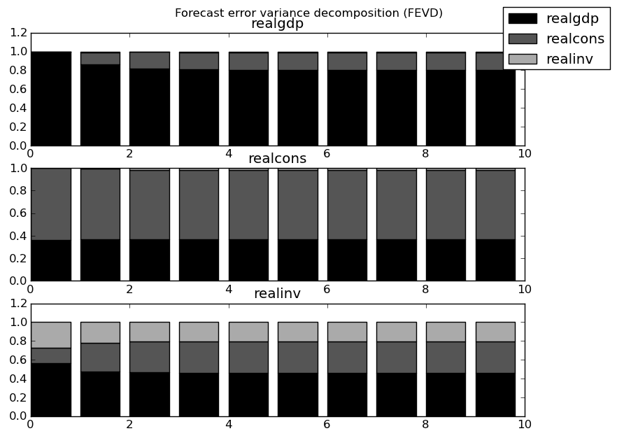

:author: Wes McKinney
:email: wesmckinn@gmail.com
:institution: Duke University

:author: Josef Perktold
:email: josef.pktd@gmail.com
:institution: University of North Carolina, Chapel Hill

:author: Skipper Seabold
:email: js2796a@american.edu
:institution: American University

-----------------------------------------------
Time Series Analysis in Python with statsmodels
-----------------------------------------------

.. class:: abstract

   We introduce the new time series analysis features of scikits.statsmodels.
   This includes descriptive statistics, statistical tests and several linear
   model classes, autoregressive, AR, autoregressive moving-average, ARMA, and
   vector autoregressive models VAR.

.. class:: keywords

   time series analysis, statistics, econometrics, AR, ARMA, VAR, GLSAR,
   filtering, benchmarking

Introduction
------------

Statsmodels is a Python package that provides a complement to SciPy for
statistical computations including descriptive statistics and estimation of
statistical models. Beside the initial models, linear regression, robust linear
models, generalized linear models and models for discrete data, the latest
release of scikits.statsmodels includes some basic tools and models for time
series analysis. This includes descriptive statistics, statistical tests and
several linear model classes: autoregressive, AR, autoregressive moving-average,
ARMA, and vector autoregressive models VAR. In this article we would like to
introduce and provide an overview of the new time series analysis features of
statsmodels.  In the outlook at the end we point to some extensions and new
models that are under development.

*Time series* data comprises observations that are ordered along one dimension,
that is time, which imposes specific stochastic structures on the data. Our
current models assume that observations are continuous, that time is discrete
and equally spaced and that we do not have missing observations. This type of
data is very common in many fields, in economics and finance for example,
national output, labor force, prices, stock market values, sales volumes, just
to name a few.

In the following we briefly discuss some statistical properties of the
estimation with time series data, and then illustrate and summarize what is
currently available in statsmodels.

Ordinary Least Squares (OLS)
----------------------------

The simplest linear model assumes that we observe an endogenous variable
:math:`y` and a set of regressors or explanatory variables :math:`x`, where
:math:`y` and :math:`x` are linked through a simple linear relationship plus a
noise or error term

.. math::

   y_t = x_t \beta + \epsilon_t

In the simplest case, the errors are independently and identically
distributed. Unbiasedness of OLS requires that the regressors and errors be
uncorrelated. If the errors are additionally normally distributed and the
regressors are non-random, then the resulting OLS or maximum likelihood
estimator (MLE) of :math:`\beta` is also normally distributed in small
samples. We obtain the same result, if we consider consider the distributions as
conditional on :math:`x_t` when they are exogenous random variables. So far this
is independent whether t indexes time or any other index of observations.

When we have time series, there are two possible extensions that come
from the intertemporal linkage of observations. In the first case,
past values of the endogenous variable influence the expectation or
distribution of the current endogenous variable, in the second case
the errors :math:`\epsilon_t` are correlated over time. If we have either one
case, we can still use OLS or generalized least squares GLS to get a
consistent estimate of the parameters. If we have both cases at the
same time, then OLS is not consistent anymore, and we need to use a
non-linear estimator. This case is essentially what ARMA does.

Linear Model with autocorrelated error (GLSAR)
~~~~~~~~~~~~~~~~~~~~~~~~~~~~~~~~~~~~~~~~~~~~~~

This model assumes that the explanatory variables, regressors, are
uncorrelated with the error term. But the error term is an
autoregressive process, i.e.

.. math::

   E(x_t, \epsilon_t) = 0

.. math::

   \epsilon_t = a_1 \epsilon_{t-1} + a_2 \epsilon_{t-1} + ... + a_k \epsilon_{t-k}

An example will be presented in the next section.

Linear Model with lagged dependent variables (OLS, AR, VAR)
~~~~~~~~~~~~~~~~~~~~~~~~~~~~~~~~~~~~~~~~~~~~~~~~~~~~~~~~~~~

This group of models assume that past dependent variables, :math:`y_{t-i}`, are
included among the regressors, but that the error term are not serially
correlated

.. math::

   E(\epsilon_t, \epsilon_s) = 0, \text{ for } t \neq s

.. math::

   y_t = a_1 y_{t-1} + a_2 y_{t-1} + ... + a_k y_{t-k} + x_t \beta + \epsilon_t

Dynamic processes like autoregressive processes depend on observations
in the past. This means that we have to decide what to do with the
initial observations in our sample where we do nnt observe any past
values.

The simplest way is to treat the first observation as fixed, and analyse our
sample starting with the *k*-th observation. This leads to conditional
least squares or conditional maximum likelihood estimation. For conditional
least squares we can just use OLS to estimate, adding past `endog` to the
`exog`. The vector autoregressive model (VAR) has the same basic statistical
structure except that we consider now a vector of endogenous variables at each
point in time, and can also be estimated with OLS conditional on the initial
information. (The stochastic structure of VAR is richer, because we now also
need to take into account that there can be contemporaneous correlation of the
errors, i.e. correlation at the same time point but across equations, but still
uncorrelated across time.) The second estimation method that is currently
available in statsmodels is maximum likelihood estimation. Following the same
approach, we can use the likelihood function that is conditional on the first
observations. If the errors are normaly distributed, then this is essentially
equivalent to least squares. However, we can easily extend conditional maximum
likelihood to other models, for example GARCH, linear models with generalized
autoregressive conditional heteroscedasticity, where the variance depends on the
past, or models where the errors follow a non-normal distribution, for example
Student-t distributed which has heavier tails and is sometimes more appropriate
in finance.

The second way to treat the problem of intial conditions is to model them
together with other observations, usually under the assumption that the process
has started far in the past and that the initial observations are distributed
according to the long run, i.e. stationary, distribution of the
observations. This exact maximum likelihood estimator is implemented in
statsmodels for the autoregressive process in statsmodels.tsa.AR, and for
the ARMA process in statsmodels.tsa.ARMA.

Autoregressive Moving average model (ARMA)
~~~~~~~~~~~~~~~~~~~~~~~~~~~~~~~~~~~~~~~~~~

ARMA combines an autoregressive process of the dependent variable with a error
term, moving-average or MA, that includes the present and a linear combination
of past error terms, an ARMA(p,q) is defined as

.. math::

   E(\epsilon_t, \epsilon_s) = 0, \text{ for } t \neq s

.. math::

   y_t = \mu + a_1 y_{t-1} + ... + a_k y_{t-p} +
   \epsilon_t + b_1 \epsilon_{t-1} + ... + b_q \epsilon_{t-q}

As a simplified notation, this is often expressed in terms of lag-polynomials as

.. math::

   \phi (L) y_t = \psi (L) \epsilon_t

where

.. math::

  \phi (L) = 1 - a_1 L^1 - a_2 L^2 - ... - a_k L^p

.. math::

  \psi (L) = 1 + b_1 L^1 + b_2 L^2 + ... + b_k L^q

:math:`L` is the lag or shift operator, :math:`L^i x_t = x_{t-i}, L^0 = 1`. This is the same
process that scipy.lfilter uses. Forecasting with ARMA models has become popular
since the 1970's as Box-Jenkins methodology, since it often showed better
forecast performance than more complex, structural models.

Using OLS to estimate this process, i.e. regressing :math:`y_t` on past
:math:`y_{t-i}`, does not provide a consistent estimator. The process can be
consistently estimated using either conditional least squares, which in this
case is a non-linear estimator, or conditional maximum likelihood or with exact
maximum likelihood. The difference between conditional methods and exact MLE is
the same as described before.  statsmodels provides estimators for both methods
in tsa.ARMA which will be described in more detail below.

Time series analysis is a vast field in econometrics with a large range of models
that extend on the basic linear models with the assumption of normally distributed
errors in many ways, and provides a range of statistical tests to identify an
appropriate model specification or test the underlying assumptions.

Besides estimation of the main linear time series models, statsmodels also provides
a range of descriptive statistics for time series data and associated statistical
tests. We include an overview in the next section before describing AR, ARMA and
VAR in more details. Additional results that facilitate the usage and interpretation of the
estimated models, for example impulse response functions, are also available.

OLS, GLSAR and serial correlation
---------------------------------

Suppose we want to model a simple linear model that links the stock of money
in the economy to real GDP and consumer price index CPI, example in Greene
(2003, ch. 12). We import numpy and statsmodels, load the variables from
the example dataset included in statsmodels, transform the data and fit
the model with OLS:

.. code-block:: python

   import numpy as np
   import scikits.statsmodels.api as sm
   tsa = sm.tsa  # as shorthand

   mdata = sm.datasets.macrodata.load().data
   endog = np.log(mdata['m1'])
   exog = np.column_stack([np.log(mdata['realgdp']),
                           np.log(mdata['cpi'])])
   exog = sm.add_constant(exog, prepend=True)

   res1 = sm.OLS(endog, exog).fit()

``print res1.summary()`` provides the basic overview of the regression results.
We skip it here to safe on space. The Durbin-Watson statistic that is included
in the summary is very low indicating that there is a strong autocorrelation in
the residuals. Plotting the residuals shows a similar strong autocorrelation.

As a more formal test we can calculate the autocorrelation, the Ljung-Box
Q-statistic for the test of zero autocorrelation and the associated p-values:

.. code-block:: python

    acf, ci, Q, pvalue = tsa.acf(res1.resid, nlags=4,
                                 confint=95, qstat=True,
                                 unbiased=True)
    acf
    #array([1., 0.982, 0.948, 0.904, 0.85])
    pvalue
    #array([3.811e-045, 2.892e-084,
            6.949e-120, 2.192e-151])

To see how many autoregressive coefficients might be relevant, we can also look
at the partial autocorrelation coefficients

.. code-block:: python

   tsa.pacf(res1.resid, nlags=4)
   #array([1., 0.982, -0.497, -0.062, -0.227])

Similar regression diagnostics, for example for heteroscedasticity, are
available in `statsmodels.stats.diagnostic`. Details on these
functions and their options can be found in the documentation and docstrings.

The strong autocorrelation indicates that either our model is misspecified or
there is strong autocorrelation in the errors. If we assume that the second
is correct, then we can estimate the model with GLSAR. As an example, let us
assume we consider four lags in the autoregressive error.

.. code-block:: python

   mod2 = sm.GLSAR(endog, exog, rho=4)
   res2 = mod2.iterative_fit()

`iterative_fit` alternates between estimating the autoregressive process of
the error term using tsa.yule_walker, and feasible sm.GLS. Looking at the
estimation results shows two things, the parameter estimates are very
different between OLS and GLS, and the autocorrelation in the residual is
close to a random walk:

.. code-block:: python

   res1.params
   #array([-1.502,  0.43 ,  0.886])
   res2.params
   #array([-0.015,  0.01 ,  0.034])

   mod2.rho
   #array([ 1.009, -0.003,  0.015, -0.028])

This indicates that the short run and long run dynamics might be very different
and that we should consider a richer dynamic model, and that the variables
might not be stationary and that there might be unit roots.

Stationarity, Unit Roots and Cointegration
------------------------------------------

Loosely speaking, stationarity means here that the mean, variance and
intertemporal correlation structure remains constant over time.
Non-stationarities can either come from deterministic changes like trend or
seasonal fluctuations, or the stochastic properties of the process, if for
example the autoregressive process has a unit root, that is one of the roots
of the lag polynomial is on the unit circle. In the first case, we can remove
the deterministic component by detrending or deseasonalization. In the second
case we can take first differences of the process,

.. math:

   dy_t = (1-L)y_t = y_t - y_{t-1}

Differencing is a common approach in the Box-Jenkins methodology and gives rise
to ARIMA, where the I stands for integrated processes, which are made stationary
by differencing. This lead to a large literature in econometrics on unit-root
testing that tries to distinguish deterministic trends from unit roots or
stochastic trends. statsmodels provides the *augmented Dickey-Fuller
test*. Monte Carlo studies have shown that it is often the most powerful of all
unit roots test.

To illustrate the results, we just show two results. Testing the log of the
stock of money with a null hypothesis of unit roots against an alternative
of stationarity around a linear trend, shows an adf-statistic of -1.5
and a p-value of 0.8, so we are far away from rejecting the unit root
hypothesis:

.. code-block:: python

   tsa.adfuller(endog, regression="ct")[:2]
   (-1.561, 0.807)

If we test the differenced series, that is the growth rate of
moneystock, with a Null hypothesis of Random Walk with drift, then we
can strongly reject the hypothesis that the growth rate has a unit
root (p-value 0.0002)

.. code-block:: python

   tsa.adfuller(np.diff(endog), regression="c")[:2]
   (-4.451, 0.00024)

ARMA processes and data
-----------------------

The identification for ARIMA(p,d,q) processes, especially choosing the number
of lagged terms, p and q, to include, remains partially an art. One
recommendation in the Box-Jenkins methodology is to look at the pattern in
the autocorrelation (acf) and partial autocorrelation (pacf) functions

`scikits.statsmodels.tsa.arima_process` contains a class that provides several
properties of ARMA processes and a random process generator.
As an example, `statsmodels/examples/tsa/arma_plots.py` can be used to plot
autocorrelation and partial autocorrelation functions for different ARMA models.

   ACF and PACF for ARMA(p,q) :label:`acfpacf`
   This illustrated that the pacf is zero after p terms for AR(p) processes and
   the acf is zero after q terms for MA(q) processes.

This allows easy comparison of the theoretical properties of an ARMA process
with their empirical counterparts. For example, define the lag coefficients
for an ARMA(2,2) process, generate a random process and compare observed and
theoretical pacf:

.. code-block:: python

   import scikits.statsmodels.tsa.arima_process as tsp
   ar = np.r_[1., -0.5, -0.2]; ma = np.r_[1.,  0.2, -0.2]
   np.random.seed(123)
   x = tsp.arma_generate_sample(ar, ma, 20000, burnin=1000)
   sm.tsa.pacf(x, 5)
   array([1.,  0.675, -0.053,  0.138, -0.018,  0.038])

   ap = tsp.ArmaProcess(ar, ma)
   ap.pacf(5)
   array([1.,  0.666, -0.035,  0.137, -0.034,  0.034])

We can see that they are very close in a large generated sample like this.
`ArmaProcess` defines several additional methods that calculate properties of
ARMA processes and to work with lag-polynomials: `acf`, `acovf`, `ar`,
`ar_roots`, `arcoefs`, `arma2ar`, `arma2ma`, `arpoly`, `from_coeffs`,
`from_estimation`, `generate_sample`, `impulse_response`, `invertroots`,
`isinvertible`, `isstationary`, `ma`, `ma_roots`, `macoefs`, `mapoly`, `nobs`,
`pacf`, `periodogram`. The sandbox has a FFT version of some of this to look at
the frequency domain properties.

ARMA Modeling
-------------

`Statsmodels` provides several helpful routines and models for working
Autoregressive Moving Average (ARMA) time-series models, including simulation and
estimation code. For example, after importing `arima_process` as `ap` from
`scikits.statsmodels.tsa` we can simulate a series [1]_

.. code-block:: python

    >>> ar_coef = [1, .75, -.25]
    >>> ma_coef = [1, -.5]
    >>> nobs = 100
    >>> y = ap.arma_generate_sample(ar_coef,
    ...                             ma_coef, nobs)
    >>> y += 4 # add in constant

We can then estimate an ARMA model of the series

.. code-block:: python

    >>> mod = tsa.ARMA(y)
    >>> res = arma_mod.fit(order=(2,1), trend='c',
    ...                    method='css-mle', disp=-1)
    >>> arma_res.params
    array([ 4.0092, -0.7747,  0.2062, -0.5563])

The estimation method, 'css-mle', indicates that the starting parameters from the
optimization are to be obtained from the conditional sum of squares estimator and
then the exact likelihood is optimized. The exact likelihood is implemented using
the Kalman Filter.

Filtering
---------

We have recently implemented several filters that are commonly used in
economics and finance applications. The three most popular method are the
Hodrick-Prescott, the Baxter-King filter, and the Christiano-Fitzgerald. These
can all be viewed as approximations of the ideal band-pass filter; however,
discussion of the ideal band-pass filter is beyond the scope of this paper. We
will [briefly review the implementation details of each] give an overview of
each of the methods and then present some usage examples.

The Hodrick-Prescott filter was proposed by Hodrick and Prescott [HPres]_, though the
method itself has been in use across the sciences since at least 1876 [Stigler]_. The
idea is to separate a time-series :math:`y_{t}` into a trend :math:`\tau_{t}` and
cyclical compenent :math:`\zeta_{t}`

.. math::

   y_{t} = \tau_{t} + \zeta_{t}

The components are determined by minimizing the following quadratic loss function

.. math::

   \min_{\left\{ \tau_{t}\right\} }\sum_{t}^{T}\zeta_{t}^{2}+\lambda\sum_{t=1}^{T}\left[\left(\tau_{t}-\tau_{t-1}\right)-\left(\tau_{t-1}-\tau_{t-2}\right)\right]^{2}

where :math:`\tau_{t}=y_{t}-\zeta_{t}` and :math:`\lambda` is the weight placed
on the penalty for roughness. Hodrick and Prescott suggest using :math:`\lambda=1600`
for quarterly data. Ravn and Uhlig [RUhlig]_ suggest :math:`\lambda=6.25` and
:math:`\lambda=129600` for annual and monthly data, respectively. While there are
numerous methods for solving the loss function, our implementation uses
`scipy.sparse.linalg.spsolve` to find the solution to the generalized ridge-regression
suggested in Danthine and Girardine [DGirard]_.

Baxter and King [BKing]_ propose an approximate band-pass filter that deals
explicitly with the periodicity of the business cycle. By applying their
band-pass filter to a time-series :math:`y_{t}`, they produce a series :math:`y_{t}^{*}`
that does not contain fluctuations at frequencies higher or lower than those of the
business cycle. Specifically, in the time domain the Baxter-King filter takes the
form of a symmetric moving average

.. math::

   y_{t}^{*}=\sum_{k=-K}^{K}a_{k}y_{t-k}

where :math:`a_{k}=a_{-k}` for symmetry and :math:`\sum_{k=-K}^{K}a_{k}=0` such that
the filter has trend elimination properties. That is, series that contain quadratic
deterministic trends or stochastic processes that are integrated of order 1 or 2 are
rendered stationary by application of the filter. The filter weights :math:`a_{k}`
are given as follows

.. math::

   a_{j} = B_{j}+\theta\text{ for }j=0,\pm1,\pm2,\dots,\pm K

.. math::

   B_{0} = \frac{\left(\omega_{2}-\omega_{1}\right)}{\pi}

.. math::

   B_{j} = \frac{1}{\pi j}\left(\sin\left(\omega_{2}j\right)-\sin\left(\omega_{1}j\right)\right)\text{ for }j=0,\pm1,\pm2,\dots,\pm K

where :math:`\theta` is a normalizing constant such that the weights sum to zero

.. math::

   \theta=\frac{-\sum_{j=-K^{K}b_{j}}}{2K+1}

and

.. math::

   \omega_{1}=\frac{2\pi}{P_{H}}, \omega_{2}=\frac{2\pi}{P_{L}}

with the periodicity of the low and high cut-off frequencies given by :math:`P_{L}`
and :math:`P_{H}`, respectively. Following Burns and Mitchell's [] pioneering work
which suggests that US business cycles last from 1.5 to 8 years, Baxter and King
suggest using :math:`P_{L}=6` and :math:`P_{H}=32` for quarterly data or 1.5 and 8
for annual data. The authors suggest setting the lead-lag length of the filter
:math:`K` to 12 for quarterly data. The transformed series will be truncated on
either end by `K`. Naturally the choice of these parameters depends on the
available sample and the frequency band of interest.

The last filter that we currently provide is that of Christiano and Fitzgerald
[CFitz]_. The Christiano-Fitzgerald filter is again a weighted moving average. However,
their filter is asymmetric about :math:`t` and operates under the (generally false)
assumption that :math:`y_{t}` follows a random walk. This assumption allows their
filter to approximate the ideal filter even if the exact time-series model of
:math:`y_{t}` is not known. The implementation of their filter involves the
calculations of the weights in

.. math::

   y_{t}^{*} = B_{0}y_{t}+B_{1}y_{t+1}+\dots+B_{T-1-t}y_{T-1}+\tilde{B}_{T-t}y_{T}+

.. math::

               B_{1}y_{t-1}+\dots+B_{t-2}y_{2}+\tilde{B}_{t-1}y_{1}

for :math:`t=3,4,...,T-2`, where

.. math::

   B_{j} = \frac{\sin(jb)-\sin(ja)}{\pi j},j\geq1

.. math::

   B_{0} = \frac{b-a}{\pi},a=\frac{2\pi}{P_{u}},b=\frac{2\pi}{P_{L}}

:math:`\tilde{B}_{T-t}` and :math:`\tilde{B}_{t-1}` are linear functions of the
:math:`B_{j}`'s, and the values for :math:`t=1,2,T-1,` and :math:`T` are also
calculated in much the same way. See the authors' paper or our code for the details.
:math:`P_{U}` and :math:`P_{L}` are as described above with the same interpretation.

Moving on to some examples, the below demonstrates the API and resultant
filtered series for each method. We use series for unemployment and inflation
to demonstrate :ref:`raw`. They are traditionally thought to have a negative
relationship at business cycle frequencies.

.. code-block:: python

    >>> from scipy.signal import lfilter
    >>> data = sm.datasets.macrodata.load()
    >>> infl = data.data.infl[1:]
    >>> # get 4 qtr moving average
    >>> infl = lfilter(np.ones(4)/4, 1, infl)[4:]
    >>> unemp = data.data.unemp[1:]

To apply the Hodrick-Prescott filter to the data :ref:`hpfilt`, we can do

.. code-block:: python

    >>> infl_c, infl_t = tsa.filters.hpfilter(infl)
    >>> unemp_c, unemp_t = tsa.filters.hpfilter(unemp)

The Baxter-King filter :ref:`bkfilt` is applied as

.. code-block:: python

    >>> infl_c = tsa.filters.bkfilter(infl)
    >>> unemp_c = tsa.filters.bkfilter(unemp)

The Christiano-Fitzgerald filter is similarly applied :ref:`cffilt`

.. code-block:: python

    >>> infl_c, infl_t = tsa.filters.cfilter(infl)
    >>> unemp_c, unemp_t = tsa.filters.cfilter(unemp)

   Unfiltered Inflation and Unemployment Rates 1959Q4-2009Q1 :label:`raw`

   Unfiltered Inflation and Unemployment Rates 1959Q4-2009Q1 :label:`hpfilt`

   Unfiltered Inflation and Unemployment Rates 1959Q4-2009Q1 :label:`bkfilt`

   Unfiltered Inflation and Unemployment Rates 1959Q4-2009Q1 :label:`cffilt`

Statistical Benchmarking
------------------------

We also provide for another frequent need of those who work with time-series data of
varying observational frequency--that of benchmarking. Benchmarking is a kind of
interpolation that involves creating a high-frequency dataset from a low-frequency one
in a consistent way. The need for benchmarking arises when one has a low-frequency
series that is perhaps annual and is thought to be reliable, and the researcher also
has a higher frequency series that is perhaps quarterly or monthly. A benchmarked series
is a high-frequency series consistent with the benchmark of the low-frequency series.

We have implemented Denton's modified method. Originally proposed by Denton [Denton]_
and improved by Cholette [Cholette]_. To take the example of turning an annual series
into a quarterly one, Denton's method entails finding a benchmarked series
:math:`X_{t}` that solves

.. math::

   \min_{\{X_{t}\}}\sum_{t}^{T}\left(\frac{X_{t}}{I_{t}}-\frac{X_{t-1}}{I_{t-1}}\right)^{2}

subject to

.. math::

   \sum_{t=2}^{T}X_{t}=A_{y}\,\, y=\left\{ 1,\dots,\beta\right\}

That is, the sum of the benchmarked series must equal the annual benchmark in each year.
In the above :math:`A_{y}` is the annual benchmark for year :math:`y`, :math:`I_{t}`
is the high-frequency indicator series, and :math:`\beta` is the last year for which
the annual benchmark is available. If :math:`T>4\beta`, then extrapolation is
performed at the end of the series. To take an example, given the US monthly industrial
production index and quarterly GDP data, from 2009 and 2010, we can construct a
benchmarked monthly GDP series

.. code-block:: python

    >>> iprod_m = np.array([ 87.4510, 86.9878, 85.5359,
                    84.7761, 83.8658, 83.5261, 84.4347,
                    85.2174, 85.7983, 86.0163, 86.2137,
                    86.7197, 87.7492, 87.9129, 88.3915,
                    88.7051, 89.9025, 89.9970, 90.7919,
                    90.9898, 91.2427, 91.1385, 91.4039,
                    92.5646])
    >>> gdp_q = np.array([14049.7, 14034.5, 14114.7,
                  14277.3, 14446.4, 14578.7, 14745.1,
                  14871.4])
    >>> gdp_m = tsa.interp.dentonm(iprod_m, gdp_q,
                                   freq="qm")

.. [1] Notice that the AR coefficients and MA coefficients, both include a 1 for the
       zero lag. Further, the signs on the AR coefficients are reversed versus
       those estimated by `tsa.ARMA` due to the differing conventions of
       `scipy.signal.lfilter`.

Modeling multiple time series: Vector autoregressive (VAR) models
-----------------------------------------------------------------

It is common in finance, economics, and other fields to model relationships
among multiple time series. For example, an economist may wish to understand the
impact of monetary policy on inflation and unemployment. A widely used tool for
analyzing multiple time series is the vector autoregressive (VAR) model. At each
time point we observe a *K*-vector :math:`Y_t` of data points, one for each time
series. These can be modeled similar to an AR process as above

.. math::

   Y_t = A_1 Y_{t-1} + \ldots + A_p Y_{t-p} + \epsilon_t.

In this case, the coefficients :math:`A_i` are square matrices. As with prior
models, the error :math:`\epsilon_t` is typically assumed to be normally
distributed and uncorrelated over time. This model can be estimated by MLE or
equivalently by OLS, either case as a single regression or by noticing that the
model decouples into *K* separate linear regressions, one for each time series.

We have recently written a comprehensive implementation of VAR models on
stationary data following [Lütkepohl]_. In addition to estimation, we are also
interested in

* Analysis of impulse responses (the effect of a unit shock to one variable on
  all of the others)
* Statistical tests: whiteness and normality of residuals, Granger-causality
* Lag order selection: how many lags :math:`Y_{t-i}` to include
* Multi-step forecasting and forecast error variance decomposition

We will illustrate some of the VAR model features on the ``macrodata`` data set
in statsmodels. Here is a code snippet to load the data and fit the model with
two lags of the log-differenced data:

::

    mdata = sm.datasets.macrodata.load().data
    mdata = mdata[['realgdp','realcons','realinv']]
    names = mdata.dtype.names
    data = mdata.view((float,3))
    data = np.diff(np.log(data), axis=0)

    model = VAR(data, names=names)
    res = model.fit(2)

As with most other models in statsmodels, ``res.summary()`` provides a console
output summary of the estimated coefficients and other standard model
diagnostics. The data itself can be visualized by a number of plotting
functions:

::

    >>> res.plot_sample_acorr()

   VAR sample autocorrelation

Impulse responses can be generated and plotted thusly:

::

    >>> irf = res.irf(10) # 10 periods
    >>> irf.plot()

   VAR impulse response functions

*n*-step ahead forecasts can similarly be generated and plotted:

::

    >>> res.plot_forecast(5)

   VAR 5 step ahead forecast

The forecast error variance decomposition can also be computed and plotted like
so

::

    >>> res.fevd().plot()

   VAR Forecast error variance decomposition

Various tests such as testing Granger causality can be carried out using the
results object:

::

    >>> res.test_causality('realinv', 'realcons')
    H_0: ['realcons'] do not Granger-cause realinv
    Conclusion: reject H_0 at 5.00% significance level
    {'conclusion': 'reject',
     'crit_value': 3.0112857238108273,
     'df': (2, 579),
     'pvalue': 3.7842822166888971e-10,
     'signif': 0.05,
     'statistic': 22.528593566083575}

Obviously we are just providing a flavor of some of the features available for
VAR models. The statsmodels documentation has a more comprehensive treatment of
the feature set. We plan to continue implementing other related models for
multiple time series, such as the vector error correction models (VECM) for
analyzing cointegrated (non-stationary) time series data. Other more
sophisticated models in the recent time series literature could also be
implemented within the same framework.

Conclusions
-----------

statsmodels development over the last few years has been focused on building
correct and tested implementations of the standard suite of econometric models
available in other statistical computing environments, such as R. However, there
is still a long road ahead before Python will be on the same level library-wise
with other computing environments focused on statistics and econometrics. We
believe that, given the wealth of powerful scientific computing and interactive
research tools coupled with the excellent Python language, statsmodels can make
Python become a premier environment for doing applied statistics and
econometrics work. Future work will need to integrate all of these tools to
create a smooth and intuitive user experience comparable to industry standard
commercial and open source statistical products.

We have built a foundational set of tools for several ubiquitous classes of time
series models which we hope will go a long way toward meeting the needs of
applied statisticians and econometricians programming in Python.

References
----------

.. [BKing] Baxter, M. and King, R.G. 1999. "Measuring Business Cycles: Approximate
           Band-pass Filters for Economic Time Series." *Review of Economics and
           Statistics*, 81.4, 575-93.

.. [Cholette] Cholette, P.A. 1984. "Adjusting Sub-annual Series to Yearly
              Benchmarks." *Survey Methodology*, 10.1, 35-49.

.. [CFitz] Christiano, L.J. and Fitzgerald, T.J. 2003. "The Band Pass Filter."
           *International Economic Review*, 44.2, 435-65.

.. [DGirard] Danthine, J.P. and Girardin, M. 1989. "Business Cycles in Switzerland:
             A Comparative Study." *European Economic Review* 33.1, 31-50.

.. [Denton] Denton, F.T. 1971. "Adjustment of Monthly or Quarterly Series to
            Annual Totals: An Approach Based on Quadratic Minimization." *Journal of
            the American Statistical Association*, 66.333, 99-102.

.. [HPres] Hodrick, R.J. and Prescott, E.C. 1997. "Postwar US Business Cycles:
           An Empirical Investigation." *Journal of Money, Credit, and Banking,*
           29.1, 1-16.

.. [RUhlig] Ravn, M.O and Uhlig, H. 2002. "On Adjusting the Hodrick-Prescott Filter for
            the Frequency of Observations." *Review of Economics and Statistics,*
            84.2, 371-6.

.. [Stigler] Stigler, S.M. 1978. "Mathematical Statistics in the Early States." *Annals
             of Statistics* 6, 239-65,

.. [Lütkepohl] Lütkepohl, H. 2005. "A New Introduction to Multiple Time Series Analysis"
