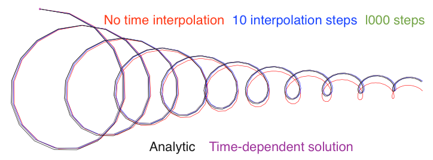

:author: Kristen M. Thyng
:email: kthyng@tamu.edu
:institution: Texas A&M University

:author: Robert D. Hetland
:email: hetland@tamu.edu
:institution: Texas A&M University

.. :video: http://www.youtube.com/watch?v=dhRUe-gz690

-----------------------------------------------------------------
TracPy: Wrapping the Fortran Lagrangian trajectory model TRACMASS
-----------------------------------------------------------------

.. class:: abstract

   Numerical Lagrangian trajectory modeling is a natural method of investigating transport in a circulation system and understanding the physics on the wide range of length scales that are actually experienced by a drifter. A previously-developed tool, TRACMASS, written in Fortran, accomplishes this modeling with a clever algorithm that operates natively on the commonly used staggered Arakawa C grid. TracPy is a Python wrapper written to ease running batches of simulations. Some improvements in TracPy include updating to netCDF4-CLASSIC from netCDF3 for saving drifter trajectories, providing an iPython notebook as a usermanual for using the system, and adding unit tests for stable continued development.

.. class:: keywords

   Lagrangian tracking, numerical drifters, Python wrapper

Introduction
------------

.. introduce and motivate Lagrangian tracking

Drifters are used in oceanography and atmospherics *in situ* in order to demonstrate flow patterns created by individual fluid parcels. For example, in the ocean, drifters will often be released on the sea surface, and allowed to be passively transported with the flow, reporting their location via GPS at regular intervals. In this way, drifters are gathering data in a Lagrangian perspective. For example, [LaCasce2003]_ analyzes a set of over 700 surface drifters released in the northern Gulf of Mexico, using the tracks to better understand the dynamics of the underlying circulation fields.

Lagrangian trajectory modeling is a method of moving parcels through a fluid based on numerically modeled circulation fields. This approach enables analysis of many different drifter experiments for a much lower cost than is required to gather one relatively small set of drifters. Additionally, the inherent limits to the number of drifters that can reasonably be used *in situ* can lead to biased statistics [LaCasce2008]_. In one study, numerical drifters were used to understand where radio-nuclides from a storage facility would travel if accidentally released [Döös2007]_. Drifters are also used in on-going response work by the Office of Response and Restoration in the National Oceanic and Atmospheric Administration (NOAA). Using model output made available by various groups, responders apply their tool (General NOAA Oil Modeling Environment, GNOME_) to simulate drifters and get best estimates of predicted oil transport [Beegle-Krause1999]_ [Beegle-Krause2001]_.

.. _GNOME: http://response.restoration.noaa.gov/oil-and-chemical-spills/oil-spills/response-tools/gnome.html

Numerical drifters may be calculated online, while a circulation model is running, in order to use the highest resolution model-predicted velocity fields available in time (on the order of seconds to minutes).  However, due to the high costs of the hydrodynamic computation, many repeated online simulations is not usually practical.  In this case, Lagrangian trajectories can also be calculated offline, using the velocity fields at the stored temporal resolution (on the order of minutes to hours). 

There are many sources of error in simulating offline Lagrangian trajectories. For example, the underlying circulation model must be capturing the dynamics to be investigated, and model output must be available often enough to represent the simulated flow conditions accurately. On top of that, the Lagrangian trajectory model must properly reproduce the transport pathways of the system.  A given drifter's trajectory is calculated using velocity fields with a spatial resolution determined by the numerical model grid. To move the drifter, the velocity fields must be available at the drifter's location, which in general will not be co-located with all necessary velocity information. Many Lagrangian trajectory models use low- or high-order interpolation in space to extend the velocity information to the drifter location.  The algorithm discussed in this work has a somewhat different approach.

.. introduce TRACMASS with links to places it has been used and introduce TracPy

TRACMASS_ is a Lagrangian trajectory model that runs natively on velocity fields that have been calculated on a staggered Arakawa C grid. Originally written about 2 decades ago, it has been used in many applications (*e.g.*, [Döös2007]_). The core algorithm for TRACMASS is written in Fortran for speed, and has been wrapped in Python for increased usability. This code package together is called TracPy_ [Thyng2014b]_.

.. _TRACMASS: http://tracmass.org
.. _TracPy:  https://github.com/kthyng/tracpy

TRACMASS
--------

.. Explain algorithm

The TRACMASS algorithm for stepping numerical drifters in space is distinct from many algorithms because it runs natively on a staggered Arakawa C grid, *i.e.*, it uses the velocity fields at the grid locations at which they are calculated. This grid is used in ocean modeling codes, including ROMS_, MITgcm_, and HyCOM_. In the staggered Arakawa C grid, the west-east or zonal velocity, :math:`u`, is located at the west and east walls of a grid cell; the north-south or meridional velocity, :math:`v`, is located at the north and south walls; and the vertical velocity, :math:`w`, is located at the vertically top and bottom cell walls (Figure :ref:`tracmass1`). Note that the algorithm is calculated using fluxes through grid cell walls instead of the velocities themselves to account for differences in cell wall size due to a curvilinear horizontal grid or a :math:`\sigma` coordinate vertical grid. The drifter is stepped as follows:

.. _ROMS: http://myroms.org
.. _MITgcm: http://mitgcm.org
.. _HyCOM: http://hycom.org

.. figure:: tracmass1.pdf

   A single rectangular grid cell is shown in the :math:`x`-:math:`y` plane. Zonal (meridional) :math:`u~(v)` velocities are calculated at the east/west (north/south) cell walls. In the vertical direction, :math:`w` velocities are calculated at the top and bottom cell walls. After [Döös2013]_. :label:`tracmass1`

1. To calculate the time required for the drifter to exit the grid cell in the :math:`x` direction:

   a. Linearly interpolate the velocity across the cell in the zonal direction to find :math:`u(x)`.
   b. Solve the ordinary differential equation :math:`{u(x)=\frac{dx}{dt}}` for :math:`x(t)`.
   c. Back out the time required to exit the grid cell in the zonal direction, :math:`t_x`. 

#. Follow the same methodology in the meridional and vertical directions to find :math:`t_y` and :math:`t_z`.
#. The minimum time :math:`t_{min}`; the minimum of :math:`t_x,t_y,t_z`; is when the drifter would first exit the grid cell
#. The subsequent :math:`(x,y,z)` position for the drifter is calculated using :math:`t_{min}`.

This process occurs for each drifter each time it is moved forward from one grid cell edge to the next. If a drifter will not reach a grid cell edge, it stops in the grid cell. Calculations for the drifter trajectories are done in grid index space so that the grid is rectangular, which introduces a number of simplifications. The velocity fields are linearly interpolated in time for each subsequent stepping of each drifter. Because a drifter is moved according to its distinct time and location, each drifter is stepped separately, and the time step between each reinterpolation can be different. The location of all drifters is sampled at regular intervals between the available circulation model outputs for consistency. Because reading in the circulation model output is one of the more time-consuming parts of the process, all drifters are stepped between the velocity fields at two consecutive times, then the velocity fields from the next output time are read in to continue stepping.

Drifters can be stepped forward or backward in time; this is accomplished essentially by multiplying the velocity fields by -1. Because of the analytic nature of the TRACMASS algorithm, the trajectories found forward and backward in time are the same. 

.. Explain options like subgrid diffusion, time interpolation, and time-dependent algorithm

Time is assumed to be steady while a drifter is being stepped through a grid cell |---| how much this will affect the resulting trajectory depends on the size of the grid cell relative to the speed of the drifter. When a drifter reaches another grid cell wall, the fields are re-interpolated. The user may choose to interpolate the velocity fields at shorter intervals if desired by setting a maximum time before reinterpolation. A time-dependent algorithm has been developed to extend the TRACMASS algorithm [DeVries2001]_, but previous researchers have found that the steady approximation is adequate in many cases [Döös2013]_ and it is not implemented in TracPy. 

The capability of the TRACMASS algorithm has been demonstrated by creating synthetic model output, running numerical drifters, and comparing with known trajectory solutions (Figure :ref:`validation`). A damped inertial oscillation is used in the test, for which the analytic solutions for both the velocity fields and a particle's trajectory are known [Döös2013]_. Cases of a drifter trajectory calculated with different levels of interpolation between model outputs are shown along with the analytic solution and a trajectory calculated using the time-dependent TRACMASS algorithm. All trajectories generally following the analytic solution, but the case with no time interpolation of the fields clearly deviates. The case with 10 interpolation steps in times performs well, and with 1000 interpolation steps, the curves are indistinguishable. Note that in this test case, the size of the grid cell relative to the motion of the trajectory emphasizes the effect of time interpolation.

   A trajectory from a damped inertial oscillation is shown from several simulated cases with the analytic solution. Cases shown are trajectories calculated using TRACMASS with zero [red], 10 [blue], and 1000 [green] time interpolation steps between model outputs; the analytic solution [black]; and the time-dependent algorithm [purple]. The green, black, and purple curves are indistinguishable. From [Döös2013]_. :label:`validation`

Options are available to complement the basic algorithm of TRACMASS. For example, it can be important to consider whether or not to add additional explicit subgrid diffusion to drifters. Energy at scales below a few spatial grid cells is not included in an ocean circulation model except through a turbulence closure scheme or other means. This energy is included in the numerical scheme and implemented in the simulation, and in this regard is implicitly included in the saved velocity fields from the circulation model. From this perspective, adding any additional subgrid energy is duplicating the energy that is already included in the simulation. However, without including some small-scale energy to drifter tracks, drifters starting at the same time and location will follow the same path, which is clearly not realistic |---| adding a small amount of energy to drifter tracks acts to stir drifters in a way that often looks more realistic than when explicit subgrid diffusion is not included. This added energy will also affect Lagrangian metrics that are calculated from drifter trajectories (*e.g.*, [Döös2011]_).

To address this issue, there are several optional means of including explicit subgrid diffusion in TRACMASS, all of which are low order schemes [LaCasce2008]_. Drifter trajectories may be stepped using not the basic velocity fields (:math:`u,v`) but with the velocity fields plus some small random velocity fluctuation (:math:`u'`, :math:`v'`) (Figure :ref:`turb`). Alternatively, drifter trajectory locations can be given an added random walk |---| randomly moved a small distance away from their location each step within a circle whose radius is controlled by an input parameter (Figure :ref:`diff`). Note that when using additional subgrid diffusion, drifter tracks will not be the same forward and backward in time. 

.. figure:: tracmassTurb.pdf
   :scale: 52%

   Instead of being stepped forward to new location :math:`(x_1,y_1)` by the base velocity field, a drifter can be instead stepped forward by the velocity field plus a random velocity fluctuation to include explicit subgrid diffusion, such that the drifter ends up instead at :math:`(x_1,y_1)'`. After [Döös2013]_. :label:`turb`

.. figure:: tracmassDiff.pdf
   :scale: 52%

   A drifter's location can be randomly pushed within a circle from its calculated position to add explicit subgrid diffusion. After [Döös2013]_. :label:`diff`

TracPy
------

.. Explain approach

The goal of TracPy is to take advantage of the speed and ingenuity of the TRACMASS algorithm, written in Fortran, but have access to the niceties of Python and for quickly and simply setting up and running batches of simulations. Being a scientific research code, TRACMASS has been developed by different researchers and with specific research purposes in mind, such that the complexity of the code grew over time.  TracPy was written to include the important basic, computationally burdensome elements of calculating drifter trajectories from TRACMASS, and do the rest in Python.

.. What have I added? Non-global variables, TracPy class, iPython user manual, test cases, unit tests

TracPy uses a class for a given simulation of drifters. The TracPy class is initialized with all necessary parameters for the simulation itself, *e.g.*, number of days to run the simulation, parameter for maximum time before reinterpolation between available circulation model outputs, whether to use subgrid diffusion, and whether to run in 2D or 3D. The class has methods for reading in the numerical grid, preparing for the simulation, preparing for each model step (*e.g.*, reading in the velocity fields at the next time step), stepping the drifters forward between the two time steps of velocity fields stored in memory, wrapping up the time step, and wrapping up the simulation. Utilities are provided in TracPy for necessary computations, such as moving between grid spaces of the drifter locations. That is, drifter locations may, in general, be given in geographic space (*i.e.*, longitude/latitude) or in projected space (*e.g.*, universal traverse mercator or Lambert conformal conic), and positions are converted between the two using Python packages Basemap or Pyproj. Additionally, drifter locations will need to be transformed between grid index space, which is used in TRACMASS, and real space. Plotting functions and common calculations are also included in the suite of code making up TracPy.

Other improvements in the code system:

- Global variables have been removed in moving from the original set of TRACMASS code to the leaner TRACMASS algorithm that exists in TracPy, and have been replaced with variables that are passed directly between functions as needed. 

- A user manual has been implemented in an iPython notebook_.

- A few simple test cases have been provided for users to experiment with and as a set of unit tests to improve stability during code development.

.. _notebook: http://nbviewer.ipython.org/urls/raw.github.com/kthyng/tracpy/master/docs/manual.ipynb

.. Discuss parallelization: a lot of usage is about running lots of cases, and it is relatively easy to distribute simulations separately amongst processes. Not set up to send different drifters to different processes, but would be difficult in the amount of model output that would be required to send different places though in some cases might be helpful

The parallelization of an offline Lagrangian trajectory model could be relatively straight-forward. Each drifter trajectory in any given simulation is independent of every other drifter. However, one of the slowest parts of drifter tracking is often reading in the velocity fields |---| separating out drifter trajectory calculations into different processes would most likely increase the input/output requirement. Still, an easy way to take advantage of the drifter calculations being inherently decoupled is to run different simulations on different processes. Many times, drifter simulations are run in large sets to gather meaningful statistics, in which case these separate simulations can all be distributed to different processes |---| as opposed to subdividing individual simulations to calculate different trajectories on different processes.

.. Could summarize what I learned about netCDF4 storage

Drifter tracks are saved in netCDF files. The file format was recently changed from netCDF3 to netCDF4-CLASSIC. This change was made because netCDF4-CLASSIC combines many of the good parts of netCDF3 (*e.g.*, file aggregation along a dimension) with some of the abilities of netCDF4 (compression). It does not allow for multiple unlimited dimensions (available in netCDF4), but that capability has not been necessary in this application. Changing to netCDF4-CLASSIC sped up the saving process, which had been slow with netCDF3 when a large number of drifters was used. The 64 bit format is used for saving the tracks for lossless compression of information.

We ran a two-dimensional test with about 270,000 surface drifters and over 100,000 grid cells for 30 days. A NaN is stored once a drifter exits the domain and forever after in time for that drifter (*i.e.*, drifters do not reenter the numerical domain). This results in a large amount of output (much of which may contain NaNs), and saving such a large file can be really slow using netCDF3. Run time and space requirement results comparing simulations run with netCDF3 and netCDF4-CLASSIC show improved results with netCDF4-CLASSIC (Table :ref:`netcdf`). The simulation run time does not include time for saving the tracks, which is listed separately. The simulation run time was the same regardless of the file format used (since it only comes in when saving the file afterward), but the file save time was massively reduced by using netCDF4-CLASSIC (about 96%). Additionally, the file size was reduced by about 42%. Note that the file size is the same between netCDF4 and netCDF4-CLASSIC (not shown).

.. table:: Comparisons between simulations run with `netCDF3_64BIT` and `netCDF4-CLASSIC`. :label:`netcdf`

   +-------------------------+----------+----------+------------+
   |                         | netCDF3  | netCDF4C | % decrease |
   +-------------------------+----------+----------+------------+
   | Simulation run time [s] | 1038     | 1038     | 0          |
   +-------------------------+----------+----------+------------+
   | File save time [s]      | 3527     | 131      | 96         |
   +-------------------------+----------+----------+------------+
   | File size [GB]          | 3.6      | 2.1      | 42         |
   +-------------------------+----------+----------+------------+

.. Performance: change number of drifters and plot timing for each part of the simulation, then do the same changing the number of grid nodes

Suites of simulations were run using TracPy to test its time performance on both a Linux workstation (Figure :ref:`comparison`) and a Macintosh laptop (not shown, but similar results). Changing the number of grid cells in a simulation (keeping the number of drifters constant at a moderate value) most affects the amount of time required to prepare the simulation, which is when the grid is read in. The grid will not be changing size in typical use cases so it may not be a significant problem, but the rapid increase in time required to run the code with an increasing number of grid cells may indicate an opportunity for improvement in the way the simulations are prepared. However, the time required to read in the grid increases exponentially with number of grid cells due to the increase in memory requirement for the grid arrays, so a change in approach to what information is necessary to have on hand for a simulation may be the only way to improve this. Changing the number of drifters (keeping the number of grid cells constant at a moderate value) affects the timing of several parts of the simulation. The base time spent preparing the simulation is mostly consistent since the grid size does not change between the cases. The time for stepping the drifters with TRACMASS, and processing after stepping drifters and at the end of the simulation increase with an increasing number of drifters, as would be expected. The time required for increasing the number of drifters should scale linearly. Files used to run these tests are available on GitHub_.

.. _GitHub: https://github.com/kthyng/tracpy_performance

.. figure:: comparison.pdf
   :align: center
   :figclass: w
   :scale: 40%

   Time required to run simulations with different numbers of grid cells (left) and drifters (right). A moderate number of drifters (5000) (left) and grid cells (100,000) (right) were used as the independent variable in the tests. For timing, the code is split into initialization [red], preparing for the run [orange], preparing for the model steps [yellow], stepping the drifters with TRACMASS [green], processing after the steps [blue], and processing at the end of the simulation [purple]. :label:`comparison`

.. Examples of use: time res paper, shelf eddy tracking, cross-shelf transport, lagrangian metrics

The TracPy suite of code has been used to investigate several research problems so far. In one study, we sought to understand the effect of the temporal resolution of the circulation model output on the resulting drifter tracks (Figure :ref:`D`). In another study, we initialized drifters uniformly throughout a numerical domain of the northwestern Gulf of Mexico and used the resulting tracks to examine the connectivity of water across the shelf break and the connectivity of surrounding waters with parts of the coastline (see *e.g.*, Figure :ref:`coastSTXseasonal`). Drifters have also been initialized at the inputs of the Mississippi and Atchafalaya rivers and tracked to illustrate the complex pathways of the fresh water (Figure :ref:`pathways`). 

.. figure:: D.pdf

   Separation distance between pairs of drifters run with circulation model velocity fields output at different temporal resolutions (given in seconds), averaged over many pairs of drifters. From [Thyng2014a]_. :label:`D`

.. figure:: coastSTXseasonal.png
   :figclass: w
   :scale: 50%

   Connectivity of waters with the southern Texas coastline over a 30 day time period, for the winter and summer months. Averaged over the years 2004-2010. Project available_ on GitHub. :label:`coastSTXseasonal`

.. figure:: river_drifter_tracks.png
   :scale: 28%

   Integrated pathways of drifters initialized in the Atchafalaya and Mississippi river inputs to the numerical domain. :label:`pathways`

.. _available: https://github.com/kthyng/shelf_transport

.. Future work (GNOME, parallelization? other stuff in my list, not storing everything at once, better ways of storing drifters since many end up as NANs? or maybe ok with netCDF4?), improve tracpy class modularity

Many improvements and extensions could be made to TracPy. It is intended to be integrated into NOAA's GNOME oil tracking system in order to contribute another mover to their tracking system and take advantage of utilities in GNOME that are not in the TRACMASS algorithm, such as the ability to directly apply windage (this can be important for modeling material that directly feels wind stress, such as large oil slicks). Potential improvements include:

- The way the grid is read in and stored is taking too much time, as was seen in the TracPy performance tests.

- Placeholders for all locations for all drifters are currently stored for the entirety of a simulation run, which inflates the memory required for a simulation. Instead, drifter locations could be only temporarily stored and appended to the output file as calculated.

- A drifter location is set to NaN when the drifter exits the domain. This is currently somewhat accounted for by using netCDF4-CLASSIC compression. However, another way to minimize unnecessary NaN storage would be to alter how drifter tracks are stored. Instead of the current approach of storing tracks in a two-dimensional array of drifter versus location in time, all drifter locations for a given time step could be stored together on the same row. This makes retrieval more difficult and requires ragged rows, but eliminates the need to store a drifter that is inactive. Alternatively, a sparse matrix could be used to only store active drifters.

- Storage could be updated to full netCDF4 format.

- The modularity of the TracPy class should be improved.

Conclusions
-----------

A Python wrapper, TracPy, to a Lagrangrian trajectory model, TRACMASS, combines the speed of the Fortran core algorithm with the ease of using Python. TracPy uses netCDF4-CLASSIC for saving trajectory paths, which is an improvement over netCDF3 in both time required to save the file and disk space required for the file. It also includes several improvements such as including an iPython notebook user manual and eliminating the use of global variables. TracPy performance tests indicate expected behavior in simulation time increase when increasing the number of drifters being simulated. However, when increasing the number of grid cells in the underlying numerical circulation model, preparing for the run takes more additional time than it probably should. The TracPy suite of code has been used for several applications so far, with more in the works for the future, along with continual code improvements.

Acknowledgements
----------------

Thanks to Chris Barker for help in improving TracPy modularity and unit tests, and for on-going work in integrating TracPy into NOAA's GNOME system. Thanks also to helpful review comments from Terry Letsche.

References
----------

.. [Barker2000] C. H. Barker & J. A. Galt.
                *Analysis of methods used in spill response planning:
                Trajectory Analysis Planner TAP II*.
                Spill Science & Technology Bulletin, 6(2),
                145-152, 2000.

.. [Beegle-Krause1999] C. J. Beegle-Krause.
                       *GNOME: NOAA’s next-generation spill trajectory
                       model*,
                       Oceans ’99 MTS/IEEE Proceedings.
                       MTS/IEEE Conference Committee, Escondido, CA,
                       vol. 3, pp. 1262–1266, 1999.

.. [Beegle-Krause2001] C. J. Beegle-Krause.
                       *General NOAA oil modeling environment (GNOME):
                       a new spill trajectory model*,
                       IOSC 2001 Proceedings, Tampa, FL, March
                       26–29, 2001. Mira Digital Publishing, Inc.,
                       St. Louis, MO, vol. 2, pp. 865–871, 2001.

.. [DeVries2001] P. de Vries, K. Döös.
                 *Calculating Lagrangian trajectories using
                 time-dependent velocity fields*, J Atmos Ocean
                 Technol 18:1092–1101, 2001.

.. [Döös2007] K. Döös, & A. Engqvist.
              *Assessment of water exchange between a discharge region
              and the open sea–A comparison of different
              methodological concepts*. Estuarine, Coastal and Shelf
              Science, 74(4), 709-721, 2007.

.. [Döös2011] K. Döös, V. Rupolo, & L. Brodeau.
              *Dispersion of surface drifters and model-simulated
              trajectories*. Ocean Modelling, 39(3), 301-310, 2011.

.. [Döös2013] K. Döös, J. Kjellsson, & B. Jönsson.
              *TRACMASS—A Lagrangian trajectory model*. In Preventive
              Methods for Coastal Protection (pp. 225-249). Springer
              International Publishing, 2013.

.. [LaCasce2003] J. H. LaCasce & C. Ohlmann.
                 *Relative dispersion at the surface of the Gulf of
                 Mexico*, Journal of Marine Research, 61(3),
                 285-312, 2003.

.. [LaCasce2008] J. H. LaCasce.
                 *Statistics from Lagrangian observations*, Progress
                 in Oceanography, 77(1), 1-29, 2008.

.. [Thyng2014a] K. M. Thyng, R. D. Hetland, R. Montuoro, J. Kurian.
                *Lagrangian tracking errors due to temporal
                subsampling of numerical model output*. Submitted to
                Journal of Atmospheric and Oceanic Technology, 2014.

.. [Thyng2014b] K. M. Thyng.
                TracPy. ZENODO. doi: ``10.5281/zenodo.10433``, 2014.
